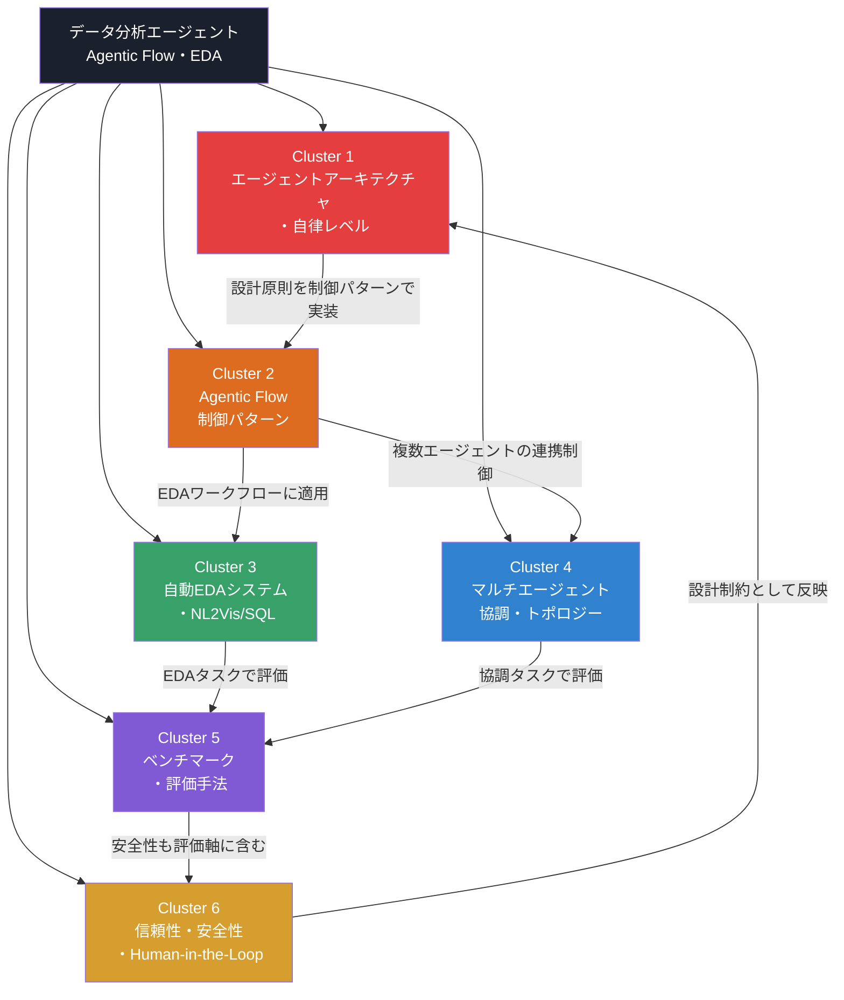

# データ分析エージェント：Agentic Flow・EDA自動化

## 研究パラメータ

- **研究タイプ**: 学術論文サーベイ
- **対象期間**: 2024年 – 2026年
- **生成日**: 2026-04-05
- **入力キーワード**: データ分析エージェント, data analysis agent, agentic flow, EDA

## 全体像

LLMベースのデータ分析エージェントは、2024年以降急速に体系化が進んだ分野である。従来の単発プロンプトによるコード生成から、計画（Planning）→ツール選択→コード実行→振り返り（Reflection）の自律的ループへと進化し、「Agentic Flow」として設計パターンが確立されつつある。探索的データ分析（EDA）の完全自動化はこの領域の主要応用先であり、VLDB/SIGMODといったトップ会議で中心テーマとなっている。2025年後半には複数の包括的サーベイ論文が発表され、データエージェントの自律レベル（L1-L5）の定義や、マルチエージェント協調のトポロジー分類（スター・リング・DAG等）が提案された。一方で、最先端LLMでもベンチマーク正答率は30%前後に留まり、信頼性・安全性の課題は未解決である。

## 参照サーベイ・レビュー論文

| タイトル | 年 | 概要 | リンク |
|---------|------|------|--------|
| LLM/Agent-as-Data-Analyst: A Survey | 2025 | セマンティック設計・自律パイプライン・ツール拡張・オープンワールドの5設計目標を体系化 | [arXiv:2509.23988](https://arxiv.org/abs/2509.23988) |
| A Survey on LLM-based Agents for Statistics and Data Science | 2025 | 統計・データサイエンス向けLLMエージェントの進化・能力を包括的に分析 | [Taylor & Francis](https://www.tandfonline.com/doi/full/10.1080/00031305.2025.2561140) |
| Large Language Model-based Data Science Agent: A Survey | 2025 | ロール・実行・知識・振り返りの4次元で設計原則を体系化 | [arXiv:2508.02744](https://arxiv.org/abs/2508.02744) |
| A Survey of Data Agents: Emerging Paradigm or Overstated Hype? | 2025 | データエージェントの実態を批判的に検証、過大評価と実力のギャップを分析 | [arXiv:2510.23587](https://arxiv.org/html/2510.23587) |
| Data Agents: Levels, State of the Art, and Open Problems | 2026 | SIGMOD 2026チュートリアル。自律レベルL1-L5を定義 | [PDF](https://luoyuyu.vip/files/SIGMOD26-Tutorial-DataAgents.pdf) |
| The Landscape of Emerging AI Agent Architectures | 2024 | ReAct, Reflexion, Plan-and-Execute等のアーキテクチャを体系的に分類 | [arXiv:2404.11584](https://arxiv.org/abs/2404.11584) |

## ドメインマップ

## クラスタサマリー

| # | クラスタ名 | キーワード数 | 概要 |
|---|-----------|-------------|------|
| 1 | [エージェントアーキテクチャ・自律レベル](cluster-01-agent-architecture.md) | 12 | データ分析エージェントの設計原則・タクソノミー・自律レベル定義 |
| 2 | [Agentic Flow制御パターン](cluster-02-agentic-flow.md) | 13 | ReAct・Plan-and-Execute・Reflection等のフロー制御手法 |
| 3 | [自動EDAシステム・NL2Vis/SQL](cluster-03-automated-eda.md) | 14 | LLM駆動型EDA・可視化生成・NL2SQL・データクリーニング自動化 |
| 4 | [マルチエージェント協調・トポロジー](cluster-04-multi-agent.md) | 11 | 役割特化型マルチエージェントの通信パターンとワークフロー設計 |
| 5 | [ベンチマーク・評価手法](cluster-05-benchmarks.md) | 12 | DA-Code・DataSciBench・Spider 2.0等のデータ分析エージェント評価体系 |
| 6 | [信頼性・安全性・Human-in-the-Loop](cluster-06-trust-safety.md) | 10 | エージェントの信頼性保証・安全性フレームワーク・人間監督メカニズム |
