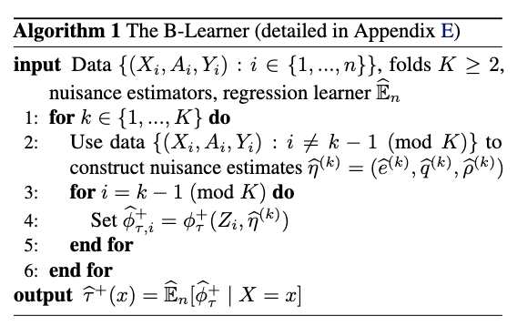
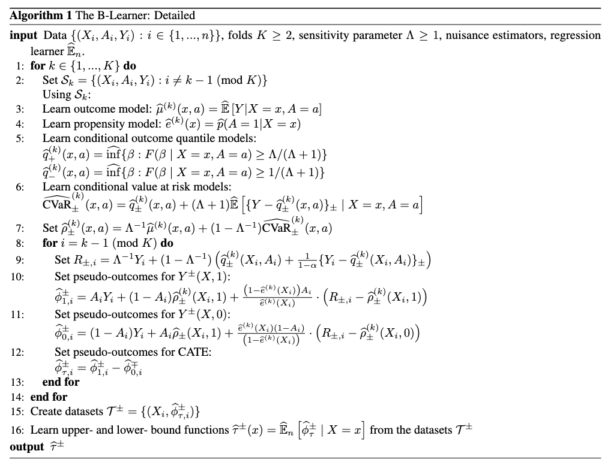

# 因果推論の論文

## [Meta-learners for Estimating Heterogeneous Treatment Effects using Machine Learning](https://arxiv.org/abs/1706.03461)

### Abstract

There is growing interest in estimating and analyzing heterogeneous treatment effects in experimental and observational studies. We describe a number of meta-algorithms that can take advantage of any supervised learning or regression method in machine learning and statistics to estimate the Conditional Average Treatment Effect (CATE) function. Meta-algorithms build on base algorithms---such as Random Forests (RF), Bayesian Additive Regression Trees (BART) or neural networks---to estimate the CATE, a function that the base algorithms are not designed to estimate directly. We introduce a new meta-algorithm, the X-learner, that is provably efficient when the number of units in one treatment group is much larger than in the other, and can exploit structural properties of the CATE function. For example, if the CATE function is linear and the response functions in treatment and control are Lipschitz continuous, the X-learner can still achieve the parametric rate under regularity conditions.

### 概要

実験・観察研究において異質処置効果の推定と分析への関心が高まっている。本研究では、機械学習・統計の教師あり学習や回帰手法を活用して条件付き平均処置効果（CATE）関数を推定する多数のメタアルゴリズムを説明する。メタアルゴリズムは、ランダムフォレスト（RF）、ベイジアン加法回帰木（BART）、ニューラルネットワークなどのベースアルゴリズムを基盤として、これらが直接推定するよう設計されていないCATE関数を推定する。本研究では新しいメタアルゴリズムであるX-learnerを導入し、これは一方の処置群のユニット数が他方よりも大幅に多い場合に証明可能な効率性を持ち、CATE関数の構造的特性を活用できる。例えば、CATE関数が線形で、処置・対照群の応答関数がリプシッツ連続である場合、X-learnerは正則条件下でパラメトリック率を達成できる。

### 課題

- **不均衡なサンプルサイズの問題**: 処置群と対照群のサンプル数が大きく異なる場合の推定精度低下
- **既存メタ学習器の限界**: T-learner、S-learnerが特定の条件下で最適でない推定を行う
- **CATE関数の構造的特性の未活用**: 線形性などの関数の性質を効果的に利用できていない
- **理論的保証の不足**: 従来手法における収束率の理論的根拠が不十分

### 提案手法

**X-learner**

X-learnerは、T-learner、S-learnerと並ぶメタ学習器の一つで、特に処置群と対照群のサンプルサイズが大きく異なる場合に効率的な推定を行う。3段階のアプローチを採用：

1. **第1段階**: 処置群と対照群でそれぞれ独立にアウトカム予測モデルを学習
2. **第2段階**: 第1段階のモデルを用いて偽薬効果（imputed treatment effects）を計算し、これを目的変数として新たなモデルを学習
3. **第3段階**: 2つの推定器を傾向スコアに基づいて重み付け平均

**特徴**:

- 不均衡なサンプルサイズに対して頑健
- CATE関数が線形の場合にパラメトリック収束率を達成
- 柔軟な機械学習手法をベースアルゴリズムとして利用可能

### その他

T, S, X, F, U-learnerの疑似コードが整理されている。

## [B-Learner: Quasi-Oracle Bounds on Heterogeneous Causal Effects Under Hidden Confounding](https://arxiv.org/abs/2304.10577)

### Abstract

Estimating heterogeneous treatment effects from observational data is a crucial task across many fields, helping policy and decision-makers take better actions. There has been recent progress on robust and efficient methods for estimating the conditional average treatment effect (CATE) function, but these methods often do not take into account the risk of hidden confounding, which could arbitrarily and unknowingly bias any causal estimate based on observational data. We propose a meta-learner called the B-Learner, which can efficiently learn sharp bounds on the CATE function under limits on the level of hidden confounding.

### 概要

観察データからの異質処置効果の推定は多くの分野で重要な課題であり、政策立案者や意思決定者がより良い行動を取るのに役立つ。条件付き平均処置効果（CATE）関数を推定するための頑健で効率的な手法について最近の進歩があるが、これらの手法は隠れた交絡のリスクを考慮しないことが多く、観察データに基づく因果推定を任意にかつ知らないうちにバイアスさせる可能性がある。本研究では、隠れた交絡のレベルに制限を設けた下で、CATE関数に対する鋭い境界を効率的に学習できるB-Learnerと呼ばれるメタ学習器を提案する。

### 課題

- **隠れた交絡の影響**: 観察データでは測定されていない交絡変数が因果推定にバイアスをもたらす
- **点推定の限界**: 従来のメタ学習器は点推定のみで不確実性を定量化できない
- **交絡レベルの不明**: 隠れた交絡の程度が事前に分からない状況での推定
- **政策決定における信頼性**: 不確実性を考慮しない推定結果による政策判断のリスク

### 提案手法

**B-Learner**

B-Learnerは隠れた交絡の存在下でCATE関数に対する鋭い信頼区間を効率的に学習するメタ学習器。従来のメタ学習器が点推定のみを提供するのに対し、B-Learnerは隠れた交絡の影響を定量化した境界推定を可能にする。

**特徴**:

- 隠れた交絡の感度パラメータを明示的に考慮
- ネイマン直交性に基づく二重頑健推定
- 交絡レベルの制約下でのCATE関数の上限・下限を同時推定
- 政策決定における不確実性の定量化が可能

### その他

DR-learnerベースで信頼区間の上限と下限を追加したもの。

疑似コード

詳細な疑似コード

## [Meta-learning for heterogeneous treatment effect estimation with closed-form solvers](https://arxiv.org/abs/2305.11353)

### Abstract

This article proposes a meta-learning method for estimating the conditional average treatment effect (CATE) from a few observational data. The proposed method learns how to estimate CATEs from multiple tasks and uses the knowledge for unseen tasks. In the proposed method, based on the meta-learner framework, we decompose the CATE estimation problem into sub-problems. For each sub-problem, we formulate our estimation models using neural networks with task-shared and task-specific parameters. With our formulation, we can obtain optimal task-specific parameters in a closed form that are differentiable with respect to task-shared parameters, making it possible to perform effective meta-learning.

### 概要

本論文では、少数の観察データから条件付き平均処置効果（CATE）を推定するメタ学習手法を提案する。概要は複数のタスクからCATEの推定方法を学習し、その知識を未知のタスクに活用する。概要では、メタ学習器フレームワークに基づいてCATE推定問題をサブ問題に分解する。各サブ問題に対して、タスク共有パラメータとタスク固有パラメータを持つニューラルネットワークを用いて推定モデルを定式化する。この定式化により、タスク共有パラメータに関して微分可能な閉形式で最適なタスク固有パラメータを得ることができ、効果的なメタ学習を実行することが可能になる。

### 課題

- **少数データでの推定困難**: 限られた観察データからの正確なCATE推定の困難さ
- **タスク間の知識転移の非効率性**: 従来手法では複数タスクからの学習が非効率
- **最適化の計算コスト**: タスク固有パラメータの最適化に要する計算負荷
- **汎化性能の低下**: 新規タスクでの推定精度の不足

**閉形式解を持つメタ学習CATE推定器**

少数のデータからCATEを推定するメタ学習フレームワーク。ニューラルネットワークベースの推定器にタスク共有・タスク固有パラメータを導入し、各サブ問題で閉形式解を得ることで効率的な学習を実現。

**特徴**:

- 複数のタスクから学習した知識を新規タスクに転移
- タスク固有パラメータを閉形式で最適化
- 勾配ベースのメタ学習アルゴリズムとの互換性
- 少数データでの高精度なCATE推定が可能

## その他

## [A Meta-Learning Approach for Estimating Heterogeneous Treatment Effects Under Hölder Continuity](https://www.mdpi.com/2227-7390/13/11/1739)

### Abstract

Estimating heterogeneous treatment effects plays a vital role in many statistical applications, such as precision medicine and precision marketing. In this paper, we propose a novel meta-learner, termed RXlearner for estimating the conditional average treatment effect (CATE) within the general framework of meta-algorithms. RXlearner enhances the weighting mechanism of the traditional Xlearner to improve estimation accuracy. We establish non-asymptotic error bounds for RXlearner under a continuity classification criterion, specifically assuming that the response function satisfies Hölder continuity.

### 概要

異質処置効果の推定は、精密医療や精密マーケティングなど多くの統計的応用において重要な役割を果たしている。本論文では、メタアルゴリズムの一般的フレームワーク内で条件付き平均処置効果（CATE）を推定するRXlearnerと呼ばれる新規メタ学習器を提案する。RXlearnerは従来のXlearnerの重み付けメカニズムを強化して推定精度を向上させる。応答関数がヘルダー連続性を満たすと仮定した連続性分類基準下で、RXlearnerの非漸近誤差境界を確立する。

### 課題

- **X-learnerの重み付けの非最適性**: 従来のX-learnerの重み付けスキームが理論的に最適でない
- **連続性仮定の未活用**: 応答関数の滑らかさ（ヘルダー連続性）を効果的に利用できていない
- **推定精度の改善余地**: 既存メタ学習器の推定精度に改善の余地がある
- **理論的保証の強化**: より強い理論的誤差境界の必要性

**RX-learner**

X-learnerの重み付けメカニズムを改良したメタ学習器。ヘルダー連続性仮定下でより正確なCATE推定を実現する。

**特徴**:

- X-learnerの重み付けスキームを理論的に最適化
- ヘルダー連続性条件下での非漸近誤差境界を保証
- 連続性分類基準に基づく推定精度の向上
- 精密医療・精密マーケティングでの応用に適している

### その他

RX-learnerの疑似コード

## [M-learner:A Flexible And Powerful Framework To Study Heterogeneous Treatment Effect In Mediation Model](https://arxiv.org/abs/2505.17917)

### Abstract

We propose a novel method, termed the M-learner, for estimating heterogeneous indirect and total treatment effects and identifying relevant subgroups within a mediation framework. The procedure comprises four key steps. First, we compute individual-level conditional average indirect/total treatment effect Second, we construct a distance matrix based on pairwise differences. Third, we apply tSNE to project this matrix into a low-dimensional Euclidean space, followed by K-means clustering to identify subgroup structures. Finally, we calibrate and refine the clusters using a threshold-based procedure to determine the optimal configuration.

### 概要

媒介フレームワーク内で異質間接・総処置効果を推定し、関連サブグループを識別するM-learnerと呼ばれる新規手法を提案する。手順は4つの主要ステップから構成される。まず、個人レベルの条件付き平均間接・総処置効果を計算する。次に、ペアワイズ差に基づく距離行列を構築する。第三に、tSNEを適用してこの行列を低次元ユークリッド空間に投影し、続いてK-meansクラスタリングを用いてサブグループ構造を識別する。最後に、最適な構成を決定するため閾値ベース手順を用いてクラスターを較正・精緻化する。

### 課題

- **媒介効果の異質性の見落とし**: 従来の因果推論では媒介効果の個人間での違いを考慮していない
- **サブグループの自動識別の困難**: 関連する異質性パターンを持つサブグループの特定が困難
- **間接・総効果の同時推定の複雑さ**: 媒介分析において複数の効果を同時に推定する手法の不足
- **高次元データでの解釈困難**: 複雑なデータ構造での結果の可視化・解釈の困難さ

**M-learner**

媒介分析フレームワーク内で異質な間接・総処置効果を推定し、関連サブグループを識別する新規メタ学習器。次元削減とクラスタリングを組み合わせた4段階アプローチを採用。

**特徴**:

- 媒介効果の異質性を明示的にモデル化
- tSNE + K-meansによるサブグループの自動識別
- 個人レベルの間接・総処置効果の同時推定
- 閾値ベース較正による最適クラスター構成の決定

### その他

## [Differentially Private Learners for Heterogeneous Treatment Effects](https://arxiv.org/abs/2503.03486)

### Abstract

Patient data is widely used to estimate heterogeneous treatment effects and thus understand the effectiveness and safety of drugs. Yet, patient data includes highly sensitive information that must be kept private. In this work, we aim to estimate the conditional average treatment effect (CATE) from observational data under differential privacy. Specifically, we present DP-CATE, a novel framework for CATE estimation that is Neyman-orthogonal and further ensures differential privacy of the estimates.

### 概要

患者データは異質処置効果を推定し、薬物の有効性と安全性を理解するために広く使用されている。しかし、患者データには秘匿すべき高度に機密性の高い情報が含まれている。本研究では、差分プライバシー下で観察データから条件付き平均処置効果（CATE）を推定することを目指す。具体的には、ネイマン直交性を持ちつつ推定値の差分プライバシーを保証する、CATE推定のための新規フレームワークDP-CATEを提示する。

### 課題

- **医療データのプライバシー保護**: 患者データに含まれる高度に機密性の高い情報の保護
- **プライバシー制約下での推定精度**: 差分プライバシー制約による推定精度の低下
- **既存手法のプライバシー配慮不足**: 従来のCATE推定手法ではプライバシー保護が考慮されていない
- **法規制への対応**: 医療・ヘルスケア分野での厳格なデータ保護規制への対応

**DP-CATE**

差分プライバシー制約下でCATE推定を行う新規フレームワーク。医療データなど機密性の高いデータでの因果推論を可能にする。

**特徴**:

- ネイマン直交性に基づく二重頑健推定
- 差分プライバシー保証の理論的基盤
- 医療・ヘルスケアデータでの実用性
- プライバシー保護と推定精度のトレードオフの最適化

## [A Meta-learner for Heterogeneous Effects in Difference-in-Differences](https://arxiv.org/abs/2502.04699)

### Abstract

We address the problem of estimating heterogeneous treatment effects in panel data, adopting the popular Difference-in-Differences (DiD) framework under the conditional parallel trends assumption. We propose a novel doubly robust meta-learner for the Conditional Average Treatment Effect on the Treated (CATT), reducing the estimation to a convex risk minimization problem involving a set of auxiliary models. Our framework allows for the flexible estimation of the CATT, when conditioning on any subset of variables of interest using generic machine learning.

### 概要

条件付き平行トレンド仮定下で人気の差分の差分（DiD）フレームワークを採用し、パネルデータにおける異質処置効果の推定問題に取り組む。処置群の条件付き平均処置効果（CATT）のための新規二重頑健メタ学習器を提案し、推定を補助モデルの集合を含む凸リスク最小化問題に帰着させる。本フレームワークは、汎用機械学習を用いて任意の関心変数のサブセットで条件付けた場合のCATTの柔軟な推定を可能にする。

### 課題

- **パネルデータでの異質性推定の困難**: 時系列構造を持つデータでのCATE推定の複雑さ
- **DiDフレームワークの制約**: 従来のDiD手法では異質処置効果を十分に捉えられない
- **平行トレンド仮定の条件付き拡張**: 条件付き平行トレンド仮定下での推定手法の不足
- **時変交絡の対処**: パネルデータでの時間変化する交絡要因への対応

**DiD Meta-learner**

パネルデータにおけるDiDフレームワーク内で異質処置効果を推定する二重頑健メタ学習器。条件付き平行トレンド仮定下でCATTを推定。

**特徴**:

- DiDフレームワークとメタ学習の融合
- 二重頑健性による推定の安定性
- 凸リスク最小化による効率的推定
- パネルデータの時系列構造を活用

## [Robust CATE Estimation Using Novel Ensemble Methods](https://arxiv.org/abs/2407.03690)

### Abstract

The estimation of Conditional Average Treatment Effects (CATE) is crucial for understanding the heterogeneity of treatment effects in clinical trials. We evaluate the performance of common methods, including causal forests and various meta-learners, across a diverse set of scenarios, revealing that each of the methods struggles in one or more of the tested scenarios. To address this limitation of existing methods, we propose two new ensemble methods that integrate multiple estimators to enhance prediction stability and performance - Stacked X-Learner which uses the X-Learner with model stacking for estimating the nuisance functions, and Consensus Based Averaging (CBA), which averages only the models with highest internal agreement.

### 概要

条件付き平均処置効果（CATE）の推定は、臨床試験における処置効果の異質性を理解するために重要である。因果フォレストや様々なメタ学習器を含む一般的手法の性能を多様なシナリオで評価し、各手法がテストされたシナリオの1つ以上で苦戦することを明らかにした。既存手法のこの限界に対処するため、予測の安定性と性能を向上させるために複数の推定器を統合する2つの新しいアンサンブル手法を提案する：ニューサンス関数の推定にモデルスタッキングを用いたX-LearnerであるStacked X-Learnerと、最も高い内部一致を持つモデルのみを平均化するConsensus Based Averaging（CBA）である。

### 課題

- **既存手法の不安定性**: 因果フォレストや各種メタ学習器が特定シナリオで性能低下
- **単一手法の限界**: 1つの推定手法では多様なデータ特性に対応できない
- **予測の信頼性不足**: 推定結果の安定性と信頼性の欠如
- **シナリオ依存の性能**: データの特性に応じた推定手法の適応的選択の困難さ

**Stacked X-Learner & Consensus Based Averaging (CBA)**

既存のメタ学習器の限界を克服するための2つのアンサンブル手法。複数推定器の統合により予測安定性と性能を向上させる。

**Stacked X-Learner**:

- X-learnerとモデルスタッキングの組み合わせ
- ニューサンス関数推定の改善
- 複数ベースモデルの最適な重み付け

**Consensus Based Averaging (CBA)**:

- 内部一致度に基づくモデル選択
- 高一致モデルのみの平均化
- 予測の信頼性向上

## [Hybrid Meta-learners for Estimating Heterogeneous Treatment Effects](https://arxiv.org/abs/2506.13680)

### Abstract

Estimating conditional average treatment effects (CATE) from observational data involves modeling decisions that differ from supervised learning, particularly concerning how to regularize model complexity. Previous approaches can be grouped into two primary "meta-learner" paradigms that impose distinct inductive biases. Indirect meta-learners first fit and regularize separate potential outcome (PO) models and then estimate CATE by taking their difference, whereas direct meta-learners construct and directly regularize estimators for the CATE function itself. In this paper, we introduce the Hybrid Learner (H-learner), a novel regularization strategy that interpolates between the direct and indirect regularizations depending on the dataset at hand.

### 概要

観察データから条件付き平均処置効果（CATE）を推定することは、特にモデルの複雑性を正則化する方法に関して、教師あり学習とは異なるモデリング決定を含む。従来のアプローチは、異なる帰納的バイアスを課す2つの主要な「メタ学習器」パラダイムにグループ化できる。間接メタ学習器は最初に別々のポテンシャル結果（PO）モデルを適合・正則化し、次にそれらの差を取ってCATEを推定するが、直接メタ学習器はCATE関数自体の推定器を構築・直接正則化する。本論文では、手持ちのデータセットに応じて直接・間接正則化を補間する新規正則化戦略であるハイブリッド学習器（H-learner）を導入する。

### 課題

- **正則化パラダイムの固定性**: 直接・間接メタ学習器が固定的な正則化戦略を採用
- **データ特性への非適応性**: データセットの特性に応じた柔軟な手法選択の不足
- **モデル複雑性制御の最適化不足**: CATE推定特有のモデル複雑性制御の課題
- **教師あり学習との差異**: 因果推論と教師あり学習での最適化目標の根本的違い

**H-learner**

直接・間接メタ学習パラダイムを統合した新規正則化戦略。データセットの特性に応じて最適な正則化手法を適応的に選択する。

**特徴**:

- 直接・間接正則化の適応的補間
- データ特性に基づく自動的な戦略選択
- T-learner（間接）とX-learner（直接）の利点を統合
- モデル複雑性制御の最適化

## [Nonparametric Estimation of Heterogeneous Treatment Effects: From Theory to Learning Algorithms](https://arxiv.org/abs/2101.10943)

### Abstract

The need to evaluate treatment effectiveness is ubiquitous in most of empirical science, and interest in flexibly investigating effect heterogeneity is growing rapidly. To do so, a multitude of model-agnostic, nonparametric meta-learners have been proposed in recent years. Such learners decompose the treatment effect estimation problem into separate sub-problems, each solvable using standard supervised learning methods. Choosing between different meta-learners in a data-driven manner is difficult, as it requires access to counterfactual information. Therefore, with the ultimate goal of building better understanding of the conditions under which some learners can be expected to perform better than others a priori, we theoretically analyze four broad meta-learning strategies which rely on plug-in estimation and pseudo-outcome regression.

### 概要

処置効果を評価する必要性はほとんどの実証科学に遍在し、効果の異質性を柔軟に調査することへの関心が急速に高まっている。これを行うため、近年多くのモデル非依存・ノンパラメトリックメタ学習器が提案されてきた。このような学習器は処置効果推定問題を別々のサブ問題に分解し、それぞれを標準的教師あり学習手法で解決可能にする。異なるメタ学習器間をデータ駆動的に選択することは、反実仮想情報へのアクセスを要求するため困難である。従って、どの学習器が他より良い性能を示すと事前に期待できる条件についてより良い理解を構築することを最終目標とし、プラグイン推定と擬似結果回帰に依存する4つの広範なメタ学習戦略を理論的に分析する。

### 課題

- **メタ学習器選択の指針不足**: データ特性に基づく手法選択の理論的根拠が不明
- **反実仮想情報への依存**: 手法比較に必要な反実仮想データへのアクセス困難
- **理論的性質の未解明**: 各メタ学習器の収束率や適用条件が不明確
- **実用的選択基準の欠如**: 実際のデータ分析での手法選択指針の不足

**4つのメタ学習戦略の理論分析**

既存のメタ学習器（T-learner、S-learner、X-learner、R-learner）の理論的性質を包括的に分析し、各手法の適用条件と性能特性を明確化。

**分析対象**:

- **T-learner**: 独立推定戦略
- **S-learner**: 単一モデル戦略  
- **X-learner**: 交差推定戦略
- **R-learner**: ロビンソン分解戦略

**特徴**:

- プラグイン推定と擬似結果回帰の理論的比較
- 各手法の収束率と適用条件の明確化
- データ特性に基づく手法選択指針の提供
