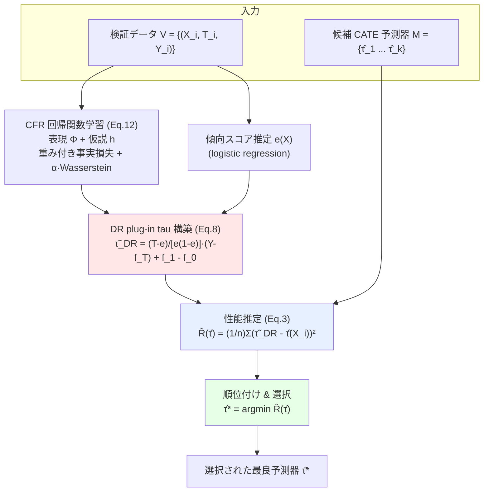

# Counterfactual Cross-Validation: Stable Model Selection Procedure for Causal Inference Models

## メタ情報

| 項目 | 内容 |
|------|------|
| **タイトル** | Counterfactual Cross-Validation: Stable Model Selection Procedure for Causal Inference Models |
| **著者** | Yuta Saito (東京工業大学), Shota Yasui (株式会社サイバーエージェント) |
| **発表年** | 2019 (arXiv 初稿) / ICML 2020 採択 |
| **会議** | 37th International Conference on Machine Learning (ICML), Vienna, Austria, PMLR 119 |
| **arXiv** | [1909.05299](https://arxiv.org/abs/1909.05299) (v5: 2020-07-16) |
| **PMLR** | [proceedings.mlr.press/v119/saito20a.html](https://proceedings.mlr.press/v119/saito20a.html) |
| **コード** | [github.com/usaito/counterfactual-cv](https://github.com/usaito/counterfactual-cv) |
| **キーワード** | CATE, モデル選択, 因果推論, doubly robust, counterfactual regression, ランク保存 |

---

## Abstract（原文）

> We study the model selection problem in conditional average treatment effect (CATE) prediction. Unlike previous works on this topic, we focus on preserving the rank order of the performance of candidate CATE predictors to enable accurate and stable model selection. To this end, we analyze the model performance ranking problem and formulate guidelines to obtain a better evaluation metric. We then propose a novel metric that can identify the ranking of the performance of CATE predictors with high confidence. Empirical evaluations demonstrate that our metric outperforms existing metrics in both model selection and hyperparameter tuning tasks.

## Abstract（日本語訳）

本研究は、条件付き平均処置効果（CATE）予測におけるモデル選択問題を扱う。従来研究と異なり、本論文は候補となる CATE 予測器の**性能順位（rank order）の保存**に焦点を当て、正確かつ安定したモデル選択を可能にすることを目指す。そのために、モデル性能のランキング問題を分析し、より良い評価指標を得るためのガイドラインを定式化する。続いて、CATE 予測器の性能順位を高い信頼度で識別できる新しい指標を提案する。実験的評価により、提案指標がモデル選択・ハイパーパラメータチューニングの両タスクで既存指標を上回ることを示す。

---

## Overview

CATE 予測器（個別処置効果の予測モデル）を実データに適用する際の最大の難所は、**真の CATE が観測不可能なため、どのモデルが最良かを検証できない**点にある。通常の機械学習なら hold-out / cross-validation で MSE を測ればよいが、因果推論では「同一個体が処置あり/なしの両方の結果を同時に取れない（反実仮想の欠落）」ため、MSE 自体が計算できない。

本論文の核心的な発想は、「真の性能値を当てる」のではなく「候補モデルの**性能順位だけを正しく保てればよい**」という観点の転換である。順位推定は値の推定より易しく、モデル選択・ハイパラ調整にはそれで十分。著者らはこの観点から理想的指標が満たすべき条件を理論的に導き、**doubly robust (DR) 推定**と **counterfactual regression (CFR)** を融合した新しい plug-in tau に基づく評価手順 **CF-CV（Counterfactual Cross-Validation）** を提案する。

---

## Problem：なぜ CATE はモデル選択が難しいのか

### 記法（Setup, §3）

- 特徴量 $X \in \mathcal{X} \subseteq \mathbb{R}^d$、処置割当 $T \in \{0,1\}$
- 潜在結果 $Y(0), Y(1)$（Rubin の潜在結果フレームワーク）
- 傾向スコア $e(x) := \mathbb{P}(T=1 \mid X=x)$
- 条件付き期待結果 $m_t(x) := \mathbb{E}[Y(t) \mid X=x]$
- **CATE**: $\tau(x) := \mathbb{E}[Y(1) - Y(0) \mid X=x]$

**標準的仮定**：
1. **Unconfoundedness（条件付き独立）**: $Y(0),Y(1) \perp T \mid X$
2. **Overlap（重なり）**: $0 < e(x) < 1$
3. **Consistency**: $Y = TY(1) + (1-T)Y(0)$

### 本質的な困難

理想的に測りたいのは真の性能指標（= PEHE）：

$$
\mathcal{R}_{true}(\hat\tau) := \mathbb{E}_X\!\left[(\tau(X) - \hat\tau(X))^2\right] \quad (1)
$$

しかし $\tau(X)$ は反実仮想を含むため**決して観測できない**。よって MSE などの損失が直接計算できず、cross-validation がそのままでは使えない。これがモデル選択・ハイパラ調整を困難にする根本原因である。

### 既存指標の限界（§2, §5.1）

| 指標 | 概要 | 弱点 |
|------|------|------|
| **IPW validation** (Gutierrez & Gérardy 2017) | IPW で擬似ラベル $\tilde\tau_{IPW}$ を作り MSE 風に評価 | 分散が大きく順位が不安定 |
| **$\tau$-risk** (Schuler 2018 / R-learner) | R-learner の損失関数を流用 | 不偏性・順位保存の保証が弱い |
| **Plug-in validation** | ML で潜在結果を予測し差分を擬似ラベル化 | 不偏だが有限標本の不確実性を制御しない |
| **TECV** (Rolling & Yang 2014) | 傾向スコアマッチングベース | 漸近分散など不確実性を未分析 |

著者らの主張：**既存指標はいずれも「真の指標値を当てる」ことを目指すか、不確実性を考慮していない**。順位の保存とその有限標本不確実性こそが本質。

---

## Proposed Method：性能順位を保存する CF-CV

### 設計目標（§4）

理想的な性能推定器 $\widehat{\mathcal{R}}$ は次の**順位保存条件**を満たすべき：

$$
\mathcal{R}_{true}(\hat\tau) \le \mathcal{R}_{true}(\hat\tau') \;\Rightarrow\; \widehat{\mathcal{R}}(\hat\tau) \le \widehat{\mathcal{R}}(\hat\tau'), \quad \forall \hat\tau,\hat\tau' \in \mathcal{M} \quad (2)
$$

ここで $\mathcal{M} = \{\hat\tau_1,\dots,\hat\tau_{|\mathcal{M}|}\}$ は候補 CATE 予測器の集合。この条件が満たされれば、$\arg\min_{\hat\tau} \widehat{\mathcal{R}}(\hat\tau)$ により真の最良モデルを選べる。

### 実行可能な推定器（plug-in tau）

$$
\widehat{\mathcal{R}}(\hat\tau) := \frac{1}{n}\sum_{i=1}^{n} \big(\tilde\tau(X_i,T_i,Y_i) - \hat\tau(X_i)\big)^2 \quad (3)
$$

$\tilde\tau(\cdot)$ は検証データから計算する **plug-in tau**（真の CATE の代理ラベル）。問題は「どんな plug-in tau なら順位が保たれるか」。

### 良い plug-in tau の条件（§4.1）

**Proposition 1**: plug-in tau が真の CATE に対し**不偏**（$\mathbb{E}[\tilde\tau(X,T,Y)\mid X]=\tau(X)$）なら、推定器の期待値は真の指標値と、$\hat\tau$ に依存しない項に分解される：

$$
\mathbb{E}\big[\widehat{\mathcal{R}}(\hat\tau)\big] = \mathcal{R}_{true}(\hat\tau) + \underbrace{\mathbb{E}\big[(\tau(X)-\tilde\tau(X,T,Y))^2\big]}_{\hat\tau \text{ に非依存}} \quad (4)
$$

第2項が $\hat\tau$ に依らないため、**期待値レベルでは候補間の真の性能差が完全に保存される**（順位保存が期待値で成立）。

ただし期待値は計算不能。そこで**有限標本の不確実性**を分解（§4.1）：

$$
\widehat{\mathcal{R}}(\hat\tau) = \underbrace{\tfrac{1}{n}\sum (\tau(X_i)-\hat\tau(X_i))^2}_{\to \mathcal{R}_{true}} - \underbrace{\tfrac{2}{n}\sum (\hat\tau(X_i)-\tau(X_i))(\tilde\tau(X_i,T_i,Y_i)-\tau(X_i))}_{\mathcal{W}: \text{不確実性の源}} + \underbrace{\tfrac{1}{n}\sum (\tau(X_i)-\tilde\tau(X_i,T_i,Y_i))^2}_{\hat\tau \text{ に非依存}} \quad (5)
$$

順位を乱すのは中央項 $\mathcal{W}$ のみ。$\mathcal{W}$ は plug-in tau の設計で制御可能。

**Theorem 2**: plug-in tau が不偏かつ各インスタンス独立なら、$\mathcal{W}$ の分散は次で上界される：

$$
\mathbb{V}(\mathcal{W}) \le 4 C_{\max}\, n^{-1}\, \mathbb{E}_X\big[\mathbb{V}(\tilde\tau(X,T,Y)\mid X)\big] \quad (6)
$$

$C_{\max} = \sup_x (\tau(x)-\hat\tau(x))^2$。よって理想の plug-in tau は次の最適化問題の解：

$$
\min_{\tilde\tau \in \Theta}\; \mathbb{E}_X\big[\mathbb{V}(\tilde\tau(X,T,Y)\mid X)\big] \quad \text{s.t.}\quad \mathbb{E}[\tilde\tau(X,T,Y)\mid X]=\tau(X) \quad (7)
$$

すなわち**「不偏性を保ちながら条件付き分散を最小化」**する plug-in tau を作ることが目標。

---

## Key Formulas（提案指標の定義）

### Doubly Robust plug-in tau（Definition 4）

$$
\boxed{\;\tilde\tau_{DR}(X,T,Y;f_t) := \frac{T-e(X)}{e(X)(1-e(X))}\big(Y - f_T(X)\big) + f_1(X) - f_0(X)\;} \quad (8)
$$

$f_t:\mathcal{X}\to\mathcal{Y}$ は任意の回帰関数。

**Proposition 3（不偏性）**: 真の傾向スコアと回帰関数が与えられれば $\tilde\tau_{DR}$ は真の CATE に対し不偏。

**Proposition 4（条件付き分散）**: $\tilde\tau_{DR}$ の期待条件付き分散は

$$
\mathbb{E}_X[\mathbb{V}(\tilde\tau_{DR}\mid X)] = \zeta + \mathbb{E}_X\!\Big[\sum_{t\in\mathcal{T}} \sqrt{w_t(X)}\,(f_t(X)-m_t(X))^2\Big] \quad (9)
$$

$$
w_t(X) := \frac{t(1-2e(X)) + e(X)^2}{e(X)(1-e(X))}, \qquad \zeta := \mathbb{E}_X\!\Big[\sum_{t}\frac{e(X)+t(1-2e(X))}{e(X)(1-e(X))}(Y(t)-m_t(X))^2\Big]
$$

$\zeta$ は $f$ に非依存。よって $f$ の学習で第2項を最小化すればよい。

### 観測量で上界（Theorem 5）

第2項は反実仮想を含むため直接最小化不能。CFR の発想で観測可能量による上界を導く：

$$
\mathbb{E}_X\big[\textstyle\sum_t \sqrt{w_t(X)}(f_t(X)-m_t(X))^2\big] \le 2\big(\epsilon^{w_1}_{F_1}(h,\Phi)+\epsilon^{w_0}_{F_0}(h,\Phi)\big) + B_\Phi\,\mathrm{IPM}_G(p_t^\Phi, p_{1-t}^\Phi) - 2\sigma^2 \quad (11)
$$

右辺は**事実損失（factual loss）**と、表現空間上の**IPM（積分確率指標、実験では Wasserstein 距離）**から成り、観測サンプルで推定可能。

### 最終的な学習損失（Eq. 12）

回帰関数を $f_t(x)=h(\Phi(x),t)$ と構成し、表現関数 $\Phi$ と仮説 $h$ を end-to-end で学習：

$$
h,\Phi = \arg\min_{h,\Phi}\; \underbrace{\sum_{i=1}^n \frac{w'_t(x_i)}{n} L\big(h(\Phi(x_i),t_i), y_i\big)}_{\text{重み付き経験リスク}} + \alpha\, \underbrace{\mathrm{IPM}_G\big(\{\Phi(x_i)\}_{t_i=0}, \{\Phi(x_i)\}_{t_i=1}\big)}_{\text{分布間距離}} \quad (12)
$$

$w'_t(x_i)=\frac{w_t(x_i)}{2}\big(\frac{t_i}{\hat\pi_1}+\frac{1-t_i}{\hat\pi_0}\big)$、$\alpha$ は trade-off ハイパーパラメータ。深層ニューラルネットを Adam で最適化。

> **要点**: CF-CV の plug-in tau は (i) DR により**不偏**で、(ii) CFR 構造により**有限標本不確実性 $\mathcal{W}$ の上界を最小化**する。これが順位の安定保存をもたらす。

---

## Algorithm（疑似コード）

```
Algorithm 1: Counterfactual Cross-Validation (CF-CV)

Require:
  - 候補 CATE 予測器集合      M = {τ̂_1, ..., τ̂_|M|}
  - 観測検証データセット      V = {(X_i, T_i, Y_i)}_{i=1}^n
  - trade-off ハイパラ        α

  1: V を用いて Eq.(12) を最小化し f(X,T)（= h, Φ）を学習
  2: 傾向スコア e(X) を推定（必要なら。実験では logistic regression）
  3: V の各サンプルに対し DR plug-in tau τ̃_DR を計算  ... Eq.(8)
  4: 性能推定器 R̂ と τ̃_DR で M の各候補を評価        ... Eq.(3)

Ensure:
  選択された予測器  τ̂* = argmin_{τ̂ ∈ M} R̂(τ̂)
```

---

## Architecture



**設計思想（ASCII）**

```
[既存] 真の指標値を当てる ──► 分散大 ──► 順位が崩れる ──► 不安定なモデル選択
                                                  │
[CF-CV] 順位だけ保てばよい ──► DR(不偏) + CFR(分散↓) ──► W の上界最小化 ──► 安定選択
```

---

## Figures & Tables

### Table 1：評価指標の比較（モデル選択 & ハイパラ調整性能）

IHDP（100 realizations、35/35/30 train/val/test split、候補 $|\mathcal{M}|=25$）における比較。赤字は各列の最良値。

| Method | Rank Corr. (Mean ±StdErr) | Rank Corr. (Worst) | Regret (Mean) | Regret (Worst) | NRMSE (Mean) | NRMSE (Worst) |
|--------|---------------------------|--------------------|---------------|----------------|--------------|---------------|
| IPW | 0.195 ±0.039 | -0.749 | 1.032 ±0.100 | 6.779 | 0.336 ±0.013 | 0.737 |
| $\tau$-risk | 0.312 ±0.030 | -0.553 | 1.392 ±0.030 | 7.884 | 0.324 ±0.011 | 0.700 |
| Plug-in | 0.914 ±0.006 | 0.591 | 0.073 ±0.012 | 0.780 | 0.257 ±0.010 | 0.490 |
| **CF-CV (ours)** | **0.921 ±0.005** | **0.666** | **0.066 ±0.012** | **0.562** | **0.256 ±0.009** | **0.483** |

**読み取り**: CF-CV はすべての列で最良。とりわけ **worst-case 性能**（rank corr. 0.666 vs plug-in 0.591、regret 0.562 vs 0.780）で顕著に優れ、**安定性**が際立つ。IPW・$\tau$-risk は worst-case で rank correlation が負になり、順位が逆転し得る（実用上危険）。

### Figure 1：trade-off ハイパラ $\alpha$ に対する頑健性

- **(a) Rank correlation**: $\alpha$ を $0.01 \sim 100$（log スケール）で変化させても CF-CV は plug-in を概ね上回る。小さい $\alpha$ で特に良好、大きい $\alpha$ では僅かに plug-in が上回る場面あり。
- **(b) Regret**: CF-CV は**全ての $\alpha$ 値で**plug-in より低い regret を維持。$\alpha$ 選択に対する頑健性を示す。

### 評価指標の定義（実験で使用）

**Rank Correlation**: 真の性能順位と推定指標値順位の Spearman 順位相関。

**Regret（モデル選択の後悔）**:

$$
Regret = \frac{\mathcal{R}_{true}(\hat\tau_{selected}) - \mathcal{R}_{true}(\hat\tau_{best})}{\mathcal{R}_{true}(\hat\tau_{best})}
$$

$\hat\tau_{selected}=\arg\min_{\hat\tau}\widehat{\mathcal{R}}(\hat\tau)$、$\hat\tau_{best}=\arg\min_{\hat\tau}\mathcal{R}_{true}(\hat\tau)$。選んだモデルが真の最良からどれだけ劣るか。

**NRMSE（正規化 RMSE）**: ハイパラ調整後モデルの精度。realization 間で潜在結果のスケールが異なるため正規化。

$$
NRMSE = \sqrt{\frac{n^{-1}\sum_{i=1}^n (\tau(X_i)-\hat\tau(X_i))^2}{\widehat{\mathbb{V}}(\tau(X))}}
$$

---

## Experiments & Evaluation

### 実験設定（§5）

- **データセット**: IHDP（Infant Health Development Program, Hill 2011）。747 サンプル・25 特徴量の準合成データ。複数の確率モデルで結果を合成し ground-truth CATE を付与。処置群の一部を削除して交絡（confounding）を導入。
  - 注：jobs / twins は真の CATE を持たないため評価指標の検証に使えず不採用。
- **候補モデル $\mathcal{M}$（25 個）**: 5 つの ML アルゴリズム（決定木 / ランダムフォレスト / 勾配ブースティング木 / リッジ回帰 / SVR、scikit-learn）× 5 つの meta-learner（S/X/T-learner、domain adaptation learner、doubly robust learner、EconML）。
- **傾向スコア**: CF-CV と IPW は logistic regression で推定。
- **CF-CV のハイパラ調整**: $\mu$-risk（Schuler 2018）でデータ駆動的に回帰関数をチューニング。

### モデル選択タスク（§5.2）

100 realizations で実施。CF-CV は worst-case 性能で他指標を**大幅に上回り**、これは分散上界最小化（Theorem 2, Eq.6）の理論的性質の帰結と解釈される。実世界では「どのモデルが真に最良か」を一切知り得ないため、worst-case の安定性が決定的に重要。性能の低い CATE 予測器を誤って本番投入するリスクを抑制できる。

### ハイパラ調整タスク（§5.3）

- **対象**: 勾配ブースティング回帰 (GBR) + domain adaptation learner (DAL) の組合せ。DAL は treated_model / controls_model / overall_model の3つから成り、GBR の最良3組のハイパラ探索が目的。
- **手順**: Optuna（Akiba 2019）で各指標を目的関数として 100 点を探索。100 realizations で反復。
- **結果**: CF-CV は worst-case NRMSE をベスト baseline 比 **1.4% 改善**。mean NRMSE は plug-in とほぼ同等だが、**安定したハイパラ調整**を実現。

---

## Notes（CATE 推定の精度向上の観点）

1. **「正しい推定器を選ぶこと」が精度に直結する**: どれほど高性能な CATE モデル群を用意しても、ground-truth 無しで最良モデルを選べなければ実運用の精度は保証されない。CF-CV は「精度向上のための最後の一手＝信頼できるモデル選択」を担う。本リサーチテーマ（ground-truth 無しでのモデル選択・検証指標）の中核に位置する。

2. **順位保存という観点の優位性**: 真の指標値の推定（hard）より順位推定（easy）に問題を再定義したことで、達成可能な目標に落とし込んだ。モデル選択・ハイパラ調整には順位で十分という洞察は、検証指標設計の一般原則として応用が利く。

3. **DR × CFR の融合が鍵**: DR が不偏性（期待値での順位保存, Eq.4）を、CFR が有限標本不確実性 $\mathcal{W}$ の分散最小化（Eq.6, 11）を担当。両者の役割分担が明確。傾向スコア・回帰関数いずれかが正しければ不偏という DR の頑健性も継承。

4. **worst-case の安定性**: 実用上は平均性能より worst-case が重要。医療・個別化施策など人命・重大判断に関わる領域で、低性能モデルの誤選択を避けられる点が実務価値。

5. **$\alpha$ への頑健性**: 提案指標自体に trade-off ハイパラ $\alpha$ があるが、Figure 1 が広範囲で頑健であることを示す。指標のチューニング負担が小さい。

6. **限界・今後の方向**: 著者は (i) 隠れ交絡（hidden confounder）下での扱い、(ii) バンディット方策の off-policy evaluation への拡張を今後の課題に挙げる。また真の傾向スコア・回帰関数を仮定した理論であり、実データでの推定誤差の影響は要注意。検証データが小さい領域（教育・公衆衛生）での不確実性分析の重要性も強調されている。

---

## 関連手法との位置づけ

| 系統 | 代表 | CF-CV との関係 |
|------|------|----------------|
| IPW validation | Gutierrez & Gérardy 2017 | 不偏だが高分散 → CF-CV は分散を抑制 |
| R-learner / $\tau$-risk | Nie & Wager 2017, Schuler 2018 | 順位保存・不確実性保証が弱い |
| Influence function 検証 | Alaa & Van Der Schaar 2019 | メタ推定で plug-in 改善。CF-CV はこの手法でさらに改善可能と言及 |
| CFR（予測手法） | Shalit et al. 2017 | CF-CV は CFR の構造を**評価指標**に転用 |
| DR 推定 | Bang & Robins 2005, Foster & Syrgkanis 2019 | plug-in tau の不偏性の基盤 |

---

*出典: Saito & Yasui, "Counterfactual Cross-Validation", ICML 2020 (arXiv:1909.05299v5). 数式・数値はすべて原論文 PDF より抽出。捏造なし。*
