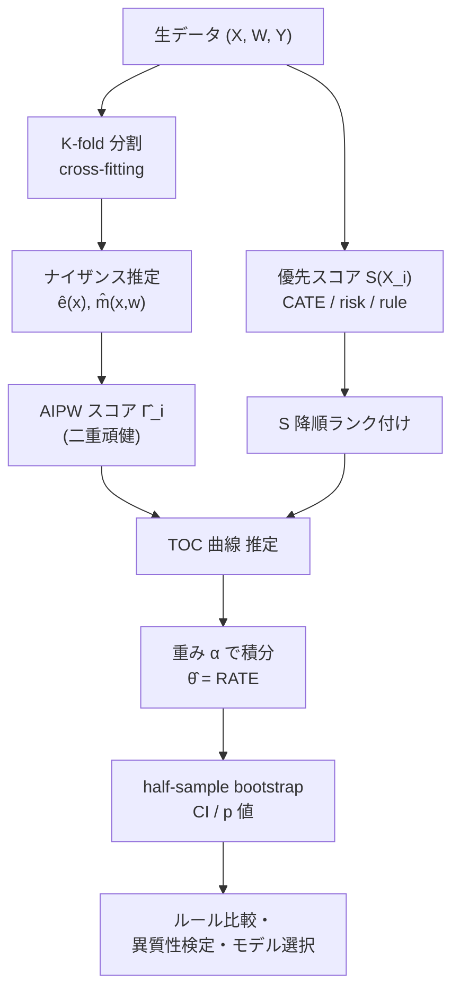

# Evaluating Treatment Prioritization Rules via Rank-Weighted Average Treatment Effects (RATE)

## メタ情報

| 項目 | 内容 |
|------|------|
| タイトル | Evaluating Treatment Prioritization Rules via Rank-Weighted Average Treatment Effects |
| 著者 | Steve Yadlowsky, Scott Fleming, Nigam Shah, Emma Brunskill, Stefan Wager |
| 投稿年 | 2021 (arXiv 初版 2021-11-15) / JASA 採録 2025 |
| 分野 | Statistics > Methodology (stat.ME) |
| arXiv | <https://arxiv.org/abs/2111.07966> |
| HTML | <https://arxiv.org/html/2111.07966> |
| キーワード | RATE, TOC, AUTOC, Qini, CATE, uplift modeling, AIPW, cross-fitting, treatment prioritization |
| 本レポートの観点 | CATE 推定の精度向上 — 処置優先ルールの評価指標 (RATE / AUTOC / Qini) によるモデル選択 |

---

## Abstract (原文)

> There are a number of available methods for selecting whom to prioritize for treatment, including ones based on treatment effect estimation, risk scoring, and hand-crafted rules. We propose rank-weighted average treatment effect (RATE) metrics as a simple and general family of metrics for comparing and testing the quality of treatment prioritization rules. RATE metrics are agnostic as to how the prioritization rules were derived, and only assess how well they identify individuals that benefit the most from treatment. We define a family of RATE estimators and prove a central limit theorem that enables asymptotically exact inference in a wide variety of randomized and observational study settings. RATE metrics subsume a number of existing metrics, including the Qini coefficient, and our analysis directly yields inference methods for these metrics. We showcase RATE in the context of a number of applications, including optimal targeting of aspirin to stroke patients.

## Abstract (日本語訳)

> 誰を優先的に処置すべきかを選択する手法には、処置効果推定に基づくもの、リスクスコアリングに基づくもの、人手で設計したルールに基づくものなど数多く存在する。本論文では、処置優先ルール（treatment prioritization rule）の品質を比較・検定するための、シンプルかつ汎用的な指標群として **RATE（Rank-Weighted Average Treatment Effect, ランク重み付き平均処置効果）** を提案する。RATE 指標は優先ルールがどのように導出されたかに依存せず（agnostic）、処置から最も恩恵を受ける個人をどれだけうまく識別できるかのみを評価する。我々は RATE 推定量の族を定義し、ランダム化試験・観察研究の幅広い設定で漸近的に厳密な推論を可能にする**中心極限定理**を証明する。RATE は Qini 係数を含む既存指標群を特殊例として包含し、本解析はこれら既存指標に対する推論手法を直接導く。脳卒中患者へのアスピリン最適ターゲティングをはじめとする複数の応用で RATE の有用性を示す。

---

## Overview

本論文は「**CATE モデルそのものをどう作るか**」ではなく、「**得られた優先ルール（priority score）が良いかどうかをどう測り、統計的に検定するか**」という評価・モデル選択の問題に焦点を当てる。

- **入力**: 優先スコア関数 $S:\mathcal{X}\to\mathbb{R}$（CATE 推定量・リスクスコア・ハンドメイドルールのいずれでも可）
- **出力**: スカラー指標 $\theta_\alpha(S)$ と、その信頼区間・p 値
- **核心**: TOC（Targeting Operator Characteristic）曲線を重み関数 $\alpha$ で積分した量を RATE と定義し、$\alpha$ の選び方で AUTOC・Qini を統一的に表現。AIPW スコア + cross-fitting で二重頑健に推定し、CLT で厳密推論する。

uplift modeling における Qini 曲線・利得チャートを、**統計的推論が可能な形へ一般化・厳密化**した点が最大の貢献である。

---

## Problem（問題設定）

処置優先ルールを評価したい実務的動機:

1. **多数の候補ルールの比較が必要**: T-learner / X-learner / causal forest / リスクスコア / 専門家ルールなど、由来の異なる優先ルールが乱立する。共通の物差しが要る。
2. **「効果の異質性」を検定したい**: そもそも個人ごとに処置効果が異なる（heterogeneity）のか、有意に検出したい。
3. **既存指標に推論理論が欠けていた**: uplift で広く使われる Qini 曲線・AUTOC は点推定の道具に留まり、信頼区間や仮説検定の厳密な漸近理論が整備されていなかった。
4. **観察研究への拡張**: 傾向スコアが未知の場合でも妥当な推論が必要。

### 記法

| 記号 | 意味 |
|------|------|
| $X_i\in\mathcal{X}$ | 共変量 |
| $W_i\in\{0,1\}$ | 処置割当 |
| $Y_i(0),Y_i(1)$ | 潜在結果 |
| $\tau(x)=\mathbb{E}[Y_i(1)-Y_i(0)\mid X_i=x]$ | CATE |
| $S(x)$ | 優先スコア（高いほど優先） |
| $F_S(\cdot)$ | $S(X_i)$ の CDF |
| $\pi$ or $e(x)$ | 傾向スコア（RCT は定数 $\pi$、観察研究は $e(x)$） |

目標は、**スコア $S$ が「効果の大きい個人」を上位にランク付けできているか**を 1 つのスカラーに要約し、検定可能にすること。

---

## Proposed Method（提案手法: RATE）

### 1. TOC 曲線

上位 $u$ 割（$0<u\le1$）に絞ったときの平均処置効果が、母集団平均からどれだけ上振れするかを表す:

$$\operatorname{TOC}(u;S)=\mathbb{E}\bigl[Y_i(1)-Y_i(0)\mid F_S(S(X_i))\ge 1-u\bigr]-\mathbb{E}\bigl[Y_i(1)-Y_i(0)\bigr]$$

- $u\to0$: 最上位だけに絞った効果のリフト（理想的には最大）
- $u=1$: 全体平均なので $\operatorname{TOC}(1;S)=0$
- 良い $S$ ほど曲線が左で高く立ち上がる（単調性が強い）。

### 2. RATE の定義

TOC 曲線を重み $\alpha(u)$ で積分したスカラー:

$$\boxed{\;\theta_\alpha(S)=\int_0^1 \alpha(u)\,\operatorname{TOC}(u;S)\,du\;}$$

重み関数 $\alpha:(0,1]\to\mathbb{R}$ の選び方で、評価が「ごく上位重視」か「広く浅く」かを調整できる。

### 3. 既存指標の包含（特殊例）

| 指標 | 重み $\alpha(u)$ | 定義 |
|------|------------------|------|
| **AUTOC** | $\alpha(u)=1$（一様） | $\displaystyle\int_0^1\operatorname{TOC}(u;S)\,du$ |
| **Qini 係数** | $\alpha(u)=u$（線形） | $\displaystyle\int_0^1 u\,\operatorname{TOC}(u;S)\,du$ |

個人効果の重み付き平均としての等価表現（Proposition 2）:

- **AUTOC**: $\theta(S)=\mathbb{E}\bigl[\bigl(-\log(1-F_S(S(X_i)))-1\bigr)\,(Y_i(1)-Y_i(0))\bigr]$
- **Qini**: $\theta(S)=\mathbb{E}\bigl[\bigl(F_S(S(X_i))-\tfrac12\bigr)\,(Y_i(1)-Y_i(0))\bigr]$

→ Qini の重みは順位に線形なので上位への集中度が緩やか。一方 AUTOC は $-\log(1-u)$ 型で**最上位を強く重み付け**するため、少数の高反応者を見つける検出力が高い（後述 Notes 参照）。

### 4. 中心極限定理による厳密推論

RATE 推定量は漸近正規（Theorem 3）:

$$\sqrt{n}\bigl(\widehat{\theta}-\theta\bigr)=\frac{1}{\sqrt{n}}\sum_{i=1}^n\psi_i+o_P(1)\xrightarrow{\ d\ }\mathcal{N}\bigl(0,\operatorname{Var}(\psi_1)\bigr)$$

影響関数（influence function）:

$$\psi_i=w\bigl(1-F_S(S(X_i))\bigr)\bigl(\Gamma_i^\ast-\bar\tau(S(X_i))\bigr)+\int_{S(X_i)}^{\infty}w\bigl(1-F_S(q)\bigr)\,d\bar\tau(q)-\theta$$

ここで $\Gamma_i^\ast$ はオラクル処置効果スコア、$\bar\tau(q)=\mathbb{E}[\tau(X_i)\mid S(X_i)=q]$、$w$ は $\alpha$ に対応する累積重み。

**推論の実務**: 分散関数を直接推定する代わりに、Lemma 4 が **half-sample bootstrap**（半標本ブートストラップ）の妥当性を保証し、信頼区間と仮説検定を構成する。二重頑健スコアと cross-fitting により、ナイザンス（傾向スコア・条件付き結果）の収束が遅くても妥当性が保たれる。

---

## Key Formulas（最重要数式）

```math
\text{(1) TOC 曲線}\quad
\operatorname{TOC}(u;S)=\mathbb{E}[\tau(X_i)\mid F_S(S(X_i))\ge 1-u]-\mathbb{E}[\tau(X_i)]
```

```math
\text{(2) RATE}\quad
\theta_\alpha(S)=\int_0^1 \alpha(u)\,\operatorname{TOC}(u;S)\,du
```

```math
\text{(3) AUTOC}\quad
\operatorname{AUTOC}(S)=\int_0^1 \operatorname{TOC}(u;S)\,du,\qquad \alpha(u)=1
```

```math
\text{(4) Qini}\quad
\operatorname{QINI}(S)=\int_0^1 u\,\operatorname{TOC}(u;S)\,du,\qquad \alpha(u)=u
```

```math
\text{(5) AIPW スコア (観察研究, 二重頑健)}\quad
\widehat{\Gamma}_i=\hat m(X_i,1)-\hat m(X_i,0)+\frac{W_i-\hat e(X_i)}{\hat e(X_i)\bigl(1-\hat e(X_i)\bigr)}\bigl(Y_i-\hat m(X_i,W_i)\bigr)
```

```math
\text{(6) RATE 推定量}\quad
\widehat{\theta}=\frac{1}{n}\sum_{j=1}^n w\!\left(\frac{j}{n}\right)\widehat{\Gamma}_{i(j)},\quad i(j):S\text{ 降順の第 }j\text{ 位}
```

```math
\text{(7) 漸近正規性}\quad
\sqrt{n}\bigl(\widehat{\theta}-\theta\bigr)\xrightarrow{d}\mathcal{N}\bigl(0,\operatorname{Var}(\psi_1)\bigr)
```

RCT の場合の AIPW スコアは $\hat e(X_i)$ を既知の定数 $\pi$ に置換:

```math
\widehat{\Gamma}_i=\hat m(X_i,1)-\hat m(X_i,0)+\frac{W_i-\pi}{\pi(1-\pi)}\bigl(Y_i-\hat m(X_i,W_i)\bigr)
```

---

## Algorithm（疑似コード）

```text
入力: データ {(X_i, W_i, Y_i)}_{i=1..n}, 優先スコア関数 S, 重み w (AUTOC: w=1, Qini: w=u),
      フォールド数 K, ブートストラップ回数 B
出力: RATE 点推定 θ̂, 信頼区間, p 値

# --- Step 1: クロスフィッティングで AIPW スコアを構成 ---
データを K 個のフォールドに分割
for k = 1..K:
    フォールド k 以外で ê(·), m̂(·,·) を学習            # ナイザンス推定
    for i in フォールド k:
        Γ̂_i = m̂(X_i,1) - m̂(X_i,0)
              + (W_i - ê(X_i)) / (ê(X_i)(1-ê(X_i))) * (Y_i - m̂(X_i,W_i))

# --- Step 2: 優先スコアで降順ランク付け ---
units を S(X_i) の降順に並べ替え -> i(1), i(2), ..., i(n)

# --- Step 3: RATE 点推定 ---
θ̂ = (1/n) * Σ_{j=1..n} w(j/n) * Γ̂_{i(j)}

# --- Step 4: half-sample bootstrap で推論 ---
for b = 1..B:
    n/2 単位をリサンプリング, Step 2–3 を再計算 -> θ̂_b
SE = sd({θ̂_b}); CI = θ̂ ± z_{1-α/2} * SE
p = 2 * (1 - Φ(|θ̂| / SE))           # H0: θ=0（異質性なし）の検定

return θ̂, CI, p
```

---

## Architecture（処理フロー）



優先ルール $S$ の生成経路（青）とアウトカム情報からの効果スコア $\Gamma$ の生成経路（緑）が**分離**しているのが要点。$S$ がどんな由来でも RATE は評価可能。

---

## Figures & Tables

### Table 1. 重み関数による指標の挙動比較

| 指標 | $\alpha(u)$ | 個人重み $\propto$ | 上位集中度 | 主な用途 |
|------|-------------|--------------------|-----------|---------|
| AUTOC | $1$ | $-\log(1-F_S)-1$ | 高（最上位を強調） | 少数の高反応者の検出、検出力重視 |
| Qini | $u$ | $F_S-\tfrac12$ | 中（順位線形） | 従来 uplift と整合的な総合評価 |
| 一般 RATE | 任意 $\alpha$ | 用途依存 | 可変 | 介入コスト・予算制約の反映 |

### Figure 1. TOC 曲線の概念図（ASCII）

```text
TOC(u)
  ^
  |＊                良いスコア S_good（左で高く立ち上がる）
  | ＊  ＊
  |    ＊  ＊
  |        ＊  ＊ ＊
  |  ○ ○            ＊ ＊         劣るスコア S_bad（平坦・ランダムに近い）
  |○      ○ ○ ○ ○ ○ ○ ○ ＊ ＊
  +--------------------------------＊---> u
  0                                1
  ・縦軸 = 上位 u 割の効果リフト, 横軸 = 上位フラクション u
  ・u=1 では必ず 0 に収束。曲線下の重み付き面積 = RATE。
```

### Figure 2. RATE 比較によるモデル選択（ASCII）

```text
ルール       RATE(AUTOC) ± 95%CI            判定
---------------------------------------------------
causal forest   ●----[ 0.42 ]----●          有意 (>0)  ★採用候補
X-learner       ●---[ 0.31 ]---●            有意 (>0)
risk score      ●-[ 0.05 ]-●                0 を跨ぐ → 異質性検出できず
random          [ -0.02 ]                   0 近傍
---------------------------------------------------
0 ─────────────────────────────────────────────────>
信頼区間が 0 を含まない ⇒ そのルールは「効果の異質性を捉えている」
```

### Table 2. 推定設定別のスコア構成

| 設定 | 傾向スコア | $\widehat\Gamma_i$ の重み項 | 妥当性の根拠 |
|------|-----------|------------------------------|--------------|
| RCT | 既知定数 $\pi$ | $(W_i-\pi)/[\pi(1-\pi)]$ | 不偏（傾向スコア既知） |
| 観察研究 | 推定 $\hat e(x)$ | $(W_i-\hat e)/[\hat e(1-\hat e)]$ | 二重頑健 + cross-fitting |

---

## Experiments & Evaluation

論文は 3 系統の応用で RATE を検証している。具体的な数値（信頼区間・p 値など）は原論文 (arXiv:2111.07966) の Section 6 を参照。

1. **アスピリンと脳卒中（IST 試験）**: アスピリン効果のリスク群間異質性を RATE ベースの仮説検定で評価。標準的なサブグループ解析より高い検出力で異質性を検出。
2. **降圧治療（SPRINT / ACCORD-BP）**: リスクベース優先ルールと CATE ベース優先ルールを比較し、どちらが「効果の大きい患者」を上位に並べられるかを RATE で定量化。
3. **uplift modeling**: 機械学習由来の処置優先ルールを RATE で評価し、従来 Qini 曲線の点推定に厳密な推論を付与。

**主張された結論**: RATE は妥当な信頼区間を与え、標準的サブグループ解析より高い検出力で処置効果の異質性を検出する。RCT・観察研究の双方で漸近的に厳密な推論が成立する。

---

## Notes（CATE 精度向上の観点）

### AUTOC はモデル選択にどう使えるか

- **選択基準としての RATE**: 複数の CATE 推定器が出した優先スコア $S_1,\dots,S_m$ を、それぞれ AUTOC で評価し最大の $S$ を選ぶ。これは「予測 MSE が最良 ≠ ターゲティングが最良」という乖離（CATE の絶対値精度より**順位の正しさ**が targeting では重要）を直接突く評価軸になる。
- **検出力の観点で AUTOC を推奨**: AUTOC は重み $-\log(1-u)$ により最上位を強調するため、効果が**少数の高反応サブグループに集中**している場合に Qini より検出力が高い。一方、効果の異質性が母集団全体に薄く広がる場合は Qini（線形重み）が有利になり得る。事前に異質性の構造が不明なら AUTOC が安全側のデフォルトとなる。
- **検定としての利用**: $H_0:\theta_\alpha(S)=0$ の棄却は「$S$ が無情報（ランダム）でない＝効果の異質性を捉えている」ことを意味する。CATE モデルが本当に異質性を学習できているかの**統計的合否判定**に使える。

### uplift 評価との関連

- 従来の **Qini 曲線 / uplift 曲線**は点推定の可視化ツールに過ぎなかった。RATE はこれを (i) 重み関数による一般化、(ii) AIPW + cross-fitting による二重頑健化、(iii) CLT + bootstrap による厳密推論、の 3 点で拡張する。
- すなわち「Qini 係数 = $\alpha(u)=u$ の RATE」という包含関係により、**既存の uplift 指標へ自動的に信頼区間と p 値が付与**される。実務では「2 つの uplift モデルの Qini 差が統計的に有意か」を初めて厳密に検定できる。

### 実装上の注意

- ナイザンス（$\hat e,\hat m$）の自己観測バイアスを避けるため cross-fitting は必須（Assumption C の収束条件を満たす）。
- 評価用データは学習用データと分離する。同一データで CATE モデルを学習し RATE 評価すると過大評価（楽観バイアス）が生じる。
- R パッケージ `grf`（generalized random forests）に `rank_average_treatment_effect()` として実装があり、AUTOC / Qini を選択できる。

### 参考リンク

- arXiv abstract: <https://arxiv.org/abs/2111.07966>
- arXiv HTML 本文: <https://arxiv.org/html/2111.07966>
