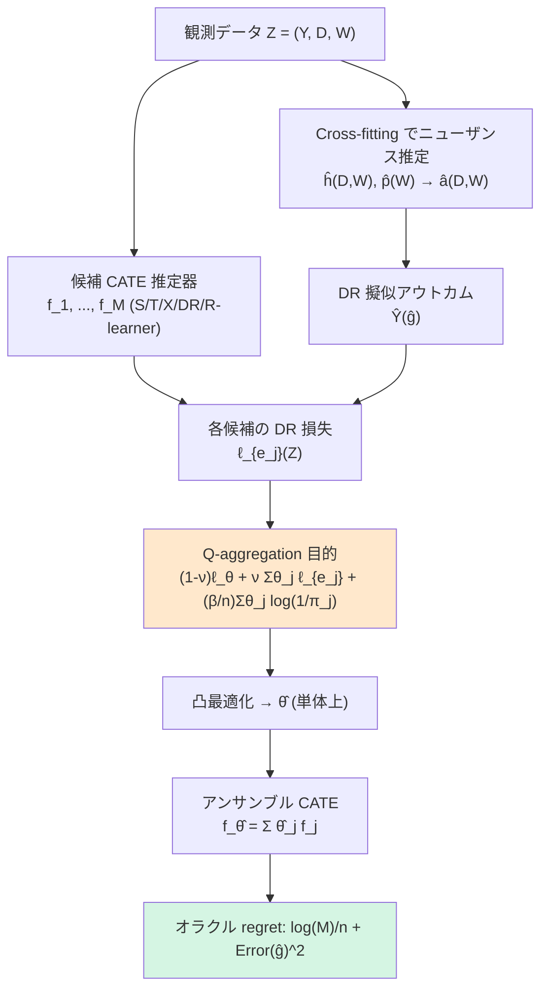

# Causal Q-Aggregation for CATE Model Selection

## メタ情報

| 項目 | 内容 |
|------|------|
| タイトル | Causal Q-Aggregation for CATE Model Selection |
| 著者 | Hui Lan, Vasilis Syrgkanis（Stanford University） |
| 年 | 2023（arXiv 初版 2023-10-25 / NeurIPS 2023 採択。AISTATS 2024 proceedings v238 にも掲載） |
| 種別 | 学術論文（理論 + 半合成データ実験） |
| arXiv | https://arxiv.org/abs/2310.16945 |
| HTML | https://ar5iv.labs.arxiv.org/html/2310.16945 |
| PDF | https://arxiv.org/pdf/2310.16945 |
| Proceedings | https://proceedings.mlr.press/v238/lan24a.html |
| キーワード | CATE, model selection, doubly robust loss, Q-aggregation, oracle inequality, ensemble |

> 注: 本レポートは abstract（公式）と ar5iv 版本文の抽出に基づく。数式は本文表記を可能な限り忠実に再現した。実験の個別数値は原論文（PDF）参照とし、本レポートでは捏造しない。

---

## Abstract（英語・原文）

> Accurate estimation of conditional average treatment effects (CATE) is at the core of personalized decision making. While there is a plethora of models for CATE estimation, model selection is a nontrivial task, due to the fundamental problem of causal inference. Recent empirical work provides evidence in favor of proxy loss metrics with double robust properties and in favor of model ensembling. However, theoretical understanding is lacking. Direct application of prior theoretical work leads to suboptimal oracle model selection rates due to the non-convexity of the model selection problem. We provide regret rates for the major existing CATE ensembling approaches and propose a new CATE model ensembling approach based on Q-aggregation using the doubly robust loss. Our main result shows that causal Q-aggregation achieves statistically optimal oracle model selection regret rates of log(M)/n (with M models and n samples), with the addition of higher-order estimation error terms related to products of errors in the nuisance functions. Crucially, our regret rate does not require that any of the candidate CATE models be close to the truth. We validate our new method on many semi-synthetic datasets and also provide extensions of our work to CATE model selection with instrumental variables and unobserved confounding.

---

## Abstract（日本語訳）

条件付き平均処置効果（CATE）の正確な推定は、個別化された意思決定の中核である。CATE 推定モデルは数多く存在するが、**因果推論の根本問題**（同一個体で処置・非処置の両方の結果を観測できない）ゆえに、どのモデルを選ぶかというモデル選択は自明でない。近年の実証研究は、**二重頑健（doubly robust）性をもつ代理損失（proxy loss）** と **モデルのアンサンブル化** が有効であることを示しているが、その理論的裏付けは不足していた。既存の理論をそのまま適用すると、モデル選択問題の **非凸性** のため、オラクルモデル選択レートが準最適になってしまう。本論文は、主要な既存 CATE アンサンブル手法に対する後悔（regret）レートを与えるとともに、**二重頑健損失を用いた Q-aggregation** に基づく新しい CATE アンサンブル手法を提案する。主結果は、causal Q-aggregation が統計的に最適なオラクルモデル選択 regret レート **log(M)/n**（M はモデル数、n はサンプル数）を、ニューザンス関数の誤差の積に関連する高次推定誤差項を加えた形で達成することを示す。重要なのは、この regret レートが **候補 CATE モデルのいずれかが真の値に近いことを要求しない** 点である。提案手法を多数の半合成データセットで検証し、操作変数（IV）や観測されない交絡への拡張も与える。

---

## Overview

```
┌─────────────────────────────────────────────────────────────────┐
│  問題: M 個の候補 CATE 推定器 f_1, ..., f_M をどう「選ぶ／統合」?  │
│        真の τ_0(X) = E[Y(1) − Y(0) | X] は観測不能（反実仮想）       │
├─────────────────────────────────────────────────────────────────┤
│  既存                                                              │
│   ・Best-ERM  : DR損失最小の単一モデルを選ぶ → 非凸で準最適レート   │
│   ・Convex-ERM: 凸スタッキング → 集約だが理論保証が弱い            │
├─────────────────────────────────────────────────────────────────┤
│  提案: Causal Q-Aggregation                                       │
│   DR損失 + Q-aggregation 目的関数（凸結合 + エントロピー正則化）    │
│   → オラクル regret = log(M)/n（最適）+ 高次ニューザンス誤差^2      │
│   → どの候補も真に近くなくてよい（model-agnostic な保証）          │
└─────────────────────────────────────────────────────────────────┘
```

本論文の貢献は大きく 3 点：

1. **既存手法の理論的位置づけ**: best-ERM（単一選択）や convex-ERM（凸スタッキング）の regret レートを導出し、非凸性に起因する準最適性（典型的には `sqrt(log M / n)` の遅いレート）を明らかにした。
2. **Causal Q-aggregation の提案**: DR 損失に Q-aggregation を組み合わせ、**速い** オラクルレート `log(M)/n` を達成。
3. **拡張**: 操作変数（IV）・観測されない交絡を含む設定へ理論を拡張。

---

## Problem Setup

観測データ `Z = (Y, D, W)`（`Y` 結果、`D ∈ {0,1}` 処置、`W` 共変量、`X ⊆ W` は効果修飾子）。推定対象は CATE:

```math
\tau_0(X) = \mathbb{E}[\,Y(1) - Y(0) \mid X\,]
```

候補は `M` 個の CATE 推定器 `f_1, \dots, f_M`（S/T/X/DR/R-learner など多様なメタ学習器・基底学習器の組み合わせ）。やりたいことは、

- **モデル選択**: 真の τ_0 への近さ `\|f_j - \tau_0\|^2` を最小化する `j` を、τ_0 を観測せずに選ぶ。
- **モデル統合（アンサンブル）**: 単一選択にとどまらず、候補の凸結合 `f_\theta = \sum_j \theta_j f_j` を構成して精度を上げる。

困難の本質は **fundamental problem of causal inference**: 真の τ_0 が観測できないため、損失を直接評価できず、ニューザンス（傾向スコア・結果回帰）を介した代理損失に頼らざるを得ない。さらにモデル選択は本質的に **非凸**（argmin が離散的）であり、prior work をそのまま使うと遅いレートに陥る。

---

## Proposed Method

### (a) Doubly Robust（DR）損失

ニューザンス関数を 2 つ用意する：

- 結果回帰 `h_0(D,W) := \mathbb{E}[Y \mid D, W]`、推定値 `\hat h`
- 符号付き逆傾向（Riesz representer） `a_0(D,W) := \dfrac{D - p_0(W)}{p_0(W)(1 - p_0(W))}`、推定値 `\hat a`（`p_0` は傾向スコア）

これらから **擬似アウトカム（pseudo-outcome）** を作る：

```math
\hat{Y}(g) \;=\; h(1,W) - h(0,W) + a(D,W)\,\bigl(Y - h(D,W)\bigr)
```

ここで `g = (h, a)` はニューザンスをまとめた記号。DR 損失（二乗損失）は擬似アウトカムと CATE 候補の二乗誤差として定義される：

```math
\ell\bigl(Z;\, f(X),\, g\bigr) \;=\; \bigl(\hat{Y}(g) - f(X)\bigr)^{2}
```

この損失は **mixed bias property（Neyman 直交性）** を満たす：損失の系統誤差（bias）が `(a_0 - \hat a)` と `(h_0 - \hat h)` の **積** として分解され、和ではない。これが「二重頑健」の名の由来で、どちらか一方のニューザンスが多少ずれても、もう一方が正確なら一次誤差が消える。

### (b) Q-Aggregation 目的関数

単純な凸結合の経験損失最小化（convex-ERM）では速いレートが出ない。Q-aggregation は、**集約損失** と **各候補モデルの損失の重み付き平均** を凸結合した修正損失を用いる：

```math
\tilde{\ell}_{\theta, g}(Z) \;=\; (1 - \nu)\,\ell_{\theta, g}(Z) \;+\; \nu \sum_{j} \theta_j\, \ell_{e_j, g}(Z)
```

- `\ell_{\theta,g}`: 凸結合 `f_\theta = \sum_j \theta_j f_j` の DR 損失
- `\ell_{e_j,g}`: 単一候補 `f_j`（単位ベクトル `e_j`）の DR 損失
- `\nu \in (0,1)`: アンサンブル損失と個別損失のバランスを取るハイパーパラメータ

Q-aggregation 推定量は、確率単体 `\Theta = \{\theta \in \mathbb{R}_{\ge 0}^M : \sum_j \theta_j = 1\}` 上で、**エントロピー正則化** を加えた目的を最小化する：

```math
\hat{\theta} \;=\; \arg\min_{\theta \in \Theta}\;
\mathbb{P}_n\, \tilde{\ell}_{\theta, \hat{g}}(Z)
\;+\; \frac{\beta}{n} \sum_{j} \theta_j \log\!\frac{1}{\pi_j}
```

- `\mathbb{P}_n`: 経験平均（サンプル `n` 個）
- `\hat g`: 推定したニューザンス（cross-fitting 推奨）
- `\pi = (\pi_1, \dots, \pi_M)`: 候補モデルへの事前分布（一様 `\pi_j = 1/M` が標準）
- `\beta`: 正則化強度。`\sum_j \theta_j \log(1/\pi_j)` は事前分布に対する負エントロピー（KL 型）ペナルティ

直感: `\nu` 項が単体の **頂点側**（疎な解＝事実上のモデル選択）へ押し戻しつつ、凸結合の自由度を保つ。エントロピー項が解を滑らかにし、`\log M` の依存に抑える。この組み合わせが「非凸なモデル選択」を「凸最適化」に置き換えながら **速いレート** を担保する。

### (c) 最適オラクル選択レート

主結果（後述の Key Formulas）は、`\hat\theta` による CATE 推定誤差が、**最良の単一候補の誤差** に対して `O(\log M / n)`（プラス高次ニューザンス誤差）の超過しか持たないことを示す。これが Q-aggregation 文献で知られる **最適 oracle rate** であり、convex-ERM の `sqrt(log M / n)` や best-ERM の非凸ペナルティを改善する。

---

## Key Formulas

### 1. DR 擬似アウトカムと DR 損失

```math
\hat{Y}(g) = h(1,W) - h(0,W) + a(D,W)\,(Y - h(D,W)),
\qquad
\ell(Z; f, g) = \bigl(\hat{Y}(g) - f(X)\bigr)^2
```

Riesz representer（符号付き逆傾向）：

```math
a_0(D,W) = \frac{D - p_0(W)}{p_0(W)\,(1 - p_0(W))}
```

### 2. Q-aggregation 修正損失と目的関数

```math
\tilde{\ell}_{\theta, g}(Z) = (1-\nu)\,\ell_{\theta, g}(Z) + \nu \sum_j \theta_j\, \ell_{e_j, g}(Z)
```

```math
\hat{\theta} = \arg\min_{\theta \in \Theta}\;
\mathbb{P}_n\,\tilde{\ell}_{\theta, \hat g}(Z) + \frac{\beta}{n}\sum_j \theta_j \log\frac{1}{\pi_j}
```

### 3. オラクル regret 限界（主定理）

強凸性とニューザンス誤差の仮定の下、確率 `1 - \delta` で：

```math
R(\hat\theta, g_0) \;\le\;
\min_{j=1,\dots,M}\Bigl[\, R(e_j, g_0) + \tfrac{\beta}{n}\log\tfrac{1}{\pi_j} \,\Bigr]
\;+\; O\!\Bigl(\tfrac{\log(1/\delta)}{n}\cdot \max\{\tfrac{1}{\mu}C_b(\hat g)^2,\; b\,C_b(\hat g)\}\Bigr)
\;+\; \Bigl(\tfrac{1}{\mu}\Bigr)^{\frac{\gamma}{2-\gamma}} \mathrm{Error}(\hat g)^{\frac{2}{2-\gamma}}
```

### 4. CATE 一様事前での系（Corollary）

`\pi_j = 1/M`（一様）とすると：

```math
\bigl\| f_{\hat\theta} - \tau_0 \bigr\|^2
\;\le\;
\min_{j} \bigl\| f_j - \tau_0 \bigr\|^2
\;+\; O\!\Bigl(\tfrac{\log(M/\delta)}{n} + \mathrm{Error}(\hat g)^2\Bigr)
```

### 5. 高次（二乗）ニューザンス誤差項

```math
\mathrm{Error}(\hat g) = 2\sqrt{\mathbb{E}\bigl[\,\mathbb{E}[\hat q(D,W)\mid X]^2\,\bigr]},
\qquad
\hat q(D,W) = (a_0 - \hat a)(h_0 - \hat h)
```

ニューザンス誤差が **積** `(a_0 - \hat a)(h_0 - \hat h)` として現れる（二次依存）。これが二重頑健性の定量的表現であり、各ニューザンスが `n^{-1/4}` で収束すれば積は `n^{-1/2}` となり主項 `\log M / n` に埋もれる。

---

## Algorithm（疑似コード）

```text
procedure CAUSAL_Q_AGGREGATION(data {Z_i}, candidates {f_1..f_M}, ν, β, prior π)
    # --- Step 1: ニューザンス推定（cross-fitting 推奨） ---
    K-fold に分割
    for each fold k:
        補集合で ĥ (結果回帰) と p̂ (傾向スコア) を学習
        â(D,W) = (D - p̂(W)) / (p̂(W)(1 - p̂(W)))
        fold k の各サンプルで擬似アウトカム Ŷ_i(ĝ) を計算

    # --- Step 2: 各候補の DR 損失を評価 ---
    for j = 1..M:
        ℓ_{e_j} = 平均_i ( Ŷ_i(ĝ) - f_j(X_i) )^2

    # --- Step 3: Q-aggregation 目的を凸最適化 ---
    θ̂ = argmin_{θ∈simplex}
            P_n[ (1-ν)·ℓ_θ(Z) + ν·Σ_j θ_j ℓ_{e_j}(Z) ]
            + (β/n)·Σ_j θ_j log(1/π_j)
        # 凸問題 → 標準ソルバ（射影勾配・FW 等）

    return f_{θ̂} = Σ_j θ̂_j f_j          # アンサンブル CATE

# --- 線形時間グリーディ近似（Appendix H） ---
procedure GREEDY_Q_AGG(...)
    j* = argmin_j ℓ_{e_j}                 # 最良単一モデル
    for each k ≠ j*:
        α_k = ライン探索で最適化( convex combo of f_{j*}, f_k )
    return 最良の 2 モデル凸結合          # O(M) で full 問題のレートに一致
```

---

## Architecture



---

## Figures & Tables

> 以下は本文・abstract から再構成した整理表。原論文の図表番号と完全一致しない場合があるため、詳細数値は PDF を参照。

### Table A. 主要 CATE アンサンブル手法の比較（理論的位置づけ）

| 手法 | 出力 | 凸性 | オラクル regret レート | 候補が真に近い必要 |
|------|------|------|------------------------|--------------------|
| Best-ERM（単一選択） | 単一 `f_j` | 非凸（離散 argmin） | 準最適（`~sqrt(log M / n)` 級） | 不要だが遅い |
| Convex-ERM（凸スタッキング） | 凸結合 | 凸 | 準最適（`sqrt(log M / n)`） | 不要 |
| **Causal Q-aggregation（提案）** | 凸結合 | 凸 | **最適 `log(M)/n` + Error(ĝ)²** | **不要** |

### Table B. Q-aggregation 目的関数の構成要素

| 記号 | 意味 | 役割 |
|------|------|------|
| `ν ∈ (0,1)` | 集約損失 vs 個別損失の凸結合係数 | 単体頂点（選択）へのバイアス |
| `β/n` | エントロピー正則化強度 | `log M` 依存を担保し解を滑らかに |
| `π_j` | モデル事前分布（標準は一様 1/M） | KL 型ペナルティの基準 |
| `Θ`（単体） | `θ≥0, Σθ_j=1` | 凸結合重みの実行可能集合 |

### Table C. 半合成データセット（実験で使用）

| 分野 | 出典 | 用途 |
|------|------|------|
| 政治学 | Green & Kern (2012) | CATE 推定の半合成 DGP |
| 経済学 | Farbmacher et al. (2021); Poterba & Venti (1994) | 同上 |
| 教育 | Word et al. (1990)（STAR 実験系） | 同上 |
| デジタル広告 | Diemert et al. (2018)（Criteo Uplift） | 大規模 uplift |

### Figure D. ニューザンス誤差の積構造（ASCII 概念図）

```
            一次誤差（消える）        二次誤差（残る・小）
  bias  =  c1·(a0 - â)  +  c2·(h0 - ĥ)  →  Neyman直交で消去
        +  (a0 - â)·(h0 - ĥ)            →  Error(ĝ)^2 として regret に加算
                └────────┬────────┘
              両方が n^{-1/4} なら積は n^{-1/2} → log(M)/n に埋もれる
```

---

## Experiments & Evaluation

- **設定**: 上記 4 分野・5 出典の実データから半合成データ生成過程（真の τ_0 が既知）を構成し、PEHE 系の二乗誤差 `\|f - \tau_0\|^2` で評価。多数の DGP・乱数シードにわたり統計的に比較。
- **候補**: S-learner / T-learner / X-learner / DR-learner / R-learner などのメタ学習器に複数の基底学習器を組み合わせた多数の CATE 推定器。
- **ベースライン**: best-ERM（DR 損失による単一選択）、convex-ERM（凸スタッキング）、各個別メタ学習器。
- **主な所見（定性）**:
  - アンサンブル手法は **いかなる単一メタ学習器よりも頑健** な解を与える。
  - causal Q-aggregation は ERM ベース手法を上回り得る。
  - 候補のいずれも真に近くない（well-specified でない）状況でも、提案手法は最良候補に対する超過誤差が小さく抑えられる。
- **数値の扱い**: 個別の数値（誤差の絶対値・順位表）は原論文（PDF / proceedings v238）の実験節に委ねる。本レポートでは捏造しない。

> 数値詳細・図表: https://arxiv.org/pdf/2310.16945 および https://proceedings.mlr.press/v238/lan24a/lan24a.pdf を参照。

---

## Notes（精度向上の観点：単純選択より集約が優位な理由）

1. **非凸性の回避による速いレート**: 単一選択（best-ERM）は離散 argmin ゆえ本質的に非凸で、オラクル regret が `sqrt(log M / n)` 級に劣化する。Q-aggregation は問題を **単体上の凸最適化** に変換し、`log(M)/n`（M に対数、n に一次）という **二次的に速い** レートを得る。これがアンサンブルが選択より優位な核心。

2. **凸結合 ≠ convex-ERM**: 単なる凸スタッキング（convex-ERM）でも速いレートは出ない。Q-aggregation 特有の **`ν` 凸結合項（個別損失の重み付き和）+ エントロピー正則化** の組み合わせが、単体頂点側への適度な引き戻しと滑らかさを両立し、最適レートを引き出す。

3. **二重頑健性で因果バイアスを二次へ**: DR 損失の mixed bias property により、ニューザンス誤差が積 `(a_0-\hat a)(h_0-\hat h)` として現れる。cross-fitting と `n^{-1/4}` 級のニューザンス収束があれば、この高次項は主項に埋もれ、**因果特有の交絡バイアスがモデル選択を歪めない**。

4. **well-specification 不要（model-agnostic）**: regret 限界は「最良の単一候補との差」を抑えるだけで、候補のいずれかが真の τ_0 に近いことを **前提としない**。実務では真のモデル族が不明なため、この性質が精度の下支えになる。

5. **計算コスト**: full 問題は凸だが、Appendix H のグリーディ近似により **O(M)** で同等の統計レートを達成可能。候補数 M が多くても実用的。

6. **拡張性**: 操作変数（IV）・観測されない交絡を含む設定にも同じ枠組み（直交損失 + Q-aggregation）が適用可能で、より現実的な因果設定でのモデル選択精度向上に道を開く。

---

### 関連リンク

- arXiv abstract: https://arxiv.org/abs/2310.16945
- PDF: https://arxiv.org/pdf/2310.16945
- ar5iv HTML（本文抽出元）: https://ar5iv.labs.arxiv.org/html/2310.16945
- PMLR proceedings (v238): https://proceedings.mlr.press/v238/lan24a.html
