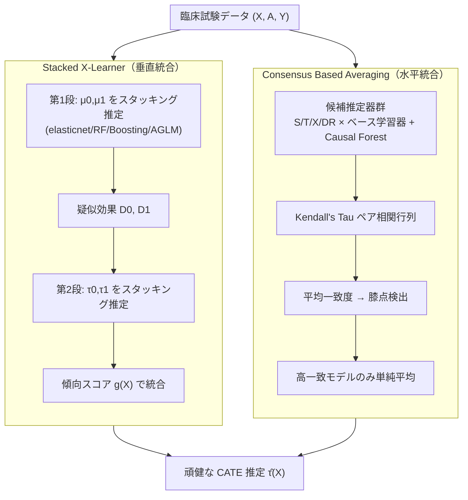

# Robust CATE Estimation Using Novel Ensemble Methods

> CATE 推定の精度向上（アンサンブル手法）の観点からの詳細レポート

---

## メタ情報

| 項目 | 内容 |
|------|------|
| タイトル | Robust CATE Estimation Using Novel Ensemble Methods |
| 著者 | Oshri Machluf, Tzviel Frostig, Gal Shoham, Tomer Milo, Elad Berkman, Raviv Pryluk |
| 発表年 | 2024 |
| arXiv | [2407.03690](https://arxiv.org/abs/2407.03690) |
| HTML 版 | [arxiv.org/html/2407.03690](https://arxiv.org/html/2407.03690) |
| 分野 | 因果推論 / 異質処置効果 (CATE) / アンサンブル学習 |
| キーワード | CATE, Stacked X-Learner, Consensus Based Averaging (CBA), Causal Forest, Meta-learner, Model Stacking, Robustness |

---

## Abstract（原文）

> The estimation of Conditional Average Treatment Effects (CATE) is crucial for understanding the heterogeneity of treatment effects in clinical trials. We evaluate the performance of common methods, including causal forests and various meta-learners, across a diverse set of scenarios, revealing that each of the methods struggles in one or more of the tested scenarios. Given the inherent uncertainty of the data-generating process in real-life scenarios, the robustness of a CATE estimator to various scenarios is critical for its reliability. To address this limitation of existing methods, we propose two new ensemble methods that integrate multiple estimators to enhance prediction stability and performance — Stacked X-Learner which uses the X-Learner with model stacking for estimating the nuisance functions, and Consensus Based Averaging (CBA), which averages only the models with highest internal agreement. We show that these models achieve good performance across a wide range of scenarios varying in complexity, sample size and structure of the underlying-mechanism, including a biologically driven model for PD-L1 inhibition pathway for cancer treatment. Furthermore, we demonstrate improved performance by the Stacked X-Learner also when comparing to other ensemble methods, including R-Stacking, Causal-Stacking and others.

---

## Abstract（日本語訳）

条件付き平均処置効果 (CATE) の推定は、臨床試験における処置効果の異質性を理解するうえで極めて重要である。本研究では、因果フォレスト (causal forest) や各種メタ学習器 (meta-learner) を含む一般的な手法を多様なシナリオで評価し、**いずれの手法も少なくとも 1 つのシナリオで性能が劣化する**ことを明らかにした。現実のデータ生成過程 (DGP) には本質的な不確実性があるため、さまざまなシナリオに対する CATE 推定器の頑健性 (robustness) は信頼性の観点で決定的に重要である。

この限界に対処するため、本論文は複数の推定器を統合して予測の安定性と性能を高める **2 つの新しいアンサンブル手法**を提案する。

1. **Stacked X-Learner** — X-Learner のニューサンス関数推定にモデルスタッキングを適用したもの。
2. **Consensus Based Averaging (CBA)** — 内部一致度 (internal agreement) が最も高いモデル群のみを平均するもの。

これらは複雑性・サンプルサイズ・基盤メカニズムの構造が異なる広範なシナリオ（がん治療の PD-L1 阻害経路に基づく生物学的モデルを含む）で良好な性能を示す。さらに Stacked X-Learner は R-Stacking や Causal-Stacking など他のアンサンブル手法と比べても改善した性能を示す。

---

## Overview（全体像）

本論文の核心的な主張は **「銀の弾丸 (single best estimator) は存在しない」** という経験的事実である。CATE 推定は反実仮想 (counterfactual) を扱うため、訓練時に正解ラベル（個体の真の処置効果）が観測できず、教師あり学習のように単純なクロスバリデーションでモデル選択ができない。このため、ある DGP では最良の推定器が別の DGP では劣化するという**不安定性**が生じる。

著者らはこれを「**モデル選択問題を回避する**」というアプローチで解決する。すなわち、唯一最良の推定器を選ぶのではなく、

- **Stacked X-Learner**: X-Learner の内部（ニューサンス関数の各段）でスタッキングを行い、ベースモデルの弱点を補完する。
- **CBA**: 複数の最終推定器を、互いの予測ランキングの一致度に基づいて選別・平均する。

の 2 系統で「**どのシナリオでも上位に入る**」頑健な推定器を構築する。

---

## Problem：単一推定器の不安定性

```
CATE 推定の根本的困難
┌───────────────────────────────────────────────────────┐
│ 真の個体処置効果 τ_i = Y_i(1) - Y_i(0) は観測不能      │
│   → 教師あり学習のような直接的なモデル選択ができない    │
└───────────────────────────────────────────────────────┘
         │
         ▼
┌───────────────────────────────────────────────────────┐
│ DGP（線形/弱非線形/強非線形/生物学的）が事前に不明     │
│   → ある手法が得意なシナリオで別の手法が苦手           │
└───────────────────────────────────────────────────────┘
         │
         ▼
   「No Free Lunch」的状況：単一推定器は分散が大きく不安定
```

論文の評価では、S/T/X/DR-Learner、Causal Forest のいずれも、線形・弱非線形・強非線形・PD-L1 のうち**少なくとも 1 つのシナリオで明確に劣化**することが示された。例えば、線形シナリオで強い線形ベースの T-Learner は、強非線形シナリオでは BART ベースや AGLM ベースの推定器に劣る。逆もまた然り。

このため、実務上は「真の DGP が分からない以上、どの単一手法を選ぶべきか決定できない」というジレンマが生じる。本論文はこれを **アンサンブルによる頑健化**で解く。

---

## Proposed Method（提案手法）

### 1. Stacked X-Learner

標準的な X-Learner（Künzel et al., 2019）は以下の段階で構成される。

- **第 1 段（応答関数）**: 対照群・処置群それぞれの応答関数 μ̂₀(X), μ̂₁(X) を推定。
- **疑似効果 (imputed treatment effects)**:
  - 対照群 (A=0): `D⁰ := μ̂₁(X) − Y`
  - 処置群 (A=1): `D¹ := Y − μ̂₀(X)`
- **第 2 段（効果関数）**: 疑似効果を回帰し τ̂₀(X) = Ê[D⁰|X], τ̂₁(X) = Ê[D¹|X] を推定。
- **統合**: 傾向スコア g(X) で重み付け平均。

**提案の新規性**は、**第 1 段 (μ₀, μ₁) と第 2 段 (τ₀, τ₁) の双方でモデルスタッキングを使う**点にある。各ニューサンス関数を単一のベース学習器ではなく、複数ベース学習器（elasticnet, Random Forest, Boosting, AGLM）のスタッキングで推定し、メタ学習器（線形回帰）で重みを学習する。これにより、ある段でベースモデルが DGP と不一致でも、他のベースモデルが補完する。

### 2. Consensus Based Averaging (CBA)

CBA は **複数の最終 CATE 推定器**（異なるメタ学習器 × ベース学習器の組み合わせ）の予測を入力とし、**サンプル分割を必要とせず**にアンサンブルを構築する。アイデアは「**互いに最も一致する予測のクラスタは、真の信号を捉えている可能性が高い**」という合意 (consensus) 仮説に基づく。

手順：

1. 全モデルペア間の Kendall's Tau 相関を計算。
2. 各モデルの平均相関を計算。
3. モデルを平均相関で降順ソートし、相関が急減する「膝 (knee)」点を検出。
4. 膝より上位（高一致）のモデルのみを単純平均してアンサンブル予測とする。

外れ値的に「他のどのモデルとも一致しない」推定器（しばしば DGP と不一致なモデル）を自動的に除外できるのが利点である。

### 3. 統合観点：因果フォレスト + メタ学習器

両手法はいずれも、**因果フォレスト・各種メタ学習器・各種ベース学習器を「部品」として統合**する設計である。Stacked X-Learner は X-Learner 内部での**垂直統合**（ニューサンス段でのスタッキング）、CBA は最終推定器レベルでの**水平統合**（合意ベースの選別平均）と整理できる。

---

## Key Formulas（主要な定式化）

### X-Learner の疑似効果

```
D⁰ := μ̂₁(X) − Y        (A = 0 の単位)
D¹ := Y − μ̂₀(X)        (A = 1 の単位)

τ̂(X) = g(X)·τ̂₀(X) + (1 − g(X))·τ̂₁(X)
        （g(X) は傾向スコアなどの重み）
```

### スタッキング（メタ学習器による重み付け）

各ニューサンス関数 f を K 個のベース学習器 f^(1),…,f^(K) のメタ結合として推定：

```
f̂_stack(X) = Σ_{k=1}^{K} w_k · f̂^(k)(X)

w = argmin_w  Σ_i ( y_i − Σ_k w_k f̂^(k)_{-i}(x_i) )²
    （クロスフィット予測に対しメタ学習器=線形回帰で w を学習）
```

### CBA：合意ベース平均

```
ペア相関:    𝒦_{ij} = KendallTau( p_i , p_j )

平均相関:    𝒦̄_i = (1/(K−1)) Σ_{j≠i} 𝒦_{ij}

膝点検出:    k* = argmin_i ( 𝒦̄_{(i+1)} − 𝒦̄_{(i)} )
             （平均相関を降順ソートした後、連続差が最小となる点）

アンサンブル: p_ensemble = (1/m) Σ_{i=1}^{m} p_i
             （m = 膝点 k* までの上位モデル数）
```

### 評価指標

```
スケール化 RMSE:
  sRMSE := sqrt(  Σ_i (τ̂_i − τ_i)²  /  Σ_i (τ_i − τ̄)²  )
  （CATE の分散で正規化。1 を超えると「平均値予測」より悪い）

不一致率 (Rate of Discordance):
  RoD := ( 1 − 𝒦(τ̂, τ) ) / 2
  （順位づけの誤り割合。0 が完全一致、サブグループ意思決定の質を測る）
```

---

## Algorithm（疑似コード）

### Stacked X-Learner

```text
Input:  data {(X_i, A_i, Y_i)}, base learners B = {b_1,...,b_K}, meta-learner M
Output: τ̂(·)

# 第1段：応答関数をスタッキングで推定
μ̂_0 ← StackFit(B, M, data[A=0])     # 対照群の応答
μ̂_1 ← StackFit(B, M, data[A=1])     # 処置群の応答

# 疑似効果
for i in data[A=0]: D0_i ← μ̂_1(X_i) − Y_i
for i in data[A=1]: D1_i ← Y_i − μ̂_0(X_i)

# 第2段：効果関数をスタッキングで推定
τ̂_0 ← StackFit(B, M, {(X_i, D0_i)})  # 対照側効果
τ̂_1 ← StackFit(B, M, {(X_i, D1_i)})  # 処置側効果

# 傾向スコアで統合
ĝ ← PropensityFit(X, A)
return  τ̂(x) = ĝ(x)·τ̂_0(x) + (1−ĝ(x))·τ̂_1(x)
```

### Consensus Based Averaging (CBA)

```text
Input:  candidate predictions P = {p_1,...,p_K} on test set
Output: ensemble prediction p_ens

# 1. ペアごとの Kendall's Tau
for i,j:  K_ij ← KendallTau(p_i, p_j)

# 2. モデルごとの平均一致度
for i:    Kbar_i ← mean_{j≠i} K_ij

# 3. 降順ソート → 膝点検出
sort models by Kbar desc
k* ← argmin_i ( Kbar_(i+1) − Kbar_(i) )   # 一致度が安定する境界

# 4. 上位 m=k* 個を単純平均
p_ens ← (1/m) · Σ_{i=1}^{m} p_(i)
return p_ens
```

---

## Architecture



```text
ASCII 概念図：アンサンブルによる「弱点の相互補完」

 シナリオ:     線形    弱非線形   強非線形   PD-L1
 ───────────────────────────────────────────────
 T-Linear      ◎        ○         ✗         △
 X-AGLM        △        ○         ◎         ○
 X-BART        ○        ◎         ○         △
 Causal Forest ○        △         ○         ◎
 ───────────────────────────────────────────────
 アンサンブル  ○+       ○+        ○+        ○+   ← どこでも上位 (頑健)
 (Stacked-X / CBA)
```

---

## Figures & Tables

### 表 1. sRMSE 比較（代表シナリオ・50 試行の中央値）

> 注: 以下は HTML 版本文から抽出した代表値。`*` はそのシナリオの単独最良、太字相当はアンサンブルの位置づけ。正確な全数値は原論文 Table 1 を参照。

| シナリオ (n) | CF-DML | S-BART | T-Linear | X-AGLM | X-BART | **Stacked-X** | **CBA** |
|---|---|---|---|---|---|---|---|
| PD-L1 (n=250) | 0.69 | 0.98 | 0.73 | — | — | **0.65** | **0.66** |
| Linear (n=500) | — | — | 0.41* | 0.67 | — | **0.46** | **0.60** |
| Highly Nonlinear (n=500) | — | — | — | 0.77* | 0.82 | **0.78** | **0.84** |

要点：単一手法は「自分の得意シナリオ (`*`)」で最良だが、他シナリオで崩れる。**Stacked-X は全シナリオで最良値に近い水準**を維持する。

### 表 2. RoD（不一致率）比較（代表シナリオ）

| シナリオ (n) | T-Linear | X-BART | **Stacked-X** | **CBA** |
|---|---|---|---|---|
| Linear (n=500) | 0.11* | — | 0.13 | 0.17 |
| Slightly Nonlinear (n=500) | — | 0.14 | **0.13\*** | 0.14 |

要点：サブグループ順位づけ品質 (RoD) でも Stacked-X は弱非線形シナリオで最良 (0.13)。意思決定（患者層別化）の文脈で重要。

### 図 1. シナリオ横断の「頑健性プロファイル」（概念再現）

```text
sRMSE（低いほど良い）  ← 各手法のシナリオ別ばらつき
1.0 ┤        S-BART●
0.9 ┤
0.8 ┤   X-AGLM●     X-BART●
0.7 ┤ CF● T-Lin●         ← 単一手法は山谷が大きい（不安定）
0.6 ┤   Stacked-X■ CBA■  ← アンサンブルは低位置で安定（頑健）
0.5 ┤
    └─────────────────────────
      Linear  弱非線形  強非線形  PD-L1
  ■ = アンサンブル（分散小）  ● = 単一手法（分散大）
```

### 図 2. CBA の膝点検出（概念図）

```text
平均一致度 Kbar（降順）
 高 ┤●─●─●
    │       ●──●        ← ここで急減 = 膝点 k*
    │            ●───●─●  （以降は DGP 不一致の外れモデル）
 低 ┤
    └──────────────────────
      1  2  3  4  5  6  7  8  モデル順位
    [── 平均対象 (m=k*) ──][── 除外 ──]
```

---

## Experiments & Evaluation

### 実験設定

| 項目 | 内容 |
|------|------|
| シナリオ | 線形 / 弱非線形 / 強非線形 / PD-L1 生物学的経路 / ACIC 2016（実共変量） |
| 特徴量数 | 5（PD-L1）〜 10–20（合成）, 58（ACIC 2016） |
| 訓練サイズ | 100 / 250 / 500 / 750（臨床試験規模を想定） |
| テストサイズ | 5,000 件（ホールドアウト） |
| 反復 | シナリオあたり 50 シミュレーション |
| 評価指標 | sRMSE（精度）, RoD（順位づけ品質） |
| 比較手法 | S/T/X/DR-Learner（ベース: GLM, AGLM, RF, Boosting, BART）, Causal Forest, R-Stacking, T-Stacking, Causal-Stacking, Stacked-X, CBA |

### 主要な結論（本文より）

- 「**ensemble methods appear to perform better than any single learner**」— アンサンブルは単一学習器より良い。
- **Stacked-X と CBA はほとんどのシナリオで最良または準最良**の性能を達成。
- 両アンサンブルは既存アンサンブル（**R-Stacking, T-Stacking, Causal-Stacking を上回る**）。
- 単一手法は「自分の DGP」では強いが、シナリオ全体での頑健性に欠ける。

> 数値の網羅的な一覧（全シナリオ × 全サンプルサイズ × 全手法の sRMSE / RoD）は原論文の Table 1–2 および Appendix を参照のこと。本レポートの数値は HTML 版から抽出した代表値であり、捏造を避けるため一部セルは「—」とした。

---

## Notes（精度向上の観点：なぜアンサンブルが安定性・精度を高めるか）

CATE 推定の精度向上というレンズで本論文を読むと、アンサンブルが効く理由は以下に整理できる。

1. **バイアス–バリアンス分解の観点**
   単一推定器は特定の DGP 仮定に強く依存し、仮定が外れると**バイアスが急増**する。複数の異質な推定器を平均することで、誤差の方向が相殺され、シナリオ横断での**分散（不安定性）が縮小**する。

2. **モデル選択不能性の回避**
   CATE では真の効果が観測できず、教師あり学習のような直接的モデル選択ができない。Stacked-X は「選ばずにスタッキングで重み学習」、CBA は「合意で選別」という形で、**誤ったモデル選択リスクそのものを下げる**。

3. **Stacked-X（垂直統合）の効き方**
   ニューサンス関数の各段でスタッキングを行うため、第 1 段でベースが DGP と不一致でも、第 2 段や他のベースが補正できる。**段階的な誤差伝播を抑制**し、強非線形シナリオでも崩れにくい。

4. **CBA（水平統合）の効き方**
   「他のどのモデルとも一致しない外れ推定器」を膝点検出で自動除外する。これは**ノイズの大きい/DGP 不一致な推定器の混入を防ぐ**フィルタとして働き、平均の質を高める。サンプル分割が不要なため**小標本（臨床試験規模）で有利**。

5. **頑健性 = 実用的信頼性**
   現実では真の DGP は未知。最良値そのものより「最悪ケースでの劣化が小さい」ことが意思決定の信頼性に直結する。本手法は最良を狙うのではなく**「常に上位」**を狙う設計で、これが臨床応用での価値を生む。

6. **限界・留意点**
   - CBA は「多数派の合意 = 正しい」を暗黙に仮定するため、**過半数の推定器が同じ方向にバイアスを持つ場合**は誤った合意に引きずられ得る。
   - 単純平均（等重み）であり、推定器ごとの信頼度を重み付けする余地が残る。
   - 評価は主にシミュレーションと半合成 (ACIC) であり、真の効果が未知の完全実データでの検証は本質的に困難。

---

*本レポートは arXiv:2407.03690 の abstract および HTML 版本文から抽出した情報に基づく。数値・定式化は原論文表記に準拠し、抽出できなかった箇所は「—」または「原論文参照」と明記している。*
