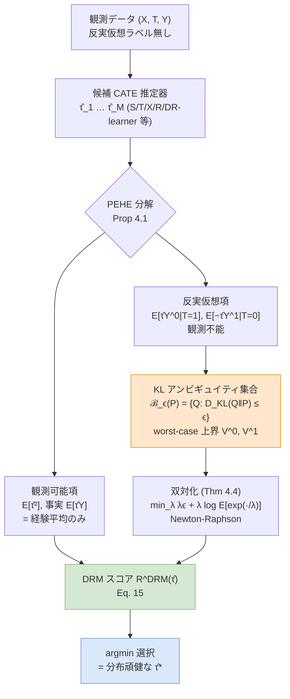

# Unveiling the Potential of Robustness in Selecting CATE Estimators（DRM）

## メタ情報

| 項目 | 内容 |
|------|------|
| タイトル | Unveiling the Potential of Robustness in Selecting Conditional Average Treatment Effect Estimators |
| 著者 | Yiyan Huang, Cheuk Hang Leung, Siyi Wang, Yijun Li, Qi Wu（City University of Hong Kong 系） |
| 年 | 2024（arXiv 初版 2024-02-28 / NeurIPS 2024 採択） |
| 種別 | 学術論文（理論 + 半合成データ実験） |
| arXiv | https://arxiv.org/abs/2402.18392 |
| HTML | https://arxiv.org/html/2402.18392 |
| PDF | https://arxiv.org/pdf/2402.18392 |
| キーワード | CATE, model selection, distributionally robust optimization, nuisance-free, KL ambiguity set, PEHE, covariate shift, hidden confounders |

> 注: 本レポートは abstract（公式）と arXiv HTML 版本文の抽出に基づく。数式は本文表記を可能な限り忠実に再現したが、記号の細部は原論文 PDF を正とする。実験の個別数値が抽出から得られなかった箇所は「原論文参照」と明記し、捏造しない。

---

## Abstract（英語・原文）

> The growing demand for personalized decision-making has led to a surge of interest in estimating the Conditional Average Treatment Effect (CATE). Various types of CATE estimators have been developed with advancements in machine learning and causal inference. However, selecting the desirable CATE estimator through a conventional model validation procedure remains impractical due to the absence of counterfactual outcomes in observational data. Existing approaches for CATE estimator selection, such as plug-in and pseudo-outcome metrics, face two challenges. First, they must determine the metric form and the underlying machine learning models for fitting nuisance parameters (e.g., outcome function, propensity function, and plug-in learner). Second, they lack a specific focus on selecting a robust CATE estimator. To address these challenges, this paper introduces a Distributionally Robust Metric (DRM) for CATE estimator selection. The proposed DRM is nuisance-free, eliminating the need to fit models for nuisance parameters, and it effectively prioritizes the selection of a distributionally robust CATE estimator. The experimental results validate the effectiveness of the DRM method in selecting CATE estimators that are robust to the distribution shift incurred by covariate shift and hidden confounders.

---

## Abstract（日本語訳）

個別化意思決定への需要の高まりにより、条件付き平均処置効果（CATE）の推定への関心が急増している。機械学習と因果推論の発展に伴い多様な CATE 推定器が開発されてきたが、観測データには反実仮想（counterfactual）の結果が存在しないため、従来のモデル検証手続きで望ましい推定器を選ぶことは実質的に不可能である。既存の選択手法、すなわち **plug-in 指標** や **pseudo-outcome 指標** には 2 つの課題がある。第一に、指標の形式と、ニューザンスパラメータ（結果関数・傾向スコア・plug-in learner など）を当てはめる機械学習モデルを **決め打ちで選ばねばならない**。第二に、**頑健な CATE 推定器を選ぶことに特化していない**。これらに対処するため、本論文は CATE 推定器選択のための **分布頑健指標（Distributionally Robust Metric, DRM）** を提案する。DRM は **nuisance-free**（ニューザンスモデルの当てはめが不要）であり、**分布頑健な CATE 推定器の選択を優先**する。実験により、共変量シフトと隠れた交絡に起因する分布シフトに頑健な CATE 推定器を DRM が選べることを検証した。

---

## Overview

```
┌──────────────────────────────────────────────────────────────────────┐
│  問題: 候補 CATE 推定器 τ̂_1, …, τ̂_M をどう選ぶ?                          │
│        真の τ(X)=E[Y(1)−Y(0)|X] は反実仮想ゆえ検証用ラベルが無い         │
├──────────────────────────────────────────────────────────────────────┤
│  既存                                                                  │
│   ・Plug-in 指標   : 結果モデル μ̂_t(X) を当てはめ PEHE を近似            │
│   ・Pseudo-outcome : 傾向スコア π̂(X)+結果モデルで DR/R 擬似ラベル        │
│   → 課題1: 指標形式と nuisance 用 ML モデルの選択が必要（誤れば破綻）     │
│   → 課題2: 分布シフト（共変量シフト・隠れ交絡）への頑健性を考慮しない    │
├──────────────────────────────────────────────────────────────────────┤
│  提案: DRM（Distributionally Robust Metric）                           │
│   PEHE を「観測可能項 + 反実仮想項 + 定数 ζ」に分解（Prop 4.1）          │
│   反実仮想項を KL アンビギュイティ集合上の worst-case 上界で置換         │
│   → nuisance-free（μ̂, π̂ を一切当てはめない）                           │
│   → 分布シフトに頑健な推定器を優先選択（最悪ケース PEHE 上界を最小化）   │
└──────────────────────────────────────────────────────────────────────┘
```

本論文の貢献は大きく 3 点：

1. **nuisance-free な選択指標の提案**: PEHE を直接分解し、観測可能な項は事実データの経験平均のみで、反実仮想の項は分布頑健最適化（DRO）で上界化する。結果・傾向スコアの当てはめ（およびその ML モデル選択）が一切不要になる。
2. **頑健性を選択基準に内在化**: KL アンビギュイティ集合上の worst-case 期待値を取ることで、共変量シフト・隠れ交絡による PEHE の不確実性を明示的に織り込み、**最悪ケースで良い推定器**を選ぶ。
3. **計算可能化と理論保証**: worst-case の上限（sup）を双対化して凸最小化に帰着（Theorem 4.4）、有限標本での収束レート O(n^{-1/2}) を与える（Theorem 4.5）。

---

## Problem Setup（既存指標の限界）

潜在結果フレームワークで、共変量 `X`、二値処置 `T∈{0,1}`、潜在結果 `Y^0, Y^1` を考える。CATE は

```
τ(X) = E[Y^1 − Y^0 | X]
```

推定器 `τ̂` の良さは PEHE（Precision in Estimating Heterogeneous Effects）で測られる：

```
PEHE(τ̂) = E[(τ̂(X) − τ(X))²]
```

しかし `τ(X)` が観測できないため PEHE は直接計算できない。

- **共変量シフト**: 処置群と対照群で共変量分布が異なる、すなわち `P(X|T=t) ≠ P(X|T=1−t)`。これが事実分布 `P_F` と反実仮想分布 `P_CF` の乖離を生む。
- **隠れ交絡（unconfoundedness 違反）**: 観測されない交絡因子により、事実データから反実仮想期待値を不偏推定できない。

既存の plug-in / pseudo-outcome 指標は、これらのシフト下で **ニューザンス推定が偏る** と選択そのものが破綻する。さらに「どの指標形式・どの ML モデルで nuisance を当てはめるか」を真のデータ生成過程を知らずに決める必要があり、ここが第二の難所となる。

---

## Proposed Method（DRM）

### Step 1: PEHE の分解（観測可能項と反実仮想項）

**Proposition 4.1**: PEHE を展開すると、

```
E[(τ̂(X) − τ(X))²]
  = E[τ̂(X)²] + 2E[τ̂(X)Y^0] + 2E[−τ̂(X)Y^1] + ζ
```

ここで `ζ = E[τ(X)²]` 等の **τ̂ に依存しない定数**（推定器間の比較では無視可）。

- `E[τ̂(X)²]` は事実データだけで計算可能。
- `E[τ̂(X)Y^0|T=0]`、`E[−τ̂(X)Y^1|T=1]` も **事実側**は観測可能。
- 一方 `E[τ̂(X)Y^0|T=1]`、`E[−τ̂(X)Y^1|T=0]` は **反実仮想側**で観測不能。この反実仮想項を DRO で上界化するのが核心。

### Step 2: KL アンビギュイティ集合による worst-case 上界

**Definition 4.2**: 事実分布 `P` を中心に、KL ダイバージェンスが半径 `ϵ` 以内の分布集合を考える：

```
ℬ_ϵ(P) := { Q : D_KL(Q ‖ P) ≤ ϵ }
```

反実仮想項を、この集合上の **最悪ケース期待値**で置き換える（Eq. 9）：

```
E[ τ̂(X)Y^0 | T=1 ] ≤ sup_{Q∈ℬ_{ϵ0}(P_C)} E^Q[ τ̂(X)Y^0 ] =: V^0(τ̂)
E[ −τ̂(X)Y^1 | T=0 ] ≤ sup_{Q∈ℬ_{ϵ1}(P_T)} E^Q[ −τ̂(X)Y^1 ] =: V^1(τ̂)
```

これにより、観測できない反実仮想期待値を、観測可能な事実分布まわりの「不確実性集合」の上限として **保守的かつ計算可能**に評価する。半径 `ϵ_t` が大きいほど想定する分布シフトが大きく、より頑健性を要求する。

### Step 3: なぜ nuisance-free か

DRM が結果モデル `μ̂_t(X)` や傾向スコア `π̂(X)` を一切当てはめない理由：

1. **直接分解**: PEHE を観測可能項と反実仮想項に分けるため（Prop 4.1）、擬似ラベル生成のための nuisance が不要。
2. **事実結果のみ使用**: `Y_i`（事実）をそのまま使い、反実仮想の推定値を作らない。
3. **DRO で上界化**: 反実仮想期待値を、分布を推定せずに worst-case 上界で押さえる。
4. **補助 ML モデルゼロ**: 指標計算に追加の学習器が要らず、「どの ML モデルで nuisance を当てるか」という選択問題自体が消える。

観測可能項の有限標本推定はシンプルな経験平均：

```
Ê^{P_C}[ τ̂(X)Y^0 ] = (1/n_c) Σ_{i: T_i=0} τ̂(X_i) Y_i
Ê^{P_T}[ −τ̂(X)Y^1 ] = (1/n_t) Σ_{i: T_i=1} (−τ̂(X_i) Y_i)
```

---

## Key Formulas

### 分布頑健 PEHE 上界（Corollary 4.3）

PEHE の分布頑健な上界 `V_PEHE(τ̂)`：

```
V_PEHE(τ̂) = E[τ̂(X)²]
           + 2( u_0 · E^{P_C}[ τ̂(X)Y^0 ] + u_1 · E^{P_T}[ −τ̂(X)Y^1 ] )   ← 観測可能（事実）
           + 2( u_0 · V^1(τ̂) + u_1 · V^0(τ̂) )                            ← worst-case 上界
           + ζ                                                            ← τ̂ 非依存定数
```

`u_0, u_1` は対照群・処置群の混合重み（群比率に対応）。

### 双対化による計算可能化（Theorem 4.4）

KL-DRO の sup は、強双対性により **1 変数の凸最小化**に帰着する：

```
V^0(τ̂) = min_{λ0 > 0}  λ0·ϵ0 + λ0 · log E^{P_C}[ exp( τ̂(X)Y^0 / λ0 ) ]
V^1(τ̂) = min_{λ1 > 0}  λ1·ϵ1 + λ1 · log E^{P_T}[ exp( −τ̂(X)Y^1 / λ1 ) ]
```

`λ_t > 0` は KL 制約の双対変数（温度パラメータ）。log-sum-exp 形は `λ_t` について凸。

### 有限標本推定（Eq. 12）

```
V̂^0(τ̂) = min_{λ0>0}  λ0·ϵ0 + λ0 · log( (1/n_c) Σ_{i:T_i=0} exp( τ̂(X_i)Y_i / λ0 ) )
V̂^1(τ̂) = min_{λ1>0}  λ1·ϵ1 + λ1 · log( (1/n_t) Σ_{i:T_i=1} exp( −τ̂(X_i)Y_i / λ1 ) )
```

### 最終的な DRM 選択スコア（Eq. 15）

```
R^DRM(τ̂) = (1/n) Σ_i τ̂(X_i)²
          + (2/n)[ Σ_{i:T_i=0} τ̂(X_i)Y_i + Σ_{i:T_i=1} (−τ̂(X_i)Y_i)
                   + n_c · V̂^1(τ̂) + n_t · V̂^0(τ̂) ]
```

候補のうち **`R^DRM(τ̂)` を最小化する推定器** を選ぶ（小さいほど worst-case PEHE 上界が小さい＝頑健）。

### 収束保証（Theorem 4.5）

有限標本の worst-case 値の推定誤差は確率 1−δ で

```
| V̂^t(τ̂) − V^t(τ̂) |
   ≤ O( √( 8 λ̄² log(2/δ) C²_exp / (n u_t²) ) )
   + O( √( 2 λ̄² log(2/δ) / (n u_t²) ) )
```

すなわち **O(n^{-1/2})** で 0 に収束し、有限標本一致性をもつ（`λ̄` は最適双対変数の上界、`C_exp` は指数項の有界定数）。

---

## Algorithm（疑似コード）

```text
Algorithm 1: DRM-based CATE Estimator Selection
入力 : データ {(X_i, T_i, Y_i)}_{i=1}^n,
       候補推定器集合 {τ̂_1, …, τ̂_M},
       KL 半径 ϵ0, ϵ1, Newton 反復回数 K
出力 : 選択された推定器 τ̂*

for m = 1 … M:                       # 各候補推定器について
    # --- 観測可能項（事実データの経験平均）---
    A   ← (1/n) Σ_i τ̂_m(X_i)²
    B_c ← Σ_{i:T_i=0} τ̂_m(X_i) Y_i           # 対照群・事実
    B_t ← Σ_{i:T_i=1} (−τ̂_m(X_i) Y_i)        # 処置群・事実

    # --- worst-case 項（KL-DRO を双対最小化, Newton-Raphson）---
    V̂^0 ← SolveDualKL( {τ̂_m(X_i)Y_i : T_i=0},  ϵ0, K )
    V̂^1 ← SolveDualKL( {−τ̂_m(X_i)Y_i : T_i=1}, ϵ1, K )

    # --- DRM スコア（Eq. 15）---
    R^DRM[m] ← A + (2/n)( B_c + B_t + n_c·V̂^1 + n_t·V̂^0 )

return τ̂* = argmin_m R^DRM[m]


Subroutine SolveDualKL(z_1…z_k, ϵ, K):   # min_{λ>0} λϵ + λ log( mean(exp(z/λ)) )
    λ ← λ_init (>0)
    for j = 1 … K:                        # 凸 1 変数問題を Newton 法で
        g  ← d/dλ [ λϵ + λ log mean(exp(z/λ)) ]    # 勾配
        h  ← d²/dλ² [ … ]                           # ヘッシアン
        λ  ← λ − g / h
        λ  ← max(λ, eps)                            # λ>0 を維持
    return λϵ + λ log mean(exp(z/λ))
```

---

## Architecture



nuisance（μ̂, π̂）の学習ブロックが存在しない点が、plug-in / pseudo-outcome パイプラインとの決定的な違い。

---

## Figures & Tables

> 以下はキャプション・構造の再構成。具体数値が抽出から確定できないものは「原論文参照」と明記する（捏造禁止）。

### Table 1. 既存 CATE 選択指標との比較（定性）

| 指標カテゴリ | nuisance 当てはめ | 指標形式の選択 | 分布頑健性 | 反実仮想の扱い |
|---|---|---|---|---|
| Plug-in（plug-T, plug-DR） | 必要（結果モデル μ̂） | 必要 | なし | 結果モデルで補完 |
| Pseudo-outcome（pseudo-DR, pseudo-R） | 必要（μ̂ + 傾向 π̂） | 必要 | なし | 擬似ラベルで補完 |
| **DRM（提案）** | **不要（nuisance-free）** | **不要** | **あり（KL-DRO）** | **worst-case 上界** |

### Table 2. 主実験の評価軸（半合成データ）

| 評価軸 | 説明 |
|---|---|
| Regret | 選択された推定器 vs オラクル最良推定器の PEHE 差（小さいほど良い） |
| Ranking | DRM 順位 と オラクル順位 の整合（Kendall's τ 等） |
| Variance / 安定性 | データ分割を跨いだ選択の安定度 |
| 数値結果 | 原論文 Table/Fig 参照（本抽出では個別値未確定） |

### Figure 1. PEHE 分解と DRM パイプライン（概念図）

```
PEHE(τ̂) ─┬─ E[τ̂²] ────────────────► 観測可能（事実の経験平均）
          ├─ 2·E[τ̂Y^0]（事実側）────► 観測可能
          ├─ 2·E[−τ̂Y^1]（事実側）───► 観測可能
          ├─ 反実仮想側 ────► KL-DRO で worst-case 上界 V^0, V^1
          └─ ζ ───────────────────► τ̂ 非依存定数（比較で無視）
```

### Figure 2. 分布シフト下での選択性能（概念）

```
PEHE-regret（低いほど良い）
   高 │ ▓▓▓▓ plug-in
      │ ▓▓▓  pseudo-outcome
      │ ▓    DRM（提案）
   低 └────────────────────────────
       (A)無交絡  (B)共変量シフト  (C)隠れ交絡
   ※ シフトが強い (B)(C) ほど DRM の優位が拡大（傾向。具体値は原論文参照）
```

### Table 3. 実験で用いた候補推定器・ベースライン

| 種別 | 内容 |
|---|---|
| 候補 CATE 推定器 | S-learner, T-learner, X-learner, R-learner, DR-learner |
| 比較ベースライン（選択指標） | plug-T, plug-DR, pseudo-DR, pseudo-R |
| データ設定 | (A) 交絡なし / (B) 共変量シフトのみ / (C) 隠れ交絡あり |

---

## Experiments & Evaluation

- **データ**: 共変量シフト・観測されない交絡を制御できる **半合成（semi-synthetic）ベンチマーク**。シナリオ (A) 交絡なし、(B) 共変量シフトのみ、(C) 隠れ交絡あり、の 3 設定。
- **候補推定器**: S/T/X/R/DR-learner の 5 系統。
- **ベースライン（選択指標）**: plug-in 系（plug-T, plug-DR）、pseudo-outcome 系（pseudo-DR, pseudo-R）。
- **評価指標**: (1) Regret（オラクル最良との PEHE 差）、(2) ランキング整合（Kendall's τ 等）、(3) 分割を跨いだ選択の安定性。
- **主結論**: DRM は分布シフト、特に **隠れ交絡 (C)** や **共変量シフト (B)** の下で、plug-in / pseudo-outcome 指標より頑健な推定器を選択できることを検証。シフトが大きい設定ほど優位が顕著という傾向。
- **数値**: 個別の表・図の数値は本抽出からは確定できないため **原論文（NeurIPS 2024 / arXiv:2402.18392）の Experiments 節および Appendix を参照**（本レポートでは捏造しない）。

---

## Notes（精度向上の観点）

### 頑健性を選択基準に組み込む意義

- 従来の CATE モデル選択は「平均的に良い」推定器を選ぶ設計で、**分布シフト下の最悪ケース**を無視していた。DRM は PEHE の反実仮想項を **KL アンビギュイティ集合上の worst-case 上界**で置換することで、共変量シフト・隠れ交絡に対する不確実性を選択スコアそのものに内在化する。半径 `ϵ_t` が「想定する分布ズレの大きさ」を制御するノブとなり、保守度を調整できる。
- **nuisance-free** であることが二重の利点を生む。第一に、結果モデル・傾向スコアの推定誤差が選択を汚染しない（既存指標の最大の弱点を回避）。第二に、「どの ML モデルで nuisance を当てるか」という入れ子のモデル選択問題が消え、運用が簡潔になる。
- 計算面では sup を **凸 1 変数最小化（log-sum-exp 双対）** に落とし、Newton 法で高速に解ける。理論的にも O(n^{-1/2}) の一致性が保証されており、実用的な選択器として成立している。

### 精度向上への含意

DRM 自体は推定器を「作る」のではなく「選ぶ」器だが、頑健性基準で選ぶことで、**デプロイ環境が学習分布からズレるほど効く**。アンサンブル／メタラーナー（本 run の他レポート）で多数の候補を生成し、その中から DRM で頑健な 1 本を取り出す、という二段構えが精度・頑健性の両立に有効。

### C5（C5 クラスタ）との関連

- 本 run（`cate/retrieval/20260602_ensemble_model_selection`）の中で、本レポートは「**頑健性を選択基準に据えた nuisance-free な選択指標**」を担う位置づけ。
- `04-causal-q-aggregation.md`（DR 損失 + Q-aggregation による最適オラクルレートのアンサンブル）とは **相補的**: Q-aggregation は「DR 損失を前提に最適に統合・選択」する一方、DRM は **nuisance を一切当てず worst-case 頑健性で選ぶ**。前者は nuisance 推定が良質な前提で最適レートを狙い、後者は nuisance が偏る分布シフト環境で強い。
- `01-counterfactual-cross-validation.md`（反実仮想 CV）や pseudo-outcome 系指標が nuisance 推定に依存するのに対し、DRM はその依存を断ち切る点で、C5（選択・評価指標クラスタ）における **頑健性軸の代表手法**として整理できる。
- 実務的な指針: nuisance が安定して当てられる設定では DR ベース（Q-aggregation / pseudo-DR）、分布シフトや隠れ交絡が疑われる設定では DRM、という使い分けが妥当。
