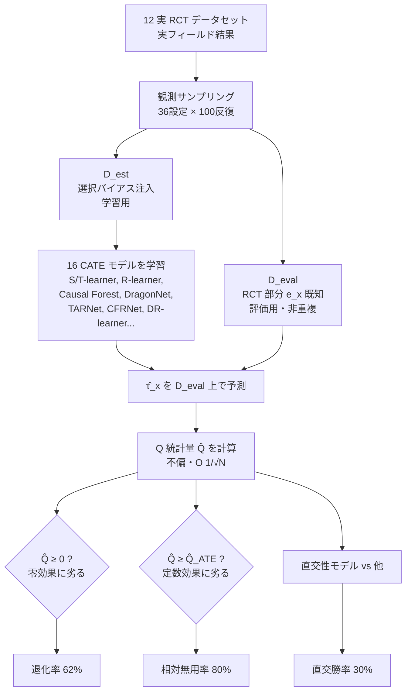

# Do Contemporary Causal Inference Models Capture Real-World Heterogeneity?

## メタ情報

| 項目 | 内容 |
|------|------|
| タイトル | Do Contemporary Causal Inference Models Capture Real-World Heterogeneity? Findings from a Large-Scale Benchmark |
| 著者 | Haining Yu, Yizhou Sun |
| 年 | 2024（arXiv 2410.07021） |
| 種別 | 学術論文（大規模実証ベンチマーク + 新評価指標の理論） |
| arXiv | https://arxiv.org/abs/2410.07021 |
| HTML | https://arxiv.org/html/2410.07021 |
| PDF | https://arxiv.org/pdf/2410.07021 |
| キーワード | CATE, benchmark, model selection, observational sampling, Q-statistic, zero-effect baseline, orthogonality, PEHE |

> 注: 本レポートは abstract（公式）と HTML 版本文の抽出に基づく。数式・モデル名・データセット名・数値は本文表記を可能な限り忠実に再現した。Appendix に依存する細部（個別モデルの完全仕様等）は原論文参照とし、本レポートでは捏造しない。

---

## Abstract（英語・原文）

> We present unexpected findings from a large-scale benchmark study evaluating Conditional Average Treatment Effect (CATE) estimation algorithms, i.e., CATE models. By running 16 modern CATE models on 12 datasets and 43,200 sampled variants generated through diverse observational sampling strategies, we find that: (a) 62% of CATE estimates have a higher Mean Squared Error (MSE) than a trivial zero-effect predictor, rendering them ineffective; (b) in datasets with at least one useful CATE estimate, 80% still have higher MSE than a constant-effect model; and (c) Orthogonality-based models outperform other models only 30% of the time, despite widespread optimism about their performance.

---

## Abstract（日本語訳）

条件付き平均処置効果（CATE）推定アルゴリズム（= CATE モデル）を評価する大規模ベンチマーク研究から、予想外の発見を報告する。**16 個の現代的 CATE モデル**を **12 のデータセット**と、多様な観測サンプリング戦略から生成した **43,200 のサンプル変種**に対して実行した結果、以下が判明した:

- **(a)** CATE 推定の **62% は、自明な「零効果予測器（zero-effect predictor）」よりも MSE が高く**、実用に耐えない。
- **(b)** 「少なくとも 1 つは有用な推定が存在するデータセット」に限っても、その **80% は依然として定数効果モデル（constant-effect model）より MSE が高い**。
- **(c)** 直交性（orthogonality）に基づくモデルは、その性能への広範な楽観論にもかかわらず、**他モデルを上回るのは 30% に過ぎない**。

---

## Overview

```
┌──────────────────────────────────────────────────────────────────────┐
│  問い: 現代の CATE モデルは「実世界の異質性」を本当に捉えているか?      │
│  これまでのベンチ: 合成ポテンシャル結果（IHDP, ACIC 等）に偏重         │
│         → 真の τ(x) を人工的に注入 → 「都合のよい異質性」を測っていた   │
├──────────────────────────────────────────────────────────────────────┤
│  本研究のアプローチ                                                     │
│   1. 実 RCT データ（実フィールド結果）を 12 件使用                      │
│   2. 観測サンプリングで選択バイアスを注入 → 43,200 変種                 │
│   3. 評価は手付かずの RCT 全体で実施（傾向スコア推定リスクを回避）       │
│   4. 新指標 Q 統計量で「零効果 / 定数効果」基準と絶対比較               │
├──────────────────────────────────────────────────────────────────────┤
│  衝撃的な結論                                                          │
│   ・62% は零効果予測器に劣る（異質性を出さない方がマシ）               │
│   ・80% は定数効果モデルにも劣る                                        │
│   ・直交性モデルの勝率はわずか 30%                                      │
│   → モデル選択と評価設計こそが CATE 精度向上の本質的ボトルネック        │
└──────────────────────────────────────────────────────────────────────┘
```

本論文の主張は単純かつ厳しい。**現状の CATE モデルの多くは、異質効果を推定しようとすることで、むしろ「何もしない（効果ゼロ／定数効果）」より悪化している**。これは合成データのベンチマークが性能を過大評価してきたことを示唆し、CATE 研究における **モデル選択と評価プロトコルの再設計** を要求する。

---

## Problem（現代 CATE モデルは実世界の異質性を捉えられているか）

CATE 推定の根本問題は **反実仮想の不可観測性**にある。各個体について、処置・非処置の両結果を同時に観測できないため、真の異質効果 τ(x) を直接ラベルとして使えない。このため:

1. **従来ベンチマークの限界**: IHDP・ACIC 系の半合成データは、真の τ(x) を研究者が人工的に定義している。その結果、モデルが「人工的に作られた、検出しやすい異質性」に過適合しても高評価が得られ、実世界性能を過大評価する。
2. **評価指標の不在**: 真の τ(x) が無い実データでは PEHE（= MSE）を直接計算できないため、「あるモデルが本当に有用か（= 自明な基準を上回るか）」を判定する手段が乏しかった。
3. **直交性への過信**: DR-learner や R-learner など Neyman 直交性に基づく手法は理論的優位が喧伝されるが、有限サンプル・実データでの優位は検証されていなかった。

本研究はこの 3 点に正面から取り組み、**実 RCT + 観測サンプリング + 零効果/定数効果基準** という設計で「異質性を捉えているか」を absolute（相対ランキングではなく絶対基準）に問い直す。

---

## Proposed Method（評価フレームワーク）

本論文の貢献は新しい CATE モデルではなく、**信頼できる大規模評価フレームワーク**と**新しい絶対評価指標 Q 統計量**である。

### 1. 観測サンプリング（Observational Sampling）

実 RCT データから出発し、**選択バイアスを人工的に注入**した推定用サブセット D_est を作る。一方、評価には選択バイアスを掛けない RCT サブセット D_eval を使う。両者は重複しない。

```
RCT データ（真にランダム化 → ATE/CATE 評価が傾向スコア推定なしで可能）
   │
   ├─ サンプリング（選択バイアス注入） → D_est : モデルはこれで学習
   │       ・サイズ 4 段階 × 処置割合 3 段階 × 割当非線形性 3 段階 = 36 設定
   │       ・各設定 100 反復
   │
   └─ 残りの RCT 部分 → D_eval : 評価はこちらで（バイアスなし）
```

これにより、**学習は観測的（バイアスあり）・評価は実験的（バイアスなし）** という現実的かつ厳密な設定を実現する。

### 2. 新指標 Q 統計量による絶対基準比較

真の τ(x) が無くても、傾向スコア e(x) が既知（RCT なので既知）なら、MSE のモデル依存部分を **不偏推定**できる Q 統計量を導入する。これにより「零効果予測器」「定数効果モデル」との絶対比較が可能になる。

---

## 評価設計（大規模ベンチ・観測サンプリング・新指標）

| 軸 | 仕様 |
|----|------|
| モデル数 | 16 個の現代的 CATE モデル |
| データセット | 12 件（実 RCT、実フィールド結果） |
| 変種総数 | 43,200（= 12 × 36 設定 × 100 反復 = 12 × 3,600） |
| サンプリング次元 | (1) 推定データサイズ 4 段階, (2) 処置割合 3 段階, (3) 割当機構の非線形性 3 段階 |
| 評価データ | 重複しない RCT サブセット D_eval（選択バイアスなし） |
| 評価指標 | Q 統計量 Q̂（MSE の相対部分の不偏推定）＋ 近似 MSE P̂ |
| 絶対基準 | 零効果予測器 τ̂₀ = 0 / 定数効果モデル τ̂_B = ATE |

### 評価対象 16 モデル（3 戦略に大別）

| 戦略 | 含まれるモデル例 |
|------|------------------|
| 結果予測（メタ学習器） | S-learner（XGBoost / Ridge）, T-learner（XGBoost / Ridge） |
| 半パラメトリック回帰 | R-learner 系, Double Machine Learning, Causal Forest |
| 表現学習 / IPW 系 | DragonNet, TARNet, CFRNet, Doubly Robust learner |

> モデル表記は `<model-name>.<base-learner>.<details>` 形式。完全仕様は原論文 Appendix C 参照。

### 12 データセット

```
criteo, hillstrom, ferman, sandercock,
nataid, natarms, natcity, natcrime, natdrug, nateduc, natenvir, natfare
```

すべて実フィールド結果をもつ RCT データで、合成ポテンシャル結果を用いない点が従来ベンチとの決定的な違い。

---

## Key Formulas / 評価指標

### CATE（条件付き平均処置効果）

```
τ(x) = E[ Y(1) − Y(0) | X = x ] = μ⁽¹⁾(x) − μ⁽⁰⁾(x)
```

### PEHE（= 異質効果推定の MSE）

```
P(τ̂) = E_X[ ( τ(X) − τ̂(X) )² ]
```

### 傾向スコア・Horvitz–Thompson 推定量

```
e(x) = Pr(T = 1 | X = x)

η(x, t, y) = [ t / e(x) − (1 − t) / (1 − e(x)) ] · y
```

η は τ(x) の(個体レベルの)不偏な擬似ラベルに相当する（E[η | X=x] = τ(x)）。

### Q 統計量（本論文の中核）

MSE を 3 項に分解する:

```
P(τ̂) = P₁ + P₂(τ̂) − 2 P₃(τ̂)
```

- **P₁**: τ̂ に依存しない定数（モデル比較では消去可能）
- **P₂(τ̂) = E_X[ τ̂²(X) ]**: 推定された二乗効果
- **P₃(τ̂) = E[ τ̂(X) · η ]**: 擬似ラベルとの交差項

ここでモデル依存部分のみを取り出した **Q 統計量** を定義:

```
Q(τ̂) = P₂(τ̂) − 2 P₃(τ̂) = P(τ̂) − P₁
```

### 標本版 Q̂（不偏推定量）

```
Q̂(τ̂) = (1/N) Σₙ [ τ̂²(xₙ) − 2 τ̂(xₙ) η(xₙ, tₙ, yₙ) ]
```

**性質**: 傾向スコア e(x) が既知のとき **Q̂ は Q の不偏推定量**であり、収束レートは **O(1 / √N)**。制御変量（control variate）を加えた変種で分散を低減しつつ不偏性とランキングを保持する。

### 制御変量による分散低減バリアント

| 変種 | 性質 |
|------|------|
| Q̂(r_LI) | Location invariance（位置不変） |
| Q̂(r_DR) | Doubly robust（二重頑健） |
| Q̂(r_R)  | R-loss ベース |

### 近似 MSE（絶対値の復元）

```
P̂(τ̂) = Q̂(τ̂) + (1/N) Σₙ ( μ̃⁽¹⁾(xₙ) − μ̃⁽⁰⁾(xₙ) )²
```

### 絶対基準との比較（Q̂ の 3 つの使い方）

```
1. 退化検出（Degeneracy）  : Q(τ̂) ≥ 0      → 零効果予測器 τ̂₀=0 に劣る（無効）
2. 異質性スクリーニング     : Q(τ̂) ≥ Q(τ̂_B) → 定数効果モデル τ̂_B=ATE に劣る（無用）
3. 近似 MSE               : P̂(τ̂) で絶対 MSE を概算しランキング
```

---

## Algorithm（評価プロトコル疑似コード）

```text
入力 : RCT データセット集合 {D₁,...,D₁₂}, 16 個の CATE モデル {f₁,...,f₁₆}
       サンプリング設定 S = {サイズ4 × 処置割合3 × 非線形性3} = 36 設定
出力 : 各 (データ × 変種 × モデル) の Q̂, および退化/無用判定

for D in 12 datasets:
    for s in 36 sampling settings:
        for rep in 1..100:                      # 計 3,600 変種 / データ
            D_est, D_eval ← ObservationalSample(D, s)   # 選択バイアス注入 + 非重複分割
            for f in 16 models:
                τ̂ ← f.fit(D_est).predict(D_eval.X)      # 学習はバイアスあり
                # 評価は RCT 部分（e(x) 既知）→ 傾向スコア推定リスク無し
                Q̂(τ̂) ← (1/N) Σ [ τ̂²(x) − 2 τ̂(x) η(x,t,y) ]
                degenerate ← (Q̂(τ̂) ≥ 0)              # 零効果に劣る
                useless    ← (Q̂(τ̂) ≥ Q̂(τ̂_B))         # 定数効果に劣る
                record(D, s, rep, f, Q̂, degenerate, useless)

# 集計
退化率   = #{degenerate} / 43,200                 # → 62%
相対無用率 = #{useless | データに有用推定あり} / ... # → 80%
直交勝率 = #{直交モデルが他に勝った変種} / 全変種     # → 30%
```

---

## Architecture（評価パイプライン）



---

## Figures & Tables

### 表 1: ベンチマーク規模のサマリ

| 項目 | 値 |
|------|-----|
| CATE モデル数 | 16 |
| データセット数 | 12（実 RCT） |
| サンプリング変種総数 | 43,200 |
| 1 データあたりの変種 | 3,600（= 36 設定 × 100 反復） |
| サンプリング次元 | サイズ 4 × 処置割合 3 × 割当非線形性 3 |
| 評価指標 | Q 統計量 Q̂（不偏, O(1/√N)） |

### 表 2: 衝撃的な 3 大結果（本論文の核心数値）

| # | 発見 | 数値 | 含意 |
|---|------|------|------|
| (a) | 零効果予測器より MSE が高い CATE 推定 | **62%** | 異質性を出すより「効果ゼロ」と言う方がマシ |
| (b) | 有用推定が 1 つ以上あるデータでも定数効果モデルに劣る | **80%** | わずかに有用でも「ATE 一定」に負ける |
| (c) | 直交性ベースモデルが他を上回る割合 | **30%** | 直交性への楽観論は実データで裏付けられず |

```
零効果予測器に劣る割合（退化率） … 全 43,200 変種に対し約 62%

  劣る (62%)  ████████████████████████████░░░░░░░░░░░░░░░░░
  上回る(38%) ░░░░░░░░░░░░░░░░░░░░░░░░░░░░░  ← 約26,000 / 43,200 が退化
```

### 表 3: ベースライン定義（絶対比較の基準）

| ベースライン | 定義 | 役割 |
|--------------|------|------|
| 零効果予測器 τ̂₀ | τ̂₀(x) = 0 | 「異質性ゼロ」。これに劣る = 退化（degenerate） |
| 定数効果モデル τ̂_B | τ̂_B(x) = ATE（一定） | 「異質性なし・平均のみ」。これに劣る = 無用（useless） |

### 表 4: トップ性能モデル（本文記載値）

| モデル | 勝率（win share） | 勝ち数 / 有効変種 |
|--------|-------------------|-------------------|
| S-learner（XGBoost + cross-validation） | **25.5%** | 10,491 / 41,499 |
| （その他 15 モデル） | 残り | — |

> 補足: 全 43,200 変種のうち **41,499（約 96%）** が「少なくとも 1 つの非退化モデルを含む」有効変種であった。最もシンプルな S-learner(XGB) が勝率トップという結果は、複雑な直交性／表現学習モデルの優位を否定する。

### 図（概念）: 評価軸の階層

```
            CATE 推定器 τ̂
                 │
        ┌────────┴────────┐
   零効果に勝てるか?   いいえ → 退化 (62%)
        │ はい(38%)
   定数効果に勝てるか?  いいえ → 無用 (有用群の80%)
        │ はい
   真に異質性を捉えた有用な推定（ごく少数）
```

---

## Experiments & Evaluation（具体数値）

- **退化率（finding a）**: 全 43,200 変種のうち約 **62%**（≒ 26,000 件）で、CATE 推定の MSE が零効果予測器を上回った（= 劣った）。異質性を推定する行為そのものが平均的に逆効果になっている。
- **相対無用率（finding b）**: 「少なくとも 1 つは有用推定があるデータセット」に絞っても、その **80%** が定数効果モデル（ATE）より高 MSE。つまり多くのモデルは ATE を一律に当てる方がマシ。
- **直交性の勝率（finding c）**: DR/Neyman 直交性に基づくモデルが他手法を上回ったのは **30%** のみ。理論的優位が有限サンプルの実データへ転写されていない。
- **有効変種率**: 41,499 / 43,200 ≈ **96%** が非退化モデルを少なくとも 1 つ含む。
- **トップモデル**: S-learner（XGBoost + CV）が勝率 **25.5%**（10,491 / 41,499）。複雑モデルではなく単純な結果予測器が頭一つ抜けた。
- **サンプリング設定の影響**: 推定データサイズ・処置割合・割当非線形性の 3 次元で網羅的に変動させ、性能が設定に強く依存することを 43,200 変種規模で定量化。

> 個別データセット別・設定別の詳細表（各モデルの設定横断成績、感度分析）は原論文本文・Appendix を参照。本レポートでは abstract と本文で確認できた数値のみを記載する。

---

## Notes（精度向上の観点: モデル選択・評価がいかに重要か）

**「ensemble_model_selection」クラスタの文脈で見ると、本論文は「なぜモデル選択が決定的に重要か」を実証で突きつける最も強力なエビデンスである。**

1. **どのモデルを選ぶかが死活問題**: 62% が零効果に劣るということは、**ランダムに 1 つの CATE モデルを採用すると過半数で有害**ということ。単一モデルの盲信は危険であり、データごとに選択・棄却する手続き（model selection）が必須。本クラスタの counterfactual cross-validation / RATE-AUTOC / causal Q-aggregation などは、まさにこの「選択」を不偏指標で行う技術であり、本論文はその必要性を 43,200 規模で裏付ける。

2. **Q 統計量は実データ選択の実用ツール**: 真の τ(x) が無くても、傾向スコア既知なら **不偏に Q̂ を計算してモデルを絶対基準（零効果・定数効果）でふるい落とせる**。これは causal Q-aggregation（04）や empirical model selection（03）の DR 損失系指標と同系統で、本クラスタの「DR 代理損失でモデルを選ぶ」思想と整合する。

3. **アンサンブル・棄却の動機づけ**: 多くの単一モデルが基準割れする一方、データごとに勝者が入れ替わる（S-learner XGB でも勝率 25.5%）。これは固定 1 モデルではなく、**データ適応的なモデル選択／アンサンブル**が精度向上の現実的な道であることを示す。「どの候補も真に近くなくてよい」保証をもつ causal Q-aggregation の有効性とも符合する。

4. **評価設計の刷新が前提**: 合成 PEHE ベンチでの高評価は実世界性能を過大評価していた。**実 RCT + 観測サンプリング + 絶対基準**という評価プロトコルを採らないと、モデル選択そのものが誤誘導される。精度向上は「良いモデルを作る」前に「正しく測り、正しく選ぶ」ことから始まる。

5. **実務への含意**: パーソナライズ施策（ターゲティング、価格、医療）で CATE をそのまま使う前に、**最低限「零効果・定数効果を上回るか」を Q̂ でゲートする**べき。上回らなければ、異質化せず ATE 一律適用の方が損失が小さい。

> 総括: 本論文は「現代 CATE モデルは実世界の異質性を十分には捉えられていない」を大規模に立証し、CATE 精度向上の主戦場が **モデルの新規開発から、不偏指標に基づくモデル選択・評価・棄却へ移る**ことを示した、本クラスタの基調をなす論文である。
