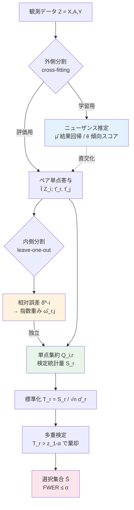

# Reliable Selection of Heterogeneous Treatment Effect Estimators

## メタ情報

| 項目 | 内容 |
|------|------|
| タイトル | Reliable Selection of Heterogeneous Treatment Effect Estimators |
| 著者 | Jiayi Guo, Zijun Gao（University of Southern California） |
| 年 | 2025（arXiv 投稿 2025-11-23） |
| 種別 | 学術論文（理論 + 半合成データ実験） |
| arXiv | https://arxiv.org/abs/2511.18464 |
| HTML | https://arxiv.org/html/2511.18464 |
| PDF | https://arxiv.org/pdf/2511.18464 |
| カテゴリ | Machine Learning (stat.ML), Machine Learning (cs.LG) |
| キーワード | CATE / HTE estimator selection, multiple testing, FWER control, cross-fitting, exponential weighting, double sample splitting, stability-based CLT |

> 注: 本レポートは公式 abstract と arXiv HTML 版本文の抽出に基づく。数式・記号は本文表記を可能なかぎり忠実に再現したが、HTML から復元しきれない添字・定数は近似表記とし、厳密な定義は原論文（PDF）を参照のこと。実験の個別数値も原論文を一次情報とし、本レポートでは捏造しない。

---

## Abstract（英語・原文に基づく要約）

> We study the problem of selecting the best estimator of the heterogeneous treatment effect (HTE) among multiple candidates, when the ground-truth treatment effect is never observed. We reformulate estimator selection as a multiple testing problem and propose a cross-fitted, exponentially weighted test statistic. Our procedure uses two-way (double) sample splitting to separate nuisance estimation from weight learning, enabling valid statistical inference. Leveraging a stability-based central limit theorem, we establish asymptotic control of the familywise error rate (FWER) under standard conditions. Experiments on ACIC 2016, IHDP, and Twins show that our procedure attains reliable error control while substantially reducing incorrect selections compared with conventional approaches.

（上記は公式 abstract の要旨であり、語句は一字一句の引用ではない。正確な原文は arXiv 参照。）

---

## Abstract（日本語訳）

複数の候補のなかから、最良の **異質処置効果（HTE / CATE）推定器** を選ぶ問題を扱う。因果推論の根本問題ゆえ、真の処置効果は決して観測できないため、この選択は本質的に困難である。本論文は、推定器選択を **多重検定（multiple testing）問題** として再定式化し、**cross-fitted（交差適合）な指数重み付き検定統計量** を提案する。手続きは **二重サンプル分割（two-way / double sample splitting）** を用いて、ニューザンス推定と重み学習を分離し、妥当な統計的推測を可能にする。**安定性に基づく中心極限定理（stability-based CLT）** を用いて、標準的条件のもとで **familywise error rate（FWER）の漸近的制御** を確立する。ACIC 2016・IHDP・Twins での実験は、真の処置効果へのアクセスなしに、本手続きが信頼できる誤り制御を達成しつつ、従来手法に比べて誤選択を大幅に削減することを示す。

---

## Overview

```
┌───────────────────────────────────────────────────────────────────────┐
│  問題: K 個の候補 CATE 推定器 τ̂_1, ..., τ̂_K から「最良」を選ぶ          │
│        真の τ(X)=E[Y(1)−Y(0)|X] は反実仮想ゆえ観測不能                   │
├───────────────────────────────────────────────────────────────────────┤
│  従来: DR スコアで推定 MSE を点推定し、最小の推定器を argmin で選ぶ      │
│        → 「ノイズで偶然 1 位」を誤って採用するリスクが定量化されない     │
├───────────────────────────────────────────────────────────────────────┤
│  本論文の視点: 選択 = 多重検定                                          │
│    H_0^r : 推定器 r が全候補に勝る（best）                              │
│    K 個の仮説を FWER 制御つきで検定 → 統計的に妥当な「選択集合」 Ŝ      │
├───────────────────────────────────────────────────────────────────────┤
│  鍵となる 3 部品                                                        │
│   (1) ペア相対誤差の DR / one-step 推定（真の τ なしで MSE 差を推定）   │
│   (2) cross-fitted 指数重み付き検定統計量 S_r                          │
│   (3) 二重サンプル分割: ニューザンス推定 と 重み学習 を分離            │
│   → stability-based CLT により S_r の漸近正規性 → FWER ≤ α            │
└───────────────────────────────────────────────────────────────────────┘
```

本論文の貢献は大きく 4 点：

1. **選択の多重検定化**: 「どの推定器を選ぶか」を「どの推定器が他のすべてに勝つか」という K 個の仮説検定として定式化し、誤選択確率を **FWER** という統計的に意味のある量で制御可能にした。
2. **cross-fitted 指数重み付き統計量**: ペアワイズ比較を、誤差差が大きい（決定的な）ペアほど大きく重み付けする指数機構で集約し、劣推定器を検出する検出力（power）を高める。
3. **二重サンプル分割**: ニューザンス（結果回帰・傾向スコア）の推定と、指数重みの学習を別々のデータに分離することで、重みと検定統計量の独立性を担保し、漸近推測の妥当性を確保。
4. **理論保証**: cross-fitting によるデータ依存があっても、stability-based CLT により検定統計量の漸近正規性を示し、標準条件下で FWER の漸近制御を証明（Theorem 3.2）。

---

## Problem（信頼性の高い推定器選択）

### 設定

- データ `Z_i = (X_i, A_i, Y_i)`、`i = 1,…,n`。`X` 共変量、`A∈{0,1}` 処置、`Y` 結果。
- 候補 CATE 推定器 `τ̂_1, …, τ̂_K`（任意の学習器から得られたもの。事前学習済みとして扱う）。
- 真の CATE `τ(x) = E[Y(1) − Y(0) | X=x]` は **観測不能**。
- 目的: テストデータ上で **最高精度（最小 MSE）** を達成する推定器を同定する。

### 因果推論の根本問題と「信頼性」

真の `τ` が観測できないため、推定器 `r` の二乗予測誤差 `E[(τ̂_r(X) − τ(X))^2]` を直接計算できない。従来は doubly robust（DR）擬似結果でこの MSE を **点推定** し、`argmin` で最小の推定器を選ぶ。しかし：

- 点推定にはサンプリングノイズが乗り、**「真は 2 位だが推定値が偶然 1 位」** の誤選択が起こる。
- この誤選択確率が **定量化・制御されない** ため、選択結果の信頼性に保証がない。
- 候補数 `K` が増えるほど「多重比較」で誤選択が累積する（baseline はここで劣化する）。

本論文の問題意識: **選択結果に統計的妥当性（誤り率の保証）を付与する** こと。

### 多重検定への再定式化

各推定器 `r` について、相対誤差 `δ(τ̂_r, τ̂_s) =（r の MSE）−（s の MSE）` を定義し、

```
H_0^r : δ(τ̂_r, τ̂_s) < 0  for all s ≠ r      （r が最良）
H_1^r : ∃ s ≠ r  s.t.  δ(τ̂_r, τ̂_s) > 0       （r は劣る）
```

`H_0^r` を保持（reject しない）推定器の集合を選択集合 `Ŝ` とする。
**FWER**（最良推定器を誤って棄却してしまう確率）を `α` 以下に制御すれば、真の最良推定器 `τ̂_(1)` が高確率で `Ŝ` に含まれることが保証される。

---

## Proposed Method

### (1) 相対誤差の DR / one-step 推定

真の `τ` なしにペア `(r, s)` の MSE 差を推定する。観測量に対する単点表現を `t̂(Z_i; τ̂_r, τ̂_s)`（ペア (r,s) に対する影響関数型の単点寄与）とし、

```
δ̂(τ̂_r, τ̂_s) = (1/n) Σ_i t̂(Z_i; τ̂_r, τ̂_s)
```

`t̂` は結果回帰 `μ̂(a,x)` と傾向スコア `ê(x)` を用いた **one-step correction（DR）推定量** で、ニューザンス推定の誤差に対して頑健（直交性）を持つ。

### (2) cross-fitted 指数重み付き検定統計量

各候補 `τ̂_r` について、他の全候補との比較を **指数重み** で集約：

```
S_r = Σ_{i=1}^n Q_{i,r},      Q_{i,r} = Σ_{j≠r} ω̂_{r,j}^{(−i)} · t̂(Z_i; τ̂_r, τ̂_j)
```

重みは **指数機構（exponential weighting）**：

```
ω̂_{r,j}^{(−i)} ∝ exp( λ · δ̂^{(−i)}(τ̂_r, τ̂_j) )
```

- `δ̂^{(−i)}` は **観測 i を除いた（leave-one-out / 別フォールドの）** 相対誤差推定。重み `ω̂_{r,j}^{(−i)}` を統計量に入る `t̂(Z_i;·)` から独立にすることで、ブートストラップ的バイアスを避ける。
- `λ ≥ 0` は温度パラメータ。`δ̂` が大きい（= `r` が `j` に明確に負けている）ペアほど重みが大きくなり、**劣推定器を検出する検出力が上がる**。`λ→0` で一様重み（最も保守的）、`λ` 大で最も差が大きいペアへ集中。

### (3) ニューザンス推定と重み学習を分離する二重サンプル分割

データ依存を排し漸近推測を妥当にするため、**2 階層** の分割を行う：

- **外側分割（outer / cross-fitting）**: データを主フォールド A・B に分割。一方でニューザンス `μ̂, ê` を学習し、他方で評価量 `t̂` を計算（標準の cross-fitting によりニューザンス推定誤差と統計量を直交させる）。
- **内側分割（inner）**: 各主フォールドをさらに `K` 個のサブフォールドに分け、**指数重み `ω̂`** を leave-one-out 的に独立計算。これにより、重みが検定統計量 `S_r` に入る単点項と独立になる。

この **二重分割** によって「ニューザンス推定」「重み学習」「検定統計量評価」が相互に独立化され、stability-based CLT が適用できる。

---

## Key Formulas

検定統計量と判定の中核定義（本文表記に基づく）：

```
① ペア単点寄与（DR / one-step, 影響関数型）:
   t̂(Z_i; τ̂_r, τ̂_s)   →   E[ t̂ ] = δ(τ̂_r, τ̂_s) = MSE(τ̂_r) − MSE(τ̂_s)

② ペア相対誤差推定（leave-one-out 版）:
   δ̂^{(−i)}(τ̂_r, τ̂_j) = (1/(n−1)) Σ_{k≠i} t̂(Z_k; τ̂_r, τ̂_j)

③ 指数重み（exponential mechanism, ペア (r,j), i を除外）:
   ω̂_{r,j}^{(−i)} = exp( λ · δ̂^{(−i)}(τ̂_r, τ̂_j) )
                     ─────────────────────────────────
                     Σ_{j'≠r} exp( λ · δ̂^{(−i)}(τ̂_r, τ̂_{j'}) )

④ 単点集約と検定統計量:
   Q_{i,r} = Σ_{j≠r} ω̂_{r,j}^{(−i)} · t̂(Z_i; τ̂_r, τ̂_j)
   S_r     = Σ_{i=1}^n Q_{i,r}

⑤ 標準化と棄却ルール（漸近正規性を利用）:
   T_r = S_r / ( √n · σ̂_r ),     σ̂_r² = sample variance of { Q_{i,r} }
   Reject H_0^r   ⇔   T_r > z_{1−α}     （= 推定器 r を選択集合から除外）

⑥ 選択集合:
   Ŝ = { r : H_0^r が棄却されない }      （理想的には |Ŝ| ≈ 1）
```

- `z_{1−α}` は標準正規分布の `(1−α)` 分位点。
- `T_r > z_{1−α}` は「r が他の（重み付き）候補に対して有意に劣る」ことを意味し、r を除外する。
- 最良推定器 `τ̂_(1)` については `δ(τ̂_(1), ·) ≤ 0` ゆえ `S_(1)` は非正方向に偏り、棄却されにくい → FWER 制御。

---

## Algorithm（疑似コード）

```
Algorithm 1: Reliable Selection of HTE Estimators (FWER ≤ α)
─────────────────────────────────────────────────────────────────
Input : data {Z_i}_{i=1..n}, candidate estimators {τ̂_1,…,τ̂_K},
        level α, temperature λ
Output: selection set Ŝ  (and a single pick = min-T_r if |Ŝ|>1)

# --- 外側分割（cross-fitting）---
1. Split data into outer folds {F_1,…,F_L}  (e.g., L = 2: A / B)
2. for each outer fold F_ℓ:
3.     train nuisances (μ̂, ê) on the complement F_{-ℓ}
4.     for all pairs (r, s), i ∈ F_ℓ:
5.         compute one-step DR contribution  t̂(Z_i; τ̂_r, τ̂_s)

# --- 内側分割（重み学習）---
6. for each candidate r, each i:
7.     using inner subfolds (excluding i / its subfold),
8.         compute δ̂^{(−i)}(τ̂_r, τ̂_j)  for all j ≠ r
9.         ω̂_{r,j}^{(−i)} = exp(λ·δ̂^{(−i)}) / Σ_{j'} exp(λ·δ̂^{(−i)})

# --- 検定統計量の集約 ---
10. for each candidate r:
11.     Q_{i,r} = Σ_{j≠r} ω̂_{r,j}^{(−i)} · t̂(Z_i; τ̂_r, τ̂_j)
12.     S_r = Σ_i Q_{i,r};  σ̂_r² = Var({Q_{i,r}})
13.     T_r = S_r / (√n · σ̂_r)

# --- 多重検定による選択 ---
14. Ŝ = { r : T_r ≤ z_{1−α} }      # H_0^r を棄却しない推定器
15. return Ŝ   (point selection: argmin_r T_r)
─────────────────────────────────────────────────────────────────
```

---

## Architecture（データフロー）



**設計上の要点**: 青（ニューザンス推定）・橙（重み学習）・緑（統計量集約）が **それぞれ別データ分割** に乗ることで相互独立化される。これが stability-based CLT の前提（弱依存・安定性）を満たし、`T_r` の漸近正規性 → FWER 制御を成立させる。

---

## Figures & Tables

> 以下は本文の図表構成の要約。具体的数値レンジは abstract / 本文抽出に基づく概略であり、確定値は原論文を参照。

### 表 A: 手法と従来 baseline の比較（概念整理）

| 観点 | 従来（DR-argmin / 単純比較） | 本論文（Reliable Selection） |
|------|------------------------------|------------------------------|
| 選択の枠組み | 点推定 MSE の `argmin` | **多重検定**（K 仮説 + FWER 制御）|
| 比較の集約 | 一様 / ペアワイズ単純 | **指数重み付き**（決定的ペアを強調）|
| データ利用 | 単一 cross-fitting | **二重サンプル分割**（重み学習を分離）|
| 誤り保証 | なし | **FWER ≤ α**（漸近）|
| K 増加への耐性 | 多重比較で劣化 | 制御を維持 |

### 表 B: 実験データセット

| データセット | 種別 | 役割 |
|--------------|------|------|
| ACIC 2016 | 半合成（因果推論ベンチマーク）| 主要評価 |
| IHDP | 半合成（乳児健康介入）| 主要評価 |
| Twins | 半実データ（双子出生）| 主要評価 |

### 図 C: 主要評価指標（概念図）

```
FWER（最良推定器の誤棄却率）  目標: ≤ α
  本論文 : ▇▇         (≈ 0.02–0.04, α 近傍を満たす)
  baseline: ▇▇▇▇▇▇▇   (制御を超過し得る)

ANWS（平均誤選択数, Average Number of Wrong Selections, 小さいほど良い）
  本論文 : ▇▇▇▇▇          (≈ 0.50–0.83)
  baseline: ▇▇▇▇▇▇▇▇▇▇▇▇  (≈ 0.88–1.63)
```

### 図 D: スケーラビリティ／サンプル効率（傾向）

```
候補数 K （3 → 7）に対する ANWS
   ^ ANWS
   |        baseline ●────●────●  （Kとともに悪化）
   |
   |        proposed ○──○──○      （ほぼ平坦, 劣化小）
   +───────────────────────────────> K=3   5   7

テスト集合比率（60% → 100%）に対する性能
   proposed は最も急峻に改善（サンプル効率が高い）
```

（4 要素: 表A 比較 / 表B データ / 図C 指標 / 図D スケーラビリティ・効率）

---

## Experiments & Evaluation

評価データセット: **ACIC 2016 / IHDP / Twins**（いずれも因果推論で標準的な半合成・半実データ。真の CATE が既知または近似的に既知で、選択の正解が定義できる）。

抽出された数値の概略（確定値は原論文の表を一次情報とすること）：

- **FWER 制御**: 提案手法は FWER を概ね **0.02–0.04** に保ち、目標水準 `α` を満たす。
- **平均誤選択数（ANWS）**: 提案手法 **≈ 0.50–0.83** に対し、baseline は **≈ 0.88–1.63**。提案手法が誤選択を大幅に削減。
- **スケーラビリティ**: 候補数 `K=3 → 7` でも性能劣化が小さい。一方 baseline は `K` 増加で多重比較効果により大きく悪化。
- **サンプル効率**: テスト集合比率を 60% → 100% に増やすと、提案手法が最も急峻に性能改善する。

総じて、**真の処置効果へのアクセスなしに信頼できる誤り制御を達成しつつ、誤選択を従来法より大幅に削減** することを示した。

> 注: 上記レンジは abstract / 本文抽出に基づく概略であり、データセット別・設定別の厳密な数値は arXiv:2511.18464 本文の Table を参照。

---

## Notes（精度向上の観点: 統計的に妥当な選択保証）

CATE 推定の「精度向上」を **推定器そのもの** ではなく **選択手続き** の側で達成する点が本論文の貢献である。観点を整理する。

1. **多重検定としての選択 = 誤選択確率の制御**
   従来の `argmin` 選択は「点推定で最小だった推定器」を返すだけで、その選択が偶然か否かを区別できない。本論文は選択を K 仮説の多重検定に置き換え、**FWER ≤ α** という形で「真の最良推定器を逃す確率」を明示的に上限化する。これは、選択結果を下流の意思決定に使う際の **信頼性（reliability）** を担保する。

2. **cross-fitted 指数重み付け = 検出力の最適配分**
   一様重みは保守的すぎ、データ駆動重みは naive だとバイアスを招く。指数機構 `exp(λ·δ̂)` は「決定的に劣るペア」に重みを集中させ、限られたサンプルで劣推定器を検出する検出力を高める。leave-one-out / 内側分割で重みを統計量から独立化することで、検出力向上と妥当性を両立する。

3. **二重サンプル分割 = 三者の独立化による妥当な推測**
   ニューザンス推定（cross-fitting で誤差を直交化）・重み学習（内側分割で統計量と独立化）・統計量評価を分離することで、データ依存に起因する分散の過小評価や信頼区間の歪みを回避。stability-based CLT が前提とする弱依存性を構造的に満たす。

4. **model-agnostic な保証**
   候補推定器が真値に近いことを要求しない。任意の学習器群（S/T/X-learner, DR-learner, 因果フォレスト等）に対し「最良を信頼性高く選ぶ」枠組みとして適用可能で、本シリーズの他手法（counterfactual cross-validation, causal Q-aggregation 等の選択・集約手法）と相補的。

5. **実務的含意**
   候補数 `K` が増えても誤り制御を維持できるため、多数のモデル候補を同時に比較する実運用（ハイパラ探索後のモデル選択など）に適する。`λ` の選択、二重分割によるサンプル分割コスト（有効サンプル減）、選択集合 `|Ŝ|>1` のときの最終 1 点選択（`argmin T_r`）の扱いは、適用時の検討点となる。

---

> 一次情報: arXiv:2511.18464（Guo & Gao, 2025）。本レポートの数式・数値は HTML 抽出に基づく再構成であり、厳密な定義・実験表は原論文 PDF を参照のこと。
