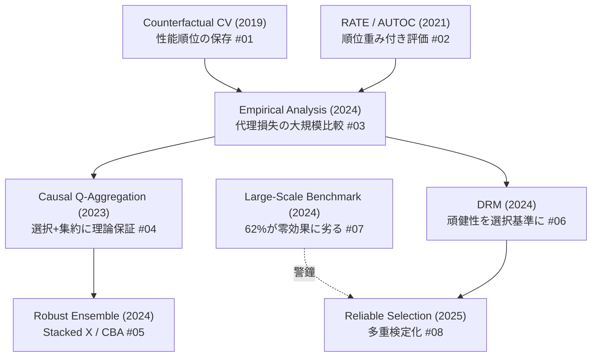

# C2 アンサンブル・モデル選択・CATE 専用バリデーション — 詳細レポート

## Parameters

- **Resources analyzed**: 8（C2 gather 13件のうち精度向上に直結する代表8件を詳細化。残り5件は gather リスト参照）
- **Resource types**: Academic Paper
- **Generated on**: 2026-06-02
- **Input source**: research-gather 出力 `docs/research/runs/cate/gather/20260602_ensemble_model_selection/resources-ensemble-model-selection.md`
- **観点**: CATE 推定の精度向上 — ground-truth 無しで「正しい推定器を選ぶ／組み合わせる」技術

## Report List

### Academic Papers

| # | Title | Year | Venue | Summary | Report |
|---|-------|------|-------|---------|--------|
| 1 | Counterfactual Cross-Validation | 2019 | ICML 2020 | 性能順位の保存を狙う選択指標。ground-truth 無しの安定したモデル選択 | [詳細](01-counterfactual-cross-validation.md) |
| 2 | Evaluating Treatment Prioritization Rules via RATE (AUTOC/Qini) | 2021 | JASA 2025 | RATE が Qini/AUTOC を包含、CLT で厳密推論。CATE 専用評価指標の中核 | [詳細](02-rate-autoc.md) |
| 3 | Empirical Analysis of Model Selection for HTE | 2024 | ICLR 2024 | 各代理損失(Tau-risk 等)を大規模実証比較、どの指標が良いランキングを与えるか | [詳細](03-empirical-model-selection.md) |
| 4 | Causal Q-Aggregation for CATE Model Selection | 2023 | NeurIPS 2023 | DR 損失 + Q-aggregation で最適オラクル選択レートを理論保証 | [詳細](04-causal-q-aggregation.md) |
| 5 | Robust CATE Estimation Using Novel Ensemble Methods | 2024 | arXiv | Stacked X-Learner + Consensus Based Averaging で安定性・精度向上 | [詳細](05-robust-ensemble.md) |
| 6 | Robustness in Selecting CATE Estimators (DRM) | 2024 | NeurIPS 2024 | nuisance-free な Distributionally Robust Metric で分布頑健な選択 | [詳細](06-drm-robust-selection.md) |
| 7 | Do Models Capture Real-World Heterogeneity? Large-Scale Benchmark | 2024 | arXiv | 62% の推定が零効果予測器に劣ると報告、モデル選択の重要性を裏付け | [詳細](07-large-scale-benchmark.md) |
| 8 | Reliable Selection of HTE Estimators | 2025 | arXiv | 推定器選択を多重検定化、cross-fitted 指数重み付け統計量で妥当な選択 | [詳細](08-reliable-selection.md) |

### 詳細化せず gather リストに保持した論文（C2 残り5件）

| Title | Year | 理由 | 参照 |
|-------|------|------|------|
| Causal Rule Ensemble (CRE) | 2020 | 解釈可能性寄り（精度向上は副次的） | gather #2 |
| HTE Estimation using Model-based Forests | 2022 | C2 #5 と内容が近い | gather #4 |
| What Makes Forest-Based HTE Estimators Work? | 2022 | フォレスト内部分析（横断知見） | gather #5 |
| Out-of-sample scoring / auto selection | 2022 | C2 #1/#3 と手法が重複 | gather #7 |
| Statistical Learning for HTE: Pretraining... | 2025 | C5 の pretraining と関連 | gather #12 |

## Cross-Resource Insights — CATE モデル選択・検証の系譜

**核心の流れ**:
1. **問題提起（2019-2021）**: CATE は ground-truth 不可観測 → Counterfactual CV（#01）が「真値でなく推定器の順位を保存できる指標」を提案。RATE/AUTOC（#02）が順位重み付き評価で uplift 指標を統一・厳密化。
2. **体系的検証（2023-2024）**: Empirical Analysis（#03）がどの代理損失が実際に有効かを大規模実証。Causal Q-Aggregation（#04）が選択+集約に理論保証。
3. **頑健化とアンサンブル（2024）**: DRM（#06）が分布シフトに頑健な選択を、Robust Ensemble（#05）が複数推定器の集約で安定性を確保。
4. **警鐘と信頼性（2024-2025）**: 大規模ベンチ（#07）が「62% のモデルが零効果予測器に劣る」と報告 → 正しい選択の死活的重要性。Reliable Selection（#08）が多重検定として統計的妥当性を担保。

## Comparison Table — CATE 検証・選択指標の比較

| 指標/手法 | nuisance 依存 | 理論保証 | ground-truth 不要 | 主用途 | 論文 |
|-----------|:----:|:----:|:----:|--------|------|
| Counterfactual CV | あり | 順位保存 | ✓ | 推定器・ハイパラ選択 | #01 |
| RATE / AUTOC | あり | CLT 推論 | ✓ | 優先ルール評価・異質性検定 | #02 |
| Tau-risk / R-loss | あり | 経験的に有効 | ✓ | 汎用モデル選択 | #03 |
| Causal Q-Aggregation | あり(DR) | オラクル選択レート | ✓ | 選択 + アンサンブル | #04 |
| DRM | **なし** | 分布頑健 | ✓ | 分布シフト下の選択 | #06 |
| 多重検定 (Reliable) | 分離 | FWER 制御 | ✓ | 統計的に妥当な選択 | #08 |

## 精度向上のための実務的示唆（C2 総括）

1. **「最良の推定器を1つ選ぶ」より「集約する」方が安定** — Robust Ensemble（#05）や Causal Q-Aggregation（#04）は単一選択のリスクを低減。
2. **検証指標は AUTOC / RATE を第一候補に** — #02 は CLT による検定が可能で、異質性の有無自体も判定できる。#03 は「単純な Tau スコアが平均的に優秀」とも報告。
3. **分布シフトが疑われるなら DRM（#06）** — nuisance-free で、デプロイ環境が学習時と異なる実務に強い。
4. **ベンチマーク結果を過信しない** — #07 の「62% が零効果に劣る」は、論文の精度主張が評価設定依存であることへの警鐘。自前データでの #08 のような妥当な選択手続きが重要。
5. **C1 との接続** — 直交メタラーナー（DR/R-learner）同士の選択にこそ #04 の DR 損失ベース選択が自然に適合。

## Further Investigation Candidates

- **C6（ベンチマーク・再現性）**: #07 の系譜は Curth & van der Schaar のベンチ批評（C6）に直結 → `docs/research/runs/cate/gather/20260602_benchmark_reproducibility/`
- **C5（頑健性）**: #06 DRM は C5 の分布シフト頑健性と共通テーマ
- **C1（直交学習）**: #04 の DR 損失は C1 の DR-learner と同根
