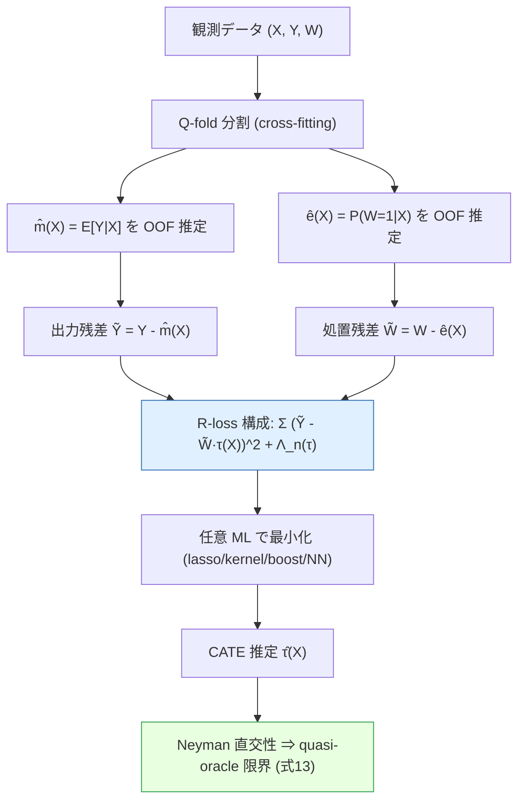

# Quasi-Oracle Estimation of Heterogeneous Treatment Effects (R-learner)

| 項目 | 内容 |
|------|------|
| **Link** | [arXiv:1712.04912](https://arxiv.org/abs/1712.04912) / [PDF](https://arxiv.org/pdf/1712.04912) |
| **Authors** | Xinkun Nie, Stefan Wager (Stanford University) |
| **Year** | 2017 投稿 / v4 2020年8月改訂 |
| **Venue** | Biometrika（採録）|
| **Type** | 統計的因果推論 / メタラーナー / 半パラメトリック理論 |
| **実装** | [github.com/xnie/rlearner](https://github.com/xnie/rlearner)（`rlasso`, `rkern`, `rboost`）|

---

## Abstract（原文）

> Flexible estimation of heterogeneous treatment effects lies at the heart of many statistical challenges, such as personalized medicine and optimal resource allocation. In this paper, we develop a general class of two-step algorithms for heterogeneous treatment effect estimation in observational studies. We first estimate marginal effects and treatment propensities in order to form an objective function that isolates the causal component of the signal. Then, we optimize this data-adaptive objective function. Our approach has several advantages over existing methods. From a practical perspective, our method is flexible and easy to use: In both steps, we can use any loss-minimization method, e.g., penalized regression, deep neural networks, or boosting; moreover, these methods can be fine-tuned by cross validation. Meanwhile, in the case of penalized kernel regression, we show that our method has a quasi-oracle property: Even if the pilot estimates for marginal effects and treatment propensities are not particularly accurate, we achieve the same error bounds as an oracle who has a priori knowledge of these two nuisance components. We implement variants of our approach based on penalized regression, kernel ridge regression, and boosting in a variety of simulation setups, and find promising performance relative to existing baselines.

## Abstract（日本語訳）

異質処置効果（heterogeneous treatment effects）の柔軟な推定は、個別化医療や最適資源配分など多くの統計的課題の中核にある。本論文では、観察研究における異質処置効果推定のための一般的な **2 段階アルゴリズム** の族を提案する。第 1 段階では **周辺効果（marginal effect）と処置傾向（propensity）** を推定し、信号から因果成分だけを切り出す目的関数を構成する。第 2 段階では、このデータ適応的な目的関数を最適化する。本手法は既存手法に対していくつかの利点を持つ。実務上、両段階で罰則付き回帰・深層ニューラルネット・ブースティングなど任意の損失最小化手法を用いることができ、交差検証でチューニングできる。理論面では、罰則付きカーネル回帰の場合に **quasi-oracle 性質** を持つことを示す。すなわち、周辺効果と処置傾向のパイロット推定がさほど正確でなくても、これら 2 つの撹乱成分（nuisance）を事前に知るオラクルと同じ誤差限界を達成する。罰則付き回帰・カーネルリッジ回帰・ブースティングに基づく複数の変種を多様なシミュレーション設定で実装し、既存ベースラインに対し有望な性能を示す。

---

## Overview

R-learner は、CATE（条件付き平均処置効果）$\tau^*(x) = E\{Y(1)-Y(0)\mid X=x\}$ を推定するための **メタラーナー**（任意の機械学習モデルを差し込めるフレームワーク）である。中心となるアイデアは、Robinson (1988) の部分線形モデルにおける残差化（residualization）変換を **損失関数** として再定式化し、その損失（**R-loss**）を任意の ML 手法で最小化する点にある。

R-learner の本質は **「2 つのタスクの分離」** にある。任意の優れた CATE 推定器は次の 2 つを同時に達成せねばならない:

1. **交絡の除去** — 傾向 $e^*(X)$ と主効果 $m^*(X)$ の相関に起因する見せかけの効果（spurious effect）を除く。
2. **$\tau^*$ の正確な表現** — 効果関数そのものを精緻に推定する。

従来の多くの手法（causal forest, BART 改変, 各種 NN 改変）はこの 2 つをアルゴリズム内部で同時に処理しようとする。R-learner は **(1) を損失関数 $\hat L_n$ の構造で吸収し、(2) を最適化手法の選択で担う** ことで両者を明確に分離する。これにより、内部状態を監査せずにブラックボックスな ML 手法を安心して使える（「holdout で $\hat L_n$ をよく下げているか」だけ確認すればよい）。

理論面の核心は **quasi-oracle 性質**: 撹乱成分 $\hat m, \hat e$ の推定誤差が $o(n^{-1/4})$ という緩い速度でしか収束しなくても、最終推定 $\hat\tau$ の収束速度は **$\tau^*$ の複雑さのみに依存** し、$m^*, e^*$ を事前に知るオラクル推定 $\tilde\tau$ と同じ誤差限界 (13) を達成する。これは Neyman 直交性（局所頑健性）が R-loss に組み込まれていることの帰結である。

```
        ┌──────────────────────────────────────────────────────┐
        │  R-learner = Robinson 残差化を「損失」に再定義したもの    │
        ├──────────────────────────────────────────────────────┤
        │  交絡の除去  →  損失 L̂_n の構造（残差積）が担う           │
        │  τ* の表現   →  最適化手法（lasso/kernel/boost/NN）が担う  │
        │  頑健性      →  Neyman 直交性 ⇒ quasi-oracle             │
        └──────────────────────────────────────────────────────┘
```

---

## Problem（解くべき課題）

- **異質処置効果の推定は難しい**: 観察研究では交絡があり、傾向スコア $e^*(X)$ と主効果 $m^*(X)$ の相関が、真の効果がゼロでも見せかけの異質性を生む。
- **既存メタラーナーには正則化バイアスがある**:
  - **T-learner**（処置群・対照群で別々に $\hat\mu_{(1)}, \hat\mu_{(0)}$ を回帰し差を取る）は、両者を別々に 0 方向へ正則化するため、$\tau^*\equiv 0$ でも差 $\hat\beta_{(1)}-\hat\beta_{(0)}$ が 0 から離れてしまう。群サイズが不均衡だと特に深刻。
  - **U-learner**（$U_i = (Y_i-m^*)/(W_i-e^*)$ を回帰）は傾向で割るため、$W_i\approx e^*(X_i)$ 付近で **高分散・不安定**。
- **半パラメトリック理論の課題**: 既存の直交モーメント理論は **単一（低次元）の目標パラメータ** に焦点を当てていたが、CATE $\tau^*(\cdot)$ は **それ自体が複雑な関数オブジェクト** であり、$\sqrt n$ 速度で推定できない撹乱成分の存在下で関数全体の誤差限界を与える必要がある。
- **実装の労力**: 各 ML 手法を因果推論用に改造するのは専門家を要し、形式的な収束保証も欠けることが多い。

---

## Proposed Method

### 1. Robinson 分解（残差化変換）

未交絡性（Assumption 1）のもとで、条件付き平均 $m^*(x)=E[Y\mid X=x]=\mu^*_{(0)}(x)+e^*(x)\tau^*(x)$ を用いると、出力は次のように分解できる:

$$
Y_i - m^*(X_i) = \{W_i - e^*(X_i)\}\,\tau^*(X_i) + \varepsilon_i,
\qquad E[\varepsilon_i\mid X_i, W_i]=0. \tag{1}
$$

左辺は「出力の残差」、$\{W_i-e^*(X_i)\}$ は「処置の残差」であり、その積に $\tau^*$ が掛かる。これが Robinson (1988) が部分線形モデルのパラメトリック成分推定に用いた変換であり、本論文はこれを **関数推定の損失** に昇華する。

### 2. オラクル目的関数（R-loss のオラクル版）

(1) は同値に、$m^*, e^*$ を既知とするオラクルの経験損失最小化として書ける:

$$
\tilde\tau(\cdot)=\operatorname*{argmin}_{\tau}\Bigg(
\frac{1}{n}\sum_{i=1}^n \Big[\{Y_i-m^*(X_i)\} - \{W_i-e^*(X_i)\}\,\tau(X_i)\Big]^2
+ \Lambda_n\{\tau(\cdot)\}\Bigg). \tag{3}
$$

ここで $\Lambda_n\{\tau(\cdot)\}$ は $\tau$ の複雑さに対する正則化項（罰則付き回帰なら明示的、NN なら暗黙的）。

### 3. 2 段階推定 + cross-fitting（実行可能な R-learner）

実際には $m^*, e^*$ は未知なので、cross-fitting でプラグイン推定する。

- **Step 1**: データを $Q$ 個（通常 5 または 10）の等サイズ fold に分割。マッピング $q(\cdot)$ で各標本 $i$ を fold に割り当て、$\hat m, \hat e$ を **cross-fitting** で当てはめる（予測精度最適化のためにチューニング）。$\hat e^{(-q(i))}(X_i)$ は標本 $i$ を含む fold を **使わずに** 作った予測。
- **Step 2**: cross-fit したプラグインで (3) を最適化:

$$
\hat\tau(\cdot)=\operatorname*{argmin}_{\tau}\Big[\hat L_n\{\tau(\cdot)\} + \Lambda_n\{\tau(\cdot)\}\Big],
$$
$$
\hat L_n\{\tau(\cdot)\}=\frac{1}{n}\sum_{i=1}^n
\Big[\{Y_i-\hat m^{(-q(i))}(X_i)\} - \{W_i-\hat e^{(-q(i))}(X_i)\}\,\tau(X_i)\Big]^2. \tag{4}
$$

この $\hat L_n\{\tau(\cdot)\}$ を **R-loss** と呼ぶ。Step 1 がオラクル目的の近似を学び、Step 2 がそれを最適化する。cross-fitting により撹乱推定とター効果推定の標本依存（過学習バイアス）を断ち切る点が直交性発揮の鍵。

### 4. なぜ精度が上がるのか（直交化の効果）

- **Neyman 直交性**: R-loss の母集団版 $L(\tau)$ は、$m^*, e^*$ の周りで撹乱方向への一次微分が消える（局所頑健）。したがって撹乱推定誤差は $\hat\tau$ の誤差に **2 次の影響** しか与えない。
- **積誤差構造**: 最終誤差は概ね $\|\hat m - m^*\|\cdot\|\hat e - e^*\|$ のオーダーに入る。各々が $o(n^{-1/4})$ なら積は $o(n^{-1/2})$ となり高次項に吸収される。
- **2 タスク分離**: 損失構造が交絡を吸収するため、最適化器は「$\hat L_n$ をよく下げる」一点のみに集中でき、ブラックボックス ML をそのまま流用できる。

---

## Key Formulas

**Robinson 分解（恒等式）:**
$$
Y_i - m^*(X_i) = \{W_i - e^*(X_i)\}\,\tau^*(X_i) + \varepsilon_i
$$

**母集団 R-loss / CATE の変分的特徴づけ:**
$$
\tau^*(\cdot)=\operatorname*{argmin}_{\tau}\;
E\!\left(\Big[\{Y_i-m^*(X_i)\}-\{W_i-e^*(X_i)\}\,\tau(X_i)\Big]^2\right)
$$

**実行可能 R-learner（cross-fit プラグイン + 正則化）:**
$$
\hat\tau=\operatorname*{argmin}_{\tau}\;
\frac{1}{n}\sum_{i=1}^n\Big[\{Y_i-\hat m^{(-q(i))}(X_i)\}-\{W_i-\hat e^{(-q(i))}(X_i)\}\,\tau(X_i)\Big]^2
+\Lambda_n\{\tau(\cdot)\}
$$

**Regret（超過リスク）と二乗誤差の対応（overlap $\eta < e^*(x) < 1-\eta$ のもとで）:**
$$
R(\tau)=L(\tau)-L(\tau^*),\quad
L(\tau)=E\!\left(\Big[\{Y_i-m^*(X_i)\}-\tau(X_i)\{W_i-e^*(X_i)\}\Big]^2\right)
$$
$$
(1-\eta)^{-2}R(\tau) < E[\{\tau(X_i)-\tau^*(X_i)\}^2] < \eta^{-2}R(\tau) \tag{12}
$$

**オラクルの regret 収束速度（罰則付きカーネル回帰、Mendelson–Neeman 2010）:**
$$
R(\tilde\tau)=\tilde{\mathcal O}_P\!\left(n^{-\frac{1-2\alpha}{p+(1-2\alpha)}}\right) \tag{13}
$$
（$0<p<1$ は固有値減衰指数、$0<\alpha<1/2$ は $\tau^*$ の平滑性。$\alpha=0$ なら $n^{-1/(1+p)}$ に帰着）

**quasi-oracle の主結果（Theorem 3）:** $2\alpha<1-p$、撹乱が $a_n=O(n^{-\kappa}),\ \kappa>1/4$ で収束すれば、cross-fit R-learner $\hat\tau$ はオラクルと **同一** の限界 (13) を満たす:
$$
R(\hat\tau),\,R(\tilde\tau)=\tilde{\mathcal O}_P(r_n^2),\quad
r_n=n^{-\frac{1-2\alpha}{2\{p+(1-2\alpha)\}}}. \tag{21}
$$

> 「$\hat\tau$ の収束速度は $\tau^*$ の複雑さのみに依存し、$m^*, e^*$ の複雑さには依存しない」── これが quasi-oracle の言明。

---

## Algorithm（疑似コード）

```text
入力: データ {(X_i, Y_i, W_i)}_{i=1..n}, fold 数 Q (例 5 or 10),
      基底 ML 手法 (lasso / kernel ridge / boosting / NN), 正則化 Λ_n
出力: CATE 推定 τ̂(·)

# ---- Step 1: 撹乱成分の cross-fitting ----
データを Q 個の等サイズ fold に分割し、割当 q(i) を定義
for each fold q = 1..Q:
    fold q を除く全データで以下を学習:
        m̂^(-q)(·)  ← E[Y | X]      の推定 (CV でチューニング)
        ê^(-q)(·)  ← P(W=1 | X)    の推定 (CV でチューニング)
    fold q の各 i について out-of-fold 予測 m̂^(-q(i))(X_i), ê^(-q(i))(X_i) を保存

# ---- Step 2: R-loss の最小化 ----
残差を計算:
    Ỹ_i = Y_i - m̂^(-q(i))(X_i)          # 出力残差
    W̃_i = W_i - ê^(-q(i))(X_i)          # 処置残差
重み付き回帰問題として τ̂ を解く:
    τ̂(·) = argmin_τ  (1/n) Σ_i ( Ỹ_i - W̃_i · τ(X_i) )^2 + Λ_n{τ(·)}
        ≡ 重み w_i = W̃_i^2, 疑似目的 z_i = Ỹ_i / W̃_i の重み付き回帰

return τ̂(·)
```

**実装上の同値変形**: $(\tilde Y_i - \tilde W_i\tau)^2 = \tilde W_i^2\,(\tilde Y_i/\tilde W_i - \tau)^2$ より、R-loss は **重み $\tilde W_i^2$・目標 $\tilde Y_i/\tilde W_i$ の重み付き回帰** として任意の ML ソルバ（`glmnet`, `XGBoost`, `TensorFlow` 等）にそのまま渡せる。

---

## Architecture / Process Flow



---

## Figures & Tables

### Table 1. メタラーナーの比較（本論文の記述に基づく合成整理）

| 手法 | 推定の中身 | 交絡除去 | 正則化バイアス | quasi-oracle | 弱点 |
|------|-----------|---------|--------------|:-----------:|------|
| **S-learner** | 単一モデル $f(x,w)$、$\hat\tau=\hat f(x,1)-\hat f(x,0)$ | △ | $W$ を 0 へ正則化しがち | × | 効果が消えやすい |
| **T-learner** | $\hat\mu_{(1)},\hat\mu_{(0)}$ を別々に回帰し差 | × | 大（別々に 0 方向へ正則化） | × | $\tau\equiv0$ でも非ゼロ化、群不均衡に脆弱 |
| **X-learner** | 疑似効果 $D_i$ を回帰、傾向で集約 (7) | ○ | 中 | ×（反例あり, Thm.3 議論） | 撹乱への局所頑健性なし |
| **U-learner** | $U_i=(Y-m^*)/(W-e^*)$ を回帰 | ○ | — | × | 傾向で割るため高分散・不安定 |
| **R-learner** | R-loss (4) を最小化 | ◎（損失構造が吸収） | 小（$\tau$ にのみ罰則） | **○（Thm.3）** | overlap 仮定が必要 |
| **RS-learner** | R + S を融合、(主効果と $\tau$ を別罰則) | ◎ | 小 | ○ 系 | やや複雑 |

### Table 2. quasi-oracle 誤差限界の構造（式 13・21 の要約）

| 量 | 速度 | 依存する複雑さ |
|----|------|---------------|
| オラクル $\tilde\tau$ の regret | $\tilde{\mathcal O}_P(n^{-(1-2\alpha)/[p+(1-2\alpha)]})$ | $\tau^*$ の平滑性 $\alpha$、固有値減衰 $p$ |
| 撹乱 $\hat m,\hat e$ の要求精度 | $a_n=O(n^{-\kappa}),\ \kappa>1/4$ | （緩い条件で十分）|
| 実行可能 $\hat\tau$ の regret | **オラクルと同一**（式 21） | $\tau^*$ のみ（$m^*,e^*$ には非依存）|

### Table 3. シミュレーション設定 A–D（§6.1）

| 設定 | 撹乱（主効果・傾向）| 処置効果 $\tau^*$ | 狙い |
|------|------------------|------------------|------|
| **A** | 難（Friedman 関数 $b^*$、$e^*=\mathrm{trim}\{\sin(\pi X_1X_2)\}$）| 易 $(X_1+X_2)/2$ | 強い交絡・易しい効果 → R/RS が際立つ |
| **B** | 易（$e^*\equiv1/2$、ランダム化試験）| $X_1+\log(1+e^{X_2})$ | 交絡なし → X/S/R が最良 |
| **C** | 主効果は難だが傾向は易 $e^*=1/(1+e^{X_2+X_3})$ | 定数 $\tau^*\equiv1$ | 強交絡だが傾向は推定容易 → R/RS が際立つ |
| **D** | 処置・対照アームが無相関 | $\max\{X_1+X_2+X_3,0\}-\max\{X_4+X_5,0\}$ | 共同モデル化に利点なし → T-learner も健闘 |

### Table 4. 具体的な数値結果（論文中で明示された値）

| 実験 | 指標 | 値 |
|------|------|-----|
| 投票研究（§4.1）| R-loss（CV、lasso vs boosting）| **0.1816 vs 0.1818**（lasso 勝ち）|
| 投票研究 | R-loss（holdout、lasso vs boosting）| **0.1781 vs 0.1783**（lasso 安定して勝ち）|
| 投票研究 | 効果の異質性の規模 | $\mathrm{var}\{\tau^*(X)\}=0.016$（非常に微弱）|
| 投票研究 | データ規模 | 全 1,895,468 件 → 解析 148,160 件（train 100k / test 25k / holdout 残り）, $d=11$ |
| stacking（§4.2, 式9）| オラクル test MSE: lasso vs boosting | **$0.47\times10^{-3}$ vs $1.23\times10^{-3}$** |
| stacking | single lasso (6) vs BART+傾向特徴 | **$0.61\times10^{-3}$ vs $4.05\times10^{-3}$** |
| §6 lasso 実験 | cross-fitting | $\hat e,\hat m$ に 10-fold、罰則は 10-fold CV |

> Figure 2（論文）: 設定 (9) の RMSE を雑音 $\sigma$ ごとに比較。smooth $\tau^*$ では BART がやや causal forest を上回り、**R-stack（スタッキング）は $\sigma$ が極端に大きくなるまで両者を上回る**。discontinuous $\tau^*$ は causal forest に有利だが、R-stack はより良い基底学習器の性能を自動的に追従する。各点 50 回反復平均。

> §6 lasso 実験の所見: **設定 A・C（複雑な交絡を要克服）で R-/RS-learner が突出**。ランダム化の設定 B では全手法が健闘し X/S/R が最良。アームが無相関の設定 D では別々にモデル化する T-learner が健闘。Figure 3 の生数値は論文 Appendix B 参照。

---

## Experiments & Evaluation

### Setup

- **投票研究（半合成, §4.1）**: Arceneaux et al. (2006) の get-out-the-vote データ（実データでは効果ほぼゼロ）に合成効果 $\tau^*(X_i)=-\mathrm{VOTE00}_i/(2+100/\mathrm{AGE}_i)$ を注入。$Y, W$ ともに二値、$d=11$ 共変量。傾向は既知だがアルゴリズムには隠して $\hat e(\cdot)$ を学習。撹乱はブースティング、$\tau$ は lasso/boosting を比較。
- **stacking（§4.2, 式9）**: $n=10{,}000$、$X\sim\mathcal N(0,I_{10})$、$W\sim\mathrm{Bernoulli}(0.5)$。smooth $\tau^*=1/(1+e^{X_1-X_2})$ と discontinuous $\tau^*=\mathbb 1\{X_1>0\}/(1+e^{-X_2})$。基底学習器 BART・causal forest をスタッキング (8) で統合。
- **メインのシミュレーション（§6）**: S/T/X/U/R/RS-learner を lasso・boosting で実装。設定 A–D（Table 3）。$\hat e$ は $L_1$ 罰則ロジスティック、その他は lasso。自然スプライン基底（自由度 7）の対交互作用。MSE は別の test set で測定、罰則は 10-fold CV、cross-fitting も 10-fold。U-learner は分散が大きいため傾向に 0.05 のカットオフ、`lambda.1se` を使用。

### Main Results（具体数値）

- **投票研究**: $\tau$ 推定は **lasso が boosting を僅差かつ安定して上回る**（CV R-loss 0.1816 vs 0.1818、holdout 0.1781 vs 0.1783）。撹乱はブースティングが選ばれた。効果の異質性は $\mathrm{var}\{\tau^*\}=0.016$ と極めて微弱で、大標本が必要。
- **stacking**: smooth 設定でオラクル test MSE は **lasso $0.47\times10^{-3}$ が boosting $1.23\times10^{-3}$ を大きく上回る**。一方 single lasso (6) が $0.61\times10^{-3}$、傾向特徴を足した BART が $4.05\times10^{-3}$。→ **撹乱推定は非パラ手法（BART 等）、$\tau$ は単純な lasso** という組み合わせに価値があることを示す。R-stack は雑音が極端でない限り単一基底学習器を上回る。
- **§6 総括**: **R-/RS-learner が広範な設定で一貫して良好**。特に交絡が強い設定 A・C で突出。ランダム化（B）では全手法健闘、アーム無相関（D）では T-learner も良好。生数値は論文 Appendix B 参照。

> 上記以外の設定別 MSE の表は本レポートでは数値が PDF 図表から確定できないため、**原論文 Figure 3 / Appendix B 参照**（捏造を避ける）。

---

## Notes（精度向上の観点での位置づけ）

**1. quasi-oracle 性質 = 撹乱推定誤差への頑健性。** R-learner の最大の貢献は、Neyman 直交な R-loss を用いることで、撹乱 $\hat m, \hat e$ の推定誤差が最終 CATE 推定 $\hat\tau$ に **2 次（積）でしか効かない** ことを関数推定の文脈で証明した点にある。各撹乱が $o(n^{-1/4})$（Theorem の $\kappa>1/4$）で収束すれば、$\hat\tau$ の収束速度は $\tau^*$ の複雑さのみで決まり、オラクル限界 (13)(21) を達成する。これは「撹乱は粗くてよい、効果関数の精度だけが本質」というメッセージであり、CATE 推定の精度を引き上げる設計原理を与える。

**2. cross-fitting の役割。** 撹乱を out-of-fold 予測で当てはめることで、撹乱推定とター効果推定の標本共有による過学習バイアスを断ち切り、直交性を有限標本でも有効化する。これがなければ高次項の制御が崩れる。Chernozhukov et al. (2018, DML) と同系統の手法だが、対象が単一パラメータでなく **関数 $\tau^*(\cdot)$** である点が本質的拡張。

**3. 2 タスク分離による実用性。** 交絡除去を損失構造に押し込み、$\tau$ の表現は最適化手法に委ねるため、lasso・カーネルリッジ・ブースティング・NN を改造なしに流用できる。重み $\tilde W_i^2$・目標 $\tilde Y_i/\tilde W_i$ の重み付き回帰に帰着するため既存ソルバに直結。

**4. 他メタラーナーとの差別化。** quasi-oracle は **R-loss の局所頑健性に依存し、一般のメタラーナーには成立しない**。論文は X-learner に対し、$o(n^{-1/4})$ の撹乱摂動が $\hat\tau$ を $c/n^{0.25+\xi}$ だけずらして式 (21) の速度を壊す反例を構成し、X-learner が quasi-oracle を持たないことを示す（ただし対照群が処置群より遥かに多い特殊ケースでは R-learner と漸近的に一致）。

**5. 半パラメトリック理論への接続。** $\alpha, p\to 0$ の極限で、単一目標パラメータの $\sqrt n$ 推定に「4 乗根整合な撹乱」が必要という古典的結果（DML）を回復する。R-learner はその関数版とみなせる。本論文公開後、Foster & Syrgkanis (2019)、Kennedy (2020) が R-learner 系の quasi-oracle 型結果をさらに整備した。

**6. 限界。** overlap 仮定（$\eta<e^*(x)<1-\eta$）が regret↔二乗誤差の対応 (12) に必須で、overlap が弱いと結合が緩む。また理論は罰則付きカーネル回帰で示されており、ブースティング・NN での厳密保証は今後の課題。
