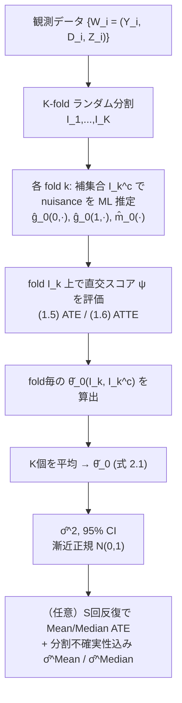

# Double/Debiased/Neyman Machine Learning of Treatment Effects

> 機械学習でnuisanceを推定しても、因果効果（ATE/ATTE）の推論を漸近的に妥当に保つための「Neyman直交スコア × cross-fitting」フレームワークを、AERのproceedings論文として簡潔に提示した一篇。

---

## メタ情報

| 項目 | 内容 |
|------|------|
| タイトル | Double/Debiased/Neyman Machine Learning of Treatment Effects |
| 著者 | Victor Chernozhukov, Denis Chetverikov, Mert Demirer, Esther Duflo, Christian Hansen, Whitney Newey |
| 年 | 2017（working version: January 2017） |
| 掲載 | American Economic Review 2017 (May), Papers & Proceedings |
| 種別 | 会議版（フルバージョン: Chernozhukov et al. 2016, *Econometrics Journal* 2018） |
| arXiv | [1701.08687](https://arxiv.org/abs/1701.08687) |
| キーワード | Neyman machine learning, orthogonalization, cross-fitting, orthogonal/efficient score, post-regularization inference, semiparametric efficiency |
| 対象推定量 | ATE（平均処置効果）, ATTE（処置群における平均処置効果） |

---

## Abstract（原文・英語）

> Chernozhukov, Chetverikov, Demirer, Duflo, Hansen, and Newey (2016) provide a generic double/debiased machine learning (DML) approach for obtaining valid inferential statements about focal parameters, using Neyman-orthogonal scores and cross-fitting, in settings where nuisance parameters are estimated using a new generation of nonparametric fitting methods for high-dimensional data, called machine learning methods. In this note, we illustrate the application of this method in the context of estimating average treatment effects (ATE) and average treatment effects on the treated (ATTE) using observational data. A more general discussion and references to the existing literature are available in Chernozhukov, Chetverikov, Demirer, Duflo, Hansen, and Newey (2016).

## Abstract（日本語訳）

> Chernozhukov et al. (2016) は、nuisanceパラメータを高次元データ向けの新世代ノンパラメトリック手法（＝機械学習）で推定する状況において、関心パラメータについて妥当な推論を得るための汎用的な「double/debiased machine learning (DML)」手法を提示した。これはNeyman直交スコアとcross-fittingを用いる。本ノートでは、観測データから平均処置効果（ATE）および処置群における平均処置効果（ATTE）を推定する文脈で、その手法の応用を例示する。より一般的な議論と既存文献への参照は Chernozhukov et al. (2016) を参照されたい。

---

## Overview

本論文は、機械学習（ML）で柔軟に推定したnuisance（傾向スコア・条件付き期待値）を因果効果推定に組み込むと素朴には正則化バイアス（regularization bias）と過適合バイアス（overfitting bias）が混入する、という問題に対し、次の2本柱で対処する：

- **Neyman直交性（double / debiasing その1）**: nuisanceの一次摂動に対してモーメント条件が不感（insensitive）になるスコアを使い、正則化・モデリングバイアスを除去する。
- **Cross-fitting（double / debiasing その2）**: nuisanceの推定標本と効果推定標本を分割し、過適合バイアスを排除する。

この2つの「debiasing」を併せることで、$\sqrt{N}$ 一致・漸近正規・かつHahn (1998) の半パラメトリック効率限界を達成する推定量が得られる。

---

## Problem（問題設定）

Rosenbaum–Rubin (1983) の **unconfoundedness（条件付き独立）** の下で、二値処置 $D\in\{0,1\}$、結果 $Y$、共変量 $Z$ を次のようにモデル化する。

```math
Y = g_0(D, Z) + \zeta, \qquad \mathbb{E}[\zeta \mid Z, D] = 0 \tag{1.1}
```
```math
D = m_0(Z) + \nu, \qquad \mathbb{E}[\nu \mid Z] = 0 \tag{1.2}
```

$D$ が加法分離されていないため、処置効果の**完全な異質性**を許容する。関心パラメータ：

```math
\text{ATE: } \quad \theta_0 = \mathbb{E}[\,g_0(1,Z) - g_0(0,Z)\,]
```
```math
\text{ATTE: } \quad \theta_0 = \mathbb{E}[\,g_0(1,Z) - g_0(0,Z) \mid D=1\,]
```

ここで **nuisance**：
- 傾向スコア（propensity score）: $m_0(Z) := \mathbb{E}[D\mid Z]$
- 結果回帰（outcome regression）: $g_0(D,Z) := \mathbb{E}[Y\mid D, Z]$

いずれも未知かつ複雑であり得るため、MLで推定する。

### 素朴なplug-inが失敗する理由

MLの推定量 $\hat\eta_0$ を推定方程式へそのまま代入すると、(i) 正則化（ペナルティ）による収束の遅延＝**正則化バイアス**、(ii) 同一標本でnuisanceとθを推定することによる**過適合バイアス**、の双方が一次の項として残り、$\sqrt{N}$ レートでの正規近似が崩れる。

---

## Proposed Method（提案手法）

### スコアに課す2条件

スコア $\psi(W;\theta,\eta)$（$W=(Y,D,Z)$）に以下を要求する。

```math
\text{識別条件:} \quad \mathbb{E}\,\psi(W;\theta_0,\eta_0) = 0 \tag{1.3}
```
```math
\text{Neyman直交性:} \quad \partial_\eta\, \mathbb{E}\,\psi(W;\theta_0,\eta)\big|_{\eta=\eta_0} = 0 \tag{1.4}
```

(1.4) はGateaux微分が0、すなわち真値 $\eta_0$ の近傍でnuisanceを少し誤ってもモーメントの期待値が一次では動かないことを意味する。これがNeyman (1959) に遡る「直交化」で、ML由来の $\hat\eta_0$ で置き換えても高品質な推論が可能になる鍵である。

### ATE用の直交（efficient）スコア

Robins–Rotnitzky (1995)・Hahn (1998) の二重頑健／効率スコア（自動的にNeyman直交）を採用する。

```math
\psi(W;\theta,\eta) := \big(g(1,Z) - g(0,Z)\big)
+ \frac{D\,(Y - g(1,Z))}{m(Z)}
- \frac{(1-D)\,(Y - g(0,Z))}{1 - m(Z)} - \theta \tag{1.5}
```
nuisance: $\eta(Z) = (g(0,Z),\, g(1,Z),\, m(Z))$、真値 $\eta_0(Z) = (g_0(0,Z),\, g_0(1,Z),\, m_0(Z))$。
台 $Z \mapsto \mathbb{R}\times\mathbb{R}\times(\varepsilon, 1-\varepsilon)$（$\varepsilon>0$ はoverlap定数）。

### ATTE用の直交スコア

```math
\psi(W;\theta,\eta) = \frac{D\,(Y - g(0,Z))}{m}
- \frac{m(Z)\,(1-D)\,(Y - g(0,Z))}{(1 - m(Z))\,m}
- \theta\,\frac{D}{m} \tag{1.6}
```
nuisance: $\eta(Z) = (g(0,Z),\, g(1,Z),\, m(Z),\, m)$、真値 $\eta_0(Z) = (g_0(0,Z),\, g_0(1,Z),\, m_0(Z),\, \mathbb{E}[D])$。ここで $m \in (\varepsilon, 1-\varepsilon)$ は処置割合 $\mathbb{E}[D]$ に対応するスカラ。

> 注: すべての半パラメトリック効率スコアは直交性 (1.4) を満たすが、直交スコアがすべて効率的とは限らない。頑健性のため敢えて非効率な直交スコアを用いる選択もあり得る。

---

## Key Formulas（核心の数式）

### AIPW型直交スコア（ATE, 再掲）

```math
\psi(W;\theta,\eta) = \underbrace{g(1,Z) - g(0,Z)}_{\text{回帰調整（DR項）}}
+ \underbrace{\frac{D}{m(Z)}\big(Y - g(1,Z)\big)}_{\text{処置側 IPW 補正}}
- \underbrace{\frac{1-D}{1 - m(Z)}\big(Y - g(0,Z)\big)}_{\text{対照側 IPW 補正}}
- \theta
```

これは **Augmented IPW (AIPW)** 形そのもの。問題文の表記に整合させると、$\mu_1=g(1,Z)$, $\mu_0=g(0,Z)$, $e=m(Z)$, $W=D$ として：

```math
\psi = \mu_1 - \mu_0 + \frac{W(Y-\mu_1)}{e} - \frac{(1-W)(Y-\mu_0)}{1-e} - \theta
```

**二重頑健性**: $g$（結果回帰）か $m$（傾向スコア）の**どちらか一方**が正しければ $\mathbb{E}\psi=0$ が成立。

### 点推定・標準誤差・信頼区間

```math
\check\theta_0 = \frac{1}{K}\sum_{k=1}^{K} \check\theta_0(I_k, I_k^c) \tag{2.1}
```
```math
\hat\sigma^2 = \frac{1}{N}\sum_{i=1}^{N} \hat\psi_i^2,
\qquad \hat\psi_i := \psi\big(W_i; \check\theta_0, \hat\eta_0(I_{k(i)}^c)\big)
```
```math
\mathrm{CI}_n := \Big[\, \check\theta_0 \pm \Phi^{-1}(1-\alpha/2)\,\hat\sigma/\sqrt{N} \,\Big]
```

### 漸近分布（Theorem 2.1）

```math
\sigma^{-1}\sqrt{N}\,(\check\theta_0 - \theta_0) \rightsquigarrow N(0, 1),
\qquad \sigma^2 = \mathbb{E}_P\big[\psi^2(W;\theta_0,\eta_0(Z))\big]
```
信頼区間は $P$ について一様に妥当：$\sup_{P\in\mathcal{P}} |P(\theta_0\in\mathrm{CI}_n) - (1-\alpha)| \to 0$。

---

## Algorithm（疑似コード）

K-fold cross-fitting による直交スコア推定。

```text
入力: 標本 {W_i}_{i=1}^N,  fold数 K,  スコア ψ（ATEなら(1.5), ATTEなら(1.6)）

Step 1. {1,...,N} を等サイズ n=N/K の K 分割 (I_1, ..., I_K) に無作為分割。
        I_k^c := I_k に属さない全インデックス（補集合）。

Step 2. for k = 1,...,K:
          # 補集合 I_k^c のみで nuisance を ML 推定（過適合バイアス回避）
          η̂_0(I_k^c) = ( ĝ_0(0,Z; I_k^c),
                          ĝ_0(1,Z; I_k^c),
                          m̂_0(Z; I_k^c),
                          (1/(N-n)) Σ_{i∈I_k^c} D_i )      # ATTE の m に対応
          # fold I_k 上で直交モーメントの根として θ を解く
          θ̌_0(I_k, I_k^c) ← solve_θ  of
              (1/n) Σ_{i∈I_k} ψ( W_i; θ, η̂_0(I_k^c) ) = 0

Step 3. 集約:  θ̌_0 = (1/K) Σ_{k=1}^K θ̌_0(I_k, I_k^c)
        分散:  σ̂^2 = (1/N) Σ_{i=1}^N ψ_i^2,   ψ_i は対応 fold の η̂ で評価
        CI:    θ̌_0 ± Φ^{-1}(1-α/2) · σ̂/√N

（任意）分割不確実性の補正:
        分割を S 回繰り返し θ̌_0^s を得て, 平均 θ̄^Mean または中央値 θ̄^Median を報告。
```

線形スコア（ATE）の場合、Step 2のθは陽に $\check\theta_0 = (1/n)\sum_{i\in I_k}[\,\cdots\,]$ で解ける（AIPWの標本平均）。

---

## Architecture（処理フロー）



**「double debiasing」の二層構造**：

```text
         ┌─────────────────────────────┐
         │  正則化・モデリングバイアス  │
debias 1 │  → Neyman 直交性 (1.4)       │  nuisance 一次摂動に不感
         └─────────────────────────────┘
         ┌─────────────────────────────┐
         │  過適合バイアス              │
debias 2 │  → Cross-fitting（標本分割） │  nuisance推定とθ推定を分離
         └─────────────────────────────┘
```

---

## Figures & Tables

### 図1: nuisance推定レートと識別可能性（Comment 2.1 の要旨）

```text
g_0 のスパース度 s^g, m_0 のスパース度 s^m（ℓ1正則化想定）のとき、
DML が要求するレート条件:

   √(s^g/n) · √(s^m/n) ≪ n^{-1/2}   ⇔   s^g · s^m ≪ √n        ← cross-fitting あり

   対比（標本分割なし）:  (s^g)^2 + (s^m)^2 ≪ n                  ← より厳しい

帰結: 一方（例: 傾向スコア m_0）が密でも、他方（回帰 g_0）が十分スパースなら可。
      m_0 が既知（s^m = 0）なら ĝ_0 は一致性のみで足りる（直交性の威力）。
```

### 表1: 2つの直交スコアの構造比較

| 項目 | ATE (1.5) | ATTE (1.6) |
|------|-----------|------------|
| 推定対象 | $\mathbb{E}[g_0(1,Z)-g_0(0,Z)]$ | $\mathbb{E}[g_0(1,Z)-g_0(0,Z)\mid D=1]$ |
| 回帰調整項 | $g(1,Z)-g(0,Z)$ | $D(Y-g(0,Z))/m$ |
| 傾向スコア重み | $D/m(Z)$, $(1-D)/(1-m(Z))$ | $m(Z)(1-D)/((1-m(Z))m)$ |
| nuisance数 | 3 | 4（スカラ $m=\mathbb{E}[D]$ 追加） |
| 直交性 | ○ (Neyman) | ○ (Neyman) |
| 効率性 | Hahn (1998) 限界達成 | Hahn (1998) 限界達成 |

### 表2: 実証例の設定（Appendix A）

| 例 | データ | 処置 $D$ | 結果 $Y$ | 設計 | nuisance推定法 |
|----|--------|---------|----------|------|----------------|
| 401(k) eligibility | 1991 SIPP（Chernozhukov–Hansen 2004 と同じ） | 401(k)加入資格 | 純金融資産 | 観測研究（unconfoundedness） | Lasso(275変数), Reg.Tree, Random Forest(>1000本), Boosting, Neural Net(8層, decay 0.01), Ensemble, Best |
| Pennsylvania Reemployment Bonus | 1980s 米労働省RCT | 処置4（高額・長期, Bilias 2000で群4,6統合） | 失業期間のlog | RCT | 上に同じ（NNは2層, decay 0.02; Lassoは96変数） |

### 表3: 401(k)実証の主要な数値（本文に明記された値）

| 指標 | 値 | 出典の記述 |
|------|-----|-----------|
| 共変量なしの素朴ATE | **$19,559**（SE **1,413**） | "estimated ATE ... is $19,559 (not reported) with an estimated standard error of 1413 when no control variables are used" |
| 共変量調整後ATE（Table 1） | 上記より**大幅に減衰**（confounding考慮で小さい因果効果） | 数値はTable 1（本文に表本体は非掲載） |
| 傾向スコアtrim | [0.01, 0.99] | 極端な重みの影響低減のため |
| cross-fitting | 2-fold と 5-fold の双方を報告 | 5-foldの方がSEが概ね小さい |

> 注: Table 1〜4 の各MLメソッド別 ATE 点推定値・SEの数表本体は、本会議版PDF本文テキストには数値として現れていない（表として配置）。確定値として引用できるのは上記の「無調整 ATE = $19,559 (SE 1413)」のみである。残りは原論文 Table 1–4 を直接参照のこと（数値捏造を避けるため未記載）。

---

## Experiments & Evaluation（実証と評価）

### 401(k) eligibility → 純金融資産

- 無調整ATEは **$19,559（SE 1,413）** だが、これは交絡（income等）を無視しており因果効果としては妥当でない。
- 柔軟なML（Lasso/RF/Boosting/NN/Ensemble/Best）で交絡調整すると、ATEは **大幅に減衰** し、より小さい因果効果を示唆。
- **メソッド横断で結果が概ね一致**：直交推定方程式＋まともなnuisance推定なら結果は近いという理論的含意と整合。Poterba–Venti–Wise (1994) の直感的な関数形とも整合。
- **fold数の効果**：5-foldは2-foldよりSEが概して小さい（補助標本のサンプル増→nuisanceをより精密に学習）。ただし一般法則ではないと注記。
- **Lassoの特徴**：他法よりSEが大きめ。線形モデルの外挿（extrapolation）による予測誤差増が原因と推察。5-foldで改善する点も外挿仮説と整合。
- Mean ATEとMedian ATEがほぼ一致（Table 2）→ 分割による分布はほぼ対称・薄い裾。

### Pennsylvania Reemployment Bonus → 失業期間

- ATEは全メソッドで**負かつ有意**（5%水準。例外: interactiveモデル×random forestは10%水準）。
- 標本分割由来の変動を含めてもなお結論は不変。Mean/Median ATEもメソッド間で概ね類似。

### 評価指標まとめ

| 観点 | 結果 |
|------|------|
| メソッド依存性 | 低い（直交化の効果で結論は安定） |
| 分割依存性 | 低い（Mean ≈ Median） |
| fold数 | 5-fold > 2-fold（SE面で有利な傾向） |
| 推論の妥当性 | $\sqrt{N}$ 一致・漸近正規・効率限界達成（Theorem 2.1） |

---

## Notes（因果効果推定の精度向上の観点）

- **Neyman直交性こそが精度（妥当性）の要**：(1.4) により、ML由来 $\hat\eta_0$ の一次誤差がθのモーメントに伝播しない。結果、nuisanceの収束が $n^{-1/4}$ 程度（$\sqrt{s^g/n}\cdot\sqrt{s^m/n}\ll n^{-1/2}$）でもθは $\sqrt{N}$ レートを保つ。これはplug-inに必要な $(s^g)^2+(s^m)^2\ll n$ より大幅に緩い。

- **Cross-fittingが過適合バイアスを除去**：同一標本でのnuisance学習＋θ推定を避けることで、Donsker条件など強い複雑性制約なしに高次元ML（RF/Boosting/NN）を安全に使える。これがDMLの実用上の核心。

- **二重頑健性 = 追加的な保険**：AIPWスコアは $g$ か $m$ のどちらかが正しければ整合。直交性と相まって、モデル誤設定への耐性を高める。

- **overlap（共通サポート）が前提**：$m(Z)\in(\varepsilon,1-\varepsilon)$ が必要。実証ではpropensityを [0.01, 0.99] にトリムして極端な逆確率重みの分散爆発を抑制。精度向上の実務的ポイント。

- **fold数と外挿のトレードオフ**：5-foldは補助標本を大きくしnuisanceを精密化、主標本の外挿（特にLassoのような線形モデル）を減らしてSEを下げる傾向。ただし「fold数とθ精度の一般的関係はない」と著者は留保。

- **分割不確実性の取り込み**：単一分割への依存を避け、S回反復して Mean/Median と $\hat\sigma^{\mathrm{Mean}}/\hat\sigma^{\mathrm{Median}}$ を報告すると、より保守的かつ頑健な推論になる。Medianは外れ値に強い。

- **効率性の到達点**：採用したスコアは効率スコアなので、ATE/ATTE推定量は Hahn (1998) の半パラメトリック効率限界を達成。これ以上分散を下げられない理論的下界に到達している点が精度面の最終的な強み。

- **関連性**：本会議版は Chernozhukov et al. (2018, *Econometrics Journal*) のフル版の縮約。partially linear / interactive を含む一般のNeyman直交モーメント＋cross-fittingの特殊ケースとしてATE/ATTEを位置づけている。
