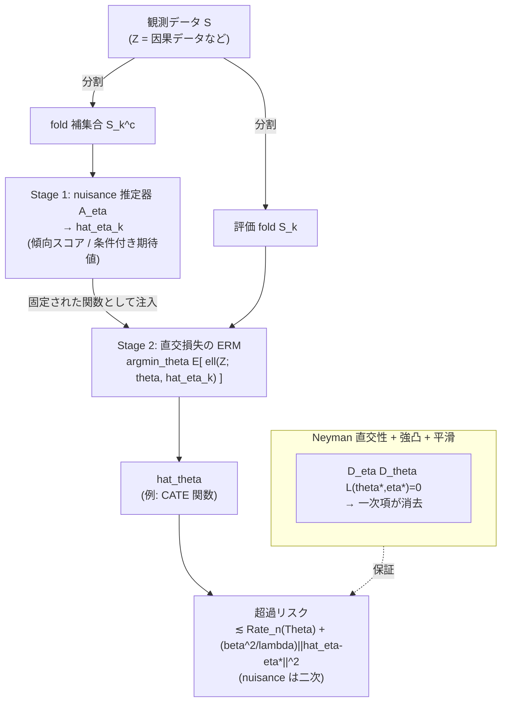

# Orthogonal Statistical Learning

> CATE 推定精度向上の理論的基盤。nuisance（撹乱）パラメータの推定誤差が、ターゲットパラメータの**超過リスク（excess risk）に二次の影響しか与えない**ことを、Neyman 直交性を一般化した枠組みで非漸近的に保証する論文。

---

## メタ情報

| 項目 | 内容 |
|------|------|
| タイトル | Orthogonal Statistical Learning |
| 著者 | Dylan J. Foster (Microsoft Research, New England), Vasilis Syrgkanis (Stanford University) |
| 初出 | COLT 2019（Conference on Learning Theory）※ Best Paper / Best Student Paper 受賞 |
| 雑誌版 | The Annals of Statistics, Vol. 51, No. 3, pp. 879–908 (June 2023), DOI: 10.1214/23-AOS2258 |
| arXiv | [1901.09036](https://arxiv.org/abs/1901.09036)（v1: 2019-01-25, 最終改訂: 2023-06-06） |
| 分野 | 統計的学習理論 / 因果推論 / セミパラメトリック統計 |
| キーワード | Neyman orthogonality, excess risk, nuisance parameter, sample splitting, oracle inequality, CATE |
| 関連クラスタ | cate / orthogonal_nuisance |

---

## Abstract（原文・英語）

> We provide non-asymptotic excess risk guarantees for statistical learning in a setting where the population risk with respect to which we evaluate the target parameter depends on an unknown nuisance parameter that must be estimated from data. We analyze a two-stage sample splitting meta-algorithm that takes as input arbitrary estimation algorithms for the target parameter and nuisance parameter. We show that if the population risk satisfies a condition called Neyman orthogonality, the impact of the nuisance estimation error on the excess risk bound achieved by the meta-algorithm is of second order. Our theorem is agnostic to the particular algorithms used for the target and nuisance and only makes an assumption on their individual performance. This enables the use of a plethora of existing results from machine learning to give new guarantees for learning with a nuisance component. Moreover, by focusing on excess risk rather than parameter estimation, we can provide rates under weaker assumptions than in previous works and accommodate settings in which the target parameter belongs to a complex nonparametric class. We provide conditions on the metric entropy of the nuisance and target classes such that oracle rates of the same order as if we knew the nuisance parameter are achieved.

---

## Abstract（日本語訳）

> ターゲットパラメータを評価する母集団リスクが、データから推定しなければならない未知の nuisance（撹乱）パラメータに依存する設定において、統計的学習に対する**非漸近的な超過リスク保証**を与える。本論文では、ターゲットパラメータと nuisance パラメータの推定アルゴリズムを任意に入力として受け取る、**二段階のサンプル分割メタアルゴリズム**を解析する。母集団リスクが **Neyman 直交性（Neyman orthogonality）** と呼ばれる条件を満たすならば、メタアルゴリズムが達成する超過リスク限界に対する nuisance 推定誤差の影響が**二次（second order）**であることを示す。本定理はターゲット・nuisance に用いる個別のアルゴリズムに依存せず、それぞれの個別性能にのみ仮定を置く。これにより、機械学習の既存の多数の結果を流用して、nuisance 成分を伴う学習に対する新たな保証を導出できる。さらに、パラメータ推定ではなく超過リスクに着目することで、従来研究より弱い仮定の下でレートを与え、ターゲットパラメータが複雑なノンパラメトリッククラスに属する設定にも対応できる。nuisance クラスとターゲットクラスのメトリックエントロピーに関する条件の下で、**nuisance を既知としたとき（oracle）と同じオーダーのレート**が達成されることを示す。

---

## Overview（概要）

本論文は、因果推論の **double/debiased machine learning（DML, Chernozhukov et al. 2018）** が依拠していた「Neyman 直交性 → nuisance 誤差の二次影響」という原理を、**有限次元パラメータの漸近正規性**という枠を超えて、**任意の（ノンパラメトリックを含む）ターゲットクラスに対する超過リスク**という一般的な学習理論の言語に持ち上げたものである。

中心的な貢献は次の 3 点である。

1. **メタアルゴリズム化**: ターゲット・nuisance それぞれの推定器を「ブラックボックス」として受け取り、各々の性能（推定レート）だけを仮定する。具体的アルゴリズムに非依存。
2. **二次影響の一般化**: Neyman 直交性に加えて高次の正則性（リプシッツ性・強凸性）を課すことで、nuisance 誤差 $\|\hat\eta-\eta^*\|$ が超過リスクへ「自乗で」効くことを非漸近的に証明。
3. **オラクルレート**: nuisance クラスとターゲットクラスの metric entropy に条件を置けば、「nuisance を真値で知っているのと同じオーダー」の超過リスクが得られる。

CATE 推定の観点では、傾向スコアや条件付き期待値（nuisance）の収束が遅い ML 推定器であっても、最終的な処置効果関数（target）の精度は二次のオーダーでしか劣化しないことを保証する。これが「遅い nuisance × 遅い target でも合わせて高速なレート」を成立させる理論的核心である。

---

## Problem（問題設定）

観測 $Z\sim D$ に対し、母集団リスク（population risk）が**ターゲットパラメータ** $\theta\in\Theta$ と **nuisance パラメータ** $\eta\in\mathcal{H}$ の双方に依存するとする。

$$
L_D(\theta,\eta) \;=\; \mathbb{E}_{Z\sim D}\!\left[\,\ell(Z;\theta,\eta)\,\right].
$$

真の値は

$$
\theta^* \;=\; \arg\min_{\theta\in\Theta} L_D(\theta,\eta^*),
\qquad \eta^* = \text{（真の nuisance）}.
$$

我々が最終的に評価したいのは**超過リスク（excess risk）**：

$$
\text{ExcessRisk}(\hat\theta)\;=\;L_D(\hat\theta,\eta^*)-L_D(\theta^*,\eta^*).
$$

困難の本質は、$\eta^*$ が未知でデータから推定する必要があり、推定値 $\hat\eta\neq\eta^*$ の誤差が $\hat\theta$ の評価へ**バイアスとして混入する**点である。素朴に plug-in すると、nuisance 誤差が**一次（first order）**で超過リスクに伝播し、$\hat\eta$ の遅い収束レートがそのままターゲット側のレートを律速してしまう。

| 課題 | 素朴な plug-in | 本論文（直交化） |
|------|----------------|------------------|
| nuisance 誤差の伝播次数 | 一次 $O(\|\hat\eta-\eta^*\|)$ | 二次 $O(\|\hat\eta-\eta^*\|^2)$ |
| target クラス | 主に有限次元 | ノンパラOK |
| 必要なレート（合成） | $\|\hat\eta-\eta^*\|=o(n^{-1/2})$ 級が必要 | $n^{-1/4}\times n^{-1/4}$ で足りる |
| 評価対象 | パラメータ推定誤差中心 | 超過リスク中心（仮定が弱い） |

---

## Proposed Method（提案手法）

### 1. 二段階サンプル分割メタアルゴリズム

データを 2 つ（または交差分割で複数）の独立な部分標本に分け、

- **Stage 1（nuisance 推定）**: 第 1 標本で任意の ML アルゴリズムを用いて $\hat\eta$ を推定。
- **Stage 2（target 推定）**: 第 2 標本上で、$\hat\eta$ を固定した経験リスク最小化により $\hat\theta$ を推定。

$$
\hat\theta \;=\; \arg\min_{\theta\in\Theta}\; \frac{1}{|S_2|}\sum_{i\in S_2}\ell(Z_i;\theta,\hat\eta).
$$

サンプル分割により、Stage 2 では $\hat\eta$ を「独立な固定関数」として扱えるため、過学習由来の依存性を排除できる（cross-fitting でデータ効率を回復）。

### 2. Neyman 直交性（の一般化）

DML の有限次元スコアに対する直交性を、**汎関数（リスク）の方向微分**の言葉に一般化する。母集団リスクのターゲット方向の勾配が、真の点で nuisance 方向の摂動に対して不感であることを要求する（後述 Key Formulas）。本論文ではさらに、任意の摂動方向で成り立つ **universal orthogonality** と、それを保証するための高次正則性条件を導入する。

### 3. 超過リスク限界（二次項）

直交性 + 強凸性 + 平滑性の下で、超過リスクは「**target の統計誤差**」＋「**nuisance 誤差の二乗**」に分解される。後者が二次項であることが本論文の核心（後述 Theorem）。

---

## Key Formulas（重要な数式）

### (A) ターゲット方向の勾配（一階条件）

$\theta^*$ は $L_D(\cdot,\eta^*)$ の最小点なので、

$$
D_\theta L_D(\theta^*,\eta^*)[\theta-\theta^*] \;=\; 0
\qquad \forall\,\theta\in\Theta .
$$

### (B) Neyman 直交性（nuisance 方向の一次感度がゼロ）

**定義（Neyman / 直交性）**: 母集団リスク $L_D$ が真値 $(\theta^*,\eta^*)$ において Neyman 直交であるとは、ターゲット方向の勾配の **nuisance 方向の交差微分（Gateaux 微分）**が消えること：

$$
\boxed{\;D_\eta\,D_\theta\,L_D(\theta^*,\eta^*)\,[\,\theta-\theta^*,\;\eta-\eta^*\,] \;=\; 0
\qquad \forall\,\theta\in\Theta,\ \eta\in\mathcal{H}.\;}
$$

スコア／モーメント表現 $\psi(Z;\theta,\eta)=D_\theta\ell$ を用いると、同値な条件は

$$
\left.\frac{d}{dt}\,\mathbb{E}\big[\psi\big(Z;\theta^*,\;\eta^*+t(\eta-\eta^*)\big)\big]\right|_{t=0}\;=\;0 .
$$

すなわち真の点まわりで **nuisance を一次摂動しても、ターゲットの一階条件は揺らがない**。

### (C) Universal orthogonality（任意点での直交性）

真値だけでなく $(\theta,\eta)$ 一般で交差微分が消える、より強い条件。これにより誤差展開の一次項が**全域で**消去できる。

### (D) 超過リスクの二次項限界（主結果の形）

直交性・$\lambda$-強凸性・$\beta$-平滑性（高次リプシッツ）の下で、メタアルゴリズムの超過リスクは概略

$$
\boxed{\;
L_D(\hat\theta,\eta^*)-L_D(\theta^*,\eta^*)
\;\lesssim\;
\underbrace{\mathrm{Rate}_n(\Theta)}_{\text{target 統計誤差}}
\;+\;
\underbrace{\frac{\beta^2}{\lambda}\,\big\|\hat\eta-\eta^*\big\|^2}_{\text{nuisance の \textbf{二次} 項}}.
\;}
$$

第 2 項が $\|\hat\eta-\eta^*\|$ の**二乗**で入るため、nuisance 推定が $o(n^{-1/4})$ で収束すれば、その寄与は target レートに対して無視できる。**これが「nuisance 誤差は超過リスクに二次の影響しか与えない」という命題の定量形**である。

### (E) 例：部分線形回帰の直交スコア

$$
Y=\theta X + g_0(W)+\varepsilon,\qquad
\psi=\big(Y-\theta X-\hat g(W)\big)\big(X-\hat\ell(W)\big),\quad \ell_0(W)=\mathbb{E}[X\mid W].
$$

$\hat g,\hat\ell$ がともに nuisance。両者の誤差の**積**でバイアスが入るため二次。

---

## Algorithm（疑似コード）

```text
Input : データ S, ターゲット推定器 A_theta, nuisance 推定器 A_eta,
        分割数 K（cross-fitting）
Output: 直交化されたターゲット推定 hat_theta

1: S を K 個の互いに素な fold {S_1,...,S_K} に分割
2: for k = 1..K do
3:     S_k^c <- S \ S_k                       # 補集合
4:     hat_eta_k <- A_eta(S_k^c)              # Stage 1: nuisance を補集合で推定
5: end for
6: # Stage 2: 各サンプルに対し「自分が属さない fold で学習した nuisance」を用いる
7: hat_theta <- argmin_{theta in Theta}
8:        (1/n) * sum_{k=1..K} sum_{i in S_k}  ell( Z_i ; theta, hat_eta_k )
9: return hat_theta

# 鍵: ell が真値で Neyman 直交（D_eta D_theta L = 0）であること。
#     これにより hat_eta_k の一次誤差が一階条件に伝播しない。
```

---

## Architecture（構造図）



ASCII 補助図（誤差伝播の次数）：

```
 plug-in (非直交):   ExcessRisk  ──一次──▶  ||hat_eta - eta*||        ← nuisance が律速
 orthogonal:         ExcessRisk  ──二次──▶  ||hat_eta - eta*||^2      ← 二乗で減衰し無視可
                          ▲
                          └ Neyman 直交性が一次項を打ち消す
```

---

## Figures & Tables（図表）

### 表1. 主要な定理・条件の要約

| 要素 | 条件 / 内容 | 役割 |
|------|-------------|------|
| Neyman 直交性 | $D_\eta D_\theta L(\theta^*,\eta^*)[\cdot,\cdot]=0$ | 誤差展開の一次項を消去 |
| Universal orthogonality | 全域で交差微分が消える | 一次項を真値以外でも消去（より強い保証） |
| 強凸性 | $L_D(\cdot,\eta^*)$ が $\lambda$-強凸 | 一階条件 → 超過リスクへ変換、bound の分母 $\lambda$ |
| 高次平滑性 | 勾配が $(\theta,\eta)$ にリプシッツ（$\beta$） | 二次の剰余項を制御 |
| サンプル分割 / cross-fitting | $\hat\eta$ と評価標本を独立化 | empirical process の依存性除去 |
| メトリックエントロピー条件 | nuisance・target クラスの複雑性制御 | オラクルレート達成 |

### 表2. 適用例と nuisance / target の対応

| 応用例 | ターゲット $\theta$ | nuisance $\eta$ | 直交化のポイント |
|--------|---------------------|-----------------|------------------|
| 部分線形回帰 | 係数 $\theta$ | $g_0(W)=\mathbb{E}[Y\mid W]$, $\ell_0(W)=\mathbb{E}[X\mid W]$ | 残差化（Robinson 変換）でスコア直交化 |
| CATE / 異質処置効果 | $\tau(x)=\mathbb{E}[Y(1)-Y(0)\mid X=x]$ | 傾向スコア $e(X)$, 結果回帰 $\mu_t(X)$ | 二重頑健スコア（AIPW 型） |
| 方策最適化（off-policy） | 方策 $\pi$ | 価値関数 / 傾向スコア | 直交化された価値推定 |
| 欠測データ学習 | 予測モデル | 欠測メカニズム | 直交モーメントで欠測誤差を二次化 |

### 表3. plug-in と直交化メタアルゴリズムの定量比較

| 指標 | 素朴 plug-in | 直交メタアルゴリズム |
|------|--------------|----------------------|
| nuisance 誤差の超過リスクへの寄与 | $O(\|\hat\eta-\eta^*\|)$ | $O(\|\hat\eta-\eta^*\|^2)$ |
| nuisance に要求する収束 | 速い（$o(n^{-1/2})$ 級） | 緩い（$o(n^{-1/4})$ で十分） |
| target クラスの自由度 | 限定的 | ノンパラ可（entropy 条件下でオラクル） |
| アルゴリズム依存性 | 強い | 非依存（ブラックボックス入力） |

### 図. nuisance 誤差レートと超過リスク寄与の関係（概念）

```
超過リスクへの nuisance 寄与
  ^
  |  *  plug-in（直線・一次）
  |    *
  |      *
  |        *
  |  o        *
  |    o          *
  |        o              *
  |              o                  *   ← 直交（二次・放物的に減衰）
  +-------------------------------------> ||hat_eta - eta*||
   小                                  大
```

---

## Experiments & Evaluation（理論的保証の要約）

本論文は理論論文であり、実験ではなく**非漸近的オラクル不等式**として保証を与える。

- **主結果**: Neyman 直交性 + 強凸性 + 高次平滑性の下で、二段階メタアルゴリズムの超過リスクは「target の統計誤差」＋「nuisance 誤差の二乗オーダー項」で上から押さえられる（Key Formulas (D)）。
- **オラクル性**: nuisance クラスと target クラスの metric entropy に条件を課すと、超過リスクは **nuisance を真に知っている場合（oracle）と同オーダー**。すなわち nuisance 推定の不確実性が漸近的に無償化される。
- **アルゴリズム非依存性**: ターゲット・nuisance 各推定器の個別性能（収束レート）のみを仮定。任意の ML 推定器（forest, neural net, lasso 等）を差し込んで保証を継承できる。
- **従来比の弱仮定化**: パラメータ推定誤差ではなく超過リスクを直接評価することで、識別可能性や一意性に関する強い仮定を回避し、複雑なノンパラ target に適用範囲を拡大。

---

## Notes（CATE 精度向上の理論的基盤としての位置づけ）

- **DML の学習理論版**: 本論文は Chernozhukov et al. (2018) の DML が示した「直交スコア → nuisance バイアスの二次化」を、**有限次元 + 漸近正規性**から **任意 target クラス + 有限標本超過リスク**へ拡張した。CATE 推定では target そのものが関数（ノンパラ）であるため、この一般化が本質的に効く。
- **R-learner / DR-learner の上流理論**: Robinson 残差化に基づく R-learner や、AIPW（二重頑健）スコアに基づく DR-learner といった CATE メタ学習器は、本論文の「直交損失上の Stage 2 ERM」の具体例として整理できる。傾向スコア $\hat e$ と結果回帰 $\hat\mu$ がともに遅くても、両者の誤差の**積**でしかバイアスが入らない（rate double robustness）ことが、本枠組みの二次項 (D) として説明される。
- **実務的含意**: 「$n^{-1/4}\times n^{-1/4}=n^{-1/2}$」という合成レートにより、複雑な nuisance を強力だが収束の遅い ML で推定しても、最終的な CATE 関数の精度を損なわない設計指針が得られる。これは本リサーチ（cate / orthogonal_nuisance クラスタ）における精度向上戦略の理論的支柱である。
- **留意点**: 保証の前提として (i) Neyman 直交損失の設計、(ii) 強凸性・高次平滑性、(iii) サンプル分割（cross-fitting）が必要。損失が直交でない／強凸でない場合は二次化が崩れるため、損失設計そのものが精度向上の鍵となる。
- **後続研究**: 自己整合損失（self-concordant loss）への拡張（[arXiv:2205.00350](https://arxiv.org/abs/2205.00350)）など、強凸性条件を緩和・精緻化する流れが派生している。

---

### 参考

- Foster, D. J., Syrgkanis, V. "Orthogonal Statistical Learning." *Annals of Statistics* 51(3), 2023. arXiv:1901.09036.
- COLT 2019 版: "Statistical Learning with a Nuisance Component," PMLR v99.
- 関連: Chernozhukov et al. (2018) Double/Debiased Machine Learning（直交性・cross-fitting の起点）。
