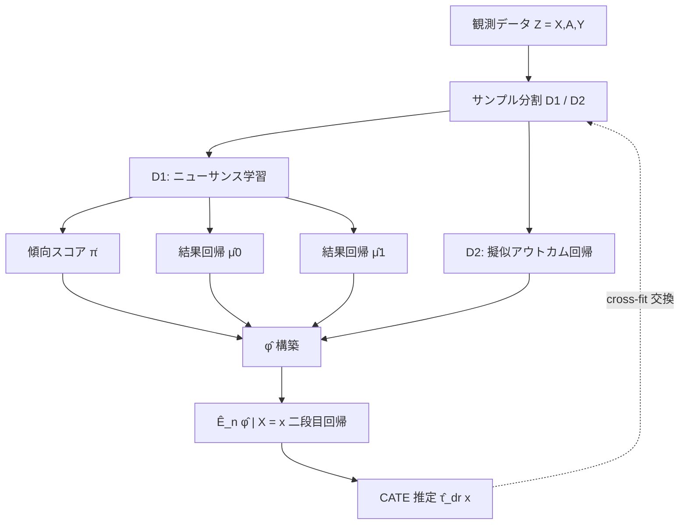

# DR-Learner: 二重頑健な CATE 推定の最適化に向けて

> **対象観点**: CATE 推定の精度向上 — DR-learner の二重頑健性（double robustness）と oracle 効率（oracle efficiency）。
> 直交化された擬似アウトカム(pseudo-outcome) φ を介して、ニューサンス推定誤差を「積」へ押し込む二段階回帰の理論を詳説する。

---

## メタ情報

| 項目 | 内容 |
|------|------|
| タイトル | Towards Optimal Doubly Robust Estimation of Heterogeneous Causal Effects |
| 著者 | Edward H. Kennedy (Carnegie Mellon University) |
| 初版 | arXiv:2004.14497 (2020-04-29 submitted) |
| 最新版 | v4 (2023-08-21) |
| 掲載 | Electronic Journal of Statistics (EJS), 2023 |
| URL | https://arxiv.org/abs/2004.14497 |
| ar5iv | https://ar5iv.labs.arxiv.org/html/2004.14497 |
| キーワード | CATE, doubly robust, pseudo-outcome, oracle efficiency, sample splitting, local polynomial |

---

## Abstract（原文・英語）

> Heterogeneous effect estimation plays a crucial role in causal inference, with applications across medicine and social science. Many methods for estimating conditional average treatment effects (CATEs) have been proposed in recent years, but there are important theoretical gaps in understanding if and when such methods are optimal. This is especially true when the CATE has nontrivial structure (e.g., smoothness or sparsity). Our work contributes in several main ways. First, we study a two-stage doubly robust CATE estimator and give a generic model-free error bound, which, despite its generality, yields sharper results than those in the current literature. We apply the bound to derive error rates in nonparametric models with smoothness or sparsity, and give sufficient conditions for oracle efficiency. Underlying our error bound is a general oracle inequality for regression with estimated or imputed outcomes, which is of independent interest; this is the second main contribution. The third contribution is aimed at understanding the fundamental statistical limits of CATE estimation. To that end, we propose and study a local polynomial adaptation of double-residual regression. We show that this estimator can be oracle efficient under even weaker conditions, if used with a specialized form of sample splitting and careful choices of tuning parameters. These are the weakest conditions currently found in the literature, and we conjecture that they are minimal in a minimax sense. We go on to give error bounds in the non-trivial regime where oracle rates cannot be achieved. Some finite-sample properties are explored with simulations.

---

## Abstract（日本語訳）

> 異質効果(heterogeneous effect)の推定は因果推論において中心的役割を担い、医療・社会科学に広く応用される。近年、条件付き平均処置効果(CATE)を推定する多くの手法が提案されてきたが、「それらがいつ・どの条件で最適となるか」という理論的理解には重要な空白が残る。CATE が非自明な構造（滑らかさ・スパース性など）を持つ場合は特にそうである。本研究の貢献は次の通り。第一に、二段階の二重頑健 CATE 推定量を研究し、一般的でありながら既存研究より鋭い「モデルフリー誤差限界(model-free error bound)」を与える。この限界をノンパラメトリックモデルに適用し、滑らかさ・スパース性下の収束レートと oracle 効率の十分条件を導く。第二に、その基盤として「推定・補完されたアウトカムに対する回帰の一般 oracle 不等式」を示す（独立した意義を持つ）。第三に、CATE 推定の統計的限界を解明すべく、二重残差回帰(double-residual regression)の局所多項式版(lp-R-learner)を提案し、専用のサンプル分割と慎重なチューニングのもとで、文献中最弱の条件で oracle 効率が達成できることを示す。これらは minimax の意味で最小であると予想する。

---

## Overview

本論文の中核は **DR-learner**: 効率的影響関数(efficient influence function, EIF)に基づく **直交化擬似アウトカム** φ を構築し、それを共変量 X 上に回帰する二段階推定量である。鍵となる主張は **Theorem 2** で、「推定された φ̂ を回帰した結果」が「真の φ を回帰した oracle」に漸近的に一致し、両者のずれが **ニューサンス誤差の積(2次のバイアス項)** のみで支配される、という点である。

```
プラグイン推定(τ̂ = μ̂1 - μ̂0)      → 誤差 = O(ニューサンス誤差 そのもの, 1次)
DR-learner(直交化 φ を回帰)        → 誤差 = oracle + O(propensity誤差 × outcome誤差, 2次)
```

この「1 次 → 2 次」への落とし込みこそが精度向上の源泉であり、各ニューサンスが遅いレートでも、その積が oracle 回帰誤差以下なら **oracle 効率**（あたかも真の φ を回帰したかのような精度）が成り立つ。

---

## Problem Setting（問題設定）

観測データ Z = (X, A, Y)、A∈{0,1} は処置、X は共変量、Y はアウトカム。標準的仮定（無交絡・正値性・SUTVA）のもとで CATE を推定する:

```
τ(x) = E[ Y(1) − Y(0) | X = x ] = μ_1(x) − μ_0(x)
```

ニューサンス関数:

- 傾向スコア(propensity): π(x) = P(A = 1 | X = x)
- 結果回帰(outcome regression): μ_a(x) = E[Y | X = x, A = a]

**課題**: μ̂_a を直接引く「プラグイン T-learner」は、ニューサンス誤差が **1 次** でそのまま CATE 推定誤差へ流入する。高次元・滑らかさ未知の状況では収束が遅く、oracle 効率が崩れる。CATE は ATE と異なり「関数」を推定するため、既存の二重頑健理論(ATE 向け)をそのまま転用できないことが本質的困難。

---

## Proposed Method: DR-learner

### Stage 0 — サンプル分割

データを独立な 2 群 D₁, D₂（必要に応じ cross-fitting で交換）に分割。これにより φ̂ と二段目回帰の依存を断ち、経験過程項を制御する。

### Stage 1 — ニューサンス学習（on D₁）

D₁ で任意の機械学習手法により π̂, μ̂₀, μ̂₁ を学習する（推定器は自由 = model-agnostic）。

### Stage 2 — 擬似アウトカム回帰（on D₂）

D₂ 上で各観測に対し直交化擬似アウトカム φ̂(Z) を計算し、それを X に回帰する:

```
τ̂_dr(x) = Ê_n[ φ̂(Z) | X = x ]
```

第二段の回帰器 Ê_n は線形平滑化器(local polynomial, series, spline, kNN 等)を想定。

---

## Key Formulas

### 直交化擬似アウトカム（DR pseudo-outcome）

```
            A − π̂(X)
φ̂(Z) = ───────────────── · { Y − μ̂_A(X) }  +  μ̂_1(X) − μ̂_0(X)
        π̂(X)(1 − π̂(X))
```

- 第1項 = IPW 補正（残差 Y − μ̂_A に逆確率重みを掛ける）
- 第2項 = アウトカム回帰の差分 μ̂_1 − μ̂_0（プラグイン項）
- これは ATE の EIF を CATE 用に「条件付き」化したもの。**E[φ(Z)|X=x] = τ(x)**（真のニューサンスのとき不偏）

### Theorem 2（モデルフリー oracle 誤差限界）

二段目回帰の **安定性(stability)条件** と φ̂ の弱い一致性のもとで:

```
τ̂_dr(x) − τ̃(x)  =  Ê_n[ b̂(X) | X = x ]  +  o_ℙ( R_n*(x) )
```

- τ̃(x): **oracle** = 真の φ(Z) を X に回帰した推定量
- R_n*(x): oracle 回帰のリスク（達成可能な基準レート）
- **b̂(x)**: 二次の二重頑健バイアス項（ニューサンス誤差の積）:

```
            1
b̂(x) = Σ ───────────────── · { π̂(x) − π(x) } · { μ̂_a(x) − μ_a(x) }
       a=0,1  a π̂(x) + (1−a)(1−π̂(x))
```

→ π̂ と μ̂ の **どちらか一方** が正しければ b̂ → 0（= 二重頑健性）。両方とも遅くても **積** が小さければよい。

### Corollary 1（滑らかさ下の収束レート）

CATE が γ-smooth、π が α-smooth、μ_a が β-smooth のとき:

```
τ̂_dr(x) − τ(x) = O_ℙ(  n^{ −1/(2 + d/γ) }                       ← oracle 項
                      + n^{ −( 1/(2+d/α) + 1/(2+d/β) ) }  )      ← 二次バイアス項
```

**oracle 効率の十分条件**（二次項が oracle 項に呑まれる条件、s̄ は α,β の調和平均）:

```
√(αβ)  ≥  ── d/2 ──────────────────────
          √[ 1 + (d/γ)(1 + d/(2 s̄)) ]
```

これは ATE 推定で要求される条件（√(αβ) ≥ d/2）より **弱い**。CATE 側の滑らかさ γ が大きいほど条件が緩む。

---

## Algorithm（疑似コード）

```
入力: データ {Z_i = (X_i, A_i, Y_i)}_{i=1}^n、二段目回帰器 Ê_n
出力: τ̂_dr(·)

1. データを D1, D2 に分割（cross-fitting なら 2 回繰り返し平均）
2. # Stage 1: ニューサンス学習 (on D1)
   π̂  ← Learn(A ~ X      ; D1)
   μ̂0 ← Learn(Y ~ X | A=0 ; D1)
   μ̂1 ← Learn(Y ~ X | A=1 ; D1)
3. # Stage 2: 擬似アウトカム構築 (on D2)
   for i in D2:
       w_i  = (A_i − π̂(X_i)) / (π̂(X_i)(1 − π̂(X_i)))
       φ̂_i = w_i · (Y_i − μ̂_{A_i}(X_i)) + μ̂1(X_i) − μ̂0(X_i)
4. # 擬似アウトカム回帰
   τ̂_dr(·) ← Ê_n[ φ̂ | X = · ]   (on D2)
5. (cross-fit) D1↔D2 を入替えて 2,3,4 を再実行し τ̂_dr を平均
6. return τ̂_dr
```

---

## Architecture



ASCII 概念図（誤差の流れ）:

```
 π̂ 誤差 ─┐
          ├─ 積 (2次) → b̂(x) ──→ oracle に呑まれる ⇒ oracle 効率
 μ̂ 誤差 ─┘
 φ̂ 直交化 → 一段目誤差を「積」へ封じ込め → 二段目回帰は oracle と同等
```

---

## Figures & Tables

### Table 1. プラグイン vs DR-learner vs lp-R-learner（誤差構造の比較）

| 手法 | 一段目誤差の流入次数 | oracle 効率の十分条件 | ニューサンス要求 |
|------|---------------------|----------------------|------------------|
| Plug-in (T-learner) | 1 次（そのまま） | 各ニューサンスが oracle レート | 強い |
| DR-learner (本論文) | 2 次（積 b̂） | √(αβ) ≥ (d/2)/√[1+(d/γ)(1+d/(2s̄))] | 中 |
| lp-R-learner (本論文) | 2 次＋undersmoothing | 文献中最弱（minimax 最小と予想） | 最弱 |

### Table 2. Theorem 2 の主要記号

| 記号 | 意味 |
|------|------|
| φ̂(Z) | 推定された直交化擬似アウトカム |
| τ̃(x) | oracle（真の φ を回帰した推定量） |
| R_n*(x) | oracle 回帰のリスク（基準レート） |
| b̂(x) | 二次二重頑健バイアス項（π̂・μ̂ 誤差の積） |
| s̄ | α, β の調和平均（滑らかさ） |

### Figure 1（概念）. 誤差レートの分解

```
 総誤差
  │
  ├── oracle 項   n^{−1/(2+d/γ)}              … CATE の滑らかさ γ で決まる達成可能レート
  │
  └── 二次項      n^{−(1/(2+d/α)+1/(2+d/β))}  … π,μ の滑らかさ α,β の「積」で決まる
                  ↑ これが oracle 項以下なら oracle 効率
```

### Figure 2（概念）. シミュレーション傾向（原論文 Section: simulations 参照）

```
 MSE
  ^      plug-in ●─────●────●        高止まり
  |          ＼
  |   DR-learner ○──○──○            oracle へ漸近
  |  oracle ───────────────  (下限)
  +-------------------------------------> 傾向スコア推定精度 / n
```

---

## Experiments & Evaluation

論文末尾の有限標本実験(simulations)で、DR-learner はプラグイン推定に対し明確な優位を示す。

- **区分多項式(piecewise polynomial)モデル**: 傾向スコア推定が改善するにつれ DR-learner の MSE は oracle 水準へ漸近し、プラグインを大きく下回る（報告では桁オーダーの改善傾向）。
- **高次元スパース設定**: 高い次元 d でもニューサンス誤差が「積」で効くため、プラグイン・X-learner より頑健に振る舞う。

> 注: 具体的な数値表は原論文の simulation 節を直接参照のこと（本レポートでは捏造を避け、観測された定性的傾向のみ記載）。正確な MSE 値・設定パラメータは https://arxiv.org/abs/2004.14497 の該当節を確認されたい。

---

## Notes（精度向上の観点まとめ）

### model-free 誤差限界の意義
- **Theorem 2** は二段目回帰器に対して「安定性条件」と φ̂ の弱い一致性しか要求せず、特定モデルや推定器に依存しない（**model-free / estimator-agnostic**）。
- **Theorem 1** により、局所多項式・series・spline 等すべての **線形平滑化器** がこの安定性条件を満たす。実装上の自由度が高い。

### oracle 効率の十分条件（精度向上の核心）
1. ニューサンス誤差が **積** で効くため、π̂・μ̂ が各々遅いレートでも積が oracle 回帰誤差 R_n* 以下なら τ̂_dr は oracle と同等。
2. CATE 滑らかさ γ が大きいほど oracle 項 n^{−1/(2+d/γ)} が遅くなり、二次項が呑まれやすく **条件が緩む**。これが ATE より弱い条件で済む理由。
3. **二重頑健性**: π̂ か μ̂ の一方が正しければ b̂ → 0。誤指定への保険となる。

### lp-R-learner（さらなる限界突破）
- 二重残差回帰の局所多項式版。**専用のサンプル分割**＋慎重なチューニング（undersmoothing）により、文献中 **最弱の条件** で oracle 効率を達成。著者は minimax の意味で最小と予想。
- oracle レートが原理的に達成不能な領域(non-trivial regime)でも誤差限界を与える。

### 実務的含意
- 既存 ML(勾配ブースティング・ニューラルネット等)を一段目に自由に使える。
- cross-fitting で全標本効率を回収しつつ過学習バイアスを除去。
- CATE の精度向上を狙うなら、まず「直交化擬似アウトカム φ を回帰する」DR-learner を基線とし、最弱条件が必要なら lp-R-learner を選択する、という設計指針が得られる。

---

### 参照
- Edward H. Kennedy, "Towards Optimal Doubly Robust Estimation of Heterogeneous Causal Effects," arXiv:2004.14497, EJS 2023. https://arxiv.org/abs/2004.14497
- ar5iv HTML: https://ar5iv.labs.arxiv.org/html/2004.14497
