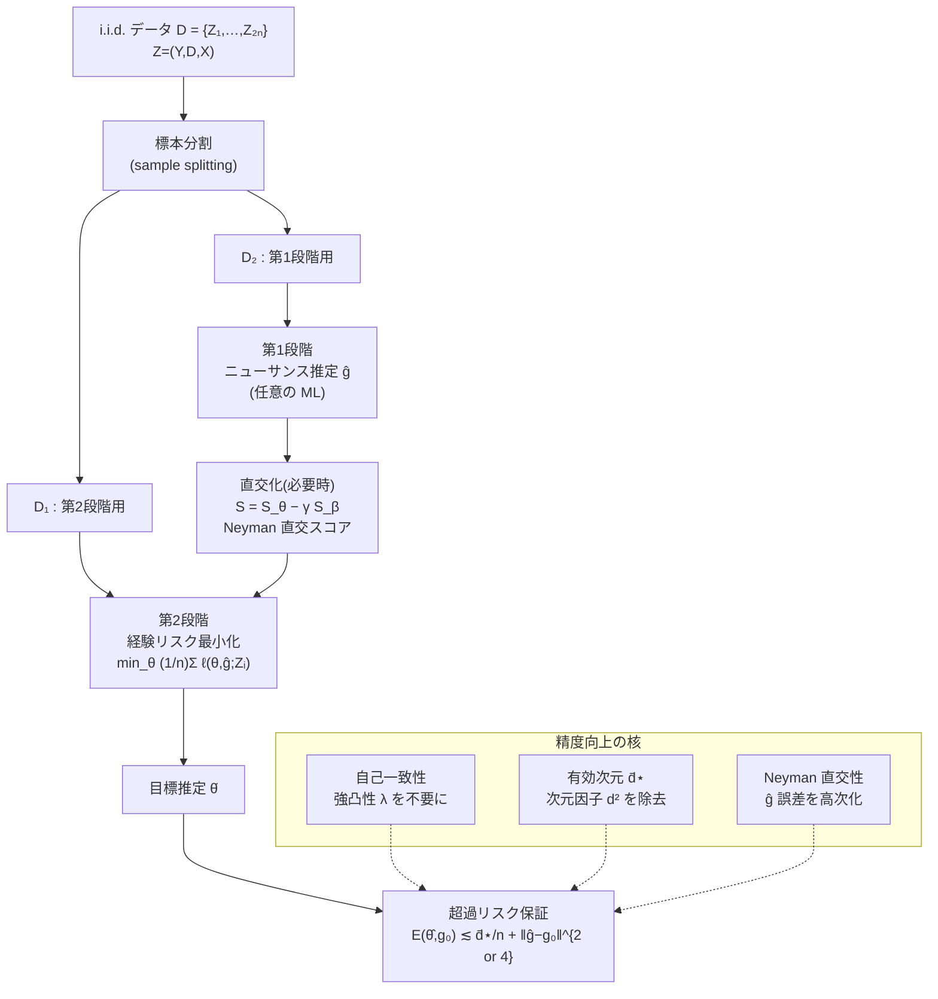

# 自己一致損失による直交統計学習 — Orthogonal Statistical Learning with Self-Concordant Loss

> CATE 推定の精度向上の観点に重点を置いた詳細レポート。
> 「自己一致損失（self-concordant loss）」を用いることで、超過リスク限界から**次元因子を除去**し、**強凸性の仮定を緩和**した直交学習の理論を扱う。

---

## メタ情報

| 項目 | 内容 |
|------|------|
| タイトル | Orthogonal Statistical Learning with Self-Concordant Loss |
| 著者 | Lang Liu, Carlos Cinelli, Zaid Harchaoui（University of Washington, Dept. of Statistics） |
| 発表 | COLT 2022（Proceedings of the 35th Conference on Learning Theory, PMLR 178, pp. 5253–5277） |
| 年 | 2022 |
| arXiv | [2205.00350](https://arxiv.org/abs/2205.00350)（v2, 2022-06-20） |
| PDF | <https://proceedings.mlr.press/v178/liu22g/liu22g.pdf> |
| 分類 | 理論論文（統計的学習理論 / 因果推論 / セミパラメトリック推定） |
| キーワード | Orthogonal Statistical Learning (OSL), Double Machine Learning (DML), Neyman 直交性, 自己一致性, 超過リスク, 有効次元, ニューサンス推定 |

---

## Abstract（原文）

> Orthogonal statistical learning and double machine learning have emerged as general frameworks for two-stage statistical prediction in the presence of a nuisance component. We establish non-asymptotic bounds on the excess risk of orthogonal statistical learning methods with a loss function satisfying a self-concordance property. Our bounds improve upon existing bounds by a dimension factor while lifting the assumption of strong convexity. We illustrate the results with examples from multiple treatment effect estimation and generalized partially linear modeling.

---

## Abstract（日本語訳）

> 直交統計学習（OSL）と二重機械学習（DML）は、ニューサンス（攪乱）成分が存在する状況下での二段階統計予測のための一般的枠組みとして登場した。本論文では、**自己一致性（self-concordance）を満たす損失関数**を用いた直交統計学習の超過リスクに関する**非漸近限界**を確立する。我々の限界は、既存の限界を**次元因子の分だけ改善**すると同時に、**強凸性の仮定を取り除く**。多重処置効果推定および一般化部分線形モデルの例を通じて結果を示す。

---

## Overview（概観）

本論文の核心は次の一文に集約される——

> **「強凸性」を「自己一致性」で置き換えることで、超過リスク限界に現れていた一様 Hessian 下限（最小固有値 λ）への明示的依存を消し、次元 d の余分な因子を取り除く。」**

従来の代表的結果である Foster & Syrgkanis (2020, *Orthogonal Statistical Learning*) の限界は

```
E(θ̂, g₀) ≲ O( d² / (n λ²) + (d/λ²)·‖ĝ − g₀‖⁴ )
```

であり、最小固有値 `λ = inf λ_min(H)` と次元 `d` に強く依存する。本論文はこれを

```
E(θ̂, g₀) ≲ ( e^{3Rr₁} / κ² )·[ K₁² log(1/δ)·d̄⋆ / n + β₂²·‖ĝ − g₀‖⁴ ]
```

へと改良し、**次元 d を「有効次元 d̄⋆」に置換**し、**λ への明示依存を除去**する。これにより CATE / 処置効果推定のように目標パラメータ θ が高次元（`d = O(n^{1/2})` まで許容）の問題で、より鋭い精度保証が得られる。

---

## Problem Setting（問題設定）

### 動機：処置効果と backdoor 調整

観測変数を `Z := (Y, D, X)`（`Y∈ℝ` 結果, `D∈{0,1}` 処置, `X∈ℝᵖ` 特徴）とする。平均処置効果（ATE）は

```
θ₀ := E[Y(1) − Y(0)]
```

unconfoundedness `Y(d) ⊥ D | X`（X が backdoor 基準を満たす）の下で、ATE は条件付き期待値関数（CEF）から同定でき、

```
θ₀ = E[ E[Y|D=1,X] − E[Y|D=0,X] ]
```

となる。ここで `g := (g₀, g₁)`, `g_d := E[Y|D=d, X]` という**潜在的に無限次元のニューサンス**を推定する必要が生じる。この「主たる関心ではない量を多数推定せねばならない」点こそ OSL / DML が扱う課題である。

### 学習問題の定式化（OSL の枠組み）

- i.i.d. サンプル `D = {Z₁,…,Z_{2n}} ~ ℙ`（サイズ 2n、標本分割用）。
- モデル `M_{θ,g}` は損失 `ℓ(θ, g; z)` を備える。
- `θ ∈ Θ ⊂ ℝᵈ`：**目標パラメータ（target parameter）**。
- `g ∈ (𝒢, ‖·‖_𝒢)`：**ニューサンスパラメータ**（無限次元可）。
- 母集団リスク：`L(θ, g) := E_{Z~ℙ}[ ℓ(θ, g; Z) ]`（ℓ は θ について3階・g について2階微分可能）。

**真のニューサンス** `g₀∈𝒢` は未知で、その推定値 ĝ のみが使える。目標は**超過リスク**

```
E(θ, g₀) := L(θ, g₀) − inf_{θ∈Θ} L(θ, g₀)        … (式1)
          = L(θ, g₀) − L(θ⋆, g₀)
```

を小さくすること（θ⋆ は最小化子、`L(·,g₀)` の Hessian は θ⋆ で可逆と仮定）。

---

## Proposed Method（提案手法）

### OSL メタアルゴリズム（標本分割つき二段階推定）

第1分割 `D₁ = {Zᵢ}_{i=1}^n`、第2分割 `D₂ = {Zᵢ}_{i=n+1}^{2n}` を用いる（Foster & Syrgkanis 2020; Chernozhukov et al. 2018 の cross-fitting に準拠）。

1. **第1段階（ニューサンス）**：`D₂` を入力にニューサンス推定 ĝ を得る（任意の機械学習器でよい）。
2. **第2段階（目標）**：経験リスクを最小化
   ```
   min_{θ∈Θ}  L_n(θ, ĝ) := (1/n) Σ_{i=1}^n ℓ(θ, ĝ; Zᵢ)      … (式2)
   ```
   して θ̂ を得る。

ここで標本分割により ĝ と `{Zᵢ}_{i=1}^n` が独立になる点が、後述の Lemma 3 で本質的に効く。

### キーアイデア 1：自己一致性で強凸性を置き換える

従来は「母集団リスクが**一様に強凸**（`λ_min(H) ≥ λ > 0`）」を仮定していた。本論文では、損失が**擬似自己一致（pseudo self-concordant）**であれば十分とする。自己一致性は内点法・Newton 法の解析に由来する性質で（Nesterov–Nemirovskii 1994; Bach 2010 の logistic 用変種）、Hessian が**自分自身によって局所的に制御される**ことを意味する。これにより：

- グローバルな強凸性（最悪ケースの λ）が不要になる。
- Hessian の局所的な変動が、損失の3階微分を通じて自動的に押さえられる。
- ロジスティック回帰など**強凸でない**一般化線形モデル・セミパラメトリックモデルに適用可能になる。

### キーアイデア 2：有効次元による次元因子の除去

限界に現れる次元 d を、**プロファイル有効次元（profile effective dimension）** `d̄⋆` で置き換える。`d̄⋆` は共分散行列 `G⋆` と Hessian `H⋆` のミスマッチ（サンドイッチ共分散）を測る量で、

- well-specified モデルでは `H⋆ = G⋆` ゆえ `d̄⋆ ≈ d`（古典的パラメトリック最小二乗の `O(d/n)` を回復）。
- mis-specified でも、`G⋆` の固有値が `H⋆` より速く減衰すれば `d̄⋆ ≪ d` となり、限界が劇的に改善する。

### キーアイデア 3：Neyman 直交性で ĝ の誤差に鈍感化

母集団リスク L が `(θ⋆, g₀)` で Neyman 直交（一次の Gâteaux 交差微分がゼロ）なら、ニューサンス推定誤差 `‖ĝ−g₀‖_𝒢` の影響が**二乗ではなく四乗**で効く（高次平滑性と併用すると更に高次へ）。これが「ĝ が多少粗くても良い θ̂ が得られる」という直交学習の本質である。

### 有限次元ニューサンスに対する直交スコアの構成（射影）

g が有限次元ベクトル β でパラメトライズされる場合、もとのスコア `S_θ := ∇_θ L(θ, β)` を `S_β := ∇_β L` の張る空間へ射影して

```
S := S_θ − γ S_β ,    γ := [∇_θ ∇_β L(θ,β)]·[∇²_β L(θ,β)]⁻¹
```

とすれば、S は `(θ⋆, β₀)` で Neyman 直交になる（Figure 2 の幾何学的描像）。これを θ について積分すれば直交な母集団リスクが得られる。

---

## Key Formulas（重要な数式）

### 擬似自己一致性の定義（Definition 2）

開集合 `𝒳 ⊂ ℝᵈ` 上の閉凸関数 `f: 𝒳→ℝ` が**パラメータ R で擬似自己一致**であるとは：

```
| D³f(x)[u,u,u] |  ≤  R · ‖u‖₂ · D²f(x)[u,u] ,   ∀ x∈𝒳, u∈ℝᵈ        … (Def.2)
```

> 直観：3階微分（曲率の変化率）が、2階微分（曲率）と方向ノルムの積で抑えられる。標準の自己一致性 `|D³f| ≤ 2 (D²f)^{3/2}` の「擬似」変種で、ロジスティック損失に適合する形。これが強凸性に代わる中核仮定。

### Neyman 直交性（Definition 3）

母集団リスク L が `(θ⋆, g₀)` で `Θ' × 𝒢'` 上 Neyman 直交であるとは：

```
D_g D_θ L(θ⋆, g₀)[θ − θ⋆, g − g₀] = 0 ,   ∀ θ∈Θ', g∈𝒢'        … (式4)
```

これは `D_g S(θ⋆, g₀)[g − g₀] = 0` も含意する（スコア S の Neyman 直交性）。

### プロファイル有効次元（Definition 1）

```
d̄⋆ := sup_{g∈𝒢_{r₂}(g₀)}  Tr( H⋆^{-1/2} G(θ⋆, g) H⋆^{-1/2} )        … (式3)
```

- `H⋆ := H(θ⋆, g₀) = ∇²_θ L`（Hessian）
- `G(θ,g) := Cov_Z(S(θ,g;Z))`（スコア共分散）
- 単純版（ĝ の影響無視）では `d⋆ := Tr(H⋆^{-1/2} G⋆ H⋆^{-1/2})` に簡約。

### 超過リスク限界 — Theorem 1（高速レート / Fast rate）

Assumptions 1, 2, 3b, 4, 5 の下、確率 ≥ 1−δ で

```
E(θ̂, g₀)  ≲  (e^{3Rr₁} / κ²) · [ K₁² log(1/δ)·d̄⋆ / n  +  β₂² ‖ĝ − g₀‖⁴_𝒢 ]        … (式6)
```

ただし `n ≥ max{ N_{r̄₁,r₂}(δ/5), 16(K₂² + 2σ_H²)[log(20d/δ) + d·log(3Rr̄₁/log2)]² }`。Neyman 直交性が成り立たない場合は `‖ĝ−g₀‖⁴_𝒢` が `‖ĝ−g₀‖²_𝒢` に置き換わる。

### 超過リスク限界 — Theorem 2（低速レート / Slow rate）

Assumptions 1, 2, 3a, 4, 5 の下、確率 ≥ 1−δ で

```
E(θ̂, g₀)  ≲  (e^{3Rr₁} / κ²) · [ K₁² log(1/δ)·d̄⋆ / n  +  β₁² ‖ĝ − g₀‖²_𝒢 ]        … (式7)
```

> 第1項 = 第2段階の統計誤差（有効次元 d̄⋆ ／ サンプル数 n に比例）。
> 第2項 = 第1段階のニューサンス誤差（Neyman 直交ありで `‖·‖⁴`、なしで `‖·‖²`）。
> `R` は自己一致パラメータ、`r₁` は Dikin 楕円体の半径、`κ` は Hessian の安定性定数、`K₁` はスコアの sub-Gaussian ノルム。

### 比較：Foster & Syrgkanis (2020) の限界（式12）

強凸性 `λ := inf λ_min(H(θ,g₀))` と Neyman 直交性の下で

```
E(θ̂, g₀)  ≲  O( d² / (n λ²)  +  (d / λ²) ‖ĝ − g₀‖⁴_𝒢 )        … (式12)
```

→ 本論文は `d² → d⋆`、かつ `λ` への明示依存を除去（仮定 2・5 の裾仮定を通じ暗黙にのみ λ に依存し得る）。

---

## Algorithm（疑似コード）

```text
入力: データ D = {Z₁,…,Z_{2n}}, 損失 ℓ(θ,g;z), パラメータ空間 Θ⊂ℝᵈ
出力: 目標推定 θ̂

# ---- 標本分割 ----
D₁ ← {Z₁,…,Z_n}              # 第2段階（目標）用
D₂ ← {Z_{n+1},…,Z_{2n}}      # 第1段階（ニューサンス）用

# ---- 第1段階: ニューサンス推定 ----
ĝ ← FirstStageLearner(D₂)    # 任意の ML 推定器（外生; rate ‖ĝ−g₀‖_𝒢 = O(n^{-φ})）

# ---- (推奨) 直交化: 損失/スコアが未直交なら射影で Neyman 直交化 ----
if not NeymanOrthogonal(ℓ):
    γ ← [∇_θ∇_β L]·[∇²_β L]⁻¹
    S ← S_θ − γ·S_β           # 直交スコア（Figure 2 の射影）
    ℓ ← integrate(S) over θ   # 直交な母集団リスクへ

# ---- 第2段階: 目標パラメータ推定（経験リスク最小化）----
θ̂ ← argmin_{θ∈Θ} (1/n) Σ_{i∈D₁} ℓ(θ, ĝ; Zᵢ)     # 式(2)
# 自己一致損失なので Newton/内点法が安定; グローバル強凸性は不要

# ---- 保証 (解析的) ----
# Neyman 直交あり → E(θ̂,g₀) ≲ d̄⋆/n + ‖ĝ−g₀‖⁴   (Thm 1, 式6)
# Neyman 直交なし → E(θ̂,g₀) ≲ d̄⋆/n + ‖ĝ−g₀‖²   (Thm 2, 式7)
return θ̂
```

> 注：標本分割により ĝ と D₁ が独立となり、Lemma 3（独立性により「ランダムな ĝ」を「固定 g」に置換できる）が成立する。

---

## Architecture（処理フロー）



### 証明の骨格（テイラー展開による分解）

```
E(θ̂,g₀) = L(θ̂,g₀) − L(θ⋆,g₀)
         = S(θ⋆,g₀)ᵀ(θ̂−θ⋆) + (1/2)‖θ̂−θ⋆‖²_{H(θ̄,g₀)}
            └─ =0 (一次直交) ──┘   └── 自己一致で e^{Rr₁} 制御 ──┘
```
- 第1項：一次最適性 `S(θ⋆,g₀)=0` で消える。
- 第2項：擬似自己一致性 (Assumption 4) により
  `‖θ̂−θ⋆‖²_{H(θ̄)} ≤ e^{R‖θ̂−θ⋆‖₂}‖θ̂−θ⋆‖²_{H⋆} ≤ e^{Rr₁}‖θ̂−θ⋆‖²_{H⋆}` と制御。
- 残る `‖θ̂−θ⋆‖²_{H⋆}` を、スコアの sub-Gaussianity（Prop 4: `‖S_n−S‖²_{H⋆⁻¹} ≲ K₁²log(1/δ)d̄⋆/n`）、Neyman 直交性＋平滑性（Lemma 5）、被覆数論法による Hessian 制御（Prop 6）で押さえる。

---

## Figures & Tables（図表）

### 図1：因果ダイアグラム（backdoor 基準）— 論文 Figure 1 の要約

```
        X
       / \
      /   \
     D-----Y     unconfoundedness: Y(d) ⊥ D | X
```
X が D→Y の交絡を担い backdoor 基準を満たす。X で条件付けると処置効果が同定可能。

### 図2：直交スコアの射影による構成 — 論文 Figure 2 の要約

```
     S          S_θ
      \         /|
       \       / |
   [S_β 平面] /  | (直交成分)
        \    /   |
         \  /    v
          \/----→ γ S_β
   S = S_θ − γ S_β  は S_β の張る空間に直交 → Neyman 直交
```

### 表1：定理の要約（本論文の主結果一覧）

| 定理 | レート | 条件 | 超過リスク限界 |
|------|--------|------|----------------|
| **Theorem 1** | Fast | Neyman 直交 + 高次平滑（Asm 3b） | `≲ (e^{3Rr₁}/κ²)[K₁²log(1/δ)d̄⋆/n + β₂²‖ĝ−g₀‖⁴]` |
| **Theorem 2** | Slow | 平滑性のみ（Asm 3a） | `≲ (e^{3Rr₁}/κ²)[K₁²log(1/δ)d̄⋆/n + β₁²‖ĝ−g₀‖²]` |
| 補助 (Prop 4) | — | スコア sub-Gaussian (Asm 2) | `‖S_n(θ⋆,g)−S(θ⋆,g)‖²_{H⋆⁻¹} ≲ K₁²log(1/δ)d̄⋆/n` |
| 補助 (Prop 6) | — | 自己一致 + Bernstein (Asm 4,5) | `(κ/4e^{Rr₁})H⋆ ⪯ H_n(θ,g) ⪯ 3𝒦e^{Rr₁}H⋆` |

### 表2：本論文 vs Foster & Syrgkanis (2020) の限界比較

| 観点 | Foster & Syrgkanis (2020) | 本論文 (Liu et al. 2022) |
|------|---------------------------|--------------------------|
| 第2段階の主項 | `O(d² / (n λ²))` | `O(d̄⋆ / n)`（λ への明示依存なし） |
| ニューサンス項（直交時） | `(d/λ²)‖ĝ−g₀‖⁴` | `β₂²‖ĝ−g₀‖⁴` |
| 凸性の仮定 | **一様強凸**（`λ_min(H)≥λ`） | **擬似自己一致**（強凸不要） |
| 次元への依存 | `d²` | 有効次元 `d̄⋆`（≤ d、しばしば ≪ d） |
| 適用損失 | 強凸損失中心 | 強凸でない GLM/ロジスティック等も可 |
| θ の次元許容 | 固定次元中心 | `d = O(n^{1/2})` まで成長可 |
| 推定保証の種類 | 漸近正規性（Chernozhukov 系）/ 超過リスク | 非漸近・超過リスク |

### 表3：有効次元 d̄⋆ の固有値減衰レジーム別比較（論文 Table 1 の要約）

`G⋆` と `H⋆` が固有ベクトルを共有すると仮定したときの次元依存。`d'` は Foster–Syrgkanis 側の `d²/λ_min(H⋆)`。

| `G⋆` 減衰 | `H⋆` 減衰 | 本論文 `d⋆` | F&S 側 `d'` | 比 `d'/d⋆` |
|-----------|-----------|-------------|-------------|-------------|
| Poly `i^{-α}` | Poly `i^{-β}` | `d^{(β−α+1)∨0}` | `d^{β+2}` | `d^{(α+1)∧(β+2)}` |
| Poly `i^{-α}` | Exp `e^{-νi}` | `d^{−(α−1)∨1}e^{νd}` | `d²e^{νd}` | `d^{1∧(3−α)}` |
| Exp `e^{-μi}` | Poly `i^{-β}` | `1` | `d^{β+2}` | `d^{β+2}` |
| Exp `e^{-μi}` | Exp `e^{-νi}` | `1`(μ>ν) / `d`(μ=ν) / `e^{(ν−μ)d}`(μ<ν) | `d²e^{νd}` | 最大 `d²e^{μd}` |

> 読み方：`G⋆`（スコア共分散）の固有値が `H⋆`（Hessian）より速く減衰するほど `d⋆` は小さく、改善が大きい。例えば `G⋆∼e^{-μi}`, `H⋆∼i^{-β}` なら本論文は `O(n^{-1})` を達成する一方、F&S は `O(d^{β+2}/n)`。

---

## Experiments（適用例・検証）

理論論文のため数値実験はなく、**適用例による理論検証**が中心（論文 §4）。

### 例1：処置効果推定（多重処置 / 部分線形 CEF）

ベクトル予測子 `D := (Dᵏ)_{k=1}^d ∈ ℝᵈ` を持つ部分線形 CEF
```
E[Y | D, X] = θ₀ᵀ D + γ₀(X)
```
を考える。`θ∈ℝᵈ` を多重係数とすることで、**複数処置・異質処置効果（部分群間）・非線形効果**（`D := φ(T)` の特徴写像経由）を統一的にモデル化できる。`T∈{0,1}`、部分群指標 `G=[G₁,…,G_d]` に対し `D := T·G` とすれば部分群別の異質効果が表現される。`T` を `t₁` vs `t₀` に設定した ATE は
```
E[Y(T=t₁) − Y(T=t₀)] = θ₀ᵀ(φ(t₁) − φ(t₀))
```
となり、CATE / 異質処置効果の推定に直結する。

### 例1b：部分線形モデルの多重目標係数

```
D = α₀(X) + U
Y = θ₀ᵀ D + γ₀(X) + V = ζ₀(X) + θ₀ᵀ U + V
```
`E[U|X]=0`, `E[V|D,X]=0`、U は非特異共分散 `Σ_u`、V は D,X と独立で分散 `σ_v²`。`g=(ζ,α)` と再パラメトライズし、損失
```
ℓ(θ, g; Z) := [ Y − ζ(X) − θᵀ(D − α(X)) ]²
```
を用いる。`E[UV]=0` より母集団リスクは
```
L(θ,g) = E[(ζ₀(X)−ζ(X) − θᵀ(α₀(X)−α(X)))²] + ‖θ−θ₀‖²_{Σ_u} + σ_v²
```
となり、`θ⋆ = θ₀` を唯一の最小化子に持つ（partialling-out / R-learner 型の構造）。U が有界 `‖U‖₂≤M`、V が sub-Gaussian、`‖g‖_𝒢 = sup_x √(‖α(x)‖²+ζ²(x))` を取ると Assumptions 2/5 等が検証できる。

### 例2：一般化部分線形モデル（半パラメトリックロジスティック回帰）

ロジスティック損失は強凸ではないが擬似自己一致を満たすため、本枠組みが適用可能。Chernozhukov et al. (2018) が θ の次元固定で漸近正規性を示したのに対し、本論文は `d = O(n^{1/2})` まで次元を成長させても非漸近の超過リスク保証を与える点が新しい。

---

## Notes（精度向上の観点 — Foster–Syrgkanis からの改善点）

CATE / 処置効果推定の精度という観点で、本論文が直交学習にもたらす実質的な改善は次の3点に集約される。

### 1. 次元因子の除去：`d²/λ²` → `d̄⋆`

Foster–Syrgkanis の `O(d²/(nλ²))` は、目標係数 θ が高次元（多数の処置・多数の部分群で異質効果を推定する CATE 設定）になるほど悪化する。本論文は次元を**有効次元 d̄⋆ = Tr(H⋆^{-1/2}G⋆H⋆^{-1/2})** に置換し、

- well-specified なら `d̄⋆ ≈ d`（古典最小二乗の `O(d/n)` を回復）、
- スコア共分散 `G⋆` の固有値が速く減衰する典型的な CATE 設定では `d̄⋆ ≪ d` となり、最低でも **d 倍**の改善（Table 1 / 表3）。

これは「ニューサンスのない教師あり学習でしか得られなかった精度」を、ニューサンス付き直交学習でも回復することを意味する。

### 2. 強凸性の撤廃：λ への明示依存を除去

`O(1/λ²)` の依存は、Hessian の最小固有値が小さい（弱識別・共線性のある）処置効果問題で限界を爆発させる。自己一致性に置き換えることで λ への明示依存が消え、ロジスティック回帰・一般化線形モデルなど**強凸でない損失**にも理論が及ぶ。CATE 推定で二値・カウント結果を扱う際に重要。

### 3. Neyman 直交性による誤差の高次化（変わらず継承）

ニューサンス誤差は Theorem 1（直交時）で `‖ĝ−g₀‖⁴`、Theorem 2（非直交時）で `‖ĝ−g₀‖²` として効く。ĝ の収束率 `‖ĝ−g₀‖_𝒢 = O(n^{-φ})` のとき、`φ ≥ 1/4` であればニューサンス項が `O(n^{-1})` の第1項を支配せず、**遅い ML 推定器を使っても精度を損なわない**（DML の二重頑健的性質を非漸近で定量化）。

### 留意点・限界

- Hessian の安定性定数 `κ`、自己一致パラメータ `R`、Dikin 半径 `r₁` を通じて `e^{3Rr₁}/κ²` の因子が残る（局所性の代償）。
- 解析は θ⋆ 近傍・g₀ 近傍に**局所的**（Assumption 1 の localization）。グローバル保証ではない。
- `d̄⋆` の改善は `G⋆` と `H⋆` の固有値減衰の関係に依存し、mis-specification が大きいと `d̄⋆` が指数的に増大するレジームもある（表3 の Exp-Exp μ<ν）。
- sub-Gaussian スコア（Asm 2）・Bernstein 条件（Asm 5）など裾仮定を通じ、λ への依存は完全消滅ではなく「明示依存の除去」（K₁ 等に暗黙に潜む可能性）。

### 関連研究との位置づけ

- **Foster & Syrgkanis (2020)**：OSL の原論文。強凸 + Neyman 直交で `O(d²/(nλ²)+ …)`。本論文の直接の改善対象。
- **Chernozhukov et al. (2018, DML)**：cross-fitting と Neyman 直交スコア。θ の次元固定で漸近正規性。本論文は非漸近・次元成長可。
- **Ostrovskii & Bach (2021)**：一般化線形モデルの有効次元解析。ニューサンスなしの場合に本論文の `d⋆` が一致。
- **Nesterov–Nemirovskii (1994) / Bach (2010)**：自己一致性・擬似自己一致性の出自。

---

## 出典

- 論文本体: [arXiv:2205.00350](https://arxiv.org/abs/2205.00350)（v2, 2022-06-20）
- COLT 2022 proceedings: <https://proceedings.mlr.press/v178/liu22g.html>（PMLR 178, pp. 5253–5277）
- 著者ページ: <https://langliu95.github.io/_pages/publications/>

> 本レポートの数式・定理番号（Def.2, 式1–12, Theorem 1/2, Prop 4/6, Lemma 3/5/7, Table 1）は論文 v2 本文（pp.1–8）から抽出。記号は `D` が処置と微分演算子の双方に使われる箇所があるため文脈に注意（`D[·]` は Gâteaux 微分作用素、`D∈{0,1}` 等は処置変数）。
