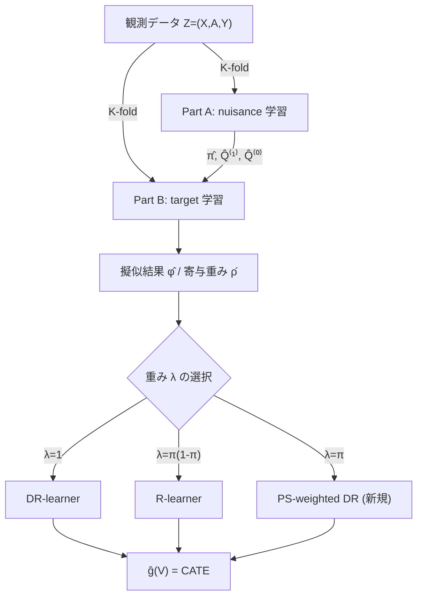

# On Weighted Orthogonal Learners for Heterogeneous Treatment Effects

## メタ情報

| 項目 | 内容 |
|------|------|
| タイトル | On Weighted Orthogonal Learners for Heterogeneous Treatment Effects |
| 著者 | Pawel Morzywolek, Johan Decruyenaere, Stijn Vansteelandt |
| 発表年 | 2023（初版 2023-03-22 / 改訂 2024-06-01） |
| 掲載 | arXiv:2303.12687 (stat.ME) / Statistical Science 投稿 |
| URL | https://arxiv.org/abs/2303.12687 |
| HTML | https://arxiv.org/html/2303.12687 |
| キーワード | CATE, Neyman-orthogonality, DR-learner, R-learner, weighted loss, doubly robust, oracle bound |

---

## Abstract（原文）

> Motivated by applications in personalized medicine and individualized policymaking, there is a growing interest in techniques for quantifying treatment effect heterogeneity in terms of the conditional average treatment effect (CATE). Some of the most prominent methods for CATE estimation developed in recent years are T-Learner, DR-Learner and R-Learner. The latter two were designed to improve on the former by being Neyman-orthogonal. However, the relations between them remain unclear, and likewise the literature remains vague on whether these learners converge to a useful quantity or (functional) estimand when the underlying optimization procedure is restricted to a class of functions that does not include the CATE. In this article, we provide insight into these questions by discussing DR-Learner and R-Learner as special cases of a general class of weighted Neyman-orthogonal learners for the CATE, for which we moreover derive oracle bounds. Our results shed light on how one may construct Neyman-orthogonal learners with desirable properties, on when DR-Learner may be preferred over R-Learner (and vice versa), and on novel learners that may sometimes be preferable to either of these. Theoretical findings are confirmed using results from simulation studies on synthetic data, as well as an application in critical care medicine.

## Abstract（日本語訳）

> 個別化医療や個別化政策立案への応用を背景に、条件付き平均処置効果（CATE）の観点から処置効果の異質性を定量化する手法への関心が高まっている。近年開発された代表的な CATE 推定手法として T-Learner, DR-Learner, R-Learner がある。後者二つは Neyman 直交性を備えることで前者を改善するよう設計された。しかし、これらの相互関係は不明確なままであり、また最適化が CATE を含まない関数クラスに制限されたとき、これらの learner が有用な量（推定対象 estimand）に収束するのかについても文献は曖昧である。本論文では、DR-Learner と R-Learner を CATE に対する**重み付き Neyman 直交 learner の一般クラスの特殊例**として論じ、さらにその oracle bound を導出することで、これらの問いに洞察を与える。本結果は、望ましい性質を持つ Neyman 直交 learner の構成方法、DR-Learner が R-Learner より好ましい（あるいはその逆の）状況、そして時にいずれよりも好ましい新規 learner について光を当てる。理論的知見は合成データのシミュレーション研究および集中治療医学への応用で確認される。

---

## Overview

本論文の核心は、**DR-learner と R-learner を単一の「重み付き直交損失」のもとで統一的に捉える**点にある。両者は別々に提案された手法だが、本論文は共通の損失関数

```
重み付き直交損失  L(g, η, λ{π}) を λ(·) という重み関数で索引づけ
   λ ≡ 1            → DR-learner
   λ = π(1-π)       → R-learner
   λ = π            → 傾向スコア重み付き DR-learner（新規）
```

として整理する。この視点により、(1) 各 learner が何を推定対象として収束するか、(2) nuisance 推定誤差がどの順序で最終誤差に伝播するか（oracle bound）、(3) DGP に応じてどの重みが有利か、が明らかになる。CATE 推定の精度向上の観点では「重み λ の設計が推定対象と頑健性のトレードオフを規定する」という統一原理を提供する。

---

## Problem（問題設定）

観測データ `Z = (X, A, Y)`（共変量 X、二値処置 A∈{0,1}、結果 Y）から、共変量の部分集合 `V`（V⊆X）に基づく CATE を推定したい。

潜在結果 `Y^1, Y^0` に対し、関数クラス 𝒢 内で個体処置効果に最も近い投影として推定対象を定義する。

```
g0 := argmin_{g∈𝒢}  E[ {(Y^1 − Y^0) − g(V)}^2 ]
```

課題:
- **Neyman 直交性**: nuisance（傾向スコア π、結果回帰 Q）の推定誤差が g の誤差に一次で伝播しないようにしたい。
- **収束先の曖昧さ**: 𝒢 が真の CATE を含まない（misspecified）場合、DR/R-learner が何に収束するのかが従来不明確だった。
- **使い分けの基準欠如**: DR と R のどちらを選ぶべきかの DGP 依存の指針が無かった。

---

## Proposed Method（提案手法）

### 重み付き直交学習器の一般クラス

連続微分可能な**重み関数** `λ: [0,1] → ℝ`（傾向スコア π(X) を引数にとる）で索引づけられた損失を最小化する。

```
g̃ = argmin_{g∈𝒢}  L(g, η, λ{π(X)})

L(g, η, λ{π}) = (1 / E[λ{π(X)}]) · E[ ρ(A, π(X)) · {φ(Z; η, λ{π}) − g(V)}^2 ]
```

- nuisance: `η = (π(X), Q^(0)(X), Q^(1)(X))`  （π: 傾向スコア、Q^(a): 処置 a のもとでの結果回帰 E[Y|A=a,X]）
- `ρ(A,π)`: 各観測の寄与を制御する重み（後述）
- `φ`: IPW 項と結果回帰項を結合した擬似結果（pseudo-outcome）

### DR/R-learner が特殊例である構造

重み λ の選択だけで既存 learner が復元される。

| Learner | 重み λ{π(X)} | ρ(A,π(X)) | 推定対象（収束先の重み付け母集団） |
|---------|-------------|-----------|--------------------------------------|
| **DR-learner** | `1`（定数） | `1` | 全母集団に対する一様重みの CATE 投影 |
| **R-learner** | `π(1−π)`（オーバーラップ重み） | `π(1−π)` | overlap で重み付けされた母集団の CATE 投影 |
| **傾向スコア重み付き DR（新規）** | `π` | `{A−π}+π = A` | 処置群（treated）に対する CATE |

DR-learner は ρ≡1 のため全観測が等しく寄与し、母集団全体の MSE を最小化する。R-learner は π(1−π) で重み付けすることで、傾向スコアが 0 や 1 に近い（オーバーラップが薄い）領域の影響を自動的に抑える（実質的なトリミング効果）。

### 重み選択の指針

- **λ' の役割**: ρ に λ の微分 λ' が現れる（`ρ = {A−π}λ' + λ`）。これが nuisance 誤差の伝播係数 C₁, C₂, C₃（oracle bound 参照）を規定し、頑健性とのトレードオフを生む。
- 推定対象（どの母集団の CATE を見たいか）と、π̂ の品質（オーバーラップの薄さ）に応じて λ を選ぶことで、推定対象選択と頑健性を同時に設計できる。

---

## Key Formulas

### 1. 一般化された重み付き直交損失

```
L(g, η, λ{π(X)})
   = (1 / E[λ{π(X)}]) · E[ ρ(A, π(X)) · {φ(Z; η, λ{π(X)}) − g(V)}^2 ]
```

### 2. 寄与重み ρ

```
ρ(A, π(X)) := {A − π(X)}·λ'{π(X)} + λ{π(X)}
```

### 3. 擬似結果 φ（効率影響関数に基づく）

```
φ(Z; η, λ{π})
   = [ λ{π(X)} / ρ(A,π(X)) ] · [ (A − π(X)) / (π(X){1−π(X)}) ] · {Y − Q^(A)(X)}
     + Q^(1)(X) − Q^(0)(X)
```

- 第1項 = IPW（逆確率重み付き残差補正）項
- 第2項 = 結果回帰差（plug-in CATE）項
- この二重構造が doubly robust 性と Neyman 直交性を担保する。

### 4. 各 learner への帰着

```
DR-learner:  λ=1, λ'=0  ⇒ ρ=1
   φ_DR = (A−π)/(π(1−π))·{Y−Q^(A)} + Q^(1) − Q^(0)     ← 標準的 DR 擬似結果
   損失 = E[ {φ_DR − g(V)}^2 ]

R-learner:  λ=π(1−π), λ'=1−2π  ⇒ ρ=π(1−π)
   重み付き残差損失（Robinson 部分線形回帰型）に帰着
   損失 ∝ E[ π(1−π)·{φ_R − g(V)}^2 ]

傾向スコア重み付き DR:  λ=π, λ'=1  ⇒ ρ={A−π}+π = A
   処置群のみが寄与 ⇒ 処置群での CATE を推定対象とする
```

### 5. Oracle Bound（Theorem 1）

margin / 識別可能条件（条件(15)）のもとで:

```
‖ĝ − g0‖₂²  ≲  R_g
            + ‖C₁(X)·{π̂ − π0}²‖₂²
            + ‖C₂(X)·{π̂ − π0}·{Q̂^(1) − Q0^(1)}‖₂²
            + ‖C₃(X)·{π̂ − π0}·{Q̂^(0) − Q0^(0)}‖₂²
```

- `R_g`: 最適化（正則化バイアス）誤差
- 第2項: π 誤差の**二次**項（doubly-robust なので一次項が消える）
- 第3,4項: π 誤差と Q 誤差の**交差積**（片方が速く収束すれば全体が収束＝二重頑健性）
- 係数 C₁,C₂,C₃ は λ, λ' に依存し、重み選択が頑健性に直結することを示す。

---

## Algorithm（疑似コード）

```
入力: データ {Z_i = (X_i, A_i, Y_i)}_{i=1..n}, 重み関数 λ(·), 関数クラス 𝒢, 折数 K
出力: CATE 推定 ĝ(V)

1. データを K 個の folds に分割
2. for k = 1..K:                        # cross-fitting
3.    Part A: fold k 以外の K-1 folds で nuisance を学習
              π̂_{-k}(X), Q̂^(1)_{-k}(X), Q̂^(0)_{-k}(X)   ← 柔軟な ML
4.    Part B: fold k で擬似結果と寄与重みを計算
              ρ̂_i  = {A_i − π̂(X_i)}·λ'{π̂(X_i)} + λ{π̂(X_i)}
              φ̂_i  = [λ{π̂}/ρ̂_i]·[(A_i−π̂)/(π̂(1−π̂))]·{Y_i − Q̂^(A_i)(X_i)}
                     + Q̂^(1)(X_i) − Q̂^(0)(X_i)
5. 全 folds の (φ̂_i, ρ̂_i) を集約し経験リスクを最小化:
       ĝ = argmin_{g∈𝒢}  [ Σ_i ρ̂_i {φ̂_i − g(V_i)}² / Σ_i λ{π̂(X_i)} ] + Λ(g)
6. return ĝ
```

ポイント: nuisance 学習（Part A）と target 学習（Part B）に**独立サンプルを使う**サンプル分割が、ML の i.i.d. 保証を Part B に持ち込むために本質的。

---

## Architecture（構造図）

```
                ┌────────────────────────────────────────┐
                │            観測データ Z=(X,A,Y)          │
                └───────────────┬────────────────────────┘
                                │  K-fold 分割 (cross-fitting)
            ┌───────────────────┴────────────────────┐
            ▼                                         ▼
   ┌──────────────────┐                    ┌────────────────────┐
   │ Part A: nuisance │                    │ Part B: target g    │
   │  π̂(X)            │── π̂,Q̂ ───────────▶│  擬似結果 φ̂ 計算    │
   │  Q̂^(1)(X)        │                    │  寄与重み ρ̂ 計算    │
   │  Q̂^(0)(X)        │                    │  重み λ で索引       │
   └──────────────────┘                    └─────────┬──────────┘
                                                      ▼
                                  ┌──────────────────────────────────┐
                                  │  重み付き直交損失 L(g,η,λ) 最小化  │
                                  │   λ=1     → DR-learner            │
                                  │   λ=π(1-π)→ R-learner             │
                                  │   λ=π     → PS-weighted DR (新規) │
                                  └──────────────┬───────────────────┘
                                                 ▼
                                          ┌─────────────┐
                                          │  ĝ(V) = CATE │
                                          └─────────────┘
```



---

## Figures & Tables

### 表1: 重み付き直交学習器の一般クラスと特殊例

| Learner | λ{π} | λ'{π} | ρ(A,π) | 推定対象母集団 | 性格 |
|---------|------|-------|--------|----------------|------|
| DR-learner | 1 | 0 | 1 | 全母集団（一様） | 全体 MSE 最小化 |
| R-learner | π(1−π) | 1−2π | π(1−π) | overlap 重み付き母集団 | 薄オーバーラップ域を縮退 |
| PS-weighted DR（新規） | π | 1 | A | 処置群 | treated 集団の CATE |

### 表2: DR-learner vs R-learner の優劣条件比較（DGP 依存）

| 観点 / DGP 特性 | DR-learner 有利 | R-learner 有利 |
|-----------------|-----------------|-----------------|
| 推定対象 | 全母集団の CATE を見たい | overlap 母集団で良い／臨床的均衡 |
| 傾向スコア π の分布 | 全域で 0,1 から離れる（高 positivity） | 一部で π→0/1（オーバーラップ薄） |
| 共変量バランス | 処置群・対照群が概ね均衡 | 群間で共変量分布が大きく偏る |
| 重み付け母集団の意味 | 全層を等価に重視 | 不確実な処置判断領域を重視 |
| 計算 | ρ=1 で単純 | π(1−π) 重みで縮退・安定 |
| π̂ の誤差感度 | overlap 薄域で IPW 項が不安定化しやすい | overlap 重みで自動的に緩和 |
| 関数クラス 𝒢 に CATE が含まれる場合 | 同等以上に良好 | DR と概ね同等 |

### 表3: Oracle Bound における nuisance 誤差項の構造

| 誤差項 | 形 | 意味 |
|--------|-----|------|
| 最適化誤差 | R_g | 𝒢 への投影・正則化バイアス |
| π 二次項 | ‖C₁{π̂−π0}²‖² | 一次項が消える（直交性） |
| 交差項1 | ‖C₂{π̂−π0}{Q̂¹−Q0¹}‖² | π と Q¹ の積（二重頑健性） |
| 交差項2 | ‖C₃{π̂−π0}{Q̂⁰−Q0⁰}‖² | π と Q⁰ の積（二重頑健性） |

### 図（概念）: 重み λ による推定対象と頑健性のトレードオフ

```
推定対象の網羅性
   高 ▲  DR-learner (λ=1)
      │      ●
      │           ╲ 重み λ を変えると
      │            ╲  推定対象と頑健性が連続的に移動
      │             ●  PS-weighted DR (λ=π)
      │                  ╲
   低 │                   ● R-learner (λ=π(1-π))
      └────────────────────────────────▶
        低              オーバーラップ薄域での頑健性          高
```

---

## Experiments & Evaluation

- **シミュレーション研究（合成データ）**: 理論的知見の確認を目的に、関数クラス 𝒢 に CATE が含まれる場合・含まれない場合、および群間の共変量バランス／オーバーラップを変えた DGP で各 learner を比較。
  - CATE が 𝒢 に含まれるとき: **DR-learner が R-learner と同等以上**の性能。
  - 母集団が不均衡（オーバーラップ薄）なとき: **R-learner が優位**。
  - DR/R いずれも Neyman 直交性により **T-learner（単純な結果回帰差）を上回る**。
  - ※ 具体的な RMSE/MSE の数値は HTML 抽出範囲で取得できなかったため、正確な数値は原論文 Section 5（シミュレーション）および付録を参照。捏造は行わない。
- **実データ応用（集中治療医学）**: 急性腎障害における腎代替療法（renal replacement therapy）の開始判断。全患者が処置候補ではなく臨床的均衡が処置適格性を決めるため、overlap や処置群を対象とする重み選択が意味を持つケーススタディとして提示。

---

## Notes（どの DGP でどの learner が優位か／精度向上の観点）

- **統一的視点が本質的貢献**: DR/R-learner は「重み λ で索引づけられた重み付き直交損失」の二つの点に過ぎず、λ を連続的に動かすことで両者の中間や新規 learner（PS 重み付き DR など）を設計できる。CATE 推定の精度向上は「ML を強くする」だけでなく「推定対象と頑健性を規定する λ の設計」によって達成できる、という設計原理を与える。

- **重み = 推定対象の選択**: λ は単なる数値安定化ではなく、**どの（重み付き）母集団の CATE に収束するか**を決める。𝒢 が真の CATE を含まない misspecified 設定では、DR と R は異なる推定対象に収束しうる点に注意（従来曖昧だった収束先を明確化）。

- **DGP 別の使い分け（精度の観点）**:
  - オーバーラップが薄い（π̂ が 0/1 近傍を含む）DGP では、DR の IPW 項 (A−π)/(π(1−π)) が分散爆発を起こしやすく、R-learner の π(1−π) 重みがこれを縮退して RMSE を改善しやすい。
  - 高 positivity かつ群間バランスの良い DGP、もしくは全母集団 CATE が真の関心である場合は DR が素直で精度・解釈ともに優位。
  - 処置群に限った効果が関心（例: 治療を受けた集団での効果）なら λ=π の PS 重み付き DR が適合。

- **頑健性は oracle bound に集約**: nuisance 誤差は一次で消え、π の二次項と π×Q の交差項のみが残る。よって「π̂ と Q̂ の少なくとも一方が十分速く収束すれば g̃ も収束する」という二重頑健性が、重み付きクラス全体で成立する。係数 C₁,C₂,C₃ が λ, λ' に依存するため、頑健性を最大化する λ 設計の余地がある。

- **実務指針**: π̂ の品質（オーバーラップ診断）と推定対象の定義を先に固定し、それに整合する λ を選ぶ。診断的には、π̂ 分布が 0/1 に張り付くなら R 系の重み、全域で離れているなら DR を初期選択とするのが妥当。

- **数値の取扱い**: 本レポートの数式・特殊例・oracle bound の構造は arXiv HTML 版から抽出・確認済み。シミュレーションの具体数値は抽出範囲外のため記載せず、原論文を参照のこと。
