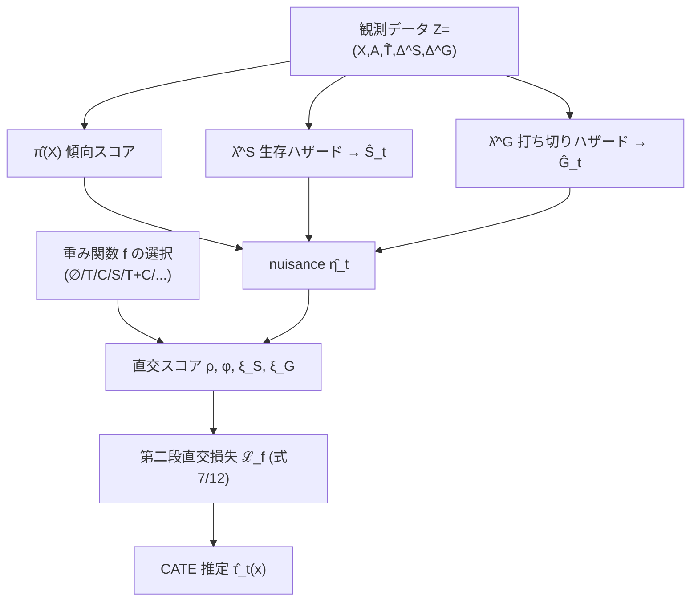

# Orthogonal Survival Learners for Estimating Heterogeneous Treatment Effects from Time-to-Event Data

## メタ情報

| 項目 | 内容 |
|------|------|
| タイトル | Orthogonal Survival Learners for Estimating Heterogeneous Treatment Effects from Time-to-Event Data |
| 著者 | Dennis Frauen, Maresa Schröder, Konstantin Hess, Stefan Feuerriegel |
| 所属 | LMU Munich / Munich Center for Machine Learning (MCML) |
| 年 | 2025 |
| arXiv | [2505.13072](https://arxiv.org/abs/2505.13072) (submitted 2025-05-19) |
| HTML | https://arxiv.org/html/2505.13072v1 |
| キーワード | CATE / HTE, 生存時間解析, 打ち切り (censoring), Neyman 直交性, メタ学習器, 低オーバーラップ, 再重み付け (retargeting) |
| 本レポートの焦点 | CATE 推定の精度向上 — 直交学習 (orthogonal learning) の生存解析への拡張と、生存解析特有の低オーバーラップへの頑健化 |

---

## Abstract (英語・原文)

> Estimating heterogeneous treatment effects (HTEs) is crucial for personalized decision-making. However, this task is challenging in survival analysis, which includes time-to-event data with censored outcomes (e.g., due to study dropout). In this paper, we propose a toolbox of novel orthogonal survival learners to estimate HTEs from time-to-event data under censoring. Our learners have three main advantages: (i) we show that learners from our toolbox are guaranteed to be orthogonal and thus come with favorable theoretical properties; (ii) our toolbox allows for incorporating a custom weighting function, which can lead to robustness against different types of low overlap, and (iii) our learners are model-agnostic (i.e., they can be combined with arbitrary machine learning models). We instantiate the learners from our toolbox using several weighting functions and, as a result, propose various neural orthogonal survival learners. Some of these coincide with existing survival learners (including survival versions of the DR- and R-learner), while others are novel and further robust w.r.t. low overlap regimes specific to the survival setting (i.e., survival overlap and censoring overlap). We then empirically verify the effectiveness of our learners for HTE estimation in different low-overlap regimes through numerical experiments. In sum, we provide practitioners with a large toolbox of learners that can be used for randomized and observational studies with censored time-to-event data.

---

## Abstract (日本語訳)

異質処置効果 (HTE / CATE) の推定は、パーソナライズされた意思決定に不可欠である。しかし生存時間解析 (survival analysis) では、研究脱落 (dropout) 等による「打ち切り (censoring)」を含む time-to-event データを扱うため、この推定は困難である。本論文は、打ち切り下の time-to-event データから HTE を推定する**新規の直交生存学習器 (orthogonal survival learners) のツールボックス**を提案する。本ツールボックスの学習器は 3 つの利点をもつ。(i) ツールボックス由来の学習器は**直交性 (orthogonality) が保証され**、好ましい理論的性質をもつ。(ii) **カスタム重み付け関数 (custom weighting function)** を組み込め、これにより複数種類の低オーバーラップに対する頑健性が得られる。(iii) **モデル非依存 (model-agnostic)** であり、任意の機械学習モデル（例: ニューラルネット）と組み合わせられる。複数の重み付け関数で学習器を具体化し、各種のニューラル直交生存学習器を提案する。その一部は既存学習器（生存版 DR 学習器・R 学習器）と一致するが、他は新規であり、生存解析特有の低オーバーラップ（survival overlap と censoring overlap）に対してさらに頑健である。数値実験により、異なる低オーバーラップ状況下での有効性を検証する。総じて、打ち切りを伴う time-to-event データを用いる無作為化研究・観察研究の両方で利用可能な、大規模な学習器ツールボックスを実務家に提供する。

---

## Overview

本論文は、**因果推論で確立された Neyman 直交メタ学習器（DR-/R-learner）を、生存時間解析へ体系的に拡張**する。中心アイデアは次の 2 点である。

1. **生存設定向けの直交損失の導出**: 打ち切りに起因する 2 種類の追加 nuisance（生存ハザード λ^S と打ち切りハザード λ^G）を含めた効率影響関数 (EIF) を導出し、それを二段階学習器 (two-stage learner) の第二段損失に変換する。これにより plug-in バイアスを回避しつつ、nuisance 誤差に対して一次のロバスト性（直交性）を得る。
2. **カスタム重み付けによる「再ターゲット (retargeting)」**: 任意の正の重み関数 `f(η̃_t(X)) > 0` を損失に挿入し、低オーバーラップ領域のサンプルをダウンウェイトする。重み関数の選び方で、treatment / censoring / survival の 3 種オーバーラップに対する頑健性を「設計」できる。

結果として `∅, T, C, S, T+C, T+S, C+S, T+C+S` の **8 種類の学習器ファミリ**が単一の枠組みから生成される（`∅`=生存DR、`T`=生存R に相当）。

---

## Problem（打ち切りと低オーバーラップ）

### データ設定

- 母集団 `(X, A, T, C) ∼ ℙ`
  - `X ∈ 𝒳 ⊆ ℝ^p`: 観測共変量
  - `A ∈ {0,1}`: 二値処置
  - `T ∈ 𝒯`: 関心のあるイベント時刻（例: 患者の死亡）
  - `C ∈ 𝒯`: 打ち切り時刻（研究脱落）
  - 本文は離散時間 `𝒯 = {0, …, t_max}` を仮定（連続時間は Appendix E で拡張）
- 実際に観測できるのは `Z = (X, A, T̃, Δ^S, Δ^G)`, i.i.d. サイズ `n`
  - `T̃ = min{T, C}`（観測時刻）
  - `Δ^S = 𝟏(T ≤ C)`: 主イベントを観測した指標
  - `Δ^G = 𝟏(T ≥ C)`: 打ち切りを観測した指標
  - （関連研究は `Δ^G = 1 − Δ^S` とし同時刻 tie を除外することが多い; 本論文は tie も Appendix G で扱う）

### 主要定義

- 生存関数: `S_t(x,a) = ℙ(T > t | X=x, A=a)`
- 打ち切り生存関数: `G_t(x,a) = ℙ(C > t | X=x, A=a)`
- 生存ハザード: `λ^S_t(x,a) = ℙ(T̃ = t, Δ^S = 1 | T̃ ≥ t, X=x, A=a)`
- 打ち切りハザード: `λ^G_t(x,a)`（同様に定義）
- 傾向スコア: `π(x) = ℙ(A=1 | X=x)`

### 因果推定対象（estimand）

```
τ_t(x) = ℙ(T(1) > t | X=x) − ℙ(T(0) > t | X=x)      … (1)
```

時刻 `t` までの生存確率の差（治療有無の potential outcome `T(a)` に基づく CATE）。拡張: 条件付き平均 `τ̄(x)=𝔼[T(1)−T(0)|X=x]`、処置別量 `μ_t(x,a)=ℙ(T(a)>t|X=x)`（Appendix F）。

### 識別可能性の仮定

- **Assumption 3.1（標準的因果仮定）**: (i) 一致性 `T(a)=T if A=a`、(ii) 処置オーバーラップ `0 < π(x) < 1`、(iii) 無交絡 `A ⊥ T(1),T(0) | X=x`
- **Assumption 3.2（生存特有の仮定）**: (i) **打ち切りオーバーラップ** `G_{t-1}(x,a) > 0`、(ii) **生存オーバーラップ** `S_{t-1}(x,a) > 0`、(iii) 非情報的打ち切り `T ⊥ C | X=x, A=a`

これらの下で識別式:

```
τ_t(x) = S_t(x,1) − S_t(x,0)
       = ∏_{i=0}^{t}(1 − λ^S_i(x,1)) − ∏_{i=0}^{t}(1 − λ^S_i(x,0))      … (2)
```

ハザード `λ^S_i` は観測母集団 `Z` のみに依存するため、データから推定可能。

### 低オーバーラップ＝データ希少性の 3 源泉

| オーバーラップ種別 | 違反すると小さくなる量 | 帰結（データ希少） |
|------------------|----------------------|-------------------|
| **Treatment overlap** | `π(x)` が 0 or 1 に偏る | 特定共変量での処置/対照データ不足（古典的因果推論の課題） |
| **Censoring overlap** | `G_{t-1}(x,a)` が小 | 時刻 `t` まで非打ち切りで残る確率が低く、非打ち切り観測が不足 |
| **Survival overlap** | `S_{t-1}(x,a)` が小 | ほとんどが `t` 前にイベント発生し、`λ^S_t` 推定用データが不足 |

> 既存の生存 HTE 学習器は treatment overlap 以外の希少性に対処していなかった。本論文の中心的貢献はこの空白を埋める点にある。

### plug-in 学習器の問題

ハザード推定 `λ̂^S_i` を式 (2) に代入する plug-in 推定 `τ̂_t(x)=Ŝ_t(x,1)−Ŝ_t(x,0)`（`Ŝ_t(x,a)=∏_{i=0}^{t}(1−λ̂^S_i(x,a))`）は **plug-in バイアス**を招き、収束が劣化する。

---

## Proposed Method（直交生存学習器・カスタム重み付け・モデル非依存）

二段階学習: まず nuisance `η_t` を推定し、次に第二段で

```
τ̂_t(x) = arg min_{g∈𝒢} ℒ(g, η̂_t)      … (3)
```

を最小化する。第二段損失が **Neyman 直交 (orthogonal)** なら nuisance 誤差に一次で鈍感になり、quasi-oracle 収束率などの好性質を得る。直交性の定義:

```
D_{η_t} D_g ℒ(g, η_t)[ĝ − g, η̂_t − η_t] = 0      … (4)
```

### ツールボックスの 3 ステップ

**Step 1 — Nuisance 推定**: 傾向スコア `π(X)`、生存ハザード `λ^S_t(x,a)`、打ち切りハザード `λ^G_t(x,a)` を任意の ML で推定。

```
η_t(X) = ( π(X), ( λ^S_i(X,1), λ^S_i(X,0), λ^G_i(X,1), λ^G_i(X,0) )_{i=0}^{t} )      … (5)
```

**Step 2 — 重み付き目標損失**: 正の重み関数 `f(η̃_t(X)) > 0`（`η̃_t` は π, S_{t-1}, G_{t-1} に依存）を用いた

```
ℒ̄_f(g, η_t) = (1/𝔼[f]) · 𝔼[ f(η̃_t(X)) · (τ_t(X) − g(X))^2 ]      … (6)
```

`f > 0` である限り、最小化解は `𝒢` が十分大きければ `τ_t` に一致する（**どんな重みでも consistency は保たれる**）。重みは低オーバーラップ領域のダウンウェイトに使う＝「再ターゲット」。

**Step 3 — 直交化第二段損失**: 重み付き estimand `θ_{t,f}` の効率影響関数 (EIF) `φ_{t,f}(Z,η_t)` を導出し、その方向微分が g に関して EIF に一致する損失を構成する（Theorem 5.1）。EIF は `D_{η_t}φ_{t,f}[η̂_t−η_t]=0` を満たすため直交性が従う。

### モデル非依存性

nuisance も第二段モデル `𝒢` も任意の ML（本論文では同一のニューラルネット構成）で実装可能。実験は「損失関数の違いのみ」が性能差を生むよう、全学習器でネット・ハイパラを統一している。

---

## Key Formulas（核心数式）

### 直交損失（Theorem 5.1, 一般形）

```
ℒ_f(g, η_t) = (1 / 𝔼[f(η̃_t(X))]) · 𝔼[ ρ(Z,η_t) · ( φ(Z,η_t) − g(X) )^2 ]      … (7)
```

### 重み係数 ρ（重みの π 方向微分を含む）

```
ρ(Z,η_t) = f(η̃_t(X)) + (∂f/∂π)(η̃_t(X)) · (A − π(X))      … (8)
```

### 疑似アウトカム φ（生存版 DR/直交スコア）

```
                       (A − π(X)) · ξ_S(Z,η_t) · S_t(X,A) · f(η̃_t(X))
φ(Z,η_t) = S_t(X,1) − S_t(X,0) − ─────────────────────────────────────────────      … (9)
                              π(X)(1 − π(X)) · ρ(Z,η_t)
```

ここで `ξ_S` は生存ハザードのマルチンゲール残差（直交補正項）、`ξ_G` は打ち切りハザードの対応項:

```
            t   𝟏(T̃=i, Δ^S=1) − 𝟏(T̃≥i)·λ^S_i(X,A)
ξ_S(Z,η_t) = Σ  ──────────────────────────────────────
           i=0          S_i(X,A) · G_{i-1}(X,A)
                                                                                  … (10)
              t-1  𝟏(T̃=i, Δ^G=1) − 𝟏(T̃≥i)·λ^G_i(X,A)
ξ_G(Z,η_{t-1}) = Σ  ──────────────────────────────────────
              i=0          S_{i-1}(X,A) · G_i(X,A)
```

慣習 `S_{-1}(x,a) = G_{-1}(x,a) = 1`。`ξ_S, ξ_G` は条件付き期待値ゼロのマルチンゲール残差で、IPCW（逆打ち切り確率重み）を直交化した形に対応する。

### 重み付け関数と各学習器（Sec. 6）

| 学習器 | 重み `f(η̃_t(X))` | ρ(Z,η_t) | 対処オーバーラップ | 備考 |
|--------|------------------|----------|-------------------|------|
| **∅** (Survival DR) | `1` | `1` | なし（全種に脆弱） | π,1−π,S_i,G_i で除算 → 低オーバーラップで高分散 |
| **T** (Survival R) | `π(X)(1−π(X))` | `(A−π(X))^2` | treatment | π での除算が消える。`Ã=A−π`, `Ỹ=Y−S_t(X)` 変換 |
| **C** | `G_{t-1}(X,1)G_{t-1}(X,0)` | 下式 (15) | censoring | `ξ_G` 内の `G_i` 除算による発散を相殺 |
| **S** | `S_{t-1}(X,1)S_{t-1}(X,0)` | 下式 (16) | survival | `S_i` 除算への感度を低減 |
| **T+C** | `π(X)(1−π(X))·G_{t-1}(X,1)G_{t-1}(X,0)` | — | treatment+censoring | |
| **T+S** | `π(X)(1−π(X))·S_{t-1}(X,1)S_{t-1}(X,0)` | — | treatment+survival | |
| **C+S** | `S_{t-1}(X,1)S_{t-1}(X,0)·G_{t-1}(X,1)G_{t-1}(X,0)` | — | censoring+survival | |
| **T+C+S** | 上記すべての積 | — | 全種 | |

**C 学習器の ρ（式 15）**:
```
ρ(Z,η_t) = G_{t-1}(X,1)G_{t-1}(X,0) · ( 1 − (A/π(X) + (1−A)/(1−π(X))) · ξ_G(Z,η_{t-1}) )
```
**S 学習器の ρ（式 16）**:
```
ρ(Z,η_t) = S_{t-1}(X,1)S_{t-1}(X,0) · ( 1 − (A/π(X) + (1−A)/(1−π(X))) · ξ_S(Z,η_{t-1}) )
```

### 経験版（実装で最小化する目的; 式 12）

```
                    1                  n
τ̂_t(x) = arg min  ───────────────  ·  Σ  ρ(z_i, η̂_t) · ( φ(z_i, η̂_t) − g(x_i) )^2
          g∈𝒢   Σ_i f(η̃̂_t(x_i))    i=1
```

### nuisance ハザード推定の対数尤度（Appendix C）

```
ℒ^S(θ) = Σ_i [ Σ_{j=0}^{T̃_i − Δ^S_i} log(1 − λ^S_j(x_i,a_i,θ)) + Δ^S_i · log(λ^S_{T̃_i}(x_i,a_i,θ)) ]
```

---

## Algorithm（疑似コード）

```
入力: データ 𝒟 = {(x_i, a_i, T̃_i, Δ^S_i, Δ^G_i)}_{i=1}^n,
      目標時刻 t, 重み関数 f, 第二段モデルクラス 𝒢
出力: CATE 推定器 τ̂_t

# ---- Step 1: nuisance 推定（cross-fitting 推奨）----
データを K 分割; 各 fold k について out-of-fold で:
    π̂(x)          ← 傾向スコアモデルを A on X で学習
    λ̂^S_i(x,a)    ← 生存ハザードを離散時間尤度 ℒ^S で学習 (i=0..t)
    λ̂^G_i(x,a)    ← 打ち切りハザードを同様に学習 (i=0..t-1)
    Ŝ_i, Ĝ_i      ← Ŝ_t(x,a)=∏(1−λ̂^S_i),  Ĝ_t(x,a)=∏(1−λ̂^G_i)
    η̂_t = (π̂, (λ̂^S, λ̂^G)_{i=0}^t)

# ---- Step 2: 重み選択 ----
overlap 診断: π̂, Ŝ_{t-1}, Ĝ_{t-1} を可視化し、弱いオーバーラップ種別を特定
f を表（∅/T/C/S/...）から選択

# ---- Step 3: 直交第二段回帰 ----
各サンプル i について計算:
    ξ_S(z_i), ξ_G(z_i)            # マルチンゲール残差（式 10）
    ρ(z_i, η̂_t)                  # 式 8（または学習器別の 15/16）
    φ(z_i, η̂_t)                  # 疑似アウトカム（式 9）
τ̂_t ← arg min_{g∈𝒢} (1/Σ f) · Σ_i ρ(z_i,η̂_t) · (φ(z_i,η̂_t) − g(x_i))^2   # 式 12

return τ̂_t
```

---

## Architecture

```
                    ┌─────────────────────────────────────────────┐
                    │   観測データ Z=(X, A, T̃, Δ^S, Δ^G)            │
                    └─────────────────────────────────────────────┘
                                       │
          ┌────────────────────────────┼────────────────────────────┐
          ▼                            ▼                            ▼
   ┌──────────────┐           ┌──────────────┐            ┌──────────────┐
   │ 傾向スコア      │           │ 生存ハザード     │            │ 打ち切りハザード   │
   │  π̂(X)        │           │  λ̂^S_t(X,A)   │            │  λ̂^G_t(X,A)   │
   └──────────────┘           └──────────────┘            └──────────────┘
          └────────────────────────────┼────────────────────────────┘
                                        ▼
                       nuisance η̂_t  +  重み関数 f の選択
                                        ▼
              ┌───────────────────────────────────────────────┐
              │  直交スコア: ρ(Z,η̂_t), φ(Z,η̂_t), ξ_S, ξ_G       │
              └───────────────────────────────────────────────┘
                                        ▼
              ┌───────────────────────────────────────────────┐
              │  第二段直交回帰 (式 12) → CATE 推定 τ̂_t(x)        │
              └───────────────────────────────────────────────┘
```



---

## Figures & Tables

| 図表 | 内容 | 本レポートでの要点 |
|------|------|-------------------|
| **Fig. 1** | 打ち切り time-to-event データの因果グラフ（黄=観測, 青=非観測）。`A → T` の赤い矢印（効果）を観測変数から復元するのが目標 | 打ち切り C が T の観測を妨げる構造を可視化 |
| **Fig. 2** | ツールボックスの 3 ステップ概観（nuisance → 重み選択 → 直交第二段） | 手法フローの全体像 |
| **Fig. 3** | 時間経過に伴う targeted weighting の利益（PEHE 比）。青=低 censoring, 緑=低 survival, 赤=低 treatment | t=0 では生存/打ち切り重みは効かず、t 増大で利益が逓減（赤=treatment は t 非依存で一定） |
| **Fig. 4** | Twins: 10 日・30 日の効果推定（10 runs） | 重み付き学習器で分散が減少。重い方の双子で生存に正効果、文献と整合 |
| **Fig. 5 / 6** | Twins: 10 日 / 30 日生存の検証損失曲線 | C・T+C 学習器が最速収束 → censoring + treatment overlap 違反の存在を示唆 |
| **Table 1** | 既存直交生存学習器が各オーバーラップ種別に対処できているかの比較（research gap 提示） | 本論文が初めて survival/censoring overlap 用の重みを体系化 |
| **Table 2** | Scenario 1 の PEHE（×10⁻⁴, 平均±SD, 10 runs） | 下表参照。各列の targeted 学習器が最良 |
| **Table 3** | Scenario 2 の PEHE（×10⁻⁴） | 同上、高次元で再現 |

### Table 2（Scenario 1）抜粋 — PEHE ×10⁻⁴（平均±SD）

| 学習器 | No violation | Propensity | Censoring | Survival |
|--------|-------------|-----------|-----------|----------|
| ∅ | 1.86±0.75 | 4.56±2.75 | 3.41±2.54 | 2.70±1.63 |
| T | 1.86±0.72 | **3.94±1.90** | 3.37±2.52 | 2.66±1.59 |
| C | 1.93±0.82 | 5.02±2.99 | **1.91±0.64** | 3.07±1.70 |
| S | 1.99±0.85 | 5.11±3.09 | 2.92±2.33 | 2.72±1.60 |
| T+C | 1.95±0.82 | 4.19±2.20 | **1.87±0.60** | 3.02±1.67 |
| C+S | 2.10±0.90 | 5.91±3.58 | **1.90±0.76** | 2.83±1.63 |
| T+C+S | 2.01±0.88 | 4.65±2.41 | **1.86±0.58** | 2.73±1.45 |

> 太字は各オーバーラップ列で targeted な学習器。違反種別に合致した重み付けが最小 PEHE を達成。

### Table 3（Scenario 2, 10次元・30時刻）抜粋 — PEHE ×10⁻⁴

| 学習器 | No violation | Propensity | Censoring | Survival |
|--------|-------------|-----------|-----------|----------|
| ∅ | 1.64±0.19 | 1.01±0.31 | 0.61±0.15 | 4.54±0.36 |
| T | 1.12±0.41 | 0.65±0.18 | 0.75±0.23 | 6.77±1.08 |
| C | 1.91±0.46 | 0.98±0.27 | **0.60±0.14** | 4.82±0.46 |
| S | 2.16±0.65 | 0.87±0.34 | 0.60±0.21 | **4.56±0.70** |
| T+C | 1.40±0.29 | **0.65±0.18** | 0.74±0.23 | 4.52±0.60 |
| T+S | 3.55±1.13 | **0.56±0.14** | 0.71±0.19 | 9.23±1.27 |
| C+S | 2.71±0.70 | 0.86±0.31 | **0.57±0.18** | 5.38±0.57 |
| T+C+S | 1.35±0.32 | **0.56±0.13** | **0.70±0.18** | 4.55±0.69 |

> 不適合な重み付けは性能を悪化させ得る（例: 違反のない設定での T+S=3.55、survival 違反での T=6.77 / T+S=9.23）点に注意。**重みは診断に基づき選ぶ必要がある。**

---

## Experiments & Evaluation

- **評価指標**: PEHE（Precision in Estimation of Heterogeneous Effects, 真の CATE との誤差）。比較容易性のため PEHE ×10⁻⁴ で報告。全学習器で同一ネット構成・ハイパラ → 性能差は損失関数のみに帰属。
- **合成データ**:
  - Scenario 1: 1 次元交絡, sigmoid な傾向・ハザード, 5 時刻。
  - Scenario 2: Curth et al. (2021) に倣い 10 次元相関付き多変量正規交絡, 30 時刻。
  - 各 30,000 サンプル。propensity / censoring / survival のオーバーラップ違反（および組合せ）を人為的に注入。
- **主結果**: 両シナリオで、低オーバーラップ種別に合わせて targeted した学習器が最小 PEHE を達成し、推定分散も低減。一方、不適合な重みは性能を害し得る（Table 3 参照）。
- **時間依存性（Fig. 3）**: censoring/survival overlap weighting の利益は t=0 でゼロ（ハザード未発生）、t 増大で逓減（ハザード増・有効サンプル `T̃≥t` 減少のため）。treatment overlap は t 非依存で利益一定。
- **実データ（Twins）**: 米国 1989–1991 年生まれの双子 11,984 組、生後 1 年の死亡率。処置 a=1 = 重い方の双子、交絡 46 個。重い双子で生存に正効果・10→30 日で効果増大（医学知見と整合）。T+C・C+S 学習器で分散最小 → 特に censoring overlap 違反の存在を示唆。検証損失でも C・T+C が最速収束、S は収束を阻害（Fig. 5/6）。

> 数値の網羅的全列・全学習器値および図の定量詳細は原論文 Table 2/3, Fig. 3–6 および Appendix I を参照。

---

## Notes（CATE 精度向上の観点）

### 直交性の生存解析への適用意義

- **二重ロバスト性＋打ち切り補正の統合**: 古典的 CATE の直交学習（DR/R-learner）は傾向スコアの誤差に一次で鈍感だが、生存設定ではさらに `λ^S, λ^G`（≒ S_t, G_t）という追加 nuisance が入る。本手法の EIF 由来スコアは、これら全 nuisance の推定誤差に対し一次で鈍感（直交）になる。IPCW（逆打ち切り確率重み）を素朴に使うと `G_i` の除算で高分散になるが、`ξ_G` のマルチンゲール残差形により直交化され安定する。
- **plug-in バイアスの回避**: 式 (2) のハザード積に直接代入する plug-in は遅い nuisance 収束率を CATE 推定にそのまま伝播させる。直交損失はこれを断ち切り、quasi-oracle 率に近づける。

### 低オーバーラップ対処の新規性

- 本論文の核心的貢献は、**treatment overlap だけでなく survival overlap・censoring overlap という生存解析固有の希少性を、重み関数 `f` の設計で「再ターゲット」として一元的に扱える**点。`f>0` なら consistency は常に保たれる（Theorem 5.2）ため、重みは「真値を変えずに、推定を行う母集団の重心を移す」自由パラメータとして安全に使える。
- ∅=Survival DR、T=Survival R が特殊ケースとして回収され、C/S/T+C/… は新規。実務では「π̂, Ŝ_{t-1}, Ĝ_{t-1} を可視化し弱い種別を特定 → 対応する重みを選ぶ」というレシピが提示される（DR vs R の選択を 3 軸に一般化したもの）。

### CATE 推定の精度向上への含意（本リサーチ文脈）

- 「直交ニュアンス (orthogonal nuisance)」の枠組みを time-to-event へ拡張する典型例として、`20260602_orthogonal_nuisance` クラスタの他文献（DR/R-learner、低オーバーラップ retargeting）と直接接続する。
- 低オーバーラップ問題に対し、**propensity trimming のような切り捨てではなく「重みによる再ターゲット」で対処**する設計は、推定対象（estimand）を変えずに分散を下げられるため、生存以外の CATE 設定にも転用可能な一般原理。
- 限界・留意: 重みの選択を誤ると性能が悪化する（Table 3）。診断ベースの選択が必須で、自動選択（例: 検証損失による）は今後の課題。非情報的打ち切り `T ⊥ C | X,A` と無交絡の仮定に依存する点も実務上の前提。

### 関連手法との位置づけ

- 重み付き直交 CATE 学習器の枠組みは Morzywołek et al. (2023, 非打ち切りデータ) を生存設定へ拡張したもの。retargeting の発想は Kallus (2021, 方策学習) や Morzywołek (2023) に由来。生存 R-learner は Xu et al. (2024)、生存 DR-learner は Morzywołek (2023)/Xu (2024) と一致。

---

*出典: Frauen, Schröder, Hess, Feuerriegel (2025), arXiv:2505.13072 v1（abstract / HTML 本文 Sec.3–7・Appendix C/H/I より抽出）。数式は LaTeXML alttext から忠実に転記。図 3–6 の定量値および Table 1 の全項目は原論文を参照。*
