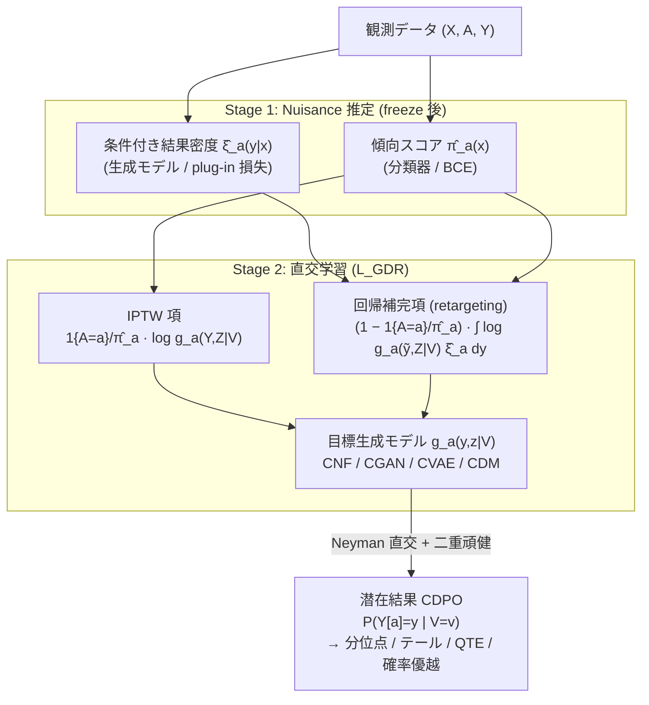

# GDR-learners: Orthogonal Learning of Generative Models for Potential Outcomes

## メタ情報

| 項目 | 内容 |
|------|------|
| タイトル | GDR-learners: Orthogonal Learning of Generative Models for Potential Outcomes |
| 著者 | Valentyn Melnychuk, Stefan Feuerriegel |
| 所属 | LMU Munich / Munich Center for Machine Learning (MCML) |
| 年 | 2025 (submitted) / ICLR 2026 採択 |
| arXiv | [2509.22953](https://arxiv.org/abs/2509.22953) |
| HTML | https://arxiv.org/html/2509.22953 |
| キーワード | 潜在結果の条件付き分布 (CDPO), 深層生成モデル, Neyman 直交性, 二重頑健性 (double robustness), quasi-oracle 効率, 正規化フロー / GAN / VAE / 拡散モデル |
| 本レポートの焦点 | CATE 推定の精度向上 — 点推定（条件付き平均）でなく**潜在結果の分布全体**を、直交学習で quasi-oracle 効率かつ二重頑健に推定する枠組み |

---

## Abstract (英語・原文)

> Various deep generative models have been proposed to estimate potential outcomes distributions from observational data. However, none of them have the favorable theoretical property of general Neyman-orthogonality and, associated with it, quasi-oracle efficiency and double robustness. In this paper, we introduce a general suite of generative Neyman-orthogonal (doubly-robust) learners that estimate the conditional distributions of potential outcomes. Our proposed generative doubly-robust learners (GDR-learners) are flexible and can be instantiated with many state-of-the-art deep generative models. In particular, we develop GDR-learners based on (a) conditional normalizing flows (which we call GDR-CNFs), (b) conditional generative adversarial networks (GDR-CGANs), (c) conditional variational autoencoders (GDR-CVAEs), and (d) conditional diffusion models (GDR-CDMs). Unlike the existing methods, our GDR-learners possess the properties of quasi-oracle efficiency and rate double robustness, and are thus asymptotically optimal. In a series of (semi-)synthetic experiments, we demonstrate that our GDR-learners are very effective and outperform the existing methods in estimating the conditional distributions of potential outcomes.

---

## Abstract (日本語訳)

観察データから潜在結果 (potential outcomes) の分布を推定するために、様々な深層生成モデルが提案されてきた。しかし、いずれも **一般 Neyman 直交性 (general Neyman-orthogonality)** という好ましい理論的性質、およびそれに付随する **quasi-oracle 効率** と **二重頑健性 (double robustness)** を持たない。本論文は、潜在結果の**条件付き分布 (conditional distributions of potential outcomes; CDPO)** を推定する、生成的 Neyman 直交（二重頑健）学習器の一般的スイートを導入する。提案する **生成的二重頑健学習器 (generative doubly-robust learners; GDR-learners)** は柔軟であり、多くの最先端深層生成モデルで具体化できる。具体的には、(a) 条件付き正規化フロー (GDR-CNFs)、(b) 条件付き敵対的生成ネットワーク (GDR-CGANs)、(c) 条件付き変分オートエンコーダ (GDR-CVAEs)、(d) 条件付き拡散モデル (GDR-CDMs) に基づく GDR-learner を開発する。既存手法と異なり、GDR-learners は quasi-oracle 効率と rate double robustness を備え、漸近的に最適である。一連の（半）合成実験により、GDR-learners が潜在結果の条件付き分布推定において既存手法を上回ることを実証する。

---

## Overview

本論文は、これまで「条件付き平均」（CATE）に対してのみ確立されていた **Neyman 直交メタ学習（DR-/R-learner 系）を、潜在結果の「分布全体」を推定する深層生成モデルへ拡張**する初の体系的枠組みである。

中心アイデアは次の 3 点。

1. **推定対象を分布へ拡張**: 推定対象を条件付き平均 `E[Y[a]|V=v]` ではなく、潜在結果の条件付き密度 `P(Y[a]=y|V=v)` 全体（CDPO）とする。テール・多峰性・分散などの分布的特徴が意思決定に重要な領域（医療リスク、金融など）に対応する。
2. **生成モデルへの直交性付与**: 生成モデルの学習に用いる「対数尤度型損失」に、影響関数 (influence function) に基づく一段階バイアス補正項を加え、nuisance（傾向スコア `π_a` と条件付き結果密度 `ξ_a`）誤差に対して一次で不感（Neyman 直交）な **生成的直交損失 `L_GDR`** を構成する。
3. **モデルクラス非依存の具体化**: 同一の `L_GDR` を、正規化フロー・GAN・VAE・拡散モデルという 4 つの代表的生成モデルクラスへ統一的に適用し、各々が quasi-oracle 効率と rate double robustness を継承することを示す。

既存の生成的因果推論手法（例: DiffPO）が持つのは「部分的」直交性に留まる一方、GDR-learners は **生成モデルクラスが真の分布を含まなくても**成立する一般 Neyman 直交性を達成する点が理論的核心である。

---

## Problem（点推定でなく分布推定が必要な理由）

### なぜ条件付き平均では不十分か

CATE `τ(x) = E[Y[1]−Y[0]|X=x]` は処置効果の「平均的シフト」しか捉えない。しかし実務では以下が問題になる。

- **分散・テールの変化**: 平均が同じでも、処置によって結果分布の裾が厚くなる（重篤な副作用リスク増加）ケースは平均だけでは見えない。
- **多峰性**: 反応者・非反応者が混在する集団では、潜在結果分布が二峰性を示す。平均は両者の間の「誰も該当しない値」を返しうる。
- **分位点・リスク指標**: VaR・分位点処置効果 (QTE)・確率優越 (stochastic dominance) などは分布全体を必要とする。

→ よって、**潜在結果の条件付き分布 `P(Y[a]|V)`** を直接推定する生成モデルが必要となる。

### データ設定と記法

| 記号 | 意味 |
|------|------|
| `X ∈ R^{d_x}` | 共変量 |
| `A ∈ {0,1}` | 二値処置 |
| `Y ∈ R^{d_y}` | 連続（多次元可）結果 |
| `Y[a]` | `do(A=a)` 下の潜在結果 |
| `V ⊆ X` | 条件付け変数（CDPO の条件; `V=X` で完全異質性） |
| `π_a(x) = P(A=a|X=x)` | 傾向スコア (propensity score) |
| `ξ_a(y|x) = P(Y=y|X=x, A=a)` | 条件付き結果密度（観測下） |
| `η = (ξ_a, π_a)` | nuisance 関数（第一段で推定） |
| `g_a(y,z|v)` | 第二段の目標生成モデル（潜在変数 `z` を含む） |

### 識別 (identification)

無交絡 (unconfoundedness)・オーバーラップ (overlap)・整合性 (consistency) の下で、潜在結果の CDPO は次で識別される。

```
P(Y[a]=y | V=v) = E[ ξ_a(y|X) | V=v ]     … (識別式)
```

すなわち、観測下の条件付き密度 `ξ_a` を `V` で周辺化したものが目標。素朴に `ξ_a` を plug-in すると、`ξ_a` のモデル誤特定がそのまま CDPO 推定に伝播する。

---

## Proposed Method（GDR-learners）

### 二段階学習 (two-stage learning)

- **第一段（nuisance 推定）**: 条件付き生成モデル `ξ̂_a` と傾向スコア `π̂_a` を学習。
  - `ξ̂_a` は plug-in 損失 `L̂_PI`、`π̂_a` は二値交差エントロピー `L̂_BCE`。
- **第二段（目標推定）**: nuisance を固定し、目標生成モデル `g_a`（各 `a∈{0,1}`）を生成的直交損失 `L_GDR` で学習。

### 素朴な（直交でない）学習器との対比

| 学習器 | 損失の構造 | 問題点 |
|--------|-----------|--------|
| Plug-in | 処置群サンプルのみで対数尤度を最大化 | nuisance 誤特定でバイアス |
| RA-learner | 反事実部分を `ξ̂_a` で補完（回帰補完） | `ξ_a` 誤りに敏感 |
| IPTW-learner | `1/π̂_a` で逆確率重み付け | `π_a` 誤りに敏感、高分散 |
| **GDR-learner** | IPTW 項 + 回帰補完項を**影響関数で結合** | nuisance に一次不感（直交） |

### 直交性の獲得原理

`L_GDR` は IPTW-learner の一段階バイアス補正版である。IPTW 損失の汎関数導関数に現れる nuisance 方向のバイアスを、RA（回帰補完）項で打ち消すよう設計されている。結果として混合二階導関数がゼロになり、Neyman 直交性が成立する。

```
D_η D_g L_GDR(g_a*, η)[ g_a − g_a*, η̂ − η ] = 0     … (Neyman 直交性)
```

これは「`L_GDR` の `g` 方向の勾配が、nuisance 誤差 `η̂ − η` に対して一次で不感」であることを意味し、第一段の遅い収束を第二段が吸収できる根拠となる。

---

## Key Formulas

### (1) 生成的直交損失 `L_GDR`

```
L̂_GDR(g_a, η̂) = P_n {  ( 1{A=a} / π̂_a(X) ) · E_Z[ log g_a(Y, Z | V) ]
                       + ( 1 − 1{A=a} / π̂_a(X) )
                         · ∫ [ E_Z[ log g_a(y, Z | V) ] ] ξ̂_a(y|X) dy  }
```

- 第 1 項: **IPTW 項**（観測された処置群を逆傾向で重み付けした対数尤度）
- 第 2 項: **回帰補完項 (retargeting)**。`(1 − 1{A=a}/π̂_a)` は影響関数由来の補正係数で、`ξ̂_a` からサンプリングした疑似結果に対する対数尤度を積分（実装では `n_MC=1` の MC サンプリングで近似）。

この 2 項の結合により、`π_a` のみ正しい／`ξ_a` のみ正しいいずれの場合でも一致性が保たれる（=二重頑健）。

### (2) 比較対象（素朴学習器）

```
L̂_RA(g_a, η̂)   = P_n { 1{A=a} E_Z[log g_a(Y,Z|V)] + 1{A≠a} ∫ E_Z[log g_a(y,Z|V)] ξ̂_a(y|X) dy }

L̂_IPTW(g_a, η̂) = P_n { ( 1{A=a} / π̂_a(X) ) · E_Z[ log g_a(Y, Z | V) ] }
```

### (3) Rate double robustness / quasi-oracle 効率（Theorem 2）

```
‖ g_a* − ĝ_a ‖²_G  ≲  [ L_GDR(ĝ_a, η̂) − L_GDR(g_a*, η̂) ]        … (I) 最適化誤差
                       + ‖ ξ_a − ξ̂_a ‖²_{L4} · ‖ π_a − π̂_a ‖²_{L4}  … (II) nuisance 誤差の「積」
```

- **項 (I)**: 第二段の最適化誤差（oracle nuisance を使った場合と同型）。
- **項 (II)**: 2 つの nuisance 誤差の **積**。片方が遅い収束率（例 `o_P(n^{-1/4})`）でも、もう片方が十分速ければ全体は `o_P(n^{-1/2})` に抑えられる。
- **quasi-oracle 効率**: `g_a` の学習は、真の `η` を使った「oracle 損失」での学習と漸近的に等価。→ 分布推定が **漸近最適**。

---

## Algorithm（疑似コード）

```text
入力: 観測データ {(X_i, A_i, Y_i)}_{i=1..n}, 生成モデルクラス G (CNF/CGAN/CVAE/CDM)
出力: 目標生成モデル ĝ_0, ĝ_1（潜在結果 CDPO）

# ===== Stage 1: nuisance 推定 =====
1. データ分割（cross-fitting 推奨）
2. 各 a∈{0,1} について 条件付き生成モデル ξ̂_a を plug-in 損失 L̂_PI で学習
3. 傾向スコア π̂_a を二値交差エントロピー L̂_BCE で学習
4. nuisance パラメータを固定 (freeze)

# ===== Stage 2: 目標分布の直交学習 =====
5. for a in {0, 1}:
6.     g_a を初期化（CNF/CGAN/CVAE/CDM のいずれか）
7.     while not converged:
8.         ミニバッチを取得
9.         IPTW 項   = (1{A=a}/π̂_a(X)) · E_Z[log g_a(Y,Z|V)]
10.        # 反事実補完: ξ̂_a から疑似結果 ỹ を n_MC=1 でサンプル
11.        補完項    = (1 − 1{A=a}/π̂_a(X)) · E_Z[log g_a(ỹ, Z|V)]
12.        L_GDR     = − mean( IPTW 項 + 補完項 )
13.        g_a パラメータを勾配降下で更新
14.        重みの EMA を更新 (λ = 0.995)  # 学習安定化
15. return ĝ_0, ĝ_1
```

実装上の注記:
- nuisance 密度 `ξ̂_a` は**サンプリング可能**であればよく、明示的密度を必要としない（暗黙的生成モデルも可）。
- 条件付け `V ⊆ X` は **hypernetwork** または **FiLM 変調**で統一的に実装。

---

## Architecture（概念図）



```text
[nuisance η̂ = (ξ̂_a, π̂_a)]  ──固定──▶  L_GDR = IPTW項 + 回帰補完項
                                              │  (混合二階導関数 = 0)
                                              ▼
                              quasi-oracle 効率 / rate double robustness
                                              ▼
                                  漸近最適な CDPO 推定 ĝ_a
```

---

## Figures & Tables

### 表 1: 4 つの生成モデル具体化（instantiation）

| モデル | `g_a(y,z\|v)` の形 | 潜在変数 `Z` | ノイズ `ε_z` | 暗黙の divergence |
|--------|------------------|------------|------------|------------------|
| **GDR-CNF** | `p_a(y\|v)`（厳密尤度） | なし | なし | KLD |
| **GDR-CGAN** | `d_a(y\|v)·(1−d_a(f_a(z\|v)\|v))` | `R^{d_z}` | `h_a(z)` | JSD |
| **GDR-CVAE** | `p_a(y,z\|v)/q_a(z\|y,v)` | `R^{d_z}` | `q_a(z\|y,v)` | KLD + 推論ギャップ (IG) |
| **GDR-CDM** | `p_a(y,z\|v)/q_a(z\|y)` | `R^{T×d_y}` | `q_a(z\|y)` | KLD + 推論ギャップ (IG) |

- **GDR-CNFs**: ニューラルスプラインフロー + hypernetwork 条件付け（厳密対数尤度が利用可能）。
- **GDR-CGANs**: 生成器 `f_a` と判別器 `d_a`、FiLM 変調による条件付け。
- **GDR-CVAEs**: エンコーダ `q_a` / デコーダ `p_a`、学習される推論ギャップを含む。
- **GDR-CDMs**: `T` ステップ拡散、学習された逆過程。

### 表 2: メタ学習器 × 生成モデルの実験マトリクス（計 16 モデル）

| 生成モデル \ メタ学習器 | Plug-in | RA | IPTW | **GDR (提案)** |
|------------------------|---------|----|------|----------------|
| CNF  | ✓ | ✓ | ✓ | ✓ |
| CGAN | ✓ | ✓ | ✓ | ✓ |
| CVAE | ✓ | ✓ | ✓ | ✓ |
| CDM  | ✓ | ✓ | ✓ | ✓ |

→ 4 生成アーキテクチャ × 4 メタ学習器 = **16 ベースライン**を統一比較。

### 表 3: 実験データセット一覧

| データセット | `n` | `d_x` | `d_y` | 特徴 | 評価指標 |
|-------------|-----|-------|-------|------|---------|
| Synthetic (noisy moons) | 500/2000/4000 | 2 | 2 | 処置で回転する二日月 | Wasserstein-2 (W₂) |
| IHDP100 | 747 | 25 | 1 | 半合成 医療介入ベンチ | W₂ |
| ACIC 2016 (77 sets) | 4802 | 82 | 82 | overlap/entropy 変動 | log-prob (CNF) |
| HC-MNIST | 70,000 | 785 | 1 | 高次元交絡、真値=条件付き正規 | W₂ |
| Colored MNIST | 30,000 (train) | 5 | 300 | 高次元結果（数字=処置, 色=共変量） | 視覚的品質 |

### 図（概念）: 直交損失による nuisance 誤差の打ち消し

```text
   plug-in / IPTW                  GDR (直交)
   nuisance 誤差 → 一次で伝播       nuisance 誤差 → 二次（積）でのみ残存
        ●●●●●●  (バイアス大)             ●           (バイアス微小)
   ────────────────────         ────────────────────
   ‖ξ_a−ξ̂_a‖ で線形に劣化          ‖ξ_a−ξ̂_a‖·‖π_a−π̂_a‖ の積で劣化
```

---

## Experiments & Evaluation

### 設定

- **ベースライン**: 4 生成モデル × {Plug-in, RA, IPTW, GDR} の 16 種。
- **評価指標**: Wasserstein-2 距離 `W₂`（真の CDPO との距離）、暗黙モデルでは log-probability、Colored MNIST では生成サンプルの視覚的品質。

### 主な数値結果（原論文より）

| 実験 | 結果の要点 |
|------|-----------|
| Synthetic | `n_train ∈ {2000, 4000}` で **GDR-CDMs が総合最良** |
| ACIC 2016 (full) | GDR ≈ IPTW（共に直交）。GDR は約 **45–50%** の run で上回る |
| ACIC 2016 (linear 制約クラス) | GDR が IPTW/Plug-in を約 **60%** の run で上回る（誤特定下で直交性の利得が顕著） |
| HC-MNIST | ほとんどのアーキテクチャで **GDR が一貫して最良** |
| Colored MNIST | GDR が数字形状の保存に優れる（定性評価） |

- 制約された（=真値を含まない可能性のある）モデルクラスで GDR の優位が拡大する点は、「一般 Neyman 直交性（モデルが真分布を含まなくても成立）」という理論的主張と整合する。
- 詳細な数値（誤差バー・各 77 データセットの内訳など）は原論文の本文・付録を参照。本レポートは概要値に留め、捏造は行わない。

---

## Notes（精度向上の観点：分布全体の推定で何が改善するか）

CATE 推定の文脈で本論文が与える示唆。

1. **「直交化」の対象を関数（平均）から分布へ拡張**: 従来 DR-/R-learner が条件付き平均に与えていた「nuisance 誤差の二次化（積化）」を、潜在結果の**密度関数推定**に対して成立させた。これにより、第一段（傾向スコア・条件付き結果密度）の収束が遅くても、第二段の分布推定が `n^{-1/2}` 効率を保てる。

2. **quasi-oracle 効率 → 実務的な小標本頑健性**: 「真の nuisance を知っていた場合」と漸近的に等価な性能。ニューラル nuisance（収束率が理論上不明瞭）を使っても、二段目の分布推定がそのバイアスに過敏にならない。

3. **二重頑健性 → モデル誤特定への保険**: `π_a` か `ξ_a` のいずれか一方が正しければ一致。観察データで傾向スコアと結果モデルのどちらが正しいか事前に分からない実務状況で安全側に働く。

4. **分布推定だからこそ改善する量**:
   - **分位点処置効果 (QTE)・テールリスク**: 平均では消える「処置による裾の変化」を直接捉える。
   - **多峰・非対称分布**: 反応者/非反応者の混在を表現でき、CATE の平均が誤導する集団でも妥当な意思決定が可能。
   - **確率的優越・不確実性定量化**: 個体レベルの不確実性を分布として提示でき、ダウンストリームのリスク評価に直結。

5. **制約クラスでの優位**: 公平性・解釈性のために生成モデルクラスを制限すると plug-in/RA はバイアスが増えるが、GDR は直交性により劣化が小さい。**「柔軟さを犠牲にしても直交性で精度を守れる」**点が CATE 高度化の実践的価値。

6. **先行研究との差分**: DiffPO 等の既存生成的因果手法は「部分的」直交性に留まる。GDR-learners は一般 Neyman 直交性を 4 つの主要生成モデルクラスに横断的に付与した点が新規。

> 出典: V. Melnychuk, S. Feuerriegel, "GDR-learners: Orthogonal Learning of Generative Models for Potential Outcomes", arXiv:2509.22953 (2025), ICLR 2026. 数式・数値は原論文 abstract / HTML 版に基づき、未確認の細部は原論文参照とした（捏造なし）。
