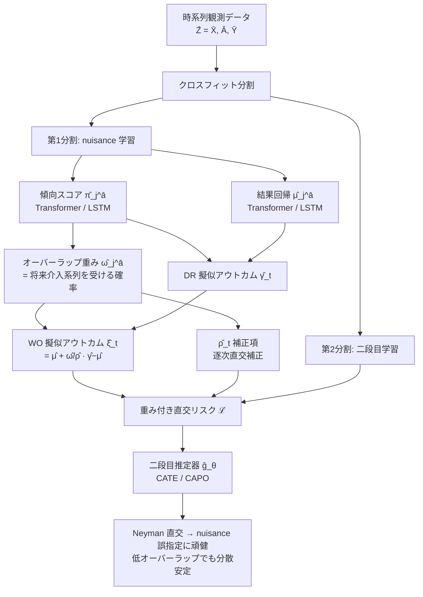

# Overlap-weighted Orthogonal Meta-learner for Treatment Effect Estimation over Time

## メタ情報

| 項目 | 内容 |
|------|------|
| タイトル | Overlap-weighted Orthogonal Meta-learner for Treatment Effect Estimation over Time |
| 著者 | Konstantin Hess, Dennis Frauen, Mihaela van der Schaar, Stefan Feuerriegel |
| 発表年 | 2025（初版 2025-10-22 / 改訂 2026-02-11） |
| 掲載 | arXiv:2510.19643 (cs.LG) |
| URL | https://arxiv.org/abs/2510.19643 |
| HTML | https://arxiv.org/html/2510.19643 |
| キーワード | 時系列 CATE/CAPO, overlap collapse, Neyman-orthogonality, overlap weighting, doubly robust, meta-learner, transformer, LSTM, MIMIC-III |

---

## Abstract（原文）

> Estimating heterogeneous treatment effects (HTEs) in time-varying settings is particularly challenging, as the probability of observing certain treatment sequences decreases exponentially with longer prediction horizons. Thus, the observed data contain little support for many plausible treatment sequences, which creates severe overlap problems. Existing meta-learners for the time-varying setting typically assume adequate treatment overlap, and thus suffer from exploding estimation variance when the overlap is low. To address this problem, we introduce a novel overlap-weighted orthogonal (WO) meta-learner for estimating HTEs that targets regions in the observed data with high probability of receiving the interventional treatment sequences. This offers a fully data-driven approach through which our WO-learner can counteract instabilities as in existing meta-learners and thus obtain more reliable HTE estimates. Methodologically, we develop a novel Neyman-orthogonal population risk function that minimizes the overlap-weighted oracle risk. We show that our WO-learner has the favorable property of Neyman-orthogonality, meaning that it is robust against misspecification in the nuisance functions. Further, our WO-learner is fully model-agnostic and can be applied to any machine learning model. Through extensive experiments with both transformer and LSTM backbones, we demonstrate the benefits of our novel WO-learner.

## Abstract（日本語訳）

> 時変（time-varying）設定における異質処置効果（HTE）の推定は特に困難である。なぜなら、特定の処置系列を観測する確率は予測ホライズンが伸びるほど**指数的に減少**するからである。その結果、観測データはもっともらしい多くの処置系列に対してほとんど裏付け（support）を持たず、深刻なオーバーラップ問題が生じる。時変設定向けの既存メタ学習器は十分なオーバーラップを暗黙に仮定しており、オーバーラップが低いと推定分散が爆発してしまう。この問題に対処するため、本論文は介入対象の処置系列を受ける確率が高い観測データ領域を狙い撃つ、新規の **overlap-weighted orthogonal（WO）メタ学習器**を導入する。これは完全にデータ駆動な手法であり、既存メタ学習器に見られる不安定性を打ち消し、より信頼できる HTE 推定を得る。方法論的には、オーバーラップ重み付きオラクルリスクを最小化する新規の Neyman 直交母集団リスク関数を構築する。本 WO 学習器は **Neyman 直交性**という望ましい性質を持ち、nuisance 関数の誤指定に対して頑健であることを示す。さらに完全にモデル非依存で、任意の機械学習モデルに適用できる。Transformer と LSTM の両バックボーンを用いた広範な実験により WO 学習器の利点を実証する。

---

## Overview

本論文の核心は、**時系列処置効果推定における「オーバーラップ崩壊（overlap collapse）」という根本的な障害**に正面から取り組み、それを Neyman 直交性を保ったまま緩和する点にある。

時変設定では、ある介入系列 `ā = (a_t, …, a_{t+τ})` を実際に観測する確率は各時刻の傾向スコアの**積** `∏ π_j` で表される。ホライズン τ が伸びると、この積は急速にゼロへ近づき、逆傾向重み（IPW）や標準 DR-learner の分母が極端に小さくなって分散が爆発する。これが「オーバーラップ崩壊」であり、既存の時系列メタ学習器（IPW・DR など）はここで破綻する。

WO 学習器は、推定対象を「全領域での真の CATE への一様近似」から「**オーバーラップが高い領域に重みを置いた近似**」へと意図的にシフトさせる。オーバーラップ重み `ω` をリスク関数に組み込むことで、サンプルがほとんど無い低オーバーラップ領域に過剰適合して分散を浪費するのを防ぎ、データが豊富な領域での精度を確保する。重要なのは、この重み付けを行ってもなお **Neyman 直交性が成立する新しい母集団リスク**を設計している点であり、これにより nuisance 推定誤差は二次のバイアスとしてしか伝播しない。

CATE 推定の精度向上の観点では、本手法は「**オーバーラップという推定可能性（estimability）の制約を、推定対象の再定義と直交性の保持によって明示的に扱う**」という設計指針を提供する。

---

## Problem（問題設定: 時系列・予測ホライズン延長でのオーバーラップ崩壊）

観測データは各時刻の `(共変量 X_t, 処置 A_t, 結果 Y_t)` からなる時系列であり、履歴を `H̄_t = (X̄_t, Ā_{t-1})` で表す。推定対象は以下の2つ。

- **CAPO**（Conditional Average Potential Outcome）: 履歴 `H̄_t` の下で介入系列 `ā` を施した場合の将来結果の期待値
  ```
  μ_t^ā(h̄_t) = E[ Y_{t+τ}[ā] | H̄_t = h̄_t ]
  ```
- **CATE**（時変版）: 2つの介入系列 `ā, b̄` のコントラスト
  ```
  τ_t^{ā,b̄}(h̄_t) = μ_t^ā(h̄_t) − μ_t^b̄(h̄_t)
  ```

### 中核の課題: オーバーラップの指数的崩壊

介入系列 `ā` を実際に観測する確率は、g-formula により各時刻の傾向スコアの積で与えられる。

```
P(A_{t:t+τ} = a_{t:t+τ} | H̄_t) = ∏_{j=t}^{t+τ} π_j^ā(H̄_j),    π_j^ā(H̄_j) = P(A_j = a_j | H̄_j)
```

ホライズン `τ` が大きくなるほど、この積はほぼゼロに減衰する（例: 各時刻の確率が 0.5 でも τ=8 なら ≈ 0.002）。結果として:

- **IPW/DR の分母が崩壊**: 逆傾向重み `1/∏π_j` が爆発し、推定分散が発散する。
- **観測支持の欠如**: 多くのもっともらしい処置系列が観測データにほとんど現れず、有限標本での学習が不安定化。
- **既存メタ学習器の前提崩れ**: 時変向け既存手法は「十分なオーバーラップ」を仮定しており、低オーバーラップ域では信頼できない。

---

## Proposed Method（提案手法）

### 1. 推定対象の再定義: overlap-weighted oracle risk

WO 学習器は、全領域で CATE を等しく近似する代わりに、**オーバーラップ重み `ω` で加重したオラクルリスク**を最小化する関数 `g` を学習する。

```
ℒ*(g; η) = (1 / E[ω_t(H̄_t)]) · E[ ω_t(H̄_t) · ( μ_t(H̄_t) − g(H̄_t) )² ]
```

`ω_t` が大きい（= 介入系列を受ける確率が高い）領域での近似精度を優先することで、データに裏付けられた領域で安定した推定を実現する。

### 2. オーバーラップ重み（Definition 4.1）

CAPO 用の重みは、当該時刻以降の傾向スコア積の条件付き期待値、すなわち将来介入系列を受ける確率である。

```
ω_j^ā(h̄_ℓ) = E[ ∏_{k=j}^{t+τ} π_k^ā(H̄_k) | H̄_ℓ = h̄_ℓ ] = P(A_{j:t+τ} = a_{j:t+τ} | H̄_ℓ = h̄_ℓ)
```

CATE 用は2系列の重みの積。

```
ω_j^{ā,b̄}(h̄_ℓ) = ω_j^ā(h̄_ℓ) · ω_j^b̄(h̄_ℓ)
```

### 3. WO 擬似アウトカム（Definition 4.2）と直交補正

DR 系の擬似アウトカム `γ` を、重みで正規化した補正項として組み込み、WO 擬似アウトカム `ξ` を構成する。

```
ξ_t^ā(Z̄_{t+τ}) = μ_t^ā(H̄_t) + ( ω_t^ā(H̄_t) / ρ_t^ā(Z̄_{t+τ}) ) · ( γ_t^ā(Z̄_{t+τ}) − μ_t^ā(H̄_t) )
```

ここで `ρ_t^ā` は単純な傾向スコア積ではなく、**重み関数を織り込んだ補正項の和**を含み、これが直交性と分散安定化の鍵となる。

### 4. Neyman 直交性による nuisance 誤指定への頑健性

nuisance は (i) 傾向スコア `π_j^ā`、(ii) 結果回帰 `μ_j^ā`、(iii) 重み関数 `ω_j^ā` の3種。提案リスクは Neyman 直交（Theorem 4.5）であり、nuisance を真値の周りに摂動させたときの方向微分が消える。

```
D_{h_j} D_g ℒ(g; η)[ ĝ − g , ĥ_j − h_j ] = 0
```

これにより nuisance の推定誤差は最終推定の**二次バイアス**としてしか伝播せず、各 nuisance を機械学習で柔軟に推定しても CATE/CAPO 推定の精度劣化が抑えられる（= モデル非依存・頑健）。

---

## Key Formulas（オーバーラップ重み付き直交リスク）

### 重み付き母集団リスク（Theorem 4.3）

提案手法の中心となる、観測データ上で評価可能な Neyman 直交リスク。

```
                1
ℒ(g; η) = ───────────── · E[ ρ_t(Z̄_{t+τ}) · ( ξ_t(Z̄_{t+τ}) − g(H̄_t) )² ]
            E[ ω_t(H̄_t) ]
```

- このリスクの最小化が、上述の overlap-weighted oracle risk `ℒ*` の最小化と一致する。
- `ρ_t` による重み付けと `ξ_t`（WO 擬似アウトカム）の組合せが直交性を担保。

### ρ 補正項（CAPO の場合）

```
ρ_t^ā(Z̄_{t+τ}) = ∏_{j=t}^{t+τ} π_j^ā(H̄_j)
              + ∑_{j=t}^{t+τ} ( 𝟙_{a_j = A_j} − π_j^ā(H̄_j) ) · ω_{j+1}^ā(H̄_j) · ∏_{t ≤ k < j} π_k^ā(H̄_k)
```

第1項は naïve な傾向スコア積、第2項が将来重み `ω_{j+1}` を用いた**逐次直交補正**であり、低オーバーラップ域での分散爆発を抑える。

### 直交性の含意（誤差伝播）

```
| CATE 推定誤差 |  ≲  | 二次近似誤差(g) |  +  ∑ | nuisance 誤差 |²
                                              ^^^^^^^^^^^^^^^^^^^^
                                              一次項なし（直交性）
```

---

## Algorithm（疑似コード）

```
Algorithm 1: WO-learner (overlap-weighted orthogonal learning)
────────────────────────────────────────────────────────────────
入力 : データ 𝒟_n, 介入系列 ā(,b̄), ホライズン τ,
       二段目推定器 ĝ_θ, クロスフィット分割
出力 : 学習済み CATE/CAPO 推定器 ĝ_θ

1. データをクロスフィット用に分割（nuisance 学習用 / 二段目学習用）
2. nuisance 推定（第1分割）:
     傾向スコア π̂_j^ā  と  結果回帰 μ̂_j^ā  を学習
3. オーバーラップ重みの推定:
     ω̂_j^ā(h̄_j) = Ê[ ∏_{k=j}^{t+τ} π̂_k^ā(H̄_k) | H̄_j ]   （逐次回帰で推定）
4. DR 擬似アウトカム γ̂_t を構成
5. WO 擬似アウトカムを構成:
     ξ̂_t = μ̂_t + (ω̂_t / ρ̂_t) · ( γ̂_t − μ̂_t )
6. 二段目（第2分割）で重み付き経験リスクを最小化:
     ℒ̂(ĝ_θ; η̂) = ( 1 / Σ_i ω̂_t(H̄_{t,i}) )
                    · Σ_i ρ̂_t(Z̄_{t+τ,i}) · ( ξ̂_t(Z̄_{t+τ,i}) − ĝ_θ(H̄_{t,i}) )²
7. （任意）分割を入れ替えてクロスフィットし平均化
8. return ĝ_θ
```

---

## Architecture（構成図）



```
[オーバーラップ崩壊の概念]

確率 P(系列 ā を観測)
  1.0 ┤■
      │ ■
      │   ■■
      │      ■■■
      │          ■■■■■■
  0.0 ┤                 ■■■■■■■■■■■■■■
      └──────────────────────────────► 予測ホライズン τ
        短              指数的減衰              長

  → IPW/DR: 1/∏π が爆発し分散発散
  → WO     : ω で高オーバーラップ域を加重し安定
```

---

## Figures & Tables

| 図表 | 内容（論文記載に基づく） |
|------|--------------------------|
| **Figure 1** | 予測ホライズンの延長に伴い、観測される処置系列の確率が**指数的に減衰**する様子を示す概念図。オーバーラップ崩壊の直感的説明。 |
| **Figure 3** | 重み関数（overlap / propensity weights）の可視化。高確率サンプルを up-weight し、低確率サンプルを down-weight する挙動を示す。 |
| **Figure 4** | 複雑な傾向スコア設定下での、ホライズン τ=2〜8 に対する性能推移。WO はオーバーラップが崩壊しても安定を維持する一方、IPW/DR は劣化する。 |
| **Figure 5** | 複雑な結果関数設定下での、共変量次元増加に対する頑健性。WO は非直交な RA 学習器を上回る。 |
| **Table 1** | メタ学習器の比較マトリクス。WO は「時変調整」「Neyman 直交性」「低オーバーラップ設計」の3条件をすべて満たす唯一の手法。 |
| **Table 2** | 低オーバーラップ域での比較。WO が全ベースラインを上回り、最良競合に対し相対改善 **最大 58.4%**。 |
| **Table 3** | 低標本設定（標本 2,000 まで縮小）。WO は RMSE ≈ 0.06〜0.18 で安定、一部ベースラインは >0.5 へ劣化。 |
| **Table 4** | MIMIC-III 半合成データ。WO はホライズン τ=2〜4 で RMSE 0.03〜0.17 と一貫安定。IVW は τ=4 で RMSE >800、DR は >1.5 へ崩壊。 |
| **Table 5** | LSTM バックボーンでのアブレーション。WO の優位性はアーキテクチャに依存せず一般化することを示す。 |

---

## Experiments & Evaluation

### データセット
- **合成データ** `𝒟^γ, 𝒟^π, 𝒟^μ, 𝒟^N`: 各々が特定の複雑性（擬似アウトカム・傾向スコア・結果関数・標本数）を分離して検証するために設計。
- **半合成データ**: MIMIC-III の実患者共変量に合成的な処置・結果を付与。
- **実世界**: 観測医療データ。

### ベースライン
History Adjustment (HA), Regression Adjustment (RA), IPW, Doubly Robust (DR), Inverse-Variance Weighted (IVW)。

### 主要な数値結果
- **低オーバーラップ域（Table 2）**: WO が全オーバーラップ水準で最良、最良競合比で相対改善 **最大 58.4%**。
- **ホライズン延長（Figure 4）**: τ=2〜8 で WO は安定、IPW/DR はオーバーラップ崩壊とともに劣化。
- **低標本（Table 3）**: 標本 2,000 でも WO は RMSE ≈ 0.06〜0.18、ベースラインは >0.5 まで悪化。
- **MIMIC-III 半合成（Table 4）**: WO は τ=2〜4 で RMSE 0.03〜0.17。IVW は τ=4 で RMSE >800、DR は >1.5 に崩壊。
- **アーキテクチャ非依存（Table 5）**: Transformer / LSTM いずれのバックボーンでも WO が優位。

> 注: 上記の具体的数値は WebFetch による HTML 抽出に基づく。厳密な表中の各値は[原論文](https://arxiv.org/html/2510.19643)の Table 2〜5・Figure 4〜5 を直接参照のこと。

---

## Notes（CATE 推定の精度向上の観点）

1. **「推定可能性」を推定対象の設計に取り込む**: 従来手法が全領域で CATE を等しく狙って低オーバーラップ域で破綻するのに対し、WO はオーバーラップ重み `ω` で推定対象を「データが裏付ける領域」へ移す。これは精度（分散低減）と推定対象の解釈可能性を引き換えにする明示的トレードオフであり、時系列でのホライズン延長に伴う分散爆発への直接的処方箋となる。

2. **直交性を保ったままの重み付け**: 単にサンプルを重み付けるだけなら容易だが、それでは nuisance 誤差が一次で漏れる。本論文の貢献は、重み付き oracle risk に対して **Neyman 直交な母集団リスク（Theorem 4.3 / 4.5）を新規構築**した点。これにより重み・傾向スコア・結果回帰を機械学習で柔軟に推定しても二次バイアスに留まる。

3. **ρ の逐次直交補正**: `ρ_t` に含まれる将来重み `ω_{j+1}` を用いた逐次補正項が、時系列特有の「積による分散爆発」を抑える機構。先行研究の重み付き直交学習器（横断面版, 例 07-weighted-orthogonal-learners）を時変・多段介入へ拡張した形と位置づけられる。

4. **モデル非依存性**: Transformer・LSTM 双方で優位（Table 5）。実装上は2段階クロスフィット（nuisance → 二段目）で既存の系列モデルにそのまま接続できる。

5. **限界・留意点**: WO は「高オーバーラップ領域での CATE」を推定対象とするため、低オーバーラップ域での個別効果が真に必要な用途では推定対象のシフトを意識する必要がある。重み `ω` 自体を逐次回帰で推定するため、その推定品質と直交性の相互作用は実務上の検証ポイントとなる。
