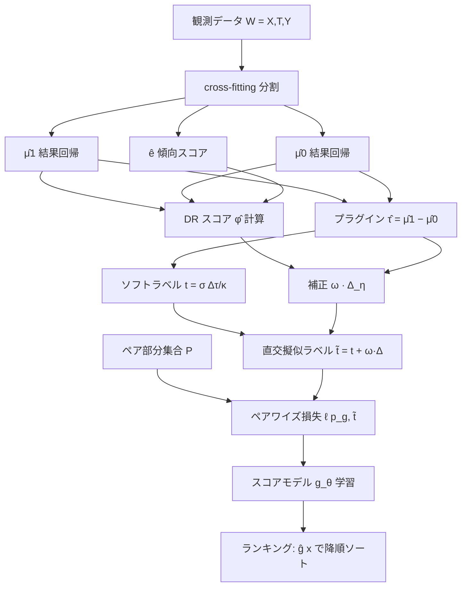

# Rank-Learner: 処置効果の直交ランキング

> **対象観点**: CATE 推定の精度向上 — CATE の絶対値を陽に推定せず、**処置効果の順序（ranking）を直交学習で直接学習**する。
> ペアワイズ目的 + Neyman 直交性により、ニューサンス推定誤差に頑健なランキングを獲得し、標準 CATE 推定器を介した「推定→ソート」の二段構成を回避する。

---

## メタ情報

| 項目 | 内容 |
|------|------|
| タイトル | Rank-Learner: Orthogonal Ranking of Treatment Effects |
| 著者 | Henri Arno, Dennis Frauen, Emil Javurek, Thomas Demeester, Stefan Feuerriegel |
| 年 | 2026 |
| 掲載 | ICML 2026（accepted） |
| URL | https://arxiv.org/abs/2602.03517 |
| HTML | https://arxiv.org/html/2602.03517 |
| キーワード | CATE ranking, treatment effect ordering, pairwise objective, Neyman orthogonality, doubly robust score, uplift, AUUC/AUTOC |

---

## Abstract（原文・英語）

> Many decision-making problems require ranking individuals by their treatment effects rather than estimating the exact effect magnitudes — for example, prioritizing patients for preventive care interventions, or ranking customers by the expected incremental impact of an advertisement. We introduce **Rank-Learner**, a novel two-stage learner that directly learns the ranking of treatment effects from observational data through a Neyman-orthogonal pairwise objective, without explicit CATE estimation. The approach is Neyman-orthogonal and thus provides robustness to estimation errors in the nuisance functions. Rank-Learner is model-agnostic and can be instantiated with arbitrary machine learning models (e.g., neural networks). Across synthetic, semi-synthetic, and real-world benchmarks, Rank-Learner consistently outperforms standard CATE estimators and non-orthogonal ranking methods.

> 注: 上記は arXiv abstract / HTML から抽出した要旨であり、一部は要約的に整形している。正確な逐語表現は原論文を参照のこと。

---

## Abstract（日本語訳）

> 多くの意思決定問題では、処置効果の正確な「大きさ」を推定することよりも、各個人を処置効果で**順序づける（ランキングする）**ことが求められる。例えば、予防的介入のために患者を優先順位づけする、あるいは広告の期待増分インパクト（incremental impact）で顧客を並べる、といった場面である。本研究は **Rank-Learner** を提案する。これは観測データから処置効果の順序を、**Neyman 直交なペアワイズ目的関数**を介して直接学習する二段階学習器であり、CATE を陽に推定しない。本手法は Neyman 直交性を持つため、ニューサンス関数の推定誤差に対して頑健である。また model-agnostic であり、任意の機械学習モデル（例: ニューラルネット）で実装できる。合成・半合成・実データのベンチマークにおいて、Rank-Learner は標準的な CATE 推定器および非直交ランキング手法を一貫して上回る。

---

## Overview

CATE 推定の従来パイプラインは「(1) CATE τ(x) を推定 → (2) 推定値でソート」という二段構成である。しかし**意思決定で必要なのは順序のみ**である場面が多く（誰を先に介入するか）、絶対値の精度はオーバースペックになりがちである。絶対値推定は順序学習より難しく、ニューサンス誤差が順序にまで波及する。

Rank-Learner は**順序を学習対象そのもの**に据える:

```
従来:  τ̂(x) を推定 → ソート              （絶対値の誤差が順序に流入）
本論文: 「τ(x) > τ(x') か?」を直接学習     （ペアワイズ目的 + 直交化で誤差を2次へ）
```

中核は **直交ランキング損失 L^orth**。ソフトなペアワイズ・ターゲット t_τ を、**二重頑健スコア φ_η** に基づく補正項で直交化し、ニューサンス η=(μ₁,μ₀,e) の一次誤差を打ち消す。これにより小標本・ニューサンス誤差が大きい領域でランキング精度（AUTOC / AUUC）が大きく改善する。

---

## Problem Setting（問題設定）

観測 W=(X,T,Y) ~ ℙ。X∈𝒳⊆ℝ^d（共変量）、T∈{0,1}（処置）、Y∈ℝ（アウトカム）。潜在アウトカム枠組みで CATE は:

```
τ(x) = E[ Y(1) − Y(0) | X = x ]
```

**識別（Assumption 3.1）**: consistency, positivity (0<e(x)<1), unconfoundedness (Y(t) ⊥ T | X) のもとで

```
τ(x) = μ_1(x) − μ_0(x)
```

ニューサンス関数 η = (μ₁, μ₀, e):
- 結果回帰(response surface): μ_t(x) = E[Y | T=t, X=x]
- 傾向スコア(propensity): e(x) = P(T=1 | X=x)

**目標**: スコア関数 g: 𝒳 → ℝ を学習し、**順序を保存**する:

```
g(x) > g(x')   ⟺   τ(x) > τ(x')
```

**課題（順序が重要な実務）**: ターゲティング・トリアージ・uplift マーケティングでは「上位 k% に誰を入れるか」のみが効用に効く。CATE の絶対値を正確に出すのは難しく、ニューサンス誤差がプラグイン推定 τ̂=μ̂₁−μ̂₀ に**一次（線形）で流入**し、順序を乱す。順序を直接学習し、かつ直交化で誤差を**二次へ**封じ込めるのが本質的狙い。

---

## Proposed Method: Rank-Learner

### 設計思想

ランキングは本質的に**ペアワイズ**問題である。任意の 2 サンプル (X, X') を取り、「どちらの処置効果が大きいか」を学習する。スコア差をシグモイドに通した確率

```
p_g(X,X') = σ( g(X) − g(X') )
```

を、ペアの真の順序確率に当てるように g を訓練する（学習-to-rank の RankNet 型定式化）。

### 損失の階層

**(1) Binary ranking loss（oracle、真の τ が既知なら）**

```
L^bin(g,η) = E_{X,X'} [ ℓ( p_g(X,X'),  b_τ(X,X') ) ]
   b_τ(X,X') = 𝟙{ τ(X) > τ(X') }                       … 硬いペアラベル
```

**(2) Soft ranking loss（平滑代理）**

```
L^soft(g,η) = E_{X,X'} [ ℓ( p_g(X,X'),  t_τ(X,X') ) ]
   t_τ(X,X') = σ( (τ(X) − τ(X')) / κ )                  … 平滑度 κ>0 のソフトラベル
```

ここで ℓ(p,t) = −t·log p − (1−t)·log(1−p) は二値クロスエントロピー。κ→0 で t_τ→b_τ。

soft 化により、τ が近いペアの寄与を滑らかにし、微分可能で**直交化が可能**な形になる。

### 二段階構成

- **Stage 1 — ニューサンス学習**: cross-fitting で η̂=(μ̂₁, μ̂₀, ê) を任意の ML で推定。
- **Stage 2 — 直交ランキング学習**: 後述の **L^orth** を最小化して g を学習。
- **Stage 3 — 推論**: 各個人をスコア ĝ(x_i) で並べるだけ（ペア比較は不要、O(n)）。

---

## Key Formulas（ペアワイズ直交ランキング損失）

### Neyman-orthogonal ranking loss（Theorem 5.1）

```
L^orth(g,η) = E_{W,W'} [ ℓ( p_g(X,X'),  t̃_η(W,W') ) ]
```

**直交化された擬似ラベル**（ソフトラベル t_τ を二重頑健スコア差で補正）:

```
t̃_η(W,W') = t_τ(X,X')  +  ω_τ(X,X') · Δ_η(W,W')
```

**補正重み**（soft ラベルの局所感度 = シグモイドの微分）:

```
ω_τ(X,X') = (1/κ) · t_τ(X,X') · ( 1 − t_τ(X,X') )
```

**二重頑健スコア差**（各サンプルの DR スコアから真の τ を引いた残差の差）:

```
Δ_η(W,W') = ( φ_η(W) − τ(X) )  −  ( φ_η(W') − τ(X') )
```

**二重頑健スコア φ_η（AIPW / DR pseudo-outcome）**:

```
            T                       1 − T
φ_η(W) = ───── (Y − μ_1(X))  −  ───────── (Y − μ_0(X))  +  μ_1(X) − μ_0(X)
          e(X)                    1 − e(X)
```

- φ_η は E[φ_η(W)|X=x] = τ(x) を満たす（真のニューサンスで不偏）。
- 補正項 ω_τ·Δ_η が、ソフトラベルにニューサンス誤差が一次で混入するのを打ち消す。

**直交性（Neyman orthogonality）**:

```
D_η D_g L^orth(g⁰, η⁰)[Δg, Δη] = 0
```

すなわち、真の (g⁰, η⁰) において、損失の g 方向勾配は η の摂動 Δη に対して一次で不変。ニューサンス誤差は**二次（積）**でしか効かない ⇒ ランキング精度の頑健性。

### 母集団最小化解（Theorem 5.2）

真のニューサンス η⁰ のもとで L^orth の最小化解は

```
g(x) = (1/κ) · τ⁰(x) + c      （任意定数 c）
```

すなわち g は τ⁰ の**単調変換**であり、**処置効果の順序を正しく復元**する（絶対値ではなく順序が保証される点が要）。

---

## Algorithm（疑似コード）

```
入力: データ {W_i=(X_i,T_i,Y_i)}_{i=1}^n、スコアモデル g_θ、平滑度 κ、ペア数 |P|
出力: ランキングスコア関数 ĝ

1. データを K 分割し cross-fitting を準備
2. # Stage 1: ニューサンス学習（cross-fitted）
   for 各 fold k:
       μ̂_1, μ̂_0  ← Learn(Y ~ X | T=t ; 補集合 fold)
       ê          ← Learn(T ~ X       ; 補集合 fold)
   # 各 i に対し out-of-fold の η̂ で DR スコアを計算
   for i in 1..n:
       φ̂_i = T_i/ê(X_i)·(Y_i−μ̂_1(X_i)) − (1−T_i)/(1−ê(X_i))·(Y_i−μ̂_0(X_i)) + μ̂_1(X_i) − μ̂_0(X_i)
       τ̂_i = μ̂_1(X_i) − μ̂_0(X_i)              # ソフトラベル用のプラグイン τ̂

3. # Stage 2: 直交ランキング学習
   repeat（ミニバッチ SGD）:
       P ← 訓練ペアのランダム部分集合（計算効率化, |P| ≪ n²）
       for (i,j) in P:
           t_ij  = σ( (τ̂_i − τ̂_j)/κ )
           ω_ij  = (1/κ)·t_ij·(1−t_ij)
           Δ_ij  = (φ̂_i − τ̂_i) − (φ̂_j − τ̂_j)
           t̃_ij  = t_ij + ω_ij·Δ_ij             # 直交化擬似ラベル
           p_ij  = σ( g_θ(X_i) − g_θ(X_j) )
       θ ← θ − lr·∇_θ (1/|P|) Σ ℓ(p_ij, t̃_ij)

4. return ĝ = g_θ

# Stage 3 推論: 各 x を ĝ(x) で降順ソート → 上位 k% を介入対象に
```

---

## Architecture



ASCII 概念図（誤差の流れ — なぜ順序学習 + 直交化が効くか）:

```
 ê 誤差 ─┐
          ├─ 一次で t (soft ラベル) に流入  ──×── 補正 ω·Δ_η で相殺
 μ̂ 誤差 ─┘                                         │
                                                    ▼
            残差は二次(積) のみ ⇒ Neyman 直交 ⇒ ランキング精度が頑健

 絶対値を学習しない: g は τ の単調変換のみ復元 ⇒ 順序タスクに必要十分
```

---

## Figures & Tables

### Table 1. 手法分類: 標準 CATE 推定器・非直交ランキング法・Rank-Learner

| 手法 | 学習対象 | ニューサンス誤差の流入 | 順序最適性 | 備考 |
|------|----------|------------------------|------------|------|
| T-learner | CATE 絶対値（μ̂₁−μ̂₀） | **一次**（そのまま） | 間接（推定→ソート） | プラグイン、最も誤差に脆弱 |
| DR-learner | CATE 絶対値（φ を回帰） | 二次（積） | 間接（推定→ソート） | 直交だが絶対値推定が目的 |
| Plug-in ranker（非直交） | 順序（プラグイン τ̂ で） | **一次** | 直接だが非直交 | 順序学習だが補正なし |
| **Rank-Learner（本論文）** | **順序（ペアワイズ）** | **二次（直交化）** | **直接 + 直交** | 絶対値非推定・model-agnostic |

### Table 2. 主要記号

| 記号 | 意味 |
|------|------|
| g(x) | 学習するランキングスコア関数 |
| p_g(X,X') = σ(g(X)−g(X')) | ペアの順序予測確率 |
| t_τ(X,X') = σ((τ(X)−τ(X'))/κ) | ソフトな真の順序ラベル |
| κ | 平滑度パラメータ（κ→0 で硬いラベル） |
| φ_η(W) | 二重頑健（AIPW）スコア、E[φ|X]=τ |
| ω_τ | 補正重み = (1/κ)·t(1−t)（局所感度） |
| Δ_η(W,W') | DR スコア残差の差（直交化補正の核） |
| t̃_η = t_τ + ω_τ·Δ_η | 直交化擬似ラベル |

### Table 3. 合成データ（AUTOC, 高いほど良い、n は訓練サイズ）

| 手法 | n=100 | n=250 | n=500 | n=1000 | n=2000 |
|------|-------|-------|-------|--------|--------|
| T-learner | 0.88±0.17 | 0.96±0.14 | 1.24±0.05 | 1.32±0.02 | 1.36±0.00 |
| DR-learner | 0.80±0.18 | 1.16±0.12 | 1.28±0.05 | 1.33±0.02 | 1.36±0.02 |
| Plug-in ranker | 0.69±0.32 | 0.95±0.14 | 1.24±0.06 | 1.31±0.02 | 1.36±0.00 |
| **Rank-Learner** | **1.00±0.19** | **1.28±0.03** | **1.31±0.01** | **1.34±0.01** | **1.37±0.00** |
| Oracle | — | — | — | — | 1.40 |

→ 小標本（n=100〜500）で優位が最大。ニューサンス誤差が大きい領域ほど直交化の効果が顕著。

### Table 4. 半合成データ（AUTOC, n=1000）

| 手法 | MovieLens | MIMIC-III | CPS |
|------|-----------|-----------|-----|
| T-learner | 1.31±0.03 | 1.12±0.05 | 0.87±0.08 |
| DR-learner | 1.34±0.02 | 1.17±0.02 | 0.92±0.02 |
| Plug-in ranker | 1.30±0.03 | 1.11±0.05 | 0.87±0.08 |
| **Rank-Learner** | **1.35±0.01** | **1.18±0.02** | **0.95±0.01** |

### Table 5. 実データ Criteo uplift（AUUC ×10³, 交絡訓練・無作為化テスト）

| 手法 | 50k | 500k | 1M |
|------|-----|------|----|
| T-learner | 3.74±1.18 | 5.09±1.59 | 5.08±1.62 |
| DR-learner | 4.44±1.12 | 5.01±1.04 | 5.17±1.13 |
| Plug-in ranker | 3.78±1.59 | 4.99±1.69 | 5.04±1.65 |
| **Rank-Learner** | **5.19±1.87** | **5.83±0.57** | **5.90±0.40** |

→ 交絡のある観測データで訓練し無作為化データで評価する現実的設定でも、全規模で Rank-Learner が最良かつ分散も小さい。

### Figure 1（概念）. 小標本での優位（AUTOC vs n）

```
AUTOC
 1.40 ┤ Oracle ─────────────────────────  (上限)
 1.35 ┤                       Rank-Learner ○──○──○
      │                  ○─/
 1.20 ┤            ○ /  DR ●──●──●
      │       ○ /     ●/  T  ▲──▲──▲
 1.00 ┤  Rank○        Plug ◇──◇──◇
 0.70 ┤  ◇(plug-in)
      └──┬────┬────┬────┬────┬──────────→ n
        100  250  500 1000 2000
   小標本ほど Rank-Learner と他手法の差が大きい
```

### Figure 2（概念）. ランキング曲線（uplift / targeting curve）

```
 累積増分効果
   ^                       ＿＿＿ Oracle
   |                  Rank /
   |              ___/   (上位を正しく前に)
   |          __/  非直交/T-learner（順序の崩れ）
   |      __/
   |   _/
   +─────────────────────────────> 介入する母集団割合 (上位 k%)
   AUUC/AUTOC = 曲線下面積。上位ほど効果が高い順なら面積が大きい
```

---

## Experiments & Evaluation

- **合成データ**: 訓練 n∈{100,250,500,1000,2000}、テスト 1,000。Oracle（真の τ で順序）を上限基準として比較。
- **半合成データ**: MovieLens / MIMIC-III / Current Population Survey (CPS)、n=1000。
- **実データ**: Criteo uplift ベンチマーク。**交絡を含む観測データで訓練 → 無作為化テストデータで評価**という、観測因果推論の現実設定。
- **ベースライン**: T-learner・DR-learner（標準 CATE 推定器、推定→ソート）、Plug-in ranker（非直交の順序学習）。
- **指標**:
  - **AUTOC**（Area Under the Targeting Operator Curve）: 合成・半合成の主指標。介入割合を変えたときの累積処置便益。
  - **AUUC**（Area Under the Uplift Curve）: 実データ（無作為化テスト）での指標。
- **主結果**: Rank-Learner が全設定で標準 CATE 推定器・非直交ランカーを一貫して上回る。直交化の利得は**小標本・ニューサンス誤差大の領域で最大**（Table 3 の n=100〜500）。

> 数値は上掲 Table 3〜5（HTML 版から抽出）を参照。正確な実験設定・全数値・追加 ablation は原論文 https://arxiv.org/abs/2602.03517 を確認のこと。

---

## Notes（uplift@k / AUUC との関連、精度向上の観点）

### 順序を直接学習する利点（CATE 絶対値を介さない）
- 意思決定（誰を上位 k% に入れるか）には**順序のみ**で十分。絶対値推定は不要に難しい問題を解いており、ニューサンス誤差を順序に余計に流入させる。
- Rank-Learner は g を「τ の単調変換」へ収束させる（Theorem 5.2）ため、**順序最適性が直接保証**される。

### Neyman 直交性による精度向上
- ソフトラベル t_τ に対する**補正 ω_τ·Δ_η** が、ニューサンス誤差の一次項を相殺。残差は二次（積）のみ。
- ⇒ ê・μ̂ が各々遅いレートでも、積が小さければランキング精度が oracle に近づく（**二重頑健性**: 一方が正しければ補正が効く）。
- これが Plug-in ranker（非直交）に対する優位の理論的根拠であり、小標本での大きな差として実証される。

### uplift@k / AUUC / AUTOC との接続
- **uplift@k**（上位 k 件での増分効果）・**AUUC**・**AUTOC** はいずれも「順序の良さ」を測る指標。Rank-Learner はこれらの**評価指標と整合した学習目的**（順序の直接最適化）を持つため、評価とのミスマッチが小さい。
- 従来の「CATE を MSE で学習 → 順序で評価」は目的と評価が不一致だが、Rank-Learner はペアワイズ順序を直接最適化することでこのギャップを埋める。

### 実務的含意
- **model-agnostic**: ニューサンス・スコアモデルとも任意の ML（NN, GBM 等）で実装可。
- **計算効率**: 全 O(n²) ペアではなくランダム部分集合 P で SGD（推論は O(n) のソートのみ）。
- **設計指針**: ターゲティング・トリアージ・uplift マーケティングのように「順序のみが効用に効く」タスクでは、CATE 推定器を介さず Rank-Learner を第一候補とすべき。特に小標本・交絡が強い観測データで利得が大きい。

---

### 参照
- Henri Arno, Dennis Frauen, Emil Javurek, Thomas Demeester, Stefan Feuerriegel, "Rank-Learner: Orthogonal Ranking of Treatment Effects," arXiv:2602.03517, ICML 2026. https://arxiv.org/abs/2602.03517
- HTML: https://arxiv.org/html/2602.03517
