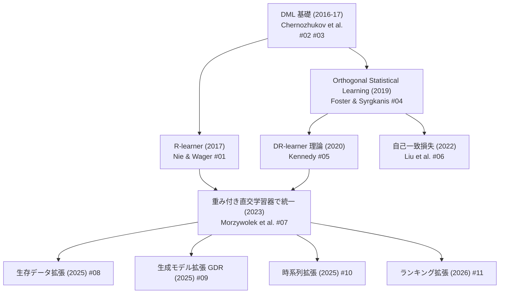

# C1 直交学習・nuisance 推定改善 — 詳細レポート

## Parameters

- **Resources analyzed**: 11（全て学術論文）
- **Resource types**: Academic Paper
- **Generated on**: 2026-06-02
- **Input source**: research-gather 出力 `docs/research/runs/cate/gather/20260602_orthogonal_nuisance/resources-orthogonal-nuisance.md`
- **観点**: CATE 推定の精度向上 — メタラーナーの直交化・cross-fitting・quasi-oracle 性質がどう精度を高めるか

## Report List

### Academic Papers

| # | Title | Year | Venue | Summary | Report |
|---|-------|------|-------|---------|--------|
| 1 | Quasi-Oracle Estimation of HTE (R-learner) | 2017 | Biometrika | Robinson 変換 + R-loss でnuisance不正確でも quasi-oracle 誤差を達成。直交メタラーナーの原点 | [詳細](01-r-learner.md) |
| 2 | Double/Debiased ML for Treatment and Causal Parameters | 2016 | Econometrics J. | Neyman 直交スコア + cross-fitting で正則化バイアス除去、√n 一致推定の基礎理論 | [詳細](02-double-ml.md) |
| 3 | Double/Debiased/Neyman ML of Treatment Effects | 2017 | AER P&P | DML を ATE/ATTE に応用した簡潔版。AIPW 型直交スコア | [詳細](03-dml-treatment-effects.md) |
| 4 | Orthogonal Statistical Learning | 2019 | Annals of Statistics | nuisance 誤差が超過リスクに二次の影響しか与えない理論基盤を確立 | [詳細](04-orthogonal-statistical-learning.md) |
| 5 | Towards Optimal Doubly Robust Estimation of HTE (DR-learner) | 2020 | EJS 2023 | DR pseudo-outcome の2段階回帰、model-free 誤差限界とoracle効率条件 | [詳細](05-dr-learner.md) |
| 6 | Orthogonal Statistical Learning with Self-Concordant Loss | 2022 | COLT 2022 | 自己一致損失で次元因子を除去、強凸性要件を緩和 | [詳細](06-self-concordant-orthogonal.md) |
| 7 | On Weighted Orthogonal Learners for HTE | 2023 | Statistical Science | DR/R-learner を重み付き直交学習器の特殊例として統一、優劣条件を明確化 | [詳細](07-weighted-orthogonal-learners.md) |
| 8 | Orthogonal Survival Learners for HTE from Time-to-Event Data | 2025 | arXiv | 打ち切り生存データへ直交学習を拡張、低オーバーラップ対処の重み付け | [詳細](08-orthogonal-survival-learners.md) |
| 9 | GDR-learners: Orthogonal Learning of Generative Models | 2025 | arXiv | 潜在結果の条件付き分布を深層生成モデルで推定、quasi-oracle 効率 | [詳細](09-gdr-learners.md) |
| 10 | Overlap-weighted Orthogonal Meta-learner over Time | 2025 | arXiv | 時系列のオーバーラップ崩壊に対処する重み付き直交メタ学習器 | [詳細](10-overlap-weighted-orthogonal.md) |
| 11 | Rank-Learner: Orthogonal Ranking of Treatment Effects | 2026 | arXiv | CATE を陽に推定せずペアワイズ直交目的で処置効果順序を直接学習 | [詳細](11-rank-learner.md) |

## Cross-Resource Insights — 直交学習による CATE 精度向上の系譜

**核心の流れ**:
1. **理論基盤（2016-2019）**: DML（#02, #03）が Neyman 直交性 + cross-fitting で「nuisance を ML で推定しても妥当な推論ができる」枠組みを確立。Foster & Syrgkanis（#04）がこれを一般の統計学習へ拡張し「nuisance 誤差は超過リスクに二次でしか効かない」を証明。
2. **CATE への具体化（2017-2020）**: R-learner（#01, Robinson 変換ベース）と DR-learner（#05, AIPW pseudo-outcome ベース）が CATE 推定の二大直交メタラーナーとして確立。
3. **統一と精緻化（2022-2023）**: 自己一致損失（#06）で誤差限界を改善、重み付き直交学習器（#07）が DR/R を統一クラスとして整理し「どの DGP でどちらが優位か」を解明。
4. **拡張（2025-2026）**: 直交性の原理を生存解析（#08）・生成モデル（#09）・時系列（#10）・ランキング（#11）へ展開。Feuerriegel グループが牽引。

## Comparison Table — 主要直交メタラーナーの比較

| 手法 | 1段目 nuisance | 2段目 目的 | quasi-oracle | 優位な状況 | 論文 |
|------|---------------|-----------|:----:|-----------|------|
| R-learner | m(x)=E[Y\|X], e(x)=傾向スコア | Robinson 残差の重み付き二乗損失 | ✓ | 処置効果が滑らか、e の推定が良好 | #01 |
| DR-learner | μ_w(x), e(x) | DR pseudo-outcome の回帰 | ✓ | μ または e の片方が正確（二重頑健） | #05 |
| 重み付き直交（一般） | μ_w(x), e(x) | 重み付き直交損失（DR/R を包含） | ✓ | 重みで DR/R 間を補間・最適化 | #07 |
| 自己一致直交 | 任意 | 自己一致損失 | ✓ | 高次元・GLM 系で次元依存を削減 | #06 |
| Rank-Learner | μ_w(x), e(x) | ペアワイズ直交ランキング損失 | ✓ | 順位付け（uplift@k/AUUC）が目的 | #11 |

## Further Investigation Candidates

- **C2（モデル選択・アンサンブル）**: 直交メタラーナー間の選択は Causal Q-Aggregation（#08 in C2）等で扱われる → `docs/research/runs/cate/gather/20260602_ensemble_model_selection/`
- **C3（深層・表現学習）**: 直交学習を表現学習に統合する OR-learner（C3 #02）が次の接続点
- **C5（頑健性）**: DP-CATE（差分プライバシー）、B-learner（hidden confounding bound）も直交メタラーナーの拡張

## 精度向上のための実務的示唆（C1 総括）

1. **単純な S/T-learner より直交メタラーナー（DR/R）を使う** — nuisance 推定誤差への1次の鈍感さ（quasi-oracle）が実データでの精度安定に直結。
2. **cross-fitting は必須** — 直交スコアでも cross-fitting を省くと過学習バイアスが残る（#02 の核心的知見）。
3. **DR か R かはデータ依存** — #07 の統一フレームで「e の推定品質が高ければ R、μ・e のどちらかに不安があれば二重頑健な DR」が目安。
4. **nuisance 推定器の品質が天井を決める** — quasi-oracle は「nuisance が十分速く収束すれば」成立。nuisance に強力な ML（勾配ブースティング等）を使うことが前提。
