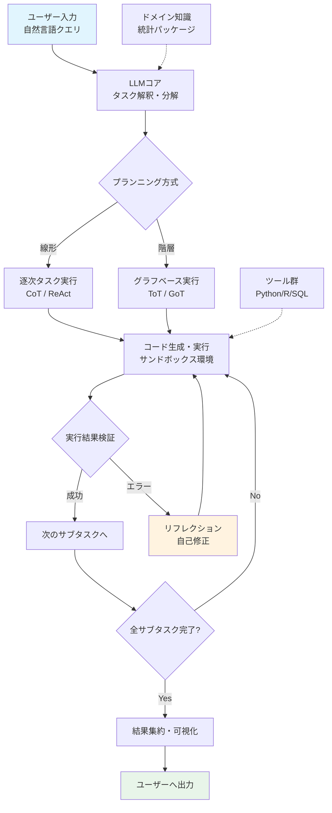
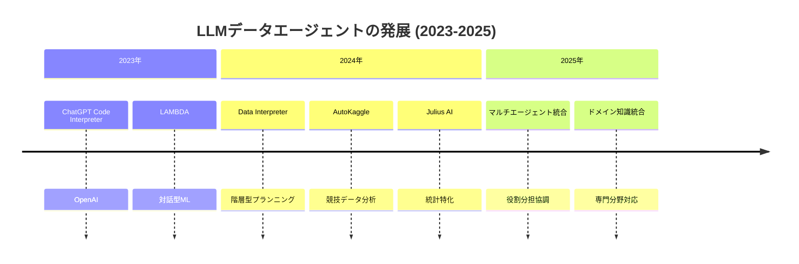
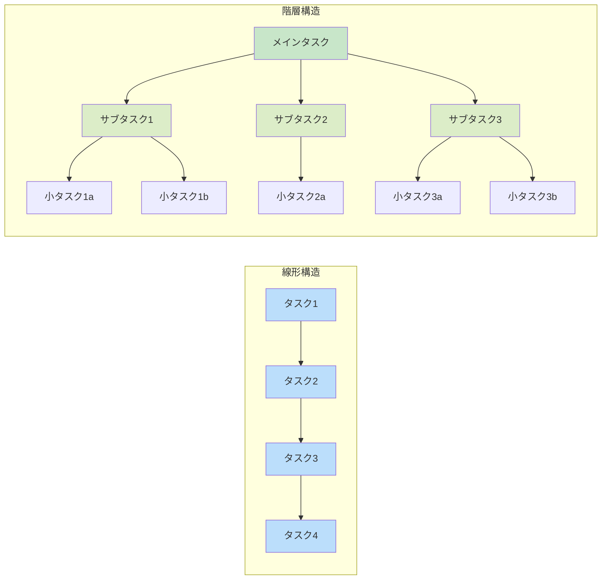
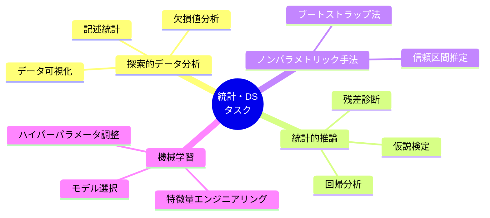

# A Survey on Large Language Model-based Agents for Statistics and Data Science

- **Link**: https://arxiv.org/abs/2412.14222
- **Authors**: Maojun Sun, Ruijian Han, Binyan Jiang, Houduo Qi, Defeng Sun, Yancheng Yuan, Jian Huang
- **Year**: 2025
- **Venue**: American Statistician (2025) 1-14
- **Type**: Academic Paper (Survey)

## Abstract

Large language models (LLMs) have the capacity to transform the traditional data analysis paradigm. This survey examines LLM-powered data agents, focusing on essential design features including planning, reasoning, reflection, and multi-agent collaboration, alongside practical applications in real-world statistical analysis scenarios. The authors identify key challenges and propose directions for advancing these agents into intelligent statistical analysis software, bridging the gap between natural language interaction and rigorous statistical methodology.

## Abstract（日本語訳）

大規模言語モデル（LLM）は、従来のデータ分析パラダイムを変革する能力を持つ。本サーベイでは、LLMを活用したデータエージェントについて、プランニング、推論、リフレクション、マルチエージェント協調といった本質的な設計特徴を中心に調査し、統計分析の実世界シナリオにおける実用的応用を検討する。著者らは主要な課題を特定し、これらのエージェントをインテリジェントな統計解析ソフトウェアへと進化させるための方向性を提示し、自然言語インタラクションと厳密な統計的方法論との橋渡しを目指している。

## 概要

本論文は、LLMベースのデータエージェントが統計学・データサイエンス分野にもたらす変革を包括的に調査したサーベイである。American Statistician誌に掲載されており、統計学コミュニティに向けてエージェント技術の現状と展望を整理している点が特徴的である。

主要な貢献：

1. **データエージェントの体系的分類**: 対話型（Conversational）とエンドツーエンド型（End-to-End）の2大方式を軸に、20以上のエージェントシステムを比較分析
2. **設計特徴の整理**: プランニング（線形・階層型）、推論、リフレクション（自己修正）、マルチエージェント協調の4本柱で設計空間を構造化
3. **統計分析への実用的応用**: 探索的データ分析、統計的推論、ノンパラメトリック手法、機械学習モデル開発における具体的なケーススタディを提示
4. **再現性の課題**: 同一タスクに対するプロンプトの表現の違いが異なる統計手法の選択を引き起こすことを実証

## 問題と動機

- **統計分析の参入障壁**: 従来のデータ分析はプログラミングスキルと統計学の専門知識の両方を必要とし、非専門家にとって高いハードルがある

- **既存ツールの限界**: 従来の統計ソフトウェア（R、Python、SASなど）は強力だが、自然言語による直感的な操作ができず、分析プロセスの自動化が不十分

- **LLMの統計的能力のギャップ**: GPT-4などの先進モデルは学部レベルの統計問題では強い性能を示すが、大学院レベルの高度な課題では苦戦しており、エージェント設計による補完が必要

- **体系的レビューの不在**: データエージェントの急速な発展にもかかわらず、統計学・データサイエンスの視点から設計特徴を整理した包括的なサーベイが欠けていた

## 分類フレームワーク / タクソノミー

本サーベイは、データエージェントを以下の多次元分類体系で整理している。

### 方法論的分類

**対話型エージェント（Conversational）**: ユーザーとのインタラクティブな対話を通じて、反復的なフィードバックに基づき分析を進めるシステム。ユーザーの意図を段階的に具体化できるが、対話管理のオーバーヘッドが生じる。

**エンドツーエンド型エージェント（End-to-End）**: 単一のプロンプトから自律的に分析を完遂するシステム。効率的だが、中間結果に対するユーザーの介入機会が限定される。

### インターフェース分類

4種類のユーザーインターフェースを識別：

1. **IDE統合型**: Jupyter Notebookなどの既存開発環境に組み込まれ、コードセルとの連携が可能
2. **独立システム型**: ChatGPTスタイルの自己完結型インターフェースで、専用のUI/UXを提供
3. **コマンドライン型**: ターミナルからの操作に特化し、スクリプティングとの親和性が高い
4. **OSベース型**: デスクトップ環境全体を操作対象とし、アプリケーション間の連携を実現

### コアアーキテクチャコンポーネント

- **LLM（頭脳）**: 入力解釈、意思決定、コード生成の中核
- **サンドボックス実行環境**: コードの安全な分離実行
- **プリインストールツール**: Python、R、SQL、Jupyterなどの分析ツール群
- **ユーザーインターフェース層**: 自然言語による入出力

### プランニング手法

**線形構造**: Chain-of-Thought、ReActパターンに基づく逐次的タスク分解。シンプルだが、複雑な依存関係の処理に限界がある。

**階層構造**: Tree-of-Thoughts、Graph-of-Thoughtsに基づくグラフベースのモデリング。動的な調整が可能で、複雑なタスクに適するが、計算コストが高い。

## アルゴリズム / 擬似コード

```
Algorithm: LLMデータエージェントの一般的分析パイプライン
Input: 自然言語クエリ q, データセット D
Output: 分析結果 R, 可視化 V

1: plan ← LLM.decompose(q)          // タスク分解（線形 or 階層）
2: for each subtask t_i in plan do
3:     code_i ← LLM.generate_code(t_i, D, context)
4:     result_i ← Sandbox.execute(code_i)
5:     if result_i.has_error() then
6:         // リフレクション: エラーフィードバックによる自己修正
7:         code_i ← LLM.reflect_and_fix(code_i, result_i.error)
8:         result_i ← Sandbox.execute(code_i)
9:     end if
10:    context.update(result_i)
11: end for
12: R ← context.aggregate_results()
13: V ← LLM.generate_visualization(R)
14: return R, V
```

## アーキテクチャ / プロセスフロー



## Figures & Tables

### Table 1: 主要データエージェントの特性比較

| エージェント | 方式 | UI | プランニング | 人間介入 | 自己修正 | 拡張性 |
|-------------|------|-----|-------------|---------|---------|--------|
| ChatGPT (Code Interpreter) | 対話型 | 独立 | 線形 | 高 | 中 | 低 |
| LAMBDA | 対話型 | 独立 | 線形 | 高 | 高 | 中 |
| Data Interpreter | E2E | 独立 | 階層 | 低 | 高 | 高 |
| AutoKaggle | E2E | CLI | 階層 | 低 | 高 | 中 |
| Julius AI | 対話型 | 独立 | 線形 | 高 | 中 | 中 |
| Cursor AI | 対話型 | IDE | 線形 | 高 | 中 | 高 |

### Table 2: 評価ベンチマーク一覧

| ベンチマーク | タスク数 | 対象領域 | 評価観点 |
|-------------|---------|---------|---------|
| DS-1000 | 1,000 | Python データサイエンス | コード正確性 |
| MLAgentBench | -- | ML研究ワークフロー | エンドツーエンド性能 |
| InfiAgent-DABench | -- | 複合データ分析 | 複雑タスク完遂能力 |

### Figure 1: データエージェントの発展タイムライン



### Figure 2: プランニング構造の比較



### Table 3: マルチエージェント構成例

| システム | エージェント構成 | 役割分担 |
|---------|-----------------|---------|
| LAMBDA | Programmer + Inspector | コード生成 + 品質検証 |
| AutoKaggle | Reader + Planner + Developer | データ理解 + 計画 + 実装 |
| Data Interpreter | Task Decomposer + Code Executor + Reflector | 分解 + 実行 + 振り返り |

### Figure 3: 統計分析タスクの分類



## 主要な知見と分析

本論文はサーベイ論文であるため、独自の実験は実施していないが、以下の重要な知見を提示している。

### モデル能力の評価

- GPT-4は学部レベルの数学・統計問題で強い性能を示すが、大学院レベルのタスクでは著しく性能が低下する
- 「異なるプロンプト表現が同じコア分析を生成するが、異なる統計検定や描画手法の選択をもたらす」という再現性の懸念を指摘

### データエージェントの有効性

- 対話型エージェントはユーザーの意図を段階的に明確化できるため、探索的分析に優れる
- エンドツーエンド型エージェントは定型的な分析パイプラインの自動化に適している
- 階層的プランニングは複雑な分析タスクにおいて線形プランニングを上回る性能を示す

### 主要な課題

1. **統計パッケージの管理**: 多数の統計パッケージの適切な選択と組み合わせが困難
2. **プライバシーとセキュリティ**: 大規模モデルのローカルデプロイとクラウド利用のトレードオフ
3. **高並行性スケーラビリティ**: 多ユーザー環境でのシステム拡張性
4. **ドメイン固有知識の統合**: 専門分野の暗黙知をエージェントに組み込む方法論の欠如

### 今後の方向性

- マルチモーダル推論の強化（テキスト + 画像 + 表データの統合分析）
- コード生成における強化学習の活用
- 軽量ローカルモデルの開発
- Jupyter Notebookなど既存IDEへのシームレスな統合

## 備考

- American Statistician誌に掲載された論文であり、統計学コミュニティへの橋渡し的な役割を果たしている点で、他のCS系サーベイとは異なる視点を持つ
- 20以上のデータエージェントの詳細な比較表（Table 1）は、エージェント選定の実用的なリファレンスとして有用
- 再現性に関する具体的な指摘（プロンプト表現の違いが統計手法の選択に影響する）は、科学的厳密性を求める統計学分野において特に重要な課題提起
- Wine Quality、Auto MPG、Breast Cancer Wisconsinの3データセットを用いたケーススタディにより、具体的な分析能力と限界を示している
