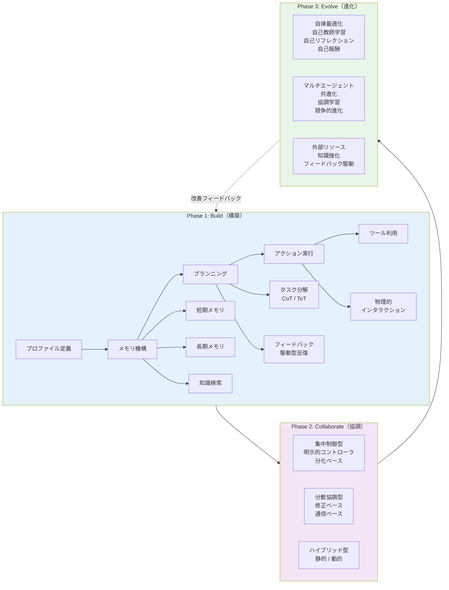
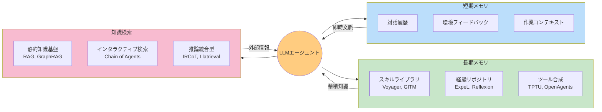
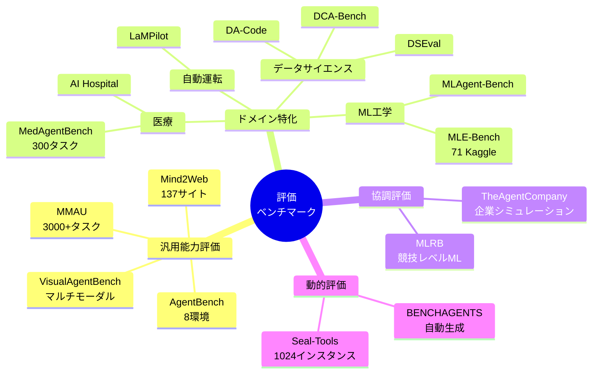

# Large Language Model Agent: A Survey on Methodology, Applications and Challenges

- **Link**: https://arxiv.org/abs/2503.21460
- **Authors**: Junyu Luo, Weizhi Zhang, Ye Yuan, Yusheng Zhao, Junwei Yang, Yiyang Gu, Bohan Wu, Binqi Chen, Ziyue Qiao, Qingqing Long, Rongcheng Tu, Xiao Luo, Wei Ju, Zhiping Xiao, Yifan Wang, Meng Xiao, Chenwu Liu, Jingyang Yuan, Shichang Zhang, Yiqiao Jin, Fan Zhang, Xian Wu, Hanqing Zhao, Dacheng Tao, Philip S. Yu, Ming Zhang
- **Year**: 2025
- **Venue**: arXiv preprint (cs.CL)
- **Type**: Academic Paper (Survey)

## Abstract

With the rise of large language models (LLMs), LLM-based agents have become increasingly prevalent across various domains. This survey provides a systematic taxonomy that deconstructs LLM agent systems into their fundamental methodological components through a "Build-Collaborate-Evolve" framework. The work covers agent construction (memory, planning, action), multi-agent collaboration (centralized, decentralized, hybrid), and agent evolution (self-learning, co-evolution), along with evaluation approaches, tool applications, implementation obstacles, and real-world uses. Surveying 329 papers, the authors provide a comprehensive overview with supplementary resources available via GitHub.

## Abstract（日本語訳）

大規模言語モデル（LLM）の台頭に伴い、LLMベースのエージェントは様々な領域でますます普及している。本サーベイは、「構築-協調-進化（Build-Collaborate-Evolve）」フレームワークを通じてLLMエージェントシステムを基本的な方法論的コンポーネントに分解する体系的なタクソノミーを提供する。エージェントの構築（メモリ、プランニング、アクション）、マルチエージェント協調（集中型、分散型、ハイブリッド型）、エージェントの進化（自己学習、共進化）を包括的にカバーし、評価手法、ツール応用、実装上の障壁、実世界での利用についても論じている。329本の論文を調査し、包括的な概要を提供している。

## 概要

本論文は329本の文献を対象とした大規模なLLMエージェントサーベイであり、方法論を中心としたタクソノミーにより、エージェント技術を体系的に整理している。

主要な貢献：

1. **Build-Collaborate-Evolveフレームワーク**: エージェントの構築・協調・進化を3つの柱として、方法論を包括的に分類する新しい枠組みの提案
2. **エージェント構築の詳細分析**: プロファイル定義、メモリ機構（短期・長期・知識検索）、プランニング能力、アクション実行の4つのコンポーネントを詳述
3. **協調メカニズムの体系化**: 集中制御型、分散協調型、ハイブリッド型の3分類にさらに静的・動的の次元を追加
4. **進化メカニズムの包括的調査**: 自律最適化、マルチエージェント共進化、外部リソースによる進化の3軸で整理
5. **329本の論文の網羅的レビュー**: LLMエージェント研究の全体像を捉える大規模な文献調査

## 問題と動機

- **既存サーベイの方法論的欠落**: 従来のサーベイはアプリケーション中心の分類が多く、エージェント技術の根幹を成す方法論的コンポーネントの体系的分析が不十分

- **急速な研究領域の拡大**: LLMエージェント関連の論文数が急増しており、研究者が全体像を把握するための統一的な分類フレームワークが必要

- **構築・協調・進化の統合的理解の欠如**: エージェントの設計（構築）、複数エージェントの連携（協調）、継続的改善（進化）はそれぞれ独立に研究されがちだが、統合的な視点での理解が不可欠

- **実世界応用と方法論のギャップ**: 理論的な方法論と実際のシステム実装の間に乖離があり、両者を橋渡しする視点が必要

## 分類フレームワーク / タクソノミー

### Build-Collaborate-Evolve フレームワーク

本サーベイの中核をなす3層構造のタクソノミー：

**Build（構築）**: エージェントの基礎的能力を確立するコンポーネント群

**Collaborate（協調）**: 複数エージェントの連携アーキテクチャと通信プロトコル

**Evolve（進化）**: エージェントが学習・適応を通じて能力を向上させるメカニズム

### 構築コンポーネントの詳細

**プロファイル定義**:
- 人間がキュレーションした静的プロファイル（CAMEL、AutoGen、MetaGPT）
- バッチ生成による動的プロファイル（テンプレートベースのプロンプティングで多様なエージェント集団を生成）

**メモリ機構**:
- 短期メモリ: 対話履歴と環境フィードバックによる一時的文脈データ（ReAct、ChatDev、Graph of Thoughts）
- 長期メモリ: スキルライブラリ（Voyager、GITM）、経験リポジトリ（ExpeL、Reflexion）、ツール合成フレームワーク（TPTU、OpenAgents）
- 知識検索としてのメモリ: 静的知識基盤（RAG、GraphRAG）、インタラクティブ検索（Chain of Agents）、推論統合型検索（IRCoT、Llatrieval）

**プランニング**:
- タスク分解: 単一パス連鎖（CoT）vs マルチパスツリー展開（ToT）
- フィードバック駆動型反復: 環境フィードバック、人間のガイダンス、モデルの内省、マルチエージェント協調からの学習

**アクション実行**:
- ツール利用: 使用判断（いつツールを使うか）と選択（どのツールを使うか）
- 物理的インタラクション: ロボットハードウェア理解、社会的知識、エージェント間相互作用

## アルゴリズム / 擬似コード

```
Algorithm: Build-Collaborate-Evolve エージェントライフサイクル
Input: タスク仕様 T, エージェントプール A, 知識ベース K
Output: 最適化されたエージェントシステム S*

// Phase 1: Build（構築）
1: for each agent a_i in A do
2:     a_i.profile ← DefineProfile(T, role_spec)
3:     a_i.memory ← InitMemory(short_term, long_term, knowledge_retrieval)
4:     a_i.planner ← ConfigPlanner(task_decomposition, feedback_mode)
5:     a_i.tools ← SelectTools(T, available_tools)
6: end for

// Phase 2: Collaborate（協調）
7: topology ← SelectTopology(T)  // centralized | decentralized | hybrid
8: protocol ← ConfigProtocol(topology)
9: while task_not_complete do
10:    messages ← agents.communicate(protocol)
11:    for each agent a_i in active_agents do
12:        action_i ← a_i.plan_and_act(messages, a_i.memory)
13:        feedback ← environment.execute(action_i)
14:        a_i.memory.update(feedback)
15:    end for
16: end while

// Phase 3: Evolve（進化）
17: for each agent a_i in A do
18:    a_i.self_reflect(performance_metrics)
19:    a_i.update_skills(experience_buffer)
20: end for
21: S* ← co_evolve(A, competitive=True, cooperative=True)
22: return S*
```

## アーキテクチャ / プロセスフロー



## Figures & Tables

### Table 1: マルチエージェント協調手法の分類

| カテゴリ | サブカテゴリ | 代表的手法 | 特徴 |
|---------|------------|-----------|------|
| 集中制御型 | 明示的コントローラ | Coscientist, LLM-Blender, MetaGPT | 専用の調整モジュールがタスク配分と意思決定統合を担当 |
| 集中制御型 | 分化ベース | AutoAct, Meta-Prompting, WJudge | 単一エージェントがプロンプティングにより異なる役割を遂行 |
| 分散協調型 | 修正ベース | MedAgents, ReConcile, METAL | エージェントが共有出力を反復的に洗練 |
| 分散協調型 | 通信ベース | MAD, MADR, MDebate, AutoGen | エージェント間の直接対話による柔軟な組織構造 |
| ハイブリッド型 | 静的 | CAMEL, AFlow | グループ内分散 + グループ間集中の事前定義パターン |
| ハイブリッド型 | 動的 | DiscoGraph, DyLAN, MDAgents | 性能に応じてトポロジーを動的再構成 |

### Table 2: エージェント進化手法の分類

| カテゴリ | 手法 | 代表例 | メカニズム |
|---------|------|--------|-----------|
| 自己教師学習 | Self-Evolution | DiverseEvol | ラベルなしデータでの自己改善 |
| 自己リフレクション | SELF-REFINE | STaR, V-STaR | 外部監督なしの反復的修正 |
| 自己報酬 | Self-Rewarding | RLCD, RLC | 内部報酬信号による強化学習 |
| 協調学習 | ProAgent | CORY, CAMEL | 知識共有と協調的問題解決 |
| 競争的進化 | Red-Team LLMs | Multi-Agent Debate | 敵対的相互作用による能力強化 |
| 知識強化 | KnowAgent | WKM | 構造化知識の統合 |
| 外部フィードバック | CRITIC | STE, SelfEvolve | リアルタイムフィードバック活用 |

### Figure 1: メモリアーキテクチャの構造



### Figure 2: 評価ベンチマークの分類マップ



### Table 3: 主要応用領域とキーシステム

| 応用領域 | サブドメイン | 代表的システム |
|---------|------------|---------------|
| 科学発見 | 化学・材料 | Coscientist, ChemCrow |
| 科学発見 | 生物学 | 細胞行動分析エージェント |
| 科学発見 | 医療 | AI Hospital, MedAgents |
| ゲーム | 複合環境 | Voyager, GITM |
| 社会科学 | 行動シミュレーション | Generative Agents |
| 生産性向上 | 研究支援 | AutoGen, MetaGPT |

## 主要な知見と分析

### 構築に関する知見

- **メモリの3層構造が有効**: 短期メモリ（即時文脈）、長期メモリ（蓄積知識）、知識検索（外部情報）の組み合わせが、エージェントの能力を最大化する
- **ToTの優位性**: Tree-of-Thoughtsは複雑な推論タスクにおいてChain-of-Thoughtsを上回るが、計算コストが高い
- **ツール利用の2段階判断**: 「いつ使うか」と「何を使うか」を分離することが重要

### 協調に関する知見

- **動的トポロジーの優位性**: DyLAN等の動的システムは固定構造を持つシステムを上回る適応性を示す
- **分散型は通信コストが課題**: ノード間直接通信による分散協調は柔軟だが、エージェント数増加に伴う通信オーバーヘッドが問題
- **ハイブリッド型の可能性**: 集中と分散を組み合わせたハイブリッドアーキテクチャが最もバランスが取れている

### 進化に関する知見

- **自己リフレクションの効果**: SELF-REFINE等の手法は外部監督なしでもエージェント性能を改善できるが、改善の上限が存在
- **競争的共進化の重要性**: Red-Team的な敵対的アプローチがエージェントのロバスト性向上に寄与
- **知識統合が進化を加速**: KnowAgent等の構造化知識の統合が学習効率を大幅に向上させる

### セキュリティ・プライバシーの課題

- エージェントの自律性が高まるにつれ、セキュリティリスクも増大
- マルチエージェントシステムにおける幻覚の伝播（カスケード効果）
- プライバシー保護とエージェント能力のトレードオフ

## 備考

- 329本の論文を対象とした大規模調査であり、LLMエージェント研究の全体像を把握するための包括的リファレンスとして機能する
- Build-Collaborate-Evolveフレームワークは、エージェントシステムの設計・評価における統一的な視座を提供する点で価値がある
- GitHubリポジトリでの補足資料の公開により、研究コミュニティへの継続的な貢献が期待される
- 26名の共著者による共同執筆であり、多角的な専門性が反映されている
- データ分析エージェント研究の文脈では、特にメモリ機構、プランニング手法、マルチエージェント協調の分類が重要な参照枠となる
