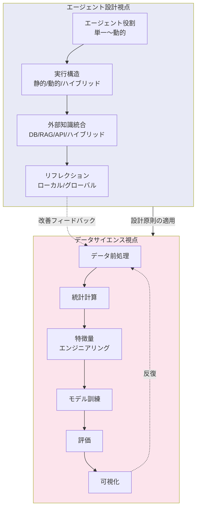
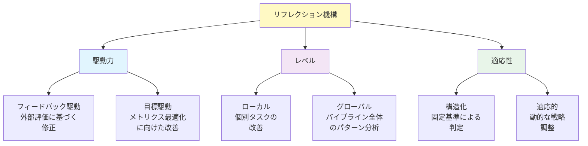
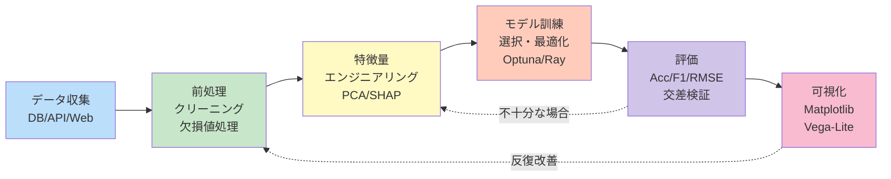
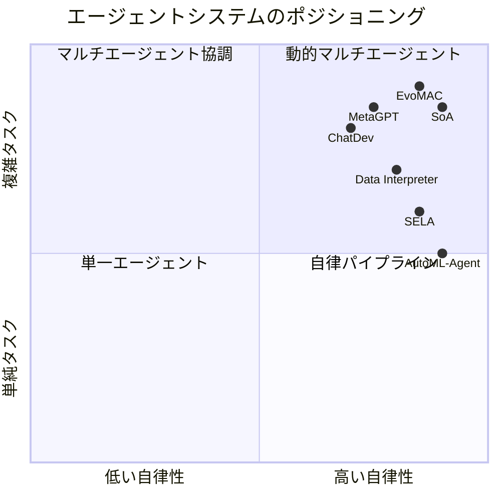

# Large Language Model-based Data Science Agent: A Survey

- **Link**: https://arxiv.org/abs/2508.02744
- **Authors**: Ke Chen, Peiran Wang, Yaoning Yu, Xianyang Zhan, Haohan Wang
- **Year**: 2025
- **Venue**: arXiv preprint (cs.AI)
- **Type**: Academic Paper (Survey)

## Abstract

This survey examines LLM-based agents specifically designed for data science tasks. It provides a dual-perspective framework that connects general agent design principles with the practical workflows in data science. The work discusses key design principles covering agent roles, execution structures, external knowledge integration, and reflection methods, and identifies critical data science processes including data preprocessing, feature engineering, model training, evaluation, and visualization. The survey catalogs over 50 benchmarks and analyzes representative systems across the spectrum from single-agent to dynamic multi-agent architectures.

## Abstract（日本語訳）

本サーベイは、データサイエンスタスクに特化して設計されたLLMベースのエージェントを調査する。一般的なエージェント設計原則とデータサイエンスの実践的ワークフローを接続する二重視点フレームワークを提供する。エージェントの役割、実行構造、外部知識統合、リフレクション手法といった主要な設計原則を論じ、データ前処理、特徴量エンジニアリング、モデル訓練、評価、可視化を含む重要なデータサイエンスプロセスを特定する。50以上のベンチマークをカタログ化し、単一エージェントから動的マルチエージェントアーキテクチャに至るスペクトラム全体の代表的システムを分析している。

## 概要

本論文は、データサイエンス領域に焦点を絞ったLLMエージェントの包括的サーベイであり、エージェント設計の理論的原則とデータサイエンスの実践的ワークフローを統合する二重視点フレームワークを提案している。

主要な貢献：

1. **二重視点フレームワーク**: エージェント設計（Design Perspective）とデータサイエンスワークフロー（DS Perspective）の2つのレンズからの分析を統合
2. **エージェント役割のスペクトラム分析**: 単一エージェントから動的マルチエージェントまで、5段階のアーキテクチャ分類を提示
3. **実行構造の詳細な分類**: 静的・動的・ハイブリッドの実行パラダイムとそのトレードオフを体系化
4. **50以上のベンチマーク調査**: データサイエンスエージェント評価のための包括的なベンチマークカタログ
5. **データサイエンスループの定義**: 前処理から可視化までの完全なワークフローステージをエージェント能力にマッピング

## 問題と動機

- **LLMの本質的限界**: 幻覚（hallucination）、脆弱なコード生成、長文脈不安定性といったLLM固有の問題が、データサイエンスタスクでは特に深刻な影響を及ぼす

- **理論と実践の乖離**: エージェント設計の一般理論は進展しているが、データサイエンスの具体的なワークフロー（反復的・探索的な性質）への適用方法が体系化されていない

- **ベンチマークの断片化**: データサイエンスエージェントの評価ベンチマークが散在しており、統一的な比較が困難

- **多段階ワークフローの課題**: 実際のデータサイエンスプロジェクトは複数ステージにまたがる長期的プロセスだが、既存のベンチマークの多くは短いタスクの評価に偏っている

## 分類フレームワーク / タクソノミー

### 視点1: エージェント設計（Design Perspective）

#### エージェント役割のスペクトラム

| アーキテクチャ | 説明 | 利点 | 欠点 |
|-------------|------|------|------|
| 単一エージェント | ReActスタイルの直接的推論 | 最小オーバーヘッド | 幻覚・文脈ドリフトに脆弱 |
| 2エージェント | プランナー-実行者 or コーダー-レビューア | 適度なタスク分解 | 限定的な専門化 |
| マルチエージェント（SE型） | ソフトウェア開発チームを模倣 | 役割の専門化 | 調整コスト |
| マルチエージェント（最小機能型） | 狭いスコープの単機能エージェント | 高精度 | 統合の複雑さ |
| 動的エージェント | ランタイムでの動的生成 | 最大の適応性 | 予測困難 |

#### 実行構造

**静的実行**: 事前定義されたシーケンシャルワークフロー。Data Directorなどが採用。信頼性・再現性は高いが柔軟性に欠ける。

**動的実行**:
- ジャストインタイム型: リアルタイム観察に基づく継続的リプランニング
- プラン-then-実行型: 明示的な計画フェーズの後に実行
- 階層的実行: ツリーベースまたはグラフベースのタスク分解

#### 外部知識統合

4つの方法論：
1. 外部データベース（履歴ログ、実験結果、ユーザー提供データ）
2. 検索ベースアプローチ（RAG、BM25、ケースベース推論）
3. API呼び出し・検索統合（GitHub、Hugging Faceリポジトリ）
4. ハイブリッドアプローチ（複数手法の組み合わせ）

#### リフレクション機構

**駆動力**: フィードバック駆動型（外部評価ベース）vs 目標駆動型（メトリクス最適化ベース）

**レベル**: ローカル（個別タスク改善）vs グローバル（クロスイテレーションパターン分析）

**適応性**: 構造化（固定基準）vs 適応的（動的戦略調整）

### 視点2: データサイエンスワークフロー（DS Perspective）

- データ前処理（収集・クリーニング・欠損値処理・外れ値検出）
- 統計計算（記述統計・仮説検定・相関分析）
- 特徴量エンジニアリング（カテゴリエンコーディング・スケーリング・次元削減・重要度ランキング）
- モデル訓練（アルゴリズム選択・ハイパーパラメータ調整・転移学習）
- 評価（タスク固有メトリクス・交差検証・自動レポーティング）
- 可視化（静的・インタラクティブ・SHAP解釈可能性プロット）

## アルゴリズム / 擬似コード

```
Algorithm: データサイエンスエージェントの二重視点統合パイプライン
Input: ユーザークエリ Q, データソース D, 知識ベース K
Output: 分析レポート Report

// Design Perspective: エージェント構成
1: agents ← ConfigureAgentRoles(Q.complexity)
   // 単一 | 2エージェント | マルチ | 動的
2: execution ← SelectExecutionMode(Q)
   // 静的 | 動的(JIT | Plan-then-Execute | 階層)

// DS Perspective: ワークフロー実行
3: data ← Preprocess(D)                // 収集・クリーニング
4: features ← EngineerFeatures(data)   // 特徴量エンジニアリング
5: model ← TrainModel(features, K)     // モデル訓練
6: metrics ← Evaluate(model, data)     // 評価
7: visuals ← Visualize(data, model, metrics)  // 可視化

// Reflection Loop（リフレクションループ）
8: while not meets_quality_threshold(metrics) do
9:     feedback ← Reflect(metrics, execution_log)
10:    if feedback.level == LOCAL then
11:        // 個別ステップの修正
12:        fix_step(feedback.target_step)
13:    else  // GLOBAL
14:        // パイプライン全体の再構成
15:        replan_pipeline(feedback)
16:    end if
17:    metrics ← re_evaluate()
18: end while

19: Report ← GenerateReport(data, model, metrics, visuals)
20: return Report
```

## アーキテクチャ / プロセスフロー



## Figures & Tables

### Table 1: エージェントアーキテクチャのトレードオフマトリクス

| 次元 | 単一エージェント | 2エージェント | マルチエージェント | 動的エージェント |
|------|:---:|:---:|:---:|:---:|
| 信頼性 | 低 | 中 | 高 | 変動 |
| スケーラビリティ | 低 | 中 | 高 | 高 |
| 調整コスト | なし | 低 | 高 | 非常に高 |
| 予測可能性 | 高 | 高 | 中 | 低 |
| 幻覚耐性 | 低 | 中 | 高 | 中 |

### Table 2: SE型チームの役割分布

| 役割 | ChatDev | MetaGPT | MAGIS | AgileCoder | VisionCoder |
|------|:---:|:---:|:---:|:---:|:---:|
| プロダクトマネージャー | o | o | -- | o | -- |
| 要件アナリスト | -- | o | -- | -- | -- |
| アーキテクト | -- | o | -- | -- | o |
| 開発者 | o | o | o | o | o |
| QAエンジニア | o | o | -- | o | -- |
| レビューア | o | -- | o | -- | o |

### Figure 1: リフレクション機構の分類



### Figure 2: データサイエンスワークフローループ



### Table 3: 主要ベンチマーク（50以上から抜粋）

| ベンチマーク | タスク数 | 対象領域 | 特徴 |
|-------------|---------|---------|------|
| ML-Bench | 9,641 | マルチモーダル | 大規模汎用 |
| DSBench | 540 | 分析・モデリング | エンドツーエンド |
| BLADE | 714 | 分析研究 | 実践的シナリオ |
| MatPlotAgent-Bench | 100 | 可視化 | 描画品質評価 |
| Spider2-V | 494 | データウェアハウス | ETL変換 |
| ML-Dev-Bench | 30 | データ処理・モデリング | 開発ワークフロー |
| FoodPuzzle | 2,744 | フレーバー科学 | ドメイン特化 |
| GenoTEX | 1,146 | ゲノミクス | バイオインフォマティクス |
| AgentClinic | 535 | 臨床・医療 | 診断支援 |
| GeoAgent-Bench | 19,504 | 地理空間 | 大規模空間分析 |
| TheAgentCompany | 175 | 企業DS | 企業環境シミュレーション |

### Figure 3: 代表的システムのポジショニング



## 主要な知見と分析

### エージェント設計に関する知見

- **動的エージェント生成の可能性と課題**: ランタイムでのエージェント動的生成（EvoMAC、SoA）は最大の適応性を持つが、予測困難性と制御の難しさが課題
- **最小機能エージェントの有効性**: 狭いスコープに特化した単機能エージェント（AutoCodeRover、CODES、HYPERAGENT、MASAI）の組み合わせが、汎用マルチエージェントよりも高精度を達成するケースが報告されている
- **クライアント-サーバーモデルの実用性**: AutoML-Agent、Data Directorのようなクライアント-サーバー型は企業環境での展開に適している

### データサイエンスワークフローに関する知見

- **エラー伝播の深刻さ**: 上流ステージ（前処理・特徴量エンジニアリング）のエラーが下流に伝播・増幅される「カスケード効果」が主要な課題
- **可視化の品質評価困難**: データ可視化タスクの出力は直接比較が困難であり、評価メトリクスの標準化が遅れている
- **反復的プロセスの重要性**: 実際のデータサイエンスは線形プロセスではなく反復ループであり、エージェントのリフレクション機構がこの反復性に対応する必要がある

### ベンチマークの限界

- 大半のベンチマークが孤立した短いタスクをテストしており、長期的な多段階評価が不足
- クリーンで完全な入力データを前提としており、実際の「汚い」データへの対応能力が評価されていない
- データ品質診断の自動化（スキーマ検証・異常検出）が first-class のリフレクション能力として必要

### 今後の研究方向

1. **データ中心診断**: 自動スキーマ検証、異常検出、データ品質分析をリフレクション機能として統合
2. **不確実性考慮型プランニング**: 信頼度モデリングによる確認クエリ発行、マルチブランチ探索、強化検証
3. **パイプラインレベルのリフレクション**: 個別ステップを超えた、多段階ワークフロー全体でのエラー伝播検出

## 備考

- データサイエンスに特化したサーベイとして、エージェント設計理論とDS実践ワークフローを二重視点で統合している点が独自の貢献
- 50以上のベンチマークの包括的カタログは、エージェント評価の実用的なリファレンスとして極めて有用
- SE型チーム（ソフトウェア開発チームを模倣したマルチエージェント）のデータサイエンスへの応用が詳しく分析されており、ChatDev、MetaGPT等の具体的な役割分布が比較されている
- リフレクション機構の3次元分類（駆動力・レベル・適応性）は、他のサーベイにない独自の視点を提供
- パイプラインレベルのリフレクションという概念の提案は、実務的に最も重要な今後の研究方向の一つ
