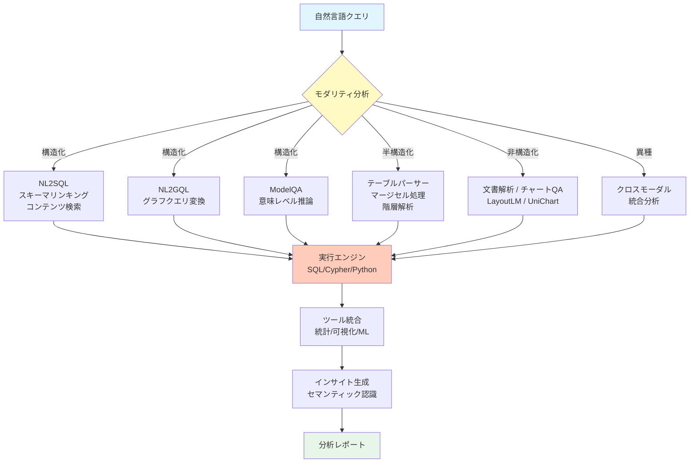
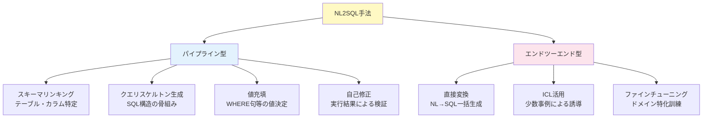
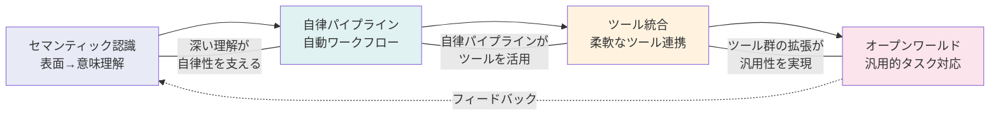
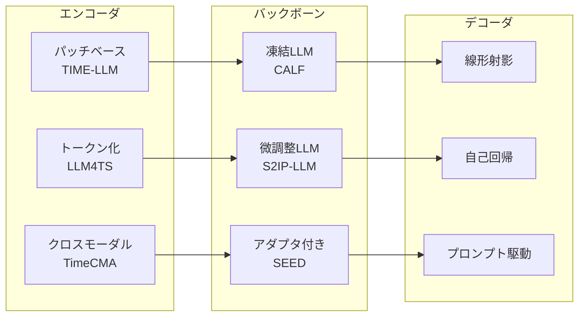

# LLM/Agent-as-Data-Analyst: A Survey

- **Link**: https://arxiv.org/abs/2509.23988
- **Authors**: Zirui Tang, Weizheng Wang, Zihang Zhou, Yang Jiao, Bangrui Xu, Boyu Niu, Dayou Zhou, Xuanhe Zhou, Guoliang Li, Yeye He, Wei Zhou, Yitong Song, Cheng Tan, Xue Yang, Chunwei Liu, Bin Wang, Conghui He, Xiaoyang Wang, Fan Wu
- **Year**: 2025
- **Venue**: arXiv preprint (cs.AI, cs.DB)
- **Type**: Academic Paper (Survey)

## Abstract

This survey examines how large language models (LLMs) and agent techniques are transforming data analysis across multiple data modalities. The work systematically categorizes techniques across structured data (NL2SQL, NL2GQL, ModelQA), semi-structured data (markup languages, irregular tables), unstructured data (charts, documents, videos, 3D models), and heterogeneous data requiring cross-modal integration. Four key design goals are identified: semantic awareness, autonomous pipelines, tool integration, and open-world task support. The survey covers 31 pages with 9 figures, providing a comprehensive landscape of LLM/Agent-as-Data-Analyst capabilities.

## Abstract（日本語訳）

本サーベイは、大規模言語モデル（LLM）とエージェント技術が複数のデータモダリティにわたるデータ分析をどのように変革しているかを調査する。構造化データ（NL2SQL、NL2GQL、ModelQA）、半構造化データ（マークアップ言語、不規則テーブル）、非構造化データ（チャート、文書、動画、3Dモデル）、および異種データのクロスモーダル統合にわたる技術を体系的に分類する。セマンティック認識、自律パイプライン、ツール統合、オープンワールドタスク対応の4つの主要設計目標を特定する。31ページ、9つの図からなる包括的なLLM/Agent-as-Data-Analystの能力の全体像を提供している。

## 概要

本論文は「データアナリストとしてのLLM/エージェント」という視点からデータ分析技術を包括的に調査したサーベイであり、データのモダリティ（構造化・半構造化・非構造化・異種）を軸とした独自の分類体系を採用している。

主要な貢献：

1. **データモダリティ中心の分類**: エージェントアーキテクチャではなく、扱うデータの種類を軸にした体系化により、実務者にとって直感的な整理を実現
2. **4つの設計目標の定義**: セマンティック認識、自律パイプライン、ツール統合、オープンワールドタスク対応という4つの横断的目標を明確化
3. **NL2SQL/NL2GQLの詳細分析**: 自然言語からSQL/グラフクエリ言語への変換技術の最新状況を詳述
4. **半構造化データの課題の可視化**: マージセル、不規則ヘッダー、階層コンテンツなど、実務で頻出する半構造化データの困難さを体系的に分析
5. **クロスモーダル統合の展望**: 異なるモダリティのデータを統合的に分析する技術の現状と課題を提示

## 問題と動機

- **データモダリティの多様性**: 現実のデータ分析では、リレーショナルDB、スプレッドシート、PDF文書、チャート、動画など多様なデータ形式を扱う必要があるが、既存サーベイはSQL変換や単一モダリティに焦点が偏っている

- **表面的な解析から意味的理解への移行**: 従来のLLMベースデータ分析は構文的なパターンマッチングに留まっていたが、データに埋め込まれた意味の推論が求められている

- **自律性と汎用性のギャップ**: 個別タスクに特化した手法は数多く存在するが、多様なデータタイプとタスクを自律的にハンドリングできる汎用的なデータ分析エージェントは未確立

- **異種データの統合分析**: 構造化データと非構造化データを横断した分析を可能にする統一的インターフェースが必要

## 分類フレームワーク / タクソノミー

### データモダリティ別分類

#### 1. 構造化データ

**NL2SQL（自然言語→SQL）**:
- スキーマリンキング: テーブル構造と自然言語クエリの対応付け
- コンテンツ検索: データ値を考慮したクエリ生成
- 多段階生成: 複雑なクエリの段階的構築
- パイプライン型 vs エンドツーエンド型の2大アプローチ

**NL2GQL（自然言語→グラフクエリ言語）**:
- ナレッジグラフに対するCypher/SPARQL等のクエリ生成
- NAT-NL2GQL、R3-NL2GQLなどの代表的手法

**ModelQA（モデルベース質問応答）**:
- 構文レベルを超えた意味レベルの推論
- 多段階推論とエンドツーエンド手法の2分類

#### 2. 半構造化データ

**マークアップ言語**: XML、JSON、HTMLなど部分的構造を持つデータ

**半構造化テーブル**: 以下の課題を内包
- 誤ったインデックス
- 階層的コンテンツ
- マージセル
- 柔軟なヘッダー方向（横/縦/斜め）
- 不一致なコンテンツ形式

#### 3. 非構造化データ

- **チャート**: グラフ・図表の理解と情報抽出（UniChart等）
- **文書**: PDF、スキャンレポートの構造解析（LayoutLM、DocLLM）
- **動画**: 時系列視覚情報の理解
- **3Dモデル**: 幾何学的表現の解析

#### 4. 異種データ

複数モダリティにまたがるクロスモーダル統合分析。統一インターフェースによる多様なデータの一貫した処理が目標。

### 4つの設計目標

1. **セマンティック認識（Semantic Awareness）**: 表面的なリテラル分析からセマンティックに基づく分析への移行。データに埋め込まれた意味を推論し、より深い洞察を提供
2. **自律パイプライン（Autonomous Pipelines）**: 自動的なワークフロー編成と進化。手動での仕様指定を削減し、エージェントが自律的に分析パイプラインを構築・最適化
3. **ツール統合（Tool Integration）**: 柔軟なツール群とデカップルドアーキテクチャ。LLMと多様なツール（SQL実行環境、可視化ライブラリ等）の分離結合
4. **オープンワールドタスク対応（Open-World Task Support）**: ドメイン特化タスクを超えた汎用エージェント。未知のデータ形式やタスクタイプにも対応可能な能力

## アルゴリズム / 擬似コード

```
Algorithm: LLM/Agent-as-Data-Analyst パイプライン
Input: 自然言語クエリ Q, マルチモーダルデータソース D = {D_struct, D_semi, D_unstruct}
Output: 分析結果 R, インサイト I

// Step 1: データモダリティの識別と前処理
1: modality ← IdentifyModality(D)
2: for each data_source d_i in D do
3:     d_i_processed ← PreprocessByModality(d_i, modality[d_i])
4: end for

// Step 2: モダリティ別クエリ変換
5: switch modality.primary do
6:     case STRUCTURED:
7:         query ← NL2SQL(Q, schema) or NL2GQL(Q, graph_schema)
8:     case SEMI_STRUCTURED:
9:         query ← TableParser(Q, d_semi, handle_merge_cells=True)
10:    case UNSTRUCTURED:
11:        query ← DocumentParser(Q, d_unstruct) + ChartQA(Q, charts)
12:    case HETEROGENEOUS:
13:        query ← CrossModalIntegration(Q, D)
14: end switch

// Step 3: セマンティック推論と実行
15: if requires_semantic_reasoning(Q) then
16:    result ← ModelQA(Q, data, multi_step=True)
17: else
18:    result ← ExecuteQuery(query, execution_engine)
19: end if

// Step 4: ツール統合による分析拡張
20: tools ← SelectTools(Q, result)  // 可視化/統計/ML
21: enriched_result ← ApplyTools(result, tools)

// Step 5: インサイト生成
22: I ← GenerateInsights(enriched_result, Q)
23: R ← FormatReport(enriched_result, I)
24: return R, I
```

## アーキテクチャ / プロセスフロー



## Figures & Tables

### Table 1: データモダリティ別の主要技術と課題

| モダリティ | サブカテゴリ | 主要技術 | 代表的システム | 主な課題 |
|-----------|------------|---------|--------------|---------|
| 構造化 | NL2SQL | スキーマリンキング、多段階生成 | TableGPT2, DAIL-SQL | 複雑なJOIN、サブクエリ |
| 構造化 | NL2GQL | グラフスキーマ理解 | NAT-NL2GQL, R3-NL2GQL | グラフ構造の複雑性 |
| 構造化 | ModelQA | 意味レベル推論 | ReAcTable, CHAIN-OF-TABLE | 多段階推論の正確性 |
| 半構造化 | テーブル | マージセル処理 | ST-Raptor, TabFormer | 不規則構造 |
| 半構造化 | マークアップ | XML/JSON/HTML解析 | --- | スキーマ不在 |
| 非構造化 | チャート | チャート理解 | UniChart | 視覚的曖昧性 |
| 非構造化 | 文書 | レイアウト理解 | LayoutLM, DocLLM | 多様なフォーマット |
| 異種 | クロスモーダル | 統一インターフェース | --- | モダリティ間の整合性 |

### Table 2: 半構造化テーブルの困難要因

| 困難要因 | 説明 | 具体例 | 対処アプローチ |
|---------|------|--------|-------------|
| 誤ったインデックス | 行/列番号の不一致 | ヘッダー行のずれ | インデックス再構築 |
| 階層的コンテンツ | 入れ子構造のセル | 複数レベルのカテゴリ | ツリー構造解析 |
| マージセル | 結合されたセル | 見出しの結合 | セル分割・属性伝播 |
| 柔軟なヘッダー | 非標準的なヘッダー配置 | 縦・横・斜め方向 | 方向検出・正規化 |
| 不一致コンテンツ | 型の混在 | 数値と文字列の混在 | 型推論・正規化 |

### Figure 1: NL2SQLアプローチの分類



### Figure 2: 4つの設計目標の関係性



### Table 3: 主要ベンチマークデータセット

| データセット | データ件数 | データタイプ | 評価対象 |
|-------------|-----------|------------|---------|
| Spider | 10,181 | NL-SQLペア | SQL正確性 |
| WikiTQ | 22,033 | テーブルQA | 回答正確性 |
| TEMPTABQA | 11,454 | 時系列テーブル | 時間推論 |
| SPREADSHEETBENCH | 912 | 実スプレッドシート | 実務タスク |
| MiMoTable | 1,719 | 複数シート | クロスシート推論 |
| FeTaQA | 10,000+ | 自由形式テーブルQA | 生成品質 |

### Figure 3: 時系列分析手法の比較



## 主要な知見と分析

### 構造化データ分析の現状

- **NL2SQLの成熟度**: スキーマリンキングと多段階生成の組み合わせにより、単純なクエリでは高い精度を達成。しかし、複雑なJOIN、サブクエリ、集約関数の連鎖では依然として課題が残る
- **グラフクエリの未成熟**: NL2GQLはNL2SQLと比較して研究が遅れており、特にグラフスキーマの複雑性への対応が不十分
- **ModelQAの可能性**: 構文レベルを超えた意味レベルの推論は、複雑な分析クエリに対する有望なアプローチ

### 半構造化データの課題

- **実世界のテーブルは「汚い」**: マージセル、不規則ヘッダー、型混在などの問題が実務では常態的であり、多くの既存手法がこれらに対応できていない
- **スプレッドシート分析の困難さ**: SPREADSHEETBENCHによる評価で、実世界のスプレッドシートタスクは学術的なベンチマークよりも著しく困難であることが判明

### 非構造化データの進展

- **文書理解の進歩**: LayoutLM系のレイアウト認識モデルにより、PDFやスキャン文書の構造解析が大幅に改善
- **チャート理解は発展途上**: UniChartなどの専門モデルは登場しているが、複雑な図表の完全な理解には至っていない

### クロスモーダル統合の展望

- **統一インターフェースの必要性**: 異なるモダリティのデータを一貫して扱える統一的なインターフェースが最も重要な未解決課題の一つ
- **セマンティック認識の重要性**: 表面的なパターンマッチングからデータの意味を理解する分析への移行が、全モダリティで共通の方向性

### 設計目標の達成状況

| 設計目標 | 現状の達成度 | 主要な課題 |
|---------|:---:|---------|
| セマンティック認識 | 中 | 深い意味推論の精度 |
| 自律パイプライン | 低-中 | エラーハンドリングの堅牢性 |
| ツール統合 | 中 | ツール選択の最適化 |
| オープンワールド | 低 | 未知データ形式への対応 |

## 備考

- cs.AIとcs.DBの両カテゴリに分類されている点が示すように、AI技術とデータベース技術の交差領域に位置するサーベイである
- データモダリティを分類軸とするアプローチは、他のエージェントアーキテクチャ中心のサーベイとは明確に異なる視点を提供する
- 31ページ、9図という充実した構成は、各モダリティの詳細な技術分析を可能にしている
- 半構造化データの課題（マージセル、不規則ヘッダー等）の体系的整理は、実務者にとって特に有用な情報
- 19名の共著者による共同執筆であり、清華大学のGuoliang Liを含むデータベースコミュニティの研究者が参画している点から、DB視点が強く反映されている
- 時系列分析手法の比較（Table I）は、LLMの時系列データへの応用という新しい研究方向を示唆している
