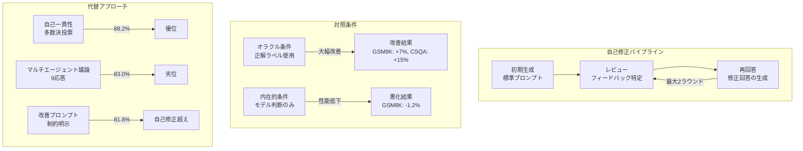

# Large Language Models Cannot Self-Correct Reasoning Yet

- **Link**: https://arxiv.org/abs/2310.01798
- **Authors**: Jie Huang, Xinyun Chen, Swaroop Mishra, Huaixiu Steven Zheng, Adams Wei Yu, Xinying Song, Denny Zhou
- **Year**: 2023
- **Venue**: ICLR 2024
- **Type**: Academic Paper

## Abstract

This paper critically examines the self-correction capabilities of large language models (LLMs), focusing specifically on "intrinsic self-correction" -- where a model attempts to correct its initial responses based solely on its inherent capabilities, without external feedback. Through systematic experiments across multiple benchmarks and models, the authors demonstrate that LLMs struggle to self-correct their responses without external feedback, and at times, their performance even degrades after self-correction. The findings challenge prevailing assumptions about LLM self-improvement and provide important insights for the development of more reliable AI reasoning systems.

## Abstract（日本語訳）

本論文は、大規模言語モデル（LLM）の自己修正能力を批判的に検証する。特に「内在的自己修正（intrinsic self-correction）」 -- モデルが外部フィードバックなしに、自身の内在的能力のみに基づいて初期回答を修正しようとする場合 -- に焦点を当てる。複数のベンチマークとモデルにわたる体系的な実験を通じて、著者らはLLMが外部フィードバックなしでは自己修正に苦労し、場合によっては自己修正後に性能が低下することさえあることを実証する。これらの知見は、LLMの自己改善に関する一般的な仮定に疑問を投げかけ、より信頼性の高いAI推論システムの開発に重要な洞察を提供する。

## 概要

本論文は、LLMの自己修正能力に関する楽観的な見方に対して、厳密な実験的反証を提示する画期的な研究である。

主要な貢献は以下の通り：

1. **内在的自己修正の定義と区別**: 外部フィードバック（オラクルラベル、コード実行結果等）を伴う自己修正と、モデル自身の能力のみに依存する「内在的自己修正」を明確に区別
2. **性能低下の実証**: 内在的自己修正がすべてのテスト条件で性能低下を引き起こすことを実験的に証明
3. **先行研究の再解釈**: 過去の自己修正研究の改善が、実際にはオラクル情報や弱い初期プロンプトに起因することを明らかに
4. **マルチエージェント議論の限界**: 等しい推論コストの下で、マルチエージェント議論が単純な自己一貫性（多数決）に劣ることを示した

データ分析エージェント研究の文脈において、本論文はエージェントの自己修正メカニズムの設計に対する根本的な制約を明らかにする。

## 問題と動機

- **楽観的な先行研究**: 多くの研究がLLMの自己修正能力を主張しているが、実験条件の精査が不十分
- **オラクル情報の混入**: 先行研究の多くが、正解ラベルの存在を前提とした「外在的」自己修正を「自己修正」と称している
- **弱いベースラインの問題**: 初期プロンプトが最適化されていない状態との比較で、自己修正の効果を過大評価
- **実用上の懸念**: 推論コストが2〜3倍に増加する自己修正が、実際には性能低下をもたらすリスク

## 提案手法

**内在的自己修正の体系的検証フレームワーク**

本研究は新しい手法の提案ではなく、既存の自己修正アプローチの厳密な検証フレームワークを構築したものである。

### 実験プロトコル

3段階のプロンプティングアプローチ：

1. **初期生成（Initial Generation）**: 標準的なプロンプトで回答を生成
2. **レビュー（Review）**: フィードバックの特定を要求するプロンプトで自己評価
3. **再回答（Re-Answer）**: フィードバックを基にした再回答の生成

### 対照条件の設計

- **オラクル条件**: 正解ラベルを用いたフィードバック（上界の推定）
- **内在的条件**: モデル自身の判断のみに基づくフィードバック（本研究の焦点）
- **プロンプト最適化条件**: 初期プロンプトの改善による比較

### マルチエージェント議論の検証

同等の推論コスト（同一のAPIコール回数）の下で、マルチエージェント議論と自己一貫性（Self-Consistency）の多数決を比較。

## アーキテクチャ / プロセスフロー



```
内在的自己修正の失敗メカニズム:
┌──────────────────────────────────────────────────────────┐
│ 1. 初期回答: モデルの能力の局所最適解                       │
│    ↓                                                     │
│ 2. レビュープロンプト: 追加のバイアスを導入                 │
│    ↓                                                     │
│ 3. 回答変更パターン:                                      │
│    - 正解→正解: 74.7% (維持)                              │
│    - 正解→不正解: 発生 (性能低下の原因)                    │
│    - 不正解→不正解: 不正解→正解を上回る                    │
│    ↓                                                     │
│ 4. 結果: 全体の精度が低下                                 │
└──────────────────────────────────────────────────────────┘
```

## Figures & Tables

### Table 1: オラクル vs 内在的自己修正の性能比較

| 条件 | GSM8K | CommonSenseQA |
|------|-------|---------------|
| オラクルフィードバック | +7% | +15% |
| 内在的自己修正 | -1.2% | 低下 |

オラクルラベルが利用可能な場合は大幅な改善が見られるが、内在的自己修正ではすべてのベンチマークで性能が低下する。

### Table 2: GPT-3.5のGSM8K における回答変更分析

| 指標 | 値 |
|------|-----|
| ベースライン精度 | 75.9% |
| 2ラウンド修正後精度 | 74.7% |
| 回答維持率 | 74.7% |
| 不正解→正解 | 少数 |
| 正解→不正解 / 不正解→不正解 | 不正解→正解を上回る |

モデルが正しい回答を不正解に変更するケースが、不正解を正解に修正するケースを上回ることを示す。

### Table 3: マルチエージェント議論 vs 自己一貫性

| 手法 | 総応答数 | GSM8K精度 |
|------|---------|-----------|
| 自己一貫性（多数決） | 9 | 88.2% |
| マルチエージェント議論 | 9 | 83.0% |

同等の推論コスト（9応答）の下で、単純な多数決が議論ベースのアプローチを5.2%上回る。

### Figure 1: プロンプト最適化 vs 反復的自己修正

制約付き生成タスクにおいて、初期プロンプトに明示的な制約言語（"includes *ALL* concepts"）を追加することで81.8%の精度を達成。これは反復的自己修正による75.1%を大幅に上回り、プロンプトエンジニアリングの優位性を示す。

### Figure 2: 自己修正ラウンド数と性能の関係

修正ラウンドを増やすほど性能が漸減する傾向を示す。1ラウンド目で微減、2ラウンド目でさらに低下し、推論コストの増加に見合わない結果となる。

## 実験と評価

### 実験設定

- **ベンチマーク**: GSM8K（1,319問の小学校数学）、CommonSenseQA（1,221問の多肢選択）、HotpotQA（100問のマルチホップ）
- **評価モデル**: GPT-3.5-Turbo、GPT-4、GPT-4-Turbo、Llama-2-70b-chat
- **温度設定**: GPT-3.5/4は1.0、GPT-4-Turbo/Llama-2は0
- **修正ラウンド**: 最大2ラウンド

### 主要結果

**オラクルフィードバックによる自己修正**: GSM8Kで約7%、CommonSenseQAで約15%の大幅な改善。先行研究の主張を再現するが、実用上はオラクル情報は利用不可能。

**内在的自己修正**: すべてのモデル・ベンチマークで性能低下。GPT-3.5のGSM8K精度は75.9%から74.7%に低下（APIコール数は3倍）。

**回答変更分析**: モデルは回答の74.7%を維持。変更が発生した場合、不正解→不正解の遷移が不正解→正解の改善を上回る。

**マルチエージェント議論**: 等しい推論コスト（9応答）の下で、議論ベースのアプローチ（83.0%）は自己一貫性の多数決（88.2%）に劣る。

**プロンプト設計の影響**: 自己修正の改善と主張されていた結果の多くが、弱い初期プロンプトに起因。明示的な制約を追加することで、反復的自己修正を上回る性能を達成。

### 理論的説明

著者らは、最適化されたプロンプトに対する初期応答がすでに局所最適解であると提唱。追加のフィードバックプロンプトは、最適応答からモデルをバイアスする方向に作用し、意図しない副作用を生じさせる。

## 備考

### データ分析エージェントへの示唆

本研究は、データ分析エージェントの設計において以下の重要な制約を示す：

1. **内在的自己修正への過度の依存の回避**: エージェントが自身の出力を外部フィードバックなしに修正するループは、性能低下のリスクがある
2. **外部検証メカニズムの必要性**: コード実行結果、テスト結果、外部ツールからのフィードバックなど、客観的な検証信号が不可欠
3. **プロンプトエンジニアリングの優先**: 反復的修正よりも、初期プロンプトの最適化に投資する方が費用対効果が高い
4. **推論コストの考慮**: 自己修正ループは推論コストを2〜3倍に増加させるが、性能改善は保証されない

### 限界と今後の課題

- 2023年時点のモデル（GPT-3.5/4）に基づく評価であり、より新しいモデルでは状況が異なる可能性
- 推論タスクに焦点を当てており、創作や要約などの他のタスクへの一般化は未検証
- 「内在的」と「外在的」の境界が曖昧なケースの議論が不十分
- 自己修正が有効となる条件の体系的な探索が今後の課題

### 関連研究との位置づけ

- **Self-Refine（Madaan et al., 2023）**: 反復的自己改善フレームワーク。本研究はその有効性に疑問を投げかける
- **Reflexion（Shinn et al., 2023）**: 環境フィードバックを用いた反省メカニズム。外在的フィードバックの重要性を支持
- **Constitutional AI（Bai et al., 2022）**: AIフィードバックによる自己改善。訓練時の自己修正と推論時の自己修正の区別が重要
- **SCoRe（Kumar et al., 2024）**: 本論文の制約を強化学習で克服しようとする後続研究

### 後続研究への影響

本論文はICLR 2024に採択され、LLMの自己修正研究のパラダイムに大きな影響を与えた。その後の研究（SCoRe等）は、本論文で示された内在的自己修正の限界を克服するための新しいアプローチを模索している。
