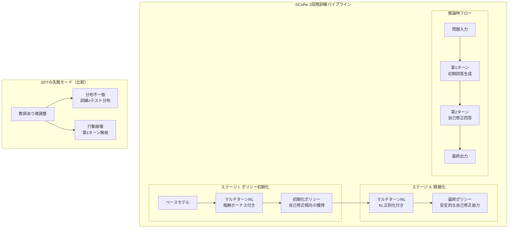

# Training Language Models to Self-Correct via Reinforcement Learning (SCoRe)

- **Link**: https://arxiv.org/abs/2409.12917
- **Authors**: Aviral Kumar, Vincent Zhuang, Rishabh Agarwal, Yi Su, John D Co-Reyes, Avi Singh, Kate Baumli, Shariq Iqbal, Colton Bishop, Rebecca Roelofs, Lei M Zhang, Kay McKinney, Disha Shrivastava, Cosmin Paduraru, George Tucker, Doina Precup, Feryal Behbahani, Aleksandra Faust
- **Year**: 2024
- **Venue**: arXiv preprint (cs.LG)
- **Type**: Academic Paper

## Abstract

Self-correction -- the ability to correct reasoning mistakes during inference -- is a highly desirable capability for large language models (LLMs), yet existing approaches have shown limited effectiveness. This paper introduces SCoRe (Self-Correction via Reinforcement Learning), a novel multi-turn online reinforcement learning approach that trains language models to self-correct using exclusively self-generated data. The authors demonstrate that supervised fine-tuning alone proves insufficient for self-correction due to distribution mismatch between training-time and test-time correction behavior, leading to behavioral collapse. SCoRe addresses this through a two-stage training procedure: Stage I establishes a policy initialization via multi-turn RL on a base model with reward bonuses, while Stage II refines self-correction with KL regularization. On the MATH benchmark, SCoRe achieves a 15.6% improvement with Gemini 1.0 Pro, and on HumanEval, a 9.1% improvement with Gemini 1.5 Flash, establishing state-of-the-art self-correction performance without multiple models or external supervision.

## Abstract（日本語訳）

自己修正 -- 推論中に推論の誤りを修正する能力 -- は大規模言語モデル（LLM）にとって非常に望ましい能力であるが、既存のアプローチは限定的な有効性しか示していない。本論文はSCoRe（Self-Correction via Reinforcement Learning）を導入する。これは、自己生成データのみを用いてモデルに自己修正を訓練する新しいマルチターンオンライン強化学習アプローチである。著者らは、教師あり微調整（SFT）のみでは、訓練時とテスト時の修正行動間の分布不一致により行動崩壊が生じるため、自己修正には不十分であることを実証する。SCoReは2段階の訓練手順でこれに対処する：ステージIは報酬ボーナスを伴うベースモデルへのマルチターンRLによるポリシー初期化を確立し、ステージIIはKL正則化による自己修正の精緻化を行う。MATHベンチマークではGemini 1.0 Proで15.6%の改善、HumanEvalではGemini 1.5 Flashで9.1%の改善を達成し、複数モデルや外部監督なしで最先端の自己修正性能を確立した。

## 概要

本研究は、Huang et al. (2023)が示した「LLMは推論を自己修正できない」という問題に対する根本的な解決策を提示するものである。強化学習を用いてモデルに自己修正能力を直接訓練するという新しいパラダイムを提案する。

主要な貢献は以下の通り：

1. **SFTの限界の分析**: 教師あり微調整が自己修正に失敗する理由を、分布不一致と行動崩壊の観点から理論的に説明
2. **2段階RL訓練手法（SCoRe）**: 報酬ボーナスによる初期化とKL正則化による精緻化を組み合わせた実用的な訓練アルゴリズムの提案
3. **自己生成データのみの使用**: 外部モデルや人間のフィードバックに依存せず、モデル自身が生成するデータのみで自己修正を学習
4. **大幅な性能改善の実証**: MATHで15.6%、HumanEvalで9.1%という大幅な改善をState-of-the-artとして達成

データ分析エージェント研究の文脈において、本論文はエージェントの推論品質を推論時に動的に改善する実践的手法を提供する。

## 問題と動機

- **内在的自己修正の失敗**: Huang et al. (2023, ICLR 2024)が示したように、LLMは外部フィードバックなしには自己修正に失敗し、性能が低下する
- **SFTの分布不一致問題**: 教師あり微調整では、訓練時に正しい修正データを使用しても、テスト時のモデル自身の出力分布との不一致が生じる
- **行動崩壊（Behavioral Collapse）**: SFTで訓練されたモデルは、第2ターンで第1ターンの出力を無視し、独立した回答を生成する傾向がある（実質的に自己修正を行わない）
- **外部依存の排除**: 複数モデルの組み合わせや外部検証器に依存しない、単一モデルでの自己修正能力の実現

## 提案手法

**SCoRe: Self-Correction via Reinforcement Learning**

### なぜSFTが失敗するか

教師あり微調整の2つの根本的問題：

1. **分布不一致**: 訓練データの修正ペアは理想的な（正解→正解）の修正を示すが、テスト時にはモデル自身の（しばしば不正確な）出力を修正する必要がある
2. **行動崩壊**: SFTで訓練されたモデルは、第1ターンの出力を条件として利用せず、第2ターンで完全に独立した回答を生成。これはベースモデルの第1ターンへのKL正則化がないことに起因

### ステージI: 報酬ボーナスによるポリシー初期化

- ベースモデルに対してマルチターンRLを実行
- **報酬ボーナス**: 第2ターンの報酬に対してボーナス項を追加し、自己修正の試行を奨励
- 目的: 自己修正が報酬的に有利であることをモデルに学習させる初期ポリシーの確立
- ベースモデルの能力を保持しつつ、修正行動への傾向を植え付ける

### ステージII: KL正則化によるマルチターンRL

- ステージIで初期化されたポリシーに対して、さらにマルチターンRLを実行
- **KL正則化**: ステージIのポリシーからの過度な乖離を防止
- 動的なペナルティ係数の調整により、探索と安定性のバランスを最適化
- 第1ターンのベースモデル出力への正則化により、行動崩壊を防止

### 自己生成データの使用

- すべての訓練データはモデル自身が生成（オンポリシーRL）
- 外部の正解ラベル、検証器モデル、人間フィードバックは不使用
- モデルは自身の誤りを認識し修正する能力を、試行錯誤を通じて獲得

## アーキテクチャ / プロセスフロー



```
SCoRe vs SFT の修正行動比較:
┌──────────────────────────────────────────────────────────┐
│ SFT (失敗モード):                                        │
│   第1ターン: "答えは42です"                               │
│   第2ターン: "答えは37です" (第1ターンを無視、独立生成)    │
│                                                          │
│ SCoRe (成功モード):                                      │
│   第1ターン: "答えは42です"                               │
│   第2ターン: "第1ターンの計算を見直すと、ステップ3で      │
│              符号を間違えていました。正しくは37です"       │
│              (第1ターンを参照し、具体的な修正を実行)       │
└──────────────────────────────────────────────────────────┘
```

## Figures & Tables

### Table 1: MATHベンチマークにおける自己修正性能比較

| 手法 | Turn 1 精度 | Turn 2 精度 | 改善幅 |
|------|------------|------------|--------|
| ベースモデル（Gemini 1.0 Pro） | ベースライン | -- | -- |
| SFT | 微改善 | 行動崩壊 | ~0% |
| STaR | 小改善 | 限定的改善 | 小 |
| **SCoRe** | **維持** | **+15.6%** | **最大** |

SCoReは第1ターンの性能を維持しつつ、第2ターンで15.6%の大幅な改善を達成。SFTは行動崩壊により第2ターンでの改善が実質的にゼロ。

### Table 2: HumanEvalベンチマークにおける自己修正性能比較

| 手法 | モデル | 改善幅 |
|------|--------|--------|
| ベースライン | Gemini 1.5 Flash | -- |
| **SCoRe** | Gemini 1.5 Flash | **+9.1%** |

コード生成タスクにおいても、SCoReは有意な自己修正性能の改善を実証。

### Figure 1: SFTにおける行動崩壊の可視化

SFTで訓練されたモデルの第2ターン出力が、第1ターンの出力と統計的に独立であることを示す。第2ターンの回答分布がベースモデルの無条件分布と類似し、第1ターンの情報を活用していないことを示す。

### Figure 2: 訓練段階ごとの報酬曲線

ステージI（報酬ボーナス）とステージII（KL正則化）の訓練過程における報酬の推移。ステージIで自己修正傾向が急速に獲得され、ステージIIで安定化する過程を示す。

### Figure 3: KL正則化係数と性能のトレードオフ

KL正則化の強度と自己修正性能の関係。正則化が弱すぎると行動崩壊が発生し、強すぎると修正能力が制限される。最適な係数が存在することを示す。

### Table 3: アブレーション実験（ステージI/IIの効果）

| 構成 | MATH改善 | HumanEval改善 |
|------|---------|--------------|
| ステージIのみ | 中程度 | 中程度 |
| ステージIIのみ | 限定的 | 限定的 |
| **ステージI + II（SCoRe）** | **15.6%** | **9.1%** |

両ステージの組み合わせが必要であり、いずれか単独では最適な性能に到達しない。

## 実験と評価

### 実験設定

- **モデル**: Gemini 1.0 Pro（MATHベンチマーク）、Gemini 1.5 Flash（HumanEvalベンチマーク）
- **ベンチマーク**: MATH（数学的推論）、HumanEval（コード生成）
- **比較手法**: ベースモデル、SFT、STaR（Self-Taught Reasoner）
- **訓練データ**: モデル自身が生成するオンポリシーデータのみ

### 主要結果

**MATHベンチマーク（Gemini 1.0 Pro）**:
- SCoReは第2ターンで15.6%の精度改善を達成
- SFTは分布不一致により実質的な改善なし（行動崩壊）
- STaRは限定的な改善に留まる

**HumanEvalベンチマーク（Gemini 1.5 Flash）**:
- SCoReは9.1%の精度改善を達成
- コード生成タスクにおいても自己修正が有効であることを実証

**SFTの失敗分析**:
- 訓練時の修正データがモデル自身の出力分布と異なるため、テスト時に学習した修正パターンが適用できない
- 第2ターンが第1ターンの出力を条件として利用せず、独立した回答を生成（行動崩壊）

**アブレーション結果**:
- ステージIの報酬ボーナスが自己修正傾向の獲得に不可欠
- ステージIIのKL正則化が過度な方策変化を防ぎ、安定した修正を実現
- 両ステージの組み合わせが最適な性能に必要

### State-of-the-Art の達成

SCoReは、外部の検証器モデル、複数のLLMの組み合わせ、人間のフィードバックを使用せずに、単一モデルでの自己修正における最先端性能を達成。

## 備考

### データ分析エージェントへの示唆

本研究は、データ分析エージェントの設計において以下の重要な知見を提供する：

1. **訓練時の自己修正能力獲得**: 推論時のプロンプティングではなく、訓練段階でRLを用いて自己修正能力を組み込むことが効果的
2. **分布不一致の回避**: エージェントの訓練データは、実際の推論時の出力分布と一致させる必要がある（オンポリシー学習の重要性）
3. **行動崩壊への対策**: KL正則化やステージ分割による漸進的な能力獲得が、安定した自己修正に不可欠
4. **単一モデルでの実現可能性**: 外部検証器なしに、モデル自身で自己修正が可能であることが示された

### Huang et al. (2023) との関係

本論文は、「LLMは推論を自己修正できない」（Paper 14）という知見を直接的に受けて、その限界を克服するアプローチを提示している：

- Huang et al.が指摘した「内在的自己修正の失敗」は、プロンプティングベースのアプローチの限界
- SCoReはRLによる訓練を通じて、モデルの重みレベルで自己修正能力を獲得させることで、この制約を突破
- ただし、訓練コスト（RL訓練のオーバーヘッド）と推論コスト（2ターンの生成）のトレードオフは残存

### 限界と今後の課題

- Geminiファミリーに限定された評価であり、他のモデルファミリーへの汎用性は未検証
- 2ターンに限定されており、3ターン以上の反復的自己修正への拡張は未探索
- MATHとHumanEvalの2つのベンチマークに限定されており、自然言語推論やマルチモーダルタスクへの適用は未検証
- RL訓練のコンピュテーショナルコストが大きく、実用的なスケーラビリティの検討が必要

### 関連研究との位置づけ

- **Huang et al. (2023)**: 内在的自己修正の失敗を実証。本研究の直接的な動機
- **STaR（Zelikman et al., 2022）**: 自己教師型推論改善。SCoReはこれをマルチターン設定に拡張
- **ReST（Gulcehre et al., 2023）**: 強化自己訓練。SCoReは自己修正に特化した報酬設計を導入
- **Reflexion（Shinn et al., 2023）**: 環境フィードバックによる反省。SCoReは外部フィードバック不要
