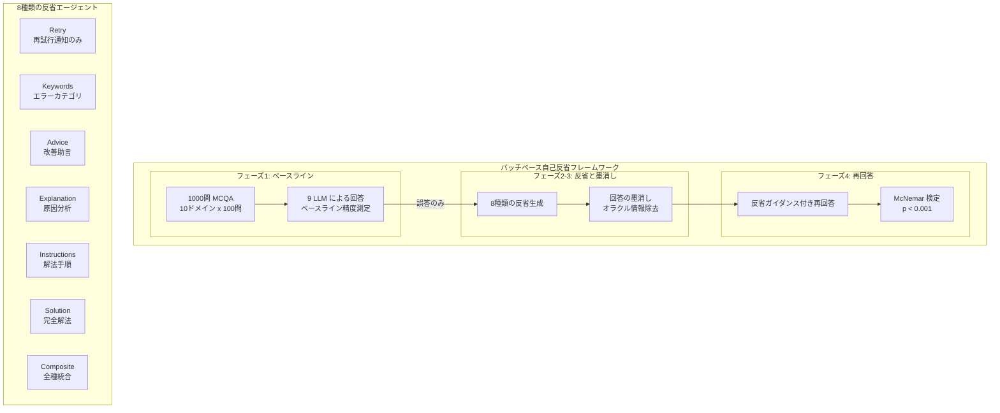

# Self-Reflection in LLM Agents: Effects on Problem-Solving Performance

- **Link**: https://arxiv.org/abs/2405.06682
- **Authors**: Matthew Renze, Erhan Guven
- **Year**: 2024
- **Venue**: 2nd International Conference on Foundation and Large Language Models (FLLM 2024), pp. 476-483
- **Type**: Academic Paper

## Abstract

In this study, the authors examine the effects of self-reflection in large language model (LLM) agents on problem-solving performance. They instruct nine popular LLMs to answer a series of multiple-choice questions to obtain a baseline performance for each model. Then they expression eight types of self-reflecting LLM agents to analyze errors in their reasoning, then attempt to re-answer the questions with the benefit of their own guidance. The results demonstrate that LLM agents significantly improve their problem-solving performance through self-reflection (p < 0.001). The study also compares various self-reflection approaches to assess the individual contributions of each type to the overall performance gains.

## Abstract（日本語訳）

本研究では、大規模言語モデル（LLM）エージェントにおける自己反省が問題解決性能に与える影響を検証する。9つの主要なLLMに対して多肢選択問題のシリーズに回答させ、各モデルのベースライン性能を取得する。次に、8種類の自己反省LLMエージェントを構築し、推論の誤りを分析させた後、自身のガイダンスの恩恵を受けて問題の再回答を試みさせる。結果は、LLMエージェントが自己反省を通じて問題解決性能を有意に改善することを示す（p < 0.001）。また、各種自己反省アプローチを比較し、全体的な性能向上への各タイプの個別貢献を評価する。

## 概要

本論文は、LLMエージェントの自己反省（self-reflection）能力を体系的に検証した大規模実験研究である。Huang et al. (2023)の「LLMは推論を自己修正できない」という主張とは対照的に、適切に設計された自己反省プロセスが問題解決性能を有意に改善することを統計的に実証している。

主要な貢献は以下の通り：

1. **8種類の自己反省エージェントの体系的比較**: 単純なリトライから複合型まで、反省の粒度と種類を系統的に変化させた比較実験
2. **9モデルx10ベンチマークの大規模評価**: 多様なLLMとドメインにわたる広範な評価で、結果の一般性を確保
3. **統計的有意性の確認**: McNemar検定により、すべての反省タイプで有意な改善（p < 0.001）を確認
4. **バッチベースの実験フレームワーク**: 先行研究の逐次的アプローチとは異なり、バッチ処理による体系的な評価を実現

データ分析エージェントの文脈において、本論文はどのような自己反省メカニズムがどの程度の改善をもたらすかの定量的な指針を提供する。

## 問題と動機

- **自己修正の有効性に関する論争**: Huang et al. (2023)が「LLMは推論を自己修正できない」と主張したのに対し、他の研究では改善を報告しており、矛盾する知見が存在
- **反省タイプの未整理**: 既存研究は特定の反省アプローチのみを評価しており、異なる反省タイプの比較や個別貢献の分析が不足
- **モデル横断的な検証の不足**: 単一モデルや少数のモデルでの評価が多く、結果の一般性が不明
- **統計的厳密性の欠如**: 多くの先行研究が統計的検定なしに性能差を報告しており、結果の信頼性が不確実

## 提案手法

**バッチベース自己反省実験フレームワーク**

### 実験の4フェーズ

1. **ベースライン回答**: 9つのLLMに1,000問の多肢選択問題に回答させる
2. **反省生成**: 誤答した問題に対して、8種類の反省プロンプトで自己分析を生成
3. **回答の墨消し（Redaction）**: 反省テキストから正解情報を除去し、オラクル情報の漏洩を防止
4. **再回答**: 墨消しされた反省ガイダンスを用いて再回答

### 8種類の自己反省エージェント

1. **Baseline**: コントロール群（反省なし）
2. **Retry**: 単純な再試行通知（「前回は不正解でした」のみ）
3. **Keywords**: エラータイプのカテゴリ分類
4. **Advice**: 一般的な改善アドバイス
5. **Explanation**: エラー原因の分析と説明
6. **Instructions**: 順序付きの問題解決ステップ
7. **Solution**: ステップバイステップの解法提示
8. **Composite**: 上記6種類すべてを組み合わせた複合型

加えて、**Unredacted**（正解情報が含まれる上界コントロール）を設定。

### 回答の墨消し処理

反省テキストから正解の選択肢（A, B, C, D）への直接的な言及を除去する処理。これにより、Huang et al. (2023)が指摘した「オラクル情報の混入」問題を回避し、純粋な反省の効果を測定。

## アーキテクチャ / プロセスフロー



```
反省の粒度と情報量の階層:
┌──────────────────────────────────────────────────────────┐
│ 情報量: 少 ──────────────────────────────── 多           │
│                                                          │
│ Retry < Keywords < Advice < Explanation < Instructions   │
│                                         < Solution       │
│                                         < Composite      │
│                                                          │
│ ※ Retry（「不正解でした」のみ）でも有意な改善            │
│ ※ Composite（全統合）が最大の改善                         │
└──────────────────────────────────────────────────────────┘
```

## Figures & Tables

### Table 1: エージェントタイプ別の性能（GPT-4）

| エージェントタイプ | GPT-4 精度 | 改善幅 |
|------------------|-----------|--------|
| Baseline | 0.786 | -- |
| Retry | 0.827 | +4.1% |
| Keywords | -- | 中程度 |
| Advice | -- | 中程度 |
| Explanation | -- | 中程度 |
| Instructions | -- | 中〜大 |
| Solution | 0.925 | +13.9% |
| Composite | 0.932 | +14.6% |
| Unredacted（上界） | 0.971 | +18.5% |

Compositeエージェントが最大の改善を達成し、Unredacted上界に近い性能を実現。Retryエージェント（最小情報量）でも4.1%の有意な改善。

### Table 2: モデル別ベースライン性能

| モデル | ベースライン精度 |
|--------|----------------|
| Claude 3 Opus | 79.2% |
| GPT-4 | 78.6% |
| Gemini 1.5 Pro | 中〜高 |
| GPT-3.5 Turbo | 中程度 |
| Llama 2 70B | 中程度 |
| Mistral Large | 中程度 |
| Cohere Command R+ | 中程度 |
| Gemini 1.0 Pro | 中程度 |
| Llama 2 7B | 29.7% |

9モデルすべてで、ベースライン性能の差に関わらず、一貫した改善パターンを確認。

### Figure 1: ドメイン別の改善パターン

| ドメイン | GPT-4改善幅 | 特記事項 |
|---------|------------|---------|
| LSAT-AR（分析的推論） | ~39% | 最大改善 |
| ARC（科学） | 中程度 | -- |
| AQUA-RAT（数学） | 中程度 | -- |
| MedMCQA（医学） | 中程度 | -- |
| SAT-English（英語） | 最小 | 天井効果 |

LSAT-AR（分析的推論）で最大の改善が見られ、反省が特に分析的・論理的タスクで有効であることを示唆。

### Figure 2: 統計的検定結果の可視化

McNemar検定によるカイ二乗統計量の分布。すべての反省タイプと全9モデルの組み合わせで、p < 0.001の有意水準を達成。不一致ペア（正解↔不正解の変化）の分析により、改善方向（不正解→正解）が悪化方向（正解→不正解）を一貫して上回ることを確認。

## 実験と評価

### 実験設定

- **データセット**: 10の確立されたベンチマークから各100問、計1,000問の多肢選択問題
  - ARC（科学）、AQUA-RAT（数学）、SAT-Math（数学）、HellaSwag（常識）、LogiQA（論理）、LSAT各種（法律）、MedMCQA（医学）、SAT-English（英語）
- **モデル**: GPT-4、GPT-3.5 Turbo、Claude 3 Opus、Gemini 1.5 Pro、Gemini 1.0 Pro、Llama 2 70B、Llama 2 7B、Mistral Large、Cohere Command R+
- **統計手法**: McNemar検定（対応のある二値データの比較）

### 主要結果

**全体的改善**: すべてのLLMエージェントが自己反省を通じて問題解決性能を有意に改善（p < 0.001）。

**反省タイプ別効果**:
- **Retryエージェント**: 最小情報量（「不正解でした」のみ）で+4.1%の改善。「より注意深く取り組む」効果、または代替回答の選択を示唆
- **Solutionエージェント**: +13.9%の改善。ステップバイステップの解法提示が高い効果
- **Compositeエージェント**: +14.6%の改善で最大。全反省タイプの統合による相乗効果

**モデル依存性**: 9モデルすべてで一貫した改善パターン。ベースライン性能の高低に関わらず改善が見られるが、低性能モデル（Llama 2 7B）では改善幅が相対的に大きい。

**ドメイン依存性**: LSAT-AR（分析的推論）で最大の改善（~39%）。SAT-English（英語）では天井効果により改善が最小。反省の効果は論理的・分析的タスクで特に顕著。

### 統計的分析

McNemar検定により、対応のある二値結果（正解/不正解）の変化を評価。カイ二乗統計量は不一致ペアの分析に基づき、すべての反省タイプ×モデルの組み合わせでp < 0.001を達成。

## 備考

### Huang et al. (2023) との対比

本論文の結果は、Huang et al. (2023, Paper 14)の「LLMは推論を自己修正できない」という主張と表面上矛盾する。ただし、重要な実験設計の違いがある：

1. **タスク形式**: 本研究は多肢選択問題（MCQA）に限定。Huang et al.はオープンエンドの推論タスクを含む
2. **反省のタイミング**: 本研究はバッチベース（全問回答後に反省）。Huang et al.は逐次的
3. **回答の墨消し**: 本研究はオラクル情報の漏洩を明示的に除去。ただし「不正解でした」という情報自体がオラクルフィードバックの一種
4. **Retryエージェントの意味**: 「不正解」の通知は外部フィードバックであり、Huang et al.の定義する「内在的自己修正」とは異なる

### データ分析エージェントへの示唆

1. **反省メカニズムの段階的設計**: 単純なリトライから複合型まで、タスクの複雑性に応じた反省レベルの選択が可能
2. **外部フィードバックとの組み合わせ**: データ分析タスクではコード実行結果やテスト結果が利用可能であり、反省メカニズムとの組み合わせでさらなる改善が期待
3. **ドメイン特性の考慮**: 論理的・分析的タスクで反省の効果が大きいため、データ分析の推論ステップで特に有効
4. **コスト対効果**: Compositeエージェント（+14.6%）とSolution（+13.9%）の差は小さく、必要な反省タイプの選択でコストを削減可能

### 限界と今後の課題

- 多肢選択問題（単一ステップ）に限定されており、マルチステップ推論への一般化は未検証
- 「不正解」の通知は外部フィードバックであり、完全な内在的自己修正の検証ではない
- APIの安全フィルタによるエラー（~1-2.8%）がノイズとなっている可能性
- 100%に近い精度での天井効果によるスコア圧縮
- LSAT-AR（分析的推論）の大幅な改善が集計結果を偏らせている可能性

### 関連研究との位置づけ

- **Huang et al. (2023)**: 内在的自己修正の失敗を実証。本研究は条件付きで反論
- **Reflexion（Shinn et al., 2023）**: 環境フィードバックによる反省。本研究はフィードバック種類を体系化
- **Self-Refine（Madaan et al., 2023）**: 反復的自己改善。本研究は反省タイプの分解分析を追加
- **SCoRe（Kumar et al., 2024）**: RLによる自己修正訓練。本研究はプロンプティングベースのアプローチで補完的
