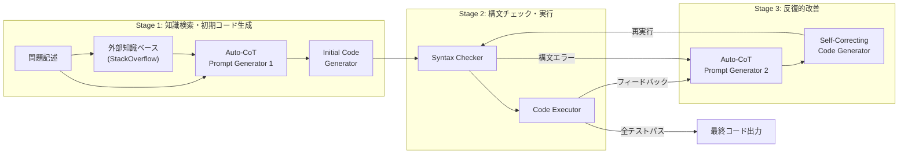
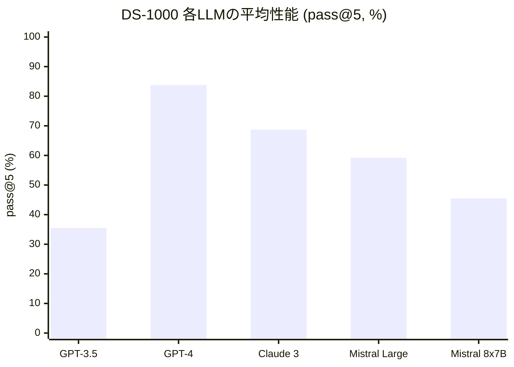
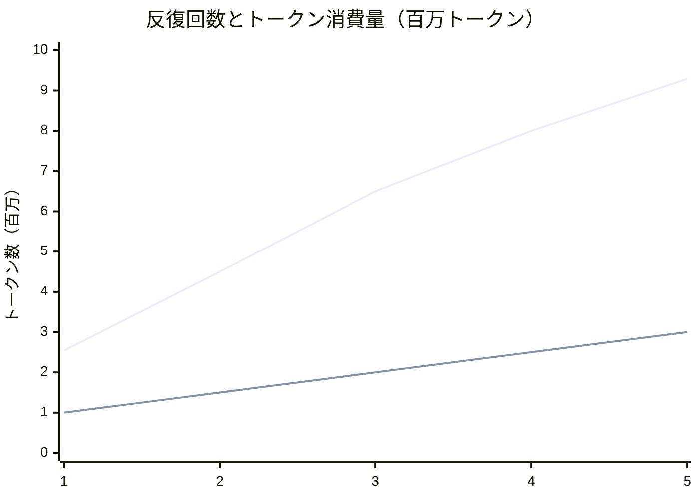

# CoT-SelfEvolve: An Empirical Study on Self-correcting Large Language Models for Data Science Code Generation

- **Link**: https://arxiv.org/abs/2408.15658
- **Authors**: Thai Tang Quoc, Duc Ha Minh, Tho Quan Thanh, Anh Nguyen-Duc
- **Year**: 2024 (arXiv: August 2024; FSE2025 採録: August 2025)
- **Venue**: ACM International Conference on the Foundations of Software Engineering (FSE2025)
- **Type**: Academic Paper

## Abstract

Large Language Models (LLMs) have recently advanced many applications on software engineering tasks, particularly the potential for code generation. Among contemporary challenges, code generated by LLMs often suffers from inaccuracies and hallucinations, requiring external inputs to correct. One recent strategy to fix these issues is to refine the code generated from LLMs using the input from the model itself (self-augmented). In this work, we proposed a novel method, namely CoT-SelfEvolve. CoT-SelfEvolve iteratively and automatically refines code through a self-correcting process, guided by a chain of thought constructed from real-world programming problem feedback. Focusing on data science code, including Python libraries such as NumPy and Pandas, our evaluations on the DS-1000 dataset demonstrate that CoT-SelfEvolve significantly outperforms existing models in solving complex problems. The framework shows substantial improvements in both initial code generation and subsequent iterations, with the model's accuracy increasing significantly with each additional iteration.

## Abstract（日本語訳）

大規模言語モデル（LLM）は、ソフトウェアエンジニアリングタスク、特にコード生成の可能性において多くの応用を進歩させている。しかし、LLMが生成するコードは不正確さや幻覚（hallucination）に悩まされることが多く、修正のために外部入力を必要とする。本研究では、CoT-SelfEvolveという新しい手法を提案する。CoT-SelfEvolveは、実世界のプログラミング問題からのフィードバックに基づいて構築されたChain-of-Thought（CoT）に導かれ、自己修正プロセスを通じてコードを反復的かつ自動的に改善する。NumPyやPandasなどのPythonライブラリを含むデータサイエンスコードに焦点を当て、DS-1000データセットでの評価により、CoT-SelfEvolveが既存モデルを大幅に上回る性能を示すことを実証した。

## 概要

本論文は、LLMによるデータサイエンスコード生成における自己修正フレームワーク「CoT-SelfEvolve」を提案する実証研究である。既存のSelfEvolveフレームワークに対し、（1）StackOverflowから抽出した外部知識ベース（558,402投稿、972,513関連コメント）を活用したChain-of-Thought（CoT）プロンプティング、（2）構文チェッカーとコード実行器による二重フィードバック機構、という2つの革新的要素を統合している。フレームワークは3段階で動作する：Stage 1では外部知識検索とCoTプロンプトに基づく初期コード生成、Stage 2では構文チェックとユニットテスト実行、Stage 3ではエラーフィードバックに基づく反復的改善を行う。DS-1000ベンチマーク上で、GPT-3.5使用時にpass@5で35.5%（SelfEvolveの30.5%から16.39%の相対改善）、GPT-4使用時に39.5%を達成し、反復回数を1から5に増やすことで全体精度が14.0%から83.2%に向上することを示した。

## 問題設定

本論文は以下の問題に取り組んでいる：

- **データサイエンスコード生成の特殊な困難性**: データサイエンスコードは、データ分析、モデル構築、可視化、デプロイメントなどの探索的タスクを含み、NumPy、Pandas、Scikit-learn等のドメイン固有ライブラリの理解が必要であるため、通常のコード生成よりもエラーやバグが発生しやすい。
- **既存の自己修正フレームワークの限界**: Self-Refine、Reflexion、SelfEvolve等の既存フレームワークは、（1）エラーメッセージの複雑なトレースバック解析能力の不足、（2）外部知識の未活用、（3）初期コード品質の低さによる修正効率の低下、という課題を抱えている。
- **3つの研究課題（RQ）**: RQ1: CoT-SelfEvolveの性能は既存手法と比較してどうか、RQ2: Auto-CoTプロンプト生成器はモデル性能を改善するか、RQ3: 反復回数の増加は性能にどう影響し、トークン消費量はどう変化するか。

## 提案手法

### CoT-SelfEvolveフレームワーク

CoT-SelfEvolveは、SelfEvolveフレームワークをベースとし、CoTプロンプティングと外部知識ベースを統合した3段階の自己修正フレームワークである。

#### Stage 1: 外部知識検索と初期コード生成

1. **外部知識検索**: 問題記述に基づきStackOverflowから関連情報を取得する。StackOverflowの大規模データダンプ（558,402投稿、972,513コメント）を前処理し、OpenAIのtext-embedding-ada-002で1,536次元のベクトルに変換、Chromaベクトルデータベースに格納している。
2. **Auto-CoT Prompt Generator 1**: 問題記述とStackOverflow文書を組み合わせ、段階的な解決指針を生成する。「CoT-Guru」と名付けられたエキスパートペルソナを用いて、別のコード生成エージェントに対するステップバイステップの提案を生成する。
3. **Initial Code Generator**: CoTプロンプトに導かれてコードを生成する。

#### Stage 2: 構文チェックとコード実行

1. **Syntax Checker**: 生成コードの構文を検証し、構文エラーをコード実行前に検出する。これはSelfEvolveからの改善点であり、構文エラーのある不正なコードの実行を回避し、計算資源を節約する。
2. **Code Executor**: DS-1000ベンチマークが要求する特定バージョンのライブラリを含む仮想環境を構築し、ユニットテストに対してコードを実行する。トレースバックエラー情報を収集する。

#### Stage 3: フィードバックに基づく反復的改善

1. **Auto-CoT Prompt Generator 2**: 構文チェッカーまたはコード実行器からのフィードバックに基づき、修正用のCoTプロンプトを生成する。トレースバックエラーメッセージの根本原因分析、期待出力形式の決定、解決ステップの提示を行う。
2. **Self-Correcting Code Generator**: CoTプロンプトに従い修正コードを生成する。
3. **反復ループ**: 全ユニットテストをパスするか、最大反復回数nに達するまで繰り返す。

### 外部知識ベースの構築

- StackOverflowのXML形式データを前処理し、各投稿と関連コメントを構造化文書に変換
- コンテキストウィンドウ制限（約4,000トークン）を考慮し、文書全体を3,000トークン以下に維持
- 各投稿に最低10コメントの下限を設定した貪欲割り当てアルゴリズムを実装
- text-embedding-ada-002による1,536次元埋め込みベクトルを生成し、HNSWインデキシングでChromaベクトルDBに格納

## Figures & Tables

### 図1: CoT-SelfEvolveフレームワークのアーキテクチャ

### 表1: RQ2 - DS-1000データセットにおけるCoTプロンプトの有無による性能比較（pass@5, %）

| Auto-CoT 1 | Auto-CoT 2 | SciPy | PyTorch | Sklearn | Matplotlib | Pandas | NumPy | TensorFlow | Overall |
|:---:|:---:|:---:|:---:|:---:|:---:|:---:|:---:|:---:|:---:|
| **off** | **off** | 33.02 | 64.71 | 59.13 | 26.45 | 23.02 | 14.09 | 42.22 | **30.5** |
| on | off | 28.3 | 75 | 63.48 | 29.68 | 29.21 | 17.27 | 51.11 | 34.6 |
| **on** | **on** | 32.08 | 72.06 | 66.09 | 32.26 | 29.55 | 17.73 | 46.67 | **35.5** |
| off | on | 23.58 | 66.18 | 53.91 | 29.68 | 30.24 | 18.18 | 44.22 | 32.4 |

### 表2: RQ3 - 最大反復回数別の精度（GPT-4, pass@n, %）

| max_attempts (n) | SciPy | PyTorch | Sklearn | Matplotlib | Pandas | NumPy | TensorFlow | Overall |
|:---:|:---:|:---:|:---:|:---:|:---:|:---:|:---:|:---:|
| 1 | 19.81 | 7.35 | 6.09 | 16.77 | 14.78 | 16.36 | 4.44 | **14.0** |
| 2 | 47.17 | 29.41 | 38.26 | 59.35 | 49.14 | 38.18 | 57.78 | **45.9** |
| 3 | 49.06 | 45.59 | 58.26 | 70.97 | 66.32 | 56.82 | 62.22 | **60.6** |
| 4 | 50.00 | 67.65 | 82.61 | 79.35 | 82.82 | 59.55 | 82.22 | **72.6** |
| 5 | **53.63** | **88.71** | **96.84** | **84.56** | **92.49** | **75.92** | **82.49** | **83.2** |

### 図2: 各LLMにおけるDS-1000平均性能比較（pass@5, %）

### 図3: 反復回数とトークン消費量の関係

### 表3: 異なるLLMスタック構成における性能（RQ2, pass@5, %）

| Auto-CoT LLM | Code LLM | SciPy | PyTorch | Sklearn | Matplotlib | Pandas | NumPy | TensorFlow | Overall |
|:---:|:---:|:---:|:---:|:---:|:---:|:---:|:---:|:---:|:---:|
| GPT-3.5 | GPT-3.5 | 32.08 | 72.06 | 66.09 | 32.26 | 29.55 | 17.73 | 46.67 | **35.5** |
| GPT-4 | GPT-3.5 | 37.74 | 83.82 | 73.04 | 35.48 | 31.62 | 19.55 | 53.33 | **39.5** |

## 実験・評価

### 実験設定

- **ベンチマーク**: DS-1000データセット（1,000問のデータサイエンスプログラミング問題、7つのPythonライブラリ対象）。Completionタイプの問題に焦点を当て、SelfEvolveと同じ実験条件でSciPy、PyTorch、Sklearn、Matplotlibの444問で比較。
- **評価指標**: pass@n（n回の最大試行回数以内に全ユニットテストをパスする問題の割合）。nは1から5まで評価。
- **ベースライン**: SelfEvolve（ベースモデル）、Self-Refine、Self-debug
- **使用モデル**: GPT-3.5（gpt-3.5-turbo-1106）、GPT-4、Claude 2.1（70Bパラメータ）、Claude 3、Mistral Large、Mistral 8x7B
- **外部知識ベース**: StackOverflow 558,402投稿 + 972,513コメント

### 主要結果

#### RQ1: 既存手法との比較
- CoT-SelfEvolveは、SelfEvolveと比較してSciPy、PyTorch、Sklearn、Matplotlibの4ライブラリで一貫した性能向上を達成
- GPT-4が最高性能（83.8%）、次いでGPT-3.5（35.5%）。Claude 2.1（70Bパラメータ）は53.7%で、より大規模なGPT-3.5（175Bパラメータ）を上回った
- Self-Refineの改善率（6-15%）やSelf-evolveの改善率（6-15%）に対し、CoT-SelfEvolveは最大37%の改善（GPT-4.0のSklearnで60%→97.39%）を達成

#### RQ2: Auto-CoTプロンプト生成器の効果
- Auto-CoTプロンプト生成器の使用により、全体性能が16.39%の相対改善
- 初期コード生成段階での改善（34.6%向上）が自己修正段階での改善（32.4%向上）より顕著
- GPT-4をAuto-CoT生成器に使用しGPT-3.5をコード生成に使用する構成で、全GPT-3.5構成に対し11.26%の相対性能向上

#### RQ3: 反復回数とトークン消費量
- 反復回数を1から5に増やすと、全体精度が14.0%から83.2%に向上
- 最大の精度飛躍はn=1からn=2への移行時（14.0%→45.9%）に発生し、自己修正ループの起動による劇的な改善を示す
- プロンプトトークン数は2.54百万から9.29百万に急増する一方、完了トークン数の増加は緩やか
- 5回以上の反復では性能改善が鈍化し、Nielsenのユーザビリティテストの「5回で85%のバグ発見」法則と一致

## 備考

- **CI/CDパイプラインへの統合可能性**: 著者らは、MicrosoftのInferFixツールのCI統合事例を参照し、CoT-SelfEvolveをプルリクエスト時のビルド・テスト・静的解析パイプラインに組み込むことで、自動バグ検出・修正を実現する構想を提示している。
- **実用上の制約**: フレームワークはDS-1000が提供するユニットテストに依存しており、実世界のプログラミングシナリオではユニットテストが常に利用可能とは限らない点が主要な制約として挙げられている。
- **コスト対効果のトレードオフ**: Auto-CoT生成器にGPT-4を使用するとGPT-3.5のみの構成より11.26%の改善が得られるが、GPT-4のコストが高い点が考慮事項となる。重要コンポーネントにのみ高性能モデルを配置する戦略的なリソース配分が推奨される。
- **外部知識ベースの汎用性**: StackOverflowを知識ソースとして使用しているが、社内コードベースのバグ修正履歴や外部プラットフォームの議論など、多様な知識ソースへの拡張が可能である。
- **将来研究の方向性**: DSPyフレームワークに着想を得た自動プロンプト最適化、過去の実行インスタンスのメタデータ（正解/不正解、必要試行回数）を活用した学習メカニズムが提案されている。
- **温度設定の影響**: 全実験で温度0.9、top-p 0.9を使用しており、これらのパラメータ変更が結果に影響する可能性がある。
- **データ分析エージェントとの関連**: CoT-SelfEvolveの反復的自己修正メカニズムは、データ分析エージェントにおけるコード生成・実行・デバッグのループに直接適用可能であり、特にNumPy/Pandasを用いたデータ前処理や特徴量エンジニアリングの自動化に高い親和性を持つ。
