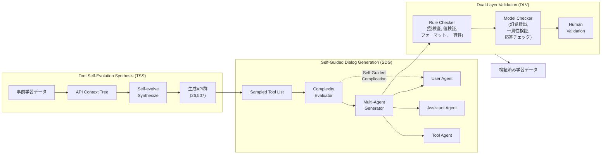

# ToolACE: Winning the Points of LLM Function Calling

- **Link**: https://arxiv.org/abs/2409.00920
- **Authors**: Weiwen Liu, Xu Huang, Xingshan Zeng, Xinlong Hao, Shuai Yu, Dexun Li, Shuai Wang, Weinan Gan, Zhengying Liu, Yuanqing Yu, Zezhong Wang, Yuxian Wang, Wu Ning, Yutai Hou, Bin Wang, Chuhan Wu, Xinzhi Wang, Yong Liu, Yasheng Wang, Duyu Tang, Dandan Tu, Lifeng Shang, Xin Jiang, Ruiming Tang, Defu Lian, Qun Liu, Enhong Chen
- **Year**: 2024 (arXiv: September 2024; ICLR 2025 採録)
- **Venue**: ICLR 2025 (International Conference on Learning Representations)
- **Type**: Academic Paper

## Abstract

Function calling significantly extends the application boundary of large language models (LLMs), where high-quality and diverse training data is critical for unlocking this capability. However, collecting and annotating real function-calling data is challenging, while synthetic data from existing pipelines often lack coverage and accuracy. In this paper, we present ToolACE, an automatic agentic pipeline designed to generate accurate, complex, and diverse tool-learning data, specifically tailored to the capabilities of LLMs. ToolACE leverages a novel self-evolution synthesis process to curate a comprehensive API pool of 26,507 diverse APIs. Dialogs are further generated through the interplay among multiple agents, under the guidance of a complexity evaluator. To ensure data accuracy, we implement a dual-layer verification system combining rule-based and model-based checks. We demonstrate that models trained on our synthesized data -- even with only 8B parameters -- achieve state-of-the-art performance on the Berkeley Function-Calling Leaderboard, comparable to the latest GPT-4 models.

## Abstract（日本語訳）

関数呼び出し（Function Calling）は、LLMの応用範囲を大幅に拡張する機能であり、この能力を解放するためには高品質かつ多様な学習データが不可欠である。しかし、実際の関数呼び出しデータの収集とアノテーションは困難であり、既存パイプラインの合成データはカバレッジと精度に欠ける。本論文では、LLMの能力に合わせて正確・複雑・多様なツール学習データを自動生成するエージェントパイプライン「ToolACE」を提案する。ToolACEは、新規の自己進化合成プロセスにより26,507の多様なAPIを含む包括的APIプールを構築する。対話はマルチエージェント間の相互作用により、複雑度評価器のガイダンスの下で生成される。データ精度を担保するため、ルールベースとモデルベースのチェックを組み合わせた二層検証システムを実装する。わずか8Bパラメータのモデルでも、Berkeley Function-Calling Leaderboard（BFCL）で最新のGPT-4モデルに匹敵するSOTA性能を達成することを実証する。

## 概要

ToolACEは、LLMの関数呼び出し能力を強化するための自動データ生成パイプラインであり、3つの主要コンポーネントで構成される：（1）Tool Self-Evolution Synthesis（TSS）：Speciation-Adaptation-Evolutionの3段階で26,507の多様なAPIを合成するモジュール、（2）Self-Guided Dialog Generation（SDG）：複雑度評価器とマルチエージェント生成器により、LLMの能力に適した複雑さの対話データを生成するモジュール、（3）Dual-Layer Validation（DLV）：ルール検証層とモデル検証層による品質保証機構。LLaMA-3.1-8B-InstructをLoRAでファインチューニングした8BパラメータモデルToolACE-8Bは、BFCL-v3リーダーボードで Overall 59.22%を達成し、全オープンソースモデルを上回りGPT-4シリーズに匹敵する性能を示した。ICLR 2025に採録されている。

## 問題設定

本論文は以下の問題に取り組んでいる：

- **関数呼び出しデータの多様性不足**: 既存のツール拡張LLM（Gorilla、ToolAlpaca、ToolLLM等）は、限られた数の公開APIに依存しており、ゼロショット汎化能力やマルチターン対話への適用性が制約されている。ToolACEの26,507 APIは、既存最大のToolLLM（16,464 API）を大幅に上回る。
- **データ複雑度とモデル能力の不整合**: 異なるLLMは事前学習フェーズで異なる知識を獲得しており、一律の複雑度のデータでは効率的な学習ができない。過度に単純なデータも過度に複雑なデータも非生産的となる。
- **合成データの正確性問題**: 合成データの不正確さはモデルの関数解釈・実行能力を阻害する。既存の検証手法は不十分であり、幻覚検出、一貫性検証、ツール応答チェックを包括的に行う仕組みが必要。
- **4種類の関数呼び出しパターンへの対応**: 単一関数呼び出し、並列関数呼び出し、依存関数呼び出し、非ツール使用対話の4パターンすべてをカバーする必要がある。

## 提案手法

### Tool Self-Evolution Synthesis（TSS）

APIの多様性を確保するための3段階の自己進化プロセス：

#### 1. Speciation（種分化）
- LLMの事前学習データ（技術マニュアル、API文書、製品仕様書、ユーザーガイド、チュートリアル）から階層的APIコンテキストツリーを構築
- フロンティアLLMを用いて各文書からAPIドメインと機能を抽出し、ツリーノードとして再帰的に生成
- 各ノードは可能なAPI機能（例：天気予報取得、株価取得、メール送信）を表す

#### 2. Adaptation（適応）
- APIコンテキストツリーからサブツリーをサンプリングし、各APIのドメインと多様性レベルを指定
- 異なるAPIが異なる機能を持つよう、個別APIごとに機能を取得
- 複雑なAPIは多数のノードをカバーし、単純なAPIは単一ノードに焦点を当てる

#### 3. Evolution（進化）
- 結果と新要件に基づくAPIの継続的改善・適応
- 多様性指標（機能追加、パラメータ型変異、返却結果更新等）を適用してAPIを多様化
- APIサンプルバッファを維持し、反復的に次世代APIを生成

### Self-Guided Dialog Generation（SDG）

#### マルチエージェント対話生成
- **User Agent**: リクエストの発行、自己誘導複雑化プロセスによる情報追加
- **Assistant Agent**: APIの呼び出し、追加情報要求、ツールフィードバック要約、非ツール回答の提供
- **Tool Agent**: API実行器として機能し、ツール説明と入力パラメータを処理して実行結果を出力
- 各エージェントアクションは複数回生成され、一貫した応答のみを採用

#### データ複雑度評価
- ファインチューニング対象のLLM自体をデータ複雑度評価器として活用
- データサンプル(x,y)に対するモデルMのロス H_M(x,y) を複雑度の指標として使用
- ロスが低い→モデルが既に習得→不要、ロスが高い→モデルにとって複雑すぎる→非生産的
- 適切な複雑度範囲を設定し、Easy/Medium/Hardの3レベルでデータをサンプリング

#### 自己誘導複雑化
- 現在のデータ複雑度に基づき、User Agentの指示を動的に調整
- 単純すぎる場合→追加APIの要求や複雑なクエリの生成で複雑度を増加
- 複雑すぎる場合→より単純なクエリの生成を促す

### Dual-Layer Validation（DLV）

#### Rule Verification Layer
4つの観点でルールベース検証を実施：
1. **API定義の明確性**: API定義が文法的・構造的要件に準拠
2. **関数呼び出しの実行可能性**: API名の一致、必須パラメータの提供、フォーマットの準拠を正規表現で検証
3. **対話の正確性**: 対話内容の論理的一貫性
4. **データサンプルの一貫性**: サンプル間の整合性

#### Model Verification Layer
LLMを用いた3つのサブタスクでモデルベース検証を実施：
1. **Hallucination Detection**: 関数呼び出しのパラメータ値がユーザークエリやシステムプロンプトに言及されていない捏造値でないかを検出
2. **Consistency Validation**: 応答がユーザーのタスクを効果的に完了し、制約や指示に準拠しているかを検証
3. **Tool Response Check**: シミュレートされたツール応答がAPI定義と整合しているかを確認

## Figures & Tables

### 図1: ToolACEの全体フレームワーク

### 表1: ToolACEと代表的ツール拡張LLMのデータ統計比較

| モデル | #API | #Domain | Nested | Parallel | Dependent | Multi-type |
|:---|:---:|:---:|:---:|:---:|:---:|:---:|
| Gorilla (Patil et al., 2023) | 1,645 | 3 | x | x | x | x |
| ToolAlpaca (Tang et al., 2023) | 3,938 | 50 | x | x | x | x |
| ToolLLM (Qin et al., 2024) | 16,464 | 49 | x | x | x | x |
| Functionary (Meetkai, 2024) | n/a | n/a | check | check | check | x |
| xLAM (Liu et al., 2024) | 3,673 | 21 | check | check | check | x |
| Granite (Abdelaziz et al., 2024) | n/a | n/a | check | check | check | x |
| **ToolACE** | **26,507** | **390** | **check** | **check** | **check** | **check** |

### 表2: BFCL-v3リーダーボードにおける性能比較（上位モデル）

| Rank | Overall | Model | Non-live (A) | Non-live (E) | Live (A) | Multi turn | Rel | Irrel |
|:---:|:---:|:---|:---:|:---:|:---:|:---:|:---:|:---:|
| 1 | 59.49 | GPT-4-turbo-2024-04-09 (FC) | 82.65 | 83.80 | 73.39 | 21.62 | 70.73 | 79.79 |
| 2 | 59.29 | GPT-4o-2024-08-06 (FC) | 85.52 | 82.96 | 71.79 | 21.25 | 63.41 | 82.91 |
| **3** | **59.22** | **ToolACE-8B (FC)** | **89.27** | **90.07** | **73.21** | **14.37** | **85.37** | **83.81** |
| 4 | 59.13 | xLAM-8x22b-r (FC) | 89.75 | 89.32 | 72.81 | 15.62 | 97.56 | 75.23 |
| 5 | 58.45 | GPT-4o-mini-2024-07-18 (FC) | 82.83 | 81.80 | 67.53 | 25.75 | 82.93 | 71.83 |

### 表3: API-Bank評価システムにおける性能比較

| カテゴリ | Model | Call | Retrieval+Call |
|:---|:---|:---:|:---:|
| API-based | gpt-3.5-turbo-0125 | 70.43 | **52.59** |
| API-based | gpt-4-0613 | 75.94 | 48.89 |
| API-based | gpt-4o-2024-05-13 | **76.19** | 42.96 |
| Open-source | LLaMA-3.1-8B-Instruct | 71.18 | 37.04 |
| Open-source | **ToolACE-8B** | **75.94** | **47.41** |

### 図2: 検証システムのアブレーション（DLV効果）

```mermaid
xychart-beta
    title "Dual-Layer Verification アブレーション (BFCL, %)"
    x-axis ["AST", "Exec", "Irrelevance", "Overall"]
    y-axis "スコア (%)" 80 --> 95
    bar [90.82, 91.18, 82.92, 89.17]
    bar [90.56, 91.81, 90.00, 89.59]
    bar [91.90, 91.41, 89.17, 90.47]
```

### 図3: モデルサイズとスケーリング性能

```mermaid
xychart-beta
    title "モデルサイズ別 Overall Accuracy (%, Qwen-1.5-xB-Chat)"
    x-axis ["0.5B", "1.8B", "4B", "7B"]
    y-axis "Accuracy (%)" 0 --> 100
    bar [20.14, 41.15, 71.00, 85.24]
    bar [14.52, 35.12, 60.94, 65.24]
```

## 実験・評価

### 実験設定

- **ベースモデル**: LLaMA-3.1-8B-Instruct（LoRAファインチューニング、rank=16, alpha=32）
- **ベンチマーク**: BFCL-v3（Berkeley Function-Calling Leaderboard v3）、API-Bank
- **比較対象**: GPT-4シリーズ、Claude シリーズ、Gorilla-OpenFunctions-v2、xLAMシリーズ、Functionary、Gemini シリーズ等
- **BFCLカテゴリ**: AST Summary（構文木構造の正確性）、Relevance Detection（関連性検出）
- **データ量**: 約60,000インスタンス（Easy/Medium/Hard各20,000）

### 主要結果

#### BFCL-v3リーダーボード
- ToolACE-8Bは Overall 59.22%でランク3位、GPT-4-turbo（59.49%）に僅差で迫る
- Non-live (A) 89.27%、Non-live (E) 90.07%でAPIベースモデルを含む全モデル中トップクラス
- Relevance Detection 85.37%、Irrelevance Detection 83.81%で優れたバランスを達成
- 同サイズのxLAM-7b-fc-r（51.45%）を全カテゴリで一貫して上回る

#### API-Bank評価
- ToolACE-8B: Call 75.94%、Retrieval+Call 47.41%でオープンソースモデル中最高
- GPT-4シリーズに匹敵する性能をAPI-Bankでも達成

### アブレーション研究

#### 検証システムの効果
- 検証なし→ルール検証のみ→二層検証の順で、Executable accuracy（91.18→91.81→91.41）とOverall（89.17→89.59→90.47）が改善
- モデル検証層はAST精度において不可欠（w.o. model: 90.56% → Final: 91.90%）

#### 複雑度の影響
- ToolACE_medium（中程度の複雑度）が最高性能を示し、Tool-use 90.47%、Irrelevance 90.19%、Overall 90.65%
- 過度に単純（Easy）または過度に複雑（Hard）なデータは最適な性能に到達しない

#### 多様性の影響
- API多様性と全体精度に正の相関を確認
- 特にIrrelevance Detection（関連性検出）において多様性の効果が顕著

#### スケーリング性能
- Qwen-1.5-xB-Chatシリーズ（0.5B〜7B）での実験で、モデルサイズとともにAST・Exec・Overall精度が向上
- 小規模モデル（0.5B, 1.8B）はraw状態で関数呼び出し能力が限定的だが、ファインチューニングにより大幅改善

#### 汎用能力への影響
- ToolACE-8BはMMUL、GSM8K、HumanEval、CommonSenseQA等の汎用ベンチマークでxLAM-7b-fc-rを大幅に上回る
- 関数呼び出し能力の強化が汎用能力を損なわないことを実証

## 備考

- **ICLR 2025採録**: 本論文はトップ機械学習会議ICLR 2025に採録されており、査読済みの高品質な研究成果である。
- **データとモデルの公開**: モデル（ToolACE-8B）とデータセットのサブセットがHugging Face（Team-ACE organization）で公開されている。
- **産業界との関連**: 著者にはHuaweiのNoah's Ark Lab、Shanghai Jiao Tong University、USTC、Tsinghua University等の研究者が含まれ、産学連携の成果である。
- **自己進化合成の新規性**: TSS（Tool Self-Evolution Synthesis）による合成API生成は、既存の公開APIに依存しない点で先行研究と根本的に異なるアプローチであり、APIの多様性とカバレッジを大幅に拡大する。
- **データ分析エージェントへの示唆**: ToolACEのデータ生成パイプラインは、データ分析エージェントが使用するツール（pandas操作、SQL実行、可視化ライブラリ等）の関数呼び出しデータ生成にも応用可能であり、エージェントのツール使用能力向上に寄与し得る。
- **マルチターン対話の課題**: BFCL-v3のMulti-turn カテゴリでは14.37%と低い性能を示しており、複雑なマルチターン対話における関数呼び出しは依然として困難な課題であることが示唆される。
