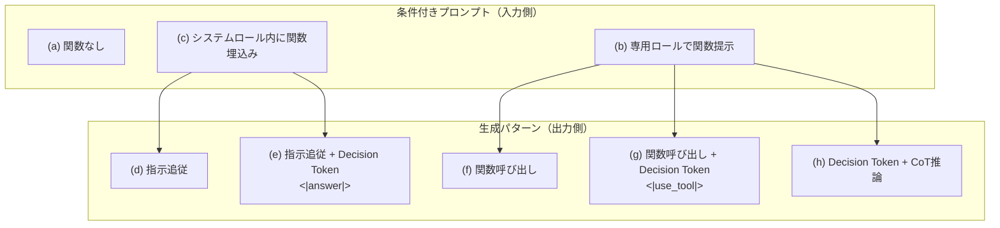
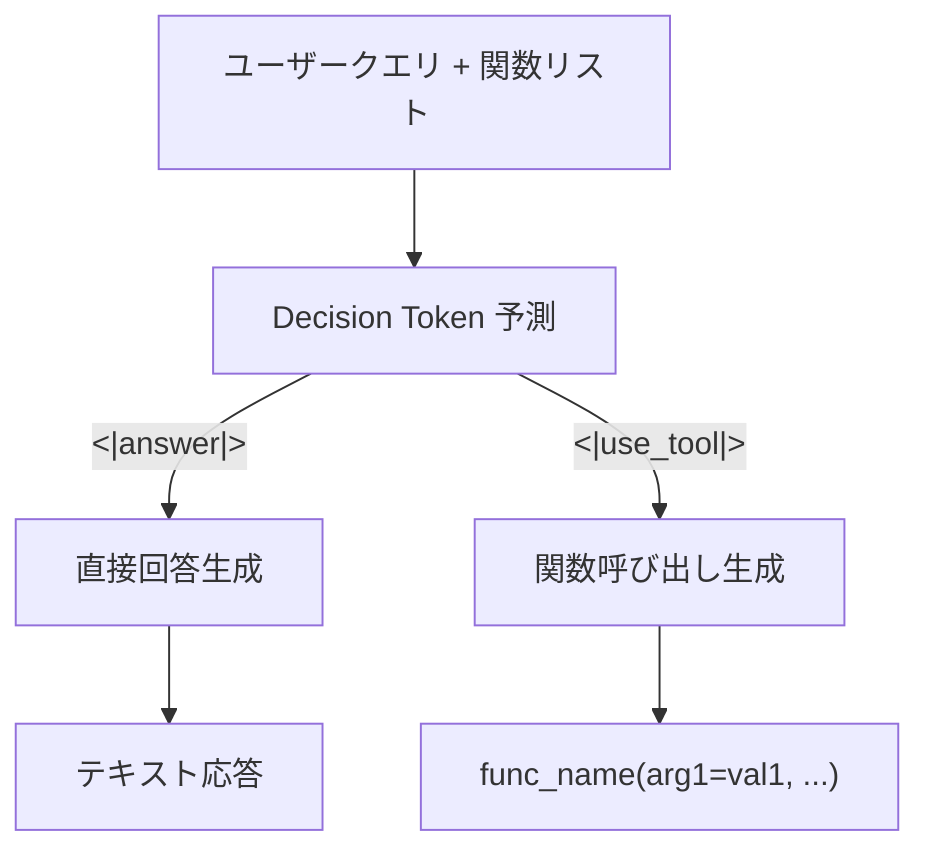

# Enhancing Function-Calling Capabilities in LLMs: Strategies for Prompt Formats, Data Integration, and Multilingual Translation

- **Link**: https://arxiv.org/abs/2412.01130
- **Authors**: Yi-Chang Chen, Po-Chun Hsu, Chan-Jan Hsu, Da-shan Shiu
- **Year**: 2024 (arXiv: December 2024)
- **Venue**: arXiv preprint
- **Affiliation**: MediaTek Research
- **Type**: Academic Paper

## Abstract

Large language models (LLMs) have significantly advanced autonomous agents, particularly in zero-shot tool usage, also known as function calling. This research delves into enhancing the function-calling capabilities of LLMs by exploring different approaches, including prompt formats for integrating function descriptions, blending function-calling and instruction-following data, introducing a novel Decision Token for conditional prompts, leveraging chain-of-thought reasoning, and overcoming multilingual challenges with a translation pipeline. Our key findings and contributions are as follows: (1) Instruction-following data improves both function-calling accuracy and relevance detection. (2) The use of the newly proposed Decision Token, combined with synthetic non-function-call data, enhances relevance detection. (3) A tailored translation pipeline effectively overcomes multilingual limitations, demonstrating significant improvements in Traditional Chinese.

## Abstract（日本語訳）

大規模言語モデル（LLM）は、ゼロショットツール使用（関数呼び出し）において特に自律エージェントを大きく進歩させている。本研究は、関数記述を統合するプロンプト形式、関数呼び出しと指示追従データの混合、条件付きプロンプトのための新規Decision Token、Chain-of-Thought推論の活用、翻訳パイプラインによる多言語対応など、多角的なアプローチを通じてLLMの関数呼び出し能力の強化を探究する。主要な知見は以下の通り：（1）指示追従データが関数呼び出し精度と関連性検出の両方を改善する、（2）新規提案のDecision Tokenと合成非関数呼び出しデータの組み合わせが関連性検出を強化する、（3）特化した翻訳パイプラインが多言語の制約を効果的に克服し、繁体字中国語で顕著な改善を示す。

## 概要

本論文は、MediaTek Researchによる関数呼び出し能力強化のための体系的な戦略研究である。5つの主要な観点から実験を行っている：（1）プロンプト形式の比較（専用ロールとシステムロールへの関数記述埋め込み）、（2）指示追従（IF）データと関数呼び出し（FC）データの統合効果、（3）Decision Tokenメカニズム（`<|answer|>`と`<|use_tool|>`の分類トークン導入）、（4）Chain-of-Thought（CoT）推論の付加、（5）繁体字中国語への翻訳パイプライン。Breeze-7Bをベースモデルとし、LoRAファインチューニングを用いた実験により、指示追従データの統合がFC精度と関連性検出の両方を改善すること、Decision Tokenが非関数呼び出し合成データと組み合わせることでRelevance Detection を49.58%→57.50%に改善すること、翻訳パイプラインが繁体字中国語でAST Summary を52.37%→61.56%に改善することを実証した。

## 問題設定

本論文は以下の問題に取り組んでいる：

- **プロンプト形式の最適化**: 関数記述をプロンプトに組み込む方法として、（1）専用ロール（dedicated role）での提示と（2）システムロール内への埋め込みの2戦略があるが、どちらがFC性能に優れるかの体系的比較が不足している。
- **データ統合の効果の未解明**: 関数呼び出しデータと指示追従データの組み合わせが、指示追従能力とFC能力の両方にどう影響するかの包括的分析が欠如している。特に非関数呼び出し関連のデータとFC能力の関係が未探索。
- **関連性検出の困難**: 提供された関数がいずれも関連しない場合にモデルが関数を幻覚（hallucinate）する問題が深刻。合成データセットにおける負例（非FC事例）の不足がこの問題を悪化させている。
- **多言語対応の限界**: 関数名、列挙型、構造化された関数呼び出し構文などの要素を直接翻訳すると意味や構文が破損するリスクがあり、既存の直接翻訳手法では不十分。

## 提案手法

### プロンプト形式戦略

2つの戦略を比較検討：

#### 1. 専用ロール（Dedicated Role）での関数提示
- ChatML形式で`<|im_start|>tools`という専用ロールを設け、関数記述をJSON形式で提示
- 関数はシステムプロンプトとは分離して配置される
- テンプレート例：`<s><|im_start|>tools[{...}]<|im_end|><|im_start|>system...`

#### 2. システムロール内への関数埋め込み
- システムプロンプト内に使用法指示とともに関数記述を埋め込む
- 関数はJSON形式のリストとして提示される
- テンプレート例：`<s><|im_start|>system Who are an expert in composing functions...`

### Decision Token メカニズム

LLMが生成する応答は本質的に次トークン予測の分類タスクであることを利用した新規メカニズム：

- **`<|answer|>`トークン**: モデルが直接回答を選択した場合に最初に出力
- **`<|use_tool|>`トークン**: モデルが関数呼び出しを選択した場合に最初に出力
- この二値分類により、モデルは詳細な応答生成に入る前に、クエリと提供された関数に基づいて関数呼び出しの要否を判断する
- Decision Tokenは合成非関数呼び出しデータの生成も容易にする：元データから不要な関数を除去してfunc_Aのみを残し、func_BとCが不要な場合は`<|answer|>`で直接回答するデータを生成

### 指示追従データとの統合

- **IF-110k**: OpenOrca（LLaMAベースの合成データセット）から110kインスタンスをサンプリング
- **FC-110k**: AIPPON（Li et al., 2024b）とglaive-function-calling-v2データセットからの110kインスタンス
- 両データセットを組み合わせたファインチューニングにより、FC能力と指示追従能力の両立を検証

### Chain-of-Thought（CoT）推論

- 関数呼び出しの推論記述を構築する合成データパイプラインを提案
- 会話履歴と関数呼び出しのシーケンスから推論記述を生成
- 商用LLMを活用してシングルターンクエリに推論記述を付与
- 構造化プロンプトテンプレート（Figure 1(h)参照）により推論ステップを出力

### 多言語翻訳パイプライン

繁体字中国語への翻訳に特化した4段階パイプライン：

1. **初期変換**: JSOM形式の会話を対象言語に初期変換
2. **関数名・列挙型の保持**: 関数名と記述のみを翻訳し、引数値は合理的な場合のみ翻訳
3. **構文整合性の維持**: 翻訳後も関数呼び出し構文の正確性を確保
4. **選択的翻訳**: 関数名、パラメータ名、構造化要素は英語のまま維持

## Figures & Tables

### 図1: プロンプト形式と生成パターンの比較

### 表1: プロンプト形式とデータ使用の性能比較

| 設定 | IF-110k | FC-110k | MT-Bench | AST Summary | Relevance Detection |
|:---|:---:|:---:|:---:|:---:|:---:|
| (a) 関数なし | o | x | 5.46 | - | - |
| (b) 専用ロール | o | o | **5.57** | 85.25 | **49.58** |
| (c) システムロール | o | o | 5.29 | **85.94** | 39.58 |
| (d) 専用ロール | x | o | - | 74.62 | 38.33 |
| (e) システムロール | x | o | - | 74.50 | 27.08 |

### 表2: Decision Tokenと合成非関数呼び出しデータの段階的追加効果

| 関数提示方法 | 設定 | 専用ロール AST | 専用ロール Rel Det | システムロール AST | システムロール Rel Det |
|:---|:---|:---:|:---:|:---:|:---:|
| Baseline | - | 85.25 | 49.58 | 85.94 | 39.58 |
| + Decision Token | - | 85.25 | 37.50 | 84.63 | 47.50 |
| + Non-function-call Data (NF-1k) | - | 84.81 | **57.50** | 83.44 | **65.42** |

### 表3: 繁体字中国語翻訳パイプラインの効果（ZHTW BFCL）

| 設定 | 専用ロール AST | 専用ロール Rel Det | システムロール AST | システムロール Rel Det |
|:---|:---:|:---:|:---:|:---:|
| Baseline | 52.37 | 36.67 | 50.81 | 47.08 |
| + Traditional Chinese Data (TC-19k) | **61.56** | **41.25** | **58.56** | **45.83** |

### 図2: Decision Token動作フロー

## 実験・評価

### 実験設定

- **ベースモデル**: Breeze-7B（Hsu et al., 2024）、Mistral-7Bベースの台湾オープンソース言語モデル
- **ファインチューニング**: LoRA（rank=16、4-bit量子化、学習率1e-4、バッチサイズ8、cosine学習率スケジューラ、100ウォームアップステップ、LoRA r=6、alpha=32）
- **データ**: IF-110k（指示追従）、FC-110k（関数呼び出し）、NF-1k（合成非関数呼び出し）、TC-19k（繁体字中国語翻訳）
- **評価指標**: AST Summary（BFCL）、Relevance Detection（BFCL）、MT-Bench（GPT-4oによる10点スコア）
- **BFCL問題タイプ**: Simple Function、Multiple Function、Parallel Function、Multiple Parallel Function（各200タスク、Simple Function 400タスク）

### 主要結果

#### プロンプト形式の比較
- 指示追従データを含む場合：専用ロールはMT-Bench（5.57）と Relevance Detection（49.58%）で優位、システムロールはAST Summary（85.94%）で優位
- 指示追従データを除外すると、FC能力が大幅に低下（AST: 85.25→74.62、Rel Det: 49.58→38.33）
- FC能力の増加は指示追従データの追加によるものであり、指示追従データがより多くの非FC事例を提供しRelevance Detectionを改善

#### Decision Tokenの効果
- Decision Token単独ではRelevance Detectionが悪化する場合がある（専用ロール: 49.58→37.50）
- しかし合成NF-1kデータとの組み合わせでRelevance Detectionが大幅改善（専用ロール: 49.58→57.50、システムロール: 39.58→65.42）
- AST Summaryは若干低下するトレードオフが存在（85.25→84.81）

#### CoT推論の効果
- IF-110k + FC-110k-Reasonで学習したモデルのAST Summary は84.44%で、ベースライン（85.25%）からの有意な改善なし
- BFCL問題のサイズではCoT推論が必要ない可能性を示唆

#### 翻訳パイプラインの効果
- 18k FC + 200 NF = TC-19kの繁体字中国語データ追加で、ZHTW BFCLのAST Summaryが52.37→61.56%（+17.5%相対改善）
- 少量の翻訳データでも関数呼び出し性能を顕著に改善

## 備考

- **産業研究としての実用的視点**: MediaTek Researchによる研究であり、携帯デバイスやエッジAIでの関数呼び出し能力という産業的ニーズに直結している。
- **Decision Tokenの設計哲学**: 次トークン予測が本質的に分類タスクであることを利用し、明示的な二値分類トークンを導入するアプローチは、関数呼び出しの判断をモデルの推論パイプラインの最初に配置する点で新規性がある。
- **負例データの重要性**: Relevance Detection改善の鍵は、関数が提供されているが使用すべきでない事例（負例）の学習であり、Decision Tokenと合成NF データの組み合わせがこの問題を効果的に解決する。
- **多言語展開の課題**: 関数呼び出しの多言語対応は、プログラミング言語的な構文要素と自然言語的な記述要素の混在により、直接翻訳が困難である。本論文の選択的翻訳パイプラインは、構文要素を英語で維持しながら記述のみを翻訳する実用的なアプローチを提示している。
- **データ分析エージェントへの示唆**: データ分析エージェントが多言語環境で運用される場合（例：日本語ユーザー向けデータ分析エージェント）、関数呼び出し能力の多言語対応は重要な課題となる。本論文の翻訳パイプラインは、日本語への応用にも適用可能なフレームワークを提供する。
- **CoT推論の限定的効果**: BFCLベンチマークの問題規模ではCoT推論が有効でない点は、関数呼び出しタスクの特性（比較的単純な判断が必要）を示唆し、CoTが有効となる複雑な関数呼び出しシナリオの特定が今後の課題となる。
- **プロンプト形式の影響**: 専用ロールとシステムロールの選択がFC性能に影響する点は、データ分析エージェントの設計においてツール記述の配置方法を慎重に検討すべきことを示唆する。
