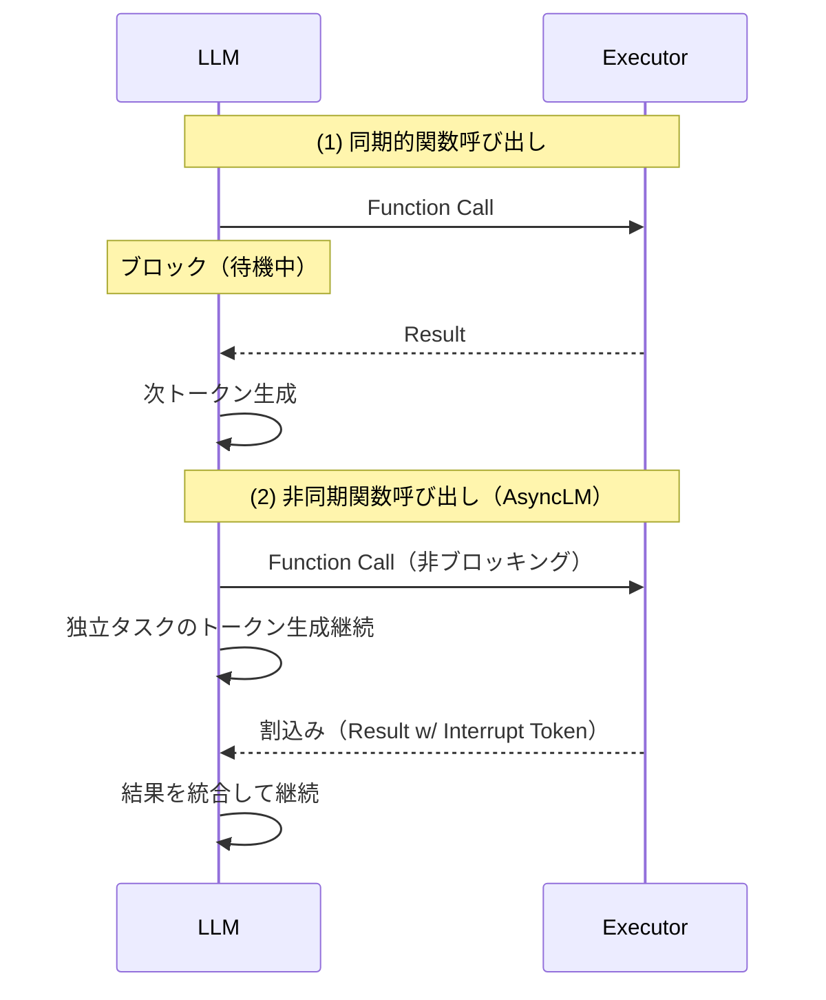
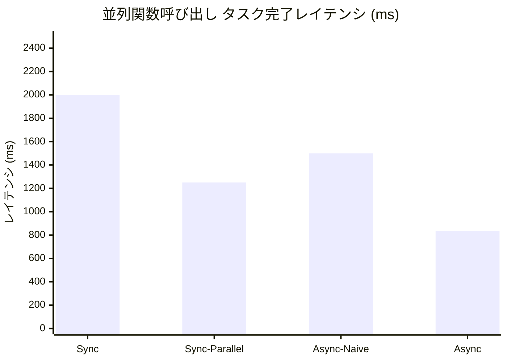
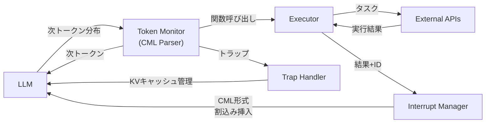

# AsyncLM: Asynchronous LLM Function Calling

- **Link**: https://arxiv.org/abs/2412.07017
- **Authors**: In Gim, Seung-seob Lee, Lin Zhong
- **Year**: 2024 (arXiv: December 2024)
- **Venue**: arXiv preprint (under review)
- **Affiliation**: Yale University
- **Type**: Academic Paper

## Abstract

Large language models (LLMs) use function calls to interface with external tools and data sources. However, the current approach to LLM function calling is inherently synchronous, where each call blocks LLM inference, limiting LLM operation and concurrent function execution. In this work, we propose AsyncLM, a system for asynchronous LLM function calling. AsyncLM improves LLM's operational efficiency by enabling LLMs to generate and execute function calls concurrently. Instead of waiting for each call's completion, AsyncLM introduces an interrupt mechanism to asynchronously notify the LLM in-flight when function calls return. We design an in-context protocol for function calls and interrupts, provide fine-tuning strategy to adapt LLMs to the interrupt semantics, and implement these mechanisms efficiently on LLM inference process. We demonstrate that AsyncLM can reduce end-to-end task completion latency from 1.6x-5.4x compared to synchronous function calling on a set of benchmark tasks in the Berkeley function calling leaderboard (BFCL).

## Abstract（日本語訳）

大規模言語モデル（LLM）は、外部ツールやデータソースとのインターフェースとして関数呼び出しを使用する。しかし、現在のLLM関数呼び出しは本質的に同期的であり、各呼び出しがLLM推論をブロックし、LLMの動作と並行関数実行を制限している。本研究では、非同期LLM関数呼び出しのためのシステム「AsyncLM」を提案する。AsyncLMは、LLMが関数呼び出しの生成と実行を並行して行えるようにすることで運用効率を改善する。各呼び出しの完了を待つ代わりに、関数呼び出しが戻った際にLLMに非同期で通知する割込みメカニズムを導入する。関数呼び出しと割込みのためのインコンテキストプロトコル設計、割込みセマンティクスに適応するファインチューニング戦略、LLM推論プロセスへの効率的な実装を行う。BFCL（Berkeley Function Calling Leaderboard）のベンチマークタスクで、同期的関数呼び出しと比較して1.6倍〜5.4倍のエンドツーエンドタスク完了レイテンシ削減を実証する。

## 概要

AsyncLMは、LLMの関数呼び出しを同期的な逐次実行から非同期的な並行実行に変革するシステムである。従来の同期的関数呼び出しでは、LLMは関数実行の完了を待ってから次のトークン生成を開始するため、関数実行中はLLMがアイドル状態となる。AsyncLMの核心は「割込み可能なLLMデコーディング」であり、関数呼び出しが非ブロッキングで、結果が返却された際に割込みトークンをLLMのコンテキストに注入する。これを実現するために、（1）CML（Control Markup Language）というドメイン固有言語でのインコンテキストプロトコル、（2）非同期イベントの処理を学習するファインチューニング戦略、（3）トークンモニター・エグゼキュータ・割込みマネージャ・トラップハンドラの4コンポーネントからなる推論システムを設計している。BFCLベンチマークで、並列関数呼び出しタスクにおいてSync比1.6倍（GPT-4o）〜5.4倍（Llama-3B、マルチステップ）のレイテンシ削減を達成した。

## 問題設定

本論文は以下の問題に取り組んでいる：

- **同期的関数呼び出しの非効率性**: 現行のLLM関数呼び出しは同期的であり、各関数呼び出しがLLM推論をブロックする。LLM推論は最もリソース集約的なプロセスの一つであり、関数実行中にLLMがアイドル状態となることは重大な資源浪費である。
- **既存の並列化手法の限界**: 先行研究（Kim et al., 2023; Singh et al., 2024a; Chen et al., 2023）はコンパイラによる並列化や簡潔な構文設計等で関数呼び出しの最適化を試みているが、根本的にLLMが関数完了を待つという同期的性質に制約されている。ReWOO（Xu et al., 2023）は観察から推論を分離するが、LLMの推論戦略に対して不可知的。
- **非同期実行における2つの課題**: （1）割込みタイミングの管理：LLMの生成プロセスを中断することなく適切なタイミングで割込みを注入する必要がある、（2）LLMが割込みを正しく理解する必要がある：割込みの処理方法、再開方法、関数結果の活用方法をLLMが学習する必要がある。

## 提案手法

### CML（Control Markup Language）

関数呼び出しと割込みを表現するためのドメイン固有言語：

#### 基本トークン
- **`[CALL]`**: 関数呼び出しブロックの開始（対応する`[END]`で終了）
- **`[INTR]`**: 割込みブロックの開始
- **`[TRAP]`**: トラップ（自己発行割込み、トークン生成の一時停止に使用）
- **`[END]`**: コントロールブロックの終了
- **`[HEAD]`**: 識別子とボディの区切り

#### 関数呼び出し形式
```
[CALL] id [HEAD] function_call [END]
```
- 関数呼び出しのボディはPythonコードまたはJSON AST等の実行可能コードで記述
- 独立した関数呼び出しは別々のブロックに配置して並列実行を許容

#### 割込み形式
```
[INTR] id [HEAD] value [END]
```
- `id`は対応する`[CALL]`ブロックのidと一致
- `value`は関数の実行結果またはエラーメッセージ

#### トラップ（自己発行割込み）
```
[TRAP] [END]
```
- 依存関係のある関数がすべて完了待ちで、かつ生成すべきトークンがない場合にLLMが自発的にトークン生成を一時停止

### 非同期関数呼び出しの動作

1. **関数呼び出しの発行**: LLMが`[CALL]`トークンを生成すると、エグゼキュータが即座に関数を実行開始。LLMはブロックされずに次のトークン生成を継続
2. **暗黙的並列化**: 複数の独立した関数呼び出しが自然にパイプライン化される。例えば`search_nearby`と`put`の2関数呼び出しを生成した場合、エグゼキュータは各々を別ワーカーで並行処理
3. **依存関係の管理**: 関数呼び出しは依存関係の順序に従って実行。依存呼び出しの結果が必要な場合、LLMは該当関数の完了まで待機
4. **割込みの処理**: エグゼキュータが関数完了を検出すると、割込みマネージャ経由でCML形式の割込みブロックをトークンストリーム末尾に挿入

### Critical Section メカニズム

- 割込みがLLMの関数呼び出しブロック生成中に挿入されるとCML構文が破壊される問題への対策
- OSの割込み処理から着想を得たcritical sectionフラグを導入
- 関数呼び出しブロック生成中はフラグを`false`に設定し、割込みを遅延キューに蓄積
- ブロック終了後にフラグを`true`に戻し、キュー内の割込みを処理

### Longest-Processing-Time-first（LPT）戦略

次に呼び出す関数の選択ヒューリスティック：
- 依存関係がなく実行可能な関数のうち、最長推定処理時間を持つ関数を優先
- 関数呼び出し生成と実行のオーバーラップを最大化し、総レイテンシを削減
- 証明：独立関数の集合に対し、LPT順序からの逸脱は総レイテンシを増加させる（Theorem 6.1, 6.3）

### ファインチューニング戦略

#### 学習目標
- LLMが（i）CMLを用いた非同期関数呼び出しを生成し、（ii）割込みによる関数結果を適切に処理することを学習

#### DAG生成
- 既存の関数呼び出しベンチマーク（BFCL等）のマルチターントレースから有向非巡回グラフ（DAG）を抽出
- 逐次シナリオ：線形DAG、並列シナリオ：分岐DAG、マルチターン：複数DAG

#### 割込みシミュレーション
- 各関数にランダム推定実行時間（1ms〜1s）を割り当て
- 5ms〜30msのTTPOT（time-per-output-token）をランダム設定
- 関数完了時に割込みブロックを挿入、全関数が依存待ちの場合はトラップブロックを挿入

### 推論システム実装

4つの主要コンポーネント：

#### 1. Token Monitor
- LLMのトークン生成プロセスを監査・制御
- CMLパーサーとして機能し、関数呼び出しやトラップを検出してエグゼキュータに通知
- FSM（有限状態機械）によりCML構文を強制し、`[INTR]`トークンの自発生成を防止
- critical sectionフラグの管理

#### 2. Executor
- 関数呼び出しを受信し、各呼び出しを専用ワーカーで並行実行
- 外部システム（APIサーバー、コードインタプリタ等）と直接通信
- 完了時に結果と識別子を割込みマネージャに送信

#### 3. Interrupt Manager
- 割込みキューの管理、critical sectionフラグに基づく割込み可否の判定
- CML形式の割込みブロックをトークンストリームに挿入
- デコーディングステップごとに新生成トークンとcritical sectionフラグを受信

#### 4. Trap Handler
- GPU メモリ上のKVキャッシュ使用量を最小化
- トラップ検出時（トークン生成の一時停止が必要）にKVキャッシュの管理戦略を決定
- KVキャッシュの再計算コスト（二次的スケーリング）とスワップコスト（線形スケーリング）を比較し、最適戦略を選択

## Figures & Tables

### 図1: 同期vs非同期関数呼び出しの比較



### 図2: LLM-Executor間相互作用の3パターン比較

```mermaid
gantt
    title エンドツーエンドレイテンシ比較
    dateFormat X
    axisFormat %s

    section Sync
    Read html      :a1, 0, 3
    Wait(html)      :crit, a2, 3, 5
    Read xls        :a3, 5, 8
    Wait(xls)       :crit, a4, 8, 10
    Read txt        :a5, 10, 13
    Wait(txt)       :crit, a6, 13, 15
    Summarize       :a7, 15, 18

    section Sync-Parallel
    Read html+xls+txt :b1, 0, 3
    Wait(all)       :crit, b2, 3, 8
    Summarize       :b3, 8, 11

    section Async
    Read html       :c1, 0, 2
    Read xls        :c2, 2, 4
    Read txt        :c3, 4, 6
    Summarize       :c4, 6, 9
```



### 表1: 関数呼び出し精度（AST matching, マルチステップ並列関数呼び出し）

| Model | Sync | Sync (in CML) | Async |
|:---|:---:|:---:|:---:|
| GPT-4o (ICL) | 57.84% | 57.80% | 59.61% |
| 4o-MINI (ICL) | 55.08% | 53.41% | 41.44% |
| Llama-3B (ICL) | 16.98% | 17.33% | 5.46% |
| Llama-1B (ICL) | 0.49% | 0.39% | 1.45% |
| Llama-3B (FT) | 57.33% | 66.07% | 65.97% |
| Llama-1B (FT) | 6.33% | 12.15% | 12.06% |

### 図3: 並列関数呼び出しのレイテンシ比較



### 図4: AsyncLM推論プロセス概要



### 表2: マルチステップ並列関数呼び出しの詳細レイテンシ（ms）

| 設定 | Cloud (GPT-4o) | Local (Llama-3B) |
|:---|:---:|:---:|
| Sync | ~15,000 | ~4,000 |
| Sync-Parallel | 3.2x改善 | 1.6x改善 |
| Async-Naive | 1.8x改善 | 2.4x改善 |
| **Async** | **5.3x改善** | **5.4x改善** |

## 実験・評価

### 実験設定

- **モデル**: GPT-4o（cloud）、Llama-3B/1B（local）
- **ファインチューニング**: Llama 3モデルにLoRA、GPT-4oにはfew-shotプロンプティング
- **ベンチマーク**: BFCL（Berkeley Function-Calling Leaderboard）から84の関数、4つの世界関数呼び出しドメイン（車両、旅行予約、ファイルシステム操作、MathAPI）
- **データセット**: v3-parallel（400並列呼び出しシナリオ）、v3-multi-step-parallel（新規作成、200マルチステップ並列呼び出しシナリオ）
- **デプロイメント設定**: Localデプロイ（LLM推論と関数実行が同一マシン）、Cloudデプロイ（OpenAI API経由）
- **比較手法**: Sync（同期的逐次実行）、Sync-Parallel（同期的並列実行）、Async-Naive（OpenAI API上のナイーブ非同期）、Async（AsyncLM）

### 主要結果

#### 並列関数呼び出しレイテンシ
- **BFCL parallel dataset**: AsyncLMはSync比1.6倍（GPT-4o）〜2.4倍（Llama-3B）のレイテンシ削減
- Sync-Parallelは1.3倍（GPT-4o）〜1.6倍（Llama-3B）の改善にとどまる
- Async-NaiveはGPT-4oで1.5倍高いレイテンシ（TTFTのオーバーヘッド）

#### マルチステップ並列関数呼び出しレイテンシ
- **v3-multi-step-parallel dataset**: AsyncLMはSync比最大5.4倍のレイテンシ削減
- Sync-Parallelは3.2倍の改善にとどまる（全バンドル関数の完了待ちが必要なため）
- Async-Naive on GPT-4oはTTFT問題により1.5倍の高レイテンシ

#### ユーザートリガー割込み
- プロンプト代わりに割込みとしてタスクを投入するシナリオで、AsyncはSync比2.4倍のレイテンシ削減
- Sync-Parallelは1.1倍の改善にとどまる（全呼び出しを一括生成するため不適切）

#### 関数呼び出し精度
- CML構文によるフォーマットオーバーヘッドはGPT-4oでは最小限（Sync 57.84% vs Sync in CML 57.80%）
- ファインチューニング済みLlama-3BはAsync（65.97%）でSync in CML（66.07%）と同等の精度を維持
- Few-shot小規模モデル（GPT-4o-mini、Llama-3B ICL）ではAsync精度が低下、ファインチューニングの重要性を示す

#### LPTヒューリスティックの有効性
- LPTはランダム選択比8%高速（ローカルAsync評価）
- ただし依存関係のある関数では最適でないケースあり（将来の依存を考慮しないため）

#### システムオーバーヘッド
- CMLトークンによる追加は平均20トークン（v3-multi-step-parallel）で5%未満のメモリ使用量増加
- KVキャッシュの追加は約90ms、27.5MB（3Bモデル）

## 備考

- **OSの割込みメカニズムからの着想**: AsyncLMの設計はオペレーティングシステムの割込み処理メカニズムから直接着想を得ており、critical section、割込みキュー、割込みハンドラ等のOS概念をLLM推論に適用した点が独創的である。
- **LLM間通信への拡張可能性**: AsyncLMの割込みメカニズムは、マルチエージェントLLMシステムにおけるエージェント間通信にも応用可能。各エージェントが他エージェントにメッセージを割込みとして送信することで、同期的ラウンドロビン方式より動的な相互作用が可能になる。
- **Cloud APIでの実装制約**: OpenAI API（Async-Naive）上でのAsyncLM実装は、割込み発生時に新セッションを開始しKVキャッシュを全再計算するため、TTFT（Time-To-First-Token）のオーバーヘッドが大きい。Cloud API最適化されたサービングシステムの開発が今後の課題。
- **関数呼び出し精度とのトレードオフ**: 非同期関数呼び出しはレイテンシを大幅に削減するが、小規模モデルやfew-shotモデルでは精度が低下する傾向がある。ファインチューニングにより精度を維持できることが示されているが、CML構文の学習コストが存在する。
- **データ分析エージェントへの示唆**: データ分析パイプラインでは、データ読み込み、前処理、可視化生成等の独立したタスクが並行実行可能な場合が多い。AsyncLMのアプローチにより、これらのタスクを非同期的に実行し、エンドツーエンドの分析レイテンシを大幅に削減できる可能性がある。特に複数データソースの同時読み込みや、複数の可視化の並列生成において効果が期待される。
- **理論的保証**: LPTヒューリスティックの最適性に関する形式的証明（Theorem 6.1: 独立関数集合に対するAsync >= Sync-Parallel >= Sync、Theorem 6.3: LPT順序からの逸脱は総レイテンシを増加させない）が提供されている点は、システム設計の理論的基盤として重要である。
- **ヒューマンインタラクションへの応用**: AsyncLMの割込みメカニズムは、ユーザーがLLMの生成中に新たなリクエストを割り込ませるインタラクション（例：「やっぱり木曜日にして」等のリアルタイム修正）にも適用可能であり、対話型AI体験の向上に寄与し得る。
