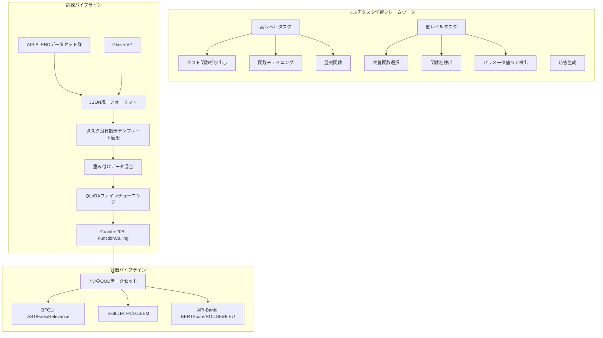

# Granite-Function Calling Model: Introducing Function Calling Abilities via Multi-task Learning of Granular Tasks

- **Link**: https://arxiv.org/abs/2407.00121
- **Authors**: Ibrahim Abdelaziz, Kinjal Basu, Mayank Agarwal, Sadhana Kumaravel, Matthew Stallone, Rameswar Panda, Yara Rizk, GP Bhargav, Maxwell Crouse, Chulaka Gunasekara, Shajith Ikbal, Sachin Joshi, Hima Karanam, Vineet Kumar, Asim Munawar, Sumit Neelam, Dinesh Raghu, Udit Sharma, Adriana Meza Soria, Dheeraj Sreedhar, Praveen Venkateswaran, Merve Unuvar, David Cox, Salim Roukos, Luis Lastras, Pavan Kapanipathi
- **Year**: 2024
- **Venue**: arXiv (cs.LG, cs.AI, cs.CL)
- **Type**: Academic Paper

## Abstract

This paper presents the GRANITE-20B-FUNCTIONCALLING model, trained using a multi-task training approach on seven fundamental tasks encompassed in function calling: Nested Function Calling, Function Chaining, Parallel Functions, Function Name Detection, Parameter-Value Pair Detection, Next-Best Function, and Response Generation. The model is evaluated against over 15 competing models across seven diverse evaluation datasets, achieving the best performance among all open models on the Berkeley Function Calling Leaderboard (BFCL) and fourth overall. The multi-task learning approach on granular sub-tasks enables the 20B-parameter model to match or exceed significantly larger models in function calling capabilities.

## Abstract（日本語訳）

本論文は、関数呼び出しに包含される7つの基本タスク（ネスト関数呼び出し、関数チェイニング、並列関数、関数名検出、パラメータ値ペア検出、次善関数選択、応答生成）に対するマルチタスク学習アプローチを用いて訓練されたGRANITE-20B-FUNCTIONCALLINGモデルを提案する。本モデルは7つの多様な評価データセットにわたって15以上の競合モデルと比較評価され、Berkeley Function Calling Leaderboard（BFCL）においてオープンモデル中最高性能を達成し、全体で4位にランクインした。粒度の細かいサブタスクに対するマルチタスク学習アプローチにより、20Bパラメータモデルが大幅に大規模なモデルと同等以上の関数呼び出し能力を実現する。

## 概要

Granite-20B-FunctionCallingは、IBM Researchが開発したオープンソースの関数呼び出し特化モデルである。既存のアプローチでは、プロプライエタリモデル（GPT-4、Claude、Gemini等）が関数呼び出しにおいて優位を占め、オープンモデルは限定的な性能に留まっていた。本研究は、関数呼び出しを7つの粒度の異なるサブタスクに分解し、マルチタスク学習フレームワークで統合的に訓練することで、この性能差を大幅に縮小する。具体的には、複雑な高レベルタスク（ネスト呼び出し、チェイニング、並列実行）と、それを構成する低レベルタスク（関数名検出、パラメータ検出、次善関数選択）を階層的に配置し、加えて応答生成タスクを組み込む。訓練データは142Kサンプルで、API-BLENDデータセット群（SeqSGD、SeqSNIPS、SeqTopV2、SeqATIS、SeqMultiWOZ）およびGlaive-V2から構成される。全データはJSON形式に統一され、一貫した関数呼び出し表現を実現している。

## 問題設定

- **オープンモデルの性能ギャップ**: プロプライエタリLLM（GPT-4、Claude、Gemini）が関数呼び出しで高い性能を示す一方、オープンソースモデルは大幅に劣後しており、企業利用におけるライセンス上の制約が実用化の障壁となっていた
- **汎化性能の限界**: 多様なAPIで訓練されたモデルが、ドメイン外のデータセットに対して十分に汎化できない問題
- **粒度の不足**: 既存モデルが関数呼び出し全体をモノリシックに扱い、パラメータ検出や関数名特定などのサブタスクに対する独立した能力を欠いていた
- **訓練データの透明性**: 最高性能モデルがプロプライエタリデータに依存し、再現性と拡張性に制約があった

## 提案手法

**マルチタスク学習フレームワーク**

7つの基本タスクを階層的に組織化：

**高レベルタスク（複合・多関数）**:
- **ネスト関数呼び出し**: ある関数の出力が別の関数の入力となる構造
- **関数チェイニング**: 逐次的に実行される関数呼び出しの連鎖
- **並列関数**: 同一関数を異なるパラメータで複数回呼び出し

**低レベルタスク（単純・焦点型）**:
- **次善関数選択**: 関数ライブラリから次に呼び出すべき関数の選択
- **関数名検出**: パラメータなしで必要な関数を特定
- **パラメータ値ペア検出**: クエリから引数値を抽出

**追加タスク**:
- **応答生成**: 自然言語による出力合成

**データ統一フォーマット**:

全データセットをJSON形式に統一し、一貫した関数呼び出し表現を確立：

```json
{"name": "<FUNCTION-NAME>", "arguments": {"<PARAMETER>": "VALUE"}}
```

**訓練設定**:
- ベースモデル: Granite-20B-Code-Instruct
- ファインチューニング手法: QLoRA（Rank: 8, Alpha: 32, Dropout: 0.1）
- 学習率: 5e-5
- ハードウェア: 8 × A100 80GB GPU
- 訓練期間: 3エポック
- オプティマイザ: ApexFusedAdam + Linear Scheduler
- 訓練データ: 142Kサンプル

## アルゴリズム（擬似コード）

```
Algorithm: Granite Multi-Task Function Calling Training
Input: 訓練データセット D = {D_high, D_low, D_resp}, ベースモデル M
Output: ファインチューニング済みモデル M*

1: procedure PREPARE_DATA(D)
2:   // Step 1: データセット統一
3:   for each dataset d_i in D do
4:     d_i ← UNIFY_TO_JSON(d_i)  // JSON形式に統一
5:   end for
6:
7:   // Step 2: タスク固有の指示テンプレート適用
8:   for each task_type t in {nested, chaining, parallel,
9:                            next_best, name_detect, param_detect, response} do
10:    D_t ← APPLY_INSTRUCTION_TEMPLATE(D, t)
11:  end for
12:
13:  // Step 3: タスク間の重み付け混合
14:  D_mixed ← WEIGHTED_MIX(D_t, weights)
15:  return D_mixed
16: end procedure

17: procedure TRAIN(M, D_mixed)
18:   // QLoRA ファインチューニング
19:   adapter ← INIT_QLORA(rank=8, alpha=32, dropout=0.1)
20:   for epoch = 1 to 3 do
21:     for batch in D_mixed do
22:       loss ← COMPUTE_LOSS(M + adapter, batch)
23:       UPDATE(adapter, loss, lr=5e-5)
24:     end for
25:   end for
26:   M* ← MERGE(M, adapter)
27:   return M*
28: end procedure

29: procedure EVALUATE(M*, query, functions)
30:   // 推論時の関数呼び出し
31:   candidates ← FUNCTION_NAME_DETECT(M*, query, functions)
32:   params ← PARAM_VALUE_DETECT(M*, query, candidates)
33:   result ← EXECUTE_CALL(candidates, params)
34:   response ← RESPONSE_GENERATE(M*, query, result)
35:   return response
36: end procedure
```

## アーキテクチャ / プロセスフロー



```mermaid
graph LR
    subgraph "関数呼び出しタスク階層"
        direction TB
        H1[複合タスク] --> H2[ネスト: f(g(x))]
        H1 --> H3[チェイン: f→g→h]
        H1 --> H4[並列: f(a),f(b),f(c)]
    end

    subgraph "基本タスク"
        L1[関数名検出] --> L4[サブタスク分解]
        L2[パラメータ検出] --> L4
        L3[次善関数] --> L4
        L4 --> L5[応答生成]
    end
```

## Figures & Tables

### Figure 1: マルチタスク学習フレームワークの全体像
7つの関数呼び出しサブタスクとそれらの階層的関係を示す。高レベルタスク（ネスト、チェイニング、並列）が低レベルタスク（関数名検出、パラメータ検出、次善関数）の組み合わせとして構成され、応答生成がエンドツーエンドの出力を担う構造が可視化されている。各タスクに対して固有の指示テンプレートが割り当てられ、統一的なJSON形式での訓練を可能にしている。

### Figure 3: ハルシネーション分析（性能 vs 幻覚率）
各モデルの平均F1スコア（x軸）と無効API予測率（y軸）を散布図で表示。Granite-20Bは最高F1（0.74）かつ最低ハルシネーション率（<0.1）で左上の最適領域に位置。競合モデルのGorilla（F1: 0.44, 幻覚: 0.45）やNexusflow-Raven（F1: 0.61, 幻覚: 0.35）と比較して、性能と信頼性の両面で優位性を示す。

### Table 1: BFCLリーダーボード性能比較

| モデル | AST Summary | Execution | Relevance | Overall |
|---|---|---|---|---|
| GPT-4-0125 | 88.75% | 85.61% | 87.50% | 86.94% |
| Claude-3-Opus | 85.44% | 85.81% | 90.83% | 85.50% |
| Gorilla-v2 | 89.38% | 81.55% | 61.25% | 84.71% |
| **Granite-20B** | **84.11%** | **86.50%** | **87.08%** | **84.71%** |
| Llama-3-70B | 87.74% | 85.32% | 69.17% | 83.88% |

Granite-20Bはオープンモデル中最高の総合スコアを達成し、特にRelevance（ハルシネーション検出）で87.08%と高い信頼性を示す。

### Table 2: 関数名検出性能（ToolLLMデータセット）

| データセット | Granite F1 | 次点 F1 | 改善幅 |
|---|---|---|---|
| G1 (Single-tool) | 0.86 | 0.65 | +8% |
| G2 (Multi-tool) | 0.84 | 0.73 | +5% |
| G3 (Multi-tool complex) | 0.76 | 0.69 | +3% |
| Average | 0.74 | 0.61 | +13% |

### Table 3: 応答生成品質比較

| モデル | BERTScore | ROUGE-L | BLEU |
|---|---|---|---|
| Llama-3-70B | 0.69 | 0.48 | 0.47 |
| Granite-20B | 0.68 | 0.47 | 0.47 |
| Command-R-35B | 0.39 | 0.15 | 0.07 |

20Bパラメータながら70Bモデルと同等の応答品質を実現し、関数呼び出し特化モデル（Command-R）を大幅に上回る。

## 実験・評価

### セットアップ

- **ベースモデル**: Granite-20B-Code-Instruct（Apache 2.0ライセンス）
- **コンテキスト長**: 8,192トークン
- **評価データセット**: 7つの全てドメイン外（OOD）データセット
  - BFCL（1,700件）、ToolLLM（491件）、RestGPT（157件）、API-Bank（951件）、ToolBench（214件）、ToolAlpaca（100件）、NexusRaven（318件）
- **評価メトリクス**: AST Summary、Execution Summary、Relevance（BFCL）/ F1、LCS、Exact Match（ToolLLM）/ BERTScore、ROUGE-L、BLEU（応答生成）
- **比較対象**: 15以上のモデル（GPT-4、Claude-3、Gorilla、Llama-3-70B等）

### 主要結果

**BFCLリーダーボード**:
- Overall: 84.71%で全体4位、オープンモデル1位を達成
- Execution Summary: 86.50%でGorilla-v2（81.55%）を4.95ポイント上回る
- Relevance: 87.08%で高い信頼性を実証（Gorilla-v2は61.25%）

**関数名検出（ToolLLM）**:
- 全データセットで最高F1を達成（平均0.74、次点0.61、+13%改善）
- シーケンシング性能: LCS 0.73（+7%）、Exact Match 0.43（+11%）

**関数呼び出し全体（API-Bank、ToolBench、ToolAlpaca）**:
- 関数名F1: 0.87（Command-Rの0.88に次ぐ2位）
- 引数F1: 0.59（Command-Rの0.62に次ぐ）

**ハルシネーション分析**:
- 最高F1（0.74）と最低ハルシネーション率（<0.1）を両立
- 競合モデルは性能とハルシネーションのトレードオフを抱えるが、Granite-20Bは両方で最適

**パラメータ効率**:
- 20Bパラメータで70B以上のモデル（Llama-3-70B）と同等以上の性能
- 50-70%少ないパラメータでの高性能実現は、マルチタスク学習の有効性を実証

## 備考

- IBM Researchによる企業向けオープンソースLLMとして、Apache 2.0ライセンスでの提供が特徴的
- マルチタスク学習による粒度の細かいサブタスク分解は、データ分析エージェントにおけるツール呼び出し設計に示唆を与える
- 7つのサブタスクの階層的組織化は、エージェントの行動分解（action decomposition）の設計パターンとして参考になる
- QLoRAによるパラメータ効率的なファインチューニングは、実用的なエージェント構築における計算コスト削減に貢献
- コンテキスト長（8,192トークン）の制約による関数仕様の切り詰めが課題として残る
- Java/JavaScript評価における脆弱性やREST API評価の可用性依存も今後の改善点
- データ分析エージェントの文脈では、関数チェイニングとネスト呼び出しが特に重要であり、本研究の知見はパイプライン型エージェント設計の基盤となる
