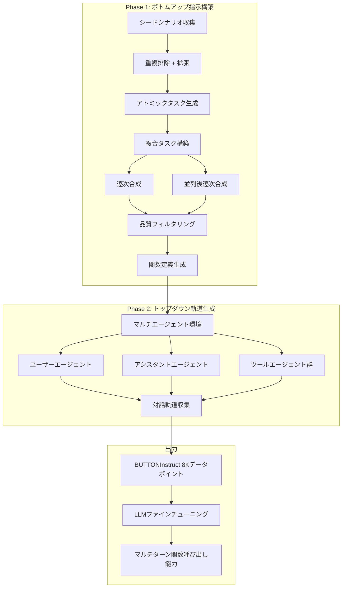
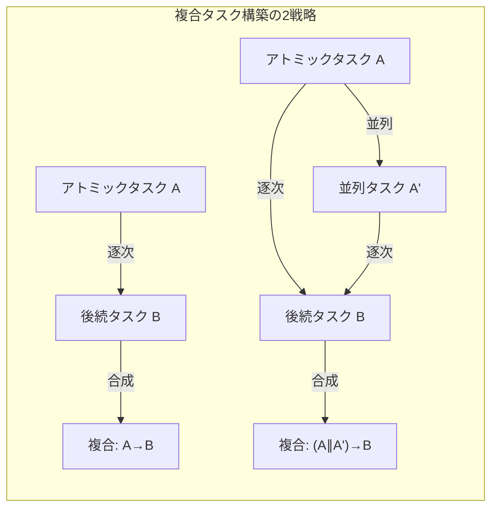

# Facilitating Multi-turn Function Calling for LLMs via Compositional Instruction Tuning

- **Link**: https://arxiv.org/abs/2410.12952
- **Authors**: Mingyang Chen, Haoze Sun, Tianpeng Li, Fan Yang, Hao Liang, Keer Lu, Bin Cui, Wentao Zhang, Zenan Zhou, Weipeng Chen
- **Year**: 2024
- **Venue**: ICLR 2025 (cs.CL)
- **Type**: Academic Paper

## Abstract

Large Language Models (LLMs) have exhibited significant potential in performing diverse tasks, including the ability to call functions or use external tools to enhance their performance. While current research on function calling by LLMs primarily focuses on single-turn interactions, this paper addresses the overlooked necessity for LLMs to engage in multi-turn function calling -- critical for handling compositional, real-world queries that require planning with functions but not only use functions. To facilitate this, the authors introduce BUTTON (Bottom-Up Then Top-dOwN), which generates synthetic compositional instruction tuning data via bottom-up instruction construction and top-down trajectory generation. In the bottom-up phase, simple atomic tasks are generated based on real-world scenarios and compositional tasks are built using heuristic strategies. The top-down phase features a multi-agent environment where interactions among simulated humans, assistants, and tools are utilized to gather multi-turn function calling trajectories. The resulting dataset BUTTONInstruct comprises 8,000 data points and demonstrates effectiveness across various LLMs.

## Abstract（日本語訳）

大規模言語モデル（LLM）は、外部ツールや関数の呼び出し能力を含む多様なタスクの実行において顕著な可能性を示してきた。しかし、LLMによる関数呼び出しに関する現行の研究は主にシングルターンの対話に焦点を当てており、実世界の複合的なクエリ処理に不可欠なマルチターン関数呼び出しの必要性が見過ごされている。本論文では、BUTTON（Bottom-Up Then Top-dOwN）を提案する。これは、ボトムアップ型指示構築とトップダウン型軌道生成を通じて合成的な複合指示チューニングデータを生成するアプローチである。ボトムアップフェーズでは、実世界のシナリオに基づいてアトミックタスクを生成し、ヒューリスティック戦略を用いて複合タスクを構築する。トップダウンフェーズでは、シミュレートされた人間・アシスタント・ツール間の対話を活用するマルチエージェント環境でマルチターン関数呼び出し軌道を収集する。生成されたBUTTONInstructデータセットは8,000データポイントで構成され、複数のLLMにおける有効性が実証された。

## 概要

BUTTONは、LLMのマルチターン関数呼び出し能力を強化するための合成データ生成パイプラインである。既存の関数呼び出し研究がシングルターンに偏重し、「関数を使う」能力に焦点を当てている一方で、本研究は「関数で計画する」能力の重要性を指摘する。実世界の複雑なクエリは本質的に複合的（compositional）であり、LLMはタスクを管理可能なステップに分解し、関数呼び出しの順序を計画する必要がある。しかし、このような複合的な指示と対応するマルチターン軌道のペアデータを既存ソースから取得することは現実的でない。BUTTONは「ボトムアップによる構成」とその逆の「トップダウンによる分解」を組み合わせることで、高品質な合成データの生成を実現する。Baichuan Inc.と北京大学の共同研究として、Llama3およびQwen2シリーズのモデルでの有効性が実証され、70Bモデルではgpt-4oに匹敵する性能を達成した。

## 問題設定

- **シングルターン偏重**: 既存の関数呼び出し研究は、適切な関数の選択と引数の提供に焦点を当て、マルチターン計画能力を看過している
- **複合性の保証**: 生成される指示が複雑で合理的かつ解決可能であることの保証が困難
- **関数との整合性**: 指示と対応する関数定義の互換性確保が課題
- **人間監視なしの高品質軌道**: マルチターン関数呼び出し軌道を人手アノテーションなしで高品質に生成する必要性
- **既存データの限界**: API記述の不明確さ、API呼び出しの実行時エラー、正確なソリューションパスアノテーション生成の困難さ

## 提案手法

**BUTTON パイプライン（Bottom-Up Then Top-dOwN）**

### Phase 1: ボトムアップ指示構築

**シナリオ収集**:
- 既存の関数呼び出しデータセット（glaive-function-calling-v2、ToolBench等）から実世界シナリオを抽出
- 文埋め込みによる類似度計算と閾値ベースの重複排除
- 既存シナリオからの変換による新規シナリオ生成で拡張

**アトミックタスク構築**:
3つの設計原則に基づく：
1. **合理的（Reasonable）**: 現実的で実世界で頻繁に遭遇するタスク
2. **自己完結的（Self-contained）**: タスク内の情報のみで解決可能
3. **関数非依存（Function-agnostic）**: 特定の関数やソリューションに言及しない

**複合タスク構築** — 2つのヒューリスティック戦略：
1. **逐次合成（Sequential Composition）**: アトミックタスクから開始し、その結果に依存する後続タスクを生成して結合
   - 例: 「『グレート・ギャツビー』の著者は誰？」→「その著者の誕生日は？」→「『グレート・ギャツビー』の著者はいつ生まれた？」
2. **並列後逐次合成（Parallel-then-Sequential Composition）**: 並列実行可能なタスクを生成し、その結果に基づく後続タスクを追加
   - 例: フライトスケジュール取得 ∥ 天気予報取得 → 最初のフライト到着時の天気は？

**関数生成**:
- タスク → 関数の方向で生成（既存研究の関数 → タスクの逆方向）
- 設計原則: 記述的（Descriptive）、汎用的（General）、一貫性（Consistency）
- サブタスクの認識を活用して適切な粒度の関数を生成
- 関数定義: name, description, parameters, responses, required の5フィールド

### Phase 2: トップダウン軌道生成

**マルチエージェントセットアップ**:
3種類のエージェントで対話プロセスをシミュレート：
- **ユーザーエージェント**: 複合タスクに基づいてクエリを提供
- **アシスタントエージェント**: タスクを分解し、対応する関数を呼び出す（利用可能ツール、複合タスク、タスク分解を認識）
- **ツールエージェント**: 関数定義に基づいて関数の実装をシミュレート（実際の機能は不要、合理的なフィードバックのみ）

**対話軌道収集**:
- ReAct形式での応答（観察・思考 + 関数呼び出し）
- アシスタントの関数呼び出しをツールエージェントへのアクションとしてパース
- 最終回答到達時に終了関数を呼び出し

**データ生成**: GPT-4oを使用して各ステップのデータを生成

## アルゴリズム（擬似コード）

```
Algorithm: BUTTON Pipeline
Input: シードシナリオ集合 C_seed, 生成LLM G (GPT-4o)
Output: BUTTONInstruct データセット D

1: procedure BOTTOM_UP(C_seed, G)
2:   // Phase 1a: シナリオ収集と拡張
3:   C ← EXTRACT_SCENARIOS(C_seed)
4:   C ← DEDUPLICATE(C, embedding_threshold)
5:   C ← C ∪ EXPAND_SCENARIOS(C, G)
6:
7:   // Phase 1b: アトミックタスク構築
8:   A ← {}
9:   for each scenario c in C do
10:    a ← GENERATE_ATOMIC_TASK(c, G)  // 合理的・自己完結・関数非依存
11:    A ← A ∪ {a}
12:  end for
13:
14:  // Phase 1c: 複合タスク構築
15:  I ← {}
16:  for each atomic task a in A do
17:    strategy ← RANDOM_SELECT({Sequential, Parallel-then-Sequential})
18:    if strategy = Sequential then
19:      a_sub ← GENERATE_SUBSEQUENT(a, G)
20:      c_task ← COMPOSE_SEQUENTIAL(a, a_sub, G)
21:    else
22:      a_par ← GENERATE_PARALLEL(a, G)
23:      a_sub ← GENERATE_SUBSEQUENT({a, a_par}, G)
24:      c_task ← COMPOSE_PARALLEL_SEQ(a, a_par, a_sub, G)
25:    end if
26:    S ← GET_SUBTASKS(c_task)
27:    if VALIDATE_COMPOSITIONALITY(c_task, S, G) then
28:      F ← GENERATE_FUNCTIONS(c_task, S, G)
29:      I ← I ∪ {(c_task, F, S)}
30:    end if
31:  end for
32:  return I
33: end procedure

34: procedure TOP_DOWN(I, G)
35:   D ← {}
36:   for each (c_task, F, S) in I do
37:     // マルチエージェント環境セットアップ
38:     user ← INIT_AGENT("user", c_task)
39:     assistant ← INIT_AGENT("assistant", F, S)
40:     tools ← {INIT_TOOL_AGENT(f) for f in F}
41:
42:     // 軌道収集
43:     trajectory ← []
44:     msg ← user.INITIATE(c_task)
45:     while not TASK_COMPLETE(assistant) do
46:       response ← assistant.RESPOND(msg)  // ReAct: 思考 + 関数呼び出し
47:       if HAS_FUNCTION_CALL(response) then
48:         tool_result ← tools[response.func].EXECUTE(response.args)
49:         trajectory.APPEND(response, tool_result)
50:         msg ← tool_result
51:       else
52:         trajectory.APPEND(response)
53:         break
54:       end if
55:     end while
56:     D ← D ∪ {(F, trajectory)}
57:   end for
58:   return D
59: end procedure
```

## アーキテクチャ / プロセスフロー





## Figures & Tables

### Figure 1: BUTTONパイプラインの全体像
左側にボトムアップ指示構築、右側にトップダウン軌道生成を示す2パートの概要図。ボトムアップ側では、アトミックタスク（「『グレート・ギャツビー』の著者は誰？」「この本の著者はいつ生まれた？」）から複合タスク（「『グレート・ギャツビー』の著者はいつ生まれた？」）への構成過程と、対応する関数定義（get_author, search_birthdays）の生成を示す。トップダウン側では、ユーザー・アシスタント・ツールの3エージェント間のマルチターン対話軌道を示す。

### Figure 2: BUTTONInstructデータ統計
3つのサブ図で構成：(a) アシスタントターン数の頻度分布 — 大半が3ターン以上、(b) 軌道あたりの関数呼び出し数分布 — 大半が2回以上、(c) ターンあたりの平均関数呼び出し数 — 全ターンで平均1回以上。これらの統計は、単純なヒューリスティック戦略でも多様なデータが生成されることを実証している。

### Table 2: GTAベンチマーク主要結果

| モデル | Inst. | Tool. | Arg. | Summ. | P. | O. | L. | C. | Ans. |
|---|---|---|---|---|---|---|---|---|---|
| GPT-4o | 90.0 | 70.3 | 38.6 | 72.9 | 76.4 | 88.2 | 84.8 | 90.0 | 46.0 |
| Llama3-8B-Instruct | 70.9 | 23.6 | 2.2 | 42.9 | 23.5 | 18.5 | 23.6 | 24.6 | 1.4 |
| **Llama3-8B-BUTTON** | **90.7** | **63.4** | **32.3** | **65.6** | **84.2** | **76.5** | **73.5** | **88.9** | **30.5** |
| Llama3-70B-Instruct | 75.2 | 46.7 | 22.2 | 68.4 | 67.9 | 83.8 | 71.0 | 95.9 | 40.1 |
| **Llama3-70B-BUTTON** | **96.4** | **73.6** | **38.1** | **70.5** | **84.9** | **96.2** | **89.5** | **96.1** | **43.5** |
| Qwen2-72B-Instruct | 73.4 | 49.2 | 17.9 | 73.9 | 46.5 | 67.5 | 46.7 | 64.3 | 27.3 |
| **Qwen2-72B-BUTTON** | **91.9** | **69.3** | **38.1** | 71.5 | **85.0** | **87.4** | **86.7** | **91.4** | **45.7** |

8Bモデルでの劇的な改善（回答精度: 1.4% → 30.5%）と、70Bモデルでのgpt-4o匹敵性能が注目される。

### Table 3: Tool-Queryベンチマーク主要結果

| モデル | G.A. | Process (Easy) | Process (Hard) | Process (All) | Success (Easy) | Success (Hard) | Success (All) |
|---|---|---|---|---|---|---|---|
| GPT-4o | 92.3 | 83.2 | 70.6 | 76.5 | 50.0 | 31.3 | 40.0 |
| Llama3-8B-BUTTON | 97.4 | 72.9 | 54.8 | 63.2 | 50.0 | 21.9 | 35.0 |
| Llama3-70B-BUTTON | 94.0 | 85.2 | 77.2 | 80.9 | 71.4 | 46.9 | 58.3 |
| Qwen2-72B-BUTTON | 98.4 | 85.5 | 77.0 | 81.0 | 71.4 | 46.9 | 58.3 |

### Table 4: データサイズの影響（Llama3-8B、Tool-Query）

| データ数 | Process (All) | Success (All) |
|---|---|---|
| 2,000 | 56.5 | 21.7 |
| 4,000 | 58.5 | 30.0 |
| 6,000 | 62.3 | 30.0 |
| 8,000 | 63.2 | 35.0 |

## 実験・評価

### セットアップ

- **訓練モデル**: Llama3-8B, Llama3-70B, Qwen2-7B, Qwen2-72B（全パラメータSFT）
- **訓練データ**: BUTTONInstruct 8,000件 + OpenHermes-2.5 100,000件（一般指示追従能力の維持）
- **ハードウェア**: 4 × 8 NVIDIA H800 GPU
- **最大系列長**: 8,192トークン
- **ベンチマーク**: GTA（229クエリ、14ツール、マルチモーダル）、Tool-Query（60タスク、3ドメイン）
- **ベースライン**: GPT-4o, GPT-4-Turbo, GPT-3.5-Turbo, 各モデルのInstruct版

### 主要結果

**GTAベンチマーク**:
- Llama3-8B: 回答精度が1.4% → 30.5%に劇的改善（+29.1ポイント）
- Llama3-70B-BUTTON: 回答精度43.5%でGPT-4o（46.0%）に迫る性能
- Qwen2-72B-BUTTON: 回答精度45.7%でGPT-4oと同等
- 全モデルでInstruct版を全メトリクスにわたって大幅に上回る

**Tool-Queryベンチマーク**:
- Grounding Accuracy（関数呼び出しの正確性）は95%以上でベースラインと同等だが、Process RateとSuccess Rateで大幅改善
- Llama3-70B-BUTTON: Success Rate 58.3%でGPT-4o（40.0%）を18.3ポイント上回る
- 「関数を正しく使う」だけでなく「関数で効果的に計画する」能力の向上を実証

**アブレーション研究**:
- ボトムアップ手順の除去: 小モデルで平均16.1%の相対性能低下
- トップダウン手順の除去: 同様の有意な低下
- Success Rateの低下（15.0%）がProcess Rate（7.5%）より大きく、計画能力への影響を示唆

**データサイズの影響**:
- 2,000→8,000件でProcess Rate: 56.5→63.2%、Success Rate: 21.7→35.0%に単調増加
- 特にHardタスクでデータサイズの恩恵が顕著

**並列呼び出しの効果**:
- 並列呼び出し有効時: Success Rate 35.0%、Process Rate 63.2%
- 並列呼び出し無効時: Success Rate 28.3%（-6.7pt）、Process Rate 58.7%（-4.5pt）

## 備考

- BUTTONは関数呼び出しにおける「使用」と「計画」の区別を明確にし、後者の重要性を実証した先駆的研究
- わずか8,000件の合成データで70Bモデルをgpt-4o超えに導く高効率なアプローチ
- ボトムアップ（構成）とトップダウン（分解）の二重プロセスは、データ分析エージェントにおけるタスク分解戦略として直接応用可能
- マルチエージェントシミュレーションによる軌道生成は、エージェント訓練データの自動生成パイプラインのモデルケースとなる
- 逐次合成と並列後逐次合成の2戦略は、データ分析ワークフローの典型的パターン（データ取得→変換→分析の逐次、複数データソースの並列取得→統合の並列後逐次）に対応
- コードとデータはGitHub（PKU-Baichuan-MLSystemLab/BUTTON）で公開
- ICLR 2025採択により、研究の質と影響力が学術コミュニティで認められている
