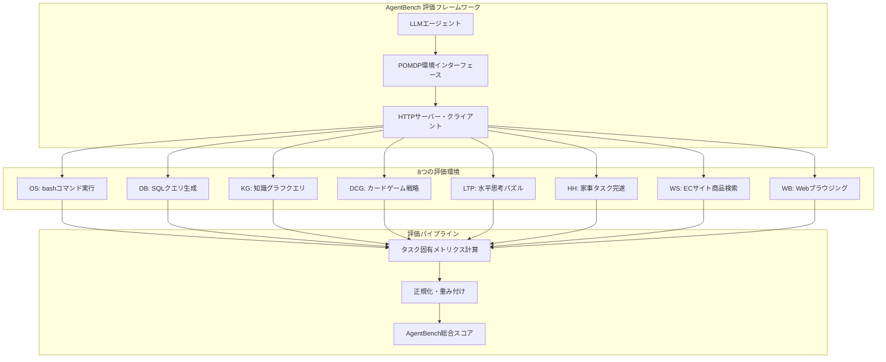
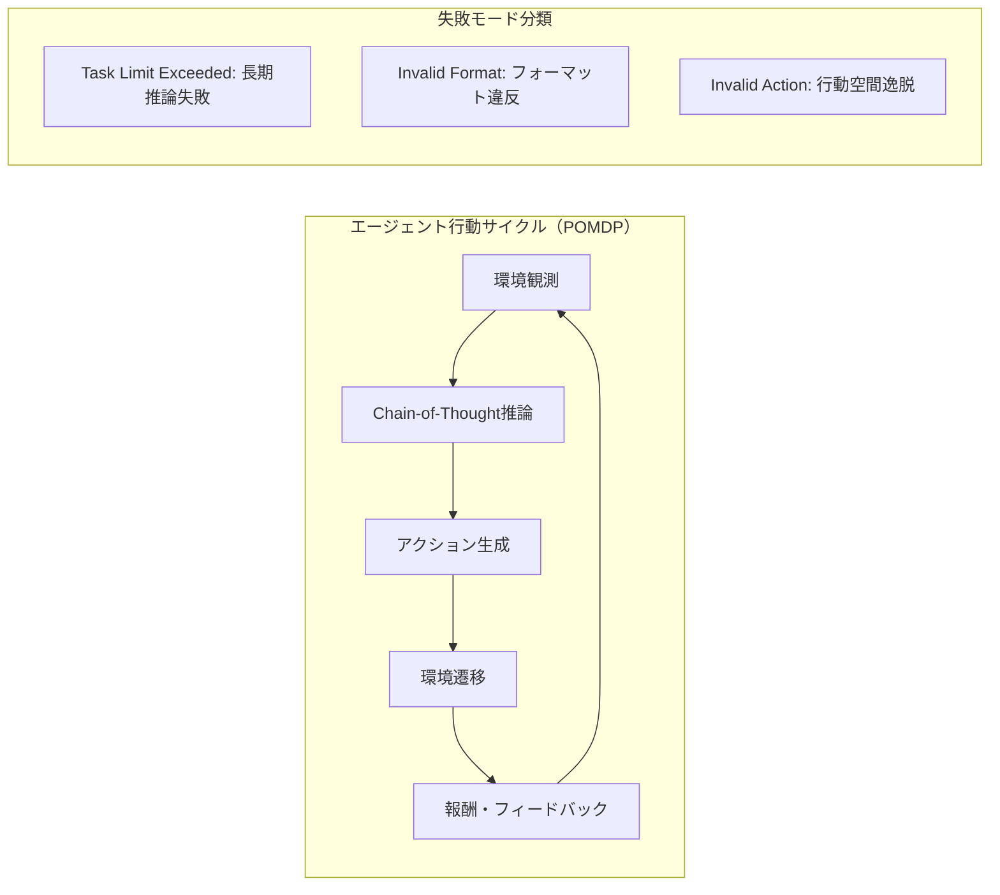

# AgentBench: Evaluating LLMs as Agents

- **Link**: https://arxiv.org/abs/2308.03688
- **Authors**: Xiao Liu, Hao Yu, Hanchen Zhang, Yifan Xu, Xuanyu Lei, Hanyu Lai, Yu Gu, Hangliang Ding, Kaiwen Men, Kejuan Yang, Shudan Zhang, Xiang Deng, Aohan Zeng, Zhengxiao Du, Chenhui Zhang, Sheng Shen, Tianjun Zhang, Yu Su, Huan Sun, Minlie Huang, Yuxiao Dong, Jie Tang
- **Year**: 2024
- **Venue**: ICLR 2024 (cs.AI, cs.CL, cs.LG)
- **Type**: Academic Paper

## Abstract

Large Language Models (LLMs) are becoming increasingly capable of autonomously interacting with their environments and executing complex tasks. This paper presents AgentBench, a multi-dimensional evolving benchmark containing 8 distinct environments to assess LLM-as-Agent's reasoning and decision-making abilities in real-world settings. Testing across 29 models reveals that top commercial LLMs (GPT-4) demonstrate strong ability of acting as agents in complex environments, while there is a significant performance gap with open-source models, especially those under 70B parameters. The study identifies that poor long-term reasoning, decision-making, and instruction following abilities are the main obstacles for practical LLM agents. Additionally, training on code presents ambivalent impacts on different agent tasks.

## Abstract（日本語訳）

大規模言語モデル（LLM）は、環境と自律的に対話し複雑なタスクを実行する能力を急速に高めている。本論文は、実世界のシナリオにおけるLLM-as-Agentの推論・意思決定能力を評価するための8つの異なる環境を含む多次元的進化型ベンチマークであるAgentBenchを提案する。29モデルのテストにより、トップの商用LLM（GPT-4）が複雑な環境でのエージェント行動に強い能力を示す一方、オープンソースモデル（特に70Bパラメータ未満）との間に顕著な性能ギャップが存在することが明らかになった。長期的な推論、意思決定、指示追従能力の不足がLLMエージェント実用化の主な障壁であると特定された。さらに、コードに対する訓練が異なるエージェントタスクに相反する影響を与えることが発見された。

## 概要

AgentBenchは、LLMをエージェントとして評価する初の体系的ベンチマークである。従来のLLM評価が知識や推論の静的なテストに焦点を当てていたのに対し、本ベンチマークは実環境との動的な対話を通じた行動能力を多面的に評価する。部分観測マルコフ決定過程（POMDP）の枠組みを採用し、エージェントが複数ターンにわたってChain-of-Thought推論と実行可能なアクションを組み合わせて環境と対話する設定を標準化した。8つの評価環境はコード系（OS、DB、KG）、ゲーム系（DCG、LTP、HH）、Web系（WS、WB）の3カテゴリに分類され、合計29モデル（商用API 10、オープンソース19）が評価された。GPT-4が全体スコア4.01で圧倒的首位を占め、オープンソースモデルとの間に2-3倍以上のスコア差が確認された。

## 問題設定

- **静的評価の限界**: 既存ベンチマーク（MMLU、HumanEval等）はLLMの知識と推論を静的に評価するが、実世界でのエージェント行動能力を測定できない
- **環境対話能力の未評価**: LLMが環境を観察し、計画を立て、行動を実行し、フィードバックに基づいて調整するという一連のエージェント行動サイクルが評価されていない
- **商用・オープンソース間の性能ギャップ**: エージェントタスクにおける両者の実際の性能差が定量的に把握されていない
- **失敗モードの分析不足**: LLMエージェントがどのような理由で失敗するかの体系的な分析が不足

## 提案手法

**POMDP定式化**

AgentBenchはエージェント評価をPOMDP（部分観測マルコフ決定過程）として定式化する：
- 状態空間S: 環境の完全な状態
- 観測空間O: エージェントが観測可能な部分情報
- 行動空間A: エージェントが実行可能なアクション
- 遷移関数T: S × A → S
- 報酬関数R: S × A → R

**8つの評価環境**

### コード系タスク（3環境）

1. **オペレーティングシステム（OS）**: Dockerベースのubuntu環境でbashコマンドを実行し、質問に回答またはファイル操作を実施
   - メトリクス: Success Rate
   - 平均ラウンド: 8、テストセット: 144問 / 1,200インタラクション

2. **データベース（DB）**: 実データベースに対するSQL クエリ生成による複雑な分析タスク
   - メトリクス: Success Rate
   - 平均ラウンド: 5、テストセット: 300問 / 1,500インタラクション

3. **ナレッジグラフ（KG）**: 大規模知識ベースに対するマルチターンクエリ
   - メトリクス: F1 Score
   - 平均ラウンド: 15、テストセット: 150問 / 2,250インタラクション

### ゲーム系タスク（3環境）

4. **デジタルカードゲーム（DCG）**: Aquawarでの戦略的ターン制対戦
   - メトリクス: Win Rate
   - 平均ラウンド: 30、テストセット: 20問 / 600インタラクション

5. **水平思考パズル（LTP）**: 二値質問による推理パズル解決
   - メトリクス: Game Progress
   - 平均ラウンド: 25、テストセット: 50問 / 1,250インタラクション

6. **家事タスク（HH）**: ALFWorldテキスト環境での家事完遂
   - メトリクス: Success Rate
   - 平均ラウンド: 35、テストセット: 50問 / 1,750インタラクション

### Web系タスク（2環境）

7. **Webショッピング（WS）**: ユーザー仕様に合致する商品のECサイトでの探索
   - メトリクス: Reward
   - 平均ラウンド: 5、テストセット: 200問 / 1,000インタラクション

8. **Webブラウジング（WB）**: 多ドメインウェブサイトでの複雑な情報検索
   - メトリクス: Step Success Rate
   - 平均ラウンド: 10、テストセット: 100問 / 1,000インタラクション

**評価ツールキットアーキテクチャ**:
- HTTPベースのサーバー・クライアントアーキテクチャ
- Dockerコンテナ化による環境間の分離
- Edmonds-Karpの最大流アルゴリズム（O(|V||E|^2)）によるワーカー最適化
- 中断可能・再開可能な評価設計

**総合スコア計算**:
- 個別タスクの平均スコアを正規化し、難易度の異なるタスク間の公平な比較を実現
- 平均モデル性能の逆数に基づく固定重みで将来の比較を可能にする

## アルゴリズム（擬似コード）

```
Algorithm: AgentBench Evaluation Framework
Input: LLMエージェント A, 環境セット E = {OS, DB, KG, DCG, LTP, HH, WS, WB}
Output: 総合AgentBenchスコア S_total

1: procedure EVALUATE_AGENT(A, E)
2:   scores ← {}
3:   for each environment e in E do
4:     task_scores ← []
5:     for each task t in e.test_set do
6:       // POMDP環境初期化
7:       state ← e.RESET(t)
8:       observation ← e.OBSERVE(state)
9:       trajectory ← []
10:      total_reward ← 0
11:
12:      // マルチターン対話ループ
13:      while not TERMINATED(state) and rounds < MAX_ROUNDS do
14:        // Chain-of-Thought + Action生成
15:        thought, action ← A.GENERATE(observation, trajectory)
16:        trajectory.APPEND(thought, action)
17:
18:        // 環境遷移
19:        state, reward, obs_new ← e.STEP(action)
20:        observation ← obs_new
21:        total_reward += reward
22:      end while
23:
24:      // タスク固有メトリクス計算
25:      score ← e.COMPUTE_METRIC(trajectory, state)
26:      task_scores.APPEND(score)
27:    end for
28:    scores[e] ← MEAN(task_scores)
29:  end for
30:
31:  // 総合スコア（正規化重み付け）
32:  S_total ← WEIGHTED_NORMALIZE(scores, RECIPROCAL_WEIGHTS(E))
33:  return S_total
34: end procedure

35: procedure TOOLKIT_ORCHESTRATION(agents, environments)
36:   // HTTPベースのリソース割り当て
37:   graph ← BUILD_BIPARTITE(agents, environments)
38:   assignment ← EDMONDS_KARP_MAX_FLOW(graph)
39:
40:   // 並列評価実行
41:   for each (agent, env) in assignment do
42:     container ← DOCKER_CREATE(env.image)
43:     SPAWN_EVALUATION(agent, container)
44:   end for
45:
46:   // 結果集約
47:   results ← COLLECT_ALL(assignment)
48:   return AGGREGATE(results)
49: end procedure
```

## アーキテクチャ / プロセスフロー





## Figures & Tables

### Figure 1: AgentBench全体アーキテクチャ
8つの評価環境の配置と、コード系・ゲーム系・Web系の3カテゴリ分類を示す概要図。中央にLLMエージェントが位置し、各環境とHTTPベースのインターフェースで接続される。各環境にはDockerコンテナによる分離とタスク固有の評価メトリクスが設定されている。

### Figure 2: 評価ツールキットアーキテクチャ
サーバー・クライアントの分離設計、Edmonds-Karpアルゴリズムによるリソース最適化、Docker コンテナ化の3層構造を示す技術図。タスクサーバー、エージェントサーバー、評価クライアントが独立して動作し、中断・再開可能な設計を実現。

### Table 1: 主要モデルのAgentBenchスコア

| モデル | 総合スコア | OS | DB | KG | DCG | LTP | HH | WS | WB |
|---|---|---|---|---|---|---|---|---|---|
| GPT-4 | 4.01 | 42.4% | 32.5% | 59.1 | 74.5% | 3.26 | 78.0% | 75.0 | 24.4% |
| Claude-3 Opus | 3.11 | 51.7% | - | - | - | - | 70.0% | - | - |
| GLM-4 | 2.89 | 42.3% | - | - | - | - | - | - | - |
| GPT-3.5-turbo | 2.32 | 37.2% | 33.3% | 36.2 | 51.0% | 1.38 | 14.0% | 58.0 | 13.2% |
| CodeLlama-34B | 0.96 | - | - | - | - | - | - | - | - |
| Llama-2-70B | 0.78 | - | - | - | - | - | - | - | - |
| Vicuna-33B | 0.73 | - | - | - | - | - | - | - | - |

### Table 2: 失敗モード分析

| 環境 | Task Limit Exceeded | Invalid Format | Invalid Action |
|---|---|---|---|
| OS | 高 | 低 | 中 |
| DB | 中 | 53.3%（高） | 低 |
| DCG | 中 | 38.5%（高） | 低 |
| HH | 低 | 低 | 64.1%（高） |
| WS | 中 | 中 | 中 |

Task Limit Exceeded（タスク制限時間超過）が最も支配的な失敗モードであり、長期的推論・意思決定能力の弱さを示す。

### Table 3: コード訓練の影響分析

| モデルペア | WS（向上） | DCG（低下） | OS（低下） |
|---|---|---|---|
| CodeLlama vs Llama-2 | 手続き的タスクで改善 | 汎用推論で低下 | 一般推論で低下 |

コード特化訓練は手続き型タスク（Webショッピング等）を改善するが、一般的推論を要するタスク（カードゲーム、OS操作等）では性能低下を引き起こす。

### Figure（追加）: 環境別タスク完了率分布

| 環境 | 完了率 |
|---|---|
| OS | 75.0% |
| WB | 56.6% |
| WS | 54.9% |
| DCG | 51.2% |
| DB | 37.9% |
| KG | 30.1% |
| LTP | 14.0% |
| HH | 13.1% |

## 実験・評価

### セットアップ

- **評価モデル**: 29モデル（商用API 10、オープンソース 19）
- **評価環境**: 8つの異なる環境（コード系3、ゲーム系3、Web系2）
- **総インタラクション数**: 約11,800（全環境合計）
- **POMDP定式化**: 各環境でChain-of-Thought + アクション生成の統一インターフェース
- **インフラ**: HTTPベースのサーバー・クライアント、Dockerコンテナ化

### 主要結果

**商用モデルの圧倒的優位**:
- GPT-4: 総合スコア4.01で6/8環境で首位
- Claude-3 Opus: 3.11、GLM-4: 2.89
- 全商用APIモデルが総合1.00以上、平均2.32

**オープンソースモデルの大幅な遅れ**:
- 70B未満の最高性能: CodeLlama-34B（0.96）
- GPT-3.5-turbo（2.32）との間に約2.4倍のギャップ
- 大半のオープンソースモデルは平均0.51

**失敗モード分析**:
- **Task Limit Exceeded（TLE）**: 最も支配的な失敗モード。長期的推論・意思決定の弱さを反映
- **Invalid Format**: DB（53.3%）とDCG（38.5%）で高率。厳格な出力要件への不適合
- **Invalid Action**: HH（64.1%）で最高。事前定義された行動空間からの逸脱

**コード訓練の相反する影響**:
- CodeLlama vs Llama-2比較: コード訓練はWebショッピング（手続き型）を改善するが、カードゲーム・OS操作（汎用推論）を低下させる
- 手続き的特化のコストとして汎用的推論能力が犠牲になる

**高品質アラインメントの重要性**:
- Vicuna-13B（ShareGPTデータ、GPT-4生成）がLlama-2-13B（同一ベース）を大幅に上回る
- アラインメントデータの品質がモデルサイズ以上に重要

**スケーリングの意外な結果**:
- Llama-2-13BとLlama-2-70Bがほぼ同一性能（5.4倍のサイズ差にもかかわらず）
- スケーリング則に対する事前訓練トークン数の不足が原因と分析

## 備考

- AgentBenchはLLMのエージェント能力を多面的に評価する初の体系的ベンチマークであり、ICLR 2024に採択された
- 8環境のPOMDP定式化は、データ分析エージェントの評価設計に直接参考になるフレームワーク
- 商用 vs オープンソースの性能ギャップ（約4倍）は、エージェントシステムの実用化戦略に重要な示唆を与える
- 失敗モード分析（TLE、Invalid Format、Invalid Action）は、エージェント設計におけるガードレール設計の指針となる
- コード訓練の相反する影響は、データ分析エージェントの基盤モデル選定において考慮すべき重要な知見
- HTTPベースの評価ツールキット設計（分離、コンテナ化、最大流最適化）は、エージェント評価インフラの参照実装として価値がある
- データセット、環境、評価パッケージがGitHubで公開されており、再現性と拡張性に優れる
- 29モデルの大規模評価は、LLMエージェント研究における最も包括的なベースラインの一つを提供
