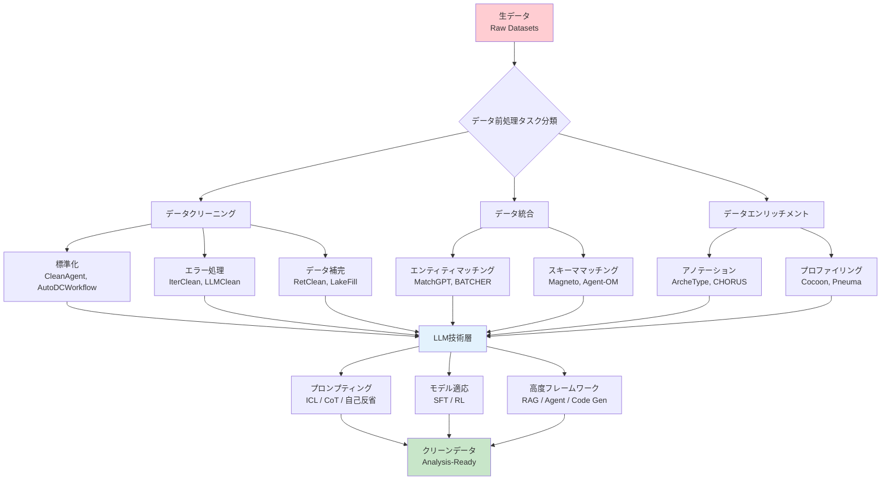
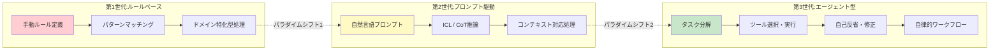
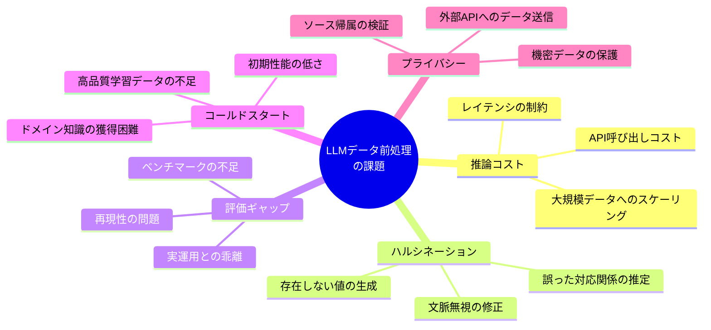

# Can LLMs Clean Up Your Mess? A Survey of Application-Ready Data Preparation with LLMs

- **Link**: https://arxiv.org/abs/2601.17058
- **Authors**: Wei Zhou, Jun Zhou, Haoyu Wang, Zhenghao Li, Qikang He, Shaokun Han, Guoliang Li, Xuanhe Zhou, Yeye He, Chunwei Liu, Zirui Tang, Bin Wang, Shen Tang, Kai Zuo, Yuyu Luo, Zhenzhe Zheng, Conghui He, Jingren Zhou, Fan Wu
- **Year**: 2026
- **Venue**: arXiv:2601.17058 (cs.DB)
- **Type**: Academic Paper (Survey)

## Abstract

This survey examines how large language models can enhance data preparation — a critical step involving denoising raw datasets, uncovering cross-dataset relationships, and extracting valuable insights. The authors document a paradigm shift from rule-based, model-specific pipelines to prompt-driven, context-aware, and agentic preparation workflows. The survey organizes the field into three primary tasks: data cleaning (standardization, error handling, imputation), data integration (entity and schema matching), and data enrichment (annotation, profiling). While LLMs bring enhanced generalization and semantic understanding, the authors highlight persistent challenges including the prohibitive cost of scaling LLMs, persistent hallucinations even in advanced agents, and the mismatch between advanced methods and weak evaluation protocols.

## Abstract（日本語訳）

本サーベイは、大規模言語モデル（LLM）がデータ前処理をどのように強化できるかを検討する。データ前処理は、生データのノイズ除去、データセット間の関係性の発見、および有用な知見の抽出を含む重要なステップである。著者らは、ルールベース・モデル特化型パイプラインからプロンプト駆動型・コンテキスト対応型・エージェント型の前処理ワークフローへのパラダイムシフトを体系的に記述している。サーベイはデータクリーニング（標準化、エラー処理、補完）、データ統合（エンティティマッチング、スキーママッチング）、データエンリッチメント（アノテーション、プロファイリング）の3つの主要タスクに分類して整理する。LLMは汎化能力と意味理解力の向上をもたらすが、LLMのスケーリングコスト、高度なエージェントにおいても持続するハルシネーション、先進的手法と脆弱な評価プロトコルの乖離といった課題が依然として存在することを指摘している。

## 概要

本論文は、LLMを用いたデータ前処理の全体像を網羅的に調査した包括的サーベイである。従来のルールベースアプローチからLLMベースのアプローチへの移行を「パラダイムシフト」として位置づけ、データクリーニング・データ統合・データエンリッチメントの3軸で体系的に整理している点が最大の特徴である。

主要な貢献：

1. **3軸×7サブタスクの体系的分類**: データクリーニング（標準化・エラー処理・補完）、データ統合（エンティティマッチング・スキーママッチング）、データエンリッチメント（アノテーション・プロファイリング）の包括的タクソノミーを構築
2. **技術手法の多層分類**: プロンプティング（ICL, CoT, アンサンブル, 自己反省）、モデル適応（SFT, RL）、高度フレームワーク（RAG, エージェント, コード生成, ハイブリッド）を横断的に比較
3. **パラダイムシフトの分析**: ルールベース → プロンプト駆動 → エージェント型への進化を4つの限界（手作業依存、意味理解不足、汎化能力不足、ラベルデータ依存）の克服として記述
4. **課題と展望の体系化**: 推論コスト、ハルシネーション、評価ギャップ、コールドスタート問題、プライバシーなどの課題を構造的に整理

## 問題と動機

- **手作業依存の限界**: 従来のルールベースシステムは大量の手作業と専門知識を要求し、データ前処理がデータサイエンスプロジェクト全体の60-80%の時間を占めるとされる

- **意味理解の不足**: 既存のルールベース手法は表層的なパターンマッチングに依存し、データの意味的関係性を捉えることができない。例えば「NYC」と「New York City」の同一性判定にはルールでは限界がある

- **タスク間の汎化困難**: モデル特化型パイプラインは個々のタスクに最適化されるが、異なるデータ前処理タスク間での知識転移が困難

- **評価プロトコルの不整合**: 手法の高度化に対して評価基準が追いついておらず、実運用での信頼性評価が不十分

## 分類フレームワーク / タクソノミー

本サーベイは、LLMベースのデータ前処理を以下の多層的分類体系で整理している。

### タスク分類体系

**データクリーニング（Data Cleaning）**:
- **データ標準化**: 日付形式、住所形式、電話番号形式などの異質なフォーマットを統一的な表現に変換。CleanAgent、AutoDCWorkflow、EVAPORATEなどのシステムが代表例
- **データエラー処理**: タイプミス、制約違反、外れ値などの誤った値を検出・修正。IterClean、GIDCL、LLMCleanが該当
- **データ補完（Imputation）**: 欠損値を文脈に基づいて妥当な値で補完。RetClean、LakeFill、UnIMPが代表的手法

**データ統合（Data Integration）**:
- **エンティティマッチング**: 異なるデータソースのレコードが同一の実世界エンティティを参照するかを判定。MatchGPT、BATCHER、Jellyfishが代表例
- **スキーママッチング**: データベーススキーマ間の意味的対応関係を特定。TableGPT2、Magneto、Agent-OMが該当

**データエンリッチメント（Data Enrichment）**:
- **データアノテーション**: データ要素に意味的ラベルや型を付与。ArcheType、CHORUS、PACTAが代表的
- **データプロファイリング**: データセットのメタデータや構造的特性を生成。Cocoon、AutoDDG、Pneumaが該当

### 技術手法の分類

**プロンプティング戦略**: In-Context Learning（ICL）、Chain-of-Thought（CoT）推論、アンサンブル手法、自己反省メカニズム

**モデル適応**: 教師あり微調整（SFT）、強化学習（RL）

**高度フレームワーク**: 検索拡張生成（RAG）、ツール統合型エージェントワークフロー、プログラム合成・コード生成、ハイブリッドLLM-MLアプローチ

## アルゴリズム / 擬似コード

```
Algorithm: LLMベースデータ前処理の統合パイプライン
Input: 生データセット D_raw, 前処理要件 R
Output: クリーンデータセット D_clean

Phase 1: データクリーニング
1: for each column c_i in D_raw do
2:     type_i ← LLM.annotate_type(c_i)         // 列型アノテーション
3:     if type_i has format_inconsistency then
4:         c_i ← LLM.standardize(c_i, type_i)   // 標準化
5:     end if
6:     errors_i ← LLM.detect_errors(c_i)        // エラー検出
7:     c_i ← LLM.repair(c_i, errors_i)          // エラー修正
8:     c_i ← LLM.impute_missing(c_i, context)   // 欠損補完
9: end for

Phase 2: データ統合
10: matches_entity ← LLM.entity_matching(D_sources)
11: matches_schema ← LLM.schema_matching(schemas)
12: D_integrated ← merge(D_sources, matches_entity, matches_schema)

Phase 3: データエンリッチメント
13: annotations ← LLM.annotate(D_integrated)
14: profile ← LLM.profile(D_integrated)
15: D_clean ← enrich(D_integrated, annotations, profile)

16: return D_clean
```

## アーキテクチャ / プロセスフロー



## Figures & Tables

### Table 1: データ前処理タスクの分類と代表的システム

| 大分類 | サブタスク | 代表的システム | 主要技術 | 対象データ |
|--------|-----------|---------------|---------|-----------|
| クリーニング | 標準化 | CleanAgent, EVAPORATE | エージェント, コード生成 | 表形式 |
| クリーニング | エラー処理 | IterClean, GIDCL, LLMClean | 反復修正, ICL | 表形式 |
| クリーニング | データ補完 | RetClean, LakeFill, UnIMP | RAG, 微調整 | 表形式 |
| 統合 | エンティティマッチング | MatchGPT, BATCHER, Jellyfish | ICL, 微調整 | レコード |
| 統合 | スキーママッチング | TableGPT2, Magneto, Agent-OM | エージェント, CoT | スキーマ |
| エンリッチメント | アノテーション | ArcheType, CHORUS, PACTA | プロンプティング | メタデータ |
| エンリッチメント | プロファイリング | Cocoon, AutoDDG, Pneuma | コード生成 | データセット |

### Figure 1: パラダイムシフトの進化過程



### Table 2: LLM技術手法の比較

| 技術カテゴリ | 手法 | 長所 | 短所 | 代表的タスク |
|-------------|------|------|------|-------------|
| プロンプティング | ICL（In-Context Learning） | 学習不要、即座に適用可能 | コンテキスト長制約 | エンティティマッチング |
| プロンプティング | CoT（Chain-of-Thought） | 複雑な推論が可能 | 推論コスト増大 | エラー検出 |
| プロンプティング | アンサンブル | 精度向上 | コスト倍増 | スキーママッチング |
| モデル適応 | SFT（教師あり微調整） | タスク特化で高精度 | ラベルデータ必要 | データ補完 |
| モデル適応 | RL（強化学習） | 報酬設計による最適化 | 学習不安定性 | コード生成 |
| 高度フレームワーク | RAG | 外部知識の活用 | 検索品質に依存 | データ補完 |
| 高度フレームワーク | エージェント | 自律的タスク実行 | 信頼性の課題 | 標準化 |
| 高度フレームワーク | コード生成 | 検証可能な出力 | 実行環境依存 | プロファイリング |

### Figure 2: LLMベースデータ前処理の課題マップ



### Table 3: 各世代のアプローチ比較

| 特性 | ルールベース（第1世代） | プロンプト駆動（第2世代） | エージェント型（第3世代） |
|------|----------------------|------------------------|-----------------------|
| 手作業量 | 高（専門家によるルール設計） | 中（プロンプト設計） | 低（自律実行） |
| 意味理解 | なし（表層パターン） | あり（LLMの知識活用） | あり + ツール活用 |
| 汎化能力 | 低（タスク特化） | 中（プロンプト変更で対応） | 高（動的計画） |
| 信頼性 | 高（決定論的） | 中（ハルシネーションリスク） | 低〜中（複雑な障害モード） |
| コスト | 初期開発コスト高 | API利用コスト | API + ツール実行コスト |
| 適用範囲 | 狭い | 広い | 最も広い |

## 実験と評価

本論文はサーベイ論文であるため独自の実験は実施していないが、既存研究の評価結果を横断的に分析し、以下の重要な知見を体系化している。

### 方法論的進化の傾向

- **コスト効率的ハイブリッド手法への移行**: LLMが実行可能プログラムを生成し、推論を小規模モデルに転送するアプローチが主流化
- **タスク特化型微調整の重要性の低下**: 入力構築（プロンプトエンジニアリング）の最適化へとフォーカスが移行
- **エージェント実装の限定性**: 理論的優位性にもかかわらず、実用的なエージェント実装の試みはまだ限定的

### クロスモーダルな進展

- 最近のシステムは「単一アーキテクチャ内で複数データモダリティをサポート」する方向に進化
- モダリティ特化型の特徴量エンジニアリングへの依存が減少

### 主要課題の分析

1. **推論コスト**: LLMのスケーリングコストが実運用での最大の障壁であり、特に大規模データセットでの適用が困難
2. **ハルシネーション**: 高度なエージェントにおいても持続的に発生し、データ前処理の信頼性を根本的に脅かす
3. **評価プロトコルの不備**: 手法の高度化に対して評価基準が追いついておらず、実世界の複雑性を反映したベンチマークが不足
4. **エージェントの信頼性**: 理論的利点と実用的展開の間に大きなギャップが存在

### 今後の方向性

- **スケーラブルなLLM-データシステム**: 大規模データ前処理のためのコスト効率的インフラストラクチャの構築
- **原則的エージェント設計**: 検証可能で信頼性の高い自律的ワークフローの実現
- **堅牢な評価プロトコル**: 実世界の複雑性に対応した標準化ベンチマークの整備

## 備考

- 19名の著者による大規模共著論文であり、データベース（cs.DB）分野に投稿されている点が特徴的。データ管理コミュニティの視点からLLMの活用を体系化している
- 関連リソースとして GitHub リポジトリ（weAIDB/awesome-data-llm）が公開されており、最新の研究動向を追跡可能
- 「パラダイムシフト」の3段階分類（ルールベース → プロンプト駆動 → エージェント型）は、本分野の発展を理解するための有用なフレームワークを提供
- エージェント型アプローチの「理論的優位性と実用的限界のギャップ」を明確に指摘している点は、今後の研究方向を考える上で重要な示唆を与える
- データ前処理の各サブタスクに対して代表的なシステム名を明示的に列挙しており、関連研究を辿る際のエントリーポイントとして実用的
