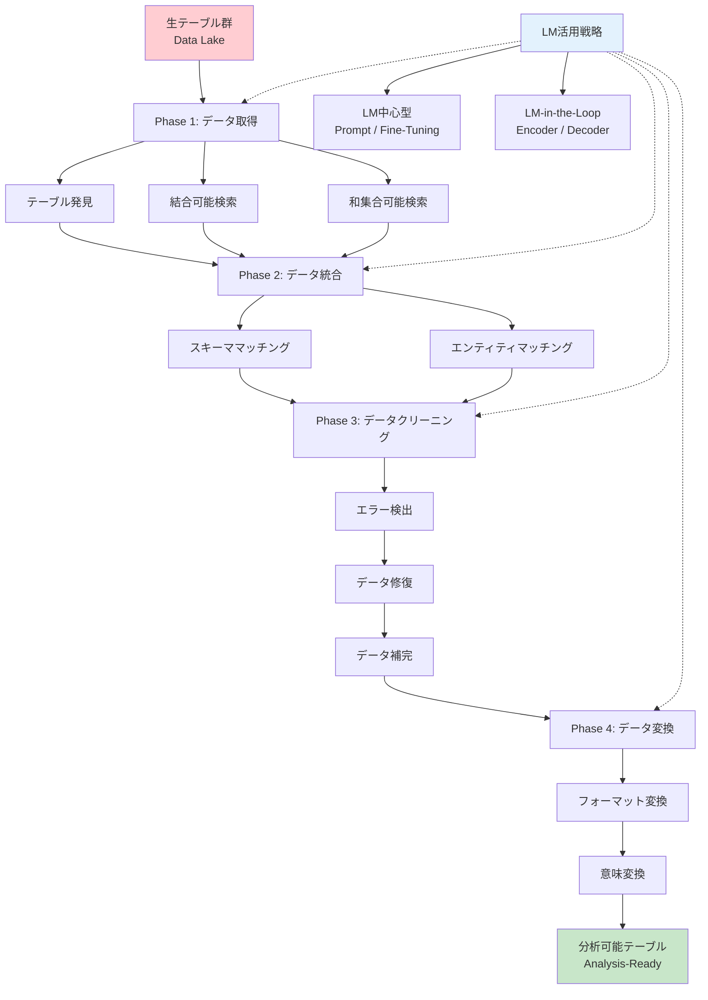
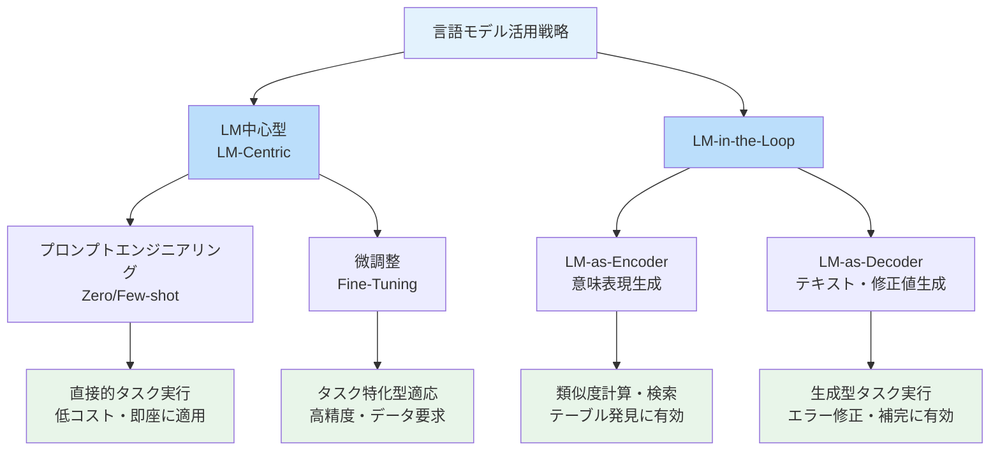
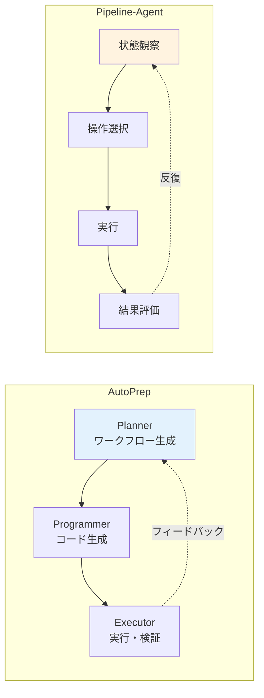

# Empowering Tabular Data Preparation with Language Models: Why and How?

- **Link**: https://arxiv.org/abs/2508.01556
- **Authors**: Mengshi Chen, Yuxiang Sun, Tengchao Li, Jianwei Wang, Kai Wang, Xuemin Lin, Ying Zhang, Wenjie Zhang
- **Year**: 2025
- **Venue**: arXiv:2508.01556 (cs.AI)
- **Type**: Academic Paper (Survey)

## Abstract

Data preparation is a critical step in enhancing the usability of tabular data and thus boosts downstream data-driven tasks. This survey presents a systematic examination of how language models can enhance tabular data preparation across four core phases: data acquisition, integration, cleaning, and transformation. The authors analyze LM capabilities, examining how language models can integrate with other components to handle various preparation tasks, highlighting recent breakthroughs, and proposing future pipeline approaches. The work addresses the gap by exploring both why LMs are suited for tabular data preparation and how to deploy them effectively, covering the complete end-to-end procedure of transforming raw, heterogeneous tables into a clean, integrated, and analysis-ready form.

## Abstract（日本語訳）

データ前処理は表形式データの利用可能性を向上させる重要なステップであり、下流のデータ駆動タスクを強化する。本サーベイは、言語モデル（LM）が表形式データの前処理をどのように強化できるかを、データ取得・統合・クリーニング・変換の4つのコアフェーズにわたって体系的に調査する。著者らはLMの能力を分析し、さまざまな前処理タスクを処理するために言語モデルが他のコンポーネントとどのように統合できるかを検討し、最近のブレークスルーを強調し、将来のパイプラインアプローチを提案する。本研究は、LMが表形式データ前処理に適している理由（Why）と効果的な展開方法（How）の両方を探求することでギャップに対処し、生の異質なテーブルをクリーンで統合された分析可能な形式に変換する完全なエンドツーエンド手順をカバーしている。

## 概要

本論文は、表形式データの前処理における言語モデルの活用を、4フェーズ×10サブタスクの体系的フレームワークで整理したサーベイである。既存サーベイとの最大の差別化ポイントは、「Why（なぜLMが適しているか）」と「How（どのように展開するか）」の両面を系統的に分析している点にある。

主要な貢献：

1. **4フェーズ×10サブタスクの完全なタクソノミー**: データ取得（3タスク）、統合（2タスク）、クリーニング（3タスク）、変換（2タスク）を網羅
2. **LM活用戦略の二層分類**: LM中心型（プロンプトエンジニアリング、微調整）とLM-in-the-Loop型（エンコーダ、デコーダ）の明確な区分
3. **フェーズ間相互作用の分析**: クリーニングと統合の相互影響など、フェーズ間の依存関係を指摘
4. **エージェント型パイプラインの展望**: AutoPrep、Pipeline-Agentなどの新興フレームワークを紹介し、今後の方向性を提示

## 問題と動機

- **表形式データの前処理コスト**: データサイエンティストの作業時間の大部分がデータ前処理に費やされ、特に表形式データの異質性（フォーマット不一致、スキーマ差異、欠損値）が主要なボトルネック

- **従来手法の意味理解の限界**: ルールベースや統計的手法はデータの表層的なパターンに依存し、列名や値の暗黙的な意味関係を捉えられない。例えば「price」列と「cost」列の意味的同等性の判定が困難

- **タスク間の断絶**: 既存研究は個別のサブタスク（エンティティマッチング、エラー検出など）に特化しており、エンドツーエンドのパイプラインとしての最適化が不十分

- **統一ベンチマークの不在**: ワークフロー全体を評価する統一的なベンチマークが欠如しており、手法間の公正な比較が困難

## 分類フレームワーク / タクソノミー

### フェーズ1: データ取得（Data Acquisition）

データレイクから関連テーブルを特定・収集するフェーズ。

- **テーブル発見（Table Discovery）**: クエリに対して意味的に関連するTop-kテーブルを検索。LMのエンコーダ能力を活用した意味的類似度計算が有効
- **結合可能テーブル検索（Joinable Table Search）**: 結合可能な列を持つテーブルを発見。キー列間の意味的対応関係の判定にLMを活用
- **和集合可能テーブル検索（Unionable Table Search）**: 垂直結合可能なテーブルを特定。スキーマの意味的互換性の評価にLMが貢献

### フェーズ2: データ統合（Data Integration）

異質なテーブルを整合的に結合するフェーズ。

- **スキーママッチング（Schema Matching）**: 異なるスキーマ間の属性対応関係を特定。LMの意味理解能力が列名の暗黙的な対応を捉える
- **エンティティマッチング（Entity Matching）**: 異なるソースのレコードが同一エンティティを参照するか判定。LMの文脈理解により表記ゆれへの対応が向上

### フェーズ3: データクリーニング（Data Cleaning）

データの品質問題を検出・修正するフェーズ。

- **エラー検出（Error Detection）**: 誤った値を含むセルを特定。LMの世界知識により、統計的手法では検出困難なドメイン依存エラーも検出可能
- **データ修復（Data Repair）**: 検出されたエラーを正しい値に修正。LMの生成能力と文脈推論により適切な修正値を推定
- **データ補完（Data Imputation）**: 欠損値を妥当な値で補完。LMの事前学習知識により、統計的補完手法を超える品質を実現する可能性

### フェーズ4: データ変換（Data Transformation）

データを分析に適した形式に再構成するフェーズ。

- **フォーマット変換（Format Transformation）**: レコードをターゲットスキーマに再構造化。LMのコード生成能力による自動化が進展
- **意味変換（Semantic Transformation）**: データ内容を構造化知識にマッピング。LMの知識ベースを活用した意味的エンコーディング

### LM活用戦略の分類

**LM中心型（LM-Centric）**:
- **プロンプトエンジニアリング**: ゼロショット/フューショットでの直接的なタスク実行
- **微調整（Fine-Tuning）**: タスク特化型のモデルパラメータ適応

**LM-in-the-Loop型**:
- **LM-as-Encoder**: 意味表現の生成による類似度計算・検索への活用
- **LM-as-Decoder**: テキスト出力・修正値の生成への活用

## アルゴリズム / 擬似コード

```
Algorithm: LMベース表形式データ前処理パイプライン
Input: 生テーブル群 T_raw = {t_1, ..., t_n}, 分析要件 Q
Output: 分析可能テーブル T_ready

Phase 1: データ取得
1: T_relevant ← LM_Encoder.discover(T_raw, Q)      // テーブル発見
2: T_joinable ← LM_Encoder.find_joinable(T_relevant) // 結合候補検索
3: T_unionable ← LM_Encoder.find_unionable(T_relevant) // 和集合候補検索

Phase 2: データ統合
4: schema_map ← LM.schema_matching(T_relevant)      // スキーマ対応
5: entity_map ← LM.entity_matching(T_relevant)       // エンティティ対応
6: T_integrated ← merge(T_relevant, schema_map, entity_map)

Phase 3: データクリーニング
7: errors ← LM.detect_errors(T_integrated)           // エラー検出
8: T_repaired ← LM.repair(T_integrated, errors)      // データ修復
9: T_imputed ← LM.impute(T_repaired)                 // 欠損補完

Phase 4: データ変換
10: T_formatted ← LM.format_transform(T_imputed, Q)  // フォーマット変換
11: T_ready ← LM.semantic_transform(T_formatted)      // 意味変換

12: return T_ready
```

## アーキテクチャ / プロセスフロー



## Figures & Tables

### Table 1: 4フェーズ×10サブタスクのタクソノミー

| フェーズ | サブタスク | 目的 | 主要ベンチマーク | LM活用方式 |
|---------|-----------|------|-----------------|-----------|
| 取得 | テーブル発見 | Top-k関連テーブルの検索 | - | LM-as-Encoder |
| 取得 | 結合可能検索 | 結合候補の特定 | - | LM-as-Encoder |
| 取得 | 和集合可能検索 | 垂直結合候補の特定 | - | LM-as-Encoder |
| 統合 | スキーママッチング | 属性間対応の特定 | Matchbench | Prompt / Fine-Tuning |
| 統合 | エンティティマッチング | 同一エンティティ判定 | - | Prompt / Fine-Tuning |
| クリーニング | エラー検出 | 誤セルの特定 | MEDEC | LM-as-Decoder |
| クリーニング | データ修復 | エラー値の修正 | - | LM-as-Decoder |
| クリーニング | データ補完 | 欠損値の補完 | ImputationBench | LM-as-Decoder |
| 変換 | フォーマット変換 | スキーマ再構造化 | SPREADSHEETbench | コード生成 |
| 変換 | 意味変換 | 知識マッピング | - | LM-as-Decoder |

### Figure 1: LM活用戦略の二層分類



### Table 2: フェーズ間の相互依存関係

| 依存関係 | 説明 | 影響度 | 具体例 |
|---------|------|--------|--------|
| 統合 → クリーニング | スキーマ不整合がエラー検出精度に影響 | 高 | マッチング誤りが後段のエラー検出を困難に |
| クリーニング → 統合 | データ品質がマッチング精度に影響 | 高 | ノイズの多いデータでのエンティティマッチング精度低下 |
| 取得 → 統合 | テーブル選択がスキーマ複雑度に影響 | 中 | 不適切なテーブル選択による統合コスト増大 |
| クリーニング → 変換 | データ品質が変換の正確性に影響 | 中 | 未修正エラーが変換時に伝播 |
| 変換 → 下流タスク | 変換品質が分析精度に直結 | 高 | 不適切な意味変換による分析バイアス |

### Figure 2: エージェント型パイプラインの新興アーキテクチャ



### Table 3: SLM vs LLM の表形式データ前処理における比較

| 特性 | SLM（小規模LM） | LLM（大規模LM） | ハイブリッド |
|------|-----------------|-----------------|-------------|
| 推論コスト | 低 | 高 | 中 |
| 意味理解力 | 限定的 | 高い | LLMレベル |
| 微調整の容易さ | 容易（GPU要件低） | 困難（大規模GPU必要） | SLM部分のみ |
| レイテンシ | 低 | 高 | 中 |
| タスク汎用性 | タスク特化 | 汎用 | 選択的 |
| 実運用適性 | 高 | 低〜中 | 高 |
| ハルシネーション | 少ない（微調整時） | 多い | 制御可能 |

## 実験と評価

本論文はサーベイ論文であるため独自の実験は実施していないが、各フェーズの既存研究における評価結果を横断的に分析している。

### 評価カテゴリ

- **直接品質評価**: 正解データに対する精度（Accuracy）、F1スコア、RMSE
- **下流影響評価**: 前処理前後でのモデル性能差（元データ vs 前処理済みデータ）

### 主要ベンチマーク

| ベンチマーク | 対象フェーズ | 評価内容 |
|-------------|------------|---------|
| Matchbench | スキーママッチング | マッチング精度 |
| ImputationBench | データ補完 | 補完品質 |
| MEDEC | エラー検出 | 検出精度 |
| SPREADSHEETbench | フォーマット変換 | 変換正確性 |

### 主要な知見

1. **LMはフェーズによって最適な活用方式が異なる**: データ取得ではエンコーダ型が有効、クリーニングではデコーダ型が有効であり、一律の適用は非効率
2. **SLMとLLMのハイブリッド活用が効率と効果を両立**: 大規模モデルの推論能力と小規模モデルのコスト効率を組み合わせたアプローチが有望
3. **フェーズ間の独立処理は次善策**: クリーニングと統合は相互に強く影響し合うため、フェーズ横断的な最適化が必要
4. **統一ベンチマークの不在が深刻**: ワークフロー全体を捉える統一的ベンチマークが不足しており、手法間の公正な比較が困難

### 課題と今後の方向性

- **堅牢性**: LMのハルシネーションによる「不正確または論理的に矛盾する出力」への対処
- **スケーラビリティ**: 高い計算コストとトークン制限によるフルテーブルエンコーディングの困難
- **フェーズ間統合**: 現在独立的に処理されているフェーズの密結合性への対応
- **リソース効率的パイプライン**: 計算制約に対応した効率的なアーキテクチャ
- **エージェント型フレームワーク**: 静的分解を置き換える適応的協調の実現

## 備考

- 表形式データに特化したサーベイであり、テキストや画像などの他モダリティは対象外。この限定が逆にデータ前処理の各フェーズを深く掘り下げることを可能にしている
- 「Why」と「How」の両面を系統的に分析するアプローチは、他のサーベイにはない独自の視点を提供。特に「なぜLMが有効か」の分析は、新規手法の設計指針として実用的
- AutoPrep と Pipeline-Agent という2つの新興エージェントフレームワークの紹介は、今後のデータ前処理自動化の方向性を示唆
- フェーズ間の相互依存関係の指摘は重要であり、従来のパイプライン的な独立処理からの脱却の必要性を示している
- 統一ベンチマークの不在に対する問題提起は、コミュニティ全体で取り組むべき課題として記憶に留めるべき
