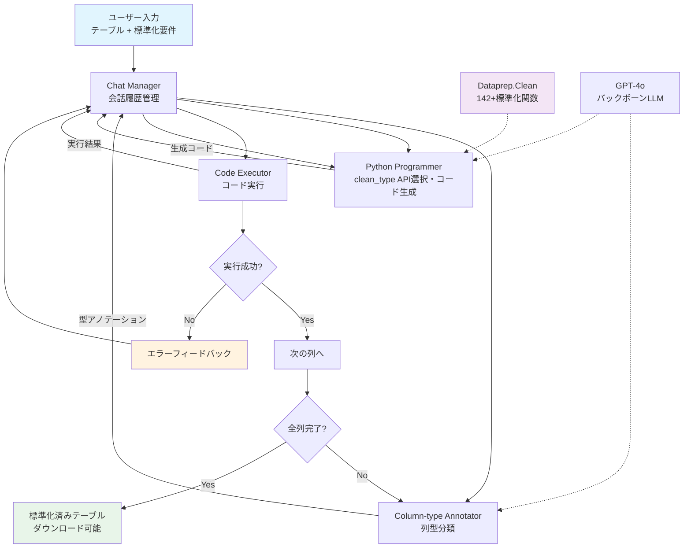
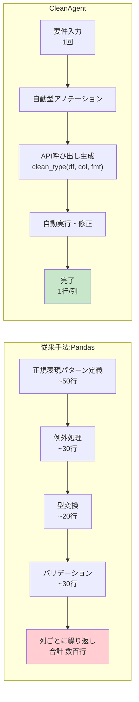
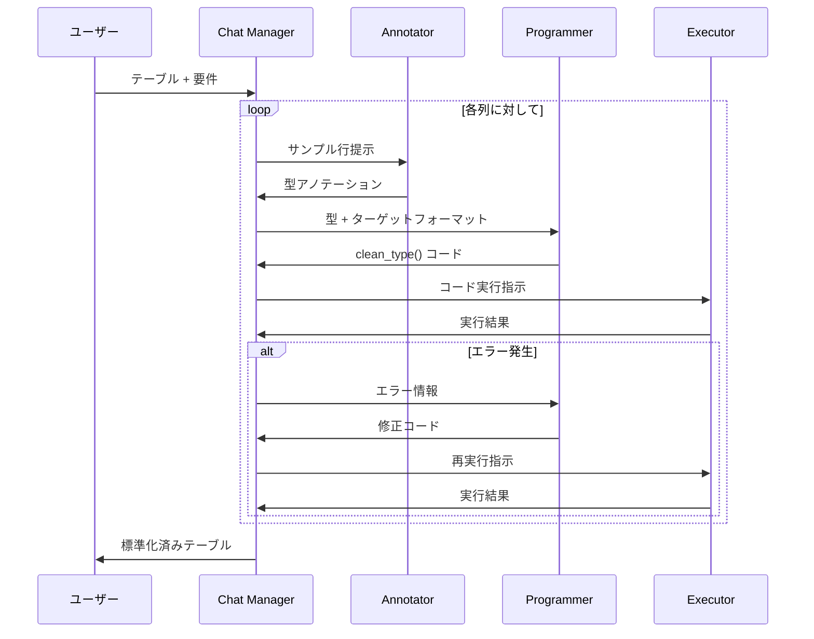

# CleanAgent: Automating Data Standardization with LLM-based Agents

- **Link**: https://arxiv.org/abs/2403.08291
- **Authors**: Danrui Qi, Zhengjie Miao, Jiannan Wang
- **Year**: 2024
- **Venue**: arXiv:2403.08291 (cs.LG, cs.AI, cs.MA)
- **Type**: Academic Paper

## Abstract

Data standardization is a crucial step in the data science lifecycle, yet traditionally demands significant manual effort and programming expertise. While Python libraries like Pandas offer functionality for data manipulation, they require users to write extensive code for each column type. This paper proposes CleanAgent, which combines a declarative Python library called Dataprep.Clean with LLM-based agents to automate the data standardization process. The system provides a declarative API for standardizing different column types with minimal code, an agent framework integrating the library with LLMs to automate standardization, and a web application demonstrating practical utility. The approach enables data scientists to provide their requirements once, allowing for a hands-free process rather than requiring continuous prompt refinement and expert-level programming knowledge.

## Abstract（日本語訳）

データ標準化はデータサイエンスライフサイクルにおける重要なステップであるが、従来は大量の手作業とプログラミング専門知識を要求してきた。Pandasなどのライブラリはデータ操作機能を提供するが、各列型に対して広範なコードを書く必要がある。本論文では、宣言的Pythonライブラリ「Dataprep.Clean」とLLMベースのエージェントを組み合わせた「CleanAgent」を提案する。本システムは、最小限のコードで異なる列型を標準化する宣言的API、ライブラリとLLMを統合するエージェントフレームワーク、および実用性を実証するWebアプリケーションを提供する。このアプローチにより、データサイエンティストは要件を一度提供するだけで、継続的なプロンプト修正や専門的プログラミング知識を必要とせずに、ハンズフリーのプロセスが可能となる。

## 概要

本論文は、データ標準化タスクを自動化するためにLLMベースのマルチエージェントフレームワークを活用したシステム「CleanAgent」を提案する。核心的なアイデアは、LLMの出力空間を宣言的APIに制約することで、ハルシネーションリスクを低減しつつ高精度な標準化を実現する点にある。

主要な貢献：

1. **Dataprep.Cleanライブラリ**: 142以上の標準化関数を提供する宣言的API。Split → Validate → Transform の3ステップ抽象化により、複雑な標準化を1行のAPI呼び出しに簡約化
2. **マルチエージェントフレームワーク**: Column-type Annotator、Python Programmer、Code Executor、Chat Managerの4エージェント構成による自律的標準化パイプライン
3. **Webアプリケーション**: エージェントの推論過程を可視化し、ユーザーが結果を確認・再実行できる透明性の高いインターフェース
4. **実験的検証**: GPT-4o直接利用やCocoonと比較して約2倍の精度を達成

## 問題と動機

- **手作業の膨大さ**: Pandasを使った従来のデータ標準化では、各列型（日付、住所、電話番号など）に対して数百〜数千行のコードが必要。データセットの列数が増えるほどコスト増大

- **プログラミング専門知識の壁**: 正規表現、型変換、例外処理など高度なプログラミングスキルが必要であり、ドメイン専門家（生物学者、経済学者など）にとって大きな参入障壁

- **LLM直接利用の限界**: GPT-4oなどのLLMに直接コード生成を依頼しても、複雑なフォーマット変換では精度が低い（22.0%）。特に非定型的な日付形式（「2:30pDec 27」など）への対応が困難

- **既存ツールの非効率性**: Cocoonのような一括SQL生成アプローチは、列ごとの最適化を行わないためレイテンシが極端に高く（636秒）、実用性に欠ける

## 提案手法

### Dataprep.Clean ライブラリ設計

142以上の列型に対応する宣言的APIを提供。各標準化関数は以下の3ステップの統一パターンに基づく：

| ステップ | 目的 | 日付型の例 |
|---------|------|-----------|
| **Split** | 入力を意味的要素に分解 | トークン抽出: {'Thu', 'Sep', '25', ...} |
| **Validate** | 各要素の妥当性を検証 | 'Sep' が有効な月名か、'2003' が有効な年か確認 |
| **Transform** | 要素を再結合・再フォーマット | Sep→09 に変換、YYYY-MM-DD として再構築 |

API呼び出し形式: `clean_type(df, column_name, target_format)`

この抽象化により、手動での数百行のPandasコードが1行のAPI呼び出しに簡約化され、LLMのコード生成タスクも大幅に簡素化される。

### マルチエージェントフレームワーク

4つの専門エージェントがChat Managerを介して逐次的に連携：

1. **Column-type Annotator**: サンプル行を検査し、各列のデータ型を分類。不確実な場合は「I do not know」を出力
2. **Python Programmer**: 型アノテーションを受け取り、対応するclean関数を選択し、標準化コードを生成
3. **Code Executor**: 生成されたPythonコードを実行し、実行エラーまたは成功結果をキャプチャ
4. **Chat Manager**: 全エージェントがアクセス可能な包括的会話履歴を維持し、エージェント間の通信を調整

### エラー回復メカニズム

実行失敗時、エラーメッセージがChat Managerのメモリに入り、次のイテレーションのプロンプトコンテキストの一部となる。これにより、手動のユーザー介入なしにマルチターンの自己修正が可能。

## アルゴリズム / 擬似コード

```
Algorithm: CleanAgent データ標準化パイプライン
Input: テーブル T, ユーザー要件 R（ターゲットフォーマット）
Output: 標準化済みテーブル T_clean

1: ChatManager.initialize()
2: for each column c_i in T do
3:     // Phase 1: 列型アノテーション
4:     sample ← T.sample_rows(c_i, n=5)
5:     type_i ← Annotator.classify(sample)
6:     if type_i == "unknown" then
7:         skip(c_i)  // 不明な型はスキップ
8:         continue
9:     end if
10:    ChatManager.update(type_annotation=type_i)
11:
12:    // Phase 2: コード生成
13:    code_i ← Programmer.generate(
14:        type=type_i,
15:        target_format=R[c_i],
16:        api="clean_{type_i}(df, '{c_i}', '{format}')"
17:    )
18:    ChatManager.update(generated_code=code_i)
19:
20:    // Phase 3: コード実行（リトライ付き）
21:    max_retries ← 3
22:    for attempt = 1 to max_retries do
23:        result ← Executor.run(code_i)
24:        if result.success then
25:            T[c_i] ← result.output
26:            break
27:        else
28:            ChatManager.update(error=result.error)
29:            code_i ← Programmer.fix(code_i, result.error)
30:        end if
31:    end for
32: end for
33: T_clean ← T
34: return T_clean
```

## アーキテクチャ / プロセスフロー



## Figures & Tables

### Table 1: Dataprep.Clean の Split-Validate-Transform パターン

| データ型 | Split例 | Validate例 | Transform例 | API呼び出し |
|---------|---------|-----------|------------|------------|
| 日付 | {'Thu','Sep','25','2003'} | 月名・年の妥当性 | Sep→09, YYYY-MM-DD | `clean_date(df, col, 'YYYY-MM-DD')` |
| 電話番号 | {'+1','212','555','1234'} | 国コード・桁数 | 統一フォーマット | `clean_phone(df, col, 'national')` |
| 住所 | {'123','Main','St','NY'} | 州名・郵便番号 | 標準形式 | `clean_address(df, col)` |
| メール | {'user','@','domain','.com'} | @記号・TLD | 小文字正規化 | `clean_email(df, col)` |

### Figure 1: CleanAgent vs 従来手法のコード量比較



### Table 2: 実験結果の比較

| システム | セルレベル精度 | レイテンシ（秒） | 自動化度 | 特記事項 |
|---------|-------------|----------------|---------|---------|
| GPT-4o Direct | 22.0% | 19.76 | 低（逐次プロンプト） | 複雑フォーマットに弱い |
| Cocoon | 21.5% | 636.62 | 中（SQL一括） | 列特化最適化なし |
| **CleanAgent** | **42.5%** | **29.57** | **高（ハンズフリー）** | **宣言的API活用** |

### Figure 2: エージェント間通信のシーケンス



### Table 3: マルチエージェント構成の詳細

| エージェント | 役割 | 入力 | 出力 | 使用ツール |
|------------|------|------|------|-----------|
| Column-type Annotator | 列データ型の推定 | サンプル行 | 型ラベル or "unknown" | - |
| Python Programmer | 標準化コードの生成 | 型+フォーマット | clean_type() 呼び出し | Dataprep.Clean API |
| Code Executor | コードの実行と結果取得 | Pythonコード | 実行結果 or エラー | Python runtime |
| Chat Manager | 会話履歴の管理・調整 | 全エージェントの出力 | コンテキスト配信 | メモリストア |

## 実験と評価

### 実験設定

- **データセット**: Flights dataset（Rekatsinas et al., 2017）— 4つの日付列を含み、「2011-12-08 3:50:00 PM」「2:30pDec 27」「06:45 AM Sun 25-Dec-2011」など極めて不規則なフォーマットを含む
- **ターゲットフォーマット**: YYYY-MM-DD HH:MM:SS
- **正解データ生成**: GPT-4oによるセルレベル変換結果をコンパイル
- **ハードウェア**: MacBook Pro M1, 16GB RAM, macOS 15.5
- **バックボーンLLM**: GPT-4o-2024-08-06（temperature: 0, timeout: 60s, cache seed: 42）

### ベースライン

1. **GPT-4o Direct**: ライブラリを使用せず、GPT-4oに直接コード生成を指示
2. **Cocoon**: ワンショットSQL生成システム。テーブル全体に対する一括処理

### 主要な結果

- CleanAgentはGPT-4o Directに対してセルレベル精度で約2倍の改善（22.0% → 42.5%）を達成
- Cocoonと比較してレイテンシを95%以上削減（636.62秒 → 29.57秒）
- 精度向上の主因は、宣言的APIによるLLM出力空間の制約。LLMが任意のPandasコードではなく、検証済みのclean_type() API呼び出しのみを生成することで、ハルシネーションによる誤変換が大幅に減少

### 設計上の知見

- **宣言的API制約の効果**: LLMの出力を構造化されたAPI呼び出しに限定することで、自由形式コード生成と比較して精度が約2倍に向上。これは「LLMの能力を適切に制約する」というエージェント設計の重要な原則を実証
- **エラーフィードバックループ**: Chat Managerを介した会話履歴の共有により、エラー情報が次のイテレーションに自然に伝播し、手動介入なしの自己修正を実現
- **列単位処理の優位性**: テーブル全体を一括処理するCocoonと異なり、列ごとの型特化処理により最適化と効率化を両立

## 備考

- 評価が日付型の4列に限定されており、住所・電話番号・メールなど他の列型での性能は未検証。42.5%という精度自体も改善の余地が大きい
- 宣言的APIによるLLM出力空間の制約という設計原則は、データ前処理に限らずLLMエージェント全般に適用可能な重要な知見
- 4エージェント構成は比較的シンプルだが、逐次的な通信パターン（Annotator → Programmer → Executor）は複雑な依存関係には対応できない可能性
- GPT-4oのみを評価対象としており、他のLLM（Claude、Gemini、オープンソースモデルなど）での性能比較が欠如
- 今後の拡張方向として、データ補完・外れ値検出・可視化など隣接タスクへのエージェント拡張が示唆されており、エンドツーエンドのデータサイエンスワークフロー自動化への布石として位置づけられる
