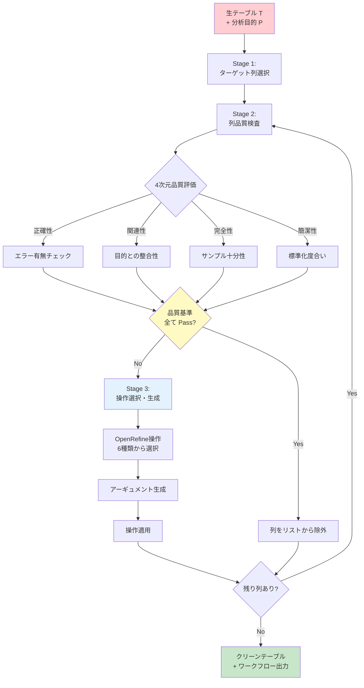
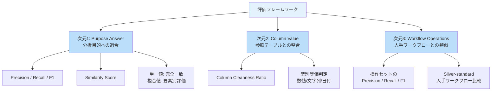
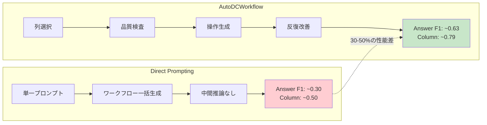

# AutoDCWorkflow: LLM-based Data Cleaning Workflow Auto-Generation and Benchmark

- **Link**: https://arxiv.org/abs/2412.06724
- **Authors**: Lan Li, Liri Fang, Bertram Ludäscher, Vetle I. Torvik
- **Year**: 2024
- **Venue**: EMNLP 2025 Findings
- **Type**: Academic Paper

## Abstract

This paper introduces AutoDCWorkflow, a pipeline that automatically converts raw tables into clean, analysis-ready datasets by generating sequences of OpenRefine operations. The system addresses six categories of data quality problems including formatting inconsistencies, type mismatches, and record duplication. The evaluation framework comprises 142 test purposes across 96 tables spanning six real-world domains, measuring three dimensions: Purpose Answer (whether cleaned data produces correct analysis results), Column Value (alignment with reference tables), and Workflow Operations (resemblance to human-created workflows). Experimental results demonstrate that Llama 3.1, Mistral, and Gemma 2 models substantially improve over baselines, with Gemma 2-27B excelling at generating high-quality tables and Gemma 2-9B producing workflows most similar to human-annotated versions.

## Abstract（日本語訳）

本論文は、生テーブルをクリーンな分析可能データセットへ自動変換するパイプライン「AutoDCWorkflow」を紹介する。本システムは、OpenRefineの操作シーケンスを生成することにより、フォーマット不整合、型不一致、レコード重複を含む6カテゴリのデータ品質問題に対処する。評価フレームワークは、6つの実世界ドメインにまたがる96テーブルの142テスト目的で構成され、目的回答（クリーンデータが正しい分析結果を生成するか）、列値（参照テーブルとの整合性）、ワークフロー操作（人手作成ワークフローとの類似度）の3次元で測定する。実験結果は、Llama 3.1、Mistral、Gemma 2がベースラインを大幅に上回ることを示し、Gemma 2-27Bが高品質テーブル生成に優れ、Gemma 2-9Bが人手アノテーション版に最も類似したワークフローを生成した。

## 概要

本論文は、LLMを活用してデータクリーニングワークフローを自動生成するシステム「AutoDCWorkflow」と、その評価のための包括的ベンチマークを提案する。既存研究の多くがセルレベルのエラー修正に焦点を当てるのに対し、本研究はOpenRefineの操作シーケンスとして実行可能なワークフロー全体の自動生成に取り組む点が独自である。

主要な貢献：

1. **反復的3段階パイプライン**: 目的関連列の選択 → 品質検査 → 操作生成のサイクルを品質基準が満たされるまで反復
2. **6カテゴリの品質問題への対応**: upper、trim、numeric、date、mass_edit、regexr_transformの6種類のOpenRefine操作を自動選択
3. **3次元評価フレームワーク**: 目的回答・列値・ワークフロー操作の多角的評価
4. **大規模ベンチマーク**: 6ドメイン、96テーブル、142テスト目的の包括的評価セット

## 問題と動機

- **データクリーニングの手作業コスト**: 実世界のデータは多様な品質問題（フォーマット不整合、型エラー、重複レコード等）を含み、手動でのクリーニングは時間とコストの大きな負担

- **既存自動化手法の限界**: ルールベース手法はドメイン固有の知識が必要で汎用性に欠け、機械学習ベース手法は大量の学習データを要求する

- **セルレベル vs ワークフローレベル**: 既存のLLM活用研究の多くは個々のセルの修正に焦点を当てており、再現可能で解釈可能なワークフロー全体の自動生成に取り組む研究は限定的

- **評価基準の多面性**: データクリーニングの品質は単一指標では測定できず、分析目的への適合性、値の正確性、ワークフローの解釈可能性など複数の観点からの評価が必要

## 提案手法

### 反復的3段階パイプライン

**Stage 1: ターゲット列の選択**
分析目的（Purpose）に関連する列をプロンプトベースのフューショット学習により特定。クリーニング対象を絞り込むことで複雑性を低減。

**Stage 2: 列品質の検査**
LLMエージェントが4つの品質次元を評価：
- **正確性（Accuracy）**: エラーの有無
- **関連性（Relevance）**: 分析目的との整合性
- **完全性（Completeness）**: 十分なサンプル数の確保
- **簡潔性（Conciseness）**: 表現の標準化度合い

各次元がTrue/Falseで評価され、品質レポートが生成される。

**Stage 3: 操作とアーギュメントの生成**
品質欠陥に基づき、LLMが適切なOpenRefine操作を選択しアーギュメントを生成。Stage 2-3を全ターゲット列が品質基準を満たすまで反復。

### 6種類のOpenRefine操作

| 操作 | 対象品質問題 | 品質次元 | 説明 |
|------|------------|---------|------|
| upper | テキスト標準化 | 簡潔性 | 大文字変換 |
| trim | 空白除去 | 正確性・簡潔性 | 前後の空白を削除 |
| numeric | 型変換 | 正確性 | 数値型への変換 |
| date | 日付標準化 | 正確性 | 日付フォーマットの統一 |
| mass_edit | 値の統合 | 正確性・簡潔性・関連性・完全性 | 類似値の標準値へのマッピング |
| regexr_transform | パターン変換 | 正確性・簡潔性・関連性 | 正規表現ベースの抽出・置換 |

### プロンプティング戦略

- 構造化プロンプトテンプレート: タスク指示 + 評価基準 + フューショット例（各ステージ5-7例）
- 温度設定: 操作選択 → 0.1（安定重視）、失敗時 → 0.3 にエスカレーション
- アーギュメント生成: 温度 0.2

## アルゴリズム / 擬似コード

```
Algorithm: AutoDCWorkflow データクリーニングワークフロー自動生成
Input: 生テーブル T, 分析目的 P, フューショット例 E
Output: クリーンテーブル T_clean, ワークフロー W

1: W ← []                                        // 操作リスト初期化
2: columns_target ← LLM.select_columns(T, P, E)  // Stage 1: 関連列選択
3: while columns_target ≠ ∅ do
4:     for each column c_i in columns_target do
5:         // Stage 2: 品質検査
6:         quality_report ← LLM.inspect_quality(
7:             T, c_i, P,
8:             dimensions=[accuracy, relevance, completeness, conciseness]
9:         )
10:        if quality_report.all_pass() then
11:            columns_target.remove(c_i)
12:            continue
13:        end if
14:
15:        // Stage 3: 操作生成（temperature=0.1）
16:        operation ← LLM.select_operation(
17:            T, c_i, quality_report, E, temp=0.1
18:        )
19:        if operation is None then
20:            operation ← LLM.select_operation(    // リトライ（temp=0.3）
21:                T, c_i, quality_report, E, temp=0.3
22:            )
23:        end if
24:
25:        // アーギュメント生成（temperature=0.2）
26:        args ← LLM.generate_arguments(operation, T, c_i, temp=0.2)
27:        T ← OpenRefine.apply(T, operation, args)
28:        W.append((operation, args))
29:    end for
30: end while
31: T_clean ← T
32: return T_clean, W
```

## アーキテクチャ / プロセスフロー



## Figures & Tables

### Table 1: ベンチマークの構成

| ドメイン | テーブル数 | テスト目的数 | 主な品質問題 | エラー率 |
|---------|-----------|------------|------------|---------|
| Menu | 30以上 | 30 | フォーマット不整合、重複 | 0.15-0.35 |
| Dish | - | 16 | カテゴリ不整合 | 0.10-0.25 |
| Chicago Food Inspection | - | 30 | 型不一致、日付形式 | 0.20-0.30 |
| Hospital | - | 28 | 値の不整合、空白 | 0.15-0.25 |
| PPP (Paycheck Protection) | - | 22 | 数値型エラー、重複 | 0.06-0.20 |
| Flights | - | 16 | 日付形式、型変換 | 0.10-0.20 |
| **合計** | **96** | **142** | - | 0.06-0.35 |

### Table 2: モデル別の総合性能比較

| モデル | Answer F1 | Column Ratio | Workflow F1 | 最も優れた次元 |
|-------|-----------|-------------|-------------|-------------|
| Baseline (Raw) | 0.2201 | 0.4262 | — | — |
| Mistral-7B | 0.3320* | 0.6004** | 0.5065** | — |
| Gemma 2-9B | 0.3479** | 0.6575** | **0.6640**** | ワークフロー類似度 |
| Llama 3.1-8B | 0.5181** | 0.7475** | 0.6447** | バランス |
| **Gemma 2-27B** | **0.6256**** | **0.7900**** | 0.6456** | **回答精度・列値** |

\* 95%信頼水準、\** 99%信頼水準（ベースラインとの比較）

### Figure 1: 3次元評価フレームワーク



### Figure 2: Direct Prompting vs AutoDCWorkflow の性能差



### Table 3: 操作タイプ別の成功率分析

| 操作タイプ | 複雑度 | LLMの得意度 | 主な課題 |
|-----------|--------|-----------|---------|
| upper | 低 | 高 | ほぼ確実に正しく生成 |
| trim | 低 | 高 | 空白検出は容易 |
| numeric | 中 | 中〜高 | 型推論は比較的正確 |
| date | 中 | 中 | 多様なフォーマット対応が必要 |
| mass_edit | 高 | 中 | ドメイン知識依存の値統合 |
| regexr_transform | 高 | 低〜中 | 複雑な正規表現生成が困難 |

## 実験と評価

### 実験設定

- **モデル**: Llama 3.1-8B、Mistral-7B、Gemma 2-9B、Gemma 2-27B
- **ベースライン**: (1) Raw Table（未処理テーブル）、(2) Direct Prompting（単一プロンプトによる一括ワークフロー生成）
- **ベンチマーク**: 6ドメイン、96テーブル、142テスト目的
- **統計検定**: ベースラインとの比較で95%/99%信頼水準でのt検定

### 主要な結果

1. **全AutoDCWorkflow構成がDirect Promptingを大幅に上回る**: 反復的品質評価と段階的操作生成の組み合わせが、単一プロンプトによる一括生成より30-50%高い性能を達成

2. **モデルサイズの影響**: Gemma 2-27BがAnswer F1（0.6256）とColumn Ratio（0.7900）で最高性能を達成。一方、パラメータ数が少ないGemma 2-9BがWorkflow F1（0.6640）で最高であり、小規模モデルでも人手に近いワークフロー生成が可能

3. **Llama 3.1-8Bの汎用性**: 8Bパラメータながら3次元すべてで安定した高い性能を示し、コスト効率の観点から実用的な選択肢

4. **ドメイン間のばらつき**: 品質問題の種類と複雑度がドメインにより大きく異なるため、モデル選択は適用ドメインに依存

### 課題と限界

- **高ノイズ環境での性能低下**: データのノイズが極端に多い場合、フューショット例からの学習が困難
- **エラー伝播**: 初期イテレーションでの誤りが後続操作に連鎖し、品質劣化を引き起こすリスク
- **列間依存性の無視**: 列を独立に処理するため、列間の関数的依存関係や相関を活用できない
- **サンプリングバイアス**: 列値のサンプリングが稀なエラータイプを見逃す可能性

## 備考

- EMNLP 2025 Findings に採択された論文であり、NLP分野のトップ会場での品質保証がある
- OpenRefineという既存の広く利用されているツールの操作を生成対象とすることで、実用性と再現性を確保している点が設計上の強み
- 3次元評価フレームワーク（目的回答・列値・ワークフロー）は、データクリーニングの多面的な品質を捉える上で重要な貢献。特にWorkflow次元の導入により、解釈可能性と再現性の評価が可能に
- オープンソースモデル（Llama、Mistral、Gemma）のみを評価対象としており、GPT-4oやClaudeとの比較が欠如。プロプライエタリモデルの方が高い性能を示す可能性がある
- 142テスト目的×96テーブルという規模のベンチマークは、今後のデータクリーニング研究にとって有用な共通評価基盤を提供
