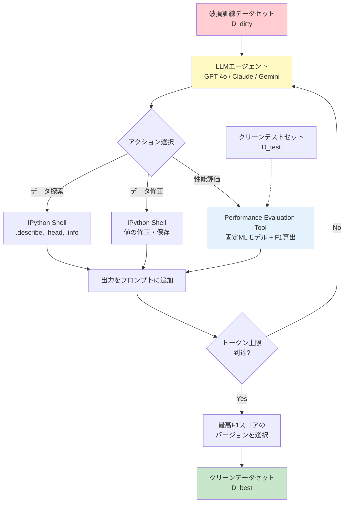
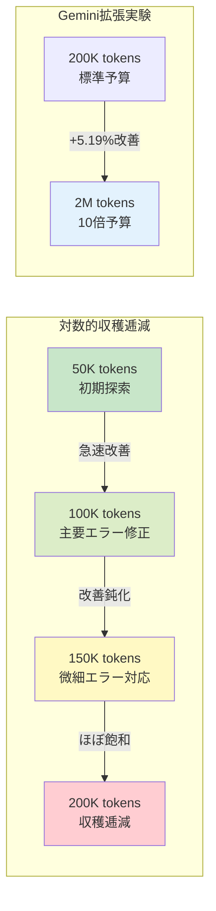
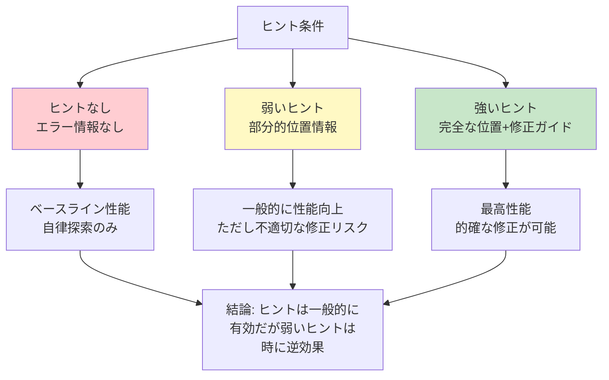

# Exploring LLM Agents for Cleaning Tabular Machine Learning Datasets

- **Link**: https://arxiv.org/abs/2503.06664
- **Authors**: Tommaso Bendinelli, Artur Dox, Christian Holz
- **Year**: 2025
- **Venue**: ICLR 2025 Workshop on Foundation Models in the Wild
- **Type**: Academic Paper

## Abstract

This paper investigates whether large language models can automate the labor-intensive process of data cleaning for machine learning datasets. The team paired an LLM with Python to identify and correct errors in training datasets without modifying the ML pipeline or performing feature engineering. Testing on corrupted Kaggle datasets revealed that LLMs can detect illogical values or outliers by leveraging contextual information from other features within the same row, as well as feedback from previous iterations. However, the models struggle to detect more complex errors that require understanding data distribution across multiple rows, such as trends and biases. The study also found a logarithmic trend in token consumption versus performance, indicating diminishing returns as computational budget increases.

## Abstract（日本語訳）

本論文は、大規模言語モデルが機械学習データセットのデータクリーニングという労働集約的プロセスを自動化できるかを調査する。LLMをPythonと組み合わせ、MLパイプラインの変更や特徴量エンジニアリングを行わずに、訓練データセット内のエラーを特定・修正する。破損されたKaggleデータセットでのテストにより、LLMは同一行内の他の特徴量からの文脈情報および過去のイテレーションからのフィードバックを活用して、非論理的な値や外れ値を検出できることが明らかになった。しかし、トレンドやバイアスなど複数行にまたがるデータ分布の理解を必要とするより複雑なエラーの検出には苦戦する。また、トークン消費量と性能の間に対数的傾向が観察され、計算予算の増加に伴い収穫逓減が生じることが示された。

## 概要

本論文は、LLMエージェントによる表形式MLデータセットのクリーニング能力を実証的に評価した研究である。理論的提案ではなく、実際のKaggleデータセットに対する体系的な実験を通じて、LLMの強みと限界を明確に特定した点が最大の貢献である。

主要な貢献：

1. **行レベル vs 分布レベルのエラー検出能力の分離**: LLMが行内の文脈的推論により非論理的な値を検出できる一方、複数行にまたがる分布的エラー（トレンド、バイアス）の検出には失敗することを実証
2. **トークン消費量と性能の対数的関係の発見**: 計算予算の増加に対して性能改善が逓減することを示し、効率的なリソース配分の指針を提供
3. **複数LLMの比較**: GPT-4o、o3-mini、Claude-3.5-sonnet、Gemini-2.0-flash-expの4モデルを同一条件で比較
4. **ヒントの影響分析**: エラー情報のヒント強度（なし・弱・強）が性能に与える影響を体系的に評価

## 問題と動機

- **データクリーニングの労力**: 実世界のMLデータセットには多様なエラー（数値シフト、欠損値、カテゴリ不整合など）が含まれ、手動でのクリーニングは時間と専門知識を要する

- **ML性能への直接的影響**: 汚れたデータで学習したモデルは性能が低下するが、どのエラーがどの程度影響するかの診断も困難

- **既存自動化手法の限界**: ルールベース手法はドメイン知識を必要とし、統計的手法は複雑なエラーパターンに対応できない

- **LLMの可能性と限界の未解明**: LLMがデータクリーニングに有効であるという直感はあるが、具体的にどのようなエラータイプに対して有効/無効かの体系的な分析が不足

## 提案手法

### エージェントアーキテクチャ

LLMを2つのツールと組み合わせた反復的エージェントループ：

1. **IPython Shell**: Pythonコードによるデータ探索・修正の実行環境
2. **Performance Evaluation Tool**: 修正データセットで固定MLモデルを学習し、クリーンなテストセットに対するF1スコアを返却

重要な制約として、前処理パイプラインとMLモデルは変更不可であり、性能改善はデータクリーニングのみに起因することを保証。

### 反復的ワークフロー

1. LLMがPythonコードを生成し、データを探索・修正
2. 修正データを `train_cleaned_v*.csv` として保存（バージョン管理）
3. Performance Evaluation Toolが修正データでモデルを学習し、F1スコアを返却
4. F1スコアをフィードバックとして次のイテレーションへ
5. 累積トークン消費量が閾値に達するまで反復
6. 全提出バージョンのうち最高F1スコアのものを最終結果として選択

### プロンプティング戦略

初期プロンプト（P_0）に含まれる要素：
- タスク指示（データクリーニングの目的と制約）
- エラーの具体例
- データセットのパス
- 利用可能ツールの説明
- 制約事項（列の追加禁止、パイプライン変更禁止など）

3段階のヒント条件：
- **ヒントなし**: エラー情報を一切提供しない
- **弱いヒント**: エラーの部分的な位置情報を提供
- **強いヒント**: エラーの完全な位置情報と修正ガイダンスを提供

## アルゴリズム / 擬似コード

```
Algorithm: LLMエージェントによるデータクリーニング
Input: 破損訓練データ D_dirty, クリーンテストデータ D_test,
       固定MLモデル M, トークン上限 T_max, プロンプト P_0
Output: クリーン訓練データ D_best

1: token_count ← 0
2: submissions ← []
3: prompt ← P_0
4: version ← 0
5:
6: while token_count < T_max do
7:     // LLMがツール選択・コード生成
8:     action, code ← LLM.generate(prompt)
9:
10:    if action == "explore" then
11:        // IPython Shellでデータ探索
12:        output ← IPython.execute(code)  // .describe(), .head(), etc.
13:    else if action == "clean" then
14:        // データ修正と保存
15:        IPython.execute(code)
16:        version += 1
17:        save_as("train_cleaned_v{version}.csv")
18:    else if action == "evaluate" then
19:        // 性能評価
20:        f1_score ← evaluate(D_cleaned, D_test, M)
21:        submissions.append((version, f1_score))
22:    end if
23:
24:    // フィードバックをプロンプトに追加
25:    prompt ← prompt + output + ToolResponse
26:    token_count += count_tokens(action, code, output)
27: end while
28:
29: D_best ← submissions.argmax(f1_score)
30: return D_best
```

## アーキテクチャ / プロセスフロー



## Figures & Tables

### Table 1: 実験データセットと破損タイプ

| データセット | 行数 | 列数 | 破損タイプ | 具体例 | 人間の改善幅 |
|------------|------|------|-----------|--------|------------|
| Titanic | 408 | 12 | 数値シフト | 年齢に+10を加算 | 6.2% |
| Titanic | 408 | 12 | NaN破損 | MAR戦略で値をNaN化 | 6.2% |
| Titanic | 408 | 12 | カテゴリシフト | 非現実的カテゴリ割当 | 6.2% |
| Meat Consumption | 9,160 | 10 | 数値シフト | 分布変化 | 2.5% |
| Hotel Bookings | 100,000 | 28 | 数値シフト | lead_timeに+10日 | 0% |

### Table 2: モデル別性能比較（改善率、6回平均）

| モデル | Titanic改善 | Meat改善 | Hotel改善 | 無効提出率 |
|-------|-----------|---------|----------|-----------|
| GPT-4o | ~3-4% | ~1.5-2.5% | <1% | 7.94% |
| o3-mini | ~3-4% | ~1.5-2.5% | <1% | 10.2% |
| Claude-3.5-sonnet | ~3-4% | ~1.5-2.5% | <1% | 8.5% |
| Gemini-2.0-flash-exp | ~3-4% | ~1.5-2.5% | <1% | 13.53% |
| **人間（1時間）** | **6.2%** | **2.5%** | **0%** | — |

### Figure 1: トークン消費量と性能の関係



### Table 3: エラータイプ別のLLM検出能力

| エラータイプ | 検出難易度 | LLMの検出能力 | 理由 | 具体例 |
|------------|-----------|-------------|------|--------|
| 非論理的な値 | 低 | **高い** | 行内文脈で判定可能 | 年齢=-5、料金=0 |
| 明らかな外れ値 | 低 | **高い** | 常識的知識で判定 | 体重=500kg |
| カテゴリ不整合 | 中 | **中程度** | ドメイン知識に依存 | 性別=3 |
| NaN（欠損値） | 中 | **中程度** | 検出は容易だが補完が困難 | — |
| 分布シフト | 高 | **低い** | 複数行の傾向把握が必要 | lead_timeに+10日（2016年のみ） |
| トレンド・バイアス | 高 | **低い** | 統計的分析能力の限界 | 特定年の系統的偏り |

### Figure 2: ヒント強度と性能の関係



## 実験と評価

### 実験設定

- **データセット**: Kaggleの3データセット（Titanic, Meat Consumption, Hotel Bookings）に対し3種類の破損を注入
- **モデル**: GPT-4o、o3-mini-2025-01-31、Claude-3.5-sonnet、Gemini-2.0-flash-exp
- **実行条件**: 各モデル×各データセット×各破損で6回実行、200Kトークン上限
- **評価指標**: クリーンテストセットに対するF1スコアの改善幅
- **人間ベースライン**: データサイエンティストが1時間で達成した改善幅

### 主要な結果

1. **行レベルエラーの検出は可能**: LLMは同一行内の特徴量間の関係性を利用して、非論理的な値や外れ値を効果的に検出。特にTitanicデータセットでは人間の約50-65%の改善を達成

2. **分布レベルエラーの検出は困難**: 全モデルが、2016年のlead_time値に10日が加算されたという単純なバイアスの検出に失敗。複数行にまたがるパターン認識が根本的な弱点

3. **データセットサイズの影響**: Hotel Bookings（100K行）のような大規模データセットでは性能が著しく低下。行数の増加に伴いエラーの相対的影響が薄まり、検出が困難に

4. **トークン消費の対数的収穫逓減**: 初期のトークン消費で大部分の改善が得られ、以降は逓減。Geminiを200K→2Mに拡張しても+5.19%の追加改善にとどまる

5. **無効提出の頻度**: 7.94%-13.53%の提出が無効であり、モデルが「有意義な分析なしにデータセットを繰り返し提出する」ブルートフォース的挙動を示す場合がある

### モデル間比較

- **GPT-4o**: 最も低い無効提出率（7.94%）で安定した性能
- **o3-mini**: GPT-4oと同等の性能だが、推論コストが異なる
- **Claude-3.5-sonnet**: 競合する性能だが、探索パターンに個性
- **Gemini-2.0-flash-exp**: 最も高い無効提出率（13.53%）だが、トークン拡張時に最大の追加改善

### LLMの探索パターンの観察

- モデルは基本的な `.describe()` と `.head()` 操作に依存し、より複雑な関係性の調査（相関分析、時系列分析など）を「稀にしか」実行しない
- GPT-4o以外のモデルはIPythonセッション状態の保持を無視する傾向
- 「有意義な分析なしにデータセットを繰り返し提出する」ブルートフォースアプローチが頻繁に観察される

## 備考

- ICLR 2025 Workshop（Foundation Models in the Wild）での発表であり、LLMの実世界適用における限界を正直に報告している点が好感できる
- 「行レベル vs 分布レベル」というエラー検出能力の切り分けは、LLMの根本的な能力境界を理解する上で重要な発見。LLMは本質的に「トークン列の局所的推論」に強く、「データセット全体の統計的特性の把握」に弱いという特性を反映
- トークン消費と性能の対数的関係は、実運用でのコスト最適化に直接的な示唆を与える。200Kトークン程度が費用対効果のスイートスポットである可能性
- 人間ベースラインとの比較（1時間制限）は興味深いが、人間のデータサイエンティストのスキルレベルや戦略の詳細が不明確
- 3データセット×3破損タイプという実験規模は、ワークショップ論文としては妥当だが、汎用的な結論を導くには限定的。より多様なドメインと破損パターンでの追加検証が望まれる
- エージェントの「ブルートフォース的挙動」の観察は、現在のLLMエージェントの成熟度に関する率直な評価として価値がある
