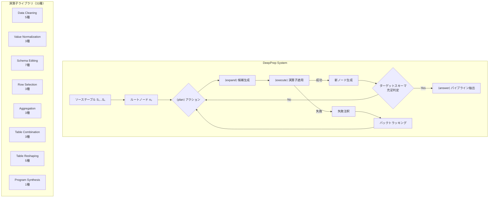
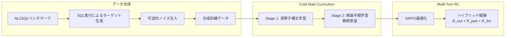
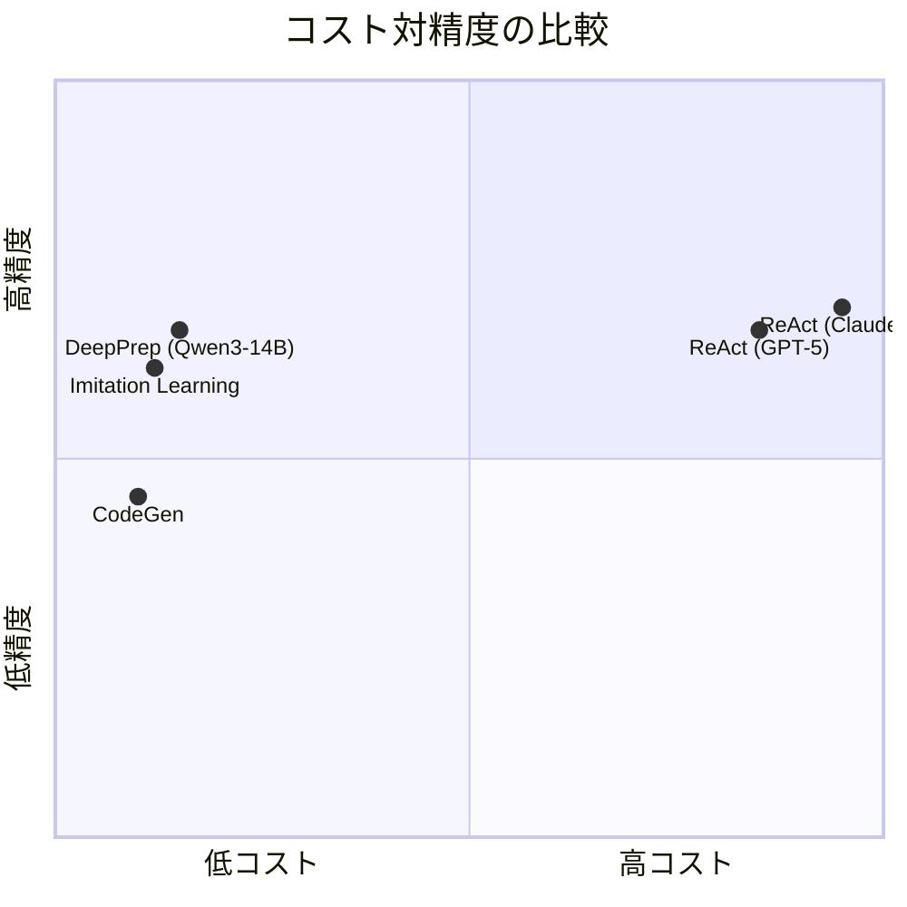
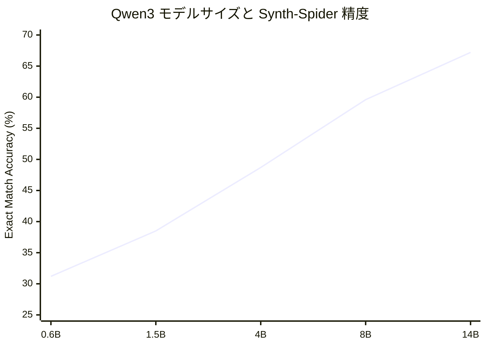

# DeepPrep: An LLM-Powered Agentic System for Autonomous Data Preparation

## 基本情報

| 項目 | 内容 |
|------|------|
| タイトル | DeepPrep: An LLM-Powered Agentic System for Autonomous Data Preparation |
| 著者 | Meihao Fan, Ju Fan, Yuxin Zhang, Shaolei Zhang, Xiaoyong Du, Jie Song, Peng Li, Fuxin Jiang, Tieying Zhang, Jianjun Chen |
| 出版年 | 2026 |
| arXiv ID | 2602.07371 |
| 分野 | Computer Science > Databases (cs.DB) |
| URL | https://arxiv.org/abs/2602.07371 |

---

## Abstract

**英語原文:**
DeepPrep addresses autonomous data preparation (ADP) — the transformation of raw, messy data into analysis-ready formats. Unlike existing approaches that rely on linear reasoning chains or rigid specifications, DeepPrep introduces tree-based agentic reasoning to enable iterative exploration with the ability to revise earlier decisions based on execution results. The system employs a progressive training framework combining cold-start curriculum learning with multi-turn reinforcement learning using hybrid rewards. A novel data synthesis method generates training data from NL2SQL benchmarks through reversible noise injection. DeepPrep achieves data preparation accuracy comparable to strong closed-source models (e.g., GPT-5) while incurring 15x lower inference cost.

**日本語要約:**
DeepPrepは、生データを分析可能な形式に自動変換する自律型データ準備（ADP）システムである。既存の線形推論や固定的な仕様に依拠するアプローチとは異なり、木構造に基づくエージェント的推論を導入し、実行結果に基づいて過去の判断を修正可能な反復的探索を実現する。コールドスタートカリキュラム学習とハイブリッド報酬を用いたマルチターン強化学習を組み合わせた段階的訓練フレームワークを採用し、NL2SQLベンチマークからの可逆的ノイズ注入による訓練データ合成手法を開発した。GPT-5等の強力なクローズドソースモデルに匹敵する精度を、推論コスト15分の1で達成している。

---

## 1. 概要（Overview）

データ準備（Data Preparation）はデータサイエンスにおける主要なボトルネックであり、エンドツーエンドの分析時間の60〜80%を占めるとされる。DeepPrepは、ソーステーブル群 S = {S₁, ..., Sₙ} を入力として受け取り、指定されたターゲットスキーマ Σ* に一致する分析用テーブル T̂ = (Σ*, D̂) を自動生成するシステムである。

従来のLLMベースのアプローチは線形的なReAct対話や直接的なコード生成に依存していたが、DeepPrepは木構造の探索空間を用いることで、上流の判断に遡ったバックトラッキングを可能にし、複雑なデータ変換パイプラインの構築における柔軟性を大幅に向上させている。

---

## 2. 問題設定（Problem）

自律型データ準備（ADP）は以下のように形式化される：

- **入力**: ソーステーブル集合 S = {S₁, ..., Sₙ}（各 Sᵢ = (Σᵢ, Dᵢ) はスキーマとタプルの組）
- **出力**: ターゲットテーブル T̂ = (Σ*, D̂)
- **目的**: T̂ がターゲットスキーマ Σ* に合致し、データ内容が正確であること

### 既存手法の課題

| 課題 | 説明 |
|------|------|
| 線形推論の限界 | ReAct等の逐次的手法は、一度犯した誤りを後工程で修正困難 |
| 仕様依存性 | テンプレートや入出力例に依存し、柔軟性が不足 |
| コスト問題 | GPT-5等のクローズドソースモデルは高精度だが推論コストが極めて高い |
| 訓練データ不足 | 長いパイプラインを含む高品質な訓練データが限定的 |

---

## 3. 提案手法（Proposed Method）

DeepPrepは3つの主要コンポーネントから構成される。

### 3.1 木構造エージェント推論（Tree-Based Agentic Reasoning）

パイプライン構築を有向木 G = (N, E) として表現する：
- **ノード（N）**: 中間テーブルを含む環境状態。ルートノード n₀ がソーステーブルを保持
- **エッジ（E）**: 演算子インスタンスによる状態遷移

4種類の構造化アクションを実装：

| アクション | 機能 |
|------------|------|
| ⟨plan⟩ | 現在状態を分析し、探索方向を決定する高レベル論理計画の生成 |
| ⟨expand⟩ | プレフィックスマッチング制約下で候補演算子パイプラインを生成 |
| ⟨execute⟩ | 環境を通じて演算子を適用。失敗時はノードに注釈を付加 |
| ⟨answer⟩ | 葉ノードがターゲットスキーマを満たす場合に終了し、根から葉へのパスを最終パイプラインとして抽出 |

### 3.2 段階的エージェント訓練フレームワーク

**ステージ1: 演算子構文学習（Operator Syntax Learning）**

基底真値パイプラインから抽出した三つ組 (P_sub, T_in, T_out) を用いた教師あり微調整：

```
L_op = -Σ log Pr_LLM(φ(P_sub) | φ(T_in), φ(T_out))
```

**ステージ2: 推論手順学習（Reasoning Procedure Learning）**

教師モデル（DeepSeek-R1等）からの軌跡蒸留。文脈内学習と摂動を用いた多様なパターンの生成。

### 3.3 マルチターン強化学習とハイブリッド報酬

Group Relative Policy Optimization（GRPO）を採用し、ハイブリッド報酬関数を用いる：

```
R(τ) = α · R_out(τ) + β · R_part(τ) + γ · R_llm(τ)
```

| 報酬成分 | 定義 | 役割 |
|----------|------|------|
| R_out | I(T̂ ≡ T*): 完全一致の二値指標 | 最終的な正確性評価 |
| R_part | avg(S_sch, S_shp, S_cnt): スキーマ・形状・内容の類似度平均 | 部分的進捗の評価 |
| R_llm | GPT-4oによる計画・行動整合性、フィードバック応答性、バックトラッキング妥当性の評価 | プロセス品質の評価 |

---

## 4. アルゴリズム・擬似コード

```
Algorithm: DeepPrep Tree-Based Agentic Inference
Input: Source tables S = {S₁, ..., Sₙ}, Target schema Σ*
Output: Data preparation pipeline P*

1: Initialize tree G = ({n₀}, ∅) where n₀.state = S
2: while not terminated do
3:   plan ← LLM.generate(⟨plan⟩, current_state)
4:   candidates ← LLM.generate(⟨expand⟩, plan, prefix_constraints)
5:   for each candidate c in candidates do
6:     result ← Environment.execute(c)
7:     if result.success then
8:       n_new ← create_node(result.tables)
9:       G.add_edge(current_node, n_new, operator=c)
10:    else
11:      annotate_failure(current_node, c, result.error)
12:    end if
13:  end for
14:  if any leaf satisfies Σ* then
15:    P* ← extract_path(root, best_leaf)
16:    return ⟨answer⟩(P*)
17:  end if
18:  current_node ← select_next(G)  // backtracking possible
19: end while
```

---

## 5. アーキテクチャ・処理フロー

### 5.1 システム全体アーキテクチャ



### 5.2 訓練パイプライン



---

## 6. 図表（Figures & Tables）

### 表1: サポートされる演算子カテゴリ

| カテゴリ | 演算子例 | 数 |
|----------|----------|-----|
| Data Cleaning | DropNA, Deduplicate, ErrorDetection | 5 |
| Value Normalization | ValueTransform, StandardizeDatetime, CastType | 3 |
| Schema Editing | RenameColumn, AddNewColumn, SplitColumn | 7 |
| Row Selection | Filter, Sort, TopK | 3 |
| Aggregation | GroupBy, Count, CalculateStatistic | 3 |
| Table Combination | Join, Union, Append | 3 |
| Table Reshaping | Pivot, Stack, WideToLong, Explode | 5 |
| Program Synthesis | ExeCode | 1 |
| **合計** | | **31** |

### 表2: データセット仕様

| データセット | 訓練 | テスト | パイプライン長 | 演算子数 |
|-------------|-------|--------|---------------|---------|
| Synth-Spider | 6,788 | 2,008 | 1–28 | 31 |
| Synth-Bird | — | 1,150 | 2–25 | 31 |
| Parrot | 13,965 | 1,365 | 1–8 | 17 |

### 表3: 主要実験結果（Qwen3-14B ベース、Exact Match Accuracy %）

| 手法 | Synth-Spider | Synth-Bird | Parrot | 完了率 |
|------|-------------|------------|--------|--------|
| CodeGen | 45.47 | — | — | 68.18 |
| Plan-and-Solve | — | — | — | — |
| ReAct (GPT-5) | 67.03 | — | — | — |
| ReAct (Claude-4) | 69.92 | — | — | — |
| Imitation Learning | 61.70 | 48.01 | 37.95 | 85.26 |
| **DeepPrep** | **67.18** | **54.09** | **40.44** | **97.21** |

### 表4: アブレーション結果（Qwen3-8B、Synth-Spider）

| 構成 | 精度 (%) | 完了率 (%) |
|------|---------|-----------|
| Full DeepPrep | 65.99 | 97.46 |
| w/o OSL（演算子構文学習なし） | 59.65 | 90.54 |
| w/o R_llm | 64.54 | 96.96 |
| w/o R_llm, R_part | 61.85 | 98.71 |

### 図1: コスト対精度トレードオフ



### 図2: モデルスケーリング効果



---

## 7. 実験・評価（Experiments & Evaluation）

### 7.1 実験設定

**評価指標:**
- **Exact Match Accuracy**: T̂ と T* の完全一致率（行・列順序不変、セル値完全一致）
- **Completion Rate**: 対話制限やランタイムエラーなく最終出力を生成した割合
- **Inference Cost**: ケースあたりの平均推論コスト（クローズドソースはAPI料金、オープンソースはA800-80G GPUの時間単価$0.91/hで算出）

**ベースライン:**
- プロンプティング手法: CodeGen, Plan-and-Solve, ReAct, MCTS-OP, MontePrep, AutoPrep, DeepAnalyze
- 訓練手法: Imitation Learning, RL-GRPO（結果報酬のみ）
- LLMバックボーン: GPT-5, Claude-4（クローズドソース）、Qwen2.5/Qwen3シリーズ（オープンソース）

### 7.2 主要結果

1. **ドメイン内精度**: DeepPrep（Qwen3-14B）は Synth-Spider で67.18%の精度を達成し、GPT-5のReAct（67.03%）やClaude-4のReAct（69.92%）に匹敵する性能を示した。
2. **ドメイン外汎化**: Synth-Bird で54.09%、Parrot で40.44%と、Imitation Learning ベースラインをそれぞれ6.08ポイント、2.49ポイント上回った。
3. **コスト効率**: GPT-5比で約15倍、Claude-4比で約57倍の推論コスト削減を達成。
4. **完了率**: 97.21%と、CodeGenの68.18%やImitation Learningの85.26%を大幅に上回る安定性を示した。

### 7.3 アブレーション分析

- 演算子構文学習（OSL）の除去は精度を6.34ポイント低下させ、完了率も90.54%に低下した。OSLが演算子の正確な使用に不可欠であることを示している。
- R_llm（プロセス報酬）の除去は精度を1.45ポイント低下させ、計画と行動の整合性評価の重要性を示した。
- R_llm と R_part の同時除去は精度を4.14ポイント低下させ、密な報酬信号が長い軌跡における学習に不可欠であることを確認した。

### 7.4 データ合成の有効性

Synth-Spider で訓練したモデルは、Parrot で訓練したモデルを Synth-Bird テストセットにおいて37.0ポイント（Qwen3-8B）および29.4ポイント（Qwen3-14B）上回った。これは Synth-Spider が中〜長パイプラインを多く含むのに対し、Parrot の分布が短いシーケンスに集中しているためと分析されている。

---

## 8. 注目点・メモ（Notes）

### 技術的貢献

1. **実行接地型木探索**: 線形ReActとは異なり、中間状態を実体化して非局所的バックトラッキングを可能にする。各ノードが実際のテーブルに対応し、スカラーロールアウト推定ではなく構造化された実行フィードバックに基づいて分岐判断が行われる。

2. **プレフィックスマッチングノード参照**: 提案された拡張と変換履歴の間のセマンティック一貫性を強制する制約により、曖昧なノード参照を防止する。

3. **可逆的汚損（Reversible Corruption）**: クリーニング演算子の逆変換を適用し、順変換の適用で元の状態が復元されることを検証するという独自の訓練データ合成手法。

4. **コールドスタート + マルチターンRL**: 報酬の疎さとデータ不足の両課題に対処する二段階初期化。

### 限界と今後の課題

- パイプライン長28を超える超長パイプラインへの対応はまだ検証されていない
- ドメイン外（Parrot）での精度は40.44%にとどまり、改善の余地がある
- プロセス報酬のGPT-4o依存はスケーラビリティに課題を残す
- テーブルの意味理解（ドメイン知識）の統合は今後の研究課題

### 統合データ準備プラットフォームとしての位置づけ

DeepPrepは「LLMを訓練してデータ準備タスクを自律的に実行する」というアプローチの先進事例であり、木構造探索とRLの組み合わせにより、低コストで高品質な結果を実現する。特にオープンソースモデル（Qwen3-14B）でクローズドソースモデルに匹敵する性能を達成した点は、実用化における重要なブレークスルーである。
