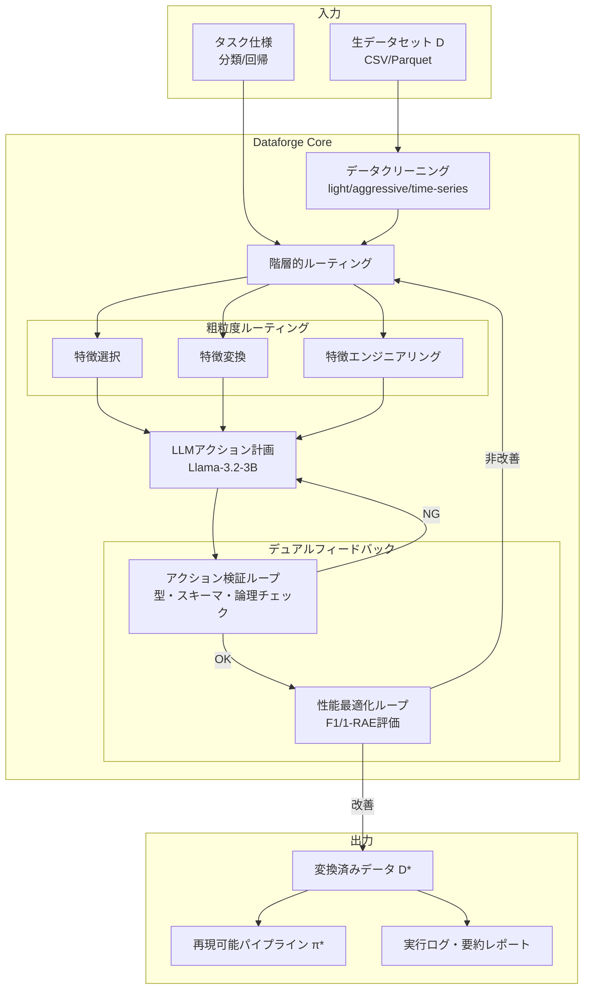
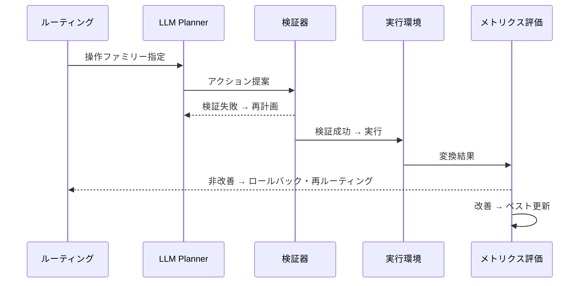
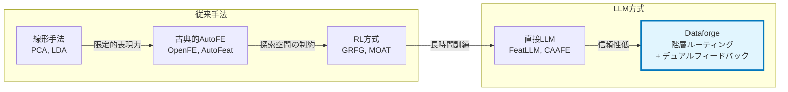

# Dataforge: Agentic Platform for Autonomous Data Engineering

## 基本情報

| 項目 | 内容 |
|------|------|
| タイトル | Dataforge: Agentic Platform for Autonomous Data Engineering |
| 著者 | Xinyuan Wang, Hongyu Cao, Kunpeng Liu, Yanjie Fu |
| 出版年 | 2025（v1: 2025-11-09, v2: 2026-02-16） |
| arXiv ID | 2511.06185 |
| 分野 | Computer Science > Artificial Intelligence (cs.AI) |
| URL | https://arxiv.org/abs/2511.06185 |

---

## Abstract

**英語原文:**
Dataforge is an LLM-powered agentic data engineering platform for tabular data that is automatic, safe, and non-expert friendly. The system performs autonomous data cleaning and iteratively refines feature operations within a budgeted feedback loop with automatic termination. The platform addresses data preparation challenges in AI applications spanning materials discovery, molecular modeling, and climate science. Dataforge achieves the best overall downstream performance across tabular benchmarks, with ablation studies demonstrating the importance of hierarchical routing, iterative refinement, and action grounding for accuracy and reliability.

**日本語要約:**
Dataforgeは、表形式データに対する自動・安全・非専門家フレンドリーなLLM駆動型エージェントデータエンジニアリングプラットフォームである。自律的なデータクリーニングと、予算制約付きフィードバックループ内での反復的な特徴量操作の改善を実行する。材料探索、分子モデリング、気候科学などのAI応用におけるデータ準備課題に対応し、表形式ベンチマーク全体で最良の下流タスク性能を達成。アブレーション研究により、階層的ルーティング、反復的改善、アクション接地の重要性が実証されている。

---

## 1. 概要（Overview）

Dataforgeは表形式データの自動特徴量エンジニアリングに焦点を当てたエージェントプラットフォームである。従来のAutoFE（自動特徴量エンジニアリング）手法が強化学習ベースの長時間訓練を必要とするか、LLMの直接利用による低い信頼性に悩まされていたのに対し、Dataforgeは階層的ルーティング、デュアルフィードバックループ、アクション接地検証の3つの機構を組み合わせることで、訓練不要かつ高信頼なデータ準備を実現する。

システムは最適化問題として定式化される：

```
max_π Perf(D', T)  subject to  Safe(π, D) = 1,  Cost(π) ≤ B
```

ここで D は入力データセット、π は変換パイプライン、T は下流タスク、B は計算予算である。

---

## 2. 問題設定（Problem）

### 表形式データ準備の課題

AI応用における表形式データの準備は、以下の理由から依然として困難な課題である：

| 課題 | 詳細 |
|------|------|
| 特徴量空間の爆発 | 二項演算の組み合わせにより、探索空間が指数的に増大 |
| ドメイン知識の要求 | 材料科学・分子モデリング等の専門知識が特徴量設計に必要 |
| 安全性の確保 | 不正な型変換やゼロ除算等のエラーを事前に防止する必要 |
| RL手法の訓練コスト | 既存のRL方式は数十分〜数時間の事前訓練を要求 |
| LLM直接利用の不安定性 | 生成されたコードの3〜5%が実行時エラーを引き起こす |

### 形式的定義

- **入力**: 生データセット D = {(xᵢ, yᵢ)}、特徴テーブル X ∈ ℝⁿˣᵈ、ターゲット列 y
- **出力**: 変換パイプライン π: D → D'（AI-readyな表現）
- **演算子**: 単項演算 O₁ = {sqrt, square, cube, reciprocal, log, sin, cos, tanh, sigmoid, standard, normalize, quantile}、二項演算 O₂ = {+, −, ×, ÷}

---

## 3. 提案手法（Proposed Method）

Dataforgeは4つの主要コンポーネントから構成される。

### 3.1 階層的ルーティング（Hierarchical Routing）

**粗粒度（タスクレベル）ルーティング**: ルールベースで3つの操作ファミリーから選択
- 特徴選択（冗長性削減）
- 特徴変換（数値条件付け）
- 特徴エンジニアリング（新特徴量構築）

**細粒度（アクションレベル）計画**: LLMによるファミリー内の具体的操作選択。軽量なデータセットプロファイル（次元数、型構成、欠損率、カーディナリティ、統計量）を用いる。

### 3.2 デュアルフィードバックループ

**アクション検証ループ（Action Validation Loop）:**
- スキーマ互換性チェック（列存在、出力妥当性）
- 型整合性検証（演算子とオペランドの互換性）
- 論理的実現可能性チェック（ゼロ除算、不正な対数の防止）
- 却下されたアクションは再計画をトリガー

**性能最適化ループ（Performance Optimization Loop）:**
- 下流メトリクス評価（分類: F1、回帰: 1-RAE）
- 最良パイプライン状態の維持
- 非改善時のロールバックと再計画
- 予算・自動停止基準: 最大アクション数、最小改善閾値、時間制限

### 3.3 アクション接地検証（Action Grounding）

LLMが提案する各アクションに対して、実行前に以下の検証を実施：
- 参照する列がデータセットに存在するか
- 演算子の入出力型が整合するか
- 数学的に有効な操作であるか（例: 負の値に対するlog）

### 3.4 データクリーニングパイプライン

3つのプリセットモード（light, aggressive, time-series）を提供し、スキーマ/型正規化と欠損値処理を自動実行する。

---

## 4. アルゴリズム・擬似コード

```
Algorithm: Dataforge Main Loop
Input:  Dataset D, Budget B
Output: Best transformed data D*, Pipeline π*

1:  D* ← Clean(D)           // プリセットモードで初期クリーニング
2:  π* ← [];  u* ← -∞
3:  for t = 1 to MaxActions do
4:    if Stop(B): break      // 予算・自動停止判定
5:    c ← CoarseRoute(D*)    // {Select, Transform, Engineer}
6:    a ← PlanAction(c, D*)  // LLMによる具体的アクション生成
7:    if ¬Ground(a, D*):     // 接地検証
8:      continue              // 不正ならスキップ・再計画
9:    D' ← Execute(a, D*)    // アクション実行
10:   u ← Evaluate(D')       // 下流メトリクス評価
11:   if u > u* + MinImprove(B):
12:     D* ← D'; π*.append(a); u* ← u  // 改善あれば更新
13:   else:
14:     Rollback(D')          // 非改善ならロールバック
15: end for
16: return (D*, π*)
```

---

## 5. アーキテクチャ・処理フロー

### 5.1 システム全体アーキテクチャ



### 5.2 フィードバックループの詳細フロー



---

## 6. 図表（Figures & Tables）

### 表1: 評価データセット一覧

| データセット | サンプル数 | 特徴量数 | タスク種別 |
|-------------|-----------|---------|-----------|
| German Credit | 1,000 | 24 | 分類 |
| Amazon Employee | 32,769 | 9 | 分類 |
| Ionosphere | 351 | 34 | 分類 |
| PimaIndian | 768 | 8 | 分類 |
| Messidor Feature | 1,151 | 19 | 分類 |
| SVMGuide3 | 1,243 | 21 | 分類 |
| OpenML 586 | 1,000 | 25 | 回帰 |
| OpenML 618 | 1,000 | 50 | 回帰 |
| Airfoil | 1,503 | 5 | 回帰 |

### 表2: 主要結果（分類タスク、Macro-F1 %）

| 手法 | German | Amazon | Ionosphere | Pima | Messidor | SVMGuide3 |
|------|--------|--------|------------|------|----------|-----------|
| Original | — | — | — | — | — | — |
| OpenFE | — | — | — | — | — | 83.05 |
| FeatLLM | 76.35 | 93.62 | — | 89.66 | — | — |
| ELLM-FT | — | — | 96.01 | 89.66 | — | — |
| Pure LLM | 75.43 | 75.43 | — | — | 75.61 | — |
| **Dataforge** | **79.60** | **94.41** | **97.14** | **90.14** | **76.98** | **84.64** |

### 表3: 主要結果（回帰タスク、1-RAE）

| 手法 | OpenML 586 | OpenML 618 | Airfoil |
|------|-----------|-----------|---------|
| FeatLLM | 0.6477 | 0.4734 | 0.6174 |
| ELLM-FT | — | 0.4734 | 0.6174 |
| Pure LLM | 0.7811 | 0.6653 | 0.6329 |
| **Dataforge** | **0.7849** | **0.7219** | **0.7492** |

### 表4: アブレーション結果

| 構成 | German F1 | 有効率 | Amazon F1 | 有効率 | OpenML618 1-RAE | 有効率 |
|------|----------|--------|----------|--------|----------------|--------|
| Full Dataforge | 79.60% | 98.51% | 94.41% | 99.90% | 0.7219 | 98.84% |
| w/o Routing | 76.86% | 97.01% | 93.96% | 98.33% | 0.7169 | 90.41% |
| w/o Grounding | 77.49% | 91.60% | 94.36% | 84.10% | 0.7031 | 75.76% |
| w/o Perf Loop | 76.27% | 96.30% | 93.95% | 97.00% | 0.6653 | 98.25% |

### 表5: 効率比較（RL手法との対比）

| メトリクス | GRFG | MOAT | Dataforge |
|-----------|------|------|-----------|
| 訓練時間 (秒) | 1493.7 | 649.4 | **0** |
| 推論時間 (秒) | 0.5 | 2.14 | 3.89 |
| 評価器呼出回数 | 13 | 22 | **2** |
| 性能 | 0.5768 | 0.6251 | **0.7832** |

### 図1: 手法カテゴリ比較



---

## 7. 実験・評価（Experiments & Evaluation）

### 7.1 実験設定

- **LLMバックボーン**: Llama-3.2-3B（temperature=0.7, top_p=0.9, max_new_tokens=500）
- **評価プロトコル**: 5分割交差検証、手法間で統一ハイパーパラメータ
- **分類メトリクス**: Macro-F1スコア（%）
- **回帰メトリクス**: 1-RAE = 1 − ||y_pred − y_real||₁ / ||y_real − ȳ_real||₁

**ベースライン（14カテゴリ）:**
- No/Linear: Original, RDG, PCA, LDA
- Classical AutoFE: ERG, AFAT, AutoFeat, NFS, TTG, OpenFE
- RL-based: GRFG, MOAT
- LLM-based: FeatLLM, CAAFE, ELLM-FT, Pure LLM (Llama 3.1)

### 7.2 主要結果分析

1. **全9データセットで最良性能**: Dataforgeはすべてのベンチマークで最高スコアを達成した。特に回帰タスクでの改善幅が大きく、OpenML 618では次善のPure LLMを0.0566ポイント上回った。

2. **訓練不要の優位性**: RL方式のGRFG（訓練1494秒）やMOAT（訓練649秒）に対し、Dataforgeは訓練時間ゼロでありながら性能を大幅に上回った（0.7832 vs. 0.5768/0.6251）。

3. **信頼性の向上**: 平均リトライ回数は約2回で、Pure LLMベースラインの3〜5%の失敗率に対して安定した実行を実現。

### 7.3 アブレーション分析

- **ルーティング除去**: 全データセットで精度低下。特にGerman Creditで2.74ポイント、OpenML 618で有効率が90.41%に低下。適切な操作ファミリーの選択が効率的探索に不可欠。
- **接地検証除去**: 有効率が最も大きく低下（Amazon: 99.90%→84.10%、OpenML618: 98.84%→75.76%）。実行前検証がシステム信頼性の鍵。
- **性能ループ除去**: 最大の精度低下（German: 3.33ポイント、OpenML618: 0.0566ポイント）。反復改善がなければ初回結果で停止するため、最適化機会を逸失。

### 7.4 ケーススタディ

**心疾患検出（SPECTF Heart）:**
- 初期: 44特徴量、F1 = 0.772
- Dataforge適用後: 20特徴量、F1 = 0.840
- 実行時間: 約100秒

---

## 8. 注目点・メモ（Notes）

### 技術的貢献

1. **階層的ルーティングの有効性**: 粗粒度のルールベースルーティングとLLMベースの細粒度計画の組み合わせにより、LLMの探索空間を効果的に制約しつつ柔軟性を維持する設計が特徴的。

2. **デュアルフィードバックの設計**: アクション検証（事前）と性能最適化（事後）の2層フィードバックは、信頼性と性能を同時に改善する実用的なアプローチである。

3. **ゼロトレーニングの実現**: Llama-3.2-3Bという比較的小規模なモデルで、訓練なしにRL手法を大幅に上回る性能を達成している点は、実運用への展開可能性を示す。

### 他手法との差別化

| 観点 | RL方式（GRFG, MOAT） | LLM直接利用 | Dataforge |
|------|---------------------|-------------|-----------|
| 訓練要否 | 長時間訓練必要 | 不要 | 不要 |
| 探索戦略 | 方策ベース | なし（1ショット） | 階層ルーティング |
| 安全性 | 限定的 | なし | 接地検証 |
| 反復改善 | RL報酬経由 | なし | 性能ループ |
| 信頼性 | 中 | 低 | 高 |

### 限界と今後の課題

- 評価データセットが比較的小規模（最大32,769サンプル）であり、大規模データへのスケーラビリティは未検証
- Llama-3.2-3Bに特化した評価であり、他のLLMバックボーンでの性能は不明
- 非表形式データ（テキスト、画像、時系列の混合）への拡張が今後の課題
- 自動停止基準の最適な設定に関するガイダンスが限定的

### 統合データ準備プラットフォームとしての位置づけ

Dataforgeは「非専門家でも使える自動データエンジニアリング」を目指すプラットフォームとして、実用的な設計選択を重視している。訓練不要で即座に利用可能、予算制約に基づく自動停止、3種のクリーニングプリセットなど、研究プロトタイプではなく実運用を意識した設計が特徴的である。
