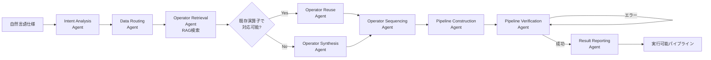
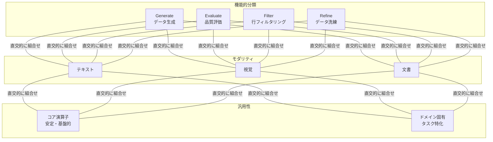

# DataFlow: An LLM-Driven Framework for Unified Data Preparation and Workflow Automation

## 基本情報

| 項目 | 内容 |
|------|------|
| タイトル | DataFlow: An LLM-Driven Framework for Unified Data Preparation and Workflow Automation in the Era of Data-Centric AI |
| 著者 | Hao Liang, Xiaochen Ma, Zhou Liu 他（35名以上の大規模チーム） |
| 出版年 | 2025 |
| arXiv ID | 2512.16676 |
| 分野 | Machine Learning (cs.LG); Computation and Language (cs.CL) |
| URL | https://arxiv.org/abs/2512.16676 |

---

## Abstract

**英語原文:**
DataFlow is a framework addressing scalable data preparation for LLMs, featuring nearly 200 reusable operators and six domain-general pipelines covering text, math, code, and other domains. The framework includes an agent component (DataFlow-Agent) that automatically translates natural-language specifications into executable pipelines through a multi-agent orchestration architecture. Results demonstrate performance gains across multiple benchmarks, including improvements up to +3% execution accuracy in Text-to-SQL and +7% average improvement in code benchmarks, with a 10K-sample unified dataset approaching the performance of models trained on 1M samples.

**日本語要約:**
DataFlowは、LLM向けのスケーラブルなデータ準備に対応するフレームワークであり、約200の再利用可能な演算子と、テキスト・数学・コード等を網羅する6つのドメイン汎用パイプラインを提供する。マルチエージェントオーケストレーションによるDataFlow-Agentが自然言語仕様を実行可能パイプラインに自動変換する。Text-to-SQLで+3%、コードベンチマークで+7%の精度向上を達成し、わずか1万サンプルの統合データセットで100万サンプル訓練モデルに匹敵する性能を示した。

---

## 1. 概要（Overview）

DataFlowは、Data-Centric AIの時代における統合的なデータ準備とワークフロー自動化のフレームワークである。既存のデータ準備ツール（Data-Juicer, NeMo Curator等）がフィルタリング・クリーニングを中心とした設計であるのに対し、DataFlowは「モデルインザループ」の生成・意味的洗練を第一級の操作として扱い、LLMの訓練データ準備に特化した包括的なフレームワークを提供する。

主要な特徴は以下の3点である：
1. **約200の再利用可能な演算子**: テキスト、数学推論、コード、Text-to-SQL、AgenticRAG、知識抽出の6ドメインをカバー
2. **PyTorchライクな統一プログラミングインターフェース**: `__init__()` と `forward()` による直感的なパイプライン構築
3. **DataFlow-Agent**: 9つの専門エージェントによる自然言語からのパイプライン自動構築

---

## 2. 問題設定（Problem）

### LLM訓練データ準備の課題

| 課題 | 詳細 |
|------|------|
| データ品質のボトルネック | LLMの性能はデータ品質に直結するが、高品質データの準備は専門知識を要する |
| ドメイン固有の要件 | テキスト、数学、コード等で必要な操作が大きく異なる |
| スケーラビリティ | 数十億規模のデータに対するパイプラインの効率的実行が必要 |
| 再現性と共有 | カスタムスクリプトベースのアプローチは再現・共有が困難 |
| 自動化の不足 | 既存ツールは手動設定に大きく依存し、自然言語による指定ができない |

### 既存ツールとの比較

| 特性 | Data-Juicer | NeMo Curator | DataFlow |
|------|-------------|-------------|----------|
| 主要焦点 | フィルタリング/クリーニング | 大規模キュレーション | LLM駆動の生成+洗練 |
| プログラミング | 設定ベースレシピ | コンポーネントパイプライン | PyTorchライク演算子 |
| LLM統合 | 部分的 | 最小限 | サービング+テンプレート統合 |
| 自動化 | 推薦エージェント | なし | パイプライン構築/デバッグエージェント |
| 拡張性 | OperatorZoo | カスタムスクリプト | 拡張パッケージ+CLI |

---

## 3. 提案手法（Proposed Method）

### 3.1 ストレージ抽象化レイヤー

統一的な表形式ストレージシステムを実装し、`read()` と `write(data)` の2操作で全演算子が共有表現にアクセスする。デフォルト実装はPandasベースで、JSON, JSONL, CSV, Parquet形式をサポートする。

### 3.2 階層的プログラミングインターフェース

4つの抽象化レイヤーを提供：

1. **LLM Serving API**: `generate_from_input(user_inputs, system_prompt, json_schema)` による統一メソッド。vLLM, SGLang（ローカル）およびChatGPT, Gemini（オンライン）をマルチスレッドで対応。
2. **Operator Interface**: `__init__()` と `run()` の二相設計。キーベースのread/writeバインディングによる柔軟なI/O構成。
3. **Prompt Templates**: `build_prompt()` メソッドによるパラメータ化されたスロットベース構築。`ALLOWED_PROMPTS` インターフェースでクロスドメイン再利用を実現。
4. **Pipeline Composition**: PyTorchスタイルの `__init__()` と `forward()` メソッド。`compile()` による静的DAG分析、依存関係検証、遅延実行計画。

### 3.3 演算子分類体系

3つの直交次元で整理：

- **モダリティ**: テキスト、視覚、文書的入力
- **コア vs. ドメイン固有**: 安定した基盤演算子 vs. タスク特化変種
- **機能的分類**:
  - **Generate**: `*Generator`（フィールド追加）、`*RowGenerator`（行追加）
  - **Evaluate**: `SampleEvaluator`、`DatasetEvaluator`
  - **Filter**: コンテンツ非変更の行削減
  - **Refine**: `*Refiner` によるフィールドのインプレース修正

### 3.4 DataFlow-Agent（マルチエージェントオーケストレーション）

LangGraphベースのステートフルワークフローによる9つの専門エージェント：

| エージェント | 役割 |
|-------------|------|
| Intent Analysis | ユーザークエリをサブインテントに分解 |
| Data Routing | タスク分類または合成プレースホルダー生成 |
| Operator Retrieval | RAGベースの候補演算子検索 |
| Operator Sequencing | I/O互換性評価 |
| Operator Synthesis | 欠如関数の生成と自動デバッグ |
| Operator Reuse | 品質評価と再利用テンプレート作成 |
| Pipeline Construction | DAG構造の組み立て |
| Pipeline Verification | サンドボックス実行とエラー修正 |
| Result Reporting | 包括的レポート生成 |

---

## 4. アルゴリズム・擬似コード

```
Algorithm: DataFlow-Agent Pipeline Construction
Input:  Natural language specification NL, Operator library OL
Output: Executable pipeline P

Phase 1: Intent Decomposition
1:  intents ← IntentAnalysisAgent.decompose(NL)
2:  for each intent i in intents do
3:    data_source ← DataRoutingAgent.route(i)

Phase 2: Operator Synthesis (Retrieve-Reuse-Synthesize)
4:    candidates ← OperatorRetrievalAgent.search(i, OL)  // RAG
5:    if reusable(candidates) then
6:      ops ← OperatorReuseAgent.adapt(candidates, i)
7:    else
8:      ops ← OperatorSynthesisAgent.generate(i)          // LLM生成
9:      ops ← debug_and_validate(ops)                      // 自動デバッグ
10:   end if
11:   sequence ← OperatorSequencingAgent.order(ops)        // I/O整合

Phase 3: Pipeline Assembly & Verification
12:   P ← PipelineConstructionAgent.assemble(sequence)     // DAG構築
13:   P.compile()                                           // 静的検証
14:   result ← PipelineVerificationAgent.execute(P)        // サンドボックス
15:   if result.has_errors then
16:     P ← PipelineVerificationAgent.fix(P, result.errors)
17:     goto 13
18:   end if
19: end for
20: report ← ResultReportingAgent.generate(P, result)
21: return P
```

---

## 5. アーキテクチャ・処理フロー

### 5.1 フレームワーク全体構成

```mermaid
graph TB
    subgraph "DataFlow Framework"
        subgraph "Storage Layer"
            S1[Unified Tabular Storage<br/>JSON/JSONL/CSV/Parquet]
        end
        
        subgraph "Programming Interfaces"
            P1[LLM Serving API<br/>vLLM/SGLang/ChatGPT/Gemini]
            P2[Operator Interface<br/>init() + run()]
            P3[Prompt Templates<br/>build_prompt()]
            P4[Pipeline Composition<br/>init() + forward() + compile()]
        end
        
        subgraph "Operator Library (~200)"
            O1[Generate<br/>*Generator, *RowGenerator]
            O2[Evaluate<br/>SampleEvaluator, DatasetEvaluator]
            O3[Filter<br/>行削減演算子]
            O4[Refine<br/>*Refiner]
        end
        
        subgraph "Domain Pipelines (6)"
            D1[Text]
            D2[Math]
            D3[Code]
            D4[Text-to-SQL]
            D5[AgenticRAG]
            D6[Knowledge Extraction]
        end
    end
    
    S1 --> P2
    P1 --> P2
    P3 --> P2
    P2 --> O1 & O2 & O3 & O4
    O1 & O2 & O3 & O4 --> P4
    P4 --> D1 & D2 & D3 & D4 & D5 & D6
```

### 5.2 DataFlow-Agent 処理フロー



---

## 6. 図表（Figures & Tables）

### 表1: ドメインパイプラインと主要演算子

| ドメイン | パイプライン | 主要演算子例 |
|----------|------------|------------|
| テキスト | 事前学習フィルタリング、SFTフィルタリング、会話合成 | LanguageIdentifier, ToxicityFilter, Deduplicator |
| 数学推論 | 数学データ生成・品質向上 | MathProblemGenerator, ChainOfThoughtGenerator |
| コード | コードデータ準備 | CodeGenerator, CodeQualityFilter |
| Text-to-SQL | SQL生成・拡張・フィルタリング | SQLGenerator, SQLAugmentor, SQLExecutionFilter |
| AgenticRAG | 検索拡張生成データ | QuestionGenerator, RetrievalEvaluator |
| 知識抽出 | PDF/Webからの構造化抽出 | PDFExtractor, SchemaInferrer |

### 表2: Text-to-SQL演算子の詳細（9種）

| 演算子 | 機能 | 詳細 |
|--------|------|------|
| SQL Generator | SQL生成 | 4つの複雑度レベル（simple/moderate/complex/highly complex） |
| SQL Augmentor | SQL拡張 | 6つの拡張戦略（値変換、構造変更、ビジネスロジック変更等） |
| Text2SQL Consistency Filter | 整合性検証 | LLMベースのアライメント確認 |
| SQL Execution Filter | 実行検証 | 実行可能性とランタイム閾値の検証 |
| Question Generator | 質問生成 | 4つの文体次元（形式性、構文構造、情報密度、対話モード） |
| CoT Generator | 推論過程生成 | 多段階推論トレースの生成と検証 |
| Prompt Generator | プロンプト構成 | 質問・スキーマ・タスク指示の統合 |
| SQL Component Classifier | 構文的難易度分類 | Spider基準の4段階分類 |
| SQL Execution Classifier | 実行的難易度分類 | k回試行成功率に基づくモデル依存分類 |

### 表3: ベンチマーク結果一覧

| ドメイン | ベンチマーク | DataFlow改善幅 | 備考 |
|----------|------------|---------------|------|
| テキスト | 事前学習（30B規模） | 言語ID・毒性フィルタ・重複排除で改善 | — |
| テキスト | SFT（5K規模） | 品質ベース選択で改善 | — |
| 数学推論 | MATH, GSM8K, AIME | +1〜3ポイント | OpenR1, 2025Synthetic1比 |
| コード | CodeAlpaca, SelfCodeAlign | +7%平均改善 | — |
| Text-to-SQL | SynSQL（2.5M） | **+3%実行精度** | <0.1Mサンプルで達成 |
| AgenticRAG | HotpotQA, Musique, 2Wiki | 改善確認 | — |

### 表4: 統合データセットの効果（DataFlow-Instruct-10K）

| 訓練データ | Qwen2-base | Qwen2.5-base | 備考 |
|-----------|-----------|-------------|------|
| Infinity-Instruct (1M) | ベースライン | ベースライン | 100万サンプル |
| **DataFlow-Instruct (10K)** | **同等以上** | **同等以上** | **1万サンプル** |
| Qwen-Instruct | 上限参考 | 上限参考 | 公式チューニング |

### 図1: 演算子機能分類の概念図



---

## 7. 実験・評価（Experiments & Evaluation）

### 7.1 評価対象の6つのユースケース

#### 7.1.1 テキストデータ準備
- **事前学習データフィルタリング**（30B規模）: 言語識別、毒性フィルタリング、重複排除を評価
- **SFTデータフィルタリング**（5K規模）: 品質ベース選択
- **会話ドメイン合成**（15K規模）: マルチターン対話生成

#### 7.1.2 数学推論データ
- MATH, GSM8K, AIMEベンチマークで評価
- 合成ベースライン（OpenR1, 2025Synthetic1）に対して1〜3ポイントの改善

#### 7.1.3 コードデータ準備
- CodeAlpaca, SelfCodeAlignとの比較で+7%の平均改善

#### 7.1.4 Text-to-SQLデータ準備
- SynSQL（250万サンプル）をベースラインとし、10万サンプル未満で+3%の実行精度向上
- 9種の専門演算子による体系的なデータ生成・拡張・フィルタリング

#### 7.1.5 AgenticRAGデータ準備
- HotpotQA, Musique, 2Wikiの3ベンチマークで評価

#### 7.1.6 知識抽出
- PDFおよびWebページからのスキーマ推論付き構造化抽出

### 7.2 統合マルチドメイン評価

DataFlow-Instruct-10K（テキスト・数学・コードの統合1万サンプル）を用いた評価で、Qwen2-baseおよびQwen2.5-baseの訓練において、100万サンプルのInfinity-Instructを上回る性能を達成。対応するQwen-Instructの性能に迫る結果を示した。

これは、DataFlowの演算子による体系的なデータ生成・品質評価・洗練プロセスが、大量のデータを少量の高品質データで代替できることを実証している。

### 7.3 DataFlow-Agentの評価

エージェントによる自動パイプライン構築の有効性を示すため、自然言語からの指定によるパイプライン生成を複数のドメインで検証。Retrieve-Reuse-Synthesize戦略により、既存演算子の再利用率を最大化しつつ、不足する機能を自動合成する能力を確認。

---

## 8. 注目点・メモ（Notes）

### 技術的貢献

1. **約200演算子のエコシステム**: 単なるツール集ではなく、3次元の分類体系（モダリティ・汎用性・機能）に基づく体系的な設計。`ALLOWED_PROMPTS`インターフェースによるクロスドメイン再利用が特に有用。

2. **PyTorchライクAPI設計**: `__init__()` + `forward()` + `compile()` のパターンは、既存のMLエンジニアにとって馴染みやすく、学習コストを低減する設計判断。

3. **遅延構築（Deferred Construction）設計**: Factory Methodパターンによるオブジェクト生成と実行の分離により、ランタイム前の構造検証を実現。

4. **10K vs. 1Mの結果**: わずか1万サンプルで100万サンプルに匹敵する性能は、データ品質がデータ量を代替できるという Data-Centric AI の核心的主張を実証している。

### 9エージェント協調の設計思想

DataFlow-Agentの9エージェント構成は、ソフトウェア工学における関心の分離（Separation of Concerns）原則に基づいている。各エージェントが明確に定義された責務を持ち、LangGraphによるステートフルワークフローで協調する。特に Operator Synthesis Agent による欠如演算子の自動生成と自動デバッグは、システムの拡張性を大幅に高めている。

### 限界と今後の課題

- 大規模チーム（35名以上）による開発であり、個別コンポーネントの再現が容易でない可能性
- 演算子の品質保証（テスト、バグ検出）に関する記述が限定的
- エージェント間の失敗伝播やエラーリカバリの詳細が不明
- 計算コスト（LLM呼び出し回数、レイテンシ）に関する定量的分析が限定的

### 統合データ準備プラットフォームとしての位置づけ

DataFlowは、本調査対象の論文群の中で最も包括的な「プラットフォーム」としての設計を有する。約200の演算子、6つのドメインパイプライン、9エージェントの自動構築機構は、単一のデータ準備タスクではなく、LLM訓練データ準備のエンドツーエンドワークフロー全体をカバーする野心的な取り組みである。特に Text-to-SQL における +3%の改善を 0.1M未満のサンプルで達成した点は、実践的なインパクトが大きい。
