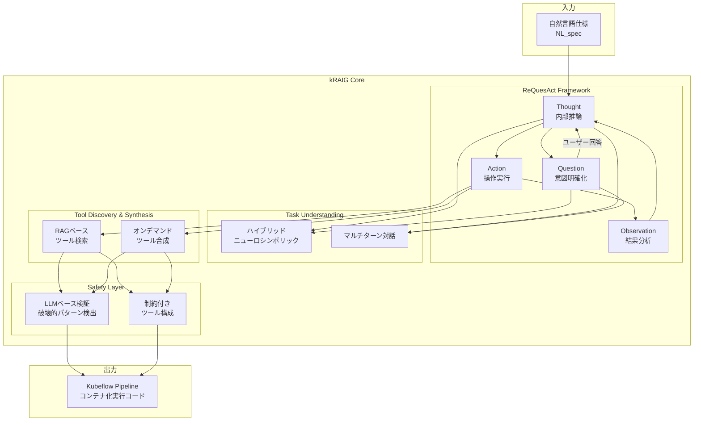
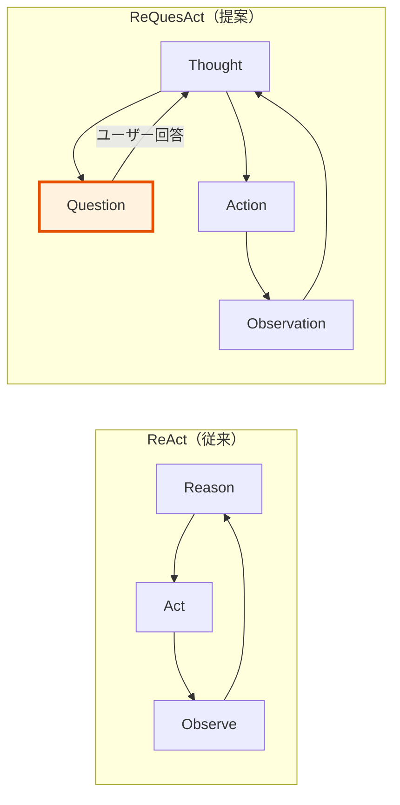
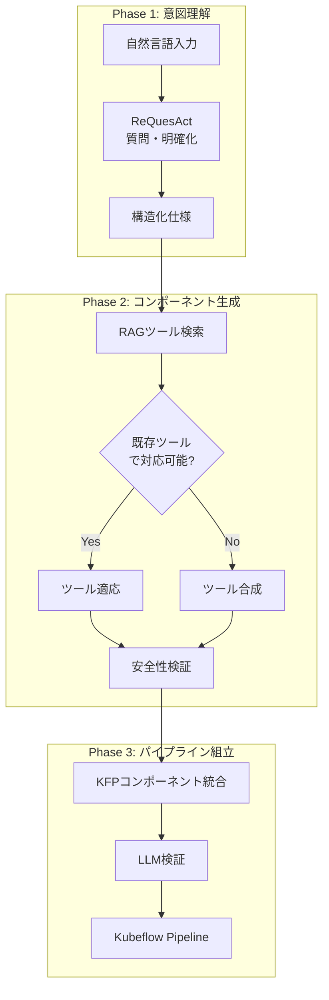

# kRAIG: A Natural Language-Driven Agent for Automated DataOps Pipeline Generation

## 基本情報

| 項目 | 内容 |
|------|------|
| タイトル | kRAIG: A Natural Language-Driven Agent for Automated DataOps Pipeline Generation |
| 著者 | Rohan Siva, Kai Cheung, Lichi Li, Ganesh Sundaram |
| 出版年 | 2026 |
| arXiv ID | 2603.20311 |
| 分野 | Software Engineering (cs.SE); AI (cs.AI); CL (cs.CL) |
| URL | https://arxiv.org/abs/2603.20311 |
| ページ数 | 9ページ、7図 |

---

## Abstract

**英語原文:**
kRAIG is a natural language-driven AI agent that converts specifications into executable Kubeflow Pipelines for data engineering workflows. The system introduces ReQuesAct, a framework that clarifies user intent before pipeline synthesis, departing from traditional ReAct patterns. It features retrieval-augmented tool generation and LLM-based validation mechanisms for safety. Evaluations demonstrate a 3x improvement in extraction and loading success and a 25 percent increase in transformation accuracy relative to existing agentic baselines on the ELT-Bench benchmark.

**日本語要約:**
kRAIGは、自然言語仕様を実行可能なKubeflow Pipelinesに変換する自然言語駆動型AIエージェントである。従来のReActパターンから脱却し、パイプライン合成前にユーザー意図を明確化するReQuesActフレームワークを導入する。検索拡張型ツール生成とLLMベース検証メカニズムを備え、ELT-Benchベンチマークにおいて既存エージェントベースラインに対し、抽出・ロード成功率で3倍、変換精度で25%の改善を達成した。

---

## 1. 概要（Overview）

kRAIGは、データエンジニアリングにおけるExtract-Transform-Load（ELT）パイプラインの自動生成を目的としたエージェントシステムである。自然言語による仕様記述からKubeflow Pipelines（KFP）の実行可能コードを生成する。

従来のLLMエージェント（SWE-Agent, Spider-Agent等）がデータエンジニアリングに特化していない汎用的なアプローチを採用するのに対し、kRAIGは以下の3つの差別化要素を持つ：

1. **ReQuesAct**: 行動前にユーザー意図を明確化する質問フェーズの導入
2. **検索拡張型ツール生成**: RAGによる既存ツール検索と不足時のオンデマンド合成
3. **デュアルセーフティレイヤー**: LLMベースの破壊的パターン検出と制約付きツール構成

---

## 2. 問題設定（Problem）

### DataOpsパイプライン自動生成の課題

| 課題 | 詳細 |
|------|------|
| 仕様の不完全性 | ユーザーの自然言語指定は曖昧性を含み、重要な詳細が欠落しがち |
| 異種データソース | 多様なデータベース、API、ファイル形式の統合が必要 |
| 変換の複雑性 | スキーマ変換、型変換、ビジネスロジックの適用が複合的 |
| 安全性要件 | 本番環境でのDROP TABLE等の破壊的操作の防止が必須 |
| 既存エージェントの不安定性 | ReAct方式は「under-specified or execution-heavy tasks」で不安定な動作を示す |

### ELTパイプラインの形式的定義

- **Extract**: 異種データソースからのデータ取得
- **Load**: ターゲットシステムへのデータ投入
- **Transform**: スキーマ変換、型変換、集約、フィルタリング等のデータ変換
- **出力形式**: Kubeflow Pipelines（KFP）のコンテナ化・分散実行可能コード

---

## 3. 提案手法（Proposed Method）

### 3.1 ReQuesActフレームワーク

従来のReAct（Reason + Act）に質問（Question）フェーズを明示的に追加：

| ステップ | 説明 |
|----------|------|
| **Thought** | 内部推論: タスク分析と計画立案 |
| **Question** | 意図明確化: ユーザーへの確認質問 |
| **Action** | 具体的操作の実行 |
| **Observation** | 結果の分析と次ステップの判断 |
| **Repeat** | タスク完了まで繰り返し |

ReQuesActの核心は、「不完全な仕様に基づいて即座に行動を開始する」のではなく、「まず必要な情報を収集してから行動する」という意図明確化ファーストのアプローチにある。マルチターン対話により、事前定義テンプレートの提出を要求せず、漸進的に要件を具体化する。

### 3.2 タスク理解モジュール

ハイブリッドニューロシンボリックアプローチを採用し、マルチターン対話による漸進的な意図理解を実現する。以下の情報を段階的に収集：
- データソースの種類と接続情報
- 変換ロジックの詳細
- 出力先と期待されるスキーマ
- エラー処理とリトライポリシー

### 3.3 ツール発見・合成モジュール

2つのメカニズムを組み合わせる：

**検索拡張生成（RAG）**: 既存のツール仕様ライブラリからの関連ツール検索
**オンデマンド合成**: 既存ツールで対応できない場合のタスク固有ツールの自動生成

### 3.4 セーフティレイヤー

デュアルセーフガードを実装：

1. **LLMベース検証**: 破壊的パターン（DROP TABLE、バルク削除等）の検出
2. **制約付きツール構成**: キュレーション済み・検証済みの操作に制限するエージェント制約

---

## 4. アルゴリズム・擬似コード

```
Algorithm: kRAIG ReQuesAct Pipeline Generation
Input:  Natural language specification NL_spec
Output: Kubeflow Pipeline KFP

Phase 1: Intent Clarification (ReQuesAct)
1:  context ← initial_parse(NL_spec)
2:  while not sufficient_clarity(context) do
3:    question ← generate_clarifying_question(context)
4:    answer ← ask_user(question)
5:    context ← update_context(context, answer)
6:  end while

Phase 2: Component Generation
7:  components ← []
8:  for each task t in decompose(context) do
9:    tools ← RAG_search(t, tool_library)
10:   if suitable_tool_found(tools) then
11:     component ← adapt_tool(tools[0], t)
12:   else
13:     component ← synthesize_tool(t)          // LLM生成
14:   end if
15:   // Safety validation
16:   if not safety_check(component) then
17:     component ← constrain_and_regenerate(component)
18:   end if
19:   components.append(component)
20: end for

Phase 3: Pipeline Assembly
21: pipeline ← construct_kfp(components)
22: validated ← llm_validate(pipeline)
23: if not validated then
24:   pipeline ← fix_and_revalidate(pipeline)
25: end if
26: return pipeline
```

---

## 5. アーキテクチャ・処理フロー

### 5.1 システム全体アーキテクチャ



### 5.2 ReQuesActとReActの比較フロー



---

## 6. 図表（Figures & Tables）

### 表1: モデルバリアント性能比較

| モデル | バリアント | SC (%) | SPC (%) | 手動編集 |
|--------|-----------|--------|---------|---------|
| Nova Premier | NL | 0 | 0 | — |
| Nova Premier | NL+Exp | 58 | 33 | — |
| Claude 3.7 | NL | 0 | 0 | — |
| Claude 3.7 | NL+Exp | 91.67 | 100 | 2 |
| **Claude 3.7** | **NL+Exp+Tools** | **100** | **100** | **0** |

> SC: Successful Components（成功コンポーネント率）、SPC: Successful Pipeline Compilation（成功パイプラインコンパイル率）

### 表2: 再現性評価（20回実行）

| データソース | 平均類似度 | 最小類似度 | 標準偏差 | Gini係数 |
|-------------|-----------|-----------|---------|---------|
| HuggingFace Cauldron | 0.9978 | 0.9936 | — | 低 |
| HuggingFace Docmatix | 0.9973 | 0.9901 | — | 低 |
| HuggingFace Mathvision | 0.99+ | — | — | 低 |
| Grype (GitHub) | 0.86+ | — | 0.0474 | — |
| NumPy (GitHub) | 0.90+ | — | — | — |
| YOLO (GitHub) | 0.90+ | — | — | — |

### 表3: ELT-Bench ベンチマーク結果

| 手法 | SRDEL (%) | SRDT (%) | 改善比 |
|------|----------|---------|--------|
| SWE-Agent | 12.5 | 0 | ベースライン |
| Spider-Agent | 25 | 0 | 2x (EL) |
| Spider-Agent (Modified) | 75 | 12.5 | 6x (EL) |
| **kRAIG** | **75** | **25** | **3x (EL), 25% (T)** |

> SRDEL: Success Rate Data Extraction/Loading、SRDT: Success Rate Data Transformation

### 図1: ELT-Bench結果の視覚化

```mermaid
xychart-beta
    title "ELT-Bench: 抽出・ロード成功率 vs 変換成功率"
    x-axis ["SWE-Agent", "Spider-Agent", "Spider-Agent Mod", "kRAIG"]
    y-axis "成功率 (%)" 0 --> 80
    bar [12.5, 25, 75, 75]
    bar [0, 0, 12.5, 25]
```



### 表4: バリアント条件の説明

| バリアント | 説明 |
|-----------|------|
| NL | 自然言語仕様のみ |
| NL+Exp | 自然言語 + 入出力例の提示 |
| NL+Exp+Tools | 自然言語 + 入出力例 + プリセットツール |

### 図2: パイプライン生成プロセスの段階



---

## 7. 実験・評価（Experiments & Evaluation）

### 7.1 評価の3次元

kRAIGの評価は3つの異なる次元で実施されている。

#### 7.1.1 モデルバリアントテスト

**目的**: 入力条件の違いによる生成品質の変化を評価

**結果分析:**
- **NL（自然言語のみ）**: Nova PremierおよびClaude 3.7の両方で、SC=0%, SPC=0%と完全に失敗。自然言語のみでは実行可能なパイプラインコンポーネントの生成が不可能であることを示す。
- **NL+Exp（例題追加）**: Claude 3.7がSC=91.67%, SPC=100%と大幅に改善。ただし手動編集が2件必要。Nova Premierは SC=58%, SPC=33%にとどまる。
- **NL+Exp+Tools（ツール追加）**: Claude 3.7が SC=100%, SPC=100%, 手動編集0件の完璧な結果を達成。プリセットツールの提供がパイプライン品質に決定的な影響を持つ。

#### 7.1.2 再現性評価

**目的**: 同一プロンプトでの20回実行における出力の安定性を評価

**結果分析:**
- HuggingFaceデータセット（Cauldron, Docmatix, Mathvision）では平均類似度0.99以上と極めて高い再現性
- GitHubリポジトリ（Grype, NumPy, YOLO）では変換タスクの複雑性により標準偏差が0.0474まで増加するが、平均類似度は0.86以上を維持
- 全体として実用上十分な再現性を確認

#### 7.1.3 ELT-Benchベンチマーク

**目的**: 既存エージェントベースラインとの定量比較

**結果分析:**
- **抽出・ロード（SRDEL）**: kRAIGは75%を達成し、SWE-Agent（12.5%）に対して3倍の改善。Spider-Agent Modified と同率だが、変換精度で優位。
- **変換（SRDT）**: kRAIGは25%で、Spider-Agent Modified（12.5%）に対して2倍の改善。ただし絶対値としては依然低く、変換タスクの本質的困難さを反映。
- SWE-AgentおよびSpider-Agent（無修正版）は変換成功率0%であり、汎用エージェントのデータエンジニアリングへの直接適用の限界を示す。

### 7.2 総合評価

kRAIGの主要な強みは以下の3点に集約される：
1. ReQuesActによる仕様の不完全性への対処
2. RAG + オンデマンド合成によるツールカバレッジの拡大
3. Kubeflow Pipelinesへの直接的な出力（コンテナ化・分散実行可能）

---

## 8. 注目点・メモ（Notes）

### 技術的貢献

1. **ReQuesActの新規性**: ReActの Reason → Act サイクルに Question フェーズを挿入するシンプルだが効果的な修正。QuestBenchの知見（モデルは適切な明確化質問の生成が困難）に対して、推論時のステアリングで対処する。

2. **Kubeflow Pipelines統合**: 学術的なプロトタイプではなく、実運用のMLOps基盤（Kubeflow）へのコード直接生成を目指す。コンテナ化・分散実行が可能なパイプラインの自動生成は実用的価値が高い。

3. **プリセットツールの決定的影響**: NL→NL+Exp→NL+Exp+Toolsの段階的評価により、プリセットツールの提供がパイプライン品質に最も大きな影響を持つことを明確に実証。これはRAGベースのツール検索の重要性を裏付ける。

### 他手法との差別化

| 観点 | SWE-Agent | Spider-Agent | kRAIG |
|------|-----------|-------------|-------|
| 対象領域 | 汎用SW開発 | データ解析 | DataOps/ELT特化 |
| 意図理解 | なし | 限定的 | ReQuesAct |
| ツール | 固定 | 固定 | RAG + 合成 |
| 出力形式 | コード | コード | Kubeflow Pipeline |
| 安全性 | なし | なし | デュアルセーフティ |
| SRDEL | 12.5% | 25% | **75%** |
| SRDT | 0% | 0% | **25%** |

### 限界と著者による明示的な課題認識

著者自身が以下の限界を認識しており、誠実な論文記述として評価できる：

1. **高複雑度変換の性能低下**: 変換タスクの複雑度が上がると性能が悪化する（SRDT 25%の絶対値の低さ）
2. **異種・地理分散データソースへの対応困難**: 高度に異種または地理的に分散したデータソースでの課題
3. **不十分な明確化での進行**: 要件が十分に明確化されていない状態で処理を進行する場合がある
4. **LLMベース検証の限界**: 高リスク本番環境では「必要だが十分ではない」と明言

### 今後の研究方向

- 完全なELT-Bench評価の実施
- 質問生成能力の向上
- 複雑な変換に対するデータ可視化の改善
- パターンマッチングガードレールに代わる形式的検証とサンドボックス実行

### 統合データ準備プラットフォームとしての位置づけ

kRAIGは他の3論文（DeepPrep, Dataforge, DataFlow）とは異なるレイヤーに焦点を当てている。前者がデータ変換そのものの自動化・高品質化を目指すのに対し、kRAIGは「パイプラインの構築・デプロイ」の自動化に注力する。Kubeflow Pipelinesへの直接出力という設計選択は、研究プロトタイプから本番環境への橋渡しを意識したものであり、DataOps/MLOpsの文脈では実用的な価値が高い。ただし、SRDT 25%という変換精度は、パイプライン内のデータ変換品質にはまだ大きな改善余地があることを示唆している。
