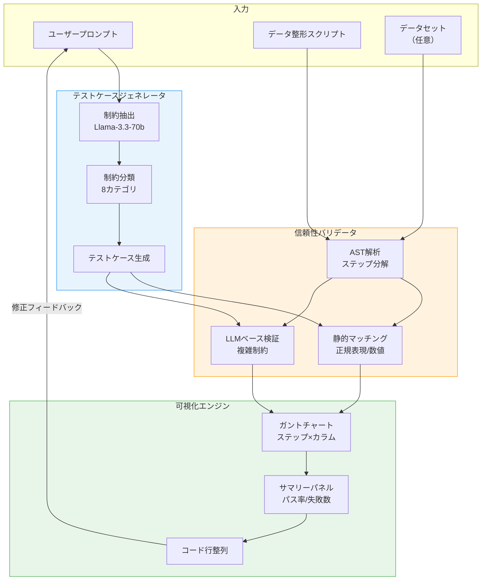
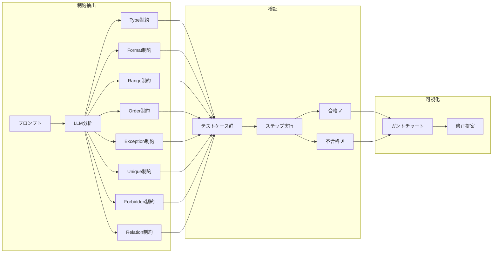
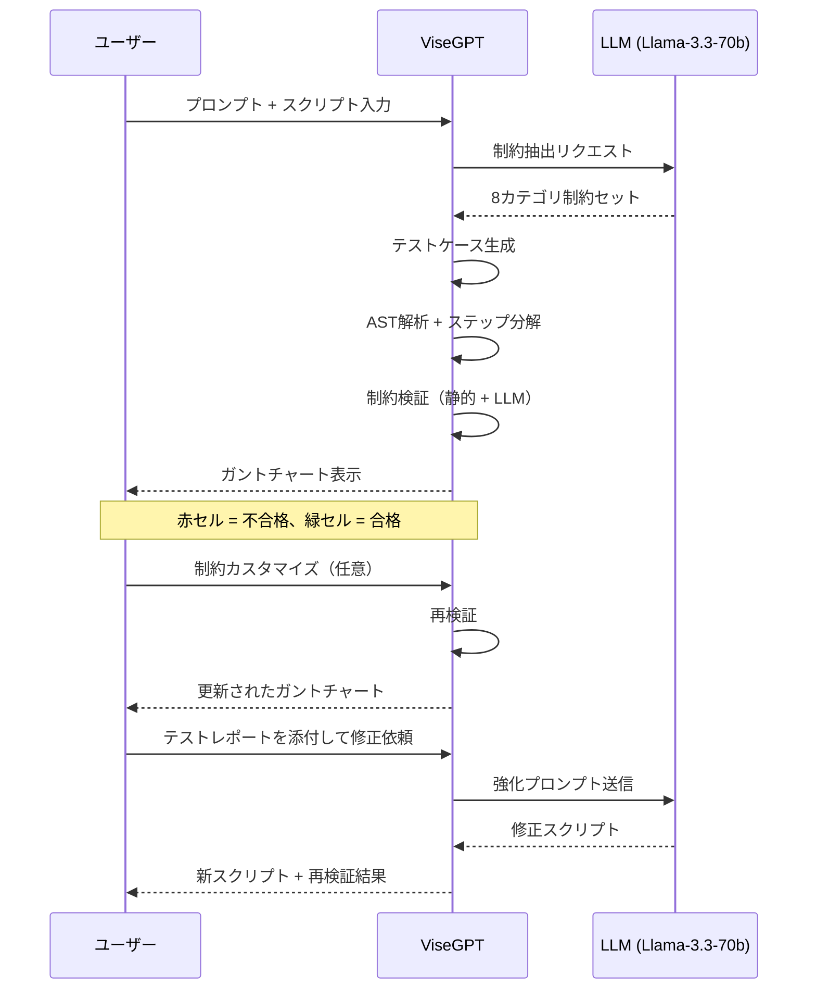

# ViseGPT: Towards Better Alignment of LLM-generated Data Wrangling Scripts and User Prompts

- **Link**: https://arxiv.org/abs/2508.01279
- **Authors**: Jiajun Zhu, Xinyu Cheng, Zhongsu Luo, Yunfan Zhou, Xinhuan Shu, Di Weng, Yingcai Wu
- **Year**: 2025
- **Venue**: UIST 2025 (Annual ACM Symposium on User Interface Software and Technology)
- **Type**: Academic Paper (HCI / Visualization)

## Abstract

Large language models (LLMs) enable the rapid generation of data wrangling scripts based on natural language instructions, but these scripts may not fully adhere to user-specified requirements, necessitating careful inspection and iterative refinement. Existing approaches primarily assist users in understanding script logic and spotting potential issues themselves, rather than providing direct validation of correctness. To enhance debugging efficiency and optimize the user experience, we develop ViseGPT, a tool that automatically extracts constraints from user prompts to generate comprehensive test cases for verifying script reliability. The test results are then transformed into a tailored Gantt chart, allowing users to intuitively assess alignment with semantic requirements and iteratively refine their scripts. Our design decisions are informed by a formative study (N=8) that explores user practices and challenges. We further evaluate the effectiveness and usability of ViseGPT through a user study (N=18). Results indicate that ViseGPT significantly improves debugging efficiency for LLM-generated data-wrangling scripts, enhances users' ability to detect and correct issues, and streamlines the workflow experience.

## Abstract（日本語訳）

大規模言語モデル（LLM）は自然言語の指示に基づくデータ整形スクリプトの迅速な生成を可能にするが、生成されたスクリプトはユーザーが指定した要件を完全に満たさない場合があり、注意深い検査と反復的な修正が必要となる。既存のアプローチは主にスクリプトロジックの理解と潜在的問題の発見をユーザー自身に委ねるものであり、正確性の直接的な検証を提供していない。デバッグ効率を向上させユーザー体験を最適化するために、本研究ではViseGPTを開発した。ViseGPTはユーザープロンプトから制約を自動抽出し、スクリプトの信頼性を検証するための包括的なテストケースを生成するツールである。テスト結果はカスタマイズされたガントチャートに変換され、ユーザーがセマンティック要件との整合性を直感的に評価し、反復的にスクリプトを改善できる。設計決定は形成的研究（N=8）に基づいており、さらにユーザースタディ（N=18）を通じてViseGPTの有効性とユーザビリティを評価した。結果は、ViseGPTがLLM生成データ整形スクリプトのデバッグ効率を有意に改善し、問題の検出・修正能力を向上させ、ワークフロー体験を合理化することを示している。

## 概要

本論文は、LLMが生成するデータ整形スクリプトとユーザーの意図（プロンプト）との間の「アラインメント問題」に焦点を当てたHCI研究である。LLMが生成するコードは構文的には正しくても、ユーザーが暗黙的に想定する制約（フォーマット、範囲、関係性など）を満たさないケースが頻発する。ViseGPTはこの課題に対し、(1) プロンプトからの制約自動抽出、(2) テストケース生成による自動検証、(3) ガントチャートによる直感的な結果可視化、という3段階のアプローチで対処するWebベースのデバッグツールである。

主要な貢献：

1. **制約ベーステストフレームワーク**: 自然言語プロンプトから暗黙的要件を8カテゴリの実行可能なテスト仕様に体系化
2. **整列可視化パラダイム**: コード行と空間的に整列したガントチャートにより、ユーザー意図とLLM出力間の「評価の溝」を橋渡し
3. **閉ループ反復**: テスト結果を自動的に強化プロンプトとしてフォーマットし、手動での問題記述を削減
4. **エビデンスベース設計**: 形成的研究で特定されたデバッグのボトルネック（手動検証の煩雑さ、プログラミングスキルの限界、ハルシネーション検出）に基づく設計

## 問題と動機

### LLM生成スクリプトのアラインメント問題

LLMを活用したデータ整形では、ユーザーが自然言語でタスクを記述し、LLMがPandas等のスクリプトを生成する。しかし、以下の問題が顕在化している：

- **暗黙的制約の欠落**: ユーザーが明示しない前提条件（大文字・小文字の統一、丸め処理の精度など）をLLMが見落とす
- **検証の困難さ**: 生成されたコードが構文的に正しく実行可能であっても、出力の意味的正確性をユーザーが確認することは困難
- **反復コストの高さ**: 問題を発見した場合、原因を特定しLLMに適切な修正指示を与えるために複数回の対話が必要
- **ハルシネーション**: LLMが自信を持って不正確な結果を返すため、非プログラマーにとって誤りの検出がさらに困難

### 形成的研究の知見（N=8）

参加者8名（大学院生4名、学部生2名、データジャーナリスト2名）への半構造化インタビューから、以下のデバッグ課題が特定された：

- ユーザーはLLMを単純で反復的なタスクに活用するが、複雑なシナリオでは出力の信頼性が低下
- 手動検証に依存しており、プログラミングスキルの限界がボトルネック
- LLMのハルシネーション検出が特に困難

## 提案手法

### システムアーキテクチャ

ViseGPTは3つのコアコンポーネントで構成される：

**1. テストケースジェネレータ（Test Case Generator）**

ユーザーの自然言語プロンプトからLlama-3.3-70b-Instructを用いて出力制約を抽出し、8カテゴリに分類する：

| カテゴリ | 説明 | 例 |
|----------|------|-----|
| Type | データ型の検証 | 列が整数型であること |
| Format | パターンマッチング（正規表現） | 日付がYYYY-MM-DD形式 |
| Range | 数値・文字列長の範囲制約 | 値が0〜100の範囲内 |
| Order | ソート・比較の関係性 | 日付の昇順ソート |
| Exception | 欠損値の検出 | NaN/null値の不在 |
| Unique | 主キー制約 | ID列の一意性 |
| Forbidden Value | 禁止値 | 特定の不正値の排除 |
| Relation | 列間の依存関係 | 合計列が各要素の和と一致 |

**2. 信頼性バリデータ（Reliability Validator）**

- Python AST（抽象構文木）解析によるスクリプトの原子ステップ分解
- 入出力要素の抽出とステップごとの制約マッチング
- 静的マッチング（正規表現によるフォーマット検証、数値範囲チェック）とLLMベースの検証（複雑な自然言語制約用）の併用

**3. 可視化エンジン（Visualization Engine）**

カスタマイズされたガントチャートにより、テスト結果を直感的に表示：
- 行：スクリプト実行ステップ
- 列：データ変数/カラム
- 色分け：緑（合格）、赤（不合格）
- サマリーパネル：失敗数とパス率の表示
- コード行との空間的整列

## アルゴリズム / 擬似コード

```
Algorithm: ViseGPT テスト駆動デバッグパイプライン
Input: ユーザープロンプト P, データ整形スクリプト S, データセット D（任意）
Output: 検証レポート R, ガントチャート可視化 V

Phase 1: 制約抽出
1:  constraints ← LLM.extract_constraints(P)
2:  for each c in constraints do
3:      classify(c) → {Type, Format, Range, Order, Exception, Unique, Forbidden, Relation}
4:  end for
5:  test_cases ← generate_test_cases(constraints)

Phase 2: スクリプト分解と検証
6:  steps ← AST.parse_atomic_steps(S)
7:  steps ← filter_non_data_ops(steps)  // print, assert等を除外
8:  if D is None then
9:      D ← LLM.generate_synthetic_data(P, constraints)
10: end if
11: for each step_i in steps do
12:     output_i ← execute(step_i, D)
13:     for each test_j in test_cases do
14:         if test_j.type in {Format, Range} then
15:             result_{i,j} ← static_match(output_i, test_j)
16:         else
17:             result_{i,j} ← LLM.validate(output_i, test_j)
18:         end if
19:     end for
20: end for

Phase 3: 可視化と反復
21: R ← aggregate_results(results)
22: V ← render_gantt_chart(R, steps, columns)
23: if user requests refinement then
24:     enhanced_prompt ← format_test_report(R) + P
25:     goto Phase 1 with enhanced_prompt
26: end if
27: return R, V
```

## アーキテクチャ / プロセスフロー

### システム全体フロー



### 制約抽出と検証の詳細フロー



## 図表

### 表1: 制約カテゴリの分類と検証手法

| カテゴリ | 検証手法 | 自動化レベル | 説明 |
|----------|----------|------------|------|
| Type | 静的 | 完全自動 | Pythonの型チェック（int, float, str等） |
| Format | 静的（正規表現） | 完全自動 | パターンマッチングによるフォーマット検証 |
| Range | 静的（数値比較） | 完全自動 | min/max制約の数値的検証 |
| Order | 静的 | 完全自動 | ソート順序の比較検証 |
| Exception | 静的/LLM | 半自動 | NaN検出は静的、意味的例外はLLM |
| Unique | 静的 | 完全自動 | 重複チェック |
| Forbidden | 静的 | 完全自動 | 禁止値リストとの照合 |
| Relation | LLM | 半自動 | 列間の複雑な依存関係はLLMが判定 |

### 表2: タスク別パフォーマンス比較（ユーザースタディ N=18）

| タスク | エラー内容 | ViseGPT<br/>成功率 | ベースライン<br/>成功率 | ViseGPT<br/>平均クエリ数 | ベースライン<br/>平均クエリ数 |
|--------|-----------|-------------------|----------------------|------------------------|---------------------------|
| A | 文字列長不一致 | **100%** | 78% | 1.33 | 2.78 |
| B | グルーピング境界欠落 | **100%** | 33% | 2.00 | 4.11 |
| C | 大文字・小文字不整合 | **56%** | 22% | 1.67 | 3.22 |
| D | 丸め処理の非準拠 | **89%** | 11% | 1.78 | 3.89 |

### 表3: UEQ（User Experience Questionnaire）評価結果

| 評価軸 | ViseGPT | ベースライン | 有意差 |
|--------|---------|------------|--------|
| 魅力性 (Attractiveness) | 高 | 中 | p < 0.05 |
| 明瞭性 (Perspicuity) | 高 | 中 | p < 0.05 |
| 効率性 (Efficiency) | 高 | 中 | p < 0.05 |
| 信頼性 (Dependability) | 高 | 中 | p < 0.05 |
| 刺激性 (Stimulation) | 高 | 中 | p < 0.05 |
| 新規性 (Novelty) | 高 | 中 | p < 0.05 |

### 図: ユーザーインタラクションパターン



## 実験と評価

### ユーザースタディの設計

- **参加者**: 18名（学部生12名、修士4名、博士2名、全員STEM分野）
- **Pandas経験**: M=3.28, SD=0.57（5段階評価）
- **LLM製品使用経験**: M=4.33, SD=0.59（5段階評価）
- **実験デザイン**: 修正バランスドラテン方格法（順序効果の制御）
- **タスク**: 4つのデバッグタスク（A〜D）、各15分、合計60分
- **ベースライン**: ViseGPTから拡張可視化機能を除去し、ChatGPTライクなインターフェースとしたもの（同一基盤モデル使用）

### 主要結果

**タスク成功率**: ViseGPTは全4タスクでベースラインを上回り、特にタスクB（+67ポイント）とタスクD（+78ポイント）で顕著な改善を示した。

**完了時間**: タスクA、B、Dでは平均120秒以上の時間短縮。タスクCのみ同等（ViseGPT: M=625s, ベースライン: M=645s）。

**クエリ送信パターン**: ViseGPTユーザーはテストレポートを添付することで少ないクエリ数（1.33〜2.00回）で問題を解決。ベースラインユーザーは自然言語のみで修正を試み、より多くのクエリ（2.78〜4.11回）を要した。

**定性的フィードバック**:
- 16/18名がViseGPTの可視化をテキスト応答より直感的と評価
- 14/18名が自動テストケース生成のデバッグ精度向上を評価
- 17/18名がスクリプト修正への自信向上を報告
- 一方で3/18名がテストカバレッジの不完全性を懸念
- 6/18名がベースラインの方が修正理由の透明性が高いと指摘

### タスクCの考察

タスクC（大文字・小文字不整合）では、ViseGPTの成功率が56%にとどまった。これは、可視化によって問題箇所は特定できても、ユーザーが根本原因（文字列操作の欠落）を理解できない場合、修正に至らないことを示している。視覚的インジケータだけではユーザーの理解を代替できないという重要な知見である。

## 技術的詳細

### 技術スタック

- **フロントエンド**: React + TypeScript
- **バックエンド**: Llama-3.3-70b-Instruct（NVIDIA ホスティング）
- **通信**: WebSocketによるプログレッシブ出力ストリーミング
- **対象言語**: Python/Pandas

### 制約事項

- ステップベースの粒度は長いスクリプトではスケーラビリティに課題
- 線形実行モデルのため分岐・ループ構造には非対応
- Python/Pandas固有の実装であり、他言語への汎用化は未実施
- テストケースカバレッジが8カテゴリに限定
- 既存の開発環境（IDE）との統合は未評価

## メモ

- **研究の位置づけ**: 本論文はHCI分野からのLLMコード生成品質保証アプローチとして注目に値する。コード生成の正確性を「テスト駆動」で検証するという発想は、ソフトウェア工学のテスト駆動開発（TDD）の概念をLLM支援ツールに適用したものと解釈できる。
- **データ分析エージェントとの関連**: ViseGPTの制約抽出→テスト生成→検証のパイプラインは、自律的データ分析エージェントにおける「自己検証メカニズム」の設計に示唆を与える。エージェントが生成したコードの品質を自動検証する仕組みとして応用可能。
- **可視化の重要性**: ガントチャートによるテスト結果の可視化が、ユーザーの問題発見能力を大幅に向上させた点は、データ分析ツールのUI設計における重要な教訓である。
- **限界の示唆**: タスクCの結果は、自動検証ツールだけでは不十分で、ユーザーの理解を支援する教育的要素も必要であることを示唆。これはデータ分析エージェントの「説明可能性」設計にも通じる課題である。
- **UIST 2025採択**: トップHCI会議での採択であり、インタラクション設計の観点から高い評価を受けている。
