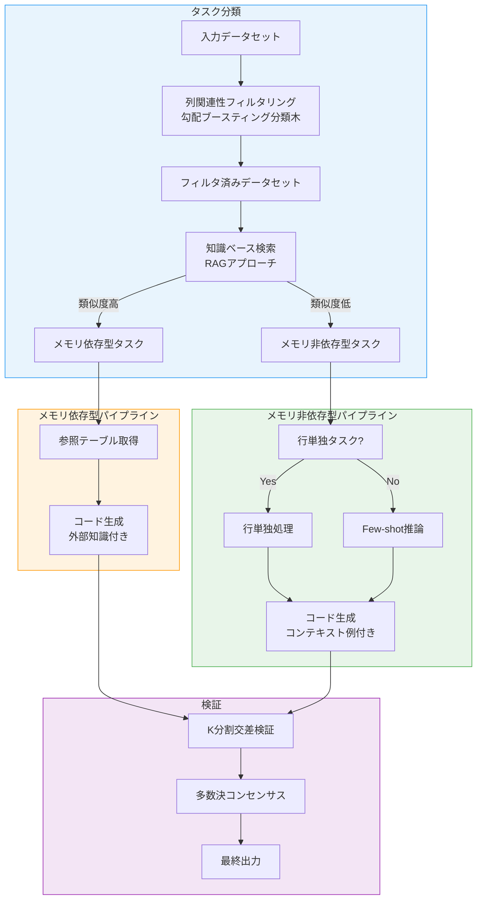
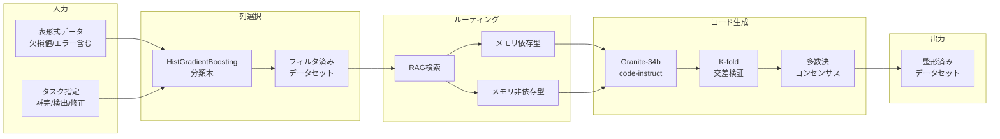
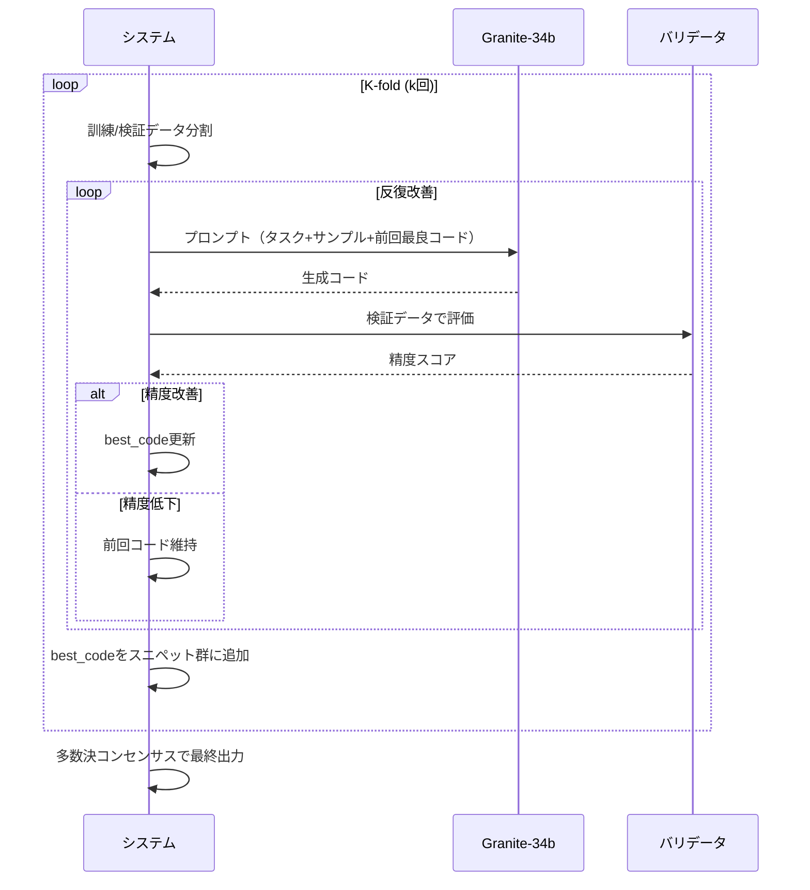
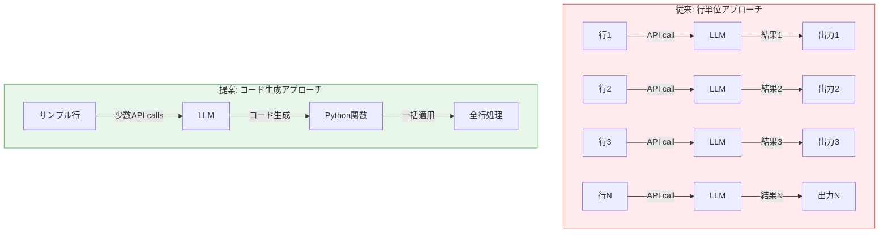

# Data Wrangling Task Automation Using Code-Generating Language Models

- **Link**: https://arxiv.org/abs/2502.15732
- **Authors**: Ashlesha Akella, Krishnasuri Narayanam
- **Year**: 2025
- **Venue**: AAAI 2025 Demo Track
- **Type**: Academic Paper (System Demo)

## Abstract

Data quality challenges in large tabular datasets necessitate automated data wrangling solutions. This paper presents an automated system that utilizes large language models to generate executable code for tasks like missing value imputation, error detection, and error correction. The system classifies tasks into memory-dependent (requiring external knowledge) and memory-independent categories, employing a Histogram-based Gradient Boosting Classification Tree for column relevance filtering and a Retrieval-Augmented Generation (RAG) approach for external knowledge integration. Through iterative code generation with K-fold cross-validation consensus, the system achieves comparable or superior accuracy to row-wise LLM approaches while reducing API calls by 95-98%.

## Abstract（日本語訳）

大規模表形式データセットにおけるデータ品質の課題は、自動データ整形ソリューションを必要としている。本論文は、欠損値補完、エラー検出、エラー修正といったタスクのための実行可能なコードを大規模言語モデルを用いて生成する自動化システムを提示する。システムはタスクをメモリ依存型（外部知識が必要）とメモリ非依存型に分類し、列の関連性フィルタリングにヒストグラムベースの勾配ブースティング分類木を、外部知識の統合にRAG（検索拡張生成）アプローチを採用する。K分割交差検証によるコンセンサスを用いた反復的コード生成により、行単位LLMアプローチと同等以上の精度を達成しながら、API呼び出し回数を95〜98%削減する。

## 概要

本論文は、LLMを活用したデータ品質管理の自動化システムを提案するデモ論文である。従来の行単位（row-wise）でLLMを呼び出すアプローチは、大規模データセットに対して膨大なAPI呼び出しコストが発生するという実用上の大きな問題を抱えていた。本システムはこの問題に対し、「コード生成」パラダイムへの転換を提案する。すなわち、LLMに個々のデータ行を処理させるのではなく、データセット全体に適用可能な汎用的なPythonコードを生成させることで、API呼び出し回数を劇的に削減しながら同等の精度を維持する。

主要な貢献：

1. **コード生成パラダイム**: 行単位のLLM呼び出しから、データセット全体に適用可能なコード生成へのパラダイムシフト
2. **タスク分類体系**: メモリ依存型とメモリ非依存型の2大分類に基づくタスクルーティング
3. **効率的な列選択**: 勾配ブースティングによるセマンティックに関連する列の自動選択
4. **RAGベース外部知識統合**: メモリ依存タスクに対する知識ベース検索と参照テーブル活用
5. **K分割交差検証コンセンサス**: 複数コードスニペットの多数決による信頼性向上

## 問題と動機

### データ品質管理の課題

大規模表形式データセットには、欠損値、フォーマットエラー、意味的エラーが混在しており、下流のデータ分析や機械学習の性能に重大な影響を与える。主な課題は以下の通り：

- **欠損値補完（Imputation）**: 欠落セルを適切な値で埋める必要があるが、コンテキストに依存した判断が必要
- **エラー検出（Error Detection）**: データ中の不整合や誤りを特定する。パターンの逸脱や意味的矛盾の検出が求められる
- **エラー修正（Error Correction）**: 検出されたエラーを正しい値に置換する。ドメイン知識や外部情報源が必要な場合が多い

### 行単位アプローチの限界

既存のLLMベースデータ整形手法は、各行を個別にLLMに送信して処理する「行単位アプローチ」が主流であった。しかし：

- **コスト**: 1,000行のデータセットに対して1,000回以上のAPI呼び出しが必要
- **レイテンシ**: 大規模データの処理に膨大な時間がかかる
- **一貫性**: 行ごとに独立して処理するため、データセット全体での一貫性が保証されない
- **スケーラビリティ**: データ規模の増大に比例してコストとレイテンシが増大

## 提案手法

### タスク分類フレームワーク



### メモリ依存型タスク

外部の組織データや業務ルールを必要とするタスク：
- **例**: 都市名→州名のマッピング、職位名→役職レベルの分類
- **処理**: 知識ベースから参照テーブルを検索し、コード生成プロンプトに含める
- **RAGアプローチ**: データセットの特徴量をクエリとし、類似タスクの外部知識を検索

### メモリ非依存型タスク

データセット内の情報のみで完結するタスク。さらに2つに細分化：

- **行単独タスク（Row-alone）**: 現在の行のデータのみで判断可能（例: フォーマット変換、型変換）
- **Few-shotタスク**: 他の行のコンテキスト例から推論が必要（例: パターンに基づく欠損値補完）

### コード生成プロセス

Granite-34b-code-instruct-8kモデルを使用し、以下の反復プロンプト構成でコードを生成：

1. タスク記述（Python関数生成の指示）
2. 関数の期待動作仕様
3. n個のランダムサンプル行
4. 前回イテレーションの最良コード
5. 参照テーブルサンプル（メモリ依存型の場合）

## アルゴリズム / 擬似コード

```
Algorithm: データ整形タスク自動化パイプライン
Input: データセット D, ターゲット列 col, タスク種別 task_type
Output: 整形済みデータセット D'

Phase 1: 列関連性フィルタリング
1:  features ← extract_features(D)
2:  relevance ← HistGBClassifier.predict(features, col)
3:  D_filtered ← D[columns where relevance > threshold]

Phase 2: タスクルーティング
4:  similarity ← RAG.search(D_filtered, KnowledgeBase)
5:  if similarity > sim_threshold then
6:      task_class ← MEMORY_DEPENDENT
7:      ref_table ← RAG.get_reference(similarity.top_k)
8:  else
9:      task_class ← MEMORY_INDEPENDENT
10:     if is_row_alone(D_filtered, col) then
11:         sub_class ← ROW_ALONE
12:     else
13:         sub_class ← FEW_SHOT
14:     end if
15: end if

Phase 3: K分割交差検証コード生成
16: folds ← k_fold_split(D_filtered.non_null_rows, k)
17: code_snippets ← []
18: for i = 1 to k do
19:     train_data ← folds \ folds[i]
20:     val_data ← folds[i]
21:     prompt ← build_prompt(task_type, train_data, ref_table?)
22:     best_code ← None
23:     for iter = 1 to max_iter do
24:         code ← LLM.generate(prompt, prev_best=best_code)
25:         acc ← evaluate(code, val_data)
26:         if acc > best_acc then
27:             best_code ← code
28:             best_acc ← acc
29:         end if
30:     end for
31:     code_snippets.append(best_code)
32: end for

Phase 4: コンセンサスと適用
33: if task_class == ROW_ALONE then
34:     acc_on_gt ← evaluate(best_code, ground_truth)
35:     if acc_on_gt < 0.9 then
36:         return INSUFFICIENT_ACCURACY
37:     end if
38: end if
39: D' ← apply_majority_consensus(code_snippets, D)
40: return D'
```

## アーキテクチャ / プロセスフロー

### エンドツーエンドシステムフロー



### 反復コード生成の詳細



## 図表

### 表1: タスク分類の詳細

| タスク分類 | サブ分類 | 説明 | 例 | 外部知識 |
|-----------|---------|------|-----|---------|
| メモリ依存型 | - | 外部組織データ・業務ルールが必要 | 都市→州マッピング | 必要 |
| メモリ非依存型 | 行単独 | 現在行のデータのみで判断可能 | フォーマット変換 | 不要 |
| メモリ非依存型 | Few-shot | 他行のコンテキスト例から推論 | パターン補完 | 不要 |

### 表2: 行単位アプローチ vs コード生成アプローチの比較

| タスク | データセット | 行単位精度 | 行単位<br/>API呼出数 | コード生成精度 | コード生成<br/>API呼出数 | API削減率 |
|--------|------------|-----------|---------------------|--------------|------------------------|----------|
| 欠損値補完 | Airline | 0.97 | 1,376 | **0.99** | 20 | **98.5%** |
| エラー検出 | Airline | 0.98 | 1,376 | 0.98 | 15 | **98.9%** |
| エラー修正 | Airline | 0.98 | 1,376 | 0.98 | 15 | **98.9%** |
| 欠損値補完 | BigBasket | 0.94 | 1,512 | 0.94 | 30 | **98.0%** |
| エラー検出 | BigBasket | 0.94 | 1,512 | **0.98** | 32 | **97.9%** |
| エラー修正 | BigBasket | 0.92 | 1,512 | **0.94** | 34 | **97.8%** |

### 表3: システムコンポーネントと使用技術

| コンポーネント | 技術/モデル | 役割 |
|--------------|-----------|------|
| 列選択 | HistGradientBoosting Classification Tree | セマンティック関連列の特定 |
| 知識ベース検索 | RAGアプローチ | メモリ依存/非依存の判定 + 外部知識取得 |
| コード生成 | Granite-34b-code-instruct-8k | データ整形用Pythonコード生成 |
| 検証 | K-fold交差検証 | 生成コードの信頼性評価 |
| 最終判定 | 多数決コンセンサス | 複数スニペットの統合 |

### 図: パラダイムの比較



## 実験と評価

### 実験設定

- **データセット**: Airline Dataset（航空データ、1,376行）、BigBasket Dataset（商品カタログ、1,512行）
- **タスク**: 各データセットに対して欠損値補完、エラー検出、エラー修正の3タスク
- **コード生成モデル**: Granite-34b-code-instruct-8k
- **ベースライン**: 行単位LLM呼び出しアプローチ
- **評価指標**: 精度（Accuracy）とAPI呼び出し回数

### 主要結果

**精度面**: コード生成アプローチは全6条件中4条件でベースラインと同等、2条件で上回る結果を示した。特にAirline Datasetの欠損値補完（0.97→0.99）とBigBasketのエラー検出（0.94→0.98）で改善が見られた。

**効率面**: API呼び出し回数を95〜98%削減。Airline Datasetでは1,376回→15〜20回、BigBasketでは1,512回→30〜34回に激減。

**行単独メソッドの閾値**: 精度が0.9以上の場合のみ全データセットにコードを適用するという安全策により、低品質コードの適用を防止。

### 結果の解釈

コード生成アプローチが行単位アプローチと同等以上の精度を達成できる理由：

1. **パターンの汎化**: LLMがサンプルからデータ変換パターンを学習し、汎用的なコードとして表現できる
2. **一貫性**: 同一コードが全行に適用されるため、行間での処理の一貫性が保証される
3. **反復改善**: K-fold交差検証による検証で、コードの品質を段階的に向上

## メモ

- **実用的意義**: API呼び出しの95〜98%削減は、LLMベースデータ整形の実運用における最大のボトルネック（コストとレイテンシ）を直接解決する。これはエンタープライズ環境でのLLM活用において極めて重要な貢献である。
- **コード生成パラダイムの普遍性**: 本論文の「行単位処理→コード生成」への転換は、データ整形に限らず、LLMを繰り返し呼び出す任意のデータ処理タスクに応用可能な汎用的なアーキテクチャパターンである。
- **Granite-34bの選択**: IBM Research発のGraniteモデルを使用しており、オープンソースのコード生成モデルの実用性を実証している。GPTシリーズとの比較がないのは惜しいが、デモ論文としては十分な検証である。
- **限界**: テストが2データセットに限定されており、より多様なドメイン（医療、金融、テキストデータ等）での汎用性は未検証。また、エラーの種類も限定的であり、複雑な意味的エラーへの対応は未実証。
- **データ分析エージェントとの関連**: 本システムのタスク分類→ルーティング→コード生成→検証のパイプラインは、データ分析エージェントの「前処理モジュール」として直接統合可能なアーキテクチャである。特にK-fold検証によるコード品質保証は、エージェントの自律的品質管理メカニズムとして参考になる。
- **AAAI 2025 Demo Track**: トップAI会議のデモトラックでの採択であり、システムの実装完成度とデモンストレーション価値が評価されている。
