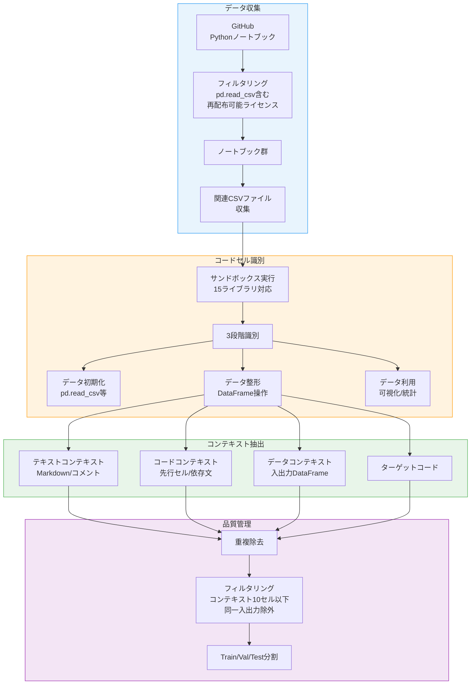
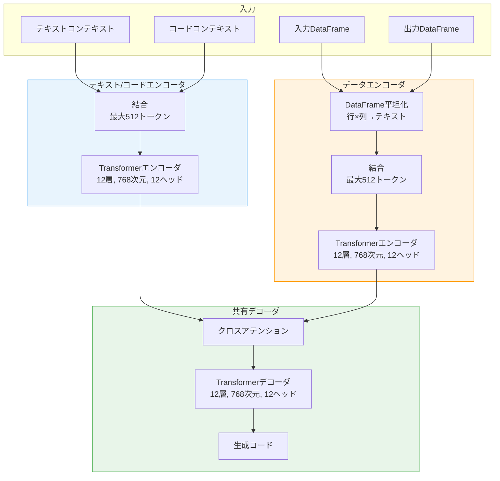
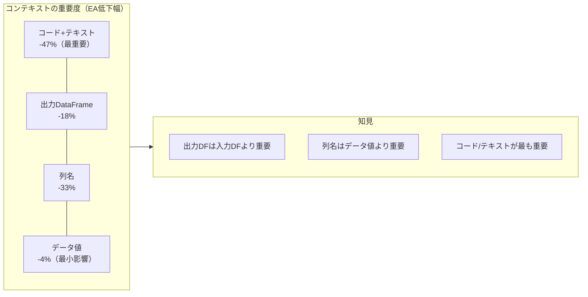

# Contextualized Data-Wrangling Code Generation in Computational Notebooks

- **Link**: https://arxiv.org/abs/2409.13551
- **Authors**: Junjie Huang, Daya Guo, Chenglong Wang, Jiazhen Gu, Shuai Lu, Jeevana Priya Inala, Cong Yan, Jianfeng Gao, Nan Duan, Michael R. Lyu
- **Year**: 2024
- **Venue**: ASE 2024 (International Conference on Automated Software Engineering)
- **Type**: Academic Paper (コード生成 / データ整形)

## Abstract

Data wrangling, the process of preparing raw data for further analysis in computational notebooks, is a crucial yet time-consuming step in data science. To automate this process, we formalize the task of contextualized data-wrangling code generation that translates user intentions into executable code while considering multi-modal notebook context including textual, code, and data dimensions. We develop CoCoMine, an automated mining approach for extracting data-wrangling examples with clear contextual dependencies from real-world notebooks, resulting in CoCoNote -- a dataset of 58,221 examples. We also propose DataCoder, a model that encodes data context and code/textual contexts separately through a dual-encoder architecture to enhance code generation. Experiments across 17 code generation models demonstrate the importance of incorporating data context, with DataCoder achieving the best performance among fine-tuned models.

## Abstract（日本語訳）

データ整形は、計算ノートブックにおいて生データをさらなる分析のために準備するプロセスであり、データサイエンスにおいて重要だが時間のかかるステップである。このプロセスを自動化するために、テキスト、コード、データの3次元を含むマルチモーダルなノートブックコンテキストを考慮しながら、ユーザーの意図を実行可能なコードに変換する「コンテキスト化データ整形コード生成」タスクを定式化する。実世界のノートブックからコンテキスト依存性が明確なデータ整形例を抽出する自動マイニング手法CoCoMineを開発し、58,221例のデータセットCoCoNoteを構築した。また、デュアルエンコーダアーキテクチャによりデータコンテキストとコード/テキストコンテキストを別々にエンコードするDataCoderモデルを提案する。17のコード生成モデルにわたる実験により、データコンテキストの組み込みの重要性が実証され、DataCoderはファインチューニングモデルの中で最高性能を達成した。

## 概要

本論文は、Jupyterノートブック環境でのデータ整形コード自動生成という実用的課題に取り組んだ研究である。従来のコード生成研究がテキスト記述やコードコンテキストのみを入力とするのに対し、本研究はデータの実行時状態（入出力DataFrameの内容）を「データコンテキスト」として明示的にモデル化し、コード生成の精度向上に寄与することを実証した。

主要な貢献：

1. **タスクの定式化**: テキスト・コード・データの3モーダルコンテキストを考慮した「コンテキスト化データ整形コード生成」タスクの形式的定義
2. **CoCoMineマイニングツール**: GitHubの実世界ノートブックからコンテキスト依存性のあるデータ整形例を自動抽出するパイプライン
3. **CoCoNoteデータセット**: 58,221例の大規模データ整形コード生成ベンチマーク
4. **DataCoderモデル**: データコンテキストとコード/テキストコンテキストを分離エンコードするデュアルエンコーダアーキテクチャ
5. **包括的評価**: PLM 5モデル、LLMプロンプティング 7モデル、LoRAファインチューニング 5モデルの合計17モデルにわたる体系的ベンチマーク

## 問題と動機

### データ整形の実態

データサイエンティストの作業時間の最大80%がデータの準備・整形に費やされるとされる。Jupyterノートブックは対話的なデータ分析の標準環境であり、データ整形コードの自動生成はこのボトルネック解消の鍵となる。

### 既存研究の限界

- **テキストのみの入力**: 既存のコード生成モデル（Codex、CodeT5等）はテキスト記述をコードに変換するが、データの実行時状態を考慮しない
- **コードコンテキストの限定的活用**: 先行コードセルの情報を利用する研究はあるが、DataFrameの実際の内容（列名、データ型、値の分布）を入力としていない
- **ベンチマークの不在**: 多モーダルコンテキストを含むデータ整形専用の大規模ベンチマークが存在しなかった
- **入力長の制約**: コード、テキスト、データの3種を全て1つのエンコーダに入力すると、トークン長の制約により情報が切り捨てられる

### 動機付けの例

以下のような状況を考える：ユーザーがノートブックでCSVファイルを読み込み、いくつかのデータ探索を行った後、特定の変換を実行したい。自然言語のコメント「# Remove rows where age is negative」だけでは不十分で、実際のDataFrameの列名（`age`列の存在）、データ型（数値型）、現在の値の分布を知ることで、より正確なコードが生成できる。

## 提案手法

### CoCoMine: 自動マイニングパイプライン



### 3段階のコードセル識別

1. **データ初期化**: `pd.read_csv()`等のデータ読み込みAPIを含むセル
2. **データ整形**: DataFrame変数に対する変換操作（pandas API）を含むセル
3. **データ利用**: matplotlib、seaborn、scipy、scikit-learn等による可視化・分析セル

### コンテキスト抽出戦略

| コンテキスト種別 | 抽出方法 | 内容 |
|----------------|---------|------|
| テキストコンテキスト | Markdown/コメント解析 | セル前のMarkdown、インラインコメント、セルコメント |
| コードコンテキスト | AST依存分析 | ターゲット変数の定義文、import宣言、依存セル |
| データコンテキスト | サンドボックス実行 | ターゲットコード実行前後のDataFrame状態 |

### DataCoder: デュアルエンコーダアーキテクチャ



**デュアルエンコーダの設計根拠**:

- **モダリティの異質性**: コード/テキストとDataFrameの表形式データは根本的に異なる構造を持つ
- **入力長制約の緩和**: 2つのエンコーダに分割することで、各モダリティに512トークンずつ割り当て可能
- **特化学習**: 各エンコーダがそれぞれのモダリティに最適化された表現を学習

### DataFrame平坦化戦略

DataFrameをテキストシーケンスに変換する方法：各行の要素を左から右に配置し、上から下にスタッキング。訓練時は最大10行、テスト時は全データを使用。

## アルゴリズム / 擬似コード

```
Algorithm: CoCoMine データ整形例マイニング
Input: GitHubノートブックコーパス N, サンドボックス環境 E
Output: コンテキスト付きデータ整形例データセット CoCoNote

1:  notebooks ← filter(N, has_pd_read_csv AND redistributable_license)
2:  for each nb in notebooks do
3:      csv_files ← collect_associated_data(nb)
4:      E.setup(nb, csv_files, libraries=15_DS_LIBS)
5:
6:      for each cell in nb.code_cells do
7:          // 3段階識別
8:          stage ← classify_stage(cell)  // init / wrangle / utilize
9:          if stage == WRANGLE then
10:             // データコンテキスト抽出
11:             df_in ← E.capture_state(before=cell)
12:             E.execute(cell, timeout=300s)
13:             df_out ← E.capture_state(after=cell)
14:
15:             if df_in == df_out then continue  // 変化なしは除外
16:
17:             // コードコンテキスト抽出
18:             deps ← AST.find_dependencies(cell, nb.preceding_cells)
19:             code_ctx ← deps[:10]  // 最大10セル
20:
21:             // テキストコンテキスト抽出
22:             text_ctx ← get_markdown_and_comments(cell, nb)
23:
24:             example ← (text_ctx, code_ctx, df_in, df_out, cell.code)
25:             dataset.add(example)
26:         end if
27:     end for
28: end for
29: dataset ← deduplicate(dataset)
30: dataset ← remove_train_leakage(dataset)
31: return split(dataset, train=54567, val=2000, test=1654)
```

```
Algorithm: DataCoder 推論
Input: テキストコンテキスト T, コードコンテキスト C,
       入力DataFrame D_in, 出力DataFrame D_out
Output: 生成コード code

1:  // テキスト/コードエンコーダ
2:  tc_tokens ← tokenize(concat(T, C))[:512]
3:  h_tc ← TextCodeEncoder(tc_tokens)

4:  // データエンコーダ
5:  d_text ← flatten(D_in) + flatten(D_out)
6:  d_tokens ← tokenize(d_text)[:512]
7:  h_data ← DataEncoder(d_tokens)

8:  // デコーダ（クロスアテンション）
9:  h_combined ← cross_attention(h_tc, h_data)
10: code ← Decoder.generate(h_combined, max_length=300)
11: return code
```

## 図表

### 表1: CoCoNoteデータセット統計

| 統計項目 | 訓練セット | 検証セット | テストセット |
|---------|-----------|-----------|------------|
| 例数 | 54,567 | 2,000 | 1,654 |
| 平均入力列数 | 12.8 | - | 12.9 |
| 平均入力行数 | 8.6 | - | 249.5 |
| 平均テキストコンテキスト長（トークン） | 276.2 | - | 138.0 |
| 平均ターゲットコード長（トークン） | 67.2 | - | 41.3 |

### 表2: PLMファインチューニング結果

| モデル | パラメータ数 | Exact Match (%) | CodeBLEU (%) | Execution Accuracy (%) |
|--------|-----------|----------------|-------------|----------------------|
| CodeBERT | 125M + Decoder | 10.2 | 44.7 | 22.1 |
| GraphCodeBERT | 125M + Decoder | 14.0 | 48.9 | 28.9 |
| UniXcoder | 126M | 15.3 | 50.1 | 31.5 |
| PLBART | 140M | 16.8 | 52.4 | 34.2 |
| CodeT5 | 220M | 19.1 | 55.3 | 38.1 |
| **DataCoder** | **220M** | **21.3** | **57.2** | **42.2** |

### 表3: LLMプロンプティング結果（Few-shot k=2）

| モデル | パラメータ数 | Exact Match (%) | CodeBLEU (%) | Execution Accuracy (%) |
|--------|-----------|----------------|-------------|----------------------|
| StarCoder | 15B | 8.1 | 53.2 | 33.2 |
| CodeLlama | 34B | 7.5 | 54.1 | 36.8 |
| Phind-CodeLlama | 34B | 8.8 | 55.9 | 38.5 |
| DeepSeek-Coder | 33B | 9.2 | 56.3 | 39.7 |
| Codex | 12B | 8.5 | 54.8 | 37.2 |
| GPT-3.5 | - | 6.9 | 55.3 | 40.1 |
| **GPT-4** | - | **11.1** | **60.8** | **50.6** |

### 表4: LoRAファインチューニング結果

| モデル | パラメータ数 | Exact Match (%) | CodeBLEU (%) | Execution Accuracy (%) |
|--------|-----------|----------------|-------------|----------------------|
| DeepSeek-Coder-1.3B | 1.3B | 15.7 | 58.1 | 43.2 |
| CodeGen-6B | 6B | 17.2 | 59.8 | 46.1 |
| CodeLlama-7B-Python | 7B | 19.0 | 61.3 | 48.8 |
| Mistral-7B-Instruct | 7B | 18.5 | 60.5 | 47.3 |
| **DeepSeek-Coder-6.7B** | **6.7B** | **19.3** | **62.7** | **50.5** |

### 表5: コンテキスト種別のアブレーション分析（DataCoder, Execution Accuracy %）

| コンテキスト構成 | EA (%) | 低下幅 |
|----------------|--------|--------|
| 全コンテキスト（コード+テキスト+入力DF+出力DF） | **42.2** | - |
| コード+テキスト除去 | 22.4 | -47% |
| コード+テキスト+入力DF除去 | 23.8 | -44% |
| コード+テキスト+出力DF除去 | 34.5 | -18% |
| データのみ（入力DF+出力DF） | 5.4 | -87% |
| 列名除去 | 28.2 | -33% |
| データ値除去 | 38.2 | -4% |

### 図: コンテキスト種別の影響度比較



## 実験と評価

### 実験設定

- **PLMファインチューニング**: 最大シーケンス長512（コンテキスト256+データ256）、ターゲット最大300トークン、バッチサイズ64、20エポック、Tesla V100 x 8
- **DataCoder**: 学習率2e-4、バッチサイズ64、20エポック、早期停止あり
- **LLMプロンプティング**: Few-shot k=2（訓練セットからランダムサンプル）
- **LoRAファインチューニング**: ランク8、5エポック、A100 x 1

### 評価指標

1. **Exact Match (EM)**: 生成コードとグラウンドトゥルースの厳密な文字列一致率
2. **CodeBLEU (CB)**: n-gram、重み付きn-gram、AST、データフロー一致の複合指標
3. **Execution Accuracy (EA)**: 生成コードとオラクルコードが同一出力DataFrameを生成する割合

### RQ1: モデル性能比較

**PLMファインチューニング**: DataCoderがEM 21.3%、CB 57.2%、EA 42.2%で最高性能。CodeT5を2.2ポイント（EM）、4.1ポイント（EA）上回る。

**LLMプロンプティング**: GPT-4がEA 50.6%で最高だが、EM 11.1%と低く、正確なコード再現は困難。大規模モデルでもデータ整形の精密なコード生成は難しいことを示唆。

**LoRAファインチューニング**: DeepSeek-Coder-6.7BがEA 50.5%でGPT-4に匹敵。パラメータ効率的なファインチューニングの有効性を実証。

### RQ2: コンテキストの影響

- **最も重要**: コード+テキストコンテキスト（除去で-47%）
- **出力DFは入力DFより重要**: 出力DF除去で-18%、入力DF除去は影響小
- **データのみでは不十分**: コード/テキストなしのデータのみでは5.4%に低下

### RQ3: データコンテキストの構成要素

- **列名がデータ値より重要**: 列名除去で-33%、値除去で-4%
- **GPT-3.5でも同様の傾向**: 列名除去-35%、値除去-14%

### 人間評価

5名のアノテーター（学生3名、実務者2名）による50テスト例の分析：
- コード+テキストのみで解決可能: 34%
- +入力DataFrame: 40%
- +出力DataFrame: 42%
- 全コンテキスト: 76%
- 解決困難: 24%

## メモ

- **データコンテキストの重要性**: 本論文の最大の知見は、コード生成におけるデータの実行時状態（特に出力DataFrame）の重要性を定量的に実証したことである。これはデータ分析エージェントの設計において、「データの状態を観察する能力」が本質的に重要であることを示唆する。
- **デュアルエンコーダの妥当性**: 異なるモダリティを分離エンコードするアプローチは、入力長制約の緩和だけでなく、モダリティ固有の特徴抽出にも寄与しており、マルチモーダル入力を扱うエージェントの設計パターンとして参考になる。
- **列名 > データ値**: 列名がデータ値より重要という知見は、LLMがスキーマ情報から操作を推論する能力を示しており、大規模データの効率的な処理（全データの送信不要）に直結する実用的知見である。
- **CoCoNoteの規模**: 58,221例は既存のデータ整形ベンチマークと比較して大規模であり、コミュニティへの重要な資源提供である。ただし、テストセットでの平均入力行数が249.5行と、実運用のデータセットサイズと比較するとまだ小さい。
- **GPT-4の限界**: GPT-4でさえEA 50.6%にとどまるという結果は、データ整形コード生成が依然として困難なタスクであることを示す。特にExact Matchが11.1%と低いことは、同一目的のコードでも表現のバリエーションが大きいことを反映している。
- **Microsoft Research共著**: 著者にMicrosoft Researchのメンバーが含まれ（Jeevana Priya Inala、Cong Yan、Jianfeng Gao等）、Copilotなどの実製品への応用が想定される研究である。
- **ASE 2024採択**: ソフトウェア工学のトップ会議での採択であり、手法の新規性と実験の網羅性が評価されている。
