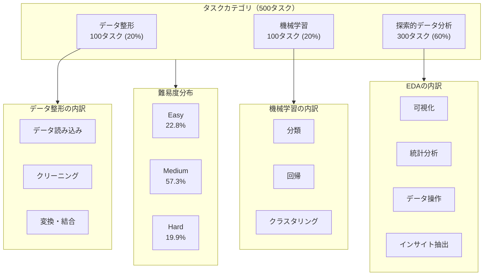
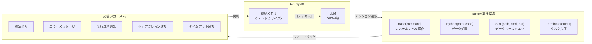
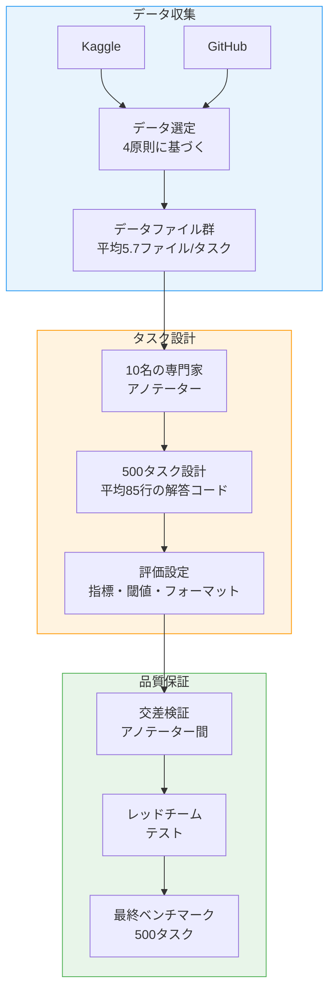
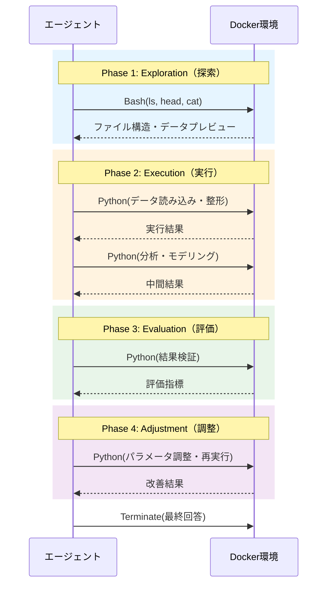
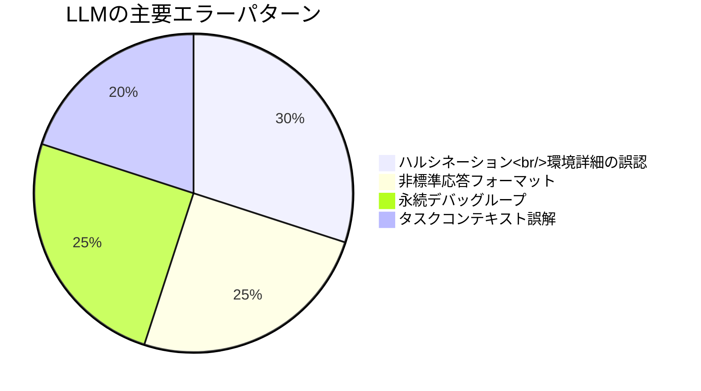

# DA-Code: Agent Data Science Code Generation Benchmark for Large Language Models

- **Link**: https://arxiv.org/abs/2410.07331
- **Authors**: Yiming Huang, Jianwen Luo, Yan Yu, Yitong Zhang, Fangyu Lei, Yifan Wei, Shizhu He, Lifu Huang, Xiao Liu, Jun Zhao, Kang Liu
- **Year**: 2024
- **Venue**: EMNLP 2024
- **Type**: Academic Paper (ベンチマーク / コード生成)

## Abstract

We introduce DA-Code, a code generation benchmark specifically designed to assess LLMs on agent-based data science tasks. This benchmark features three core elements: First, the tasks within DA-Code are inherently challenging, setting them apart from traditional code generation tasks and demanding advanced coding skills in grounding and planning. Second, examples in DA-Code are all based on real and diverse data, covering a wide range of complex data wrangling and analytics tasks. Third, to solve the tasks, the models must utilize complex data science programming languages, to perform intricate data processing and derive the answers. The best-performing LLM achieves only 30.5% accuracy on DA-Code, revealing substantial room for improvement in agent-based data science capabilities. The benchmark is publicly available at da-code-bench.github.io.

## Abstract（日本語訳）

本論文では、エージェントベースのデータサイエンスタスクにおけるLLMの評価を目的としたコード生成ベンチマークDA-Codeを導入する。本ベンチマークは3つの中核要素を特徴とする。第一に、DA-Code内のタスクは本質的に困難であり、従来のコード生成タスクとは一線を画し、グラウンディングとプランニングにおける高度なコーディングスキルを要求する。第二に、DA-Codeの全例は実データに基づいており、複雑なデータ整形と分析タスクを広範にカバーする。第三に、タスクを解くためにモデルは複雑なデータサイエンスプログラミング言語を活用し、精緻なデータ処理を実行して回答を導出する必要がある。最高性能のLLMでもDA-Codeで30.5%の精度にとどまり、エージェントベースのデータサイエンス能力に大きな改善の余地があることが明らかになった。

## 概要

DA-Codeは、LLMベースのデータサイエンスエージェントの能力を包括的に評価するためのベンチマークである。既存のコード生成ベンチマーク（HumanEval、MBPP、DS-1000等）が短いコードスニペットの生成を評価するのに対し、DA-Codeは実データを用いた複雑なデータサイエンスワークフロー全体（データ読み込み→整形→分析→結果出力）をエージェントが自律的に遂行する能力を評価する。

主要な貢献：

1. **包括的ベンチマーク**: データ整形、機械学習、探索的データ分析の3カテゴリ500タスクからなるエージェント向けベンチマーク
2. **実データベース**: Kaggle、GitHubの実世界データを使用し、人工データでは捉えられない複雑さを再現
3. **DA-Agentフレームワーク**: Docker環境でPython、SQL、Bashを統合した対話的エージェント実行環境
4. **堅牢な評価スイート**: テーブル、チャート、テキスト、ML指標の多面的評価
5. **詳細なエラー分析**: LLMの系統的な失敗パターン（ハルシネーション、デバッグループ等）の特定

## 問題と動機

### 既存ベンチマークの限界

| ベンチマーク | タスク数 | 平均コード行数 | 実データ | エージェント対話 |
|-------------|---------|-------------|---------|---------------|
| DS-1000 | 1,000 | 3.6行 | なし | なし |
| Arcade | 1,078 | 2.3行 | 部分的 | なし |
| MLAgentBench | 13 | - | あり | あり |
| **DA-Code** | **500** | **85行** | **あり** | **あり** |

既存ベンチマークの主な問題：

- **タスクの単純さ**: 平均2〜4行のコード生成は、実際のデータサイエンスワークフローの複雑さを反映しない
- **人工データ**: 合成データでは、実データに存在するノイズ、欠損、不整合が再現されない
- **非対話的**: 単一プロンプト→単一回答の形式では、エージェントの反復的問題解決能力を評価できない
- **限定的カバレッジ**: データ整形、ML、EDAを統合的にカバーするベンチマークが不在

### エージェントに求められるスキル

DA-Codeが評価する主要なスキル：

1. **グラウンディング**: 実データの構造・内容を正確に理解し、適切なAPI/ライブラリを選択
2. **プランニング**: 複雑なタスクを実行可能なサブタスクに分解し、順序立てて実行
3. **デバッグ**: エラー発生時に原因を特定し、コードを修正して再実行
4. **マルチ言語活用**: Python、SQL、Bashを目的に応じて使い分け

## 提案手法

### DA-Codeベンチマーク構成



### DA-Agent実行環境



### 形式的定義

エージェントデータサイエンスタスクを状態空間モデルで定式化：

- **状態空間 S**: 環境の現在状態（ファイルシステム、変数、DB等）
- **行動空間 A**: {Bash, Python, SQL, Terminate}
- **観察空間 O**: 環境からのフィードバック
- **コード空間 C**: 生成されるコード
- **履歴空間 H**: (action, code, observation)タプルの系列

反復プロセス：
1. **行動生成**: 現在の状態と履歴から次の行動を選択
2. **行動実行**: Docker環境内でコードを実行
3. **メモリ更新**: 観察結果を履歴に追加（ウィンドウサイズkで制限）

## アルゴリズム / 擬似コード

```
Algorithm: DA-Agent エージェントループ
Input: タスク記述 task, データファイル群 files, 最大ステップ数 max_steps
Output: タスク回答 answer

1:  env ← Docker.init(files)           // Docker環境初期化
2:  history ← []
3:  state ← env.observe()

4:  for step = 1 to max_steps do
5:      // 行動生成
6:      context ← format(task, state, history[-k:])  // 直近kステップの履歴
7:      action, code ← LLM.generate(context)

8:      // 行動タイプに応じた実行
9:      switch action do
10:         case Bash(command):
11:             obs ← env.execute_bash(command)
12:         case Python(save_path, code):
13:             obs ← env.execute_python(code, save_path)
14:         case SQL(file_path, command, output):
15:             obs ← env.execute_sql(file_path, command, output)
16:         case Terminate(output):
17:             answer ← output
18:             return answer
19:     end switch

20:     // 応答処理
21:     if obs.type == ERROR then
22:         feedback ← format_error(obs)
23:     elif obs.type == TIMEOUT then
24:         feedback ← "Execution timed out"
25:     else
26:         feedback ← obs.stdout
27:     end if

28:     // メモリ更新
29:     history.append((action, code, feedback))
30:     state ← env.observe()
31: end for

32: return TIMEOUT_ANSWER
```

```
Algorithm: DA-Code 評価パイプライン
Input: 予測出力 pred, 参照出力 ref, タスクメタ meta
Output: スコア score ∈ [0, 1]

1:  switch meta.output_type do
2:      case TABLE:
3:          M' ← extract_table(pred)
4:          M ← extract_table(ref)
5:          score ← (M'[meta.columns] == M[meta.columns]) ? 1 : 0
6:      case CHART:
7:          D', I' ← extract_chart_data(pred)
8:          D, I ← extract_chart_data(ref)
9:          score ← (D' == D AND I' == I) ? 1 : 0
10:     case ML:
11:         s ← extract_metric(pred, meta.metric)
12:         score ← min(1, max(0, (s - S_baseline) / (S_best - S_baseline)))
13:     case TEXT:
14:         score ← exact_match(pred, ref)
15: end switch
16: return score
```

## アーキテクチャ / プロセスフロー

### ベンチマーク構築パイプライン



### EEEAパターン（エージェント行動パターン分析）



## 図表

### 表1: DA-Codeと既存ベンチマークの比較

| 特性 | DS-1000 | Arcade | MLAgentBench | DA-Code |
|------|---------|--------|-------------|---------|
| タスク数 | 1,000 | 1,078 | 13 | 500 |
| 平均コード行数 | 3.6 | 2.3 | - | **85** |
| 実データ使用 | なし | 部分的 | あり | **あり** |
| エージェント対話 | なし | なし | あり | **あり** |
| 多言語（Python/SQL/Bash） | なし | なし | 部分的 | **あり** |
| 評価の堅牢性 | コード一致 | コード一致 | タスク固有 | **標準化スイート** |

### 表2: モデル別ベンチマーク結果

| モデル | 総合スコア (%) | データ整形 (%) | 機械学習 (%) | EDA (%) | 平均ステップ数 |
|--------|-------------|--------------|------------|---------|-------------|
| GPT-4 | **30.5** | 30.4 | **48.4** | 24.6 | 7.3 |
| GPT-4o | 29.1 | **33.3** | 48.0 | 21.3 | 6.8 |
| Claude-3-Opus | 27.6 | 29.3 | 46.8 | 20.7 | 8.9 |
| Qwen2.5-72B | 22.6 | 24.9 | 41.8 | 15.4 | 8.6 |
| DeepSeek-Coder-V2.5 | 20.7 | 25.1 | 34.1 | 14.7 | 7.1 |
| Mixtral-8x22B | 15.4 | 14.8 | 31.6 | 10.2 | 11.1 |

### 表3: DA-Agentフレームワーク比較（DA-Code-100サブセット）

| フレームワーク | スコア (%) | 特徴 |
|-------------|-----------|------|
| **DA-Agent** | **31.5** | 本論文提案のベースライン |
| OpenDevin | 26.2 | 汎用コーディングエージェント |
| AutoGen | 18.6 | マルチエージェント |
| X-Agent | 6.7 | 汎用エージェント |

### 表4: アブレーション分析

| 条件 | GPT-4スコア (%) |
|------|---------------|
| ベースライン（DA-Agent） | 31.5 |
| + 参照プラン追加 | **39.7** (+8.2) |
| メモリウィンドウ k=5 | 30.8 |
| メモリウィンドウ k=10 | 31.5 |
| メモリウィンドウ k=15 | 32.3 |

### 図: エラー分類



## 実験と評価

### 実験設定

- **評価モデル**: GPT-4、GPT-4o、Claude-3-Opus、Qwen2.5-72B、DeepSeek-Coder-V2.5、Mixtral-8x22B等
- **実行環境**: Docker（Linux、Python、SQL、Conda、データベースエンジン搭載）
- **メモリウィンドウ**: デフォルトk=10（直近10ステップの履歴を保持）
- **評価指標**: タスク種別に応じたTable Match Score、Chart Match Score、ML Normalized Score、Text Match

### 主要結果

**総合性能**: 最高性能のGPT-4でも30.5%にとどまり、エージェントベースのデータサイエンスタスクが現在のLLMにとって極めて困難であることを実証。

**カテゴリ別分析**:
- **機械学習タスクが最も高精度**: GPT-4で48.4%。sklearn等のフレームワークの定型的なパターンが活用可能
- **データ整形は中間**: GPT-4で30.4%。データの理解と適切な変換の選択が課題
- **EDAが最も困難**: GPT-4で24.6%。多様な分析手法の選択と結果の解釈が必要

**フレームワーク比較**: DA-Agent（31.5%）がOpenDevin（26.2%）、AutoGen（18.6%）、X-Agent（6.7%）を上回るが、汎用エージェントフレームワークの限界も明らか。

### アブレーション分析

**参照プランの効果**: ステップバイステップの実行プランを追加することで、GPT-4のスコアが31.5%→39.7%に8.2ポイント改善。プランニング能力の補強が性能向上の鍵。

**メモリウィンドウ**: k=5〜15での性能変動は小さく（30.8%〜32.3%）、現在のモデルは長い履歴を効果的に活用できていない可能性を示唆。

### エラー分析

LLMの主要な失敗パターン4つ：

1. **ハルシネーション（約30%）**: 存在しないファイル名やカラム名を参照、環境に未インストールのライブラリを使用
2. **非標準応答フォーマット（約25%）**: Terminate時の出力フォーマットが指定と異なる
3. **永続デバッグループ（約25%）**: 同一エラーの修正を繰り返すが解決に至らない
4. **タスクコンテキスト誤解（約20%）**: タスクの要件を正確に理解できず、無関係な分析を実行

### EEEAパターンの発見

成功するエージェント（GPT-4）は、タスク実行を通じて行動パターンが変化する「Exploration-Execution-Evaluation-Adjustment (EEEA)」パターンを示す：

- **初期ステップ**: ファイル閲覧（Exploration）に集中
- **中間ステップ**: コード実行（Execution）が主体
- **後半ステップ**: デバッグ・調整（Evaluation/Adjustment）が増加

成功モデルほどファイル操作を早期に完了し、コード実行に注力する傾向がある。

## メモ

- **30.5%の衝撃**: GPT-4でさえ30.5%という結果は、実世界のデータサイエンスタスクの自動化がいかに困難かを如実に示す。単純なコード生成とエージェントベースの複合タスク遂行の間には大きなギャップがある。
- **プランニングの重要性**: 参照プラン追加で+8.2ポイントの改善は、LLMのコード生成能力よりもタスク分解・計画能力がボトルネックであることを示唆。データ分析エージェントの設計では、計画フェーズの強化が最も費用対効果の高い改善策と考えられる。
- **平均85行のコード**: 既存ベンチマークの2〜4行と比較して桁違いの複雑さであり、より現実的な評価が可能。ただし、実際の産業レベルのデータ分析プロジェクトはさらに大規模であることに注意。
- **EEEAパターン**: エージェントの行動パターン分析は、エージェント設計への直接的な示唆を提供。特に「ファイル探索の効率化」「デバッグ戦略の改善」が性能向上の鍵となる。
- **フレームワーク比較**: DA-AgentがOpenDevinやAutoGenを上回った理由は、データサイエンスタスクに特化したアクション空間と応答メカニズムの設計にある。汎用エージェントフレームワークのデータサイエンスドメインへの特化が重要。
- **EMNLP 2024採択**: 自然言語処理のトップ会議での採択であり、LLMの実用的能力評価としてコミュニティから注目されている。
- **ベンチマーク公開**: da-code-bench.github.ioでのベンチマーク公開により、コミュニティでの再現・拡張が可能。データ分析エージェント開発の標準ベンチマークとして定着する可能性がある。
- **メモリウィンドウの非感度**: k=5〜15で性能差が小さいという結果は、現在のLLMが長いコンテキスト履歴を効果的に活用する能力に限界があることを示唆しており、長期記憶メカニズムの改善が今後の研究課題である。
