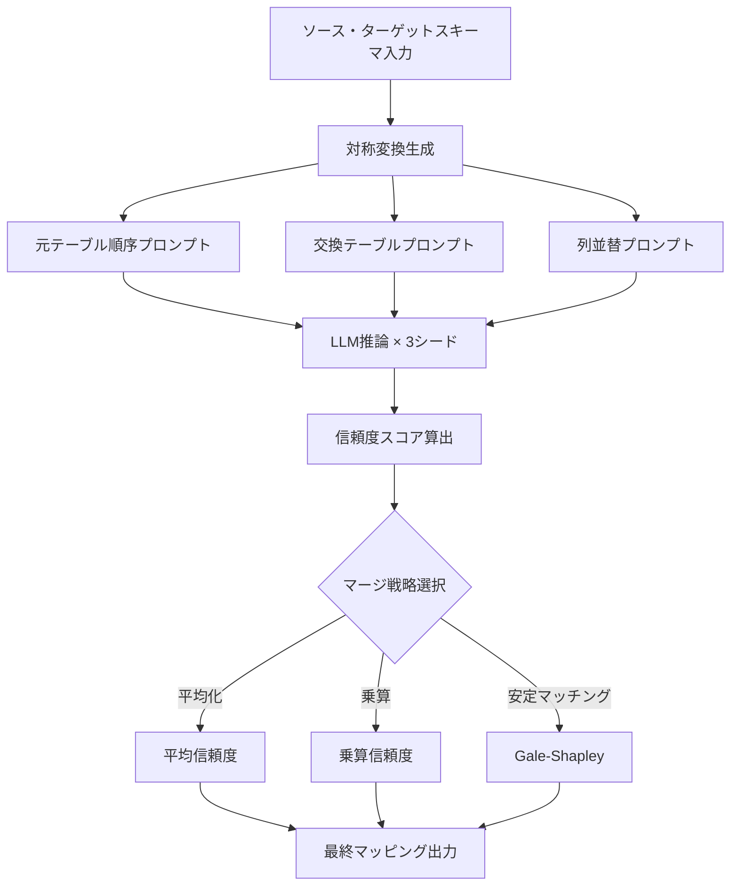
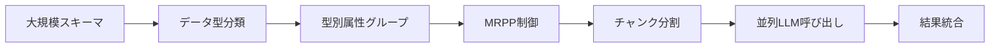
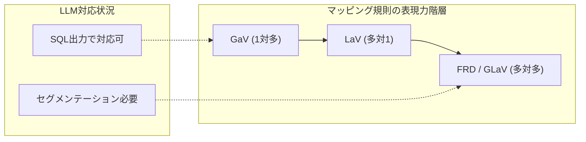

# Towards Scalable Schema Mapping using Large Language Models

## 基本情報

- **タイトル**: Towards Scalable Schema Mapping using Large Language Models
- **著者**: Christopher Buss, Mahdis Safari, Arash Termehchy, Stefan Lee, David Maier
- **所属**: Oregon State University / Portland State University
- **発表年**: 2025
- **arXiv**: [2505.24716](https://arxiv.org/abs/2505.24716)
- **分野**: Databases (cs.DB), Artificial Intelligence (cs.AI)

---

## Abstract

> Data integration systems typically rely on manually written schema mappings to transform data between source and target schemas. These mappings are complex, source-specific, and costly to maintain as data sources evolve. This paper investigates the use of Large Language Models (LLMs) to automate schema mapping while addressing three core scalability challenges: (1) inconsistent outputs due to sensitivity to input phrasing and structure, which are addressed through sampling and aggregation; (2) the need for more expressive mappings (e.g., GLaV) that exceed LLM context limits; and (3) the computational cost of repeated LLM calls, mitigated through data type prefiltering strategies.

**要旨**: データ統合システムにおけるスキーママッピングの自動化にLLMを活用する研究。手動で作成されるスキーママッピングのコスト・複雑性の問題に対し、(1) 出力の不整合性に対するサンプリング・集約手法、(2) GLaVなど高表現力マッピングへの対応、(3) LLM呼び出しコストの削減という3つのスケーラビリティ課題に取り組む。

---

## 1. 概要

スキーママッピングとは、異なるデータソース間でデータを変換するための規則であり、データ統合の中核技術である。従来は専門家が手動で作成していたが、データソースの増加・変化に伴いスケーラビリティが大きな課題となっている。本研究では、LLMを用いたスキーママッピング自動化の可能性と限界を体系的に調査し、3つの技術的課題に対する解決策を提案している。

---

## 2. 問題設定

スキーママッピングの自動化には以下の3つの本質的課題がある：

| 課題 | 内容 | 影響 |
|------|------|------|
| 出力不整合性 | LLMはプロンプトの言い回し・構造に敏感で予測不可能な出力を生成 | マッピング品質のばらつき |
| 表現力の制限 | GLaV等の高度なマッピングは文脈窓を超過 | 複雑なマッピング規則の生成不能 |
| 計算コスト | 繰返しLLM呼び出しによる高コスト | 大規模スキーマへの適用困難 |

### マッピング規則の形式定義

ST-TGDs（Source-to-Target Tuple-Generating Dependencies）として定式化される：

```
∀x (ϕ(x) → ∃y ψ(x,y))
```

- ϕ(x): ソース原子と述語の連言
- ψ(x,y): ターゲット原子と述語の連言
- LRD（Limited Referential Dependencies）: GaV/LaV — 各辺に1関係述語のみ
- FRD（Full Referential Dependencies）: GLaV — 複数述語を許容し複雑な結合条件を表現

---

## 3. 提案手法

### 3.1 課題1: サンプリングと対称変換による出力安定化

```
入力スキーマペア → 対称変換（列並替・データサンプリング・テーブル交換）
  → 複数プロンプト生成 → LLM推論（各プロンプト）
  → 出力集約（union / majority vote / intersection）
  → 安定したマッピング結果
```

**双方向スキーママッチング**:
- 元テーブルと交換テーブルの両方向でマッチング
- LLMのlogitsを用いた信頼度スコア推定
- 3つのマージ手法:
  - **平均化**: 片方向のみのアライメントの信頼度を低下
  - **乗算**: いずれかの方向で欠如するアライメントを除外
  - **安定マッチングアルゴリズム**: Gale-Shapleyアルゴリズムによる相互受容可能なペアリング

### 3.2 課題2: 大規模入力への対応

ルール単位でのセグメンテーションを提案。MRPP（Max Rules Per Prompt）パラメータにより、1回のLLM呼び出しで処理するルール数を制御する。

### 3.3 課題3: データ型プリフィルタリング

属性をNumeric, Text, Date/Time, Booleanに分類し、N-1設定においてターゲット型に一致する属性のみに比較対象を削減する。

---

## 4. アルゴリズム・処理フロー





---

## 5. 図表・視覚要素

### 表1: MIMICデータセットでの性能比較

| 手法 | k | Precision | Recall | F1 |
|------|---|-----------|--------|-----|
| 双方向（安定マッチング） | 1 | 0.68 | 0.62 | 0.64 |
| 双方向（乗算） | 1 | 0.67 | 0.62 | 0.64 |
| 元テーブル集約 | max | 0.35 | 0.79 | 0.47 |
| 交換テーブル集約 | max | 0.47 | 0.67 | 0.54 |
| COMA Schema | max | 0.14 | 0.11 | 0.10 |
| COMA Instance | max | 0.21 | 0.14 | 0.16 |

### 表2: Syntheaデータセットでの性能比較

| 手法 | k | Precision | Recall | F1 |
|------|---|-----------|--------|-----|
| 双方向（安定マッチング） | 2 | 0.77 | 0.55 | 0.62 |
| 双方向（乗算） | 1 | 0.77 | 0.55 | 0.62 |
| 元テーブル集約 | max | 0.57 | 0.95 | 0.70 |

### 表3: GPT-4比較 (Accuracy@1)

| データセット | 双方向安定マッチング | MatchMaker (GPT-4) |
|-------------|---------------------|---------------------|
| MIMIC | 0.78 ± 0.00 | 62.20% ± 2.40% |
| Synthea | 0.69 ± 0.01 | 70.20% ± 1.70% |

### 表4: MRPPとトークン効率

| MRPP | 入力トークン | 出力トークン | 合計 | 削減率 |
|------|-------------|-------------|------|--------|
| 1 | 3,910 | 1,104 | 5,014 | 1.00x |
| 2 | - | - | - | 1.46x |
| 3 | - | - | - | 1.68x |
| 7 | 11,259 | 2,639 | 13,898 | 2.57x |



---

## 6. 実験・評価

### 実験設定

- **使用モデル**: Meta-Llama-3.1-70B-Instruct-GPTQ-INT4（70Bパラメータ、4bit量子化）
- **プロンプト形式**: N-1形式（N個のソース属性と1つのターゲット属性をJSON構造で提示）
- **推論設定**: ゼロショット推論ベース、固定シード×3回

### データセット

| データセット | ペア数 | ソース属性 | ターゲット属性 | マッチ数 |
|-------------|--------|-----------|--------------|---------|
| MIMIC-OMOP | 26 | 268 | 203 | 155 |
| Synthea-OMOP | 12 | 101 | 134 | 105 |
| Amalgam（課題2用） | 4DB | 複数テーブル | 複数テーブル | 7ルール |

### ベースライン

1. **COMA**: スキーマベース規則マッチング
2. **COMA Instance**: データ値を組み込んだマッチング
3. **Parciak et al.**: N-1プロンプティングによる集約
4. **MatchMaker**: GPT-4ベースのプリ・ポストフィルタリングパイプライン

### 主要結果

- **オープンソースモデルの競争力**: 70Bモデルが適切なパイプライン設計によりGPT-4ベースのMatchMakerと同等以上の性能を達成
- **双方向マッチングの効果**: F1スコアで片方向に比べ最大17ポイントの改善
- **チャンキングの効率性**: MRPP=7で2.57倍のトークン削減（ただし性能低下あり）
- **ドメイン依存性**: 医療領域のような意味理解が重要な領域ではLLMが特に有効

---

## 7. 議論・注目点

### 学術的貢献

1. **サンプリング・集約フレームワーク**: LLM出力の不安定性に対する体系的な対処法を提示
2. **GLaVマッピングへの挑戦**: FRD規則生成における根本的課題を明示化
3. **オープンソースモデルの実用性実証**: プロンプト工学により商用モデルに匹敵する性能を実現

### 実務的含意

- データ統合プロジェクトにおけるスキーママッピング自動化の実現可能性を示す
- 医療データ統合（MIMIC、OMOP、Synthea）への直接適用が可能
- トークン効率と性能のトレードオフを定量化し、実用的な指針を提供

### 限界と今後の課題

- FRD/GLaVマッピングの出力表現はまだ課題が残る
- プライバシー制限下でのサンプルデータ利用の制約
- Recallの改善余地（特にMIMICデータセット）
- 大規模スキーマ（数千属性）への適用は未検証

### データ分析エージェントへの示唆

- スキーママッピングの自動化はデータ前処理パイプラインの重要要素
- 双方向マッチングと信頼度スコアの組合わせは他のマッチングタスクにも応用可能
- データ型プリフィルタリングは探索空間削減の汎用的手法として参考になる
