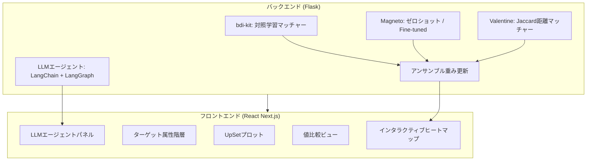
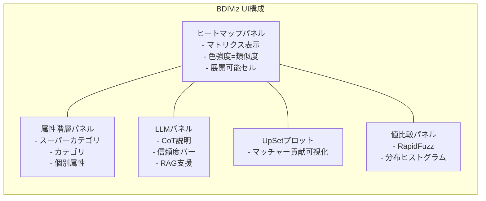
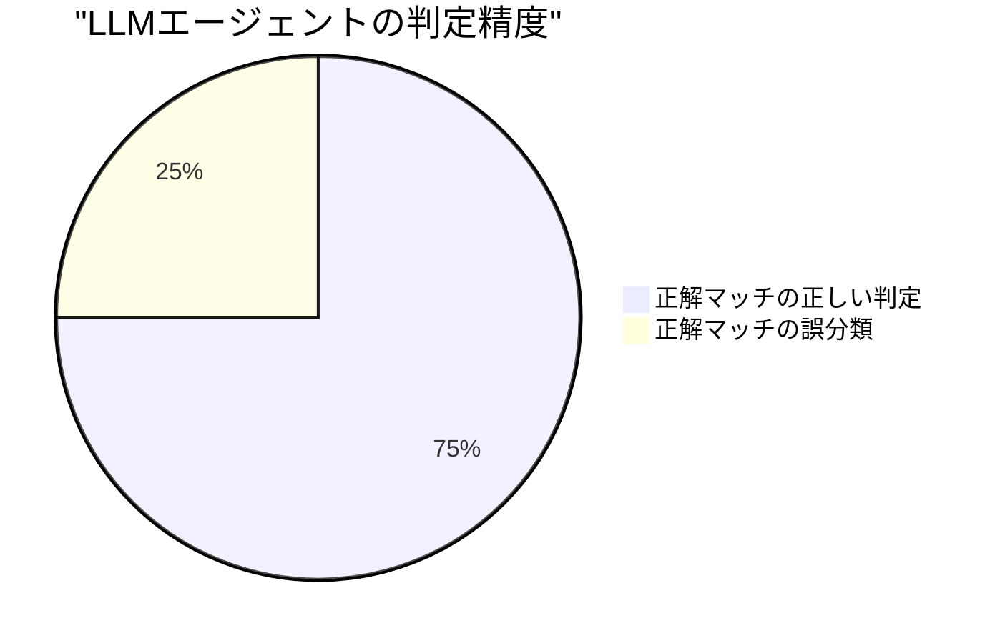
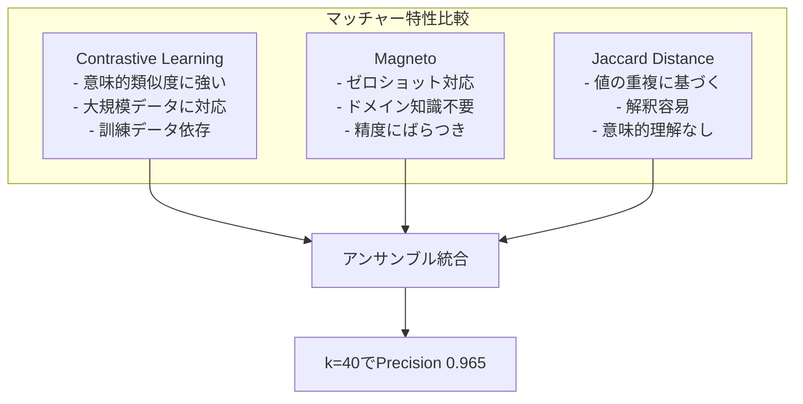

# BDIViz: An Interactive Visualization System for Biomedical Schema Matching with LLM-Powered Validation

## 基本情報

- **タイトル**: BDIViz: An Interactive Visualization System for Biomedical Schema Matching with LLM-Powered Validation
- **著者**: Eden Wu, Dishita G Turakhia, Guande Wu, Christos Koutras, Sarah Keegan, Wenke Liu, Beata Szeitz, David Fenyo, Claudio T. Silva, Juliana Freire
- **所属**: New York University
- **発表年**: 2025
- **arXiv**: [2507.16117](https://arxiv.org/abs/2507.16117)
- **分野**: Human-Computer Interaction (cs.HC)
- **採択**: IEEE VIS 2025 (Full Papers Track)

---

## Abstract

> BDIViz is an open-source visual analytics system designed for biomedical data harmonization through schema matching. It combines multiple matching methods with LLM-based validation, summarizes matches through interactive heatmaps, and provides coordinated views for comparing dataset attributes, demonstrating improvements in accuracy and reduced curation time.

**要旨**: BDIVizは、バイオメディカルデータ統合のためのスキーママッチングに特化したオープンソースの可視的分析システムである。複数のマッチング手法とLLMによるバリデーションを組合わせ、インタラクティブなヒートマップによるマッチ要約と協調ビューを提供することで、精度の向上とキュレーション時間の短縮を実現する。

---

## 1. 概要

バイオメディカル分野では、多数の研究データセットを共通スキーマ（GDC、PDCなど）に統合する「データハーモナイゼーション」が不可欠だが、数百の属性を持つスキーマ間のマッチングは困難を極める。BDIVizは、アンサンブルマッチング、LLMエージェント、インタラクティブ可視化を統合し、専門家のスキーママッチングワークフローを大幅に効率化するシステムである。

---

## 2. 問題設定

バイオメディカルスキーママッチングの具体的課題：

- **スケール**: GDCスキーマは700以上の属性を持ち、10研究・569属性で383,000以上の候補ペアが生成される
- **曖昧性**: 意味的に類似するが異なる属性の区別（例：Tumor Stage A/B vs. Tumor stage）
- **専門知識**: ドメイン固有の命名規則・値分布の理解が必要
- **従来ツールの限界**: Excel/Python/Rでの手動マッチングは時間がかかり見落としが多い

---

## 3. 提案手法

### 3.1 システムアーキテクチャ



### 3.2 Easy Matchの自動識別

属性名と値の両方でファジーマッチングを実施し、高い類似度を示すペアを自動抽出する：

- 値類似度: V = (1/|S|) * Σ max f(s,t)
- 結果: 精度91%、正解ペアの35%をカバー

### 3.3 アンサンブル重み更新アルゴリズム

ユーザーのフィードバック（承認/拒否）に基づき各マッチャーの重みを動的に更新：

```
承認時: w_m ← w_m + α · s_i · (1/r_i)
拒否時: w_m ← w_m - β · s_i · (1/r_i)
```

- s_i: 正規化スコア、r_i: ランク、α/β: 学習率

### 3.4 LLMエージェント

- Chain-of-Thought推論で最大4つの説明を生成
- 各説明にTrue/Falseフラグ、根拠分類（semantic, name, token, value, pattern, history, knowledge, other）、信頼度スコアを付与
- RAGコンポーネント: 検証済みマッチ、ドメイン固有用語、ユーザー修正パターンを蓄積

---

## 4. UIコンポーネント詳細



---

## 5. 図表・視覚要素

### 表1: アンサンブル精度比較

| マッチャー | k=10 | k=20 | k=40 |
|-----------|------|------|------|
| **BDIViz Ensemble** | **0.938** | **0.954** | **0.965** |
| ct_learning | 0.780 | 0.841 | 0.904 |
| magneto_zs | 0.707 | 0.830 | 0.873 |
| magneto_ft | 0.815 | 0.869 | 0.911 |

### 表2: ユーザースタディ定量結果

| 指標 | BDIViz | ベースライン | 効果量 |
|------|--------|------------|--------|
| 認知負荷 (NASA TLX) | M=43.50, SD=18.28 | M=71.42, SD=16.12 | r=0.64 (大) |
| マッチング精度 | M=87.73%, SD=4.41% | M=58.19%, SD=18.17% | +50.77% |
| SUSスコア | 71.87 | - | - |

### 表3: ケーススタディ結果

| ケース | ソース属性数 | ターゲット | 手動結果 | BDIViz結果 | 所要時間 |
|--------|------------|----------|---------|-----------|---------|
| CPTAC (大規模) | 179 | GDCスキーマ | 19マッチ | 29マッチ (+10) | 15分 |
| LUAD (中規模) | 40 | 74属性 | 8マッチ | 13マッチ (+5) | 10分 |

### LLMエージェントの性能特性



---

## 6. 実験・評価

### ユーザースタディ設計

- **参加者**: 12名のバイオメディカル研究者（経験年数: 平均2年）
- **年齢**: 21-27歳 (M=24.58, SD=1.67)
- **形式**: 被験者内比較（BDIViz vs. 従来ツール）
- **タスク**: 2つのスキーママッチングタスク（GDC、PDC）
- **統計手法**: Mann-Whitney U検定、Kaplan-Meier生存分析

### タスク詳細

| タスク | ソースデータ | ターゲットスキーマ | ソース属性 | ターゲット属性 |
|--------|------------|-----------------|-----------|--------------|
| Task 1 (GDC) | Li et al. 腎腫瘍 | CPTAC-3 (GDC) | 18 | 479 |
| Task 2 (PDC) | Woldmar et al. プロテオーム | PDC v3.0.0 | 15 | 452 |

### 統計的検証

- 認知負荷: U=18, z=-3.12, p=0.002, r=0.64（大効果量）
- 完了時間: Log-rank χ²=6.12, p=0.013
- Task 2（曖昧性が高い）でより大きな改善

### ベンチマーク

- 10データセット、各データセットにGDCスキーマへの正解マッピング付き
- GDCスキーマ: 700以上の属性（demographics, diagnosis, pathology, family history）

---

## 7. 議論・注目点

### 学術的貢献

1. **人間-AI協調パラダイム**: アンサンブルマッチング + LLM検証 + インタラクティブ可視化の統合
2. **適応的重み更新**: ユーザーフィードバックによるリアルタイムのマッチャー重み最適化
3. **RAG強化エージェント**: 過去の検証結果・用語関係・修正パターンからの継続学習

### 実務的影響

- パンキャンサー統合（従来数ヶ月 → BDIVizで大幅短縮）
- マッチング精度50.77%向上、認知負荷39%低減
- 手動では見落とされる微妙なマッチの発見（例: pregnancy_count ↔ Num_full_term_pregnancies）

### 限界

- 基盤マッチング手法の性能に依存
- 超大規模スキーマでのヒートマップの視覚的負荷
- LLM説明はモデルの知識限界を継承
- 現在はデータセット-to-スキーマ、データセット-to-データセットのみ（多データセット統合は未対応）
- バイオメディカル領域以外への適用可能性は未検証

### データ分析エージェントへの示唆

- 複数マッチング手法のアンサンブルとユーザーフィードバックの組合わせは、データ前処理の品質保証手法として参考になる
- LLMによるマッチ検証と説明生成は、自動データ統合パイプラインの信頼性向上に直結
- インタラクティブ可視化による人間の意思決定支援は、半自動データ前処理エージェントの設計指針となる

---

## 8. 補足分析

### 8.1 アンサンブルマッチングの技術的深掘り

BDIVizが3つのマッチャーを組合わせる戦略は、個々のマッチャーの弱点を補完する効果的なアプローチである。



### 8.2 ターゲット属性階層の設計

3層の階層構造は、大規模スキーマのナビゲーションを効率化する重要な設計判断である：

| レベル | 例 (GDC) | 属性数 | 役割 |
|--------|---------|--------|------|
| スーパーカテゴリ | clinical, biospecimen | ~5 | 大域的フィルタリング |
| カテゴリ | diagnosis, treatment, exposure | ~20 | 中域的絞込み |
| 個別属性 | tumor_stage, vital_status | 700+ | 具体的マッチング対象 |

### 8.3 LLMエージェントのRAG設計

BDIVizのLLMエージェントは、以下の3種類の知識を蓄積・活用するRAGコンポーネントを持つ：

1. **検証済みマッチ**: 過去にユーザーが承認したマッチペア → 同様のパターンの検出に活用
2. **ドメイン固有用語関係**: 医療用語間の同義語・上位語・下位語関係
3. **ユーザー修正パターン**: 誤分類の修正履歴 → 同種エラーの再発防止

この設計は、スキーママッチングの反復的改善プロセスにおいて、セッション間の知識持続を可能にする。

### 8.4 統計的検証手法の妥当性

小規模サンプル（N=12）での評価に対し、適切な非パラメトリック検定を選択している点は方法論的に堅実である。Mann-Whitney U検定とKaplan-Meier生存分析の組合わせにより、精度・時間・認知負荷の多面的評価を統計的に裏付けている。
